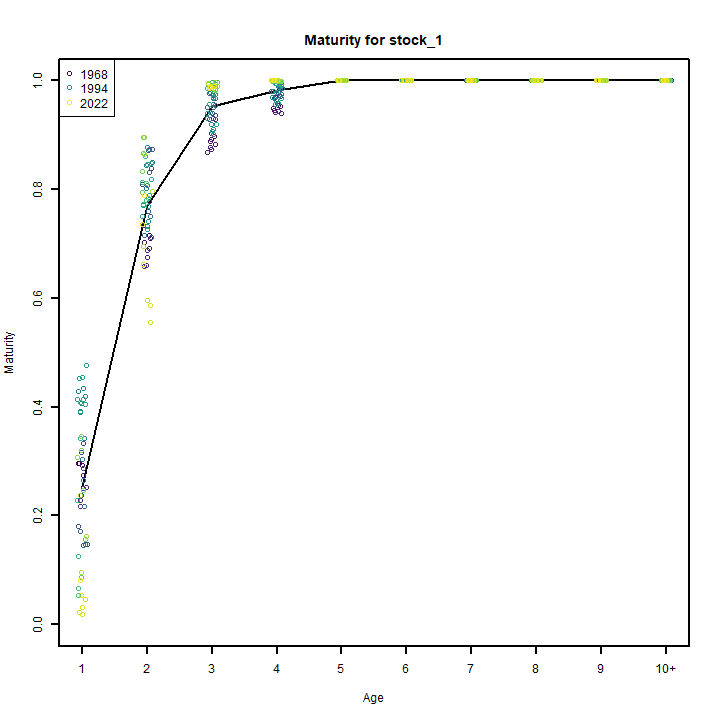
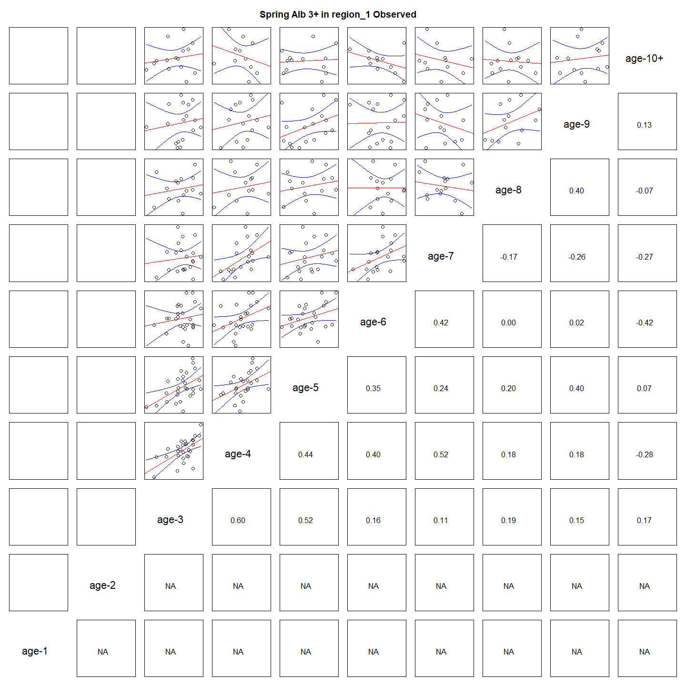
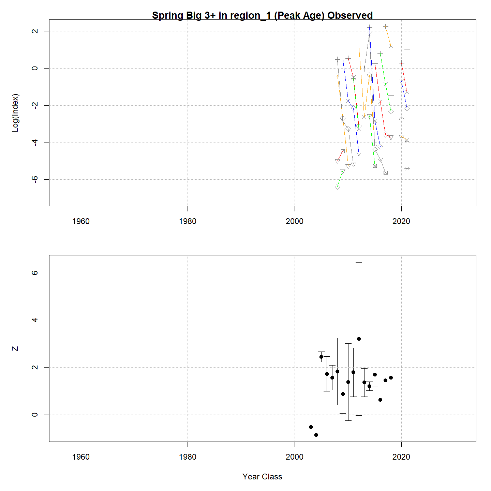

---
output:
  html_document:
    df_print: paged
    keep_md: yes
  word_document: default
  pdf_document:
    fig_caption: yes
    includes:
    keep_tex: yes
    number_sections: no
title: "WHAM figures and tables"
header-includes:
  - \usepackage{longtable}
  - \usepackage{booktabs}
  - \usepackage{caption,graphics}
  - \usepackage{makecell}
  - \usepackage{lscape}
  - \renewcommand\figurename{Fig.}
  - \captionsetup{labelsep=period, singlelinecheck=false}
  - \newcommand{\changesize}[1]{\fontsize{#1pt}{#1pt}\selectfont}
  - \renewcommand{\arraystretch}{1.5}
  - \renewcommand\theadfont{}
---

# {.tabset}

## Figures {.tabset}

### Input

### Diagnostics

### Results

### Retro

### Reference points

### Miscellaneous

## Tables {.tabset}

### Parameter estimates

<table class="table" style="margin-left: auto; margin-right: auto;">
<caption>Parameter estimates, standard errors, and confidence intervals. Rounded to 3 decimal places.</caption>
 <thead>
  <tr>
   <th style="text-align:left;">   </th>
   <th style="text-align:right;"> Estimate </th>
   <th style="text-align:right;"> Std. Error </th>
   <th style="text-align:right;"> 95\% CI lower </th>
   <th style="text-align:right;"> 95\% CI upper </th>
  </tr>
 </thead>
<tbody>
  <tr>
   <td style="text-align:left;"> Combined SSB fully selected q </td>
   <td style="text-align:right;"> $0.002$ </td>
   <td style="text-align:right;"> $3.153\times 10^{-4}$ </td>
   <td style="text-align:right;"> $0.002$ </td>
   <td style="text-align:right;"> $0.003$ </td>
  </tr>
  <tr>
   <td style="text-align:left;"> Spring Big 3+ fully selected q </td>
   <td style="text-align:right;"> $8.754\times 10^{-5}$ </td>
   <td style="text-align:right;"> $1.577\times 10^{-5}$ </td>
   <td style="text-align:right;"> $6.149\times 10^{-5}$ </td>
   <td style="text-align:right;"> $1.246\times 10^{-4}$ </td>
  </tr>
  <tr>
   <td style="text-align:left;"> Spring Alb 3+ fully selected q </td>
   <td style="text-align:right;"> $1.078\times 10^{-5}$ </td>
   <td style="text-align:right;"> $1.653\times 10^{-6}$ </td>
   <td style="text-align:right;"> $7.985\times 10^{-6}$ </td>
   <td style="text-align:right;"> $1.456\times 10^{-5}$ </td>
  </tr>
  <tr>
   <td style="text-align:left;"> Block 1: Combined Selectivity for age 1 </td>
   <td style="text-align:right;"> $0.170$ </td>
   <td style="text-align:right;"> $0.014$ </td>
   <td style="text-align:right;"> $0.144$ </td>
   <td style="text-align:right;"> $0.200$ </td>
  </tr>
  <tr>
   <td style="text-align:left;"> Block 1: Combined Selectivity for age 2 </td>
   <td style="text-align:right;"> $0.477$ </td>
   <td style="text-align:right;"> $0.036$ </td>
   <td style="text-align:right;"> $0.407$ </td>
   <td style="text-align:right;"> $0.547$ </td>
  </tr>
  <tr>
   <td style="text-align:left;"> Block 1: Combined Selectivity for age 3 </td>
   <td style="text-align:right;"> $0.807$ </td>
   <td style="text-align:right;"> $0.060$ </td>
   <td style="text-align:right;"> $0.663$ </td>
   <td style="text-align:right;"> $0.899$ </td>
  </tr>
  <tr>
   <td style="text-align:left;"> Block 1: Combined Selectivity for age 4 </td>
   <td style="text-align:right;"> $0.889$ </td>
   <td style="text-align:right;"> $0.071$ </td>
   <td style="text-align:right;"> $0.663$ </td>
   <td style="text-align:right;"> $0.970$ </td>
  </tr>
  <tr>
   <td style="text-align:left;"> Block 1: Combined Selectivity for age 5 </td>
   <td style="text-align:right;"> $0.923$ </td>
   <td style="text-align:right;"> $0.081$ </td>
   <td style="text-align:right;"> $0.563$ </td>
   <td style="text-align:right;"> $0.991$ </td>
  </tr>
  <tr>
   <td style="text-align:left;"> Block 1: Combined Selectivity for age 6 </td>
   <td style="text-align:right;"> $1.000$ </td>
   <td style="text-align:right;"> -- </td>
   <td style="text-align:right;"> -- </td>
   <td style="text-align:right;"> -- </td>
  </tr>
  <tr>
   <td style="text-align:left;"> Block 1: Combined Selectivity for age 7 </td>
   <td style="text-align:right;"> $1.000$ </td>
   <td style="text-align:right;"> -- </td>
   <td style="text-align:right;"> -- </td>
   <td style="text-align:right;"> -- </td>
  </tr>
  <tr>
   <td style="text-align:left;"> Block 1: Combined Selectivity for age 8 </td>
   <td style="text-align:right;"> $1.000$ </td>
   <td style="text-align:right;"> -- </td>
   <td style="text-align:right;"> -- </td>
   <td style="text-align:right;"> -- </td>
  </tr>
  <tr>
   <td style="text-align:left;"> Block 1: Combined Selectivity for age 9 </td>
   <td style="text-align:right;"> $1.000$ </td>
   <td style="text-align:right;"> -- </td>
   <td style="text-align:right;"> -- </td>
   <td style="text-align:right;"> -- </td>
  </tr>
  <tr>
   <td style="text-align:left;"> Block 1: Combined Selectivity for age 10+ </td>
   <td style="text-align:right;"> $1.000$ </td>
   <td style="text-align:right;"> -- </td>
   <td style="text-align:right;"> -- </td>
   <td style="text-align:right;"> -- </td>
  </tr>
  <tr>
   <td style="text-align:left;"> Block 2: Combined SSB Selectivity for age 1 </td>
   <td style="text-align:right;"> $1.000$ </td>
   <td style="text-align:right;"> -- </td>
   <td style="text-align:right;"> -- </td>
   <td style="text-align:right;"> -- </td>
  </tr>
  <tr>
   <td style="text-align:left;"> Block 2: Combined SSB Selectivity for age 2 </td>
   <td style="text-align:right;"> $1.000$ </td>
   <td style="text-align:right;"> -- </td>
   <td style="text-align:right;"> -- </td>
   <td style="text-align:right;"> -- </td>
  </tr>
  <tr>
   <td style="text-align:left;"> Block 2: Combined SSB Selectivity for age 3 </td>
   <td style="text-align:right;"> $1.000$ </td>
   <td style="text-align:right;"> -- </td>
   <td style="text-align:right;"> -- </td>
   <td style="text-align:right;"> -- </td>
  </tr>
  <tr>
   <td style="text-align:left;"> Block 2: Combined SSB Selectivity for age 4 </td>
   <td style="text-align:right;"> $1.000$ </td>
   <td style="text-align:right;"> -- </td>
   <td style="text-align:right;"> -- </td>
   <td style="text-align:right;"> -- </td>
  </tr>
  <tr>
   <td style="text-align:left;"> Block 2: Combined SSB Selectivity for age 5 </td>
   <td style="text-align:right;"> $1.000$ </td>
   <td style="text-align:right;"> -- </td>
   <td style="text-align:right;"> -- </td>
   <td style="text-align:right;"> -- </td>
  </tr>
  <tr>
   <td style="text-align:left;"> Block 2: Combined SSB Selectivity for age 6 </td>
   <td style="text-align:right;"> $1.000$ </td>
   <td style="text-align:right;"> -- </td>
   <td style="text-align:right;"> -- </td>
   <td style="text-align:right;"> -- </td>
  </tr>
  <tr>
   <td style="text-align:left;"> Block 2: Combined SSB Selectivity for age 7 </td>
   <td style="text-align:right;"> $1.000$ </td>
   <td style="text-align:right;"> -- </td>
   <td style="text-align:right;"> -- </td>
   <td style="text-align:right;"> -- </td>
  </tr>
  <tr>
   <td style="text-align:left;"> Block 2: Combined SSB Selectivity for age 8 </td>
   <td style="text-align:right;"> $1.000$ </td>
   <td style="text-align:right;"> -- </td>
   <td style="text-align:right;"> -- </td>
   <td style="text-align:right;"> -- </td>
  </tr>
  <tr>
   <td style="text-align:left;"> Block 2: Combined SSB Selectivity for age 9 </td>
   <td style="text-align:right;"> $1.000$ </td>
   <td style="text-align:right;"> -- </td>
   <td style="text-align:right;"> -- </td>
   <td style="text-align:right;"> -- </td>
  </tr>
  <tr>
   <td style="text-align:left;"> Block 2: Combined SSB Selectivity for age 10+ </td>
   <td style="text-align:right;"> $1.000$ </td>
   <td style="text-align:right;"> -- </td>
   <td style="text-align:right;"> -- </td>
   <td style="text-align:right;"> -- </td>
  </tr>
  <tr>
   <td style="text-align:left;"> Block 3: Spring Big 3+ Selectivity for age 1 </td>
   <td style="text-align:right;"> $0.000$ </td>
   <td style="text-align:right;"> -- </td>
   <td style="text-align:right;"> -- </td>
   <td style="text-align:right;"> -- </td>
  </tr>
  <tr>
   <td style="text-align:left;"> Block 3: Spring Big 3+ Selectivity for age 2 </td>
   <td style="text-align:right;"> $0.000$ </td>
   <td style="text-align:right;"> -- </td>
   <td style="text-align:right;"> -- </td>
   <td style="text-align:right;"> -- </td>
  </tr>
  <tr>
   <td style="text-align:left;"> Block 3: Spring Big 3+ Selectivity for age 3 </td>
   <td style="text-align:right;"> $1.000$ </td>
   <td style="text-align:right;"> -- </td>
   <td style="text-align:right;"> -- </td>
   <td style="text-align:right;"> -- </td>
  </tr>
  <tr>
   <td style="text-align:left;"> Block 3: Spring Big 3+ Selectivity for age 4 </td>
   <td style="text-align:right;"> $0.552$ </td>
   <td style="text-align:right;"> $0.072$ </td>
   <td style="text-align:right;"> $0.410$ </td>
   <td style="text-align:right;"> $0.686$ </td>
  </tr>
  <tr>
   <td style="text-align:left;"> Block 3: Spring Big 3+ Selectivity for age 5 </td>
   <td style="text-align:right;"> $0.271$ </td>
   <td style="text-align:right;"> $0.080$ </td>
   <td style="text-align:right;"> $0.144$ </td>
   <td style="text-align:right;"> $0.450$ </td>
  </tr>
  <tr>
   <td style="text-align:left;"> Block 3: Spring Big 3+ Selectivity for age 6 </td>
   <td style="text-align:right;"> $0.093$ </td>
   <td style="text-align:right;"> $0.061$ </td>
   <td style="text-align:right;"> $0.024$ </td>
   <td style="text-align:right;"> $0.300$ </td>
  </tr>
  <tr>
   <td style="text-align:left;"> Block 3: Spring Big 3+ Selectivity for age 7 </td>
   <td style="text-align:right;"> $0.300$ </td>
   <td style="text-align:right;"> -- </td>
   <td style="text-align:right;"> -- </td>
   <td style="text-align:right;"> -- </td>
  </tr>
  <tr>
   <td style="text-align:left;"> Block 3: Spring Big 3+ Selectivity for age 8 </td>
   <td style="text-align:right;"> $0.000$ </td>
   <td style="text-align:right;"> -- </td>
   <td style="text-align:right;"> -- </td>
   <td style="text-align:right;"> -- </td>
  </tr>
  <tr>
   <td style="text-align:left;"> Block 3: Spring Big 3+ Selectivity for age 9 </td>
   <td style="text-align:right;"> $0.000$ </td>
   <td style="text-align:right;"> -- </td>
   <td style="text-align:right;"> -- </td>
   <td style="text-align:right;"> -- </td>
  </tr>
  <tr>
   <td style="text-align:left;"> Block 3: Spring Big 3+ Selectivity for age 10+ </td>
   <td style="text-align:right;"> $0.000$ </td>
   <td style="text-align:right;"> -- </td>
   <td style="text-align:right;"> -- </td>
   <td style="text-align:right;"> -- </td>
  </tr>
  <tr>
   <td style="text-align:left;"> Block 4: Spring Alb 3+ Selectivity for age 1 </td>
   <td style="text-align:right;"> $0.000$ </td>
   <td style="text-align:right;"> -- </td>
   <td style="text-align:right;"> -- </td>
   <td style="text-align:right;"> -- </td>
  </tr>
  <tr>
   <td style="text-align:left;"> Block 4: Spring Alb 3+ Selectivity for age 2 </td>
   <td style="text-align:right;"> $0.000$ </td>
   <td style="text-align:right;"> -- </td>
   <td style="text-align:right;"> -- </td>
   <td style="text-align:right;"> -- </td>
  </tr>
  <tr>
   <td style="text-align:left;"> Block 4: Spring Alb 3+ Selectivity for age 3 </td>
   <td style="text-align:right;"> $1.000$ </td>
   <td style="text-align:right;"> -- </td>
   <td style="text-align:right;"> -- </td>
   <td style="text-align:right;"> -- </td>
  </tr>
  <tr>
   <td style="text-align:left;"> Block 4: Spring Alb 3+ Selectivity for age 4 </td>
   <td style="text-align:right;"> $0.611$ </td>
   <td style="text-align:right;"> $0.065$ </td>
   <td style="text-align:right;"> $0.479$ </td>
   <td style="text-align:right;"> $0.728$ </td>
  </tr>
  <tr>
   <td style="text-align:left;"> Block 4: Spring Alb 3+ Selectivity for age 5 </td>
   <td style="text-align:right;"> $0.581$ </td>
   <td style="text-align:right;"> $0.073$ </td>
   <td style="text-align:right;"> $0.435$ </td>
   <td style="text-align:right;"> $0.714$ </td>
  </tr>
  <tr>
   <td style="text-align:left;"> Block 4: Spring Alb 3+ Selectivity for age 6 </td>
   <td style="text-align:right;"> $0.498$ </td>
   <td style="text-align:right;"> $0.078$ </td>
   <td style="text-align:right;"> $0.351$ </td>
   <td style="text-align:right;"> $0.646$ </td>
  </tr>
  <tr>
   <td style="text-align:left;"> Block 4: Spring Alb 3+ Selectivity for age 7 </td>
   <td style="text-align:right;"> $0.442$ </td>
   <td style="text-align:right;"> $0.083$ </td>
   <td style="text-align:right;"> $0.290$ </td>
   <td style="text-align:right;"> $0.606$ </td>
  </tr>
  <tr>
   <td style="text-align:left;"> Block 4: Spring Alb 3+ Selectivity for age 8 </td>
   <td style="text-align:right;"> $0.366$ </td>
   <td style="text-align:right;"> $0.090$ </td>
   <td style="text-align:right;"> $0.213$ </td>
   <td style="text-align:right;"> $0.552$ </td>
  </tr>
  <tr>
   <td style="text-align:left;"> Block 4: Spring Alb 3+ Selectivity for age 9 </td>
   <td style="text-align:right;"> $0.781$ </td>
   <td style="text-align:right;"> $0.198$ </td>
   <td style="text-align:right;"> $0.269$ </td>
   <td style="text-align:right;"> $0.972$ </td>
  </tr>
  <tr>
   <td style="text-align:left;"> Block 4: Spring Alb 3+ Selectivity for age 10+ </td>
   <td style="text-align:right;"> $0.687$ </td>
   <td style="text-align:right;"> $0.171$ </td>
   <td style="text-align:right;"> $0.317$ </td>
   <td style="text-align:right;"> $0.912$ </td>
  </tr>
</tbody>
</table>

### Abundance at age

<table class="table" style="margin-left: auto; margin-right: auto;">
<caption>Abundance at age (1000s) for stock 1 in region 1.</caption>
 <thead>
  <tr>
   <th style="text-align:left;">   </th>
   <th style="text-align:right;"> 1 </th>
   <th style="text-align:right;"> 2 </th>
   <th style="text-align:right;"> 3 </th>
   <th style="text-align:right;"> 4 </th>
   <th style="text-align:right;"> 5 </th>
   <th style="text-align:right;"> 6 </th>
   <th style="text-align:right;"> 7 </th>
   <th style="text-align:right;"> 8 </th>
   <th style="text-align:right;"> 9 </th>
   <th style="text-align:right;"> 10+ </th>
  </tr>
 </thead>
<tbody>
  <tr>
   <td style="text-align:left;"> 1968 </td>
   <td style="text-align:right;"> 4929063 </td>
   <td style="text-align:right;"> 1367889 </td>
   <td style="text-align:right;"> 479054 </td>
   <td style="text-align:right;"> 173350 </td>
   <td style="text-align:right;"> 76791 </td>
   <td style="text-align:right;"> 46999 </td>
   <td style="text-align:right;"> 27229 </td>
   <td style="text-align:right;"> 14729 </td>
   <td style="text-align:right;"> 80635 </td>
   <td style="text-align:right;"> 1067 </td>
  </tr>
  <tr>
   <td style="text-align:left;"> 1969 </td>
   <td style="text-align:right;"> 1446462 </td>
   <td style="text-align:right;"> 3915939 </td>
   <td style="text-align:right;"> 1029471 </td>
   <td style="text-align:right;"> 340088 </td>
   <td style="text-align:right;"> 121290 </td>
   <td style="text-align:right;"> 53409 </td>
   <td style="text-align:right;"> 32245 </td>
   <td style="text-align:right;"> 18681 </td>
   <td style="text-align:right;"> 10106 </td>
   <td style="text-align:right;"> 56055 </td>
  </tr>
  <tr>
   <td style="text-align:left;"> 1970 </td>
   <td style="text-align:right;"> 2717610 </td>
   <td style="text-align:right;"> 1151145 </td>
   <td style="text-align:right;"> 2961435 </td>
   <td style="text-align:right;"> 736855 </td>
   <td style="text-align:right;"> 240113 </td>
   <td style="text-align:right;"> 85153 </td>
   <td style="text-align:right;"> 37017 </td>
   <td style="text-align:right;"> 22349 </td>
   <td style="text-align:right;"> 12948 </td>
   <td style="text-align:right;"> 45855 </td>
  </tr>
  <tr>
   <td style="text-align:left;"> 1971 </td>
   <td style="text-align:right;"> 902084 </td>
   <td style="text-align:right;"> 2136409 </td>
   <td style="text-align:right;"> 841185 </td>
   <td style="text-align:right;"> 2000015 </td>
   <td style="text-align:right;"> 487979 </td>
   <td style="text-align:right;"> 157734 </td>
   <td style="text-align:right;"> 54918 </td>
   <td style="text-align:right;"> 23874 </td>
   <td style="text-align:right;"> 14414 </td>
   <td style="text-align:right;"> 37924 </td>
  </tr>
  <tr>
   <td style="text-align:left;"> 1972 </td>
   <td style="text-align:right;"> 1179920 </td>
   <td style="text-align:right;"> 693199 </td>
   <td style="text-align:right;"> 1464794 </td>
   <td style="text-align:right;"> 510003 </td>
   <td style="text-align:right;"> 1176068 </td>
   <td style="text-align:right;"> 283351 </td>
   <td style="text-align:right;"> 88996 </td>
   <td style="text-align:right;"> 30986 </td>
   <td style="text-align:right;"> 13470 </td>
   <td style="text-align:right;"> 29530 </td>
  </tr>
  <tr>
   <td style="text-align:left;"> 1973 </td>
   <td style="text-align:right;"> 805590 </td>
   <td style="text-align:right;"> 902918 </td>
   <td style="text-align:right;"> 469753 </td>
   <td style="text-align:right;"> 870675 </td>
   <td style="text-align:right;"> 293423 </td>
   <td style="text-align:right;"> 667601 </td>
   <td style="text-align:right;"> 155994 </td>
   <td style="text-align:right;"> 48996 </td>
   <td style="text-align:right;"> 17059 </td>
   <td style="text-align:right;"> 23673 </td>
  </tr>
  <tr>
   <td style="text-align:left;"> 1974 </td>
   <td style="text-align:right;"> 1154140 </td>
   <td style="text-align:right;"> 598493 </td>
   <td style="text-align:right;"> 563242 </td>
   <td style="text-align:right;"> 242691 </td>
   <td style="text-align:right;"> 429221 </td>
   <td style="text-align:right;"> 141882 </td>
   <td style="text-align:right;"> 308905 </td>
   <td style="text-align:right;"> 72180 </td>
   <td style="text-align:right;"> 22671 </td>
   <td style="text-align:right;"> 18847 </td>
  </tr>
  <tr>
   <td style="text-align:left;"> 1975 </td>
   <td style="text-align:right;"> 1022313 </td>
   <td style="text-align:right;"> 845190 </td>
   <td style="text-align:right;"> 358605 </td>
   <td style="text-align:right;"> 271809 </td>
   <td style="text-align:right;"> 110981 </td>
   <td style="text-align:right;"> 191974 </td>
   <td style="text-align:right;"> 60330 </td>
   <td style="text-align:right;"> 131350 </td>
   <td style="text-align:right;"> 30692 </td>
   <td style="text-align:right;"> 17654 </td>
  </tr>
  <tr>
   <td style="text-align:left;"> 1976 </td>
   <td style="text-align:right;"> 172154 </td>
   <td style="text-align:right;"> 732837 </td>
   <td style="text-align:right;"> 477047 </td>
   <td style="text-align:right;"> 156404 </td>
   <td style="text-align:right;"> 111185 </td>
   <td style="text-align:right;"> 44213 </td>
   <td style="text-align:right;"> 72009 </td>
   <td style="text-align:right;"> 22630 </td>
   <td style="text-align:right;"> 49269 </td>
   <td style="text-align:right;"> 18134 </td>
  </tr>
  <tr>
   <td style="text-align:left;"> 1977 </td>
   <td style="text-align:right;"> 36000 </td>
   <td style="text-align:right;"> 117838 </td>
   <td style="text-align:right;"> 363486 </td>
   <td style="text-align:right;"> 167170 </td>
   <td style="text-align:right;"> 50271 </td>
   <td style="text-align:right;"> 34487 </td>
   <td style="text-align:right;"> 12645 </td>
   <td style="text-align:right;"> 20594 </td>
   <td style="text-align:right;"> 6472 </td>
   <td style="text-align:right;"> 19277 </td>
  </tr>
  <tr>
   <td style="text-align:left;"> 1978 </td>
   <td style="text-align:right;"> 49986 </td>
   <td style="text-align:right;"> 27391 </td>
   <td style="text-align:right;"> 78582 </td>
   <td style="text-align:right;"> 210260 </td>
   <td style="text-align:right;"> 93340 </td>
   <td style="text-align:right;"> 27663 </td>
   <td style="text-align:right;"> 18357 </td>
   <td style="text-align:right;"> 6731 </td>
   <td style="text-align:right;"> 10962 </td>
   <td style="text-align:right;"> 13706 </td>
  </tr>
  <tr>
   <td style="text-align:left;"> 1979 </td>
   <td style="text-align:right;"> 131299 </td>
   <td style="text-align:right;"> 39837 </td>
   <td style="text-align:right;"> 20796 </td>
   <td style="text-align:right;"> 56624 </td>
   <td style="text-align:right;"> 149550 </td>
   <td style="text-align:right;"> 66034 </td>
   <td style="text-align:right;"> 19333 </td>
   <td style="text-align:right;"> 12829 </td>
   <td style="text-align:right;"> 4704 </td>
   <td style="text-align:right;"> 17240 </td>
  </tr>
  <tr>
   <td style="text-align:left;"> 1980 </td>
   <td style="text-align:right;"> 27382 </td>
   <td style="text-align:right;"> 103770 </td>
   <td style="text-align:right;"> 29548 </td>
   <td style="text-align:right;"> 14404 </td>
   <td style="text-align:right;"> 38557 </td>
   <td style="text-align:right;"> 101121 </td>
   <td style="text-align:right;"> 43941 </td>
   <td style="text-align:right;"> 12865 </td>
   <td style="text-align:right;"> 8537 </td>
   <td style="text-align:right;"> 14602 </td>
  </tr>
  <tr>
   <td style="text-align:left;"> 1981 </td>
   <td style="text-align:right;"> 180508 </td>
   <td style="text-align:right;"> 21780 </td>
   <td style="text-align:right;"> 78351 </td>
   <td style="text-align:right;"> 21092 </td>
   <td style="text-align:right;"> 10140 </td>
   <td style="text-align:right;"> 26986 </td>
   <td style="text-align:right;"> 69852 </td>
   <td style="text-align:right;"> 30354 </td>
   <td style="text-align:right;"> 8887 </td>
   <td style="text-align:right;"> 15984 </td>
  </tr>
  <tr>
   <td style="text-align:left;"> 1982 </td>
   <td style="text-align:right;"> 436416 </td>
   <td style="text-align:right;"> 142387 </td>
   <td style="text-align:right;"> 16067 </td>
   <td style="text-align:right;"> 53774 </td>
   <td style="text-align:right;"> 14218 </td>
   <td style="text-align:right;"> 6785 </td>
   <td style="text-align:right;"> 17755 </td>
   <td style="text-align:right;"> 45958 </td>
   <td style="text-align:right;"> 19971 </td>
   <td style="text-align:right;"> 16363 </td>
  </tr>
  <tr>
   <td style="text-align:left;"> 1983 </td>
   <td style="text-align:right;"> 2100065 </td>
   <td style="text-align:right;"> 344756 </td>
   <td style="text-align:right;"> 105474 </td>
   <td style="text-align:right;"> 11104 </td>
   <td style="text-align:right;"> 36528 </td>
   <td style="text-align:right;"> 9590 </td>
   <td style="text-align:right;"> 4503 </td>
   <td style="text-align:right;"> 11783 </td>
   <td style="text-align:right;"> 30499 </td>
   <td style="text-align:right;"> 24113 </td>
  </tr>
  <tr>
   <td style="text-align:left;"> 1984 </td>
   <td style="text-align:right;"> 88629 </td>
   <td style="text-align:right;"> 1668265 </td>
   <td style="text-align:right;"> 259397 </td>
   <td style="text-align:right;"> 74846 </td>
   <td style="text-align:right;"> 7766 </td>
   <td style="text-align:right;"> 25393 </td>
   <td style="text-align:right;"> 6576 </td>
   <td style="text-align:right;"> 3087 </td>
   <td style="text-align:right;"> 8080 </td>
   <td style="text-align:right;"> 37449 </td>
  </tr>
  <tr>
   <td style="text-align:left;"> 1985 </td>
   <td style="text-align:right;"> 188074 </td>
   <td style="text-align:right;"> 71004 </td>
   <td style="text-align:right;"> 1285313 </td>
   <td style="text-align:right;"> 191607 </td>
   <td style="text-align:right;"> 54709 </td>
   <td style="text-align:right;"> 5652 </td>
   <td style="text-align:right;"> 18300 </td>
   <td style="text-align:right;"> 4739 </td>
   <td style="text-align:right;"> 2225 </td>
   <td style="text-align:right;"> 32811 </td>
  </tr>
  <tr>
   <td style="text-align:left;"> 1986 </td>
   <td style="text-align:right;"> 92111 </td>
   <td style="text-align:right;"> 149360 </td>
   <td style="text-align:right;"> 53381 </td>
   <td style="text-align:right;"> 910813 </td>
   <td style="text-align:right;"> 133797 </td>
   <td style="text-align:right;"> 37972 </td>
   <td style="text-align:right;"> 3869 </td>
   <td style="text-align:right;"> 12527 </td>
   <td style="text-align:right;"> 3244 </td>
   <td style="text-align:right;"> 23984 </td>
  </tr>
  <tr>
   <td style="text-align:left;"> 1987 </td>
   <td style="text-align:right;"> 117889 </td>
   <td style="text-align:right;"> 73092 </td>
   <td style="text-align:right;"> 112035 </td>
   <td style="text-align:right;"> 37683 </td>
   <td style="text-align:right;"> 633340 </td>
   <td style="text-align:right;"> 92459 </td>
   <td style="text-align:right;"> 25871 </td>
   <td style="text-align:right;"> 2636 </td>
   <td style="text-align:right;"> 8535 </td>
   <td style="text-align:right;"> 18551 </td>
  </tr>
  <tr>
   <td style="text-align:left;"> 1988 </td>
   <td style="text-align:right;"> 403811 </td>
   <td style="text-align:right;"> 92297 </td>
   <td style="text-align:right;"> 52802 </td>
   <td style="text-align:right;"> 74207 </td>
   <td style="text-align:right;"> 24427 </td>
   <td style="text-align:right;"> 406909 </td>
   <td style="text-align:right;"> 58211 </td>
   <td style="text-align:right;"> 16288 </td>
   <td style="text-align:right;"> 1660 </td>
   <td style="text-align:right;"> 17053 </td>
  </tr>
  <tr>
   <td style="text-align:left;"> 1989 </td>
   <td style="text-align:right;"> 536181 </td>
   <td style="text-align:right;"> 312994 </td>
   <td style="text-align:right;"> 64829 </td>
   <td style="text-align:right;"> 33349 </td>
   <td style="text-align:right;"> 45647 </td>
   <td style="text-align:right;"> 14863 </td>
   <td style="text-align:right;"> 241519 </td>
   <td style="text-align:right;"> 34551 </td>
   <td style="text-align:right;"> 9668 </td>
   <td style="text-align:right;"> 11107 </td>
  </tr>
  <tr>
   <td style="text-align:left;"> 1990 </td>
   <td style="text-align:right;"> 110347 </td>
   <td style="text-align:right;"> 415079 </td>
   <td style="text-align:right;"> 219083 </td>
   <td style="text-align:right;"> 40706 </td>
   <td style="text-align:right;"> 20382 </td>
   <td style="text-align:right;"> 27588 </td>
   <td style="text-align:right;"> 8758 </td>
   <td style="text-align:right;"> 142312 </td>
   <td style="text-align:right;"> 20359 </td>
   <td style="text-align:right;"> 12241 </td>
  </tr>
  <tr>
   <td style="text-align:left;"> 1991 </td>
   <td style="text-align:right;"> 185719 </td>
   <td style="text-align:right;"> 83357 </td>
   <td style="text-align:right;"> 271285 </td>
   <td style="text-align:right;"> 122483 </td>
   <td style="text-align:right;"> 21890 </td>
   <td style="text-align:right;"> 10787 </td>
   <td style="text-align:right;"> 14078 </td>
   <td style="text-align:right;"> 4469 </td>
   <td style="text-align:right;"> 72618 </td>
   <td style="text-align:right;"> 16635 </td>
  </tr>
  <tr>
   <td style="text-align:left;"> 1992 </td>
   <td style="text-align:right;"> 196536 </td>
   <td style="text-align:right;"> 142451 </td>
   <td style="text-align:right;"> 56857 </td>
   <td style="text-align:right;"> 163043 </td>
   <td style="text-align:right;"> 71331 </td>
   <td style="text-align:right;"> 12584 </td>
   <td style="text-align:right;"> 6020 </td>
   <td style="text-align:right;"> 7857 </td>
   <td style="text-align:right;"> 2494 </td>
   <td style="text-align:right;"> 49814 </td>
  </tr>
  <tr>
   <td style="text-align:left;"> 1993 </td>
   <td style="text-align:right;"> 37627 </td>
   <td style="text-align:right;"> 153163 </td>
   <td style="text-align:right;"> 101586 </td>
   <td style="text-align:right;"> 36845 </td>
   <td style="text-align:right;"> 103171 </td>
   <td style="text-align:right;"> 44697 </td>
   <td style="text-align:right;"> 7711 </td>
   <td style="text-align:right;"> 3689 </td>
   <td style="text-align:right;"> 4814 </td>
   <td style="text-align:right;"> 32052 </td>
  </tr>
  <tr>
   <td style="text-align:left;"> 1994 </td>
   <td style="text-align:right;"> 145640 </td>
   <td style="text-align:right;"> 29320 </td>
   <td style="text-align:right;"> 109192 </td>
   <td style="text-align:right;"> 65797 </td>
   <td style="text-align:right;"> 23302 </td>
   <td style="text-align:right;"> 64610 </td>
   <td style="text-align:right;"> 27370 </td>
   <td style="text-align:right;"> 4722 </td>
   <td style="text-align:right;"> 2259 </td>
   <td style="text-align:right;"> 22575 </td>
  </tr>
  <tr>
   <td style="text-align:left;"> 1995 </td>
   <td style="text-align:right;"> 170533 </td>
   <td style="text-align:right;"> 112207 </td>
   <td style="text-align:right;"> 20249 </td>
   <td style="text-align:right;"> 67022 </td>
   <td style="text-align:right;"> 39219 </td>
   <td style="text-align:right;"> 13722 </td>
   <td style="text-align:right;"> 37014 </td>
   <td style="text-align:right;"> 15680 </td>
   <td style="text-align:right;"> 2705 </td>
   <td style="text-align:right;"> 14227 </td>
  </tr>
  <tr>
   <td style="text-align:left;"> 1996 </td>
   <td style="text-align:right;"> 171789 </td>
   <td style="text-align:right;"> 132682 </td>
   <td style="text-align:right;"> 79653 </td>
   <td style="text-align:right;"> 13021 </td>
   <td style="text-align:right;"> 42051 </td>
   <td style="text-align:right;"> 24358 </td>
   <td style="text-align:right;"> 8328 </td>
   <td style="text-align:right;"> 22464 </td>
   <td style="text-align:right;"> 9516 </td>
   <td style="text-align:right;"> 10276 </td>
  </tr>
  <tr>
   <td style="text-align:left;"> 1997 </td>
   <td style="text-align:right;"> 223400 </td>
   <td style="text-align:right;"> 129049 </td>
   <td style="text-align:right;"> 85376 </td>
   <td style="text-align:right;"> 43371 </td>
   <td style="text-align:right;"> 6802 </td>
   <td style="text-align:right;"> 21592 </td>
   <td style="text-align:right;"> 12029 </td>
   <td style="text-align:right;"> 4113 </td>
   <td style="text-align:right;"> 11094 </td>
   <td style="text-align:right;"> 9774 </td>
  </tr>
  <tr>
   <td style="text-align:left;"> 1998 </td>
   <td style="text-align:right;"> 108277 </td>
   <td style="text-align:right;"> 166853 </td>
   <td style="text-align:right;"> 81707 </td>
   <td style="text-align:right;"> 45232 </td>
   <td style="text-align:right;"> 21982 </td>
   <td style="text-align:right;"> 3385 </td>
   <td style="text-align:right;"> 10308 </td>
   <td style="text-align:right;"> 5742 </td>
   <td style="text-align:right;"> 1963 </td>
   <td style="text-align:right;"> 9962 </td>
  </tr>
  <tr>
   <td style="text-align:left;"> 1999 </td>
   <td style="text-align:right;"> 176638 </td>
   <td style="text-align:right;"> 80969 </td>
   <td style="text-align:right;"> 106005 </td>
   <td style="text-align:right;"> 43540 </td>
   <td style="text-align:right;"> 23072 </td>
   <td style="text-align:right;"> 11013 </td>
   <td style="text-align:right;"> 1628 </td>
   <td style="text-align:right;"> 4956 </td>
   <td style="text-align:right;"> 2761 </td>
   <td style="text-align:right;"> 5734 </td>
  </tr>
  <tr>
   <td style="text-align:left;"> 2000 </td>
   <td style="text-align:right;"> 1168163 </td>
   <td style="text-align:right;"> 132376 </td>
   <td style="text-align:right;"> 51755 </td>
   <td style="text-align:right;"> 57072 </td>
   <td style="text-align:right;"> 22463 </td>
   <td style="text-align:right;"> 11696 </td>
   <td style="text-align:right;"> 5363 </td>
   <td style="text-align:right;"> 793 </td>
   <td style="text-align:right;"> 2414 </td>
   <td style="text-align:right;"> 4137 </td>
  </tr>
  <tr>
   <td style="text-align:left;"> 2001 </td>
   <td style="text-align:right;"> 198893 </td>
   <td style="text-align:right;"> 912751 </td>
   <td style="text-align:right;"> 95095 </td>
   <td style="text-align:right;"> 33957 </td>
   <td style="text-align:right;"> 36611 </td>
   <td style="text-align:right;"> 14276 </td>
   <td style="text-align:right;"> 7277 </td>
   <td style="text-align:right;"> 3337 </td>
   <td style="text-align:right;"> 493 </td>
   <td style="text-align:right;"> 4076 </td>
  </tr>
  <tr>
   <td style="text-align:left;"> 2002 </td>
   <td style="text-align:right;"> 159094 </td>
   <td style="text-align:right;"> 155768 </td>
   <td style="text-align:right;"> 659966 </td>
   <td style="text-align:right;"> 63083 </td>
   <td style="text-align:right;"> 22049 </td>
   <td style="text-align:right;"> 23563 </td>
   <td style="text-align:right;"> 9005 </td>
   <td style="text-align:right;"> 4590 </td>
   <td style="text-align:right;"> 2105 </td>
   <td style="text-align:right;"> 2882 </td>
  </tr>
  <tr>
   <td style="text-align:left;"> 2003 </td>
   <td style="text-align:right;"> 371160 </td>
   <td style="text-align:right;"> 123297 </td>
   <td style="text-align:right;"> 109368 </td>
   <td style="text-align:right;"> 416562 </td>
   <td style="text-align:right;"> 38777 </td>
   <td style="text-align:right;"> 13406 </td>
   <td style="text-align:right;"> 13975 </td>
   <td style="text-align:right;"> 5341 </td>
   <td style="text-align:right;"> 2722 </td>
   <td style="text-align:right;"> 2958 </td>
  </tr>
  <tr>
   <td style="text-align:left;"> 2004 </td>
   <td style="text-align:right;"> 794174 </td>
   <td style="text-align:right;"> 281812 </td>
   <td style="text-align:right;"> 81743 </td>
   <td style="text-align:right;"> 62642 </td>
   <td style="text-align:right;"> 230069 </td>
   <td style="text-align:right;"> 21098 </td>
   <td style="text-align:right;"> 7049 </td>
   <td style="text-align:right;"> 7348 </td>
   <td style="text-align:right;"> 2808 </td>
   <td style="text-align:right;"> 2987 </td>
  </tr>
  <tr>
   <td style="text-align:left;"> 2005 </td>
   <td style="text-align:right;"> 199131 </td>
   <td style="text-align:right;"> 572586 </td>
   <td style="text-align:right;"> 161646 </td>
   <td style="text-align:right;"> 36638 </td>
   <td style="text-align:right;"> 26406 </td>
   <td style="text-align:right;"> 94563 </td>
   <td style="text-align:right;"> 8186 </td>
   <td style="text-align:right;"> 2735 </td>
   <td style="text-align:right;"> 2851 </td>
   <td style="text-align:right;"> 2248 </td>
  </tr>
  <tr>
   <td style="text-align:left;"> 2006 </td>
   <td style="text-align:right;"> 399768 </td>
   <td style="text-align:right;"> 143563 </td>
   <td style="text-align:right;"> 328386 </td>
   <td style="text-align:right;"> 72434 </td>
   <td style="text-align:right;"> 15441 </td>
   <td style="text-align:right;"> 10851 </td>
   <td style="text-align:right;"> 36680 </td>
   <td style="text-align:right;"> 3175 </td>
   <td style="text-align:right;"> 1061 </td>
   <td style="text-align:right;"> 1978 </td>
  </tr>
  <tr>
   <td style="text-align:left;"> 2007 </td>
   <td style="text-align:right;"> 112382 </td>
   <td style="text-align:right;"> 274154 </td>
   <td style="text-align:right;"> 71583 </td>
   <td style="text-align:right;"> 116107 </td>
   <td style="text-align:right;"> 23512 </td>
   <td style="text-align:right;"> 4838 </td>
   <td style="text-align:right;"> 3138 </td>
   <td style="text-align:right;"> 10607 </td>
   <td style="text-align:right;"> 918 </td>
   <td style="text-align:right;"> 879 </td>
  </tr>
  <tr>
   <td style="text-align:left;"> 2008 </td>
   <td style="text-align:right;"> 237352 </td>
   <td style="text-align:right;"> 77497 </td>
   <td style="text-align:right;"> 138830 </td>
   <td style="text-align:right;"> 25981 </td>
   <td style="text-align:right;"> 38792 </td>
   <td style="text-align:right;"> 7592 </td>
   <td style="text-align:right;"> 1445 </td>
   <td style="text-align:right;"> 937 </td>
   <td style="text-align:right;"> 3168 </td>
   <td style="text-align:right;"> 537 </td>
  </tr>
  <tr>
   <td style="text-align:left;"> 2009 </td>
   <td style="text-align:right;"> 198747 </td>
   <td style="text-align:right;"> 163887 </td>
   <td style="text-align:right;"> 39387 </td>
   <td style="text-align:right;"> 50699 </td>
   <td style="text-align:right;"> 8739 </td>
   <td style="text-align:right;"> 12614 </td>
   <td style="text-align:right;"> 2285 </td>
   <td style="text-align:right;"> 435 </td>
   <td style="text-align:right;"> 282 </td>
   <td style="text-align:right;"> 1115 </td>
  </tr>
  <tr>
   <td style="text-align:left;"> 2010 </td>
   <td style="text-align:right;"> 31344 </td>
   <td style="text-align:right;"> 122024 </td>
   <td style="text-align:right;"> 59959 </td>
   <td style="text-align:right;"> 8244 </td>
   <td style="text-align:right;"> 9236 </td>
   <td style="text-align:right;"> 1504 </td>
   <td style="text-align:right;"> 1905 </td>
   <td style="text-align:right;"> 345 </td>
   <td style="text-align:right;"> 66 </td>
   <td style="text-align:right;"> 211 </td>
  </tr>
  <tr>
   <td style="text-align:left;"> 2011 </td>
   <td style="text-align:right;"> 133194 </td>
   <td style="text-align:right;"> 17499 </td>
   <td style="text-align:right;"> 34217 </td>
   <td style="text-align:right;"> 8000 </td>
   <td style="text-align:right;"> 914 </td>
   <td style="text-align:right;"> 949 </td>
   <td style="text-align:right;"> 130 </td>
   <td style="text-align:right;"> 165 </td>
   <td style="text-align:right;"> 30 </td>
   <td style="text-align:right;"> 24 </td>
  </tr>
  <tr>
   <td style="text-align:left;"> 2012 </td>
   <td style="text-align:right;"> 91364 </td>
   <td style="text-align:right;"> 88300 </td>
   <td style="text-align:right;"> 7936 </td>
   <td style="text-align:right;"> 10304 </td>
   <td style="text-align:right;"> 2176 </td>
   <td style="text-align:right;"> 238 </td>
   <td style="text-align:right;"> 225 </td>
   <td style="text-align:right;"> 31 </td>
   <td style="text-align:right;"> 39 </td>
   <td style="text-align:right;"> 13 </td>
  </tr>
  <tr>
   <td style="text-align:left;"> 2013 </td>
   <td style="text-align:right;"> 41489 </td>
   <td style="text-align:right;"> 59310 </td>
   <td style="text-align:right;"> 37759 </td>
   <td style="text-align:right;"> 2163 </td>
   <td style="text-align:right;"> 2511 </td>
   <td style="text-align:right;"> 506 </td>
   <td style="text-align:right;"> 50 </td>
   <td style="text-align:right;"> 47 </td>
   <td style="text-align:right;"> 6 </td>
   <td style="text-align:right;"> 11 </td>
  </tr>
  <tr>
   <td style="text-align:left;"> 2014 </td>
   <td style="text-align:right;"> 83296 </td>
   <td style="text-align:right;"> 27371 </td>
   <td style="text-align:right;"> 26535 </td>
   <td style="text-align:right;"> 11112 </td>
   <td style="text-align:right;"> 574 </td>
   <td style="text-align:right;"> 638 </td>
   <td style="text-align:right;"> 117 </td>
   <td style="text-align:right;"> 12 </td>
   <td style="text-align:right;"> 11 </td>
   <td style="text-align:right;"> 4 </td>
  </tr>
  <tr>
   <td style="text-align:left;"> 2015 </td>
   <td style="text-align:right;"> 130462 </td>
   <td style="text-align:right;"> 55808 </td>
   <td style="text-align:right;"> 12786 </td>
   <td style="text-align:right;"> 8401 </td>
   <td style="text-align:right;"> 3194 </td>
   <td style="text-align:right;"> 158 </td>
   <td style="text-align:right;"> 161 </td>
   <td style="text-align:right;"> 29 </td>
   <td style="text-align:right;"> 3 </td>
   <td style="text-align:right;"> 4 </td>
  </tr>
  <tr>
   <td style="text-align:left;"> 2016 </td>
   <td style="text-align:right;"> 314655 </td>
   <td style="text-align:right;"> 88386 </td>
   <td style="text-align:right;"> 26894 </td>
   <td style="text-align:right;"> 4267 </td>
   <td style="text-align:right;"> 2559 </td>
   <td style="text-align:right;"> 937 </td>
   <td style="text-align:right;"> 43 </td>
   <td style="text-align:right;"> 43 </td>
   <td style="text-align:right;"> 8 </td>
   <td style="text-align:right;"> 2 </td>
  </tr>
  <tr>
   <td style="text-align:left;"> 2017 </td>
   <td style="text-align:right;"> 23408 </td>
   <td style="text-align:right;"> 222403 </td>
   <td style="text-align:right;"> 47959 </td>
   <td style="text-align:right;"> 10972 </td>
   <td style="text-align:right;"> 1622 </td>
   <td style="text-align:right;"> 945 </td>
   <td style="text-align:right;"> 323 </td>
   <td style="text-align:right;"> 15 </td>
   <td style="text-align:right;"> 15 </td>
   <td style="text-align:right;"> 3 </td>
  </tr>
  <tr>
   <td style="text-align:left;"> 2018 </td>
   <td style="text-align:right;"> 104553 </td>
   <td style="text-align:right;"> 16675 </td>
   <td style="text-align:right;"> 123351 </td>
   <td style="text-align:right;"> 20306 </td>
   <td style="text-align:right;"> 4344 </td>
   <td style="text-align:right;"> 625 </td>
   <td style="text-align:right;"> 342 </td>
   <td style="text-align:right;"> 117 </td>
   <td style="text-align:right;"> 5 </td>
   <td style="text-align:right;"> 7 </td>
  </tr>
  <tr>
   <td style="text-align:left;"> 2019 </td>
   <td style="text-align:right;"> 50807 </td>
   <td style="text-align:right;"> 74335 </td>
   <td style="text-align:right;"> 9198 </td>
   <td style="text-align:right;"> 51745 </td>
   <td style="text-align:right;"> 7958 </td>
   <td style="text-align:right;"> 1655 </td>
   <td style="text-align:right;"> 223 </td>
   <td style="text-align:right;"> 122 </td>
   <td style="text-align:right;"> 42 </td>
   <td style="text-align:right;"> 4 </td>
  </tr>
  <tr>
   <td style="text-align:left;"> 2020 </td>
   <td style="text-align:right;"> 63282 </td>
   <td style="text-align:right;"> 36276 </td>
   <td style="text-align:right;"> 41493 </td>
   <td style="text-align:right;"> 3937 </td>
   <td style="text-align:right;"> 20732 </td>
   <td style="text-align:right;"> 3103 </td>
   <td style="text-align:right;"> 607 </td>
   <td style="text-align:right;"> 82 </td>
   <td style="text-align:right;"> 45 </td>
   <td style="text-align:right;"> 17 </td>
  </tr>
  <tr>
   <td style="text-align:left;"> 2021 </td>
   <td style="text-align:right;"> 63575 </td>
   <td style="text-align:right;"> 42123 </td>
   <td style="text-align:right;"> 16640 </td>
   <td style="text-align:right;"> 12738 </td>
   <td style="text-align:right;"> 1094 </td>
   <td style="text-align:right;"> 5527 </td>
   <td style="text-align:right;"> 753 </td>
   <td style="text-align:right;"> 147 </td>
   <td style="text-align:right;"> 20 </td>
   <td style="text-align:right;"> 15 </td>
  </tr>
  <tr>
   <td style="text-align:left;"> 2022 </td>
   <td style="text-align:right;"> 230979 </td>
   <td style="text-align:right;"> 41944 </td>
   <td style="text-align:right;"> 18848 </td>
   <td style="text-align:right;"> 4898 </td>
   <td style="text-align:right;"> 3378 </td>
   <td style="text-align:right;"> 278 </td>
   <td style="text-align:right;"> 1273 </td>
   <td style="text-align:right;"> 174 </td>
   <td style="text-align:right;"> 34 </td>
   <td style="text-align:right;"> 8 </td>
  </tr>
</tbody>
</table>

### Fishing mortality at age by region

<table class="table" style="margin-left: auto; margin-right: auto;">
<caption>Total fishing mortality at age in region 1.</caption>
 <thead>
  <tr>
   <th style="text-align:left;">   </th>
   <th style="text-align:right;"> 1 </th>
   <th style="text-align:right;"> 2 </th>
   <th style="text-align:right;"> 3 </th>
   <th style="text-align:right;"> 4 </th>
   <th style="text-align:right;"> 5 </th>
   <th style="text-align:right;"> 6 </th>
   <th style="text-align:right;"> 7 </th>
   <th style="text-align:right;"> 8 </th>
   <th style="text-align:right;"> 9 </th>
   <th style="text-align:right;"> 10+ </th>
  </tr>
 </thead>
<tbody>
  <tr>
   <td style="text-align:left;"> 1968 </td>
   <td style="text-align:right;"> 0.030 </td>
   <td style="text-align:right;"> 0.084 </td>
   <td style="text-align:right;"> 0.143 </td>
   <td style="text-align:right;"> 0.157 </td>
   <td style="text-align:right;"> 0.163 </td>
   <td style="text-align:right;"> 0.177 </td>
   <td style="text-align:right;"> 0.177 </td>
   <td style="text-align:right;"> 0.177 </td>
   <td style="text-align:right;"> 0.177 </td>
   <td style="text-align:right;"> 0.177 </td>
  </tr>
  <tr>
   <td style="text-align:left;"> 1969 </td>
   <td style="text-align:right;"> 0.028 </td>
   <td style="text-align:right;"> 0.079 </td>
   <td style="text-align:right;"> 0.134 </td>
   <td style="text-align:right;"> 0.148 </td>
   <td style="text-align:right;"> 0.154 </td>
   <td style="text-align:right;"> 0.167 </td>
   <td style="text-align:right;"> 0.167 </td>
   <td style="text-align:right;"> 0.167 </td>
   <td style="text-align:right;"> 0.167 </td>
   <td style="text-align:right;"> 0.167 </td>
  </tr>
  <tr>
   <td style="text-align:left;"> 1970 </td>
   <td style="text-align:right;"> 0.041 </td>
   <td style="text-align:right;"> 0.114 </td>
   <td style="text-align:right;"> 0.193 </td>
   <td style="text-align:right;"> 0.212 </td>
   <td style="text-align:right;"> 0.220 </td>
   <td style="text-align:right;"> 0.239 </td>
   <td style="text-align:right;"> 0.239 </td>
   <td style="text-align:right;"> 0.239 </td>
   <td style="text-align:right;"> 0.239 </td>
   <td style="text-align:right;"> 0.239 </td>
  </tr>
  <tr>
   <td style="text-align:left;"> 1971 </td>
   <td style="text-align:right;"> 0.063 </td>
   <td style="text-align:right;"> 0.177 </td>
   <td style="text-align:right;"> 0.300 </td>
   <td style="text-align:right;"> 0.331 </td>
   <td style="text-align:right;"> 0.344 </td>
   <td style="text-align:right;"> 0.372 </td>
   <td style="text-align:right;"> 0.372 </td>
   <td style="text-align:right;"> 0.372 </td>
   <td style="text-align:right;"> 0.372 </td>
   <td style="text-align:right;"> 0.372 </td>
  </tr>
  <tr>
   <td style="text-align:left;"> 1972 </td>
   <td style="text-align:right;"> 0.068 </td>
   <td style="text-align:right;"> 0.189 </td>
   <td style="text-align:right;"> 0.320 </td>
   <td style="text-align:right;"> 0.353 </td>
   <td style="text-align:right;"> 0.366 </td>
   <td style="text-align:right;"> 0.397 </td>
   <td style="text-align:right;"> 0.397 </td>
   <td style="text-align:right;"> 0.397 </td>
   <td style="text-align:right;"> 0.397 </td>
   <td style="text-align:right;"> 0.397 </td>
  </tr>
  <tr>
   <td style="text-align:left;"> 1973 </td>
   <td style="text-align:right;"> 0.097 </td>
   <td style="text-align:right;"> 0.272 </td>
   <td style="text-align:right;"> 0.460 </td>
   <td style="text-align:right;"> 0.507 </td>
   <td style="text-align:right;"> 0.527 </td>
   <td style="text-align:right;"> 0.571 </td>
   <td style="text-align:right;"> 0.571 </td>
   <td style="text-align:right;"> 0.571 </td>
   <td style="text-align:right;"> 0.571 </td>
   <td style="text-align:right;"> 0.571 </td>
  </tr>
  <tr>
   <td style="text-align:left;"> 1974 </td>
   <td style="text-align:right;"> 0.112 </td>
   <td style="text-align:right;"> 0.312 </td>
   <td style="text-align:right;"> 0.529 </td>
   <td style="text-align:right;"> 0.582 </td>
   <td style="text-align:right;"> 0.605 </td>
   <td style="text-align:right;"> 0.655 </td>
   <td style="text-align:right;"> 0.655 </td>
   <td style="text-align:right;"> 0.655 </td>
   <td style="text-align:right;"> 0.655 </td>
   <td style="text-align:right;"> 0.655 </td>
  </tr>
  <tr>
   <td style="text-align:left;"> 1975 </td>
   <td style="text-align:right;"> 0.133 </td>
   <td style="text-align:right;"> 0.372 </td>
   <td style="text-align:right;"> 0.630 </td>
   <td style="text-align:right;"> 0.694 </td>
   <td style="text-align:right;"> 0.720 </td>
   <td style="text-align:right;"> 0.781 </td>
   <td style="text-align:right;"> 0.781 </td>
   <td style="text-align:right;"> 0.781 </td>
   <td style="text-align:right;"> 0.781 </td>
   <td style="text-align:right;"> 0.781 </td>
  </tr>
  <tr>
   <td style="text-align:left;"> 1976 </td>
   <td style="text-align:right;"> 0.179 </td>
   <td style="text-align:right;"> 0.501 </td>
   <td style="text-align:right;"> 0.849 </td>
   <td style="text-align:right;"> 0.935 </td>
   <td style="text-align:right;"> 0.971 </td>
   <td style="text-align:right;"> 1.052 </td>
   <td style="text-align:right;"> 1.052 </td>
   <td style="text-align:right;"> 1.052 </td>
   <td style="text-align:right;"> 1.052 </td>
   <td style="text-align:right;"> 1.052 </td>
  </tr>
  <tr>
   <td style="text-align:left;"> 1977 </td>
   <td style="text-align:right;"> 0.073 </td>
   <td style="text-align:right;"> 0.205 </td>
   <td style="text-align:right;"> 0.347 </td>
   <td style="text-align:right;"> 0.383 </td>
   <td style="text-align:right;"> 0.397 </td>
   <td style="text-align:right;"> 0.431 </td>
   <td style="text-align:right;"> 0.431 </td>
   <td style="text-align:right;"> 0.431 </td>
   <td style="text-align:right;"> 0.431 </td>
   <td style="text-align:right;"> 0.431 </td>
  </tr>
  <tr>
   <td style="text-align:left;"> 1978 </td>
   <td style="text-align:right;"> 0.027 </td>
   <td style="text-align:right;"> 0.075 </td>
   <td style="text-align:right;"> 0.128 </td>
   <td style="text-align:right;"> 0.141 </td>
   <td style="text-align:right;"> 0.146 </td>
   <td style="text-align:right;"> 0.158 </td>
   <td style="text-align:right;"> 0.158 </td>
   <td style="text-align:right;"> 0.158 </td>
   <td style="text-align:right;"> 0.158 </td>
   <td style="text-align:right;"> 0.158 </td>
  </tr>
  <tr>
   <td style="text-align:left;"> 1979 </td>
   <td style="text-align:right;"> 0.035 </td>
   <td style="text-align:right;"> 0.099 </td>
   <td style="text-align:right;"> 0.167 </td>
   <td style="text-align:right;"> 0.184 </td>
   <td style="text-align:right;"> 0.191 </td>
   <td style="text-align:right;"> 0.207 </td>
   <td style="text-align:right;"> 0.207 </td>
   <td style="text-align:right;"> 0.207 </td>
   <td style="text-align:right;"> 0.207 </td>
   <td style="text-align:right;"> 0.207 </td>
  </tr>
  <tr>
   <td style="text-align:left;"> 1980 </td>
   <td style="text-align:right;"> 0.029 </td>
   <td style="text-align:right;"> 0.081 </td>
   <td style="text-align:right;"> 0.137 </td>
   <td style="text-align:right;"> 0.151 </td>
   <td style="text-align:right;"> 0.157 </td>
   <td style="text-align:right;"> 0.170 </td>
   <td style="text-align:right;"> 0.170 </td>
   <td style="text-align:right;"> 0.170 </td>
   <td style="text-align:right;"> 0.170 </td>
   <td style="text-align:right;"> 0.170 </td>
  </tr>
  <tr>
   <td style="text-align:left;"> 1981 </td>
   <td style="text-align:right;"> 0.037 </td>
   <td style="text-align:right;"> 0.104 </td>
   <td style="text-align:right;"> 0.176 </td>
   <td style="text-align:right;"> 0.194 </td>
   <td style="text-align:right;"> 0.202 </td>
   <td style="text-align:right;"> 0.219 </td>
   <td style="text-align:right;"> 0.219 </td>
   <td style="text-align:right;"> 0.219 </td>
   <td style="text-align:right;"> 0.219 </td>
   <td style="text-align:right;"> 0.219 </td>
  </tr>
  <tr>
   <td style="text-align:left;"> 1982 </td>
   <td style="text-align:right;"> 0.036 </td>
   <td style="text-align:right;"> 0.100 </td>
   <td style="text-align:right;"> 0.169 </td>
   <td style="text-align:right;"> 0.187 </td>
   <td style="text-align:right;"> 0.194 </td>
   <td style="text-align:right;"> 0.210 </td>
   <td style="text-align:right;"> 0.210 </td>
   <td style="text-align:right;"> 0.210 </td>
   <td style="text-align:right;"> 0.210 </td>
   <td style="text-align:right;"> 0.210 </td>
  </tr>
  <tr>
   <td style="text-align:left;"> 1983 </td>
   <td style="text-align:right;"> 0.030 </td>
   <td style="text-align:right;"> 0.084 </td>
   <td style="text-align:right;"> 0.143 </td>
   <td style="text-align:right;"> 0.158 </td>
   <td style="text-align:right;"> 0.164 </td>
   <td style="text-align:right;"> 0.177 </td>
   <td style="text-align:right;"> 0.177 </td>
   <td style="text-align:right;"> 0.177 </td>
   <td style="text-align:right;"> 0.177 </td>
   <td style="text-align:right;"> 0.177 </td>
  </tr>
  <tr>
   <td style="text-align:left;"> 1984 </td>
   <td style="text-align:right;"> 0.022 </td>
   <td style="text-align:right;"> 0.061 </td>
   <td style="text-align:right;"> 0.103 </td>
   <td style="text-align:right;"> 0.113 </td>
   <td style="text-align:right;"> 0.118 </td>
   <td style="text-align:right;"> 0.128 </td>
   <td style="text-align:right;"> 0.128 </td>
   <td style="text-align:right;"> 0.128 </td>
   <td style="text-align:right;"> 0.128 </td>
   <td style="text-align:right;"> 0.128 </td>
  </tr>
  <tr>
   <td style="text-align:left;"> 1985 </td>
   <td style="text-align:right;"> 0.030 </td>
   <td style="text-align:right;"> 0.085 </td>
   <td style="text-align:right;"> 0.144 </td>
   <td style="text-align:right;"> 0.159 </td>
   <td style="text-align:right;"> 0.165 </td>
   <td style="text-align:right;"> 0.179 </td>
   <td style="text-align:right;"> 0.179 </td>
   <td style="text-align:right;"> 0.179 </td>
   <td style="text-align:right;"> 0.179 </td>
   <td style="text-align:right;"> 0.179 </td>
  </tr>
  <tr>
   <td style="text-align:left;"> 1986 </td>
   <td style="text-align:right;"> 0.031 </td>
   <td style="text-align:right;"> 0.088 </td>
   <td style="text-align:right;"> 0.148 </td>
   <td style="text-align:right;"> 0.163 </td>
   <td style="text-align:right;"> 0.170 </td>
   <td style="text-align:right;"> 0.184 </td>
   <td style="text-align:right;"> 0.184 </td>
   <td style="text-align:right;"> 0.184 </td>
   <td style="text-align:right;"> 0.184 </td>
   <td style="text-align:right;"> 0.184 </td>
  </tr>
  <tr>
   <td style="text-align:left;"> 1987 </td>
   <td style="text-align:right;"> 0.045 </td>
   <td style="text-align:right;"> 0.125 </td>
   <td style="text-align:right;"> 0.212 </td>
   <td style="text-align:right;"> 0.234 </td>
   <td style="text-align:right;"> 0.242 </td>
   <td style="text-align:right;"> 0.263 </td>
   <td style="text-align:right;"> 0.263 </td>
   <td style="text-align:right;"> 0.263 </td>
   <td style="text-align:right;"> 0.263 </td>
   <td style="text-align:right;"> 0.263 </td>
  </tr>
  <tr>
   <td style="text-align:left;"> 1988 </td>
   <td style="text-align:right;"> 0.055 </td>
   <td style="text-align:right;"> 0.153 </td>
   <td style="text-align:right;"> 0.260 </td>
   <td style="text-align:right;"> 0.286 </td>
   <td style="text-align:right;"> 0.297 </td>
   <td style="text-align:right;"> 0.322 </td>
   <td style="text-align:right;"> 0.322 </td>
   <td style="text-align:right;"> 0.322 </td>
   <td style="text-align:right;"> 0.322 </td>
   <td style="text-align:right;"> 0.322 </td>
  </tr>
  <tr>
   <td style="text-align:left;"> 1989 </td>
   <td style="text-align:right;"> 0.056 </td>
   <td style="text-align:right;"> 0.157 </td>
   <td style="text-align:right;"> 0.265 </td>
   <td style="text-align:right;"> 0.292 </td>
   <td style="text-align:right;"> 0.304 </td>
   <td style="text-align:right;"> 0.329 </td>
   <td style="text-align:right;"> 0.329 </td>
   <td style="text-align:right;"> 0.329 </td>
   <td style="text-align:right;"> 0.329 </td>
   <td style="text-align:right;"> 0.329 </td>
  </tr>
  <tr>
   <td style="text-align:left;"> 1990 </td>
   <td style="text-align:right;"> 0.081 </td>
   <td style="text-align:right;"> 0.225 </td>
   <td style="text-align:right;"> 0.381 </td>
   <td style="text-align:right;"> 0.420 </td>
   <td style="text-align:right;"> 0.436 </td>
   <td style="text-align:right;"> 0.473 </td>
   <td style="text-align:right;"> 0.473 </td>
   <td style="text-align:right;"> 0.473 </td>
   <td style="text-align:right;"> 0.473 </td>
   <td style="text-align:right;"> 0.473 </td>
  </tr>
  <tr>
   <td style="text-align:left;"> 1991 </td>
   <td style="text-align:right;"> 0.065 </td>
   <td style="text-align:right;"> 0.183 </td>
   <td style="text-align:right;"> 0.309 </td>
   <td style="text-align:right;"> 0.341 </td>
   <td style="text-align:right;"> 0.354 </td>
   <td style="text-align:right;"> 0.383 </td>
   <td style="text-align:right;"> 0.383 </td>
   <td style="text-align:right;"> 0.383 </td>
   <td style="text-align:right;"> 0.383 </td>
   <td style="text-align:right;"> 0.383 </td>
  </tr>
  <tr>
   <td style="text-align:left;"> 1992 </td>
   <td style="text-align:right;"> 0.049 </td>
   <td style="text-align:right;"> 0.138 </td>
   <td style="text-align:right;"> 0.234 </td>
   <td style="text-align:right;"> 0.258 </td>
   <td style="text-align:right;"> 0.267 </td>
   <td style="text-align:right;"> 0.290 </td>
   <td style="text-align:right;"> 0.290 </td>
   <td style="text-align:right;"> 0.290 </td>
   <td style="text-align:right;"> 0.290 </td>
   <td style="text-align:right;"> 0.290 </td>
  </tr>
  <tr>
   <td style="text-align:left;"> 1993 </td>
   <td style="text-align:right;"> 0.049 </td>
   <td style="text-align:right;"> 0.138 </td>
   <td style="text-align:right;"> 0.234 </td>
   <td style="text-align:right;"> 0.258 </td>
   <td style="text-align:right;"> 0.268 </td>
   <td style="text-align:right;"> 0.290 </td>
   <td style="text-align:right;"> 0.290 </td>
   <td style="text-align:right;"> 0.290 </td>
   <td style="text-align:right;"> 0.290 </td>
   <td style="text-align:right;"> 0.290 </td>
  </tr>
  <tr>
   <td style="text-align:left;"> 1994 </td>
   <td style="text-align:right;"> 0.061 </td>
   <td style="text-align:right;"> 0.170 </td>
   <td style="text-align:right;"> 0.288 </td>
   <td style="text-align:right;"> 0.317 </td>
   <td style="text-align:right;"> 0.330 </td>
   <td style="text-align:right;"> 0.357 </td>
   <td style="text-align:right;"> 0.357 </td>
   <td style="text-align:right;"> 0.357 </td>
   <td style="text-align:right;"> 0.357 </td>
   <td style="text-align:right;"> 0.357 </td>
  </tr>
  <tr>
   <td style="text-align:left;"> 1995 </td>
   <td style="text-align:right;"> 0.051 </td>
   <td style="text-align:right;"> 0.143 </td>
   <td style="text-align:right;"> 0.242 </td>
   <td style="text-align:right;"> 0.266 </td>
   <td style="text-align:right;"> 0.276 </td>
   <td style="text-align:right;"> 0.299 </td>
   <td style="text-align:right;"> 0.299 </td>
   <td style="text-align:right;"> 0.299 </td>
   <td style="text-align:right;"> 0.299 </td>
   <td style="text-align:right;"> 0.299 </td>
  </tr>
  <tr>
   <td style="text-align:left;"> 1996 </td>
   <td style="text-align:right;"> 0.086 </td>
   <td style="text-align:right;"> 0.241 </td>
   <td style="text-align:right;"> 0.408 </td>
   <td style="text-align:right;"> 0.449 </td>
   <td style="text-align:right;"> 0.467 </td>
   <td style="text-align:right;"> 0.506 </td>
   <td style="text-align:right;"> 0.506 </td>
   <td style="text-align:right;"> 0.506 </td>
   <td style="text-align:right;"> 0.506 </td>
   <td style="text-align:right;"> 0.506 </td>
  </tr>
  <tr>
   <td style="text-align:left;"> 1997 </td>
   <td style="text-align:right;"> 0.092 </td>
   <td style="text-align:right;"> 0.257 </td>
   <td style="text-align:right;"> 0.435 </td>
   <td style="text-align:right;"> 0.480 </td>
   <td style="text-align:right;"> 0.498 </td>
   <td style="text-align:right;"> 0.539 </td>
   <td style="text-align:right;"> 0.539 </td>
   <td style="text-align:right;"> 0.539 </td>
   <td style="text-align:right;"> 0.539 </td>
   <td style="text-align:right;"> 0.539 </td>
  </tr>
  <tr>
   <td style="text-align:left;"> 1998 </td>
   <td style="text-align:right;"> 0.091 </td>
   <td style="text-align:right;"> 0.254 </td>
   <td style="text-align:right;"> 0.429 </td>
   <td style="text-align:right;"> 0.473 </td>
   <td style="text-align:right;"> 0.491 </td>
   <td style="text-align:right;"> 0.532 </td>
   <td style="text-align:right;"> 0.532 </td>
   <td style="text-align:right;"> 0.532 </td>
   <td style="text-align:right;"> 0.532 </td>
   <td style="text-align:right;"> 0.532 </td>
  </tr>
  <tr>
   <td style="text-align:left;"> 1999 </td>
   <td style="text-align:right;"> 0.088 </td>
   <td style="text-align:right;"> 0.248 </td>
   <td style="text-align:right;"> 0.419 </td>
   <td style="text-align:right;"> 0.462 </td>
   <td style="text-align:right;"> 0.479 </td>
   <td style="text-align:right;"> 0.520 </td>
   <td style="text-align:right;"> 0.520 </td>
   <td style="text-align:right;"> 0.520 </td>
   <td style="text-align:right;"> 0.520 </td>
   <td style="text-align:right;"> 0.520 </td>
  </tr>
  <tr>
   <td style="text-align:left;"> 2000 </td>
   <td style="text-align:right;"> 0.047 </td>
   <td style="text-align:right;"> 0.131 </td>
   <td style="text-align:right;"> 0.221 </td>
   <td style="text-align:right;"> 0.244 </td>
   <td style="text-align:right;"> 0.253 </td>
   <td style="text-align:right;"> 0.274 </td>
   <td style="text-align:right;"> 0.274 </td>
   <td style="text-align:right;"> 0.274 </td>
   <td style="text-align:right;"> 0.274 </td>
   <td style="text-align:right;"> 0.274 </td>
  </tr>
  <tr>
   <td style="text-align:left;"> 2001 </td>
   <td style="text-align:right;"> 0.044 </td>
   <td style="text-align:right;"> 0.124 </td>
   <td style="text-align:right;"> 0.210 </td>
   <td style="text-align:right;"> 0.232 </td>
   <td style="text-align:right;"> 0.241 </td>
   <td style="text-align:right;"> 0.261 </td>
   <td style="text-align:right;"> 0.261 </td>
   <td style="text-align:right;"> 0.261 </td>
   <td style="text-align:right;"> 0.261 </td>
   <td style="text-align:right;"> 0.261 </td>
  </tr>
  <tr>
   <td style="text-align:left;"> 2002 </td>
   <td style="text-align:right;"> 0.055 </td>
   <td style="text-align:right;"> 0.154 </td>
   <td style="text-align:right;"> 0.260 </td>
   <td style="text-align:right;"> 0.287 </td>
   <td style="text-align:right;"> 0.298 </td>
   <td style="text-align:right;"> 0.322 </td>
   <td style="text-align:right;"> 0.322 </td>
   <td style="text-align:right;"> 0.322 </td>
   <td style="text-align:right;"> 0.322 </td>
   <td style="text-align:right;"> 0.322 </td>
  </tr>
  <tr>
   <td style="text-align:left;"> 2003 </td>
   <td style="text-align:right;"> 0.075 </td>
   <td style="text-align:right;"> 0.211 </td>
   <td style="text-align:right;"> 0.357 </td>
   <td style="text-align:right;"> 0.394 </td>
   <td style="text-align:right;"> 0.409 </td>
   <td style="text-align:right;"> 0.443 </td>
   <td style="text-align:right;"> 0.443 </td>
   <td style="text-align:right;"> 0.443 </td>
   <td style="text-align:right;"> 0.443 </td>
   <td style="text-align:right;"> 0.443 </td>
  </tr>
  <tr>
   <td style="text-align:left;"> 2004 </td>
   <td style="text-align:right;"> 0.127 </td>
   <td style="text-align:right;"> 0.356 </td>
   <td style="text-align:right;"> 0.602 </td>
   <td style="text-align:right;"> 0.664 </td>
   <td style="text-align:right;"> 0.689 </td>
   <td style="text-align:right;"> 0.747 </td>
   <td style="text-align:right;"> 0.747 </td>
   <td style="text-align:right;"> 0.747 </td>
   <td style="text-align:right;"> 0.747 </td>
   <td style="text-align:right;"> 0.747 </td>
  </tr>
  <tr>
   <td style="text-align:left;"> 2005 </td>
   <td style="text-align:right;"> 0.127 </td>
   <td style="text-align:right;"> 0.356 </td>
   <td style="text-align:right;"> 0.603 </td>
   <td style="text-align:right;"> 0.664 </td>
   <td style="text-align:right;"> 0.689 </td>
   <td style="text-align:right;"> 0.747 </td>
   <td style="text-align:right;"> 0.747 </td>
   <td style="text-align:right;"> 0.747 </td>
   <td style="text-align:right;"> 0.747 </td>
   <td style="text-align:right;"> 0.747 </td>
  </tr>
  <tr>
   <td style="text-align:left;"> 2006 </td>
   <td style="text-align:right;"> 0.177 </td>
   <td style="text-align:right;"> 0.496 </td>
   <td style="text-align:right;"> 0.840 </td>
   <td style="text-align:right;"> 0.925 </td>
   <td style="text-align:right;"> 0.960 </td>
   <td style="text-align:right;"> 1.041 </td>
   <td style="text-align:right;"> 1.041 </td>
   <td style="text-align:right;"> 1.041 </td>
   <td style="text-align:right;"> 1.041 </td>
   <td style="text-align:right;"> 1.041 </td>
  </tr>
  <tr>
   <td style="text-align:left;"> 2007 </td>
   <td style="text-align:right;"> 0.172 </td>
   <td style="text-align:right;"> 0.480 </td>
   <td style="text-align:right;"> 0.813 </td>
   <td style="text-align:right;"> 0.896 </td>
   <td style="text-align:right;"> 0.930 </td>
   <td style="text-align:right;"> 1.008 </td>
   <td style="text-align:right;"> 1.008 </td>
   <td style="text-align:right;"> 1.008 </td>
   <td style="text-align:right;"> 1.008 </td>
   <td style="text-align:right;"> 1.008 </td>
  </tr>
  <tr>
   <td style="text-align:left;"> 2008 </td>
   <td style="text-align:right;"> 0.170 </td>
   <td style="text-align:right;"> 0.477 </td>
   <td style="text-align:right;"> 0.807 </td>
   <td style="text-align:right;"> 0.890 </td>
   <td style="text-align:right;"> 0.923 </td>
   <td style="text-align:right;"> 1.001 </td>
   <td style="text-align:right;"> 1.001 </td>
   <td style="text-align:right;"> 1.001 </td>
   <td style="text-align:right;"> 1.001 </td>
   <td style="text-align:right;"> 1.001 </td>
  </tr>
  <tr>
   <td style="text-align:left;"> 2009 </td>
   <td style="text-align:right;"> 0.288 </td>
   <td style="text-align:right;"> 0.806 </td>
   <td style="text-align:right;"> 1.364 </td>
   <td style="text-align:right;"> 1.503 </td>
   <td style="text-align:right;"> 1.560 </td>
   <td style="text-align:right;"> 1.690 </td>
   <td style="text-align:right;"> 1.690 </td>
   <td style="text-align:right;"> 1.690 </td>
   <td style="text-align:right;"> 1.690 </td>
   <td style="text-align:right;"> 1.690 </td>
  </tr>
  <tr>
   <td style="text-align:left;"> 2010 </td>
   <td style="text-align:right;"> 0.383 </td>
   <td style="text-align:right;"> 1.071 </td>
   <td style="text-align:right;"> 1.814 </td>
   <td style="text-align:right;"> 1.999 </td>
   <td style="text-align:right;"> 2.075 </td>
   <td style="text-align:right;"> 2.249 </td>
   <td style="text-align:right;"> 2.249 </td>
   <td style="text-align:right;"> 2.249 </td>
   <td style="text-align:right;"> 2.249 </td>
   <td style="text-align:right;"> 2.249 </td>
  </tr>
  <tr>
   <td style="text-align:left;"> 2011 </td>
   <td style="text-align:right;"> 0.211 </td>
   <td style="text-align:right;"> 0.591 </td>
   <td style="text-align:right;"> 1.000 </td>
   <td style="text-align:right;"> 1.102 </td>
   <td style="text-align:right;"> 1.144 </td>
   <td style="text-align:right;"> 1.240 </td>
   <td style="text-align:right;"> 1.240 </td>
   <td style="text-align:right;"> 1.240 </td>
   <td style="text-align:right;"> 1.240 </td>
   <td style="text-align:right;"> 1.240 </td>
  </tr>
  <tr>
   <td style="text-align:left;"> 2012 </td>
   <td style="text-align:right;"> 0.232 </td>
   <td style="text-align:right;"> 0.650 </td>
   <td style="text-align:right;"> 1.100 </td>
   <td style="text-align:right;"> 1.212 </td>
   <td style="text-align:right;"> 1.258 </td>
   <td style="text-align:right;"> 1.363 </td>
   <td style="text-align:right;"> 1.363 </td>
   <td style="text-align:right;"> 1.363 </td>
   <td style="text-align:right;"> 1.363 </td>
   <td style="text-align:right;"> 1.363 </td>
  </tr>
  <tr>
   <td style="text-align:left;"> 2013 </td>
   <td style="text-align:right;"> 0.216 </td>
   <td style="text-align:right;"> 0.604 </td>
   <td style="text-align:right;"> 1.023 </td>
   <td style="text-align:right;"> 1.127 </td>
   <td style="text-align:right;"> 1.170 </td>
   <td style="text-align:right;"> 1.268 </td>
   <td style="text-align:right;"> 1.268 </td>
   <td style="text-align:right;"> 1.268 </td>
   <td style="text-align:right;"> 1.268 </td>
   <td style="text-align:right;"> 1.268 </td>
  </tr>
  <tr>
   <td style="text-align:left;"> 2014 </td>
   <td style="text-align:right;"> 0.200 </td>
   <td style="text-align:right;"> 0.561 </td>
   <td style="text-align:right;"> 0.950 </td>
   <td style="text-align:right;"> 1.047 </td>
   <td style="text-align:right;"> 1.087 </td>
   <td style="text-align:right;"> 1.178 </td>
   <td style="text-align:right;"> 1.178 </td>
   <td style="text-align:right;"> 1.178 </td>
   <td style="text-align:right;"> 1.178 </td>
   <td style="text-align:right;"> 1.178 </td>
  </tr>
  <tr>
   <td style="text-align:left;"> 2015 </td>
   <td style="text-align:right;"> 0.189 </td>
   <td style="text-align:right;"> 0.530 </td>
   <td style="text-align:right;"> 0.897 </td>
   <td style="text-align:right;"> 0.989 </td>
   <td style="text-align:right;"> 1.026 </td>
   <td style="text-align:right;"> 1.112 </td>
   <td style="text-align:right;"> 1.112 </td>
   <td style="text-align:right;"> 1.112 </td>
   <td style="text-align:right;"> 1.112 </td>
   <td style="text-align:right;"> 1.112 </td>
  </tr>
  <tr>
   <td style="text-align:left;"> 2016 </td>
   <td style="text-align:right;"> 0.147 </td>
   <td style="text-align:right;"> 0.411 </td>
   <td style="text-align:right;"> 0.697 </td>
   <td style="text-align:right;"> 0.767 </td>
   <td style="text-align:right;"> 0.797 </td>
   <td style="text-align:right;"> 0.863 </td>
   <td style="text-align:right;"> 0.863 </td>
   <td style="text-align:right;"> 0.863 </td>
   <td style="text-align:right;"> 0.863 </td>
   <td style="text-align:right;"> 0.863 </td>
  </tr>
  <tr>
   <td style="text-align:left;"> 2017 </td>
   <td style="text-align:right;"> 0.139 </td>
   <td style="text-align:right;"> 0.389 </td>
   <td style="text-align:right;"> 0.659 </td>
   <td style="text-align:right;"> 0.727 </td>
   <td style="text-align:right;"> 0.754 </td>
   <td style="text-align:right;"> 0.817 </td>
   <td style="text-align:right;"> 0.817 </td>
   <td style="text-align:right;"> 0.817 </td>
   <td style="text-align:right;"> 0.817 </td>
   <td style="text-align:right;"> 0.817 </td>
  </tr>
  <tr>
   <td style="text-align:left;"> 2018 </td>
   <td style="text-align:right;"> 0.141 </td>
   <td style="text-align:right;"> 0.395 </td>
   <td style="text-align:right;"> 0.669 </td>
   <td style="text-align:right;"> 0.737 </td>
   <td style="text-align:right;"> 0.765 </td>
   <td style="text-align:right;"> 0.829 </td>
   <td style="text-align:right;"> 0.829 </td>
   <td style="text-align:right;"> 0.829 </td>
   <td style="text-align:right;"> 0.829 </td>
   <td style="text-align:right;"> 0.829 </td>
  </tr>
  <tr>
   <td style="text-align:left;"> 2019 </td>
   <td style="text-align:right;"> 0.137 </td>
   <td style="text-align:right;"> 0.383 </td>
   <td style="text-align:right;"> 0.649 </td>
   <td style="text-align:right;"> 0.715 </td>
   <td style="text-align:right;"> 0.742 </td>
   <td style="text-align:right;"> 0.804 </td>
   <td style="text-align:right;"> 0.804 </td>
   <td style="text-align:right;"> 0.804 </td>
   <td style="text-align:right;"> 0.804 </td>
   <td style="text-align:right;"> 0.804 </td>
  </tr>
  <tr>
   <td style="text-align:left;"> 2020 </td>
   <td style="text-align:right;"> 0.207 </td>
   <td style="text-align:right;"> 0.579 </td>
   <td style="text-align:right;"> 0.981 </td>
   <td style="text-align:right;"> 1.081 </td>
   <td style="text-align:right;"> 1.122 </td>
   <td style="text-align:right;"> 1.216 </td>
   <td style="text-align:right;"> 1.216 </td>
   <td style="text-align:right;"> 1.216 </td>
   <td style="text-align:right;"> 1.216 </td>
   <td style="text-align:right;"> 1.216 </td>
  </tr>
  <tr>
   <td style="text-align:left;"> 2021 </td>
   <td style="text-align:right;"> 0.216 </td>
   <td style="text-align:right;"> 0.604 </td>
   <td style="text-align:right;"> 1.023 </td>
   <td style="text-align:right;"> 1.127 </td>
   <td style="text-align:right;"> 1.170 </td>
   <td style="text-align:right;"> 1.268 </td>
   <td style="text-align:right;"> 1.268 </td>
   <td style="text-align:right;"> 1.268 </td>
   <td style="text-align:right;"> 1.268 </td>
   <td style="text-align:right;"> 1.268 </td>
  </tr>
  <tr>
   <td style="text-align:left;"> 2022 </td>
   <td style="text-align:right;"> 0.037 </td>
   <td style="text-align:right;"> 0.103 </td>
   <td style="text-align:right;"> 0.174 </td>
   <td style="text-align:right;"> 0.192 </td>
   <td style="text-align:right;"> 0.199 </td>
   <td style="text-align:right;"> 0.216 </td>
   <td style="text-align:right;"> 0.216 </td>
   <td style="text-align:right;"> 0.216 </td>
   <td style="text-align:right;"> 0.216 </td>
   <td style="text-align:right;"> 0.216 </td>
  </tr>
</tbody>
</table>

### Fishing mortality at age by fleet

<table class="table" style="margin-left: auto; margin-right: auto;">
<caption>Total fishing mortality at age in Combined.</caption>
 <thead>
  <tr>
   <th style="text-align:left;">   </th>
   <th style="text-align:right;"> 1 </th>
   <th style="text-align:right;"> 2 </th>
   <th style="text-align:right;"> 3 </th>
   <th style="text-align:right;"> 4 </th>
   <th style="text-align:right;"> 5 </th>
   <th style="text-align:right;"> 6 </th>
   <th style="text-align:right;"> 7 </th>
   <th style="text-align:right;"> 8 </th>
   <th style="text-align:right;"> 9 </th>
   <th style="text-align:right;"> 10+ </th>
  </tr>
 </thead>
<tbody>
  <tr>
   <td style="text-align:left;"> 1968 </td>
   <td style="text-align:right;"> 0.030 </td>
   <td style="text-align:right;"> 0.084 </td>
   <td style="text-align:right;"> 0.143 </td>
   <td style="text-align:right;"> 0.157 </td>
   <td style="text-align:right;"> 0.163 </td>
   <td style="text-align:right;"> 0.177 </td>
   <td style="text-align:right;"> 0.177 </td>
   <td style="text-align:right;"> 0.177 </td>
   <td style="text-align:right;"> 0.177 </td>
   <td style="text-align:right;"> 0.177 </td>
  </tr>
  <tr>
   <td style="text-align:left;"> 1969 </td>
   <td style="text-align:right;"> 0.028 </td>
   <td style="text-align:right;"> 0.079 </td>
   <td style="text-align:right;"> 0.134 </td>
   <td style="text-align:right;"> 0.148 </td>
   <td style="text-align:right;"> 0.154 </td>
   <td style="text-align:right;"> 0.167 </td>
   <td style="text-align:right;"> 0.167 </td>
   <td style="text-align:right;"> 0.167 </td>
   <td style="text-align:right;"> 0.167 </td>
   <td style="text-align:right;"> 0.167 </td>
  </tr>
  <tr>
   <td style="text-align:left;"> 1970 </td>
   <td style="text-align:right;"> 0.041 </td>
   <td style="text-align:right;"> 0.114 </td>
   <td style="text-align:right;"> 0.193 </td>
   <td style="text-align:right;"> 0.212 </td>
   <td style="text-align:right;"> 0.220 </td>
   <td style="text-align:right;"> 0.239 </td>
   <td style="text-align:right;"> 0.239 </td>
   <td style="text-align:right;"> 0.239 </td>
   <td style="text-align:right;"> 0.239 </td>
   <td style="text-align:right;"> 0.239 </td>
  </tr>
  <tr>
   <td style="text-align:left;"> 1971 </td>
   <td style="text-align:right;"> 0.063 </td>
   <td style="text-align:right;"> 0.177 </td>
   <td style="text-align:right;"> 0.300 </td>
   <td style="text-align:right;"> 0.331 </td>
   <td style="text-align:right;"> 0.344 </td>
   <td style="text-align:right;"> 0.372 </td>
   <td style="text-align:right;"> 0.372 </td>
   <td style="text-align:right;"> 0.372 </td>
   <td style="text-align:right;"> 0.372 </td>
   <td style="text-align:right;"> 0.372 </td>
  </tr>
  <tr>
   <td style="text-align:left;"> 1972 </td>
   <td style="text-align:right;"> 0.068 </td>
   <td style="text-align:right;"> 0.189 </td>
   <td style="text-align:right;"> 0.320 </td>
   <td style="text-align:right;"> 0.353 </td>
   <td style="text-align:right;"> 0.366 </td>
   <td style="text-align:right;"> 0.397 </td>
   <td style="text-align:right;"> 0.397 </td>
   <td style="text-align:right;"> 0.397 </td>
   <td style="text-align:right;"> 0.397 </td>
   <td style="text-align:right;"> 0.397 </td>
  </tr>
  <tr>
   <td style="text-align:left;"> 1973 </td>
   <td style="text-align:right;"> 0.097 </td>
   <td style="text-align:right;"> 0.272 </td>
   <td style="text-align:right;"> 0.460 </td>
   <td style="text-align:right;"> 0.507 </td>
   <td style="text-align:right;"> 0.527 </td>
   <td style="text-align:right;"> 0.571 </td>
   <td style="text-align:right;"> 0.571 </td>
   <td style="text-align:right;"> 0.571 </td>
   <td style="text-align:right;"> 0.571 </td>
   <td style="text-align:right;"> 0.571 </td>
  </tr>
  <tr>
   <td style="text-align:left;"> 1974 </td>
   <td style="text-align:right;"> 0.112 </td>
   <td style="text-align:right;"> 0.312 </td>
   <td style="text-align:right;"> 0.529 </td>
   <td style="text-align:right;"> 0.582 </td>
   <td style="text-align:right;"> 0.605 </td>
   <td style="text-align:right;"> 0.655 </td>
   <td style="text-align:right;"> 0.655 </td>
   <td style="text-align:right;"> 0.655 </td>
   <td style="text-align:right;"> 0.655 </td>
   <td style="text-align:right;"> 0.655 </td>
  </tr>
  <tr>
   <td style="text-align:left;"> 1975 </td>
   <td style="text-align:right;"> 0.133 </td>
   <td style="text-align:right;"> 0.372 </td>
   <td style="text-align:right;"> 0.630 </td>
   <td style="text-align:right;"> 0.694 </td>
   <td style="text-align:right;"> 0.720 </td>
   <td style="text-align:right;"> 0.781 </td>
   <td style="text-align:right;"> 0.781 </td>
   <td style="text-align:right;"> 0.781 </td>
   <td style="text-align:right;"> 0.781 </td>
   <td style="text-align:right;"> 0.781 </td>
  </tr>
  <tr>
   <td style="text-align:left;"> 1976 </td>
   <td style="text-align:right;"> 0.179 </td>
   <td style="text-align:right;"> 0.501 </td>
   <td style="text-align:right;"> 0.849 </td>
   <td style="text-align:right;"> 0.935 </td>
   <td style="text-align:right;"> 0.971 </td>
   <td style="text-align:right;"> 1.052 </td>
   <td style="text-align:right;"> 1.052 </td>
   <td style="text-align:right;"> 1.052 </td>
   <td style="text-align:right;"> 1.052 </td>
   <td style="text-align:right;"> 1.052 </td>
  </tr>
  <tr>
   <td style="text-align:left;"> 1977 </td>
   <td style="text-align:right;"> 0.073 </td>
   <td style="text-align:right;"> 0.205 </td>
   <td style="text-align:right;"> 0.347 </td>
   <td style="text-align:right;"> 0.383 </td>
   <td style="text-align:right;"> 0.397 </td>
   <td style="text-align:right;"> 0.431 </td>
   <td style="text-align:right;"> 0.431 </td>
   <td style="text-align:right;"> 0.431 </td>
   <td style="text-align:right;"> 0.431 </td>
   <td style="text-align:right;"> 0.431 </td>
  </tr>
  <tr>
   <td style="text-align:left;"> 1978 </td>
   <td style="text-align:right;"> 0.027 </td>
   <td style="text-align:right;"> 0.075 </td>
   <td style="text-align:right;"> 0.128 </td>
   <td style="text-align:right;"> 0.141 </td>
   <td style="text-align:right;"> 0.146 </td>
   <td style="text-align:right;"> 0.158 </td>
   <td style="text-align:right;"> 0.158 </td>
   <td style="text-align:right;"> 0.158 </td>
   <td style="text-align:right;"> 0.158 </td>
   <td style="text-align:right;"> 0.158 </td>
  </tr>
  <tr>
   <td style="text-align:left;"> 1979 </td>
   <td style="text-align:right;"> 0.035 </td>
   <td style="text-align:right;"> 0.099 </td>
   <td style="text-align:right;"> 0.167 </td>
   <td style="text-align:right;"> 0.184 </td>
   <td style="text-align:right;"> 0.191 </td>
   <td style="text-align:right;"> 0.207 </td>
   <td style="text-align:right;"> 0.207 </td>
   <td style="text-align:right;"> 0.207 </td>
   <td style="text-align:right;"> 0.207 </td>
   <td style="text-align:right;"> 0.207 </td>
  </tr>
  <tr>
   <td style="text-align:left;"> 1980 </td>
   <td style="text-align:right;"> 0.029 </td>
   <td style="text-align:right;"> 0.081 </td>
   <td style="text-align:right;"> 0.137 </td>
   <td style="text-align:right;"> 0.151 </td>
   <td style="text-align:right;"> 0.157 </td>
   <td style="text-align:right;"> 0.170 </td>
   <td style="text-align:right;"> 0.170 </td>
   <td style="text-align:right;"> 0.170 </td>
   <td style="text-align:right;"> 0.170 </td>
   <td style="text-align:right;"> 0.170 </td>
  </tr>
  <tr>
   <td style="text-align:left;"> 1981 </td>
   <td style="text-align:right;"> 0.037 </td>
   <td style="text-align:right;"> 0.104 </td>
   <td style="text-align:right;"> 0.176 </td>
   <td style="text-align:right;"> 0.194 </td>
   <td style="text-align:right;"> 0.202 </td>
   <td style="text-align:right;"> 0.219 </td>
   <td style="text-align:right;"> 0.219 </td>
   <td style="text-align:right;"> 0.219 </td>
   <td style="text-align:right;"> 0.219 </td>
   <td style="text-align:right;"> 0.219 </td>
  </tr>
  <tr>
   <td style="text-align:left;"> 1982 </td>
   <td style="text-align:right;"> 0.036 </td>
   <td style="text-align:right;"> 0.100 </td>
   <td style="text-align:right;"> 0.169 </td>
   <td style="text-align:right;"> 0.187 </td>
   <td style="text-align:right;"> 0.194 </td>
   <td style="text-align:right;"> 0.210 </td>
   <td style="text-align:right;"> 0.210 </td>
   <td style="text-align:right;"> 0.210 </td>
   <td style="text-align:right;"> 0.210 </td>
   <td style="text-align:right;"> 0.210 </td>
  </tr>
  <tr>
   <td style="text-align:left;"> 1983 </td>
   <td style="text-align:right;"> 0.030 </td>
   <td style="text-align:right;"> 0.084 </td>
   <td style="text-align:right;"> 0.143 </td>
   <td style="text-align:right;"> 0.158 </td>
   <td style="text-align:right;"> 0.164 </td>
   <td style="text-align:right;"> 0.177 </td>
   <td style="text-align:right;"> 0.177 </td>
   <td style="text-align:right;"> 0.177 </td>
   <td style="text-align:right;"> 0.177 </td>
   <td style="text-align:right;"> 0.177 </td>
  </tr>
  <tr>
   <td style="text-align:left;"> 1984 </td>
   <td style="text-align:right;"> 0.022 </td>
   <td style="text-align:right;"> 0.061 </td>
   <td style="text-align:right;"> 0.103 </td>
   <td style="text-align:right;"> 0.113 </td>
   <td style="text-align:right;"> 0.118 </td>
   <td style="text-align:right;"> 0.128 </td>
   <td style="text-align:right;"> 0.128 </td>
   <td style="text-align:right;"> 0.128 </td>
   <td style="text-align:right;"> 0.128 </td>
   <td style="text-align:right;"> 0.128 </td>
  </tr>
  <tr>
   <td style="text-align:left;"> 1985 </td>
   <td style="text-align:right;"> 0.030 </td>
   <td style="text-align:right;"> 0.085 </td>
   <td style="text-align:right;"> 0.144 </td>
   <td style="text-align:right;"> 0.159 </td>
   <td style="text-align:right;"> 0.165 </td>
   <td style="text-align:right;"> 0.179 </td>
   <td style="text-align:right;"> 0.179 </td>
   <td style="text-align:right;"> 0.179 </td>
   <td style="text-align:right;"> 0.179 </td>
   <td style="text-align:right;"> 0.179 </td>
  </tr>
  <tr>
   <td style="text-align:left;"> 1986 </td>
   <td style="text-align:right;"> 0.031 </td>
   <td style="text-align:right;"> 0.088 </td>
   <td style="text-align:right;"> 0.148 </td>
   <td style="text-align:right;"> 0.163 </td>
   <td style="text-align:right;"> 0.170 </td>
   <td style="text-align:right;"> 0.184 </td>
   <td style="text-align:right;"> 0.184 </td>
   <td style="text-align:right;"> 0.184 </td>
   <td style="text-align:right;"> 0.184 </td>
   <td style="text-align:right;"> 0.184 </td>
  </tr>
  <tr>
   <td style="text-align:left;"> 1987 </td>
   <td style="text-align:right;"> 0.045 </td>
   <td style="text-align:right;"> 0.125 </td>
   <td style="text-align:right;"> 0.212 </td>
   <td style="text-align:right;"> 0.234 </td>
   <td style="text-align:right;"> 0.242 </td>
   <td style="text-align:right;"> 0.263 </td>
   <td style="text-align:right;"> 0.263 </td>
   <td style="text-align:right;"> 0.263 </td>
   <td style="text-align:right;"> 0.263 </td>
   <td style="text-align:right;"> 0.263 </td>
  </tr>
  <tr>
   <td style="text-align:left;"> 1988 </td>
   <td style="text-align:right;"> 0.055 </td>
   <td style="text-align:right;"> 0.153 </td>
   <td style="text-align:right;"> 0.260 </td>
   <td style="text-align:right;"> 0.286 </td>
   <td style="text-align:right;"> 0.297 </td>
   <td style="text-align:right;"> 0.322 </td>
   <td style="text-align:right;"> 0.322 </td>
   <td style="text-align:right;"> 0.322 </td>
   <td style="text-align:right;"> 0.322 </td>
   <td style="text-align:right;"> 0.322 </td>
  </tr>
  <tr>
   <td style="text-align:left;"> 1989 </td>
   <td style="text-align:right;"> 0.056 </td>
   <td style="text-align:right;"> 0.157 </td>
   <td style="text-align:right;"> 0.265 </td>
   <td style="text-align:right;"> 0.292 </td>
   <td style="text-align:right;"> 0.304 </td>
   <td style="text-align:right;"> 0.329 </td>
   <td style="text-align:right;"> 0.329 </td>
   <td style="text-align:right;"> 0.329 </td>
   <td style="text-align:right;"> 0.329 </td>
   <td style="text-align:right;"> 0.329 </td>
  </tr>
  <tr>
   <td style="text-align:left;"> 1990 </td>
   <td style="text-align:right;"> 0.081 </td>
   <td style="text-align:right;"> 0.225 </td>
   <td style="text-align:right;"> 0.381 </td>
   <td style="text-align:right;"> 0.420 </td>
   <td style="text-align:right;"> 0.436 </td>
   <td style="text-align:right;"> 0.473 </td>
   <td style="text-align:right;"> 0.473 </td>
   <td style="text-align:right;"> 0.473 </td>
   <td style="text-align:right;"> 0.473 </td>
   <td style="text-align:right;"> 0.473 </td>
  </tr>
  <tr>
   <td style="text-align:left;"> 1991 </td>
   <td style="text-align:right;"> 0.065 </td>
   <td style="text-align:right;"> 0.183 </td>
   <td style="text-align:right;"> 0.309 </td>
   <td style="text-align:right;"> 0.341 </td>
   <td style="text-align:right;"> 0.354 </td>
   <td style="text-align:right;"> 0.383 </td>
   <td style="text-align:right;"> 0.383 </td>
   <td style="text-align:right;"> 0.383 </td>
   <td style="text-align:right;"> 0.383 </td>
   <td style="text-align:right;"> 0.383 </td>
  </tr>
  <tr>
   <td style="text-align:left;"> 1992 </td>
   <td style="text-align:right;"> 0.049 </td>
   <td style="text-align:right;"> 0.138 </td>
   <td style="text-align:right;"> 0.234 </td>
   <td style="text-align:right;"> 0.258 </td>
   <td style="text-align:right;"> 0.267 </td>
   <td style="text-align:right;"> 0.290 </td>
   <td style="text-align:right;"> 0.290 </td>
   <td style="text-align:right;"> 0.290 </td>
   <td style="text-align:right;"> 0.290 </td>
   <td style="text-align:right;"> 0.290 </td>
  </tr>
  <tr>
   <td style="text-align:left;"> 1993 </td>
   <td style="text-align:right;"> 0.049 </td>
   <td style="text-align:right;"> 0.138 </td>
   <td style="text-align:right;"> 0.234 </td>
   <td style="text-align:right;"> 0.258 </td>
   <td style="text-align:right;"> 0.268 </td>
   <td style="text-align:right;"> 0.290 </td>
   <td style="text-align:right;"> 0.290 </td>
   <td style="text-align:right;"> 0.290 </td>
   <td style="text-align:right;"> 0.290 </td>
   <td style="text-align:right;"> 0.290 </td>
  </tr>
  <tr>
   <td style="text-align:left;"> 1994 </td>
   <td style="text-align:right;"> 0.061 </td>
   <td style="text-align:right;"> 0.170 </td>
   <td style="text-align:right;"> 0.288 </td>
   <td style="text-align:right;"> 0.317 </td>
   <td style="text-align:right;"> 0.330 </td>
   <td style="text-align:right;"> 0.357 </td>
   <td style="text-align:right;"> 0.357 </td>
   <td style="text-align:right;"> 0.357 </td>
   <td style="text-align:right;"> 0.357 </td>
   <td style="text-align:right;"> 0.357 </td>
  </tr>
  <tr>
   <td style="text-align:left;"> 1995 </td>
   <td style="text-align:right;"> 0.051 </td>
   <td style="text-align:right;"> 0.143 </td>
   <td style="text-align:right;"> 0.242 </td>
   <td style="text-align:right;"> 0.266 </td>
   <td style="text-align:right;"> 0.276 </td>
   <td style="text-align:right;"> 0.299 </td>
   <td style="text-align:right;"> 0.299 </td>
   <td style="text-align:right;"> 0.299 </td>
   <td style="text-align:right;"> 0.299 </td>
   <td style="text-align:right;"> 0.299 </td>
  </tr>
  <tr>
   <td style="text-align:left;"> 1996 </td>
   <td style="text-align:right;"> 0.086 </td>
   <td style="text-align:right;"> 0.241 </td>
   <td style="text-align:right;"> 0.408 </td>
   <td style="text-align:right;"> 0.449 </td>
   <td style="text-align:right;"> 0.467 </td>
   <td style="text-align:right;"> 0.506 </td>
   <td style="text-align:right;"> 0.506 </td>
   <td style="text-align:right;"> 0.506 </td>
   <td style="text-align:right;"> 0.506 </td>
   <td style="text-align:right;"> 0.506 </td>
  </tr>
  <tr>
   <td style="text-align:left;"> 1997 </td>
   <td style="text-align:right;"> 0.092 </td>
   <td style="text-align:right;"> 0.257 </td>
   <td style="text-align:right;"> 0.435 </td>
   <td style="text-align:right;"> 0.480 </td>
   <td style="text-align:right;"> 0.498 </td>
   <td style="text-align:right;"> 0.539 </td>
   <td style="text-align:right;"> 0.539 </td>
   <td style="text-align:right;"> 0.539 </td>
   <td style="text-align:right;"> 0.539 </td>
   <td style="text-align:right;"> 0.539 </td>
  </tr>
  <tr>
   <td style="text-align:left;"> 1998 </td>
   <td style="text-align:right;"> 0.091 </td>
   <td style="text-align:right;"> 0.254 </td>
   <td style="text-align:right;"> 0.429 </td>
   <td style="text-align:right;"> 0.473 </td>
   <td style="text-align:right;"> 0.491 </td>
   <td style="text-align:right;"> 0.532 </td>
   <td style="text-align:right;"> 0.532 </td>
   <td style="text-align:right;"> 0.532 </td>
   <td style="text-align:right;"> 0.532 </td>
   <td style="text-align:right;"> 0.532 </td>
  </tr>
  <tr>
   <td style="text-align:left;"> 1999 </td>
   <td style="text-align:right;"> 0.088 </td>
   <td style="text-align:right;"> 0.248 </td>
   <td style="text-align:right;"> 0.419 </td>
   <td style="text-align:right;"> 0.462 </td>
   <td style="text-align:right;"> 0.479 </td>
   <td style="text-align:right;"> 0.520 </td>
   <td style="text-align:right;"> 0.520 </td>
   <td style="text-align:right;"> 0.520 </td>
   <td style="text-align:right;"> 0.520 </td>
   <td style="text-align:right;"> 0.520 </td>
  </tr>
  <tr>
   <td style="text-align:left;"> 2000 </td>
   <td style="text-align:right;"> 0.047 </td>
   <td style="text-align:right;"> 0.131 </td>
   <td style="text-align:right;"> 0.221 </td>
   <td style="text-align:right;"> 0.244 </td>
   <td style="text-align:right;"> 0.253 </td>
   <td style="text-align:right;"> 0.274 </td>
   <td style="text-align:right;"> 0.274 </td>
   <td style="text-align:right;"> 0.274 </td>
   <td style="text-align:right;"> 0.274 </td>
   <td style="text-align:right;"> 0.274 </td>
  </tr>
  <tr>
   <td style="text-align:left;"> 2001 </td>
   <td style="text-align:right;"> 0.044 </td>
   <td style="text-align:right;"> 0.124 </td>
   <td style="text-align:right;"> 0.210 </td>
   <td style="text-align:right;"> 0.232 </td>
   <td style="text-align:right;"> 0.241 </td>
   <td style="text-align:right;"> 0.261 </td>
   <td style="text-align:right;"> 0.261 </td>
   <td style="text-align:right;"> 0.261 </td>
   <td style="text-align:right;"> 0.261 </td>
   <td style="text-align:right;"> 0.261 </td>
  </tr>
  <tr>
   <td style="text-align:left;"> 2002 </td>
   <td style="text-align:right;"> 0.055 </td>
   <td style="text-align:right;"> 0.154 </td>
   <td style="text-align:right;"> 0.260 </td>
   <td style="text-align:right;"> 0.287 </td>
   <td style="text-align:right;"> 0.298 </td>
   <td style="text-align:right;"> 0.322 </td>
   <td style="text-align:right;"> 0.322 </td>
   <td style="text-align:right;"> 0.322 </td>
   <td style="text-align:right;"> 0.322 </td>
   <td style="text-align:right;"> 0.322 </td>
  </tr>
  <tr>
   <td style="text-align:left;"> 2003 </td>
   <td style="text-align:right;"> 0.075 </td>
   <td style="text-align:right;"> 0.211 </td>
   <td style="text-align:right;"> 0.357 </td>
   <td style="text-align:right;"> 0.394 </td>
   <td style="text-align:right;"> 0.409 </td>
   <td style="text-align:right;"> 0.443 </td>
   <td style="text-align:right;"> 0.443 </td>
   <td style="text-align:right;"> 0.443 </td>
   <td style="text-align:right;"> 0.443 </td>
   <td style="text-align:right;"> 0.443 </td>
  </tr>
  <tr>
   <td style="text-align:left;"> 2004 </td>
   <td style="text-align:right;"> 0.127 </td>
   <td style="text-align:right;"> 0.356 </td>
   <td style="text-align:right;"> 0.602 </td>
   <td style="text-align:right;"> 0.664 </td>
   <td style="text-align:right;"> 0.689 </td>
   <td style="text-align:right;"> 0.747 </td>
   <td style="text-align:right;"> 0.747 </td>
   <td style="text-align:right;"> 0.747 </td>
   <td style="text-align:right;"> 0.747 </td>
   <td style="text-align:right;"> 0.747 </td>
  </tr>
  <tr>
   <td style="text-align:left;"> 2005 </td>
   <td style="text-align:right;"> 0.127 </td>
   <td style="text-align:right;"> 0.356 </td>
   <td style="text-align:right;"> 0.603 </td>
   <td style="text-align:right;"> 0.664 </td>
   <td style="text-align:right;"> 0.689 </td>
   <td style="text-align:right;"> 0.747 </td>
   <td style="text-align:right;"> 0.747 </td>
   <td style="text-align:right;"> 0.747 </td>
   <td style="text-align:right;"> 0.747 </td>
   <td style="text-align:right;"> 0.747 </td>
  </tr>
  <tr>
   <td style="text-align:left;"> 2006 </td>
   <td style="text-align:right;"> 0.177 </td>
   <td style="text-align:right;"> 0.496 </td>
   <td style="text-align:right;"> 0.840 </td>
   <td style="text-align:right;"> 0.925 </td>
   <td style="text-align:right;"> 0.960 </td>
   <td style="text-align:right;"> 1.041 </td>
   <td style="text-align:right;"> 1.041 </td>
   <td style="text-align:right;"> 1.041 </td>
   <td style="text-align:right;"> 1.041 </td>
   <td style="text-align:right;"> 1.041 </td>
  </tr>
  <tr>
   <td style="text-align:left;"> 2007 </td>
   <td style="text-align:right;"> 0.172 </td>
   <td style="text-align:right;"> 0.480 </td>
   <td style="text-align:right;"> 0.813 </td>
   <td style="text-align:right;"> 0.896 </td>
   <td style="text-align:right;"> 0.930 </td>
   <td style="text-align:right;"> 1.008 </td>
   <td style="text-align:right;"> 1.008 </td>
   <td style="text-align:right;"> 1.008 </td>
   <td style="text-align:right;"> 1.008 </td>
   <td style="text-align:right;"> 1.008 </td>
  </tr>
  <tr>
   <td style="text-align:left;"> 2008 </td>
   <td style="text-align:right;"> 0.170 </td>
   <td style="text-align:right;"> 0.477 </td>
   <td style="text-align:right;"> 0.807 </td>
   <td style="text-align:right;"> 0.890 </td>
   <td style="text-align:right;"> 0.923 </td>
   <td style="text-align:right;"> 1.001 </td>
   <td style="text-align:right;"> 1.001 </td>
   <td style="text-align:right;"> 1.001 </td>
   <td style="text-align:right;"> 1.001 </td>
   <td style="text-align:right;"> 1.001 </td>
  </tr>
  <tr>
   <td style="text-align:left;"> 2009 </td>
   <td style="text-align:right;"> 0.288 </td>
   <td style="text-align:right;"> 0.806 </td>
   <td style="text-align:right;"> 1.364 </td>
   <td style="text-align:right;"> 1.503 </td>
   <td style="text-align:right;"> 1.560 </td>
   <td style="text-align:right;"> 1.690 </td>
   <td style="text-align:right;"> 1.690 </td>
   <td style="text-align:right;"> 1.690 </td>
   <td style="text-align:right;"> 1.690 </td>
   <td style="text-align:right;"> 1.690 </td>
  </tr>
  <tr>
   <td style="text-align:left;"> 2010 </td>
   <td style="text-align:right;"> 0.383 </td>
   <td style="text-align:right;"> 1.071 </td>
   <td style="text-align:right;"> 1.814 </td>
   <td style="text-align:right;"> 1.999 </td>
   <td style="text-align:right;"> 2.075 </td>
   <td style="text-align:right;"> 2.249 </td>
   <td style="text-align:right;"> 2.249 </td>
   <td style="text-align:right;"> 2.249 </td>
   <td style="text-align:right;"> 2.249 </td>
   <td style="text-align:right;"> 2.249 </td>
  </tr>
  <tr>
   <td style="text-align:left;"> 2011 </td>
   <td style="text-align:right;"> 0.211 </td>
   <td style="text-align:right;"> 0.591 </td>
   <td style="text-align:right;"> 1.000 </td>
   <td style="text-align:right;"> 1.102 </td>
   <td style="text-align:right;"> 1.144 </td>
   <td style="text-align:right;"> 1.240 </td>
   <td style="text-align:right;"> 1.240 </td>
   <td style="text-align:right;"> 1.240 </td>
   <td style="text-align:right;"> 1.240 </td>
   <td style="text-align:right;"> 1.240 </td>
  </tr>
  <tr>
   <td style="text-align:left;"> 2012 </td>
   <td style="text-align:right;"> 0.232 </td>
   <td style="text-align:right;"> 0.650 </td>
   <td style="text-align:right;"> 1.100 </td>
   <td style="text-align:right;"> 1.212 </td>
   <td style="text-align:right;"> 1.258 </td>
   <td style="text-align:right;"> 1.363 </td>
   <td style="text-align:right;"> 1.363 </td>
   <td style="text-align:right;"> 1.363 </td>
   <td style="text-align:right;"> 1.363 </td>
   <td style="text-align:right;"> 1.363 </td>
  </tr>
  <tr>
   <td style="text-align:left;"> 2013 </td>
   <td style="text-align:right;"> 0.216 </td>
   <td style="text-align:right;"> 0.604 </td>
   <td style="text-align:right;"> 1.023 </td>
   <td style="text-align:right;"> 1.127 </td>
   <td style="text-align:right;"> 1.170 </td>
   <td style="text-align:right;"> 1.268 </td>
   <td style="text-align:right;"> 1.268 </td>
   <td style="text-align:right;"> 1.268 </td>
   <td style="text-align:right;"> 1.268 </td>
   <td style="text-align:right;"> 1.268 </td>
  </tr>
  <tr>
   <td style="text-align:left;"> 2014 </td>
   <td style="text-align:right;"> 0.200 </td>
   <td style="text-align:right;"> 0.561 </td>
   <td style="text-align:right;"> 0.950 </td>
   <td style="text-align:right;"> 1.047 </td>
   <td style="text-align:right;"> 1.087 </td>
   <td style="text-align:right;"> 1.178 </td>
   <td style="text-align:right;"> 1.178 </td>
   <td style="text-align:right;"> 1.178 </td>
   <td style="text-align:right;"> 1.178 </td>
   <td style="text-align:right;"> 1.178 </td>
  </tr>
  <tr>
   <td style="text-align:left;"> 2015 </td>
   <td style="text-align:right;"> 0.189 </td>
   <td style="text-align:right;"> 0.530 </td>
   <td style="text-align:right;"> 0.897 </td>
   <td style="text-align:right;"> 0.989 </td>
   <td style="text-align:right;"> 1.026 </td>
   <td style="text-align:right;"> 1.112 </td>
   <td style="text-align:right;"> 1.112 </td>
   <td style="text-align:right;"> 1.112 </td>
   <td style="text-align:right;"> 1.112 </td>
   <td style="text-align:right;"> 1.112 </td>
  </tr>
  <tr>
   <td style="text-align:left;"> 2016 </td>
   <td style="text-align:right;"> 0.147 </td>
   <td style="text-align:right;"> 0.411 </td>
   <td style="text-align:right;"> 0.697 </td>
   <td style="text-align:right;"> 0.767 </td>
   <td style="text-align:right;"> 0.797 </td>
   <td style="text-align:right;"> 0.863 </td>
   <td style="text-align:right;"> 0.863 </td>
   <td style="text-align:right;"> 0.863 </td>
   <td style="text-align:right;"> 0.863 </td>
   <td style="text-align:right;"> 0.863 </td>
  </tr>
  <tr>
   <td style="text-align:left;"> 2017 </td>
   <td style="text-align:right;"> 0.139 </td>
   <td style="text-align:right;"> 0.389 </td>
   <td style="text-align:right;"> 0.659 </td>
   <td style="text-align:right;"> 0.727 </td>
   <td style="text-align:right;"> 0.754 </td>
   <td style="text-align:right;"> 0.817 </td>
   <td style="text-align:right;"> 0.817 </td>
   <td style="text-align:right;"> 0.817 </td>
   <td style="text-align:right;"> 0.817 </td>
   <td style="text-align:right;"> 0.817 </td>
  </tr>
  <tr>
   <td style="text-align:left;"> 2018 </td>
   <td style="text-align:right;"> 0.141 </td>
   <td style="text-align:right;"> 0.395 </td>
   <td style="text-align:right;"> 0.669 </td>
   <td style="text-align:right;"> 0.737 </td>
   <td style="text-align:right;"> 0.765 </td>
   <td style="text-align:right;"> 0.829 </td>
   <td style="text-align:right;"> 0.829 </td>
   <td style="text-align:right;"> 0.829 </td>
   <td style="text-align:right;"> 0.829 </td>
   <td style="text-align:right;"> 0.829 </td>
  </tr>
  <tr>
   <td style="text-align:left;"> 2019 </td>
   <td style="text-align:right;"> 0.137 </td>
   <td style="text-align:right;"> 0.383 </td>
   <td style="text-align:right;"> 0.649 </td>
   <td style="text-align:right;"> 0.715 </td>
   <td style="text-align:right;"> 0.742 </td>
   <td style="text-align:right;"> 0.804 </td>
   <td style="text-align:right;"> 0.804 </td>
   <td style="text-align:right;"> 0.804 </td>
   <td style="text-align:right;"> 0.804 </td>
   <td style="text-align:right;"> 0.804 </td>
  </tr>
  <tr>
   <td style="text-align:left;"> 2020 </td>
   <td style="text-align:right;"> 0.207 </td>
   <td style="text-align:right;"> 0.579 </td>
   <td style="text-align:right;"> 0.981 </td>
   <td style="text-align:right;"> 1.081 </td>
   <td style="text-align:right;"> 1.122 </td>
   <td style="text-align:right;"> 1.216 </td>
   <td style="text-align:right;"> 1.216 </td>
   <td style="text-align:right;"> 1.216 </td>
   <td style="text-align:right;"> 1.216 </td>
   <td style="text-align:right;"> 1.216 </td>
  </tr>
  <tr>
   <td style="text-align:left;"> 2021 </td>
   <td style="text-align:right;"> 0.216 </td>
   <td style="text-align:right;"> 0.604 </td>
   <td style="text-align:right;"> 1.023 </td>
   <td style="text-align:right;"> 1.127 </td>
   <td style="text-align:right;"> 1.170 </td>
   <td style="text-align:right;"> 1.268 </td>
   <td style="text-align:right;"> 1.268 </td>
   <td style="text-align:right;"> 1.268 </td>
   <td style="text-align:right;"> 1.268 </td>
   <td style="text-align:right;"> 1.268 </td>
  </tr>
  <tr>
   <td style="text-align:left;"> 2022 </td>
   <td style="text-align:right;"> 0.037 </td>
   <td style="text-align:right;"> 0.103 </td>
   <td style="text-align:right;"> 0.174 </td>
   <td style="text-align:right;"> 0.192 </td>
   <td style="text-align:right;"> 0.199 </td>
   <td style="text-align:right;"> 0.216 </td>
   <td style="text-align:right;"> 0.216 </td>
   <td style="text-align:right;"> 0.216 </td>
   <td style="text-align:right;"> 0.216 </td>
   <td style="text-align:right;"> 0.216 </td>
  </tr>
</tbody>
</table>
