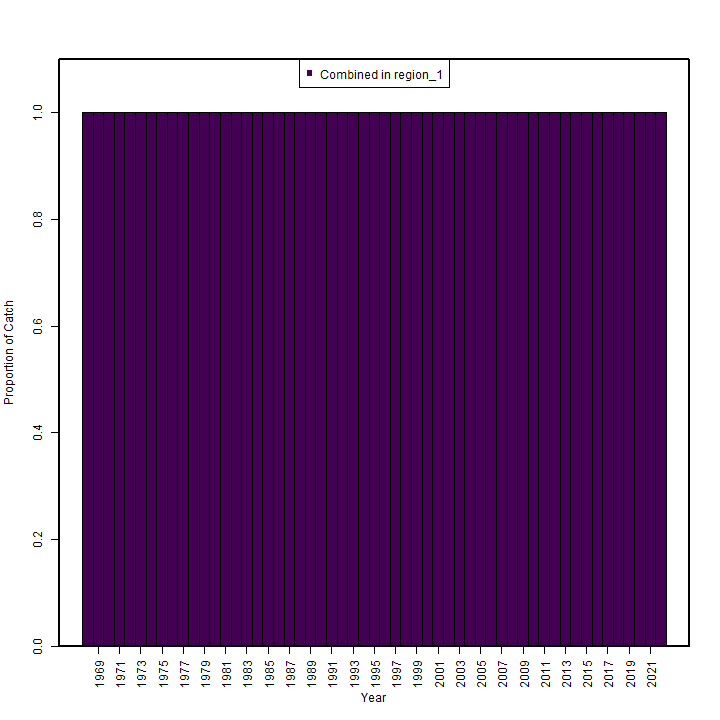
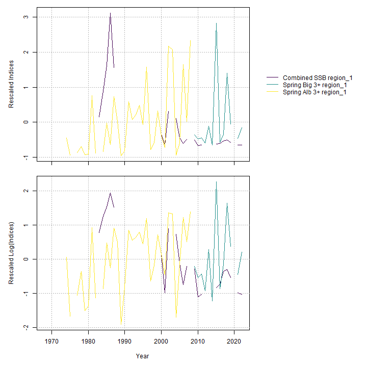
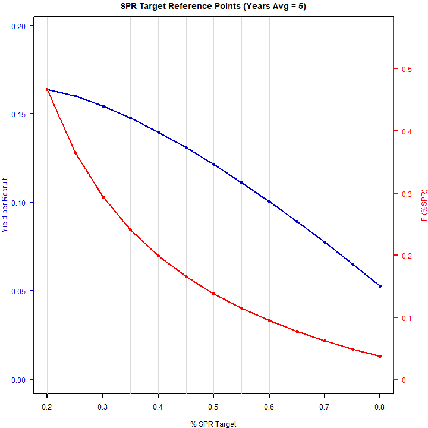

---
output:
  html_document:
    df_print: paged
    keep_md: yes
  word_document: default
  pdf_document:
    fig_caption: yes
    includes:
    keep_tex: yes
    number_sections: no
title: "WHAM figures and tables"
header-includes:
  - \usepackage{longtable}
  - \usepackage{booktabs}
  - \usepackage{caption,graphics}
  - \usepackage{makecell}
  - \usepackage{lscape}
  - \renewcommand\figurename{Fig.}
  - \captionsetup{labelsep=period, singlelinecheck=false}
  - \newcommand{\changesize}[1]{\fontsize{#1pt}{#1pt}\selectfont}
  - \renewcommand{\arraystretch}{1.5}
  - \renewcommand\theadfont{}
---

# {.tabset}

## Figures {.tabset}

### Input

### Diagnostics

### Results

### Retro

### Reference points

### Miscellaneous

## Tables {.tabset}

### Parameter estimates

<table class="table" style="margin-left: auto; margin-right: auto;">
<caption>Parameter estimates, standard errors, and confidence intervals. Rounded to 3 decimal places.</caption>
 <thead>
  <tr>
   <th style="text-align:left;">   </th>
   <th style="text-align:right;"> Estimate </th>
   <th style="text-align:right;"> Std. Error </th>
   <th style="text-align:right;"> 95\% CI lower </th>
   <th style="text-align:right;"> 95\% CI upper </th>
  </tr>
 </thead>
<tbody>
  <tr>
   <td style="text-align:left;"> Combined SSB fully selected q </td>
   <td style="text-align:right;"> $0.002$ </td>
   <td style="text-align:right;"> $3.075\times 10^{-4}$ </td>
   <td style="text-align:right;"> $0.002$ </td>
   <td style="text-align:right;"> $0.003$ </td>
  </tr>
  <tr>
   <td style="text-align:left;"> Spring Big 3+ fully selected q </td>
   <td style="text-align:right;"> $8.726\times 10^{-5}$ </td>
   <td style="text-align:right;"> $1.575\times 10^{-5}$ </td>
   <td style="text-align:right;"> $6.125\times 10^{-5}$ </td>
   <td style="text-align:right;"> $1.243\times 10^{-4}$ </td>
  </tr>
  <tr>
   <td style="text-align:left;"> Spring Alb 3+ fully selected q </td>
   <td style="text-align:right;"> $1.110\times 10^{-5}$ </td>
   <td style="text-align:right;"> $1.695\times 10^{-6}$ </td>
   <td style="text-align:right;"> $8.226\times 10^{-6}$ </td>
   <td style="text-align:right;"> $1.497\times 10^{-5}$ </td>
  </tr>
  <tr>
   <td style="text-align:left;"> Block 1: Combined Selectivity for age 1 </td>
   <td style="text-align:right;"> $0.187$ </td>
   <td style="text-align:right;"> $0.013$ </td>
   <td style="text-align:right;"> $0.162$ </td>
   <td style="text-align:right;"> $0.214$ </td>
  </tr>
  <tr>
   <td style="text-align:left;"> Block 1: Combined Selectivity for age 2 </td>
   <td style="text-align:right;"> $0.521$ </td>
   <td style="text-align:right;"> $0.032$ </td>
   <td style="text-align:right;"> $0.459$ </td>
   <td style="text-align:right;"> $0.583$ </td>
  </tr>
  <tr>
   <td style="text-align:left;"> Block 1: Combined Selectivity for age 3 </td>
   <td style="text-align:right;"> $0.878$ </td>
   <td style="text-align:right;"> $0.053$ </td>
   <td style="text-align:right;"> $0.731$ </td>
   <td style="text-align:right;"> $0.950$ </td>
  </tr>
  <tr>
   <td style="text-align:left;"> Block 1: Combined Selectivity for age 4 </td>
   <td style="text-align:right;"> $0.960$ </td>
   <td style="text-align:right;"> $0.065$ </td>
   <td style="text-align:right;"> $0.474$ </td>
   <td style="text-align:right;"> $0.998$ </td>
  </tr>
  <tr>
   <td style="text-align:left;"> Block 1: Combined Selectivity for age 5 </td>
   <td style="text-align:right;"> $1.000$ </td>
   <td style="text-align:right;"> -- </td>
   <td style="text-align:right;"> -- </td>
   <td style="text-align:right;"> -- </td>
  </tr>
  <tr>
   <td style="text-align:left;"> Block 1: Combined Selectivity for age 6 </td>
   <td style="text-align:right;"> $1.000$ </td>
   <td style="text-align:right;"> -- </td>
   <td style="text-align:right;"> -- </td>
   <td style="text-align:right;"> -- </td>
  </tr>
  <tr>
   <td style="text-align:left;"> Block 1: Combined Selectivity for age 7 </td>
   <td style="text-align:right;"> $1.000$ </td>
   <td style="text-align:right;"> -- </td>
   <td style="text-align:right;"> -- </td>
   <td style="text-align:right;"> -- </td>
  </tr>
  <tr>
   <td style="text-align:left;"> Block 1: Combined Selectivity for age 8 </td>
   <td style="text-align:right;"> $1.000$ </td>
   <td style="text-align:right;"> -- </td>
   <td style="text-align:right;"> -- </td>
   <td style="text-align:right;"> -- </td>
  </tr>
  <tr>
   <td style="text-align:left;"> Block 1: Combined Selectivity for age 9 </td>
   <td style="text-align:right;"> $1.000$ </td>
   <td style="text-align:right;"> -- </td>
   <td style="text-align:right;"> -- </td>
   <td style="text-align:right;"> -- </td>
  </tr>
  <tr>
   <td style="text-align:left;"> Block 1: Combined Selectivity for age 10+ </td>
   <td style="text-align:right;"> $1.000$ </td>
   <td style="text-align:right;"> -- </td>
   <td style="text-align:right;"> -- </td>
   <td style="text-align:right;"> -- </td>
  </tr>
  <tr>
   <td style="text-align:left;"> Block 2: Combined SSB Selectivity for age 1 </td>
   <td style="text-align:right;"> $1.000$ </td>
   <td style="text-align:right;"> -- </td>
   <td style="text-align:right;"> -- </td>
   <td style="text-align:right;"> -- </td>
  </tr>
  <tr>
   <td style="text-align:left;"> Block 2: Combined SSB Selectivity for age 2 </td>
   <td style="text-align:right;"> $1.000$ </td>
   <td style="text-align:right;"> -- </td>
   <td style="text-align:right;"> -- </td>
   <td style="text-align:right;"> -- </td>
  </tr>
  <tr>
   <td style="text-align:left;"> Block 2: Combined SSB Selectivity for age 3 </td>
   <td style="text-align:right;"> $1.000$ </td>
   <td style="text-align:right;"> -- </td>
   <td style="text-align:right;"> -- </td>
   <td style="text-align:right;"> -- </td>
  </tr>
  <tr>
   <td style="text-align:left;"> Block 2: Combined SSB Selectivity for age 4 </td>
   <td style="text-align:right;"> $1.000$ </td>
   <td style="text-align:right;"> -- </td>
   <td style="text-align:right;"> -- </td>
   <td style="text-align:right;"> -- </td>
  </tr>
  <tr>
   <td style="text-align:left;"> Block 2: Combined SSB Selectivity for age 5 </td>
   <td style="text-align:right;"> $1.000$ </td>
   <td style="text-align:right;"> -- </td>
   <td style="text-align:right;"> -- </td>
   <td style="text-align:right;"> -- </td>
  </tr>
  <tr>
   <td style="text-align:left;"> Block 2: Combined SSB Selectivity for age 6 </td>
   <td style="text-align:right;"> $1.000$ </td>
   <td style="text-align:right;"> -- </td>
   <td style="text-align:right;"> -- </td>
   <td style="text-align:right;"> -- </td>
  </tr>
  <tr>
   <td style="text-align:left;"> Block 2: Combined SSB Selectivity for age 7 </td>
   <td style="text-align:right;"> $1.000$ </td>
   <td style="text-align:right;"> -- </td>
   <td style="text-align:right;"> -- </td>
   <td style="text-align:right;"> -- </td>
  </tr>
  <tr>
   <td style="text-align:left;"> Block 2: Combined SSB Selectivity for age 8 </td>
   <td style="text-align:right;"> $1.000$ </td>
   <td style="text-align:right;"> -- </td>
   <td style="text-align:right;"> -- </td>
   <td style="text-align:right;"> -- </td>
  </tr>
  <tr>
   <td style="text-align:left;"> Block 2: Combined SSB Selectivity for age 9 </td>
   <td style="text-align:right;"> $1.000$ </td>
   <td style="text-align:right;"> -- </td>
   <td style="text-align:right;"> -- </td>
   <td style="text-align:right;"> -- </td>
  </tr>
  <tr>
   <td style="text-align:left;"> Block 2: Combined SSB Selectivity for age 10+ </td>
   <td style="text-align:right;"> $1.000$ </td>
   <td style="text-align:right;"> -- </td>
   <td style="text-align:right;"> -- </td>
   <td style="text-align:right;"> -- </td>
  </tr>
  <tr>
   <td style="text-align:left;"> Block 3: Spring Big 3+ Selectivity for age 1 </td>
   <td style="text-align:right;"> $0.000$ </td>
   <td style="text-align:right;"> -- </td>
   <td style="text-align:right;"> -- </td>
   <td style="text-align:right;"> -- </td>
  </tr>
  <tr>
   <td style="text-align:left;"> Block 3: Spring Big 3+ Selectivity for age 2 </td>
   <td style="text-align:right;"> $0.000$ </td>
   <td style="text-align:right;"> -- </td>
   <td style="text-align:right;"> -- </td>
   <td style="text-align:right;"> -- </td>
  </tr>
  <tr>
   <td style="text-align:left;"> Block 3: Spring Big 3+ Selectivity for age 3 </td>
   <td style="text-align:right;"> $1.000$ </td>
   <td style="text-align:right;"> -- </td>
   <td style="text-align:right;"> -- </td>
   <td style="text-align:right;"> -- </td>
  </tr>
  <tr>
   <td style="text-align:left;"> Block 3: Spring Big 3+ Selectivity for age 4 </td>
   <td style="text-align:right;"> $0.550$ </td>
   <td style="text-align:right;"> $0.072$ </td>
   <td style="text-align:right;"> $0.409$ </td>
   <td style="text-align:right;"> $0.684$ </td>
  </tr>
  <tr>
   <td style="text-align:left;"> Block 3: Spring Big 3+ Selectivity for age 5 </td>
   <td style="text-align:right;"> $0.268$ </td>
   <td style="text-align:right;"> $0.079$ </td>
   <td style="text-align:right;"> $0.143$ </td>
   <td style="text-align:right;"> $0.445$ </td>
  </tr>
  <tr>
   <td style="text-align:left;"> Block 3: Spring Big 3+ Selectivity for age 6 </td>
   <td style="text-align:right;"> $0.089$ </td>
   <td style="text-align:right;"> $0.059$ </td>
   <td style="text-align:right;"> $0.023$ </td>
   <td style="text-align:right;"> $0.287$ </td>
  </tr>
  <tr>
   <td style="text-align:left;"> Block 3: Spring Big 3+ Selectivity for age 7 </td>
   <td style="text-align:right;"> $0.300$ </td>
   <td style="text-align:right;"> -- </td>
   <td style="text-align:right;"> -- </td>
   <td style="text-align:right;"> -- </td>
  </tr>
  <tr>
   <td style="text-align:left;"> Block 3: Spring Big 3+ Selectivity for age 8 </td>
   <td style="text-align:right;"> $0.000$ </td>
   <td style="text-align:right;"> -- </td>
   <td style="text-align:right;"> -- </td>
   <td style="text-align:right;"> -- </td>
  </tr>
  <tr>
   <td style="text-align:left;"> Block 3: Spring Big 3+ Selectivity for age 9 </td>
   <td style="text-align:right;"> $0.000$ </td>
   <td style="text-align:right;"> -- </td>
   <td style="text-align:right;"> -- </td>
   <td style="text-align:right;"> -- </td>
  </tr>
  <tr>
   <td style="text-align:left;"> Block 3: Spring Big 3+ Selectivity for age 10+ </td>
   <td style="text-align:right;"> $0.000$ </td>
   <td style="text-align:right;"> -- </td>
   <td style="text-align:right;"> -- </td>
   <td style="text-align:right;"> -- </td>
  </tr>
  <tr>
   <td style="text-align:left;"> Block 4: Spring Alb 3+ Selectivity for age 1 </td>
   <td style="text-align:right;"> $0.000$ </td>
   <td style="text-align:right;"> -- </td>
   <td style="text-align:right;"> -- </td>
   <td style="text-align:right;"> -- </td>
  </tr>
  <tr>
   <td style="text-align:left;"> Block 4: Spring Alb 3+ Selectivity for age 2 </td>
   <td style="text-align:right;"> $0.000$ </td>
   <td style="text-align:right;"> -- </td>
   <td style="text-align:right;"> -- </td>
   <td style="text-align:right;"> -- </td>
  </tr>
  <tr>
   <td style="text-align:left;"> Block 4: Spring Alb 3+ Selectivity for age 3 </td>
   <td style="text-align:right;"> $1.000$ </td>
   <td style="text-align:right;"> -- </td>
   <td style="text-align:right;"> -- </td>
   <td style="text-align:right;"> -- </td>
  </tr>
  <tr>
   <td style="text-align:left;"> Block 4: Spring Alb 3+ Selectivity for age 4 </td>
   <td style="text-align:right;"> $0.580$ </td>
   <td style="text-align:right;"> $0.060$ </td>
   <td style="text-align:right;"> $0.460$ </td>
   <td style="text-align:right;"> $0.691$ </td>
  </tr>
  <tr>
   <td style="text-align:left;"> Block 4: Spring Alb 3+ Selectivity for age 5 </td>
   <td style="text-align:right;"> $0.545$ </td>
   <td style="text-align:right;"> $0.067$ </td>
   <td style="text-align:right;"> $0.414$ </td>
   <td style="text-align:right;"> $0.670$ </td>
  </tr>
  <tr>
   <td style="text-align:left;"> Block 4: Spring Alb 3+ Selectivity for age 6 </td>
   <td style="text-align:right;"> $0.458$ </td>
   <td style="text-align:right;"> $0.069$ </td>
   <td style="text-align:right;"> $0.329$ </td>
   <td style="text-align:right;"> $0.594$ </td>
  </tr>
  <tr>
   <td style="text-align:left;"> Block 4: Spring Alb 3+ Selectivity for age 7 </td>
   <td style="text-align:right;"> $0.389$ </td>
   <td style="text-align:right;"> $0.071$ </td>
   <td style="text-align:right;"> $0.262$ </td>
   <td style="text-align:right;"> $0.534$ </td>
  </tr>
  <tr>
   <td style="text-align:left;"> Block 4: Spring Alb 3+ Selectivity for age 8 </td>
   <td style="text-align:right;"> $0.309$ </td>
   <td style="text-align:right;"> $0.073$ </td>
   <td style="text-align:right;"> $0.186$ </td>
   <td style="text-align:right;"> $0.467$ </td>
  </tr>
  <tr>
   <td style="text-align:left;"> Block 4: Spring Alb 3+ Selectivity for age 9 </td>
   <td style="text-align:right;"> $0.431$ </td>
   <td style="text-align:right;"> -- </td>
   <td style="text-align:right;"> -- </td>
   <td style="text-align:right;"> -- </td>
  </tr>
  <tr>
   <td style="text-align:left;"> Block 4: Spring Alb 3+ Selectivity for age 10+ </td>
   <td style="text-align:right;"> $0.410$ </td>
   <td style="text-align:right;"> -- </td>
   <td style="text-align:right;"> -- </td>
   <td style="text-align:right;"> -- </td>
  </tr>
</tbody>
</table>

### Abundance at age

<table class="table" style="margin-left: auto; margin-right: auto;">
<caption>Abundance at age (1000s) for stock 1 in region 1.</caption>
 <thead>
  <tr>
   <th style="text-align:left;">   </th>
   <th style="text-align:right;"> 1 </th>
   <th style="text-align:right;"> 2 </th>
   <th style="text-align:right;"> 3 </th>
   <th style="text-align:right;"> 4 </th>
   <th style="text-align:right;"> 5 </th>
   <th style="text-align:right;"> 6 </th>
   <th style="text-align:right;"> 7 </th>
   <th style="text-align:right;"> 8 </th>
   <th style="text-align:right;"> 9 </th>
   <th style="text-align:right;"> 10+ </th>
  </tr>
 </thead>
<tbody>
  <tr>
   <td style="text-align:left;"> 1968 </td>
   <td style="text-align:right;"> 4957849 </td>
   <td style="text-align:right;"> 1388878 </td>
   <td style="text-align:right;"> 490256 </td>
   <td style="text-align:right;"> 178209 </td>
   <td style="text-align:right;"> 79730 </td>
   <td style="text-align:right;"> 50193 </td>
   <td style="text-align:right;"> 29080 </td>
   <td style="text-align:right;"> 15731 </td>
   <td style="text-align:right;"> 86119 </td>
   <td style="text-align:right;"> 1139 </td>
  </tr>
  <tr>
   <td style="text-align:left;"> 1969 </td>
   <td style="text-align:right;"> 1451852 </td>
   <td style="text-align:right;"> 3939839 </td>
   <td style="text-align:right;"> 1046146 </td>
   <td style="text-align:right;"> 348808 </td>
   <td style="text-align:right;"> 125150 </td>
   <td style="text-align:right;"> 55632 </td>
   <td style="text-align:right;"> 35022 </td>
   <td style="text-align:right;"> 20290 </td>
   <td style="text-align:right;"> 10976 </td>
   <td style="text-align:right;"> 60884 </td>
  </tr>
  <tr>
   <td style="text-align:left;"> 1970 </td>
   <td style="text-align:right;"> 2723731 </td>
   <td style="text-align:right;"> 1155638 </td>
   <td style="text-align:right;"> 2981283 </td>
   <td style="text-align:right;"> 750096 </td>
   <td style="text-align:right;"> 247036 </td>
   <td style="text-align:right;"> 88096 </td>
   <td style="text-align:right;"> 39161 </td>
   <td style="text-align:right;"> 24653 </td>
   <td style="text-align:right;"> 14283 </td>
   <td style="text-align:right;"> 50584 </td>
  </tr>
  <tr>
   <td style="text-align:left;"> 1971 </td>
   <td style="text-align:right;"> 908581 </td>
   <td style="text-align:right;"> 2141410 </td>
   <td style="text-align:right;"> 844800 </td>
   <td style="text-align:right;"> 2016891 </td>
   <td style="text-align:right;"> 498543 </td>
   <td style="text-align:right;"> 162756 </td>
   <td style="text-align:right;"> 58041 </td>
   <td style="text-align:right;"> 25800 </td>
   <td style="text-align:right;"> 16242 </td>
   <td style="text-align:right;"> 42737 </td>
  </tr>
  <tr>
   <td style="text-align:left;"> 1972 </td>
   <td style="text-align:right;"> 1189442 </td>
   <td style="text-align:right;"> 698135 </td>
   <td style="text-align:right;"> 1468224 </td>
   <td style="text-align:right;"> 513043 </td>
   <td style="text-align:right;"> 1191341 </td>
   <td style="text-align:right;"> 290464 </td>
   <td style="text-align:right;"> 94826 </td>
   <td style="text-align:right;"> 33816 </td>
   <td style="text-align:right;"> 15032 </td>
   <td style="text-align:right;"> 34363 </td>
  </tr>
  <tr>
   <td style="text-align:left;"> 1973 </td>
   <td style="text-align:right;"> 814896 </td>
   <td style="text-align:right;"> 909999 </td>
   <td style="text-align:right;"> 472915 </td>
   <td style="text-align:right;"> 873684 </td>
   <td style="text-align:right;"> 296380 </td>
   <td style="text-align:right;"> 678205 </td>
   <td style="text-align:right;"> 165355 </td>
   <td style="text-align:right;"> 53982 </td>
   <td style="text-align:right;"> 19251 </td>
   <td style="text-align:right;"> 28119 </td>
  </tr>
  <tr>
   <td style="text-align:left;"> 1974 </td>
   <td style="text-align:right;"> 1187484 </td>
   <td style="text-align:right;"> 604509 </td>
   <td style="text-align:right;"> 565508 </td>
   <td style="text-align:right;"> 243383 </td>
   <td style="text-align:right;"> 430665 </td>
   <td style="text-align:right;"> 143010 </td>
   <td style="text-align:right;"> 327248 </td>
   <td style="text-align:right;"> 79787 </td>
   <td style="text-align:right;"> 26048 </td>
   <td style="text-align:right;"> 22857 </td>
  </tr>
  <tr>
   <td style="text-align:left;"> 1975 </td>
   <td style="text-align:right;"> 1040756 </td>
   <td style="text-align:right;"> 868187 </td>
   <td style="text-align:right;"> 360703 </td>
   <td style="text-align:right;"> 271784 </td>
   <td style="text-align:right;"> 111326 </td>
   <td style="text-align:right;"> 192225 </td>
   <td style="text-align:right;"> 63832 </td>
   <td style="text-align:right;"> 146065 </td>
   <td style="text-align:right;"> 35613 </td>
   <td style="text-align:right;"> 21828 </td>
  </tr>
  <tr>
   <td style="text-align:left;"> 1976 </td>
   <td style="text-align:right;"> 175335 </td>
   <td style="text-align:right;"> 745104 </td>
   <td style="text-align:right;"> 488514 </td>
   <td style="text-align:right;"> 157045 </td>
   <td style="text-align:right;"> 111592 </td>
   <td style="text-align:right;"> 44401 </td>
   <td style="text-align:right;"> 76667 </td>
   <td style="text-align:right;"> 25459 </td>
   <td style="text-align:right;"> 58257 </td>
   <td style="text-align:right;"> 22910 </td>
  </tr>
  <tr>
   <td style="text-align:left;"> 1977 </td>
   <td style="text-align:right;"> 36434 </td>
   <td style="text-align:right;"> 120445 </td>
   <td style="text-align:right;"> 373525 </td>
   <td style="text-align:right;"> 175100 </td>
   <td style="text-align:right;"> 52134 </td>
   <td style="text-align:right;"> 35665 </td>
   <td style="text-align:right;"> 14191 </td>
   <td style="text-align:right;"> 24503 </td>
   <td style="text-align:right;"> 8137 </td>
   <td style="text-align:right;"> 25941 </td>
  </tr>
  <tr>
   <td style="text-align:left;"> 1978 </td>
   <td style="text-align:right;"> 50206 </td>
   <td style="text-align:right;"> 27811 </td>
   <td style="text-align:right;"> 81078 </td>
   <td style="text-align:right;"> 219928 </td>
   <td style="text-align:right;"> 99989 </td>
   <td style="text-align:right;"> 29323 </td>
   <td style="text-align:right;"> 20060 </td>
   <td style="text-align:right;"> 7982 </td>
   <td style="text-align:right;"> 13782 </td>
   <td style="text-align:right;"> 19167 </td>
  </tr>
  <tr>
   <td style="text-align:left;"> 1979 </td>
   <td style="text-align:right;"> 131656 </td>
   <td style="text-align:right;"> 40064 </td>
   <td style="text-align:right;"> 21195 </td>
   <td style="text-align:right;"> 58832 </td>
   <td style="text-align:right;"> 157806 </td>
   <td style="text-align:right;"> 71349 </td>
   <td style="text-align:right;"> 20924 </td>
   <td style="text-align:right;"> 14314 </td>
   <td style="text-align:right;"> 5695 </td>
   <td style="text-align:right;"> 23511 </td>
  </tr>
  <tr>
   <td style="text-align:left;"> 1980 </td>
   <td style="text-align:right;"> 26873 </td>
   <td style="text-align:right;"> 104224 </td>
   <td style="text-align:right;"> 29857 </td>
   <td style="text-align:right;"> 14811 </td>
   <td style="text-align:right;"> 40512 </td>
   <td style="text-align:right;"> 107877 </td>
   <td style="text-align:right;"> 48774 </td>
   <td style="text-align:right;"> 14304 </td>
   <td style="text-align:right;"> 9785 </td>
   <td style="text-align:right;"> 19966 </td>
  </tr>
  <tr>
   <td style="text-align:left;"> 1981 </td>
   <td style="text-align:right;"> 186932 </td>
   <td style="text-align:right;"> 21391 </td>
   <td style="text-align:right;"> 78867 </td>
   <td style="text-align:right;"> 21408 </td>
   <td style="text-align:right;"> 10490 </td>
   <td style="text-align:right;"> 28517 </td>
   <td style="text-align:right;"> 75938 </td>
   <td style="text-align:right;"> 34334 </td>
   <td style="text-align:right;"> 10069 </td>
   <td style="text-align:right;"> 20942 </td>
  </tr>
  <tr>
   <td style="text-align:left;"> 1982 </td>
   <td style="text-align:right;"> 445554 </td>
   <td style="text-align:right;"> 147593 </td>
   <td style="text-align:right;"> 15824 </td>
   <td style="text-align:right;"> 54433 </td>
   <td style="text-align:right;"> 14543 </td>
   <td style="text-align:right;"> 7070 </td>
   <td style="text-align:right;"> 19221 </td>
   <td style="text-align:right;"> 51184 </td>
   <td style="text-align:right;"> 23142 </td>
   <td style="text-align:right;"> 20902 </td>
  </tr>
  <tr>
   <td style="text-align:left;"> 1983 </td>
   <td style="text-align:right;"> 2144636 </td>
   <td style="text-align:right;"> 352389 </td>
   <td style="text-align:right;"> 109705 </td>
   <td style="text-align:right;"> 11009 </td>
   <td style="text-align:right;"> 37304 </td>
   <td style="text-align:right;"> 9892 </td>
   <td style="text-align:right;"> 4809 </td>
   <td style="text-align:right;"> 13074 </td>
   <td style="text-align:right;"> 34815 </td>
   <td style="text-align:right;"> 29959 </td>
  </tr>
  <tr>
   <td style="text-align:left;"> 1984 </td>
   <td style="text-align:right;"> 89579 </td>
   <td style="text-align:right;"> 1705355 </td>
   <td style="text-align:right;"> 265902 </td>
   <td style="text-align:right;"> 78287 </td>
   <td style="text-align:right;"> 7757 </td>
   <td style="text-align:right;"> 26117 </td>
   <td style="text-align:right;"> 6926 </td>
   <td style="text-align:right;"> 3367 </td>
   <td style="text-align:right;"> 9154 </td>
   <td style="text-align:right;"> 45350 </td>
  </tr>
  <tr>
   <td style="text-align:left;"> 1985 </td>
   <td style="text-align:right;"> 189112 </td>
   <td style="text-align:right;"> 71805 </td>
   <td style="text-align:right;"> 1316016 </td>
   <td style="text-align:right;"> 197059 </td>
   <td style="text-align:right;"> 57484 </td>
   <td style="text-align:right;"> 5670 </td>
   <td style="text-align:right;"> 19090 </td>
   <td style="text-align:right;"> 5062 </td>
   <td style="text-align:right;"> 2461 </td>
   <td style="text-align:right;"> 39838 </td>
  </tr>
  <tr>
   <td style="text-align:left;"> 1986 </td>
   <td style="text-align:right;"> 92248 </td>
   <td style="text-align:right;"> 150296 </td>
   <td style="text-align:right;"> 54101 </td>
   <td style="text-align:right;"> 936755 </td>
   <td style="text-align:right;"> 138458 </td>
   <td style="text-align:right;"> 40130 </td>
   <td style="text-align:right;"> 3958 </td>
   <td style="text-align:right;"> 13327 </td>
   <td style="text-align:right;"> 3534 </td>
   <td style="text-align:right;"> 29529 </td>
  </tr>
  <tr>
   <td style="text-align:left;"> 1987 </td>
   <td style="text-align:right;"> 117437 </td>
   <td style="text-align:right;"> 73249 </td>
   <td style="text-align:right;"> 112958 </td>
   <td style="text-align:right;"> 38349 </td>
   <td style="text-align:right;"> 655188 </td>
   <td style="text-align:right;"> 96201 </td>
   <td style="text-align:right;"> 27883 </td>
   <td style="text-align:right;"> 2750 </td>
   <td style="text-align:right;"> 9259 </td>
   <td style="text-align:right;"> 22973 </td>
  </tr>
  <tr>
   <td style="text-align:left;"> 1988 </td>
   <td style="text-align:right;"> 404018 </td>
   <td style="text-align:right;"> 92041 </td>
   <td style="text-align:right;"> 53081 </td>
   <td style="text-align:right;"> 75303 </td>
   <td style="text-align:right;"> 25082 </td>
   <td style="text-align:right;"> 424496 </td>
   <td style="text-align:right;"> 62329 </td>
   <td style="text-align:right;"> 18065 </td>
   <td style="text-align:right;"> 1782 </td>
   <td style="text-align:right;"> 20883 </td>
  </tr>
  <tr>
   <td style="text-align:left;"> 1989 </td>
   <td style="text-align:right;"> 536484 </td>
   <td style="text-align:right;"> 312843 </td>
   <td style="text-align:right;"> 64482 </td>
   <td style="text-align:right;"> 33428 </td>
   <td style="text-align:right;"> 46281 </td>
   <td style="text-align:right;"> 15230 </td>
   <td style="text-align:right;"> 257764 </td>
   <td style="text-align:right;"> 37847 </td>
   <td style="text-align:right;"> 10970 </td>
   <td style="text-align:right;"> 13763 </td>
  </tr>
  <tr>
   <td style="text-align:left;"> 1990 </td>
   <td style="text-align:right;"> 110104 </td>
   <td style="text-align:right;"> 415350 </td>
   <td style="text-align:right;"> 219074 </td>
   <td style="text-align:right;"> 40578 </td>
   <td style="text-align:right;"> 20528 </td>
   <td style="text-align:right;"> 28079 </td>
   <td style="text-align:right;"> 9240 </td>
   <td style="text-align:right;"> 156387 </td>
   <td style="text-align:right;"> 22962 </td>
   <td style="text-align:right;"> 15005 </td>
  </tr>
  <tr>
   <td style="text-align:left;"> 1991 </td>
   <td style="text-align:right;"> 185553 </td>
   <td style="text-align:right;"> 83291 </td>
   <td style="text-align:right;"> 272622 </td>
   <td style="text-align:right;"> 123620 </td>
   <td style="text-align:right;"> 22119 </td>
   <td style="text-align:right;"> 11000 </td>
   <td style="text-align:right;"> 15047 </td>
   <td style="text-align:right;"> 4952 </td>
   <td style="text-align:right;"> 83803 </td>
   <td style="text-align:right;"> 20346 </td>
  </tr>
  <tr>
   <td style="text-align:left;"> 1992 </td>
   <td style="text-align:right;"> 196577 </td>
   <td style="text-align:right;"> 142547 </td>
   <td style="text-align:right;"> 57076 </td>
   <td style="text-align:right;"> 165411 </td>
   <td style="text-align:right;"> 72947 </td>
   <td style="text-align:right;"> 12874 </td>
   <td style="text-align:right;"> 6402 </td>
   <td style="text-align:right;"> 8757 </td>
   <td style="text-align:right;"> 2882 </td>
   <td style="text-align:right;"> 60616 </td>
  </tr>
  <tr>
   <td style="text-align:left;"> 1993 </td>
   <td style="text-align:right;"> 37372 </td>
   <td style="text-align:right;"> 153415 </td>
   <td style="text-align:right;"> 102081 </td>
   <td style="text-align:right;"> 37297 </td>
   <td style="text-align:right;"> 105850 </td>
   <td style="text-align:right;"> 46199 </td>
   <td style="text-align:right;"> 8153 </td>
   <td style="text-align:right;"> 4055 </td>
   <td style="text-align:right;"> 5546 </td>
   <td style="text-align:right;"> 40215 </td>
  </tr>
  <tr>
   <td style="text-align:left;"> 1994 </td>
   <td style="text-align:right;"> 145211 </td>
   <td style="text-align:right;"> 29162 </td>
   <td style="text-align:right;"> 109826 </td>
   <td style="text-align:right;"> 66667 </td>
   <td style="text-align:right;"> 23852 </td>
   <td style="text-align:right;"> 66992 </td>
   <td style="text-align:right;"> 29239 </td>
   <td style="text-align:right;"> 5160 </td>
   <td style="text-align:right;"> 2566 </td>
   <td style="text-align:right;"> 28962 </td>
  </tr>
  <tr>
   <td style="text-align:left;"> 1995 </td>
   <td style="text-align:right;"> 170201 </td>
   <td style="text-align:right;"> 111988 </td>
   <td style="text-align:right;"> 20201 </td>
   <td style="text-align:right;"> 67860 </td>
   <td style="text-align:right;"> 40130 </td>
   <td style="text-align:right;"> 14173 </td>
   <td style="text-align:right;"> 39807 </td>
   <td style="text-align:right;"> 17374 </td>
   <td style="text-align:right;"> 3066 </td>
   <td style="text-align:right;"> 18735 </td>
  </tr>
  <tr>
   <td style="text-align:left;"> 1996 </td>
   <td style="text-align:right;"> 172323 </td>
   <td style="text-align:right;"> 132563 </td>
   <td style="text-align:right;"> 79747 </td>
   <td style="text-align:right;"> 13076 </td>
   <td style="text-align:right;"> 42977 </td>
   <td style="text-align:right;"> 25142 </td>
   <td style="text-align:right;"> 8880 </td>
   <td style="text-align:right;"> 24940 </td>
   <td style="text-align:right;"> 10885 </td>
   <td style="text-align:right;"> 13659 </td>
  </tr>
  <tr>
   <td style="text-align:left;"> 1997 </td>
   <td style="text-align:right;"> 225127 </td>
   <td style="text-align:right;"> 129656 </td>
   <td style="text-align:right;"> 85706 </td>
   <td style="text-align:right;"> 43870 </td>
   <td style="text-align:right;"> 6933 </td>
   <td style="text-align:right;"> 22373 </td>
   <td style="text-align:right;"> 13088 </td>
   <td style="text-align:right;"> 4622 </td>
   <td style="text-align:right;"> 12983 </td>
   <td style="text-align:right;"> 12777 </td>
  </tr>
  <tr>
   <td style="text-align:left;"> 1998 </td>
   <td style="text-align:right;"> 108782 </td>
   <td style="text-align:right;"> 168449 </td>
   <td style="text-align:right;"> 82537 </td>
   <td style="text-align:right;"> 45933 </td>
   <td style="text-align:right;"> 22605 </td>
   <td style="text-align:right;"> 3503 </td>
   <td style="text-align:right;"> 11305 </td>
   <td style="text-align:right;"> 6614 </td>
   <td style="text-align:right;"> 2336 </td>
   <td style="text-align:right;"> 13017 </td>
  </tr>
  <tr>
   <td style="text-align:left;"> 1999 </td>
   <td style="text-align:right;"> 177323 </td>
   <td style="text-align:right;"> 81574 </td>
   <td style="text-align:right;"> 107890 </td>
   <td style="text-align:right;"> 44693 </td>
   <td style="text-align:right;"> 23936 </td>
   <td style="text-align:right;"> 11557 </td>
   <td style="text-align:right;"> 1791 </td>
   <td style="text-align:right;"> 5780 </td>
   <td style="text-align:right;"> 3382 </td>
   <td style="text-align:right;"> 7850 </td>
  </tr>
  <tr>
   <td style="text-align:left;"> 2000 </td>
   <td style="text-align:right;"> 1175159 </td>
   <td style="text-align:right;"> 133303 </td>
   <td style="text-align:right;"> 52613 </td>
   <td style="text-align:right;"> 59111 </td>
   <td style="text-align:right;"> 23590 </td>
   <td style="text-align:right;"> 12403 </td>
   <td style="text-align:right;"> 5989 </td>
   <td style="text-align:right;"> 928 </td>
   <td style="text-align:right;"> 2995 </td>
   <td style="text-align:right;"> 5820 </td>
  </tr>
  <tr>
   <td style="text-align:left;"> 2001 </td>
   <td style="text-align:right;"> 198346 </td>
   <td style="text-align:right;"> 919252 </td>
   <td style="text-align:right;"> 96079 </td>
   <td style="text-align:right;"> 34756 </td>
   <td style="text-align:right;"> 38278 </td>
   <td style="text-align:right;"> 15126 </td>
   <td style="text-align:right;"> 7953 </td>
   <td style="text-align:right;"> 3840 </td>
   <td style="text-align:right;"> 595 </td>
   <td style="text-align:right;"> 5652 </td>
  </tr>
  <tr>
   <td style="text-align:left;"> 2002 </td>
   <td style="text-align:right;"> 157707 </td>
   <td style="text-align:right;"> 155431 </td>
   <td style="text-align:right;"> 665875 </td>
   <td style="text-align:right;"> 64005 </td>
   <td style="text-align:right;"> 22714 </td>
   <td style="text-align:right;"> 24780 </td>
   <td style="text-align:right;"> 9792 </td>
   <td style="text-align:right;"> 5148 </td>
   <td style="text-align:right;"> 2486 </td>
   <td style="text-align:right;"> 4044 </td>
  </tr>
  <tr>
   <td style="text-align:left;"> 2003 </td>
   <td style="text-align:right;"> 369515 </td>
   <td style="text-align:right;"> 122252 </td>
   <td style="text-align:right;"> 109229 </td>
   <td style="text-align:right;"> 421527 </td>
   <td style="text-align:right;"> 39562 </td>
   <td style="text-align:right;"> 13875 </td>
   <td style="text-align:right;"> 15137 </td>
   <td style="text-align:right;"> 5981 </td>
   <td style="text-align:right;"> 3145 </td>
   <td style="text-align:right;"> 3989 </td>
  </tr>
  <tr>
   <td style="text-align:left;"> 2004 </td>
   <td style="text-align:right;"> 794259 </td>
   <td style="text-align:right;"> 280554 </td>
   <td style="text-align:right;"> 81067 </td>
   <td style="text-align:right;"> 62706 </td>
   <td style="text-align:right;"> 234143 </td>
   <td style="text-align:right;"> 21620 </td>
   <td style="text-align:right;"> 7582 </td>
   <td style="text-align:right;"> 8272 </td>
   <td style="text-align:right;"> 3269 </td>
   <td style="text-align:right;"> 3898 </td>
  </tr>
  <tr>
   <td style="text-align:left;"> 2005 </td>
   <td style="text-align:right;"> 197835 </td>
   <td style="text-align:right;"> 572753 </td>
   <td style="text-align:right;"> 161082 </td>
   <td style="text-align:right;"> 36516 </td>
   <td style="text-align:right;"> 26721 </td>
   <td style="text-align:right;"> 97073 </td>
   <td style="text-align:right;"> 8963 </td>
   <td style="text-align:right;"> 3143 </td>
   <td style="text-align:right;"> 3429 </td>
   <td style="text-align:right;"> 2971 </td>
  </tr>
  <tr>
   <td style="text-align:left;"> 2006 </td>
   <td style="text-align:right;"> 398187 </td>
   <td style="text-align:right;"> 142339 </td>
   <td style="text-align:right;"> 326777 </td>
   <td style="text-align:right;"> 71789 </td>
   <td style="text-align:right;"> 15380 </td>
   <td style="text-align:right;"> 10945 </td>
   <td style="text-align:right;"> 39760 </td>
   <td style="text-align:right;"> 3671 </td>
   <td style="text-align:right;"> 1288 </td>
   <td style="text-align:right;"> 2622 </td>
  </tr>
  <tr>
   <td style="text-align:left;"> 2007 </td>
   <td style="text-align:right;"> 112358 </td>
   <td style="text-align:right;"> 272696 </td>
   <td style="text-align:right;"> 70747 </td>
   <td style="text-align:right;"> 115452 </td>
   <td style="text-align:right;"> 23460 </td>
   <td style="text-align:right;"> 4836 </td>
   <td style="text-align:right;"> 3441 </td>
   <td style="text-align:right;"> 12500 </td>
   <td style="text-align:right;"> 1154 </td>
   <td style="text-align:right;"> 1229 </td>
  </tr>
  <tr>
   <td style="text-align:left;"> 2008 </td>
   <td style="text-align:right;"> 238128 </td>
   <td style="text-align:right;"> 77400 </td>
   <td style="text-align:right;"> 137779 </td>
   <td style="text-align:right;"> 25695 </td>
   <td style="text-align:right;"> 38883 </td>
   <td style="text-align:right;"> 7611 </td>
   <td style="text-align:right;"> 1569 </td>
   <td style="text-align:right;"> 1116 </td>
   <td style="text-align:right;"> 4056 </td>
   <td style="text-align:right;"> 773 </td>
  </tr>
  <tr>
   <td style="text-align:left;"> 2009 </td>
   <td style="text-align:right;"> 199557 </td>
   <td style="text-align:right;"> 164247 </td>
   <td style="text-align:right;"> 39244 </td>
   <td style="text-align:right;"> 50337 </td>
   <td style="text-align:right;"> 8710 </td>
   <td style="text-align:right;"> 12701 </td>
   <td style="text-align:right;"> 2486 </td>
   <td style="text-align:right;"> 512 </td>
   <td style="text-align:right;"> 365 </td>
   <td style="text-align:right;"> 1577 </td>
  </tr>
  <tr>
   <td style="text-align:left;"> 2010 </td>
   <td style="text-align:right;"> 31421 </td>
   <td style="text-align:right;"> 122112 </td>
   <td style="text-align:right;"> 59594 </td>
   <td style="text-align:right;"> 8162 </td>
   <td style="text-align:right;"> 9218 </td>
   <td style="text-align:right;"> 1498 </td>
   <td style="text-align:right;"> 2184 </td>
   <td style="text-align:right;"> 427 </td>
   <td style="text-align:right;"> 88 </td>
   <td style="text-align:right;"> 334 </td>
  </tr>
  <tr>
   <td style="text-align:left;"> 2011 </td>
   <td style="text-align:right;"> 133288 </td>
   <td style="text-align:right;"> 17508 </td>
   <td style="text-align:right;"> 34103 </td>
   <td style="text-align:right;"> 7976 </td>
   <td style="text-align:right;"> 923 </td>
   <td style="text-align:right;"> 959 </td>
   <td style="text-align:right;"> 156 </td>
   <td style="text-align:right;"> 227 </td>
   <td style="text-align:right;"> 44 </td>
   <td style="text-align:right;"> 44 </td>
  </tr>
  <tr>
   <td style="text-align:left;"> 2012 </td>
   <td style="text-align:right;"> 91487 </td>
   <td style="text-align:right;"> 88257 </td>
   <td style="text-align:right;"> 7920 </td>
   <td style="text-align:right;"> 10282 </td>
   <td style="text-align:right;"> 2192 </td>
   <td style="text-align:right;"> 242 </td>
   <td style="text-align:right;"> 252 </td>
   <td style="text-align:right;"> 41 </td>
   <td style="text-align:right;"> 60 </td>
   <td style="text-align:right;"> 23 </td>
  </tr>
  <tr>
   <td style="text-align:left;"> 2013 </td>
   <td style="text-align:right;"> 41573 </td>
   <td style="text-align:right;"> 59370 </td>
   <td style="text-align:right;"> 37738 </td>
   <td style="text-align:right;"> 2172 </td>
   <td style="text-align:right;"> 2547 </td>
   <td style="text-align:right;"> 516 </td>
   <td style="text-align:right;"> 57 </td>
   <td style="text-align:right;"> 59 </td>
   <td style="text-align:right;"> 10 </td>
   <td style="text-align:right;"> 20 </td>
  </tr>
  <tr>
   <td style="text-align:left;"> 2014 </td>
   <td style="text-align:right;"> 83455 </td>
   <td style="text-align:right;"> 27419 </td>
   <td style="text-align:right;"> 26560 </td>
   <td style="text-align:right;"> 11167 </td>
   <td style="text-align:right;"> 585 </td>
   <td style="text-align:right;"> 654 </td>
   <td style="text-align:right;"> 133 </td>
   <td style="text-align:right;"> 15 </td>
   <td style="text-align:right;"> 15 </td>
   <td style="text-align:right;"> 7 </td>
  </tr>
  <tr>
   <td style="text-align:left;"> 2015 </td>
   <td style="text-align:right;"> 130663 </td>
   <td style="text-align:right;"> 55880 </td>
   <td style="text-align:right;"> 12796 </td>
   <td style="text-align:right;"> 8439 </td>
   <td style="text-align:right;"> 3250 </td>
   <td style="text-align:right;"> 163 </td>
   <td style="text-align:right;"> 182 </td>
   <td style="text-align:right;"> 37 </td>
   <td style="text-align:right;"> 4 </td>
   <td style="text-align:right;"> 6 </td>
  </tr>
  <tr>
   <td style="text-align:left;"> 2016 </td>
   <td style="text-align:right;"> 315483 </td>
   <td style="text-align:right;"> 88499 </td>
   <td style="text-align:right;"> 26928 </td>
   <td style="text-align:right;"> 4291 </td>
   <td style="text-align:right;"> 2605 </td>
   <td style="text-align:right;"> 963 </td>
   <td style="text-align:right;"> 48 </td>
   <td style="text-align:right;"> 54 </td>
   <td style="text-align:right;"> 11 </td>
   <td style="text-align:right;"> 3 </td>
  </tr>
  <tr>
   <td style="text-align:left;"> 2017 </td>
   <td style="text-align:right;"> 23501 </td>
   <td style="text-align:right;"> 222966 </td>
   <td style="text-align:right;"> 48032 </td>
   <td style="text-align:right;"> 11033 </td>
   <td style="text-align:right;"> 1649 </td>
   <td style="text-align:right;"> 970 </td>
   <td style="text-align:right;"> 358 </td>
   <td style="text-align:right;"> 18 </td>
   <td style="text-align:right;"> 20 </td>
   <td style="text-align:right;"> 5 </td>
  </tr>
  <tr>
   <td style="text-align:left;"> 2018 </td>
   <td style="text-align:right;"> 104890 </td>
   <td style="text-align:right;"> 16738 </td>
   <td style="text-align:right;"> 123648 </td>
   <td style="text-align:right;"> 20407 </td>
   <td style="text-align:right;"> 4410 </td>
   <td style="text-align:right;"> 640 </td>
   <td style="text-align:right;"> 376 </td>
   <td style="text-align:right;"> 139 </td>
   <td style="text-align:right;"> 7 </td>
   <td style="text-align:right;"> 10 </td>
  </tr>
  <tr>
   <td style="text-align:left;"> 2019 </td>
   <td style="text-align:right;"> 51197 </td>
   <td style="text-align:right;"> 74547 </td>
   <td style="text-align:right;"> 9228 </td>
   <td style="text-align:right;"> 52015 </td>
   <td style="text-align:right;"> 8070 </td>
   <td style="text-align:right;"> 1692 </td>
   <td style="text-align:right;"> 245 </td>
   <td style="text-align:right;"> 144 </td>
   <td style="text-align:right;"> 53 </td>
   <td style="text-align:right;"> 6 </td>
  </tr>
  <tr>
   <td style="text-align:left;"> 2020 </td>
   <td style="text-align:right;"> 64171 </td>
   <td style="text-align:right;"> 36543 </td>
   <td style="text-align:right;"> 41594 </td>
   <td style="text-align:right;"> 3961 </td>
   <td style="text-align:right;"> 21028 </td>
   <td style="text-align:right;"> 3167 </td>
   <td style="text-align:right;"> 664 </td>
   <td style="text-align:right;"> 96 </td>
   <td style="text-align:right;"> 57 </td>
   <td style="text-align:right;"> 23 </td>
  </tr>
  <tr>
   <td style="text-align:left;"> 2021 </td>
   <td style="text-align:right;"> 64794 </td>
   <td style="text-align:right;"> 42756 </td>
   <td style="text-align:right;"> 16820 </td>
   <td style="text-align:right;"> 12912 </td>
   <td style="text-align:right;"> 1124 </td>
   <td style="text-align:right;"> 5706 </td>
   <td style="text-align:right;"> 859 </td>
   <td style="text-align:right;"> 180 </td>
   <td style="text-align:right;"> 26 </td>
   <td style="text-align:right;"> 22 </td>
  </tr>
  <tr>
   <td style="text-align:left;"> 2022 </td>
   <td style="text-align:right;"> 237095 </td>
   <td style="text-align:right;"> 42915 </td>
   <td style="text-align:right;"> 19356 </td>
   <td style="text-align:right;"> 5078 </td>
   <td style="text-align:right;"> 3553 </td>
   <td style="text-align:right;"> 295 </td>
   <td style="text-align:right;"> 1500 </td>
   <td style="text-align:right;"> 226 </td>
   <td style="text-align:right;"> 47 </td>
   <td style="text-align:right;"> 13 </td>
  </tr>
</tbody>
</table>

### Fishing mortality at age by region

<table class="table" style="margin-left: auto; margin-right: auto;">
<caption>Total fishing mortality at age in region 1.</caption>
 <thead>
  <tr>
   <th style="text-align:left;">   </th>
   <th style="text-align:right;"> 1 </th>
   <th style="text-align:right;"> 2 </th>
   <th style="text-align:right;"> 3 </th>
   <th style="text-align:right;"> 4 </th>
   <th style="text-align:right;"> 5 </th>
   <th style="text-align:right;"> 6 </th>
   <th style="text-align:right;"> 7 </th>
   <th style="text-align:right;"> 8 </th>
   <th style="text-align:right;"> 9 </th>
   <th style="text-align:right;"> 10+ </th>
  </tr>
 </thead>
<tbody>
  <tr>
   <td style="text-align:left;"> 1968 </td>
   <td style="text-align:right;"> 0.030 </td>
   <td style="text-align:right;"> 0.083 </td>
   <td style="text-align:right;"> 0.140 </td>
   <td style="text-align:right;"> 0.153 </td>
   <td style="text-align:right;"> 0.160 </td>
   <td style="text-align:right;"> 0.160 </td>
   <td style="text-align:right;"> 0.160 </td>
   <td style="text-align:right;"> 0.160 </td>
   <td style="text-align:right;"> 0.160 </td>
   <td style="text-align:right;"> 0.160 </td>
  </tr>
  <tr>
   <td style="text-align:left;"> 1969 </td>
   <td style="text-align:right;"> 0.028 </td>
   <td style="text-align:right;"> 0.079 </td>
   <td style="text-align:right;"> 0.133 </td>
   <td style="text-align:right;"> 0.145 </td>
   <td style="text-align:right;"> 0.151 </td>
   <td style="text-align:right;"> 0.151 </td>
   <td style="text-align:right;"> 0.151 </td>
   <td style="text-align:right;"> 0.151 </td>
   <td style="text-align:right;"> 0.151 </td>
   <td style="text-align:right;"> 0.151 </td>
  </tr>
  <tr>
   <td style="text-align:left;"> 1970 </td>
   <td style="text-align:right;"> 0.041 </td>
   <td style="text-align:right;"> 0.113 </td>
   <td style="text-align:right;"> 0.191 </td>
   <td style="text-align:right;"> 0.209 </td>
   <td style="text-align:right;"> 0.217 </td>
   <td style="text-align:right;"> 0.217 </td>
   <td style="text-align:right;"> 0.217 </td>
   <td style="text-align:right;"> 0.217 </td>
   <td style="text-align:right;"> 0.217 </td>
   <td style="text-align:right;"> 0.217 </td>
  </tr>
  <tr>
   <td style="text-align:left;"> 1971 </td>
   <td style="text-align:right;"> 0.063 </td>
   <td style="text-align:right;"> 0.177 </td>
   <td style="text-align:right;"> 0.299 </td>
   <td style="text-align:right;"> 0.326 </td>
   <td style="text-align:right;"> 0.340 </td>
   <td style="text-align:right;"> 0.340 </td>
   <td style="text-align:right;"> 0.340 </td>
   <td style="text-align:right;"> 0.340 </td>
   <td style="text-align:right;"> 0.340 </td>
   <td style="text-align:right;"> 0.340 </td>
  </tr>
  <tr>
   <td style="text-align:left;"> 1972 </td>
   <td style="text-align:right;"> 0.068 </td>
   <td style="text-align:right;"> 0.189 </td>
   <td style="text-align:right;"> 0.319 </td>
   <td style="text-align:right;"> 0.349 </td>
   <td style="text-align:right;"> 0.363 </td>
   <td style="text-align:right;"> 0.363 </td>
   <td style="text-align:right;"> 0.363 </td>
   <td style="text-align:right;"> 0.363 </td>
   <td style="text-align:right;"> 0.363 </td>
   <td style="text-align:right;"> 0.363 </td>
  </tr>
  <tr>
   <td style="text-align:left;"> 1973 </td>
   <td style="text-align:right;"> 0.099 </td>
   <td style="text-align:right;"> 0.276 </td>
   <td style="text-align:right;"> 0.464 </td>
   <td style="text-align:right;"> 0.507 </td>
   <td style="text-align:right;"> 0.529 </td>
   <td style="text-align:right;"> 0.529 </td>
   <td style="text-align:right;"> 0.529 </td>
   <td style="text-align:right;"> 0.529 </td>
   <td style="text-align:right;"> 0.529 </td>
   <td style="text-align:right;"> 0.529 </td>
  </tr>
  <tr>
   <td style="text-align:left;"> 1974 </td>
   <td style="text-align:right;"> 0.113 </td>
   <td style="text-align:right;"> 0.316 </td>
   <td style="text-align:right;"> 0.533 </td>
   <td style="text-align:right;"> 0.582 </td>
   <td style="text-align:right;"> 0.607 </td>
   <td style="text-align:right;"> 0.607 </td>
   <td style="text-align:right;"> 0.607 </td>
   <td style="text-align:right;"> 0.607 </td>
   <td style="text-align:right;"> 0.607 </td>
   <td style="text-align:right;"> 0.607 </td>
  </tr>
  <tr>
   <td style="text-align:left;"> 1975 </td>
   <td style="text-align:right;"> 0.134 </td>
   <td style="text-align:right;"> 0.375 </td>
   <td style="text-align:right;"> 0.632 </td>
   <td style="text-align:right;"> 0.690 </td>
   <td style="text-align:right;"> 0.719 </td>
   <td style="text-align:right;"> 0.719 </td>
   <td style="text-align:right;"> 0.719 </td>
   <td style="text-align:right;"> 0.719 </td>
   <td style="text-align:right;"> 0.719 </td>
   <td style="text-align:right;"> 0.719 </td>
  </tr>
  <tr>
   <td style="text-align:left;"> 1976 </td>
   <td style="text-align:right;"> 0.176 </td>
   <td style="text-align:right;"> 0.491 </td>
   <td style="text-align:right;"> 0.826 </td>
   <td style="text-align:right;"> 0.903 </td>
   <td style="text-align:right;"> 0.941 </td>
   <td style="text-align:right;"> 0.941 </td>
   <td style="text-align:right;"> 0.941 </td>
   <td style="text-align:right;"> 0.941 </td>
   <td style="text-align:right;"> 0.941 </td>
   <td style="text-align:right;"> 0.941 </td>
  </tr>
  <tr>
   <td style="text-align:left;"> 1977 </td>
   <td style="text-align:right;"> 0.070 </td>
   <td style="text-align:right;"> 0.196 </td>
   <td style="text-align:right;"> 0.330 </td>
   <td style="text-align:right;"> 0.360 </td>
   <td style="text-align:right;"> 0.375 </td>
   <td style="text-align:right;"> 0.375 </td>
   <td style="text-align:right;"> 0.375 </td>
   <td style="text-align:right;"> 0.375 </td>
   <td style="text-align:right;"> 0.375 </td>
   <td style="text-align:right;"> 0.375 </td>
  </tr>
  <tr>
   <td style="text-align:left;"> 1978 </td>
   <td style="text-align:right;"> 0.026 </td>
   <td style="text-align:right;"> 0.072 </td>
   <td style="text-align:right;"> 0.121 </td>
   <td style="text-align:right;"> 0.132 </td>
   <td style="text-align:right;"> 0.137 </td>
   <td style="text-align:right;"> 0.137 </td>
   <td style="text-align:right;"> 0.137 </td>
   <td style="text-align:right;"> 0.137 </td>
   <td style="text-align:right;"> 0.137 </td>
   <td style="text-align:right;"> 0.137 </td>
  </tr>
  <tr>
   <td style="text-align:left;"> 1979 </td>
   <td style="text-align:right;"> 0.034 </td>
   <td style="text-align:right;"> 0.094 </td>
   <td style="text-align:right;"> 0.158 </td>
   <td style="text-align:right;"> 0.173 </td>
   <td style="text-align:right;"> 0.180 </td>
   <td style="text-align:right;"> 0.180 </td>
   <td style="text-align:right;"> 0.180 </td>
   <td style="text-align:right;"> 0.180 </td>
   <td style="text-align:right;"> 0.180 </td>
   <td style="text-align:right;"> 0.180 </td>
  </tr>
  <tr>
   <td style="text-align:left;"> 1980 </td>
   <td style="text-align:right;"> 0.028 </td>
   <td style="text-align:right;"> 0.079 </td>
   <td style="text-align:right;"> 0.133 </td>
   <td style="text-align:right;"> 0.145 </td>
   <td style="text-align:right;"> 0.151 </td>
   <td style="text-align:right;"> 0.151 </td>
   <td style="text-align:right;"> 0.151 </td>
   <td style="text-align:right;"> 0.151 </td>
   <td style="text-align:right;"> 0.151 </td>
   <td style="text-align:right;"> 0.151 </td>
  </tr>
  <tr>
   <td style="text-align:left;"> 1981 </td>
   <td style="text-align:right;"> 0.036 </td>
   <td style="text-align:right;"> 0.101 </td>
   <td style="text-align:right;"> 0.171 </td>
   <td style="text-align:right;"> 0.187 </td>
   <td style="text-align:right;"> 0.194 </td>
   <td style="text-align:right;"> 0.194 </td>
   <td style="text-align:right;"> 0.194 </td>
   <td style="text-align:right;"> 0.194 </td>
   <td style="text-align:right;"> 0.194 </td>
   <td style="text-align:right;"> 0.194 </td>
  </tr>
  <tr>
   <td style="text-align:left;"> 1982 </td>
   <td style="text-align:right;"> 0.035 </td>
   <td style="text-align:right;"> 0.097 </td>
   <td style="text-align:right;"> 0.163 </td>
   <td style="text-align:right;"> 0.178 </td>
   <td style="text-align:right;"> 0.185 </td>
   <td style="text-align:right;"> 0.185 </td>
   <td style="text-align:right;"> 0.185 </td>
   <td style="text-align:right;"> 0.185 </td>
   <td style="text-align:right;"> 0.185 </td>
   <td style="text-align:right;"> 0.185 </td>
  </tr>
  <tr>
   <td style="text-align:left;"> 1983 </td>
   <td style="text-align:right;"> 0.029 </td>
   <td style="text-align:right;"> 0.082 </td>
   <td style="text-align:right;"> 0.137 </td>
   <td style="text-align:right;"> 0.150 </td>
   <td style="text-align:right;"> 0.156 </td>
   <td style="text-align:right;"> 0.156 </td>
   <td style="text-align:right;"> 0.156 </td>
   <td style="text-align:right;"> 0.156 </td>
   <td style="text-align:right;"> 0.156 </td>
   <td style="text-align:right;"> 0.156 </td>
  </tr>
  <tr>
   <td style="text-align:left;"> 1984 </td>
   <td style="text-align:right;"> 0.021 </td>
   <td style="text-align:right;"> 0.059 </td>
   <td style="text-align:right;"> 0.100 </td>
   <td style="text-align:right;"> 0.109 </td>
   <td style="text-align:right;"> 0.113 </td>
   <td style="text-align:right;"> 0.113 </td>
   <td style="text-align:right;"> 0.113 </td>
   <td style="text-align:right;"> 0.113 </td>
   <td style="text-align:right;"> 0.113 </td>
   <td style="text-align:right;"> 0.113 </td>
  </tr>
  <tr>
   <td style="text-align:left;"> 1985 </td>
   <td style="text-align:right;"> 0.030 </td>
   <td style="text-align:right;"> 0.083 </td>
   <td style="text-align:right;"> 0.140 </td>
   <td style="text-align:right;"> 0.153 </td>
   <td style="text-align:right;"> 0.159 </td>
   <td style="text-align:right;"> 0.159 </td>
   <td style="text-align:right;"> 0.159 </td>
   <td style="text-align:right;"> 0.159 </td>
   <td style="text-align:right;"> 0.159 </td>
   <td style="text-align:right;"> 0.159 </td>
  </tr>
  <tr>
   <td style="text-align:left;"> 1986 </td>
   <td style="text-align:right;"> 0.031 </td>
   <td style="text-align:right;"> 0.086 </td>
   <td style="text-align:right;"> 0.144 </td>
   <td style="text-align:right;"> 0.158 </td>
   <td style="text-align:right;"> 0.164 </td>
   <td style="text-align:right;"> 0.164 </td>
   <td style="text-align:right;"> 0.164 </td>
   <td style="text-align:right;"> 0.164 </td>
   <td style="text-align:right;"> 0.164 </td>
   <td style="text-align:right;"> 0.164 </td>
  </tr>
  <tr>
   <td style="text-align:left;"> 1987 </td>
   <td style="text-align:right;"> 0.044 </td>
   <td style="text-align:right;"> 0.122 </td>
   <td style="text-align:right;"> 0.205 </td>
   <td style="text-align:right;"> 0.225 </td>
   <td style="text-align:right;"> 0.234 </td>
   <td style="text-align:right;"> 0.234 </td>
   <td style="text-align:right;"> 0.234 </td>
   <td style="text-align:right;"> 0.234 </td>
   <td style="text-align:right;"> 0.234 </td>
   <td style="text-align:right;"> 0.234 </td>
  </tr>
  <tr>
   <td style="text-align:left;"> 1988 </td>
   <td style="text-align:right;"> 0.056 </td>
   <td style="text-align:right;"> 0.156 </td>
   <td style="text-align:right;"> 0.262 </td>
   <td style="text-align:right;"> 0.287 </td>
   <td style="text-align:right;"> 0.299 </td>
   <td style="text-align:right;"> 0.299 </td>
   <td style="text-align:right;"> 0.299 </td>
   <td style="text-align:right;"> 0.299 </td>
   <td style="text-align:right;"> 0.299 </td>
   <td style="text-align:right;"> 0.299 </td>
  </tr>
  <tr>
   <td style="text-align:left;"> 1989 </td>
   <td style="text-align:right;"> 0.056 </td>
   <td style="text-align:right;"> 0.156 </td>
   <td style="text-align:right;"> 0.263 </td>
   <td style="text-align:right;"> 0.288 </td>
   <td style="text-align:right;"> 0.300 </td>
   <td style="text-align:right;"> 0.300 </td>
   <td style="text-align:right;"> 0.300 </td>
   <td style="text-align:right;"> 0.300 </td>
   <td style="text-align:right;"> 0.300 </td>
   <td style="text-align:right;"> 0.300 </td>
  </tr>
  <tr>
   <td style="text-align:left;"> 1990 </td>
   <td style="text-align:right;"> 0.079 </td>
   <td style="text-align:right;"> 0.221 </td>
   <td style="text-align:right;"> 0.372 </td>
   <td style="text-align:right;"> 0.407 </td>
   <td style="text-align:right;"> 0.424 </td>
   <td style="text-align:right;"> 0.424 </td>
   <td style="text-align:right;"> 0.424 </td>
   <td style="text-align:right;"> 0.424 </td>
   <td style="text-align:right;"> 0.424 </td>
   <td style="text-align:right;"> 0.424 </td>
  </tr>
  <tr>
   <td style="text-align:left;"> 1991 </td>
   <td style="text-align:right;"> 0.064 </td>
   <td style="text-align:right;"> 0.178 </td>
   <td style="text-align:right;"> 0.300 </td>
   <td style="text-align:right;"> 0.327 </td>
   <td style="text-align:right;"> 0.341 </td>
   <td style="text-align:right;"> 0.341 </td>
   <td style="text-align:right;"> 0.341 </td>
   <td style="text-align:right;"> 0.341 </td>
   <td style="text-align:right;"> 0.341 </td>
   <td style="text-align:right;"> 0.341 </td>
  </tr>
  <tr>
   <td style="text-align:left;"> 1992 </td>
   <td style="text-align:right;"> 0.048 </td>
   <td style="text-align:right;"> 0.134 </td>
   <td style="text-align:right;"> 0.225 </td>
   <td style="text-align:right;"> 0.246 </td>
   <td style="text-align:right;"> 0.257 </td>
   <td style="text-align:right;"> 0.257 </td>
   <td style="text-align:right;"> 0.257 </td>
   <td style="text-align:right;"> 0.257 </td>
   <td style="text-align:right;"> 0.257 </td>
   <td style="text-align:right;"> 0.257 </td>
  </tr>
  <tr>
   <td style="text-align:left;"> 1993 </td>
   <td style="text-align:right;"> 0.048 </td>
   <td style="text-align:right;"> 0.134 </td>
   <td style="text-align:right;"> 0.226 </td>
   <td style="text-align:right;"> 0.247 </td>
   <td style="text-align:right;"> 0.257 </td>
   <td style="text-align:right;"> 0.257 </td>
   <td style="text-align:right;"> 0.257 </td>
   <td style="text-align:right;"> 0.257 </td>
   <td style="text-align:right;"> 0.257 </td>
   <td style="text-align:right;"> 0.257 </td>
  </tr>
  <tr>
   <td style="text-align:left;"> 1994 </td>
   <td style="text-align:right;"> 0.060 </td>
   <td style="text-align:right;"> 0.167 </td>
   <td style="text-align:right;"> 0.281 </td>
   <td style="text-align:right;"> 0.308 </td>
   <td style="text-align:right;"> 0.321 </td>
   <td style="text-align:right;"> 0.321 </td>
   <td style="text-align:right;"> 0.321 </td>
   <td style="text-align:right;"> 0.321 </td>
   <td style="text-align:right;"> 0.321 </td>
   <td style="text-align:right;"> 0.321 </td>
  </tr>
  <tr>
   <td style="text-align:left;"> 1995 </td>
   <td style="text-align:right;"> 0.050 </td>
   <td style="text-align:right;"> 0.140 </td>
   <td style="text-align:right;"> 0.235 </td>
   <td style="text-align:right;"> 0.257 </td>
   <td style="text-align:right;"> 0.268 </td>
   <td style="text-align:right;"> 0.268 </td>
   <td style="text-align:right;"> 0.268 </td>
   <td style="text-align:right;"> 0.268 </td>
   <td style="text-align:right;"> 0.268 </td>
   <td style="text-align:right;"> 0.268 </td>
  </tr>
  <tr>
   <td style="text-align:left;"> 1996 </td>
   <td style="text-align:right;"> 0.084 </td>
   <td style="text-align:right;"> 0.236 </td>
   <td style="text-align:right;"> 0.398 </td>
   <td style="text-align:right;"> 0.435 </td>
   <td style="text-align:right;"> 0.453 </td>
   <td style="text-align:right;"> 0.453 </td>
   <td style="text-align:right;"> 0.453 </td>
   <td style="text-align:right;"> 0.453 </td>
   <td style="text-align:right;"> 0.453 </td>
   <td style="text-align:right;"> 0.453 </td>
  </tr>
  <tr>
   <td style="text-align:left;"> 1997 </td>
   <td style="text-align:right;"> 0.090 </td>
   <td style="text-align:right;"> 0.252 </td>
   <td style="text-align:right;"> 0.424 </td>
   <td style="text-align:right;"> 0.463 </td>
   <td style="text-align:right;"> 0.483 </td>
   <td style="text-align:right;"> 0.483 </td>
   <td style="text-align:right;"> 0.483 </td>
   <td style="text-align:right;"> 0.483 </td>
   <td style="text-align:right;"> 0.483 </td>
   <td style="text-align:right;"> 0.483 </td>
  </tr>
  <tr>
   <td style="text-align:left;"> 1998 </td>
   <td style="text-align:right;"> 0.088 </td>
   <td style="text-align:right;"> 0.246 </td>
   <td style="text-align:right;"> 0.413 </td>
   <td style="text-align:right;"> 0.452 </td>
   <td style="text-align:right;"> 0.471 </td>
   <td style="text-align:right;"> 0.471 </td>
   <td style="text-align:right;"> 0.471 </td>
   <td style="text-align:right;"> 0.471 </td>
   <td style="text-align:right;"> 0.471 </td>
   <td style="text-align:right;"> 0.471 </td>
  </tr>
  <tr>
   <td style="text-align:left;"> 1999 </td>
   <td style="text-align:right;"> 0.085 </td>
   <td style="text-align:right;"> 0.239 </td>
   <td style="text-align:right;"> 0.402 </td>
   <td style="text-align:right;"> 0.439 </td>
   <td style="text-align:right;"> 0.457 </td>
   <td style="text-align:right;"> 0.457 </td>
   <td style="text-align:right;"> 0.457 </td>
   <td style="text-align:right;"> 0.457 </td>
   <td style="text-align:right;"> 0.457 </td>
   <td style="text-align:right;"> 0.457 </td>
  </tr>
  <tr>
   <td style="text-align:left;"> 2000 </td>
   <td style="text-align:right;"> 0.046 </td>
   <td style="text-align:right;"> 0.127 </td>
   <td style="text-align:right;"> 0.215 </td>
   <td style="text-align:right;"> 0.235 </td>
   <td style="text-align:right;"> 0.244 </td>
   <td style="text-align:right;"> 0.244 </td>
   <td style="text-align:right;"> 0.244 </td>
   <td style="text-align:right;"> 0.244 </td>
   <td style="text-align:right;"> 0.244 </td>
   <td style="text-align:right;"> 0.244 </td>
  </tr>
  <tr>
   <td style="text-align:left;"> 2001 </td>
   <td style="text-align:right;"> 0.044 </td>
   <td style="text-align:right;"> 0.122 </td>
   <td style="text-align:right;"> 0.206 </td>
   <td style="text-align:right;"> 0.225 </td>
   <td style="text-align:right;"> 0.235 </td>
   <td style="text-align:right;"> 0.235 </td>
   <td style="text-align:right;"> 0.235 </td>
   <td style="text-align:right;"> 0.235 </td>
   <td style="text-align:right;"> 0.235 </td>
   <td style="text-align:right;"> 0.235 </td>
  </tr>
  <tr>
   <td style="text-align:left;"> 2002 </td>
   <td style="text-align:right;"> 0.055 </td>
   <td style="text-align:right;"> 0.153 </td>
   <td style="text-align:right;"> 0.257 </td>
   <td style="text-align:right;"> 0.281 </td>
   <td style="text-align:right;"> 0.293 </td>
   <td style="text-align:right;"> 0.293 </td>
   <td style="text-align:right;"> 0.293 </td>
   <td style="text-align:right;"> 0.293 </td>
   <td style="text-align:right;"> 0.293 </td>
   <td style="text-align:right;"> 0.293 </td>
  </tr>
  <tr>
   <td style="text-align:left;"> 2003 </td>
   <td style="text-align:right;"> 0.075 </td>
   <td style="text-align:right;"> 0.211 </td>
   <td style="text-align:right;"> 0.355 </td>
   <td style="text-align:right;"> 0.388 </td>
   <td style="text-align:right;"> 0.404 </td>
   <td style="text-align:right;"> 0.404 </td>
   <td style="text-align:right;"> 0.404 </td>
   <td style="text-align:right;"> 0.404 </td>
   <td style="text-align:right;"> 0.404 </td>
   <td style="text-align:right;"> 0.404 </td>
  </tr>
  <tr>
   <td style="text-align:left;"> 2004 </td>
   <td style="text-align:right;"> 0.127 </td>
   <td style="text-align:right;"> 0.355 </td>
   <td style="text-align:right;"> 0.598 </td>
   <td style="text-align:right;"> 0.653 </td>
   <td style="text-align:right;"> 0.680 </td>
   <td style="text-align:right;"> 0.680 </td>
   <td style="text-align:right;"> 0.680 </td>
   <td style="text-align:right;"> 0.680 </td>
   <td style="text-align:right;"> 0.680 </td>
   <td style="text-align:right;"> 0.680 </td>
  </tr>
  <tr>
   <td style="text-align:left;"> 2005 </td>
   <td style="text-align:right;"> 0.129 </td>
   <td style="text-align:right;"> 0.361 </td>
   <td style="text-align:right;"> 0.608 </td>
   <td style="text-align:right;"> 0.665 </td>
   <td style="text-align:right;"> 0.693 </td>
   <td style="text-align:right;"> 0.693 </td>
   <td style="text-align:right;"> 0.693 </td>
   <td style="text-align:right;"> 0.693 </td>
   <td style="text-align:right;"> 0.693 </td>
   <td style="text-align:right;"> 0.693 </td>
  </tr>
  <tr>
   <td style="text-align:left;"> 2006 </td>
   <td style="text-align:right;"> 0.179 </td>
   <td style="text-align:right;"> 0.499 </td>
   <td style="text-align:right;"> 0.840 </td>
   <td style="text-align:right;"> 0.918 </td>
   <td style="text-align:right;"> 0.957 </td>
   <td style="text-align:right;"> 0.957 </td>
   <td style="text-align:right;"> 0.957 </td>
   <td style="text-align:right;"> 0.957 </td>
   <td style="text-align:right;"> 0.957 </td>
   <td style="text-align:right;"> 0.957 </td>
  </tr>
  <tr>
   <td style="text-align:left;"> 2007 </td>
   <td style="text-align:right;"> 0.173 </td>
   <td style="text-align:right;"> 0.483 </td>
   <td style="text-align:right;"> 0.813 </td>
   <td style="text-align:right;"> 0.888 </td>
   <td style="text-align:right;"> 0.926 </td>
   <td style="text-align:right;"> 0.926 </td>
   <td style="text-align:right;"> 0.926 </td>
   <td style="text-align:right;"> 0.926 </td>
   <td style="text-align:right;"> 0.926 </td>
   <td style="text-align:right;"> 0.926 </td>
  </tr>
  <tr>
   <td style="text-align:left;"> 2008 </td>
   <td style="text-align:right;"> 0.171 </td>
   <td style="text-align:right;"> 0.479 </td>
   <td style="text-align:right;"> 0.807 </td>
   <td style="text-align:right;"> 0.882 </td>
   <td style="text-align:right;"> 0.919 </td>
   <td style="text-align:right;"> 0.919 </td>
   <td style="text-align:right;"> 0.919 </td>
   <td style="text-align:right;"> 0.919 </td>
   <td style="text-align:right;"> 0.919 </td>
   <td style="text-align:right;"> 0.919 </td>
  </tr>
  <tr>
   <td style="text-align:left;"> 2009 </td>
   <td style="text-align:right;"> 0.291 </td>
   <td style="text-align:right;"> 0.814 </td>
   <td style="text-align:right;"> 1.370 </td>
   <td style="text-align:right;"> 1.498 </td>
   <td style="text-align:right;"> 1.561 </td>
   <td style="text-align:right;"> 1.561 </td>
   <td style="text-align:right;"> 1.561 </td>
   <td style="text-align:right;"> 1.561 </td>
   <td style="text-align:right;"> 1.561 </td>
   <td style="text-align:right;"> 1.561 </td>
  </tr>
  <tr>
   <td style="text-align:left;"> 2010 </td>
   <td style="text-align:right;"> 0.385 </td>
   <td style="text-align:right;"> 1.076 </td>
   <td style="text-align:right;"> 1.811 </td>
   <td style="text-align:right;"> 1.979 </td>
   <td style="text-align:right;"> 2.063 </td>
   <td style="text-align:right;"> 2.063 </td>
   <td style="text-align:right;"> 2.063 </td>
   <td style="text-align:right;"> 2.063 </td>
   <td style="text-align:right;"> 2.063 </td>
   <td style="text-align:right;"> 2.063 </td>
  </tr>
  <tr>
   <td style="text-align:left;"> 2011 </td>
   <td style="text-align:right;"> 0.212 </td>
   <td style="text-align:right;"> 0.593 </td>
   <td style="text-align:right;"> 0.999 </td>
   <td style="text-align:right;"> 1.092 </td>
   <td style="text-align:right;"> 1.138 </td>
   <td style="text-align:right;"> 1.138 </td>
   <td style="text-align:right;"> 1.138 </td>
   <td style="text-align:right;"> 1.138 </td>
   <td style="text-align:right;"> 1.138 </td>
   <td style="text-align:right;"> 1.138 </td>
  </tr>
  <tr>
   <td style="text-align:left;"> 2012 </td>
   <td style="text-align:right;"> 0.232 </td>
   <td style="text-align:right;"> 0.650 </td>
   <td style="text-align:right;"> 1.094 </td>
   <td style="text-align:right;"> 1.195 </td>
   <td style="text-align:right;"> 1.246 </td>
   <td style="text-align:right;"> 1.246 </td>
   <td style="text-align:right;"> 1.246 </td>
   <td style="text-align:right;"> 1.246 </td>
   <td style="text-align:right;"> 1.246 </td>
   <td style="text-align:right;"> 1.246 </td>
  </tr>
  <tr>
   <td style="text-align:left;"> 2013 </td>
   <td style="text-align:right;"> 0.216 </td>
   <td style="text-align:right;"> 0.604 </td>
   <td style="text-align:right;"> 1.018 </td>
   <td style="text-align:right;"> 1.112 </td>
   <td style="text-align:right;"> 1.159 </td>
   <td style="text-align:right;"> 1.159 </td>
   <td style="text-align:right;"> 1.159 </td>
   <td style="text-align:right;"> 1.159 </td>
   <td style="text-align:right;"> 1.159 </td>
   <td style="text-align:right;"> 1.159 </td>
  </tr>
  <tr>
   <td style="text-align:left;"> 2014 </td>
   <td style="text-align:right;"> 0.201 </td>
   <td style="text-align:right;"> 0.562 </td>
   <td style="text-align:right;"> 0.946 </td>
   <td style="text-align:right;"> 1.034 </td>
   <td style="text-align:right;"> 1.078 </td>
   <td style="text-align:right;"> 1.078 </td>
   <td style="text-align:right;"> 1.078 </td>
   <td style="text-align:right;"> 1.078 </td>
   <td style="text-align:right;"> 1.078 </td>
   <td style="text-align:right;"> 1.078 </td>
  </tr>
  <tr>
   <td style="text-align:left;"> 2015 </td>
   <td style="text-align:right;"> 0.190 </td>
   <td style="text-align:right;"> 0.530 </td>
   <td style="text-align:right;"> 0.893 </td>
   <td style="text-align:right;"> 0.975 </td>
   <td style="text-align:right;"> 1.016 </td>
   <td style="text-align:right;"> 1.016 </td>
   <td style="text-align:right;"> 1.016 </td>
   <td style="text-align:right;"> 1.016 </td>
   <td style="text-align:right;"> 1.016 </td>
   <td style="text-align:right;"> 1.016 </td>
  </tr>
  <tr>
   <td style="text-align:left;"> 2016 </td>
   <td style="text-align:right;"> 0.147 </td>
   <td style="text-align:right;"> 0.411 </td>
   <td style="text-align:right;"> 0.692 </td>
   <td style="text-align:right;"> 0.757 </td>
   <td style="text-align:right;"> 0.788 </td>
   <td style="text-align:right;"> 0.788 </td>
   <td style="text-align:right;"> 0.788 </td>
   <td style="text-align:right;"> 0.788 </td>
   <td style="text-align:right;"> 0.788 </td>
   <td style="text-align:right;"> 0.788 </td>
  </tr>
  <tr>
   <td style="text-align:left;"> 2017 </td>
   <td style="text-align:right;"> 0.139 </td>
   <td style="text-align:right;"> 0.390 </td>
   <td style="text-align:right;"> 0.656 </td>
   <td style="text-align:right;"> 0.717 </td>
   <td style="text-align:right;"> 0.747 </td>
   <td style="text-align:right;"> 0.747 </td>
   <td style="text-align:right;"> 0.747 </td>
   <td style="text-align:right;"> 0.747 </td>
   <td style="text-align:right;"> 0.747 </td>
   <td style="text-align:right;"> 0.747 </td>
  </tr>
  <tr>
   <td style="text-align:left;"> 2018 </td>
   <td style="text-align:right;"> 0.141 </td>
   <td style="text-align:right;"> 0.395 </td>
   <td style="text-align:right;"> 0.666 </td>
   <td style="text-align:right;"> 0.728 </td>
   <td style="text-align:right;"> 0.758 </td>
   <td style="text-align:right;"> 0.758 </td>
   <td style="text-align:right;"> 0.758 </td>
   <td style="text-align:right;"> 0.758 </td>
   <td style="text-align:right;"> 0.758 </td>
   <td style="text-align:right;"> 0.758 </td>
  </tr>
  <tr>
   <td style="text-align:left;"> 2019 </td>
   <td style="text-align:right;"> 0.137 </td>
   <td style="text-align:right;"> 0.383 </td>
   <td style="text-align:right;"> 0.646 </td>
   <td style="text-align:right;"> 0.706 </td>
   <td style="text-align:right;"> 0.735 </td>
   <td style="text-align:right;"> 0.735 </td>
   <td style="text-align:right;"> 0.735 </td>
   <td style="text-align:right;"> 0.735 </td>
   <td style="text-align:right;"> 0.735 </td>
   <td style="text-align:right;"> 0.735 </td>
  </tr>
  <tr>
   <td style="text-align:left;"> 2020 </td>
   <td style="text-align:right;"> 0.206 </td>
   <td style="text-align:right;"> 0.576 </td>
   <td style="text-align:right;"> 0.970 </td>
   <td style="text-align:right;"> 1.060 </td>
   <td style="text-align:right;"> 1.104 </td>
   <td style="text-align:right;"> 1.104 </td>
   <td style="text-align:right;"> 1.104 </td>
   <td style="text-align:right;"> 1.104 </td>
   <td style="text-align:right;"> 1.104 </td>
   <td style="text-align:right;"> 1.104 </td>
  </tr>
  <tr>
   <td style="text-align:left;"> 2021 </td>
   <td style="text-align:right;"> 0.212 </td>
   <td style="text-align:right;"> 0.593 </td>
   <td style="text-align:right;"> 0.998 </td>
   <td style="text-align:right;"> 1.090 </td>
   <td style="text-align:right;"> 1.136 </td>
   <td style="text-align:right;"> 1.136 </td>
   <td style="text-align:right;"> 1.136 </td>
   <td style="text-align:right;"> 1.136 </td>
   <td style="text-align:right;"> 1.136 </td>
   <td style="text-align:right;"> 1.136 </td>
  </tr>
  <tr>
   <td style="text-align:left;"> 2022 </td>
   <td style="text-align:right;"> 0.036 </td>
   <td style="text-align:right;"> 0.100 </td>
   <td style="text-align:right;"> 0.168 </td>
   <td style="text-align:right;"> 0.184 </td>
   <td style="text-align:right;"> 0.192 </td>
   <td style="text-align:right;"> 0.192 </td>
   <td style="text-align:right;"> 0.192 </td>
   <td style="text-align:right;"> 0.192 </td>
   <td style="text-align:right;"> 0.192 </td>
   <td style="text-align:right;"> 0.192 </td>
  </tr>
</tbody>
</table>

### Fishing mortality at age by fleet

<table class="table" style="margin-left: auto; margin-right: auto;">
<caption>Total fishing mortality at age in Combined.</caption>
 <thead>
  <tr>
   <th style="text-align:left;">   </th>
   <th style="text-align:right;"> 1 </th>
   <th style="text-align:right;"> 2 </th>
   <th style="text-align:right;"> 3 </th>
   <th style="text-align:right;"> 4 </th>
   <th style="text-align:right;"> 5 </th>
   <th style="text-align:right;"> 6 </th>
   <th style="text-align:right;"> 7 </th>
   <th style="text-align:right;"> 8 </th>
   <th style="text-align:right;"> 9 </th>
   <th style="text-align:right;"> 10+ </th>
  </tr>
 </thead>
<tbody>
  <tr>
   <td style="text-align:left;"> 1968 </td>
   <td style="text-align:right;"> 0.030 </td>
   <td style="text-align:right;"> 0.083 </td>
   <td style="text-align:right;"> 0.140 </td>
   <td style="text-align:right;"> 0.153 </td>
   <td style="text-align:right;"> 0.160 </td>
   <td style="text-align:right;"> 0.160 </td>
   <td style="text-align:right;"> 0.160 </td>
   <td style="text-align:right;"> 0.160 </td>
   <td style="text-align:right;"> 0.160 </td>
   <td style="text-align:right;"> 0.160 </td>
  </tr>
  <tr>
   <td style="text-align:left;"> 1969 </td>
   <td style="text-align:right;"> 0.028 </td>
   <td style="text-align:right;"> 0.079 </td>
   <td style="text-align:right;"> 0.133 </td>
   <td style="text-align:right;"> 0.145 </td>
   <td style="text-align:right;"> 0.151 </td>
   <td style="text-align:right;"> 0.151 </td>
   <td style="text-align:right;"> 0.151 </td>
   <td style="text-align:right;"> 0.151 </td>
   <td style="text-align:right;"> 0.151 </td>
   <td style="text-align:right;"> 0.151 </td>
  </tr>
  <tr>
   <td style="text-align:left;"> 1970 </td>
   <td style="text-align:right;"> 0.041 </td>
   <td style="text-align:right;"> 0.113 </td>
   <td style="text-align:right;"> 0.191 </td>
   <td style="text-align:right;"> 0.209 </td>
   <td style="text-align:right;"> 0.217 </td>
   <td style="text-align:right;"> 0.217 </td>
   <td style="text-align:right;"> 0.217 </td>
   <td style="text-align:right;"> 0.217 </td>
   <td style="text-align:right;"> 0.217 </td>
   <td style="text-align:right;"> 0.217 </td>
  </tr>
  <tr>
   <td style="text-align:left;"> 1971 </td>
   <td style="text-align:right;"> 0.063 </td>
   <td style="text-align:right;"> 0.177 </td>
   <td style="text-align:right;"> 0.299 </td>
   <td style="text-align:right;"> 0.326 </td>
   <td style="text-align:right;"> 0.340 </td>
   <td style="text-align:right;"> 0.340 </td>
   <td style="text-align:right;"> 0.340 </td>
   <td style="text-align:right;"> 0.340 </td>
   <td style="text-align:right;"> 0.340 </td>
   <td style="text-align:right;"> 0.340 </td>
  </tr>
  <tr>
   <td style="text-align:left;"> 1972 </td>
   <td style="text-align:right;"> 0.068 </td>
   <td style="text-align:right;"> 0.189 </td>
   <td style="text-align:right;"> 0.319 </td>
   <td style="text-align:right;"> 0.349 </td>
   <td style="text-align:right;"> 0.363 </td>
   <td style="text-align:right;"> 0.363 </td>
   <td style="text-align:right;"> 0.363 </td>
   <td style="text-align:right;"> 0.363 </td>
   <td style="text-align:right;"> 0.363 </td>
   <td style="text-align:right;"> 0.363 </td>
  </tr>
  <tr>
   <td style="text-align:left;"> 1973 </td>
   <td style="text-align:right;"> 0.099 </td>
   <td style="text-align:right;"> 0.276 </td>
   <td style="text-align:right;"> 0.464 </td>
   <td style="text-align:right;"> 0.507 </td>
   <td style="text-align:right;"> 0.529 </td>
   <td style="text-align:right;"> 0.529 </td>
   <td style="text-align:right;"> 0.529 </td>
   <td style="text-align:right;"> 0.529 </td>
   <td style="text-align:right;"> 0.529 </td>
   <td style="text-align:right;"> 0.529 </td>
  </tr>
  <tr>
   <td style="text-align:left;"> 1974 </td>
   <td style="text-align:right;"> 0.113 </td>
   <td style="text-align:right;"> 0.316 </td>
   <td style="text-align:right;"> 0.533 </td>
   <td style="text-align:right;"> 0.582 </td>
   <td style="text-align:right;"> 0.607 </td>
   <td style="text-align:right;"> 0.607 </td>
   <td style="text-align:right;"> 0.607 </td>
   <td style="text-align:right;"> 0.607 </td>
   <td style="text-align:right;"> 0.607 </td>
   <td style="text-align:right;"> 0.607 </td>
  </tr>
  <tr>
   <td style="text-align:left;"> 1975 </td>
   <td style="text-align:right;"> 0.134 </td>
   <td style="text-align:right;"> 0.375 </td>
   <td style="text-align:right;"> 0.632 </td>
   <td style="text-align:right;"> 0.690 </td>
   <td style="text-align:right;"> 0.719 </td>
   <td style="text-align:right;"> 0.719 </td>
   <td style="text-align:right;"> 0.719 </td>
   <td style="text-align:right;"> 0.719 </td>
   <td style="text-align:right;"> 0.719 </td>
   <td style="text-align:right;"> 0.719 </td>
  </tr>
  <tr>
   <td style="text-align:left;"> 1976 </td>
   <td style="text-align:right;"> 0.176 </td>
   <td style="text-align:right;"> 0.491 </td>
   <td style="text-align:right;"> 0.826 </td>
   <td style="text-align:right;"> 0.903 </td>
   <td style="text-align:right;"> 0.941 </td>
   <td style="text-align:right;"> 0.941 </td>
   <td style="text-align:right;"> 0.941 </td>
   <td style="text-align:right;"> 0.941 </td>
   <td style="text-align:right;"> 0.941 </td>
   <td style="text-align:right;"> 0.941 </td>
  </tr>
  <tr>
   <td style="text-align:left;"> 1977 </td>
   <td style="text-align:right;"> 0.070 </td>
   <td style="text-align:right;"> 0.196 </td>
   <td style="text-align:right;"> 0.330 </td>
   <td style="text-align:right;"> 0.360 </td>
   <td style="text-align:right;"> 0.375 </td>
   <td style="text-align:right;"> 0.375 </td>
   <td style="text-align:right;"> 0.375 </td>
   <td style="text-align:right;"> 0.375 </td>
   <td style="text-align:right;"> 0.375 </td>
   <td style="text-align:right;"> 0.375 </td>
  </tr>
  <tr>
   <td style="text-align:left;"> 1978 </td>
   <td style="text-align:right;"> 0.026 </td>
   <td style="text-align:right;"> 0.072 </td>
   <td style="text-align:right;"> 0.121 </td>
   <td style="text-align:right;"> 0.132 </td>
   <td style="text-align:right;"> 0.137 </td>
   <td style="text-align:right;"> 0.137 </td>
   <td style="text-align:right;"> 0.137 </td>
   <td style="text-align:right;"> 0.137 </td>
   <td style="text-align:right;"> 0.137 </td>
   <td style="text-align:right;"> 0.137 </td>
  </tr>
  <tr>
   <td style="text-align:left;"> 1979 </td>
   <td style="text-align:right;"> 0.034 </td>
   <td style="text-align:right;"> 0.094 </td>
   <td style="text-align:right;"> 0.158 </td>
   <td style="text-align:right;"> 0.173 </td>
   <td style="text-align:right;"> 0.180 </td>
   <td style="text-align:right;"> 0.180 </td>
   <td style="text-align:right;"> 0.180 </td>
   <td style="text-align:right;"> 0.180 </td>
   <td style="text-align:right;"> 0.180 </td>
   <td style="text-align:right;"> 0.180 </td>
  </tr>
  <tr>
   <td style="text-align:left;"> 1980 </td>
   <td style="text-align:right;"> 0.028 </td>
   <td style="text-align:right;"> 0.079 </td>
   <td style="text-align:right;"> 0.133 </td>
   <td style="text-align:right;"> 0.145 </td>
   <td style="text-align:right;"> 0.151 </td>
   <td style="text-align:right;"> 0.151 </td>
   <td style="text-align:right;"> 0.151 </td>
   <td style="text-align:right;"> 0.151 </td>
   <td style="text-align:right;"> 0.151 </td>
   <td style="text-align:right;"> 0.151 </td>
  </tr>
  <tr>
   <td style="text-align:left;"> 1981 </td>
   <td style="text-align:right;"> 0.036 </td>
   <td style="text-align:right;"> 0.101 </td>
   <td style="text-align:right;"> 0.171 </td>
   <td style="text-align:right;"> 0.187 </td>
   <td style="text-align:right;"> 0.194 </td>
   <td style="text-align:right;"> 0.194 </td>
   <td style="text-align:right;"> 0.194 </td>
   <td style="text-align:right;"> 0.194 </td>
   <td style="text-align:right;"> 0.194 </td>
   <td style="text-align:right;"> 0.194 </td>
  </tr>
  <tr>
   <td style="text-align:left;"> 1982 </td>
   <td style="text-align:right;"> 0.035 </td>
   <td style="text-align:right;"> 0.097 </td>
   <td style="text-align:right;"> 0.163 </td>
   <td style="text-align:right;"> 0.178 </td>
   <td style="text-align:right;"> 0.185 </td>
   <td style="text-align:right;"> 0.185 </td>
   <td style="text-align:right;"> 0.185 </td>
   <td style="text-align:right;"> 0.185 </td>
   <td style="text-align:right;"> 0.185 </td>
   <td style="text-align:right;"> 0.185 </td>
  </tr>
  <tr>
   <td style="text-align:left;"> 1983 </td>
   <td style="text-align:right;"> 0.029 </td>
   <td style="text-align:right;"> 0.082 </td>
   <td style="text-align:right;"> 0.137 </td>
   <td style="text-align:right;"> 0.150 </td>
   <td style="text-align:right;"> 0.156 </td>
   <td style="text-align:right;"> 0.156 </td>
   <td style="text-align:right;"> 0.156 </td>
   <td style="text-align:right;"> 0.156 </td>
   <td style="text-align:right;"> 0.156 </td>
   <td style="text-align:right;"> 0.156 </td>
  </tr>
  <tr>
   <td style="text-align:left;"> 1984 </td>
   <td style="text-align:right;"> 0.021 </td>
   <td style="text-align:right;"> 0.059 </td>
   <td style="text-align:right;"> 0.100 </td>
   <td style="text-align:right;"> 0.109 </td>
   <td style="text-align:right;"> 0.113 </td>
   <td style="text-align:right;"> 0.113 </td>
   <td style="text-align:right;"> 0.113 </td>
   <td style="text-align:right;"> 0.113 </td>
   <td style="text-align:right;"> 0.113 </td>
   <td style="text-align:right;"> 0.113 </td>
  </tr>
  <tr>
   <td style="text-align:left;"> 1985 </td>
   <td style="text-align:right;"> 0.030 </td>
   <td style="text-align:right;"> 0.083 </td>
   <td style="text-align:right;"> 0.140 </td>
   <td style="text-align:right;"> 0.153 </td>
   <td style="text-align:right;"> 0.159 </td>
   <td style="text-align:right;"> 0.159 </td>
   <td style="text-align:right;"> 0.159 </td>
   <td style="text-align:right;"> 0.159 </td>
   <td style="text-align:right;"> 0.159 </td>
   <td style="text-align:right;"> 0.159 </td>
  </tr>
  <tr>
   <td style="text-align:left;"> 1986 </td>
   <td style="text-align:right;"> 0.031 </td>
   <td style="text-align:right;"> 0.086 </td>
   <td style="text-align:right;"> 0.144 </td>
   <td style="text-align:right;"> 0.158 </td>
   <td style="text-align:right;"> 0.164 </td>
   <td style="text-align:right;"> 0.164 </td>
   <td style="text-align:right;"> 0.164 </td>
   <td style="text-align:right;"> 0.164 </td>
   <td style="text-align:right;"> 0.164 </td>
   <td style="text-align:right;"> 0.164 </td>
  </tr>
  <tr>
   <td style="text-align:left;"> 1987 </td>
   <td style="text-align:right;"> 0.044 </td>
   <td style="text-align:right;"> 0.122 </td>
   <td style="text-align:right;"> 0.205 </td>
   <td style="text-align:right;"> 0.225 </td>
   <td style="text-align:right;"> 0.234 </td>
   <td style="text-align:right;"> 0.234 </td>
   <td style="text-align:right;"> 0.234 </td>
   <td style="text-align:right;"> 0.234 </td>
   <td style="text-align:right;"> 0.234 </td>
   <td style="text-align:right;"> 0.234 </td>
  </tr>
  <tr>
   <td style="text-align:left;"> 1988 </td>
   <td style="text-align:right;"> 0.056 </td>
   <td style="text-align:right;"> 0.156 </td>
   <td style="text-align:right;"> 0.262 </td>
   <td style="text-align:right;"> 0.287 </td>
   <td style="text-align:right;"> 0.299 </td>
   <td style="text-align:right;"> 0.299 </td>
   <td style="text-align:right;"> 0.299 </td>
   <td style="text-align:right;"> 0.299 </td>
   <td style="text-align:right;"> 0.299 </td>
   <td style="text-align:right;"> 0.299 </td>
  </tr>
  <tr>
   <td style="text-align:left;"> 1989 </td>
   <td style="text-align:right;"> 0.056 </td>
   <td style="text-align:right;"> 0.156 </td>
   <td style="text-align:right;"> 0.263 </td>
   <td style="text-align:right;"> 0.288 </td>
   <td style="text-align:right;"> 0.300 </td>
   <td style="text-align:right;"> 0.300 </td>
   <td style="text-align:right;"> 0.300 </td>
   <td style="text-align:right;"> 0.300 </td>
   <td style="text-align:right;"> 0.300 </td>
   <td style="text-align:right;"> 0.300 </td>
  </tr>
  <tr>
   <td style="text-align:left;"> 1990 </td>
   <td style="text-align:right;"> 0.079 </td>
   <td style="text-align:right;"> 0.221 </td>
   <td style="text-align:right;"> 0.372 </td>
   <td style="text-align:right;"> 0.407 </td>
   <td style="text-align:right;"> 0.424 </td>
   <td style="text-align:right;"> 0.424 </td>
   <td style="text-align:right;"> 0.424 </td>
   <td style="text-align:right;"> 0.424 </td>
   <td style="text-align:right;"> 0.424 </td>
   <td style="text-align:right;"> 0.424 </td>
  </tr>
  <tr>
   <td style="text-align:left;"> 1991 </td>
   <td style="text-align:right;"> 0.064 </td>
   <td style="text-align:right;"> 0.178 </td>
   <td style="text-align:right;"> 0.300 </td>
   <td style="text-align:right;"> 0.327 </td>
   <td style="text-align:right;"> 0.341 </td>
   <td style="text-align:right;"> 0.341 </td>
   <td style="text-align:right;"> 0.341 </td>
   <td style="text-align:right;"> 0.341 </td>
   <td style="text-align:right;"> 0.341 </td>
   <td style="text-align:right;"> 0.341 </td>
  </tr>
  <tr>
   <td style="text-align:left;"> 1992 </td>
   <td style="text-align:right;"> 0.048 </td>
   <td style="text-align:right;"> 0.134 </td>
   <td style="text-align:right;"> 0.225 </td>
   <td style="text-align:right;"> 0.246 </td>
   <td style="text-align:right;"> 0.257 </td>
   <td style="text-align:right;"> 0.257 </td>
   <td style="text-align:right;"> 0.257 </td>
   <td style="text-align:right;"> 0.257 </td>
   <td style="text-align:right;"> 0.257 </td>
   <td style="text-align:right;"> 0.257 </td>
  </tr>
  <tr>
   <td style="text-align:left;"> 1993 </td>
   <td style="text-align:right;"> 0.048 </td>
   <td style="text-align:right;"> 0.134 </td>
   <td style="text-align:right;"> 0.226 </td>
   <td style="text-align:right;"> 0.247 </td>
   <td style="text-align:right;"> 0.257 </td>
   <td style="text-align:right;"> 0.257 </td>
   <td style="text-align:right;"> 0.257 </td>
   <td style="text-align:right;"> 0.257 </td>
   <td style="text-align:right;"> 0.257 </td>
   <td style="text-align:right;"> 0.257 </td>
  </tr>
  <tr>
   <td style="text-align:left;"> 1994 </td>
   <td style="text-align:right;"> 0.060 </td>
   <td style="text-align:right;"> 0.167 </td>
   <td style="text-align:right;"> 0.281 </td>
   <td style="text-align:right;"> 0.308 </td>
   <td style="text-align:right;"> 0.321 </td>
   <td style="text-align:right;"> 0.321 </td>
   <td style="text-align:right;"> 0.321 </td>
   <td style="text-align:right;"> 0.321 </td>
   <td style="text-align:right;"> 0.321 </td>
   <td style="text-align:right;"> 0.321 </td>
  </tr>
  <tr>
   <td style="text-align:left;"> 1995 </td>
   <td style="text-align:right;"> 0.050 </td>
   <td style="text-align:right;"> 0.140 </td>
   <td style="text-align:right;"> 0.235 </td>
   <td style="text-align:right;"> 0.257 </td>
   <td style="text-align:right;"> 0.268 </td>
   <td style="text-align:right;"> 0.268 </td>
   <td style="text-align:right;"> 0.268 </td>
   <td style="text-align:right;"> 0.268 </td>
   <td style="text-align:right;"> 0.268 </td>
   <td style="text-align:right;"> 0.268 </td>
  </tr>
  <tr>
   <td style="text-align:left;"> 1996 </td>
   <td style="text-align:right;"> 0.084 </td>
   <td style="text-align:right;"> 0.236 </td>
   <td style="text-align:right;"> 0.398 </td>
   <td style="text-align:right;"> 0.435 </td>
   <td style="text-align:right;"> 0.453 </td>
   <td style="text-align:right;"> 0.453 </td>
   <td style="text-align:right;"> 0.453 </td>
   <td style="text-align:right;"> 0.453 </td>
   <td style="text-align:right;"> 0.453 </td>
   <td style="text-align:right;"> 0.453 </td>
  </tr>
  <tr>
   <td style="text-align:left;"> 1997 </td>
   <td style="text-align:right;"> 0.090 </td>
   <td style="text-align:right;"> 0.252 </td>
   <td style="text-align:right;"> 0.424 </td>
   <td style="text-align:right;"> 0.463 </td>
   <td style="text-align:right;"> 0.483 </td>
   <td style="text-align:right;"> 0.483 </td>
   <td style="text-align:right;"> 0.483 </td>
   <td style="text-align:right;"> 0.483 </td>
   <td style="text-align:right;"> 0.483 </td>
   <td style="text-align:right;"> 0.483 </td>
  </tr>
  <tr>
   <td style="text-align:left;"> 1998 </td>
   <td style="text-align:right;"> 0.088 </td>
   <td style="text-align:right;"> 0.246 </td>
   <td style="text-align:right;"> 0.413 </td>
   <td style="text-align:right;"> 0.452 </td>
   <td style="text-align:right;"> 0.471 </td>
   <td style="text-align:right;"> 0.471 </td>
   <td style="text-align:right;"> 0.471 </td>
   <td style="text-align:right;"> 0.471 </td>
   <td style="text-align:right;"> 0.471 </td>
   <td style="text-align:right;"> 0.471 </td>
  </tr>
  <tr>
   <td style="text-align:left;"> 1999 </td>
   <td style="text-align:right;"> 0.085 </td>
   <td style="text-align:right;"> 0.239 </td>
   <td style="text-align:right;"> 0.402 </td>
   <td style="text-align:right;"> 0.439 </td>
   <td style="text-align:right;"> 0.457 </td>
   <td style="text-align:right;"> 0.457 </td>
   <td style="text-align:right;"> 0.457 </td>
   <td style="text-align:right;"> 0.457 </td>
   <td style="text-align:right;"> 0.457 </td>
   <td style="text-align:right;"> 0.457 </td>
  </tr>
  <tr>
   <td style="text-align:left;"> 2000 </td>
   <td style="text-align:right;"> 0.046 </td>
   <td style="text-align:right;"> 0.127 </td>
   <td style="text-align:right;"> 0.215 </td>
   <td style="text-align:right;"> 0.235 </td>
   <td style="text-align:right;"> 0.244 </td>
   <td style="text-align:right;"> 0.244 </td>
   <td style="text-align:right;"> 0.244 </td>
   <td style="text-align:right;"> 0.244 </td>
   <td style="text-align:right;"> 0.244 </td>
   <td style="text-align:right;"> 0.244 </td>
  </tr>
  <tr>
   <td style="text-align:left;"> 2001 </td>
   <td style="text-align:right;"> 0.044 </td>
   <td style="text-align:right;"> 0.122 </td>
   <td style="text-align:right;"> 0.206 </td>
   <td style="text-align:right;"> 0.225 </td>
   <td style="text-align:right;"> 0.235 </td>
   <td style="text-align:right;"> 0.235 </td>
   <td style="text-align:right;"> 0.235 </td>
   <td style="text-align:right;"> 0.235 </td>
   <td style="text-align:right;"> 0.235 </td>
   <td style="text-align:right;"> 0.235 </td>
  </tr>
  <tr>
   <td style="text-align:left;"> 2002 </td>
   <td style="text-align:right;"> 0.055 </td>
   <td style="text-align:right;"> 0.153 </td>
   <td style="text-align:right;"> 0.257 </td>
   <td style="text-align:right;"> 0.281 </td>
   <td style="text-align:right;"> 0.293 </td>
   <td style="text-align:right;"> 0.293 </td>
   <td style="text-align:right;"> 0.293 </td>
   <td style="text-align:right;"> 0.293 </td>
   <td style="text-align:right;"> 0.293 </td>
   <td style="text-align:right;"> 0.293 </td>
  </tr>
  <tr>
   <td style="text-align:left;"> 2003 </td>
   <td style="text-align:right;"> 0.075 </td>
   <td style="text-align:right;"> 0.211 </td>
   <td style="text-align:right;"> 0.355 </td>
   <td style="text-align:right;"> 0.388 </td>
   <td style="text-align:right;"> 0.404 </td>
   <td style="text-align:right;"> 0.404 </td>
   <td style="text-align:right;"> 0.404 </td>
   <td style="text-align:right;"> 0.404 </td>
   <td style="text-align:right;"> 0.404 </td>
   <td style="text-align:right;"> 0.404 </td>
  </tr>
  <tr>
   <td style="text-align:left;"> 2004 </td>
   <td style="text-align:right;"> 0.127 </td>
   <td style="text-align:right;"> 0.355 </td>
   <td style="text-align:right;"> 0.598 </td>
   <td style="text-align:right;"> 0.653 </td>
   <td style="text-align:right;"> 0.680 </td>
   <td style="text-align:right;"> 0.680 </td>
   <td style="text-align:right;"> 0.680 </td>
   <td style="text-align:right;"> 0.680 </td>
   <td style="text-align:right;"> 0.680 </td>
   <td style="text-align:right;"> 0.680 </td>
  </tr>
  <tr>
   <td style="text-align:left;"> 2005 </td>
   <td style="text-align:right;"> 0.129 </td>
   <td style="text-align:right;"> 0.361 </td>
   <td style="text-align:right;"> 0.608 </td>
   <td style="text-align:right;"> 0.665 </td>
   <td style="text-align:right;"> 0.693 </td>
   <td style="text-align:right;"> 0.693 </td>
   <td style="text-align:right;"> 0.693 </td>
   <td style="text-align:right;"> 0.693 </td>
   <td style="text-align:right;"> 0.693 </td>
   <td style="text-align:right;"> 0.693 </td>
  </tr>
  <tr>
   <td style="text-align:left;"> 2006 </td>
   <td style="text-align:right;"> 0.179 </td>
   <td style="text-align:right;"> 0.499 </td>
   <td style="text-align:right;"> 0.840 </td>
   <td style="text-align:right;"> 0.918 </td>
   <td style="text-align:right;"> 0.957 </td>
   <td style="text-align:right;"> 0.957 </td>
   <td style="text-align:right;"> 0.957 </td>
   <td style="text-align:right;"> 0.957 </td>
   <td style="text-align:right;"> 0.957 </td>
   <td style="text-align:right;"> 0.957 </td>
  </tr>
  <tr>
   <td style="text-align:left;"> 2007 </td>
   <td style="text-align:right;"> 0.173 </td>
   <td style="text-align:right;"> 0.483 </td>
   <td style="text-align:right;"> 0.813 </td>
   <td style="text-align:right;"> 0.888 </td>
   <td style="text-align:right;"> 0.926 </td>
   <td style="text-align:right;"> 0.926 </td>
   <td style="text-align:right;"> 0.926 </td>
   <td style="text-align:right;"> 0.926 </td>
   <td style="text-align:right;"> 0.926 </td>
   <td style="text-align:right;"> 0.926 </td>
  </tr>
  <tr>
   <td style="text-align:left;"> 2008 </td>
   <td style="text-align:right;"> 0.171 </td>
   <td style="text-align:right;"> 0.479 </td>
   <td style="text-align:right;"> 0.807 </td>
   <td style="text-align:right;"> 0.882 </td>
   <td style="text-align:right;"> 0.919 </td>
   <td style="text-align:right;"> 0.919 </td>
   <td style="text-align:right;"> 0.919 </td>
   <td style="text-align:right;"> 0.919 </td>
   <td style="text-align:right;"> 0.919 </td>
   <td style="text-align:right;"> 0.919 </td>
  </tr>
  <tr>
   <td style="text-align:left;"> 2009 </td>
   <td style="text-align:right;"> 0.291 </td>
   <td style="text-align:right;"> 0.814 </td>
   <td style="text-align:right;"> 1.370 </td>
   <td style="text-align:right;"> 1.498 </td>
   <td style="text-align:right;"> 1.561 </td>
   <td style="text-align:right;"> 1.561 </td>
   <td style="text-align:right;"> 1.561 </td>
   <td style="text-align:right;"> 1.561 </td>
   <td style="text-align:right;"> 1.561 </td>
   <td style="text-align:right;"> 1.561 </td>
  </tr>
  <tr>
   <td style="text-align:left;"> 2010 </td>
   <td style="text-align:right;"> 0.385 </td>
   <td style="text-align:right;"> 1.076 </td>
   <td style="text-align:right;"> 1.811 </td>
   <td style="text-align:right;"> 1.979 </td>
   <td style="text-align:right;"> 2.063 </td>
   <td style="text-align:right;"> 2.063 </td>
   <td style="text-align:right;"> 2.063 </td>
   <td style="text-align:right;"> 2.063 </td>
   <td style="text-align:right;"> 2.063 </td>
   <td style="text-align:right;"> 2.063 </td>
  </tr>
  <tr>
   <td style="text-align:left;"> 2011 </td>
   <td style="text-align:right;"> 0.212 </td>
   <td style="text-align:right;"> 0.593 </td>
   <td style="text-align:right;"> 0.999 </td>
   <td style="text-align:right;"> 1.092 </td>
   <td style="text-align:right;"> 1.138 </td>
   <td style="text-align:right;"> 1.138 </td>
   <td style="text-align:right;"> 1.138 </td>
   <td style="text-align:right;"> 1.138 </td>
   <td style="text-align:right;"> 1.138 </td>
   <td style="text-align:right;"> 1.138 </td>
  </tr>
  <tr>
   <td style="text-align:left;"> 2012 </td>
   <td style="text-align:right;"> 0.232 </td>
   <td style="text-align:right;"> 0.650 </td>
   <td style="text-align:right;"> 1.094 </td>
   <td style="text-align:right;"> 1.195 </td>
   <td style="text-align:right;"> 1.246 </td>
   <td style="text-align:right;"> 1.246 </td>
   <td style="text-align:right;"> 1.246 </td>
   <td style="text-align:right;"> 1.246 </td>
   <td style="text-align:right;"> 1.246 </td>
   <td style="text-align:right;"> 1.246 </td>
  </tr>
  <tr>
   <td style="text-align:left;"> 2013 </td>
   <td style="text-align:right;"> 0.216 </td>
   <td style="text-align:right;"> 0.604 </td>
   <td style="text-align:right;"> 1.018 </td>
   <td style="text-align:right;"> 1.112 </td>
   <td style="text-align:right;"> 1.159 </td>
   <td style="text-align:right;"> 1.159 </td>
   <td style="text-align:right;"> 1.159 </td>
   <td style="text-align:right;"> 1.159 </td>
   <td style="text-align:right;"> 1.159 </td>
   <td style="text-align:right;"> 1.159 </td>
  </tr>
  <tr>
   <td style="text-align:left;"> 2014 </td>
   <td style="text-align:right;"> 0.201 </td>
   <td style="text-align:right;"> 0.562 </td>
   <td style="text-align:right;"> 0.946 </td>
   <td style="text-align:right;"> 1.034 </td>
   <td style="text-align:right;"> 1.078 </td>
   <td style="text-align:right;"> 1.078 </td>
   <td style="text-align:right;"> 1.078 </td>
   <td style="text-align:right;"> 1.078 </td>
   <td style="text-align:right;"> 1.078 </td>
   <td style="text-align:right;"> 1.078 </td>
  </tr>
  <tr>
   <td style="text-align:left;"> 2015 </td>
   <td style="text-align:right;"> 0.190 </td>
   <td style="text-align:right;"> 0.530 </td>
   <td style="text-align:right;"> 0.893 </td>
   <td style="text-align:right;"> 0.975 </td>
   <td style="text-align:right;"> 1.016 </td>
   <td style="text-align:right;"> 1.016 </td>
   <td style="text-align:right;"> 1.016 </td>
   <td style="text-align:right;"> 1.016 </td>
   <td style="text-align:right;"> 1.016 </td>
   <td style="text-align:right;"> 1.016 </td>
  </tr>
  <tr>
   <td style="text-align:left;"> 2016 </td>
   <td style="text-align:right;"> 0.147 </td>
   <td style="text-align:right;"> 0.411 </td>
   <td style="text-align:right;"> 0.692 </td>
   <td style="text-align:right;"> 0.757 </td>
   <td style="text-align:right;"> 0.788 </td>
   <td style="text-align:right;"> 0.788 </td>
   <td style="text-align:right;"> 0.788 </td>
   <td style="text-align:right;"> 0.788 </td>
   <td style="text-align:right;"> 0.788 </td>
   <td style="text-align:right;"> 0.788 </td>
  </tr>
  <tr>
   <td style="text-align:left;"> 2017 </td>
   <td style="text-align:right;"> 0.139 </td>
   <td style="text-align:right;"> 0.390 </td>
   <td style="text-align:right;"> 0.656 </td>
   <td style="text-align:right;"> 0.717 </td>
   <td style="text-align:right;"> 0.747 </td>
   <td style="text-align:right;"> 0.747 </td>
   <td style="text-align:right;"> 0.747 </td>
   <td style="text-align:right;"> 0.747 </td>
   <td style="text-align:right;"> 0.747 </td>
   <td style="text-align:right;"> 0.747 </td>
  </tr>
  <tr>
   <td style="text-align:left;"> 2018 </td>
   <td style="text-align:right;"> 0.141 </td>
   <td style="text-align:right;"> 0.395 </td>
   <td style="text-align:right;"> 0.666 </td>
   <td style="text-align:right;"> 0.728 </td>
   <td style="text-align:right;"> 0.758 </td>
   <td style="text-align:right;"> 0.758 </td>
   <td style="text-align:right;"> 0.758 </td>
   <td style="text-align:right;"> 0.758 </td>
   <td style="text-align:right;"> 0.758 </td>
   <td style="text-align:right;"> 0.758 </td>
  </tr>
  <tr>
   <td style="text-align:left;"> 2019 </td>
   <td style="text-align:right;"> 0.137 </td>
   <td style="text-align:right;"> 0.383 </td>
   <td style="text-align:right;"> 0.646 </td>
   <td style="text-align:right;"> 0.706 </td>
   <td style="text-align:right;"> 0.735 </td>
   <td style="text-align:right;"> 0.735 </td>
   <td style="text-align:right;"> 0.735 </td>
   <td style="text-align:right;"> 0.735 </td>
   <td style="text-align:right;"> 0.735 </td>
   <td style="text-align:right;"> 0.735 </td>
  </tr>
  <tr>
   <td style="text-align:left;"> 2020 </td>
   <td style="text-align:right;"> 0.206 </td>
   <td style="text-align:right;"> 0.576 </td>
   <td style="text-align:right;"> 0.970 </td>
   <td style="text-align:right;"> 1.060 </td>
   <td style="text-align:right;"> 1.104 </td>
   <td style="text-align:right;"> 1.104 </td>
   <td style="text-align:right;"> 1.104 </td>
   <td style="text-align:right;"> 1.104 </td>
   <td style="text-align:right;"> 1.104 </td>
   <td style="text-align:right;"> 1.104 </td>
  </tr>
  <tr>
   <td style="text-align:left;"> 2021 </td>
   <td style="text-align:right;"> 0.212 </td>
   <td style="text-align:right;"> 0.593 </td>
   <td style="text-align:right;"> 0.998 </td>
   <td style="text-align:right;"> 1.090 </td>
   <td style="text-align:right;"> 1.136 </td>
   <td style="text-align:right;"> 1.136 </td>
   <td style="text-align:right;"> 1.136 </td>
   <td style="text-align:right;"> 1.136 </td>
   <td style="text-align:right;"> 1.136 </td>
   <td style="text-align:right;"> 1.136 </td>
  </tr>
  <tr>
   <td style="text-align:left;"> 2022 </td>
   <td style="text-align:right;"> 0.036 </td>
   <td style="text-align:right;"> 0.100 </td>
   <td style="text-align:right;"> 0.168 </td>
   <td style="text-align:right;"> 0.184 </td>
   <td style="text-align:right;"> 0.192 </td>
   <td style="text-align:right;"> 0.192 </td>
   <td style="text-align:right;"> 0.192 </td>
   <td style="text-align:right;"> 0.192 </td>
   <td style="text-align:right;"> 0.192 </td>
   <td style="text-align:right;"> 0.192 </td>
  </tr>
</tbody>
</table>
