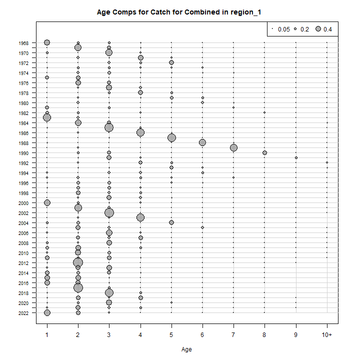
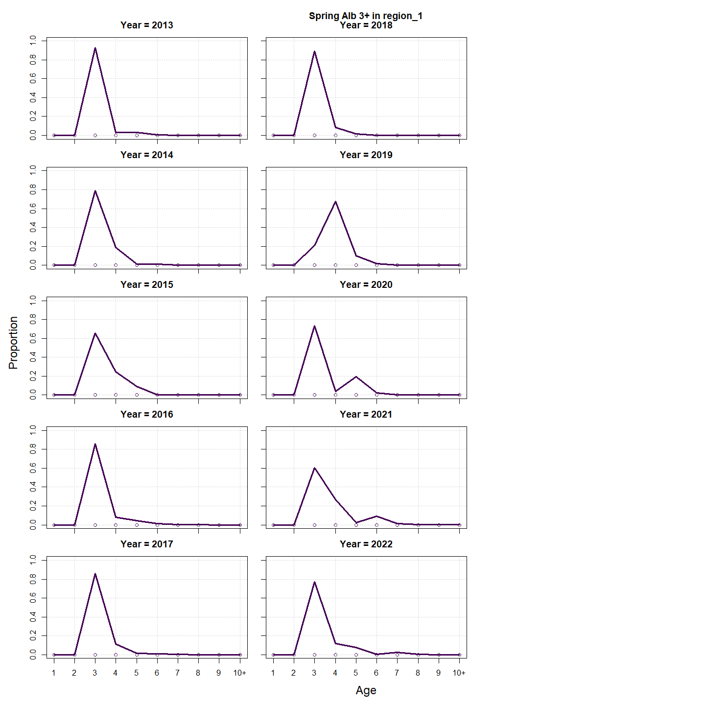
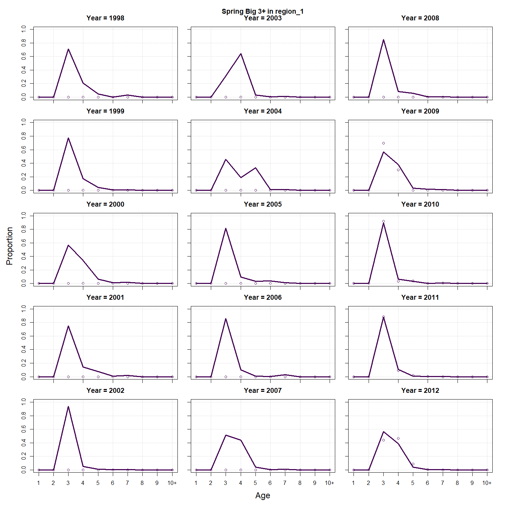
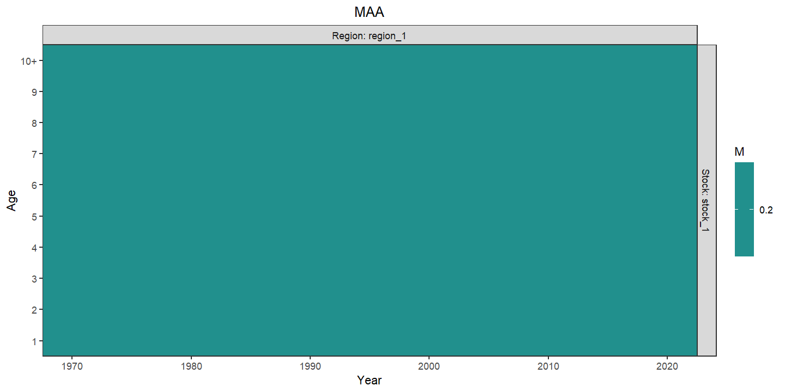
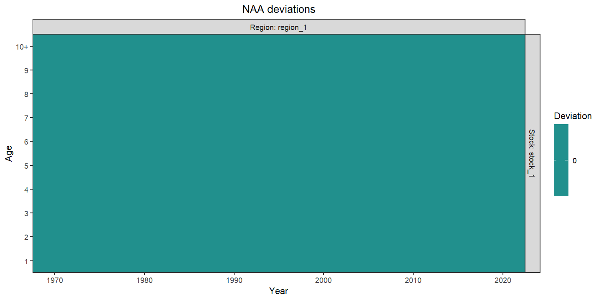
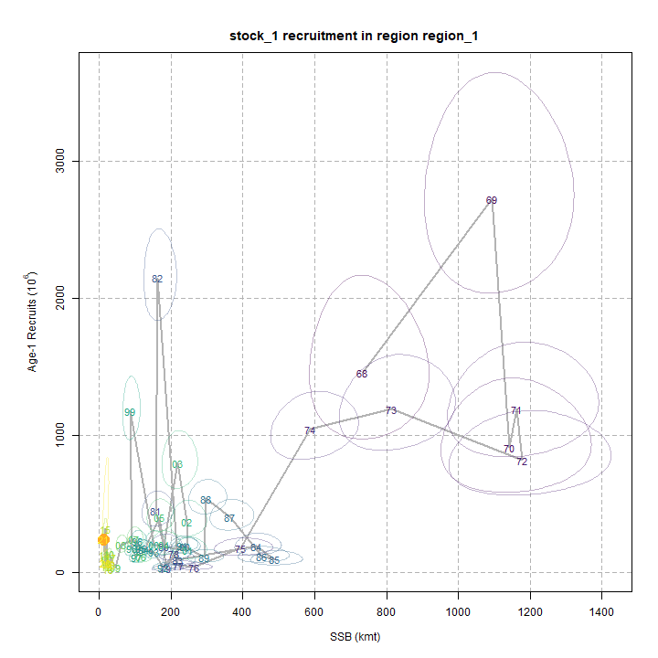
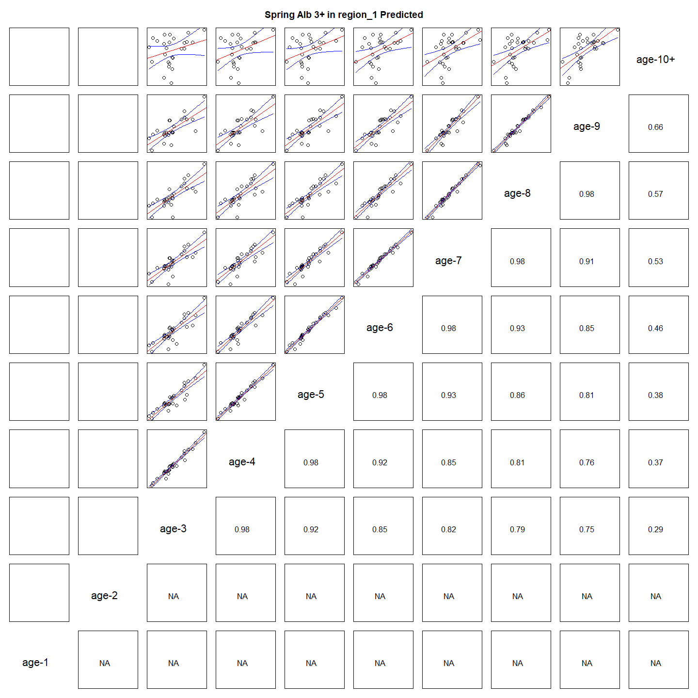

---
output:
  html_document:
    df_print: paged
    keep_md: yes
  word_document: default
  pdf_document:
    fig_caption: yes
    includes:
    keep_tex: yes
    number_sections: no
title: "WHAM figures and tables"
header-includes:
  - \usepackage{longtable}
  - \usepackage{booktabs}
  - \usepackage{caption,graphics}
  - \usepackage{makecell}
  - \usepackage{lscape}
  - \renewcommand\figurename{Fig.}
  - \captionsetup{labelsep=period, singlelinecheck=false}
  - \newcommand{\changesize}[1]{\fontsize{#1pt}{#1pt}\selectfont}
  - \renewcommand{\arraystretch}{1.5}
  - \renewcommand\theadfont{}
---

# {.tabset}

## Figures {.tabset}

### Input

### Diagnostics

### Results

### Retro

### Reference points

### Miscellaneous

## Tables {.tabset}

### Parameter estimates

<table class="table" style="margin-left: auto; margin-right: auto;">
<caption>Parameter estimates, standard errors, and confidence intervals. Rounded to 3 decimal places.</caption>
 <thead>
  <tr>
   <th style="text-align:left;">   </th>
   <th style="text-align:right;"> Estimate </th>
   <th style="text-align:right;"> Std. Error </th>
   <th style="text-align:right;"> 95\% CI lower </th>
   <th style="text-align:right;"> 95\% CI upper </th>
  </tr>
 </thead>
<tbody>
  <tr>
   <td style="text-align:left;"> Combined SSB fully selected q </td>
   <td style="text-align:right;"> $0.002$ </td>
   <td style="text-align:right;"> $3.061\times 10^{-4}$ </td>
   <td style="text-align:right;"> $0.002$ </td>
   <td style="text-align:right;"> $0.003$ </td>
  </tr>
  <tr>
   <td style="text-align:left;"> Spring Big 3+ fully selected q </td>
   <td style="text-align:right;"> $8.743\times 10^{-5}$ </td>
   <td style="text-align:right;"> $1.573\times 10^{-5}$ </td>
   <td style="text-align:right;"> $6.145\times 10^{-5}$ </td>
   <td style="text-align:right;"> $1.244\times 10^{-4}$ </td>
  </tr>
  <tr>
   <td style="text-align:left;"> Spring Alb 3+ fully selected q </td>
   <td style="text-align:right;"> $1.109\times 10^{-5}$ </td>
   <td style="text-align:right;"> $1.694\times 10^{-6}$ </td>
   <td style="text-align:right;"> $8.225\times 10^{-6}$ </td>
   <td style="text-align:right;"> $1.497\times 10^{-5}$ </td>
  </tr>
  <tr>
   <td style="text-align:left;"> Block 1: Combined Selectivity for age 1 </td>
   <td style="text-align:right;"> $0.187$ </td>
   <td style="text-align:right;"> $0.013$ </td>
   <td style="text-align:right;"> $0.162$ </td>
   <td style="text-align:right;"> $0.214$ </td>
  </tr>
  <tr>
   <td style="text-align:left;"> Block 1: Combined Selectivity for age 2 </td>
   <td style="text-align:right;"> $0.523$ </td>
   <td style="text-align:right;"> $0.031$ </td>
   <td style="text-align:right;"> $0.461$ </td>
   <td style="text-align:right;"> $0.583$ </td>
  </tr>
  <tr>
   <td style="text-align:left;"> Block 1: Combined Selectivity for age 3 </td>
   <td style="text-align:right;"> $0.878$ </td>
   <td style="text-align:right;"> $0.053$ </td>
   <td style="text-align:right;"> $0.733$ </td>
   <td style="text-align:right;"> $0.949$ </td>
  </tr>
  <tr>
   <td style="text-align:left;"> Block 1: Combined Selectivity for age 4 </td>
   <td style="text-align:right;"> $0.958$ </td>
   <td style="text-align:right;"> $0.064$ </td>
   <td style="text-align:right;"> $0.498$ </td>
   <td style="text-align:right;"> $0.998$ </td>
  </tr>
  <tr>
   <td style="text-align:left;"> Block 1: Combined Selectivity for age 5 </td>
   <td style="text-align:right;"> $1.000$ </td>
   <td style="text-align:right;"> -- </td>
   <td style="text-align:right;"> -- </td>
   <td style="text-align:right;"> -- </td>
  </tr>
  <tr>
   <td style="text-align:left;"> Block 1: Combined Selectivity for age 6 </td>
   <td style="text-align:right;"> $1.000$ </td>
   <td style="text-align:right;"> -- </td>
   <td style="text-align:right;"> -- </td>
   <td style="text-align:right;"> -- </td>
  </tr>
  <tr>
   <td style="text-align:left;"> Block 1: Combined Selectivity for age 7 </td>
   <td style="text-align:right;"> $1.000$ </td>
   <td style="text-align:right;"> -- </td>
   <td style="text-align:right;"> -- </td>
   <td style="text-align:right;"> -- </td>
  </tr>
  <tr>
   <td style="text-align:left;"> Block 1: Combined Selectivity for age 8 </td>
   <td style="text-align:right;"> $1.000$ </td>
   <td style="text-align:right;"> -- </td>
   <td style="text-align:right;"> -- </td>
   <td style="text-align:right;"> -- </td>
  </tr>
  <tr>
   <td style="text-align:left;"> Block 1: Combined Selectivity for age 9 </td>
   <td style="text-align:right;"> $1.000$ </td>
   <td style="text-align:right;"> -- </td>
   <td style="text-align:right;"> -- </td>
   <td style="text-align:right;"> -- </td>
  </tr>
  <tr>
   <td style="text-align:left;"> Block 1: Combined Selectivity for age 10+ </td>
   <td style="text-align:right;"> $1.000$ </td>
   <td style="text-align:right;"> -- </td>
   <td style="text-align:right;"> -- </td>
   <td style="text-align:right;"> -- </td>
  </tr>
  <tr>
   <td style="text-align:left;"> Block 2: Combined SSB Selectivity for age 1 </td>
   <td style="text-align:right;"> $1.000$ </td>
   <td style="text-align:right;"> -- </td>
   <td style="text-align:right;"> -- </td>
   <td style="text-align:right;"> -- </td>
  </tr>
  <tr>
   <td style="text-align:left;"> Block 2: Combined SSB Selectivity for age 2 </td>
   <td style="text-align:right;"> $1.000$ </td>
   <td style="text-align:right;"> -- </td>
   <td style="text-align:right;"> -- </td>
   <td style="text-align:right;"> -- </td>
  </tr>
  <tr>
   <td style="text-align:left;"> Block 2: Combined SSB Selectivity for age 3 </td>
   <td style="text-align:right;"> $1.000$ </td>
   <td style="text-align:right;"> -- </td>
   <td style="text-align:right;"> -- </td>
   <td style="text-align:right;"> -- </td>
  </tr>
  <tr>
   <td style="text-align:left;"> Block 2: Combined SSB Selectivity for age 4 </td>
   <td style="text-align:right;"> $1.000$ </td>
   <td style="text-align:right;"> -- </td>
   <td style="text-align:right;"> -- </td>
   <td style="text-align:right;"> -- </td>
  </tr>
  <tr>
   <td style="text-align:left;"> Block 2: Combined SSB Selectivity for age 5 </td>
   <td style="text-align:right;"> $1.000$ </td>
   <td style="text-align:right;"> -- </td>
   <td style="text-align:right;"> -- </td>
   <td style="text-align:right;"> -- </td>
  </tr>
  <tr>
   <td style="text-align:left;"> Block 2: Combined SSB Selectivity for age 6 </td>
   <td style="text-align:right;"> $1.000$ </td>
   <td style="text-align:right;"> -- </td>
   <td style="text-align:right;"> -- </td>
   <td style="text-align:right;"> -- </td>
  </tr>
  <tr>
   <td style="text-align:left;"> Block 2: Combined SSB Selectivity for age 7 </td>
   <td style="text-align:right;"> $1.000$ </td>
   <td style="text-align:right;"> -- </td>
   <td style="text-align:right;"> -- </td>
   <td style="text-align:right;"> -- </td>
  </tr>
  <tr>
   <td style="text-align:left;"> Block 2: Combined SSB Selectivity for age 8 </td>
   <td style="text-align:right;"> $1.000$ </td>
   <td style="text-align:right;"> -- </td>
   <td style="text-align:right;"> -- </td>
   <td style="text-align:right;"> -- </td>
  </tr>
  <tr>
   <td style="text-align:left;"> Block 2: Combined SSB Selectivity for age 9 </td>
   <td style="text-align:right;"> $1.000$ </td>
   <td style="text-align:right;"> -- </td>
   <td style="text-align:right;"> -- </td>
   <td style="text-align:right;"> -- </td>
  </tr>
  <tr>
   <td style="text-align:left;"> Block 2: Combined SSB Selectivity for age 10+ </td>
   <td style="text-align:right;"> $1.000$ </td>
   <td style="text-align:right;"> -- </td>
   <td style="text-align:right;"> -- </td>
   <td style="text-align:right;"> -- </td>
  </tr>
  <tr>
   <td style="text-align:left;"> Block 3: Spring Big 3+ Selectivity for age 1 </td>
   <td style="text-align:right;"> $0.000$ </td>
   <td style="text-align:right;"> -- </td>
   <td style="text-align:right;"> -- </td>
   <td style="text-align:right;"> -- </td>
  </tr>
  <tr>
   <td style="text-align:left;"> Block 3: Spring Big 3+ Selectivity for age 2 </td>
   <td style="text-align:right;"> $0.000$ </td>
   <td style="text-align:right;"> -- </td>
   <td style="text-align:right;"> -- </td>
   <td style="text-align:right;"> -- </td>
  </tr>
  <tr>
   <td style="text-align:left;"> Block 3: Spring Big 3+ Selectivity for age 3 </td>
   <td style="text-align:right;"> $1.000$ </td>
   <td style="text-align:right;"> -- </td>
   <td style="text-align:right;"> -- </td>
   <td style="text-align:right;"> -- </td>
  </tr>
  <tr>
   <td style="text-align:left;"> Block 3: Spring Big 3+ Selectivity for age 4 </td>
   <td style="text-align:right;"> $0.536$ </td>
   <td style="text-align:right;"> -- </td>
   <td style="text-align:right;"> -- </td>
   <td style="text-align:right;"> -- </td>
  </tr>
  <tr>
   <td style="text-align:left;"> Block 3: Spring Big 3+ Selectivity for age 5 </td>
   <td style="text-align:right;"> $0.254$ </td>
   <td style="text-align:right;"> -- </td>
   <td style="text-align:right;"> -- </td>
   <td style="text-align:right;"> -- </td>
  </tr>
  <tr>
   <td style="text-align:left;"> Block 3: Spring Big 3+ Selectivity for age 6 </td>
   <td style="text-align:right;"> $0.081$ </td>
   <td style="text-align:right;"> -- </td>
   <td style="text-align:right;"> -- </td>
   <td style="text-align:right;"> -- </td>
  </tr>
  <tr>
   <td style="text-align:left;"> Block 3: Spring Big 3+ Selectivity for age 7 </td>
   <td style="text-align:right;"> $0.300$ </td>
   <td style="text-align:right;"> -- </td>
   <td style="text-align:right;"> -- </td>
   <td style="text-align:right;"> -- </td>
  </tr>
  <tr>
   <td style="text-align:left;"> Block 3: Spring Big 3+ Selectivity for age 8 </td>
   <td style="text-align:right;"> $0.000$ </td>
   <td style="text-align:right;"> -- </td>
   <td style="text-align:right;"> -- </td>
   <td style="text-align:right;"> -- </td>
  </tr>
  <tr>
   <td style="text-align:left;"> Block 3: Spring Big 3+ Selectivity for age 9 </td>
   <td style="text-align:right;"> $0.000$ </td>
   <td style="text-align:right;"> -- </td>
   <td style="text-align:right;"> -- </td>
   <td style="text-align:right;"> -- </td>
  </tr>
  <tr>
   <td style="text-align:left;"> Block 3: Spring Big 3+ Selectivity for age 10+ </td>
   <td style="text-align:right;"> $0.000$ </td>
   <td style="text-align:right;"> -- </td>
   <td style="text-align:right;"> -- </td>
   <td style="text-align:right;"> -- </td>
  </tr>
  <tr>
   <td style="text-align:left;"> Block 4: Spring Alb 3+ Selectivity for age 1 </td>
   <td style="text-align:right;"> $0.000$ </td>
   <td style="text-align:right;"> -- </td>
   <td style="text-align:right;"> -- </td>
   <td style="text-align:right;"> -- </td>
  </tr>
  <tr>
   <td style="text-align:left;"> Block 4: Spring Alb 3+ Selectivity for age 2 </td>
   <td style="text-align:right;"> $0.000$ </td>
   <td style="text-align:right;"> -- </td>
   <td style="text-align:right;"> -- </td>
   <td style="text-align:right;"> -- </td>
  </tr>
  <tr>
   <td style="text-align:left;"> Block 4: Spring Alb 3+ Selectivity for age 3 </td>
   <td style="text-align:right;"> $1.000$ </td>
   <td style="text-align:right;"> -- </td>
   <td style="text-align:right;"> -- </td>
   <td style="text-align:right;"> -- </td>
  </tr>
  <tr>
   <td style="text-align:left;"> Block 4: Spring Alb 3+ Selectivity for age 4 </td>
   <td style="text-align:right;"> $0.579$ </td>
   <td style="text-align:right;"> $0.060$ </td>
   <td style="text-align:right;"> $0.460$ </td>
   <td style="text-align:right;"> $0.690$ </td>
  </tr>
  <tr>
   <td style="text-align:left;"> Block 4: Spring Alb 3+ Selectivity for age 5 </td>
   <td style="text-align:right;"> $0.545$ </td>
   <td style="text-align:right;"> $0.067$ </td>
   <td style="text-align:right;"> $0.414$ </td>
   <td style="text-align:right;"> $0.670$ </td>
  </tr>
  <tr>
   <td style="text-align:left;"> Block 4: Spring Alb 3+ Selectivity for age 6 </td>
   <td style="text-align:right;"> $0.458$ </td>
   <td style="text-align:right;"> $0.069$ </td>
   <td style="text-align:right;"> $0.329$ </td>
   <td style="text-align:right;"> $0.593$ </td>
  </tr>
  <tr>
   <td style="text-align:left;"> Block 4: Spring Alb 3+ Selectivity for age 7 </td>
   <td style="text-align:right;"> $0.389$ </td>
   <td style="text-align:right;"> $0.071$ </td>
   <td style="text-align:right;"> $0.262$ </td>
   <td style="text-align:right;"> $0.533$ </td>
  </tr>
  <tr>
   <td style="text-align:left;"> Block 4: Spring Alb 3+ Selectivity for age 8 </td>
   <td style="text-align:right;"> $0.309$ </td>
   <td style="text-align:right;"> $0.073$ </td>
   <td style="text-align:right;"> $0.186$ </td>
   <td style="text-align:right;"> $0.467$ </td>
  </tr>
  <tr>
   <td style="text-align:left;"> Block 4: Spring Alb 3+ Selectivity for age 9 </td>
   <td style="text-align:right;"> $0.431$ </td>
   <td style="text-align:right;"> -- </td>
   <td style="text-align:right;"> -- </td>
   <td style="text-align:right;"> -- </td>
  </tr>
  <tr>
   <td style="text-align:left;"> Block 4: Spring Alb 3+ Selectivity for age 10+ </td>
   <td style="text-align:right;"> $0.410$ </td>
   <td style="text-align:right;"> -- </td>
   <td style="text-align:right;"> -- </td>
   <td style="text-align:right;"> -- </td>
  </tr>
</tbody>
</table>

### Abundance at age

<table class="table" style="margin-left: auto; margin-right: auto;">
<caption>Abundance at age (1000s) for stock 1 in region 1.</caption>
 <thead>
  <tr>
   <th style="text-align:left;">   </th>
   <th style="text-align:right;"> 1 </th>
   <th style="text-align:right;"> 2 </th>
   <th style="text-align:right;"> 3 </th>
   <th style="text-align:right;"> 4 </th>
   <th style="text-align:right;"> 5 </th>
   <th style="text-align:right;"> 6 </th>
   <th style="text-align:right;"> 7 </th>
   <th style="text-align:right;"> 8 </th>
   <th style="text-align:right;"> 9 </th>
   <th style="text-align:right;"> 10+ </th>
  </tr>
 </thead>
<tbody>
  <tr>
   <td style="text-align:left;"> 1968 </td>
   <td style="text-align:right;"> 4957835 </td>
   <td style="text-align:right;"> 1389435 </td>
   <td style="text-align:right;"> 490845 </td>
   <td style="text-align:right;"> 178437 </td>
   <td style="text-align:right;"> 79792 </td>
   <td style="text-align:right;"> 50232 </td>
   <td style="text-align:right;"> 29102 </td>
   <td style="text-align:right;"> 15743 </td>
   <td style="text-align:right;"> 86185 </td>
   <td style="text-align:right;"> 1140 </td>
  </tr>
  <tr>
   <td style="text-align:left;"> 1969 </td>
   <td style="text-align:right;"> 1451695 </td>
   <td style="text-align:right;"> 3939739 </td>
   <td style="text-align:right;"> 1046511 </td>
   <td style="text-align:right;"> 349329 </td>
   <td style="text-align:right;"> 125366 </td>
   <td style="text-align:right;"> 55687 </td>
   <td style="text-align:right;"> 35057 </td>
   <td style="text-align:right;"> 20311 </td>
   <td style="text-align:right;"> 10987 </td>
   <td style="text-align:right;"> 60945 </td>
  </tr>
  <tr>
   <td style="text-align:left;"> 1970 </td>
   <td style="text-align:right;"> 2723544 </td>
   <td style="text-align:right;"> 1155476 </td>
   <td style="text-align:right;"> 2980977 </td>
   <td style="text-align:right;"> 750531 </td>
   <td style="text-align:right;"> 247498 </td>
   <td style="text-align:right;"> 88263 </td>
   <td style="text-align:right;"> 39206 </td>
   <td style="text-align:right;"> 24682 </td>
   <td style="text-align:right;"> 14299 </td>
   <td style="text-align:right;"> 50643 </td>
  </tr>
  <tr>
   <td style="text-align:left;"> 1971 </td>
   <td style="text-align:right;"> 908511 </td>
   <td style="text-align:right;"> 2141071 </td>
   <td style="text-align:right;"> 844484 </td>
   <td style="text-align:right;"> 2016934 </td>
   <td style="text-align:right;"> 498986 </td>
   <td style="text-align:right;"> 163059 </td>
   <td style="text-align:right;"> 58150 </td>
   <td style="text-align:right;"> 25830 </td>
   <td style="text-align:right;"> 16261 </td>
   <td style="text-align:right;"> 42786 </td>
  </tr>
  <tr>
   <td style="text-align:left;"> 1972 </td>
   <td style="text-align:right;"> 1189439 </td>
   <td style="text-align:right;"> 697973 </td>
   <td style="text-align:right;"> 1467390 </td>
   <td style="text-align:right;"> 512915 </td>
   <td style="text-align:right;"> 1191852 </td>
   <td style="text-align:right;"> 290696 </td>
   <td style="text-align:right;"> 94994 </td>
   <td style="text-align:right;"> 33877 </td>
   <td style="text-align:right;"> 15048 </td>
   <td style="text-align:right;"> 34399 </td>
  </tr>
  <tr>
   <td style="text-align:left;"> 1973 </td>
   <td style="text-align:right;"> 814828 </td>
   <td style="text-align:right;"> 909854 </td>
   <td style="text-align:right;"> 472611 </td>
   <td style="text-align:right;"> 873341 </td>
   <td style="text-align:right;"> 296449 </td>
   <td style="text-align:right;"> 678465 </td>
   <td style="text-align:right;"> 165480 </td>
   <td style="text-align:right;"> 54076 </td>
   <td style="text-align:right;"> 19284 </td>
   <td style="text-align:right;"> 28148 </td>
  </tr>
  <tr>
   <td style="text-align:left;"> 1974 </td>
   <td style="text-align:right;"> 1187883 </td>
   <td style="text-align:right;"> 604321 </td>
   <td style="text-align:right;"> 565081 </td>
   <td style="text-align:right;"> 243289 </td>
   <td style="text-align:right;"> 430801 </td>
   <td style="text-align:right;"> 143034 </td>
   <td style="text-align:right;"> 327353 </td>
   <td style="text-align:right;"> 79842 </td>
   <td style="text-align:right;"> 26091 </td>
   <td style="text-align:right;"> 22886 </td>
  </tr>
  <tr>
   <td style="text-align:left;"> 1975 </td>
   <td style="text-align:right;"> 1042057 </td>
   <td style="text-align:right;"> 868270 </td>
   <td style="text-align:right;"> 360364 </td>
   <td style="text-align:right;"> 271685 </td>
   <td style="text-align:right;"> 111384 </td>
   <td style="text-align:right;"> 192292 </td>
   <td style="text-align:right;"> 63844 </td>
   <td style="text-align:right;"> 146117 </td>
   <td style="text-align:right;"> 35638 </td>
   <td style="text-align:right;"> 21861 </td>
  </tr>
  <tr>
   <td style="text-align:left;"> 1976 </td>
   <td style="text-align:right;"> 175511 </td>
   <td style="text-align:right;"> 745833 </td>
   <td style="text-align:right;"> 488214 </td>
   <td style="text-align:right;"> 156979 </td>
   <td style="text-align:right;"> 111679 </td>
   <td style="text-align:right;"> 44430 </td>
   <td style="text-align:right;"> 76702 </td>
   <td style="text-align:right;"> 25467 </td>
   <td style="text-align:right;"> 58284 </td>
   <td style="text-align:right;"> 22936 </td>
  </tr>
  <tr>
   <td style="text-align:left;"> 1977 </td>
   <td style="text-align:right;"> 36457 </td>
   <td style="text-align:right;"> 120526 </td>
   <td style="text-align:right;"> 373560 </td>
   <td style="text-align:right;"> 175126 </td>
   <td style="text-align:right;"> 52195 </td>
   <td style="text-align:right;"> 35701 </td>
   <td style="text-align:right;"> 14203 </td>
   <td style="text-align:right;"> 24520 </td>
   <td style="text-align:right;"> 8141 </td>
   <td style="text-align:right;"> 25964 </td>
  </tr>
  <tr>
   <td style="text-align:left;"> 1978 </td>
   <td style="text-align:right;"> 50239 </td>
   <td style="text-align:right;"> 27825 </td>
   <td style="text-align:right;"> 81103 </td>
   <td style="text-align:right;"> 220015 </td>
   <td style="text-align:right;"> 100067 </td>
   <td style="text-align:right;"> 29360 </td>
   <td style="text-align:right;"> 20082 </td>
   <td style="text-align:right;"> 7989 </td>
   <td style="text-align:right;"> 13792 </td>
   <td style="text-align:right;"> 19184 </td>
  </tr>
  <tr>
   <td style="text-align:left;"> 1979 </td>
   <td style="text-align:right;"> 131742 </td>
   <td style="text-align:right;"> 40088 </td>
   <td style="text-align:right;"> 21202 </td>
   <td style="text-align:right;"> 58856 </td>
   <td style="text-align:right;"> 157903 </td>
   <td style="text-align:right;"> 71405 </td>
   <td style="text-align:right;"> 20951 </td>
   <td style="text-align:right;"> 14330 </td>
   <td style="text-align:right;"> 5701 </td>
   <td style="text-align:right;"> 23531 </td>
  </tr>
  <tr>
   <td style="text-align:left;"> 1980 </td>
   <td style="text-align:right;"> 26887 </td>
   <td style="text-align:right;"> 104287 </td>
   <td style="text-align:right;"> 29871 </td>
   <td style="text-align:right;"> 14819 </td>
   <td style="text-align:right;"> 40543 </td>
   <td style="text-align:right;"> 107956 </td>
   <td style="text-align:right;"> 48819 </td>
   <td style="text-align:right;"> 14324 </td>
   <td style="text-align:right;"> 9797 </td>
   <td style="text-align:right;"> 19986 </td>
  </tr>
  <tr>
   <td style="text-align:left;"> 1981 </td>
   <td style="text-align:right;"> 186971 </td>
   <td style="text-align:right;"> 21401 </td>
   <td style="text-align:right;"> 78908 </td>
   <td style="text-align:right;"> 21423 </td>
   <td style="text-align:right;"> 10499 </td>
   <td style="text-align:right;"> 28544 </td>
   <td style="text-align:right;"> 76005 </td>
   <td style="text-align:right;"> 34370 </td>
   <td style="text-align:right;"> 10084 </td>
   <td style="text-align:right;"> 20968 </td>
  </tr>
  <tr>
   <td style="text-align:left;"> 1982 </td>
   <td style="text-align:right;"> 445664 </td>
   <td style="text-align:right;"> 147616 </td>
   <td style="text-align:right;"> 15830 </td>
   <td style="text-align:right;"> 54475 </td>
   <td style="text-align:right;"> 14560 </td>
   <td style="text-align:right;"> 7078 </td>
   <td style="text-align:right;"> 19242 </td>
   <td style="text-align:right;"> 51237 </td>
   <td style="text-align:right;"> 23170 </td>
   <td style="text-align:right;"> 20933 </td>
  </tr>
  <tr>
   <td style="text-align:left;"> 1983 </td>
   <td style="text-align:right;"> 2144980 </td>
   <td style="text-align:right;"> 352462 </td>
   <td style="text-align:right;"> 109711 </td>
   <td style="text-align:right;"> 11016 </td>
   <td style="text-align:right;"> 37349 </td>
   <td style="text-align:right;"> 9905 </td>
   <td style="text-align:right;"> 4815 </td>
   <td style="text-align:right;"> 13091 </td>
   <td style="text-align:right;"> 34858 </td>
   <td style="text-align:right;"> 30005 </td>
  </tr>
  <tr>
   <td style="text-align:left;"> 1984 </td>
   <td style="text-align:right;"> 89589 </td>
   <td style="text-align:right;"> 1705591 </td>
   <td style="text-align:right;"> 265944 </td>
   <td style="text-align:right;"> 78314 </td>
   <td style="text-align:right;"> 7765 </td>
   <td style="text-align:right;"> 26155 </td>
   <td style="text-align:right;"> 6937 </td>
   <td style="text-align:right;"> 3372 </td>
   <td style="text-align:right;"> 9167 </td>
   <td style="text-align:right;"> 45422 </td>
  </tr>
  <tr>
   <td style="text-align:left;"> 1985 </td>
   <td style="text-align:right;"> 189123 </td>
   <td style="text-align:right;"> 71812 </td>
   <td style="text-align:right;"> 1316134 </td>
   <td style="text-align:right;"> 197127 </td>
   <td style="text-align:right;"> 57521 </td>
   <td style="text-align:right;"> 5677 </td>
   <td style="text-align:right;"> 19120 </td>
   <td style="text-align:right;"> 5071 </td>
   <td style="text-align:right;"> 2465 </td>
   <td style="text-align:right;"> 39906 </td>
  </tr>
  <tr>
   <td style="text-align:left;"> 1986 </td>
   <td style="text-align:right;"> 92256 </td>
   <td style="text-align:right;"> 150293 </td>
   <td style="text-align:right;"> 54095 </td>
   <td style="text-align:right;"> 936888 </td>
   <td style="text-align:right;"> 138531 </td>
   <td style="text-align:right;"> 40154 </td>
   <td style="text-align:right;"> 3963 </td>
   <td style="text-align:right;"> 13347 </td>
   <td style="text-align:right;"> 3540 </td>
   <td style="text-align:right;"> 29579 </td>
  </tr>
  <tr>
   <td style="text-align:left;"> 1987 </td>
   <td style="text-align:right;"> 117443 </td>
   <td style="text-align:right;"> 73248 </td>
   <td style="text-align:right;"> 112929 </td>
   <td style="text-align:right;"> 38345 </td>
   <td style="text-align:right;"> 655359 </td>
   <td style="text-align:right;"> 96240 </td>
   <td style="text-align:right;"> 27896 </td>
   <td style="text-align:right;"> 2753 </td>
   <td style="text-align:right;"> 9273 </td>
   <td style="text-align:right;"> 23008 </td>
  </tr>
  <tr>
   <td style="text-align:left;"> 1988 </td>
   <td style="text-align:right;"> 404046 </td>
   <td style="text-align:right;"> 92039 </td>
   <td style="text-align:right;"> 53069 </td>
   <td style="text-align:right;"> 75298 </td>
   <td style="text-align:right;"> 25089 </td>
   <td style="text-align:right;"> 424628 </td>
   <td style="text-align:right;"> 62357 </td>
   <td style="text-align:right;"> 18075 </td>
   <td style="text-align:right;"> 1784 </td>
   <td style="text-align:right;"> 20916 </td>
  </tr>
  <tr>
   <td style="text-align:left;"> 1989 </td>
   <td style="text-align:right;"> 536660 </td>
   <td style="text-align:right;"> 312832 </td>
   <td style="text-align:right;"> 64463 </td>
   <td style="text-align:right;"> 33429 </td>
   <td style="text-align:right;"> 46301 </td>
   <td style="text-align:right;"> 15236 </td>
   <td style="text-align:right;"> 257865 </td>
   <td style="text-align:right;"> 37868 </td>
   <td style="text-align:right;"> 10976 </td>
   <td style="text-align:right;"> 13785 </td>
  </tr>
  <tr>
   <td style="text-align:left;"> 1990 </td>
   <td style="text-align:right;"> 110147 </td>
   <td style="text-align:right;"> 415449 </td>
   <td style="text-align:right;"> 219016 </td>
   <td style="text-align:right;"> 40579 </td>
   <td style="text-align:right;"> 20541 </td>
   <td style="text-align:right;"> 28096 </td>
   <td style="text-align:right;"> 9245 </td>
   <td style="text-align:right;"> 156476 </td>
   <td style="text-align:right;"> 22979 </td>
   <td style="text-align:right;"> 15025 </td>
  </tr>
  <tr>
   <td style="text-align:left;"> 1991 </td>
   <td style="text-align:right;"> 185604 </td>
   <td style="text-align:right;"> 83313 </td>
   <td style="text-align:right;"> 272593 </td>
   <td style="text-align:right;"> 123641 </td>
   <td style="text-align:right;"> 22138 </td>
   <td style="text-align:right;"> 11009 </td>
   <td style="text-align:right;"> 15059 </td>
   <td style="text-align:right;"> 4955 </td>
   <td style="text-align:right;"> 83868 </td>
   <td style="text-align:right;"> 20369 </td>
  </tr>
  <tr>
   <td style="text-align:left;"> 1992 </td>
   <td style="text-align:right;"> 196632 </td>
   <td style="text-align:right;"> 142566 </td>
   <td style="text-align:right;"> 57069 </td>
   <td style="text-align:right;"> 165422 </td>
   <td style="text-align:right;"> 72993 </td>
   <td style="text-align:right;"> 12884 </td>
   <td style="text-align:right;"> 6407 </td>
   <td style="text-align:right;"> 8764 </td>
   <td style="text-align:right;"> 2884 </td>
   <td style="text-align:right;"> 60666 </td>
  </tr>
  <tr>
   <td style="text-align:left;"> 1993 </td>
   <td style="text-align:right;"> 37382 </td>
   <td style="text-align:right;"> 153442 </td>
   <td style="text-align:right;"> 102067 </td>
   <td style="text-align:right;"> 37299 </td>
   <td style="text-align:right;"> 105898 </td>
   <td style="text-align:right;"> 46229 </td>
   <td style="text-align:right;"> 8160 </td>
   <td style="text-align:right;"> 4058 </td>
   <td style="text-align:right;"> 5551 </td>
   <td style="text-align:right;"> 40248 </td>
  </tr>
  <tr>
   <td style="text-align:left;"> 1994 </td>
   <td style="text-align:right;"> 145233 </td>
   <td style="text-align:right;"> 29168 </td>
   <td style="text-align:right;"> 109821 </td>
   <td style="text-align:right;"> 66674 </td>
   <td style="text-align:right;"> 23864 </td>
   <td style="text-align:right;"> 67029 </td>
   <td style="text-align:right;"> 29261 </td>
   <td style="text-align:right;"> 5165 </td>
   <td style="text-align:right;"> 2569 </td>
   <td style="text-align:right;"> 28989 </td>
  </tr>
  <tr>
   <td style="text-align:left;"> 1995 </td>
   <td style="text-align:right;"> 170250 </td>
   <td style="text-align:right;"> 111991 </td>
   <td style="text-align:right;"> 20198 </td>
   <td style="text-align:right;"> 67871 </td>
   <td style="text-align:right;"> 40153 </td>
   <td style="text-align:right;"> 14180 </td>
   <td style="text-align:right;"> 39830 </td>
   <td style="text-align:right;"> 17388 </td>
   <td style="text-align:right;"> 3069 </td>
   <td style="text-align:right;"> 18752 </td>
  </tr>
  <tr>
   <td style="text-align:left;"> 1996 </td>
   <td style="text-align:right;"> 172401 </td>
   <td style="text-align:right;"> 132590 </td>
   <td style="text-align:right;"> 79731 </td>
   <td style="text-align:right;"> 13078 </td>
   <td style="text-align:right;"> 43006 </td>
   <td style="text-align:right;"> 25160 </td>
   <td style="text-align:right;"> 8885 </td>
   <td style="text-align:right;"> 24957 </td>
   <td style="text-align:right;"> 10895 </td>
   <td style="text-align:right;"> 13673 </td>
  </tr>
  <tr>
   <td style="text-align:left;"> 1997 </td>
   <td style="text-align:right;"> 225239 </td>
   <td style="text-align:right;"> 129701 </td>
   <td style="text-align:right;"> 85699 </td>
   <td style="text-align:right;"> 43888 </td>
   <td style="text-align:right;"> 6941 </td>
   <td style="text-align:right;"> 22396 </td>
   <td style="text-align:right;"> 13103 </td>
   <td style="text-align:right;"> 4627 </td>
   <td style="text-align:right;"> 12997 </td>
   <td style="text-align:right;"> 12794 </td>
  </tr>
  <tr>
   <td style="text-align:left;"> 1998 </td>
   <td style="text-align:right;"> 108831 </td>
   <td style="text-align:right;"> 168515 </td>
   <td style="text-align:right;"> 82543 </td>
   <td style="text-align:right;"> 45962 </td>
   <td style="text-align:right;"> 22640 </td>
   <td style="text-align:right;"> 3509 </td>
   <td style="text-align:right;"> 11323 </td>
   <td style="text-align:right;"> 6624 </td>
   <td style="text-align:right;"> 2339 </td>
   <td style="text-align:right;"> 13039 </td>
  </tr>
  <tr>
   <td style="text-align:left;"> 1999 </td>
   <td style="text-align:right;"> 177375 </td>
   <td style="text-align:right;"> 81602 </td>
   <td style="text-align:right;"> 107904 </td>
   <td style="text-align:right;"> 44727 </td>
   <td style="text-align:right;"> 23977 </td>
   <td style="text-align:right;"> 11581 </td>
   <td style="text-align:right;"> 1795 </td>
   <td style="text-align:right;"> 5792 </td>
   <td style="text-align:right;"> 3388 </td>
   <td style="text-align:right;"> 7866 </td>
  </tr>
  <tr>
   <td style="text-align:left;"> 2000 </td>
   <td style="text-align:right;"> 1175378 </td>
   <td style="text-align:right;"> 133329 </td>
   <td style="text-align:right;"> 52618 </td>
   <td style="text-align:right;"> 59159 </td>
   <td style="text-align:right;"> 23634 </td>
   <td style="text-align:right;"> 12430 </td>
   <td style="text-align:right;"> 6004 </td>
   <td style="text-align:right;"> 930 </td>
   <td style="text-align:right;"> 3003 </td>
   <td style="text-align:right;"> 5835 </td>
  </tr>
  <tr>
   <td style="text-align:left;"> 2001 </td>
   <td style="text-align:right;"> 198353 </td>
   <td style="text-align:right;"> 919395 </td>
   <td style="text-align:right;"> 96092 </td>
   <td style="text-align:right;"> 34776 </td>
   <td style="text-align:right;"> 38336 </td>
   <td style="text-align:right;"> 15160 </td>
   <td style="text-align:right;"> 7973 </td>
   <td style="text-align:right;"> 3851 </td>
   <td style="text-align:right;"> 597 </td>
   <td style="text-align:right;"> 5669 </td>
  </tr>
  <tr>
   <td style="text-align:left;"> 2002 </td>
   <td style="text-align:right;"> 157698 </td>
   <td style="text-align:right;"> 155433 </td>
   <td style="text-align:right;"> 665952 </td>
   <td style="text-align:right;"> 64045 </td>
   <td style="text-align:right;"> 22744 </td>
   <td style="text-align:right;"> 24828 </td>
   <td style="text-align:right;"> 9818 </td>
   <td style="text-align:right;"> 5164 </td>
   <td style="text-align:right;"> 2494 </td>
   <td style="text-align:right;"> 4058 </td>
  </tr>
  <tr>
   <td style="text-align:left;"> 2003 </td>
   <td style="text-align:right;"> 369464 </td>
   <td style="text-align:right;"> 122230 </td>
   <td style="text-align:right;"> 109196 </td>
   <td style="text-align:right;"> 421646 </td>
   <td style="text-align:right;"> 39603 </td>
   <td style="text-align:right;"> 13893 </td>
   <td style="text-align:right;"> 15166 </td>
   <td style="text-align:right;"> 5997 </td>
   <td style="text-align:right;"> 3154 </td>
   <td style="text-align:right;"> 4002 </td>
  </tr>
  <tr>
   <td style="text-align:left;"> 2004 </td>
   <td style="text-align:right;"> 794623 </td>
   <td style="text-align:right;"> 280459 </td>
   <td style="text-align:right;"> 81008 </td>
   <td style="text-align:right;"> 62691 </td>
   <td style="text-align:right;"> 234301 </td>
   <td style="text-align:right;"> 21638 </td>
   <td style="text-align:right;"> 7590 </td>
   <td style="text-align:right;"> 8286 </td>
   <td style="text-align:right;"> 3277 </td>
   <td style="text-align:right;"> 3910 </td>
  </tr>
  <tr>
   <td style="text-align:left;"> 2005 </td>
   <td style="text-align:right;"> 198213 </td>
   <td style="text-align:right;"> 572914 </td>
   <td style="text-align:right;"> 160956 </td>
   <td style="text-align:right;"> 36521 </td>
   <td style="text-align:right;"> 26755 </td>
   <td style="text-align:right;"> 97190 </td>
   <td style="text-align:right;"> 8975 </td>
   <td style="text-align:right;"> 3149 </td>
   <td style="text-align:right;"> 3437 </td>
   <td style="text-align:right;"> 2981 </td>
  </tr>
  <tr>
   <td style="text-align:left;"> 2006 </td>
   <td style="text-align:right;"> 399205 </td>
   <td style="text-align:right;"> 142591 </td>
   <td style="text-align:right;"> 326754 </td>
   <td style="text-align:right;"> 71809 </td>
   <td style="text-align:right;"> 15409 </td>
   <td style="text-align:right;"> 10966 </td>
   <td style="text-align:right;"> 39837 </td>
   <td style="text-align:right;"> 3679 </td>
   <td style="text-align:right;"> 1291 </td>
   <td style="text-align:right;"> 2631 </td>
  </tr>
  <tr>
   <td style="text-align:left;"> 2007 </td>
   <td style="text-align:right;"> 111696 </td>
   <td style="text-align:right;"> 273334 </td>
   <td style="text-align:right;"> 70834 </td>
   <td style="text-align:right;"> 115602 </td>
   <td style="text-align:right;"> 23519 </td>
   <td style="text-align:right;"> 4849 </td>
   <td style="text-align:right;"> 3451 </td>
   <td style="text-align:right;"> 12536 </td>
   <td style="text-align:right;"> 1158 </td>
   <td style="text-align:right;"> 1234 </td>
  </tr>
  <tr>
   <td style="text-align:left;"> 2008 </td>
   <td style="text-align:right;"> 237757 </td>
   <td style="text-align:right;"> 76951 </td>
   <td style="text-align:right;"> 138145 </td>
   <td style="text-align:right;"> 25797 </td>
   <td style="text-align:right;"> 39079 </td>
   <td style="text-align:right;"> 7650 </td>
   <td style="text-align:right;"> 1577 </td>
   <td style="text-align:right;"> 1122 </td>
   <td style="text-align:right;"> 4077 </td>
   <td style="text-align:right;"> 778 </td>
  </tr>
  <tr>
   <td style="text-align:left;"> 2009 </td>
   <td style="text-align:right;"> 199431 </td>
   <td style="text-align:right;"> 164045 </td>
   <td style="text-align:right;"> 39055 </td>
   <td style="text-align:right;"> 50667 </td>
   <td style="text-align:right;"> 8788 </td>
   <td style="text-align:right;"> 12813 </td>
   <td style="text-align:right;"> 2508 </td>
   <td style="text-align:right;"> 517 </td>
   <td style="text-align:right;"> 368 </td>
   <td style="text-align:right;"> 1592 </td>
  </tr>
  <tr>
   <td style="text-align:left;"> 2010 </td>
   <td style="text-align:right;"> 31199 </td>
   <td style="text-align:right;"> 122084 </td>
   <td style="text-align:right;"> 59593 </td>
   <td style="text-align:right;"> 8169 </td>
   <td style="text-align:right;"> 9348 </td>
   <td style="text-align:right;"> 1519 </td>
   <td style="text-align:right;"> 2215 </td>
   <td style="text-align:right;"> 434 </td>
   <td style="text-align:right;"> 89 </td>
   <td style="text-align:right;"> 339 </td>
  </tr>
  <tr>
   <td style="text-align:left;"> 2011 </td>
   <td style="text-align:right;"> 133383 </td>
   <td style="text-align:right;"> 17399 </td>
   <td style="text-align:right;"> 34180 </td>
   <td style="text-align:right;"> 8049 </td>
   <td style="text-align:right;"> 935 </td>
   <td style="text-align:right;"> 982 </td>
   <td style="text-align:right;"> 160 </td>
   <td style="text-align:right;"> 233 </td>
   <td style="text-align:right;"> 46 </td>
   <td style="text-align:right;"> 45 </td>
  </tr>
  <tr>
   <td style="text-align:left;"> 2012 </td>
   <td style="text-align:right;"> 91471 </td>
   <td style="text-align:right;"> 88377 </td>
   <td style="text-align:right;"> 7885 </td>
   <td style="text-align:right;"> 10366 </td>
   <td style="text-align:right;"> 2228 </td>
   <td style="text-align:right;"> 247 </td>
   <td style="text-align:right;"> 259 </td>
   <td style="text-align:right;"> 42 </td>
   <td style="text-align:right;"> 61 </td>
   <td style="text-align:right;"> 24 </td>
  </tr>
  <tr>
   <td style="text-align:left;"> 2013 </td>
   <td style="text-align:right;"> 41473 </td>
   <td style="text-align:right;"> 59409 </td>
   <td style="text-align:right;"> 37880 </td>
   <td style="text-align:right;"> 2178 </td>
   <td style="text-align:right;"> 2590 </td>
   <td style="text-align:right;"> 529 </td>
   <td style="text-align:right;"> 59 </td>
   <td style="text-align:right;"> 62 </td>
   <td style="text-align:right;"> 10 </td>
   <td style="text-align:right;"> 20 </td>
  </tr>
  <tr>
   <td style="text-align:left;"> 2014 </td>
   <td style="text-align:right;"> 83470 </td>
   <td style="text-align:right;"> 27377 </td>
   <td style="text-align:right;"> 26648 </td>
   <td style="text-align:right;"> 11290 </td>
   <td style="text-align:right;"> 591 </td>
   <td style="text-align:right;"> 670 </td>
   <td style="text-align:right;"> 137 </td>
   <td style="text-align:right;"> 15 </td>
   <td style="text-align:right;"> 16 </td>
   <td style="text-align:right;"> 8 </td>
  </tr>
  <tr>
   <td style="text-align:left;"> 2015 </td>
   <td style="text-align:right;"> 130683 </td>
   <td style="text-align:right;"> 55935 </td>
   <td style="text-align:right;"> 12807 </td>
   <td style="text-align:right;"> 8522 </td>
   <td style="text-align:right;"> 3312 </td>
   <td style="text-align:right;"> 166 </td>
   <td style="text-align:right;"> 188 </td>
   <td style="text-align:right;"> 38 </td>
   <td style="text-align:right;"> 4 </td>
   <td style="text-align:right;"> 7 </td>
  </tr>
  <tr>
   <td style="text-align:left;"> 2016 </td>
   <td style="text-align:right;"> 315572 </td>
   <td style="text-align:right;"> 88582 </td>
   <td style="text-align:right;"> 27016 </td>
   <td style="text-align:right;"> 4322 </td>
   <td style="text-align:right;"> 2651 </td>
   <td style="text-align:right;"> 988 </td>
   <td style="text-align:right;"> 49 </td>
   <td style="text-align:right;"> 56 </td>
   <td style="text-align:right;"> 11 </td>
   <td style="text-align:right;"> 3 </td>
  </tr>
  <tr>
   <td style="text-align:left;"> 2017 </td>
   <td style="text-align:right;"> 23314 </td>
   <td style="text-align:right;"> 223122 </td>
   <td style="text-align:right;"> 48136 </td>
   <td style="text-align:right;"> 11113 </td>
   <td style="text-align:right;"> 1669 </td>
   <td style="text-align:right;"> 991 </td>
   <td style="text-align:right;"> 369 </td>
   <td style="text-align:right;"> 18 </td>
   <td style="text-align:right;"> 21 </td>
   <td style="text-align:right;"> 5 </td>
  </tr>
  <tr>
   <td style="text-align:left;"> 2018 </td>
   <td style="text-align:right;"> 105256 </td>
   <td style="text-align:right;"> 16609 </td>
   <td style="text-align:right;"> 123824 </td>
   <td style="text-align:right;"> 20512 </td>
   <td style="text-align:right;"> 4459 </td>
   <td style="text-align:right;"> 649 </td>
   <td style="text-align:right;"> 385 </td>
   <td style="text-align:right;"> 144 </td>
   <td style="text-align:right;"> 7 </td>
   <td style="text-align:right;"> 10 </td>
  </tr>
  <tr>
   <td style="text-align:left;"> 2019 </td>
   <td style="text-align:right;"> 51116 </td>
   <td style="text-align:right;"> 74814 </td>
   <td style="text-align:right;"> 9159 </td>
   <td style="text-align:right;"> 52211 </td>
   <td style="text-align:right;"> 8137 </td>
   <td style="text-align:right;"> 1714 </td>
   <td style="text-align:right;"> 249 </td>
   <td style="text-align:right;"> 148 </td>
   <td style="text-align:right;"> 55 </td>
   <td style="text-align:right;"> 7 </td>
  </tr>
  <tr>
   <td style="text-align:left;"> 2020 </td>
   <td style="text-align:right;"> 64201 </td>
   <td style="text-align:right;"> 36494 </td>
   <td style="text-align:right;"> 41775 </td>
   <td style="text-align:right;"> 3944 </td>
   <td style="text-align:right;"> 21190 </td>
   <td style="text-align:right;"> 3203 </td>
   <td style="text-align:right;"> 675 </td>
   <td style="text-align:right;"> 98 </td>
   <td style="text-align:right;"> 58 </td>
   <td style="text-align:right;"> 24 </td>
  </tr>
  <tr>
   <td style="text-align:left;"> 2021 </td>
   <td style="text-align:right;"> 65226 </td>
   <td style="text-align:right;"> 42817 </td>
   <td style="text-align:right;"> 16844 </td>
   <td style="text-align:right;"> 13063 </td>
   <td style="text-align:right;"> 1129 </td>
   <td style="text-align:right;"> 5793 </td>
   <td style="text-align:right;"> 876 </td>
   <td style="text-align:right;"> 184 </td>
   <td style="text-align:right;"> 27 </td>
   <td style="text-align:right;"> 23 </td>
  </tr>
  <tr>
   <td style="text-align:left;"> 2022 </td>
   <td style="text-align:right;"> 239302 </td>
   <td style="text-align:right;"> 43287 </td>
   <td style="text-align:right;"> 19492 </td>
   <td style="text-align:right;"> 5147 </td>
   <td style="text-align:right;"> 3646 </td>
   <td style="text-align:right;"> 301 </td>
   <td style="text-align:right;"> 1543 </td>
   <td style="text-align:right;"> 233 </td>
   <td style="text-align:right;"> 49 </td>
   <td style="text-align:right;"> 13 </td>
  </tr>
</tbody>
</table>

### Fishing mortality at age by region

<table class="table" style="margin-left: auto; margin-right: auto;">
<caption>Total fishing mortality at age in region 1.</caption>
 <thead>
  <tr>
   <th style="text-align:left;">   </th>
   <th style="text-align:right;"> 1 </th>
   <th style="text-align:right;"> 2 </th>
   <th style="text-align:right;"> 3 </th>
   <th style="text-align:right;"> 4 </th>
   <th style="text-align:right;"> 5 </th>
   <th style="text-align:right;"> 6 </th>
   <th style="text-align:right;"> 7 </th>
   <th style="text-align:right;"> 8 </th>
   <th style="text-align:right;"> 9 </th>
   <th style="text-align:right;"> 10+ </th>
  </tr>
 </thead>
<tbody>
  <tr>
   <td style="text-align:left;"> 1968 </td>
   <td style="text-align:right;"> 0.030 </td>
   <td style="text-align:right;"> 0.083 </td>
   <td style="text-align:right;"> 0.140 </td>
   <td style="text-align:right;"> 0.153 </td>
   <td style="text-align:right;"> 0.160 </td>
   <td style="text-align:right;"> 0.160 </td>
   <td style="text-align:right;"> 0.160 </td>
   <td style="text-align:right;"> 0.160 </td>
   <td style="text-align:right;"> 0.160 </td>
   <td style="text-align:right;"> 0.160 </td>
  </tr>
  <tr>
   <td style="text-align:left;"> 1969 </td>
   <td style="text-align:right;"> 0.028 </td>
   <td style="text-align:right;"> 0.079 </td>
   <td style="text-align:right;"> 0.132 </td>
   <td style="text-align:right;"> 0.145 </td>
   <td style="text-align:right;"> 0.151 </td>
   <td style="text-align:right;"> 0.151 </td>
   <td style="text-align:right;"> 0.151 </td>
   <td style="text-align:right;"> 0.151 </td>
   <td style="text-align:right;"> 0.151 </td>
   <td style="text-align:right;"> 0.151 </td>
  </tr>
  <tr>
   <td style="text-align:left;"> 1970 </td>
   <td style="text-align:right;"> 0.041 </td>
   <td style="text-align:right;"> 0.114 </td>
   <td style="text-align:right;"> 0.191 </td>
   <td style="text-align:right;"> 0.208 </td>
   <td style="text-align:right;"> 0.217 </td>
   <td style="text-align:right;"> 0.217 </td>
   <td style="text-align:right;"> 0.217 </td>
   <td style="text-align:right;"> 0.217 </td>
   <td style="text-align:right;"> 0.217 </td>
   <td style="text-align:right;"> 0.217 </td>
  </tr>
  <tr>
   <td style="text-align:left;"> 1971 </td>
   <td style="text-align:right;"> 0.064 </td>
   <td style="text-align:right;"> 0.178 </td>
   <td style="text-align:right;"> 0.299 </td>
   <td style="text-align:right;"> 0.326 </td>
   <td style="text-align:right;"> 0.340 </td>
   <td style="text-align:right;"> 0.340 </td>
   <td style="text-align:right;"> 0.340 </td>
   <td style="text-align:right;"> 0.340 </td>
   <td style="text-align:right;"> 0.340 </td>
   <td style="text-align:right;"> 0.340 </td>
  </tr>
  <tr>
   <td style="text-align:left;"> 1972 </td>
   <td style="text-align:right;"> 0.068 </td>
   <td style="text-align:right;"> 0.190 </td>
   <td style="text-align:right;"> 0.319 </td>
   <td style="text-align:right;"> 0.348 </td>
   <td style="text-align:right;"> 0.363 </td>
   <td style="text-align:right;"> 0.363 </td>
   <td style="text-align:right;"> 0.363 </td>
   <td style="text-align:right;"> 0.363 </td>
   <td style="text-align:right;"> 0.363 </td>
   <td style="text-align:right;"> 0.363 </td>
  </tr>
  <tr>
   <td style="text-align:left;"> 1973 </td>
   <td style="text-align:right;"> 0.099 </td>
   <td style="text-align:right;"> 0.276 </td>
   <td style="text-align:right;"> 0.464 </td>
   <td style="text-align:right;"> 0.507 </td>
   <td style="text-align:right;"> 0.529 </td>
   <td style="text-align:right;"> 0.529 </td>
   <td style="text-align:right;"> 0.529 </td>
   <td style="text-align:right;"> 0.529 </td>
   <td style="text-align:right;"> 0.529 </td>
   <td style="text-align:right;"> 0.529 </td>
  </tr>
  <tr>
   <td style="text-align:left;"> 1974 </td>
   <td style="text-align:right;"> 0.113 </td>
   <td style="text-align:right;"> 0.317 </td>
   <td style="text-align:right;"> 0.532 </td>
   <td style="text-align:right;"> 0.581 </td>
   <td style="text-align:right;"> 0.607 </td>
   <td style="text-align:right;"> 0.607 </td>
   <td style="text-align:right;"> 0.607 </td>
   <td style="text-align:right;"> 0.607 </td>
   <td style="text-align:right;"> 0.607 </td>
   <td style="text-align:right;"> 0.607 </td>
  </tr>
  <tr>
   <td style="text-align:left;"> 1975 </td>
   <td style="text-align:right;"> 0.134 </td>
   <td style="text-align:right;"> 0.376 </td>
   <td style="text-align:right;"> 0.631 </td>
   <td style="text-align:right;"> 0.689 </td>
   <td style="text-align:right;"> 0.719 </td>
   <td style="text-align:right;"> 0.719 </td>
   <td style="text-align:right;"> 0.719 </td>
   <td style="text-align:right;"> 0.719 </td>
   <td style="text-align:right;"> 0.719 </td>
   <td style="text-align:right;"> 0.719 </td>
  </tr>
  <tr>
   <td style="text-align:left;"> 1976 </td>
   <td style="text-align:right;"> 0.176 </td>
   <td style="text-align:right;"> 0.491 </td>
   <td style="text-align:right;"> 0.825 </td>
   <td style="text-align:right;"> 0.901 </td>
   <td style="text-align:right;"> 0.940 </td>
   <td style="text-align:right;"> 0.940 </td>
   <td style="text-align:right;"> 0.940 </td>
   <td style="text-align:right;"> 0.940 </td>
   <td style="text-align:right;"> 0.940 </td>
   <td style="text-align:right;"> 0.940 </td>
  </tr>
  <tr>
   <td style="text-align:left;"> 1977 </td>
   <td style="text-align:right;"> 0.070 </td>
   <td style="text-align:right;"> 0.196 </td>
   <td style="text-align:right;"> 0.329 </td>
   <td style="text-align:right;"> 0.360 </td>
   <td style="text-align:right;"> 0.375 </td>
   <td style="text-align:right;"> 0.375 </td>
   <td style="text-align:right;"> 0.375 </td>
   <td style="text-align:right;"> 0.375 </td>
   <td style="text-align:right;"> 0.375 </td>
   <td style="text-align:right;"> 0.375 </td>
  </tr>
  <tr>
   <td style="text-align:left;"> 1978 </td>
   <td style="text-align:right;"> 0.026 </td>
   <td style="text-align:right;"> 0.072 </td>
   <td style="text-align:right;"> 0.121 </td>
   <td style="text-align:right;"> 0.132 </td>
   <td style="text-align:right;"> 0.137 </td>
   <td style="text-align:right;"> 0.137 </td>
   <td style="text-align:right;"> 0.137 </td>
   <td style="text-align:right;"> 0.137 </td>
   <td style="text-align:right;"> 0.137 </td>
   <td style="text-align:right;"> 0.137 </td>
  </tr>
  <tr>
   <td style="text-align:left;"> 1979 </td>
   <td style="text-align:right;"> 0.034 </td>
   <td style="text-align:right;"> 0.094 </td>
   <td style="text-align:right;"> 0.158 </td>
   <td style="text-align:right;"> 0.173 </td>
   <td style="text-align:right;"> 0.180 </td>
   <td style="text-align:right;"> 0.180 </td>
   <td style="text-align:right;"> 0.180 </td>
   <td style="text-align:right;"> 0.180 </td>
   <td style="text-align:right;"> 0.180 </td>
   <td style="text-align:right;"> 0.180 </td>
  </tr>
  <tr>
   <td style="text-align:left;"> 1980 </td>
   <td style="text-align:right;"> 0.028 </td>
   <td style="text-align:right;"> 0.079 </td>
   <td style="text-align:right;"> 0.132 </td>
   <td style="text-align:right;"> 0.145 </td>
   <td style="text-align:right;"> 0.151 </td>
   <td style="text-align:right;"> 0.151 </td>
   <td style="text-align:right;"> 0.151 </td>
   <td style="text-align:right;"> 0.151 </td>
   <td style="text-align:right;"> 0.151 </td>
   <td style="text-align:right;"> 0.151 </td>
  </tr>
  <tr>
   <td style="text-align:left;"> 1981 </td>
   <td style="text-align:right;"> 0.036 </td>
   <td style="text-align:right;"> 0.102 </td>
   <td style="text-align:right;"> 0.171 </td>
   <td style="text-align:right;"> 0.186 </td>
   <td style="text-align:right;"> 0.194 </td>
   <td style="text-align:right;"> 0.194 </td>
   <td style="text-align:right;"> 0.194 </td>
   <td style="text-align:right;"> 0.194 </td>
   <td style="text-align:right;"> 0.194 </td>
   <td style="text-align:right;"> 0.194 </td>
  </tr>
  <tr>
   <td style="text-align:left;"> 1982 </td>
   <td style="text-align:right;"> 0.035 </td>
   <td style="text-align:right;"> 0.097 </td>
   <td style="text-align:right;"> 0.162 </td>
   <td style="text-align:right;"> 0.177 </td>
   <td style="text-align:right;"> 0.185 </td>
   <td style="text-align:right;"> 0.185 </td>
   <td style="text-align:right;"> 0.185 </td>
   <td style="text-align:right;"> 0.185 </td>
   <td style="text-align:right;"> 0.185 </td>
   <td style="text-align:right;"> 0.185 </td>
  </tr>
  <tr>
   <td style="text-align:left;"> 1983 </td>
   <td style="text-align:right;"> 0.029 </td>
   <td style="text-align:right;"> 0.082 </td>
   <td style="text-align:right;"> 0.137 </td>
   <td style="text-align:right;"> 0.150 </td>
   <td style="text-align:right;"> 0.156 </td>
   <td style="text-align:right;"> 0.156 </td>
   <td style="text-align:right;"> 0.156 </td>
   <td style="text-align:right;"> 0.156 </td>
   <td style="text-align:right;"> 0.156 </td>
   <td style="text-align:right;"> 0.156 </td>
  </tr>
  <tr>
   <td style="text-align:left;"> 1984 </td>
   <td style="text-align:right;"> 0.021 </td>
   <td style="text-align:right;"> 0.059 </td>
   <td style="text-align:right;"> 0.099 </td>
   <td style="text-align:right;"> 0.109 </td>
   <td style="text-align:right;"> 0.113 </td>
   <td style="text-align:right;"> 0.113 </td>
   <td style="text-align:right;"> 0.113 </td>
   <td style="text-align:right;"> 0.113 </td>
   <td style="text-align:right;"> 0.113 </td>
   <td style="text-align:right;"> 0.113 </td>
  </tr>
  <tr>
   <td style="text-align:left;"> 1985 </td>
   <td style="text-align:right;"> 0.030 </td>
   <td style="text-align:right;"> 0.083 </td>
   <td style="text-align:right;"> 0.140 </td>
   <td style="text-align:right;"> 0.153 </td>
   <td style="text-align:right;"> 0.159 </td>
   <td style="text-align:right;"> 0.159 </td>
   <td style="text-align:right;"> 0.159 </td>
   <td style="text-align:right;"> 0.159 </td>
   <td style="text-align:right;"> 0.159 </td>
   <td style="text-align:right;"> 0.159 </td>
  </tr>
  <tr>
   <td style="text-align:left;"> 1986 </td>
   <td style="text-align:right;"> 0.031 </td>
   <td style="text-align:right;"> 0.086 </td>
   <td style="text-align:right;"> 0.144 </td>
   <td style="text-align:right;"> 0.157 </td>
   <td style="text-align:right;"> 0.164 </td>
   <td style="text-align:right;"> 0.164 </td>
   <td style="text-align:right;"> 0.164 </td>
   <td style="text-align:right;"> 0.164 </td>
   <td style="text-align:right;"> 0.164 </td>
   <td style="text-align:right;"> 0.164 </td>
  </tr>
  <tr>
   <td style="text-align:left;"> 1987 </td>
   <td style="text-align:right;"> 0.044 </td>
   <td style="text-align:right;"> 0.122 </td>
   <td style="text-align:right;"> 0.205 </td>
   <td style="text-align:right;"> 0.224 </td>
   <td style="text-align:right;"> 0.234 </td>
   <td style="text-align:right;"> 0.234 </td>
   <td style="text-align:right;"> 0.234 </td>
   <td style="text-align:right;"> 0.234 </td>
   <td style="text-align:right;"> 0.234 </td>
   <td style="text-align:right;"> 0.234 </td>
  </tr>
  <tr>
   <td style="text-align:left;"> 1988 </td>
   <td style="text-align:right;"> 0.056 </td>
   <td style="text-align:right;"> 0.156 </td>
   <td style="text-align:right;"> 0.262 </td>
   <td style="text-align:right;"> 0.286 </td>
   <td style="text-align:right;"> 0.299 </td>
   <td style="text-align:right;"> 0.299 </td>
   <td style="text-align:right;"> 0.299 </td>
   <td style="text-align:right;"> 0.299 </td>
   <td style="text-align:right;"> 0.299 </td>
   <td style="text-align:right;"> 0.299 </td>
  </tr>
  <tr>
   <td style="text-align:left;"> 1989 </td>
   <td style="text-align:right;"> 0.056 </td>
   <td style="text-align:right;"> 0.157 </td>
   <td style="text-align:right;"> 0.263 </td>
   <td style="text-align:right;"> 0.287 </td>
   <td style="text-align:right;"> 0.300 </td>
   <td style="text-align:right;"> 0.300 </td>
   <td style="text-align:right;"> 0.300 </td>
   <td style="text-align:right;"> 0.300 </td>
   <td style="text-align:right;"> 0.300 </td>
   <td style="text-align:right;"> 0.300 </td>
  </tr>
  <tr>
   <td style="text-align:left;"> 1990 </td>
   <td style="text-align:right;"> 0.079 </td>
   <td style="text-align:right;"> 0.221 </td>
   <td style="text-align:right;"> 0.372 </td>
   <td style="text-align:right;"> 0.406 </td>
   <td style="text-align:right;"> 0.424 </td>
   <td style="text-align:right;"> 0.424 </td>
   <td style="text-align:right;"> 0.424 </td>
   <td style="text-align:right;"> 0.424 </td>
   <td style="text-align:right;"> 0.424 </td>
   <td style="text-align:right;"> 0.424 </td>
  </tr>
  <tr>
   <td style="text-align:left;"> 1991 </td>
   <td style="text-align:right;"> 0.064 </td>
   <td style="text-align:right;"> 0.178 </td>
   <td style="text-align:right;"> 0.299 </td>
   <td style="text-align:right;"> 0.327 </td>
   <td style="text-align:right;"> 0.341 </td>
   <td style="text-align:right;"> 0.341 </td>
   <td style="text-align:right;"> 0.341 </td>
   <td style="text-align:right;"> 0.341 </td>
   <td style="text-align:right;"> 0.341 </td>
   <td style="text-align:right;"> 0.341 </td>
  </tr>
  <tr>
   <td style="text-align:left;"> 1992 </td>
   <td style="text-align:right;"> 0.048 </td>
   <td style="text-align:right;"> 0.134 </td>
   <td style="text-align:right;"> 0.225 </td>
   <td style="text-align:right;"> 0.246 </td>
   <td style="text-align:right;"> 0.257 </td>
   <td style="text-align:right;"> 0.257 </td>
   <td style="text-align:right;"> 0.257 </td>
   <td style="text-align:right;"> 0.257 </td>
   <td style="text-align:right;"> 0.257 </td>
   <td style="text-align:right;"> 0.257 </td>
  </tr>
  <tr>
   <td style="text-align:left;"> 1993 </td>
   <td style="text-align:right;"> 0.048 </td>
   <td style="text-align:right;"> 0.134 </td>
   <td style="text-align:right;"> 0.226 </td>
   <td style="text-align:right;"> 0.247 </td>
   <td style="text-align:right;"> 0.257 </td>
   <td style="text-align:right;"> 0.257 </td>
   <td style="text-align:right;"> 0.257 </td>
   <td style="text-align:right;"> 0.257 </td>
   <td style="text-align:right;"> 0.257 </td>
   <td style="text-align:right;"> 0.257 </td>
  </tr>
  <tr>
   <td style="text-align:left;"> 1994 </td>
   <td style="text-align:right;"> 0.060 </td>
   <td style="text-align:right;"> 0.167 </td>
   <td style="text-align:right;"> 0.281 </td>
   <td style="text-align:right;"> 0.307 </td>
   <td style="text-align:right;"> 0.321 </td>
   <td style="text-align:right;"> 0.321 </td>
   <td style="text-align:right;"> 0.321 </td>
   <td style="text-align:right;"> 0.321 </td>
   <td style="text-align:right;"> 0.321 </td>
   <td style="text-align:right;"> 0.321 </td>
  </tr>
  <tr>
   <td style="text-align:left;"> 1995 </td>
   <td style="text-align:right;"> 0.050 </td>
   <td style="text-align:right;"> 0.140 </td>
   <td style="text-align:right;"> 0.235 </td>
   <td style="text-align:right;"> 0.256 </td>
   <td style="text-align:right;"> 0.267 </td>
   <td style="text-align:right;"> 0.267 </td>
   <td style="text-align:right;"> 0.267 </td>
   <td style="text-align:right;"> 0.267 </td>
   <td style="text-align:right;"> 0.267 </td>
   <td style="text-align:right;"> 0.267 </td>
  </tr>
  <tr>
   <td style="text-align:left;"> 1996 </td>
   <td style="text-align:right;"> 0.085 </td>
   <td style="text-align:right;"> 0.236 </td>
   <td style="text-align:right;"> 0.397 </td>
   <td style="text-align:right;"> 0.434 </td>
   <td style="text-align:right;"> 0.452 </td>
   <td style="text-align:right;"> 0.452 </td>
   <td style="text-align:right;"> 0.452 </td>
   <td style="text-align:right;"> 0.452 </td>
   <td style="text-align:right;"> 0.452 </td>
   <td style="text-align:right;"> 0.452 </td>
  </tr>
  <tr>
   <td style="text-align:left;"> 1997 </td>
   <td style="text-align:right;"> 0.090 </td>
   <td style="text-align:right;"> 0.252 </td>
   <td style="text-align:right;"> 0.423 </td>
   <td style="text-align:right;"> 0.462 </td>
   <td style="text-align:right;"> 0.482 </td>
   <td style="text-align:right;"> 0.482 </td>
   <td style="text-align:right;"> 0.482 </td>
   <td style="text-align:right;"> 0.482 </td>
   <td style="text-align:right;"> 0.482 </td>
   <td style="text-align:right;"> 0.482 </td>
  </tr>
  <tr>
   <td style="text-align:left;"> 1998 </td>
   <td style="text-align:right;"> 0.088 </td>
   <td style="text-align:right;"> 0.246 </td>
   <td style="text-align:right;"> 0.413 </td>
   <td style="text-align:right;"> 0.451 </td>
   <td style="text-align:right;"> 0.470 </td>
   <td style="text-align:right;"> 0.470 </td>
   <td style="text-align:right;"> 0.470 </td>
   <td style="text-align:right;"> 0.470 </td>
   <td style="text-align:right;"> 0.470 </td>
   <td style="text-align:right;"> 0.470 </td>
  </tr>
  <tr>
   <td style="text-align:left;"> 1999 </td>
   <td style="text-align:right;"> 0.085 </td>
   <td style="text-align:right;"> 0.239 </td>
   <td style="text-align:right;"> 0.401 </td>
   <td style="text-align:right;"> 0.438 </td>
   <td style="text-align:right;"> 0.457 </td>
   <td style="text-align:right;"> 0.457 </td>
   <td style="text-align:right;"> 0.457 </td>
   <td style="text-align:right;"> 0.457 </td>
   <td style="text-align:right;"> 0.457 </td>
   <td style="text-align:right;"> 0.457 </td>
  </tr>
  <tr>
   <td style="text-align:left;"> 2000 </td>
   <td style="text-align:right;"> 0.046 </td>
   <td style="text-align:right;"> 0.128 </td>
   <td style="text-align:right;"> 0.214 </td>
   <td style="text-align:right;"> 0.234 </td>
   <td style="text-align:right;"> 0.244 </td>
   <td style="text-align:right;"> 0.244 </td>
   <td style="text-align:right;"> 0.244 </td>
   <td style="text-align:right;"> 0.244 </td>
   <td style="text-align:right;"> 0.244 </td>
   <td style="text-align:right;"> 0.244 </td>
  </tr>
  <tr>
   <td style="text-align:left;"> 2001 </td>
   <td style="text-align:right;"> 0.044 </td>
   <td style="text-align:right;"> 0.122 </td>
   <td style="text-align:right;"> 0.206 </td>
   <td style="text-align:right;"> 0.225 </td>
   <td style="text-align:right;"> 0.234 </td>
   <td style="text-align:right;"> 0.234 </td>
   <td style="text-align:right;"> 0.234 </td>
   <td style="text-align:right;"> 0.234 </td>
   <td style="text-align:right;"> 0.234 </td>
   <td style="text-align:right;"> 0.234 </td>
  </tr>
  <tr>
   <td style="text-align:left;"> 2002 </td>
   <td style="text-align:right;"> 0.055 </td>
   <td style="text-align:right;"> 0.153 </td>
   <td style="text-align:right;"> 0.257 </td>
   <td style="text-align:right;"> 0.281 </td>
   <td style="text-align:right;"> 0.293 </td>
   <td style="text-align:right;"> 0.293 </td>
   <td style="text-align:right;"> 0.293 </td>
   <td style="text-align:right;"> 0.293 </td>
   <td style="text-align:right;"> 0.293 </td>
   <td style="text-align:right;"> 0.293 </td>
  </tr>
  <tr>
   <td style="text-align:left;"> 2003 </td>
   <td style="text-align:right;"> 0.076 </td>
   <td style="text-align:right;"> 0.211 </td>
   <td style="text-align:right;"> 0.355 </td>
   <td style="text-align:right;"> 0.388 </td>
   <td style="text-align:right;"> 0.404 </td>
   <td style="text-align:right;"> 0.404 </td>
   <td style="text-align:right;"> 0.404 </td>
   <td style="text-align:right;"> 0.404 </td>
   <td style="text-align:right;"> 0.404 </td>
   <td style="text-align:right;"> 0.404 </td>
  </tr>
  <tr>
   <td style="text-align:left;"> 2004 </td>
   <td style="text-align:right;"> 0.127 </td>
   <td style="text-align:right;"> 0.355 </td>
   <td style="text-align:right;"> 0.597 </td>
   <td style="text-align:right;"> 0.652 </td>
   <td style="text-align:right;"> 0.680 </td>
   <td style="text-align:right;"> 0.680 </td>
   <td style="text-align:right;"> 0.680 </td>
   <td style="text-align:right;"> 0.680 </td>
   <td style="text-align:right;"> 0.680 </td>
   <td style="text-align:right;"> 0.680 </td>
  </tr>
  <tr>
   <td style="text-align:left;"> 2005 </td>
   <td style="text-align:right;"> 0.129 </td>
   <td style="text-align:right;"> 0.362 </td>
   <td style="text-align:right;"> 0.607 </td>
   <td style="text-align:right;"> 0.663 </td>
   <td style="text-align:right;"> 0.692 </td>
   <td style="text-align:right;"> 0.692 </td>
   <td style="text-align:right;"> 0.692 </td>
   <td style="text-align:right;"> 0.692 </td>
   <td style="text-align:right;"> 0.692 </td>
   <td style="text-align:right;"> 0.692 </td>
  </tr>
  <tr>
   <td style="text-align:left;"> 2006 </td>
   <td style="text-align:right;"> 0.179 </td>
   <td style="text-align:right;"> 0.500 </td>
   <td style="text-align:right;"> 0.839 </td>
   <td style="text-align:right;"> 0.916 </td>
   <td style="text-align:right;"> 0.956 </td>
   <td style="text-align:right;"> 0.956 </td>
   <td style="text-align:right;"> 0.956 </td>
   <td style="text-align:right;"> 0.956 </td>
   <td style="text-align:right;"> 0.956 </td>
   <td style="text-align:right;"> 0.956 </td>
  </tr>
  <tr>
   <td style="text-align:left;"> 2007 </td>
   <td style="text-align:right;"> 0.173 </td>
   <td style="text-align:right;"> 0.482 </td>
   <td style="text-align:right;"> 0.810 </td>
   <td style="text-align:right;"> 0.885 </td>
   <td style="text-align:right;"> 0.923 </td>
   <td style="text-align:right;"> 0.923 </td>
   <td style="text-align:right;"> 0.923 </td>
   <td style="text-align:right;"> 0.923 </td>
   <td style="text-align:right;"> 0.923 </td>
   <td style="text-align:right;"> 0.923 </td>
  </tr>
  <tr>
   <td style="text-align:left;"> 2008 </td>
   <td style="text-align:right;"> 0.171 </td>
   <td style="text-align:right;"> 0.478 </td>
   <td style="text-align:right;"> 0.803 </td>
   <td style="text-align:right;"> 0.877 </td>
   <td style="text-align:right;"> 0.915 </td>
   <td style="text-align:right;"> 0.915 </td>
   <td style="text-align:right;"> 0.915 </td>
   <td style="text-align:right;"> 0.915 </td>
   <td style="text-align:right;"> 0.915 </td>
   <td style="text-align:right;"> 0.915 </td>
  </tr>
  <tr>
   <td style="text-align:left;"> 2009 </td>
   <td style="text-align:right;"> 0.291 </td>
   <td style="text-align:right;"> 0.813 </td>
   <td style="text-align:right;"> 1.365 </td>
   <td style="text-align:right;"> 1.490 </td>
   <td style="text-align:right;"> 1.555 </td>
   <td style="text-align:right;"> 1.555 </td>
   <td style="text-align:right;"> 1.555 </td>
   <td style="text-align:right;"> 1.555 </td>
   <td style="text-align:right;"> 1.555 </td>
   <td style="text-align:right;"> 1.555 </td>
  </tr>
  <tr>
   <td style="text-align:left;"> 2010 </td>
   <td style="text-align:right;"> 0.384 </td>
   <td style="text-align:right;"> 1.073 </td>
   <td style="text-align:right;"> 1.802 </td>
   <td style="text-align:right;"> 1.968 </td>
   <td style="text-align:right;"> 2.054 </td>
   <td style="text-align:right;"> 2.054 </td>
   <td style="text-align:right;"> 2.054 </td>
   <td style="text-align:right;"> 2.054 </td>
   <td style="text-align:right;"> 2.054 </td>
   <td style="text-align:right;"> 2.054 </td>
  </tr>
  <tr>
   <td style="text-align:left;"> 2011 </td>
   <td style="text-align:right;"> 0.212 </td>
   <td style="text-align:right;"> 0.591 </td>
   <td style="text-align:right;"> 0.993 </td>
   <td style="text-align:right;"> 1.084 </td>
   <td style="text-align:right;"> 1.132 </td>
   <td style="text-align:right;"> 1.132 </td>
   <td style="text-align:right;"> 1.132 </td>
   <td style="text-align:right;"> 1.132 </td>
   <td style="text-align:right;"> 1.132 </td>
   <td style="text-align:right;"> 1.132 </td>
  </tr>
  <tr>
   <td style="text-align:left;"> 2012 </td>
   <td style="text-align:right;"> 0.232 </td>
   <td style="text-align:right;"> 0.647 </td>
   <td style="text-align:right;"> 1.087 </td>
   <td style="text-align:right;"> 1.187 </td>
   <td style="text-align:right;"> 1.239 </td>
   <td style="text-align:right;"> 1.239 </td>
   <td style="text-align:right;"> 1.239 </td>
   <td style="text-align:right;"> 1.239 </td>
   <td style="text-align:right;"> 1.239 </td>
   <td style="text-align:right;"> 1.239 </td>
  </tr>
  <tr>
   <td style="text-align:left;"> 2013 </td>
   <td style="text-align:right;"> 0.215 </td>
   <td style="text-align:right;"> 0.602 </td>
   <td style="text-align:right;"> 1.010 </td>
   <td style="text-align:right;"> 1.103 </td>
   <td style="text-align:right;"> 1.152 </td>
   <td style="text-align:right;"> 1.152 </td>
   <td style="text-align:right;"> 1.152 </td>
   <td style="text-align:right;"> 1.152 </td>
   <td style="text-align:right;"> 1.152 </td>
   <td style="text-align:right;"> 1.152 </td>
  </tr>
  <tr>
   <td style="text-align:left;"> 2014 </td>
   <td style="text-align:right;"> 0.200 </td>
   <td style="text-align:right;"> 0.560 </td>
   <td style="text-align:right;"> 0.940 </td>
   <td style="text-align:right;"> 1.026 </td>
   <td style="text-align:right;"> 1.071 </td>
   <td style="text-align:right;"> 1.071 </td>
   <td style="text-align:right;"> 1.071 </td>
   <td style="text-align:right;"> 1.071 </td>
   <td style="text-align:right;"> 1.071 </td>
   <td style="text-align:right;"> 1.071 </td>
  </tr>
  <tr>
   <td style="text-align:left;"> 2015 </td>
   <td style="text-align:right;"> 0.189 </td>
   <td style="text-align:right;"> 0.528 </td>
   <td style="text-align:right;"> 0.886 </td>
   <td style="text-align:right;"> 0.968 </td>
   <td style="text-align:right;"> 1.010 </td>
   <td style="text-align:right;"> 1.010 </td>
   <td style="text-align:right;"> 1.010 </td>
   <td style="text-align:right;"> 1.010 </td>
   <td style="text-align:right;"> 1.010 </td>
   <td style="text-align:right;"> 1.010 </td>
  </tr>
  <tr>
   <td style="text-align:left;"> 2016 </td>
   <td style="text-align:right;"> 0.147 </td>
   <td style="text-align:right;"> 0.410 </td>
   <td style="text-align:right;"> 0.688 </td>
   <td style="text-align:right;"> 0.752 </td>
   <td style="text-align:right;"> 0.784 </td>
   <td style="text-align:right;"> 0.784 </td>
   <td style="text-align:right;"> 0.784 </td>
   <td style="text-align:right;"> 0.784 </td>
   <td style="text-align:right;"> 0.784 </td>
   <td style="text-align:right;"> 0.784 </td>
  </tr>
  <tr>
   <td style="text-align:left;"> 2017 </td>
   <td style="text-align:right;"> 0.139 </td>
   <td style="text-align:right;"> 0.389 </td>
   <td style="text-align:right;"> 0.653 </td>
   <td style="text-align:right;"> 0.713 </td>
   <td style="text-align:right;"> 0.744 </td>
   <td style="text-align:right;"> 0.744 </td>
   <td style="text-align:right;"> 0.744 </td>
   <td style="text-align:right;"> 0.744 </td>
   <td style="text-align:right;"> 0.744 </td>
   <td style="text-align:right;"> 0.744 </td>
  </tr>
  <tr>
   <td style="text-align:left;"> 2018 </td>
   <td style="text-align:right;"> 0.141 </td>
   <td style="text-align:right;"> 0.395 </td>
   <td style="text-align:right;"> 0.664 </td>
   <td style="text-align:right;"> 0.725 </td>
   <td style="text-align:right;"> 0.756 </td>
   <td style="text-align:right;"> 0.756 </td>
   <td style="text-align:right;"> 0.756 </td>
   <td style="text-align:right;"> 0.756 </td>
   <td style="text-align:right;"> 0.756 </td>
   <td style="text-align:right;"> 0.756 </td>
  </tr>
  <tr>
   <td style="text-align:left;"> 2019 </td>
   <td style="text-align:right;"> 0.137 </td>
   <td style="text-align:right;"> 0.383 </td>
   <td style="text-align:right;"> 0.643 </td>
   <td style="text-align:right;"> 0.702 </td>
   <td style="text-align:right;"> 0.732 </td>
   <td style="text-align:right;"> 0.732 </td>
   <td style="text-align:right;"> 0.732 </td>
   <td style="text-align:right;"> 0.732 </td>
   <td style="text-align:right;"> 0.732 </td>
   <td style="text-align:right;"> 0.732 </td>
  </tr>
  <tr>
   <td style="text-align:left;"> 2020 </td>
   <td style="text-align:right;"> 0.205 </td>
   <td style="text-align:right;"> 0.573 </td>
   <td style="text-align:right;"> 0.963 </td>
   <td style="text-align:right;"> 1.051 </td>
   <td style="text-align:right;"> 1.097 </td>
   <td style="text-align:right;"> 1.097 </td>
   <td style="text-align:right;"> 1.097 </td>
   <td style="text-align:right;"> 1.097 </td>
   <td style="text-align:right;"> 1.097 </td>
   <td style="text-align:right;"> 1.097 </td>
  </tr>
  <tr>
   <td style="text-align:left;"> 2021 </td>
   <td style="text-align:right;"> 0.210 </td>
   <td style="text-align:right;"> 0.587 </td>
   <td style="text-align:right;"> 0.986 </td>
   <td style="text-align:right;"> 1.076 </td>
   <td style="text-align:right;"> 1.123 </td>
   <td style="text-align:right;"> 1.123 </td>
   <td style="text-align:right;"> 1.123 </td>
   <td style="text-align:right;"> 1.123 </td>
   <td style="text-align:right;"> 1.123 </td>
   <td style="text-align:right;"> 1.123 </td>
  </tr>
  <tr>
   <td style="text-align:left;"> 2022 </td>
   <td style="text-align:right;"> 0.035 </td>
   <td style="text-align:right;"> 0.099 </td>
   <td style="text-align:right;"> 0.166 </td>
   <td style="text-align:right;"> 0.181 </td>
   <td style="text-align:right;"> 0.189 </td>
   <td style="text-align:right;"> 0.189 </td>
   <td style="text-align:right;"> 0.189 </td>
   <td style="text-align:right;"> 0.189 </td>
   <td style="text-align:right;"> 0.189 </td>
   <td style="text-align:right;"> 0.189 </td>
  </tr>
</tbody>
</table>

### Fishing mortality at age by fleet

<table class="table" style="margin-left: auto; margin-right: auto;">
<caption>Total fishing mortality at age in Combined.</caption>
 <thead>
  <tr>
   <th style="text-align:left;">   </th>
   <th style="text-align:right;"> 1 </th>
   <th style="text-align:right;"> 2 </th>
   <th style="text-align:right;"> 3 </th>
   <th style="text-align:right;"> 4 </th>
   <th style="text-align:right;"> 5 </th>
   <th style="text-align:right;"> 6 </th>
   <th style="text-align:right;"> 7 </th>
   <th style="text-align:right;"> 8 </th>
   <th style="text-align:right;"> 9 </th>
   <th style="text-align:right;"> 10+ </th>
  </tr>
 </thead>
<tbody>
  <tr>
   <td style="text-align:left;"> 1968 </td>
   <td style="text-align:right;"> 0.030 </td>
   <td style="text-align:right;"> 0.083 </td>
   <td style="text-align:right;"> 0.140 </td>
   <td style="text-align:right;"> 0.153 </td>
   <td style="text-align:right;"> 0.160 </td>
   <td style="text-align:right;"> 0.160 </td>
   <td style="text-align:right;"> 0.160 </td>
   <td style="text-align:right;"> 0.160 </td>
   <td style="text-align:right;"> 0.160 </td>
   <td style="text-align:right;"> 0.160 </td>
  </tr>
  <tr>
   <td style="text-align:left;"> 1969 </td>
   <td style="text-align:right;"> 0.028 </td>
   <td style="text-align:right;"> 0.079 </td>
   <td style="text-align:right;"> 0.132 </td>
   <td style="text-align:right;"> 0.145 </td>
   <td style="text-align:right;"> 0.151 </td>
   <td style="text-align:right;"> 0.151 </td>
   <td style="text-align:right;"> 0.151 </td>
   <td style="text-align:right;"> 0.151 </td>
   <td style="text-align:right;"> 0.151 </td>
   <td style="text-align:right;"> 0.151 </td>
  </tr>
  <tr>
   <td style="text-align:left;"> 1970 </td>
   <td style="text-align:right;"> 0.041 </td>
   <td style="text-align:right;"> 0.114 </td>
   <td style="text-align:right;"> 0.191 </td>
   <td style="text-align:right;"> 0.208 </td>
   <td style="text-align:right;"> 0.217 </td>
   <td style="text-align:right;"> 0.217 </td>
   <td style="text-align:right;"> 0.217 </td>
   <td style="text-align:right;"> 0.217 </td>
   <td style="text-align:right;"> 0.217 </td>
   <td style="text-align:right;"> 0.217 </td>
  </tr>
  <tr>
   <td style="text-align:left;"> 1971 </td>
   <td style="text-align:right;"> 0.064 </td>
   <td style="text-align:right;"> 0.178 </td>
   <td style="text-align:right;"> 0.299 </td>
   <td style="text-align:right;"> 0.326 </td>
   <td style="text-align:right;"> 0.340 </td>
   <td style="text-align:right;"> 0.340 </td>
   <td style="text-align:right;"> 0.340 </td>
   <td style="text-align:right;"> 0.340 </td>
   <td style="text-align:right;"> 0.340 </td>
   <td style="text-align:right;"> 0.340 </td>
  </tr>
  <tr>
   <td style="text-align:left;"> 1972 </td>
   <td style="text-align:right;"> 0.068 </td>
   <td style="text-align:right;"> 0.190 </td>
   <td style="text-align:right;"> 0.319 </td>
   <td style="text-align:right;"> 0.348 </td>
   <td style="text-align:right;"> 0.363 </td>
   <td style="text-align:right;"> 0.363 </td>
   <td style="text-align:right;"> 0.363 </td>
   <td style="text-align:right;"> 0.363 </td>
   <td style="text-align:right;"> 0.363 </td>
   <td style="text-align:right;"> 0.363 </td>
  </tr>
  <tr>
   <td style="text-align:left;"> 1973 </td>
   <td style="text-align:right;"> 0.099 </td>
   <td style="text-align:right;"> 0.276 </td>
   <td style="text-align:right;"> 0.464 </td>
   <td style="text-align:right;"> 0.507 </td>
   <td style="text-align:right;"> 0.529 </td>
   <td style="text-align:right;"> 0.529 </td>
   <td style="text-align:right;"> 0.529 </td>
   <td style="text-align:right;"> 0.529 </td>
   <td style="text-align:right;"> 0.529 </td>
   <td style="text-align:right;"> 0.529 </td>
  </tr>
  <tr>
   <td style="text-align:left;"> 1974 </td>
   <td style="text-align:right;"> 0.113 </td>
   <td style="text-align:right;"> 0.317 </td>
   <td style="text-align:right;"> 0.532 </td>
   <td style="text-align:right;"> 0.581 </td>
   <td style="text-align:right;"> 0.607 </td>
   <td style="text-align:right;"> 0.607 </td>
   <td style="text-align:right;"> 0.607 </td>
   <td style="text-align:right;"> 0.607 </td>
   <td style="text-align:right;"> 0.607 </td>
   <td style="text-align:right;"> 0.607 </td>
  </tr>
  <tr>
   <td style="text-align:left;"> 1975 </td>
   <td style="text-align:right;"> 0.134 </td>
   <td style="text-align:right;"> 0.376 </td>
   <td style="text-align:right;"> 0.631 </td>
   <td style="text-align:right;"> 0.689 </td>
   <td style="text-align:right;"> 0.719 </td>
   <td style="text-align:right;"> 0.719 </td>
   <td style="text-align:right;"> 0.719 </td>
   <td style="text-align:right;"> 0.719 </td>
   <td style="text-align:right;"> 0.719 </td>
   <td style="text-align:right;"> 0.719 </td>
  </tr>
  <tr>
   <td style="text-align:left;"> 1976 </td>
   <td style="text-align:right;"> 0.176 </td>
   <td style="text-align:right;"> 0.491 </td>
   <td style="text-align:right;"> 0.825 </td>
   <td style="text-align:right;"> 0.901 </td>
   <td style="text-align:right;"> 0.940 </td>
   <td style="text-align:right;"> 0.940 </td>
   <td style="text-align:right;"> 0.940 </td>
   <td style="text-align:right;"> 0.940 </td>
   <td style="text-align:right;"> 0.940 </td>
   <td style="text-align:right;"> 0.940 </td>
  </tr>
  <tr>
   <td style="text-align:left;"> 1977 </td>
   <td style="text-align:right;"> 0.070 </td>
   <td style="text-align:right;"> 0.196 </td>
   <td style="text-align:right;"> 0.329 </td>
   <td style="text-align:right;"> 0.360 </td>
   <td style="text-align:right;"> 0.375 </td>
   <td style="text-align:right;"> 0.375 </td>
   <td style="text-align:right;"> 0.375 </td>
   <td style="text-align:right;"> 0.375 </td>
   <td style="text-align:right;"> 0.375 </td>
   <td style="text-align:right;"> 0.375 </td>
  </tr>
  <tr>
   <td style="text-align:left;"> 1978 </td>
   <td style="text-align:right;"> 0.026 </td>
   <td style="text-align:right;"> 0.072 </td>
   <td style="text-align:right;"> 0.121 </td>
   <td style="text-align:right;"> 0.132 </td>
   <td style="text-align:right;"> 0.137 </td>
   <td style="text-align:right;"> 0.137 </td>
   <td style="text-align:right;"> 0.137 </td>
   <td style="text-align:right;"> 0.137 </td>
   <td style="text-align:right;"> 0.137 </td>
   <td style="text-align:right;"> 0.137 </td>
  </tr>
  <tr>
   <td style="text-align:left;"> 1979 </td>
   <td style="text-align:right;"> 0.034 </td>
   <td style="text-align:right;"> 0.094 </td>
   <td style="text-align:right;"> 0.158 </td>
   <td style="text-align:right;"> 0.173 </td>
   <td style="text-align:right;"> 0.180 </td>
   <td style="text-align:right;"> 0.180 </td>
   <td style="text-align:right;"> 0.180 </td>
   <td style="text-align:right;"> 0.180 </td>
   <td style="text-align:right;"> 0.180 </td>
   <td style="text-align:right;"> 0.180 </td>
  </tr>
  <tr>
   <td style="text-align:left;"> 1980 </td>
   <td style="text-align:right;"> 0.028 </td>
   <td style="text-align:right;"> 0.079 </td>
   <td style="text-align:right;"> 0.132 </td>
   <td style="text-align:right;"> 0.145 </td>
   <td style="text-align:right;"> 0.151 </td>
   <td style="text-align:right;"> 0.151 </td>
   <td style="text-align:right;"> 0.151 </td>
   <td style="text-align:right;"> 0.151 </td>
   <td style="text-align:right;"> 0.151 </td>
   <td style="text-align:right;"> 0.151 </td>
  </tr>
  <tr>
   <td style="text-align:left;"> 1981 </td>
   <td style="text-align:right;"> 0.036 </td>
   <td style="text-align:right;"> 0.102 </td>
   <td style="text-align:right;"> 0.171 </td>
   <td style="text-align:right;"> 0.186 </td>
   <td style="text-align:right;"> 0.194 </td>
   <td style="text-align:right;"> 0.194 </td>
   <td style="text-align:right;"> 0.194 </td>
   <td style="text-align:right;"> 0.194 </td>
   <td style="text-align:right;"> 0.194 </td>
   <td style="text-align:right;"> 0.194 </td>
  </tr>
  <tr>
   <td style="text-align:left;"> 1982 </td>
   <td style="text-align:right;"> 0.035 </td>
   <td style="text-align:right;"> 0.097 </td>
   <td style="text-align:right;"> 0.162 </td>
   <td style="text-align:right;"> 0.177 </td>
   <td style="text-align:right;"> 0.185 </td>
   <td style="text-align:right;"> 0.185 </td>
   <td style="text-align:right;"> 0.185 </td>
   <td style="text-align:right;"> 0.185 </td>
   <td style="text-align:right;"> 0.185 </td>
   <td style="text-align:right;"> 0.185 </td>
  </tr>
  <tr>
   <td style="text-align:left;"> 1983 </td>
   <td style="text-align:right;"> 0.029 </td>
   <td style="text-align:right;"> 0.082 </td>
   <td style="text-align:right;"> 0.137 </td>
   <td style="text-align:right;"> 0.150 </td>
   <td style="text-align:right;"> 0.156 </td>
   <td style="text-align:right;"> 0.156 </td>
   <td style="text-align:right;"> 0.156 </td>
   <td style="text-align:right;"> 0.156 </td>
   <td style="text-align:right;"> 0.156 </td>
   <td style="text-align:right;"> 0.156 </td>
  </tr>
  <tr>
   <td style="text-align:left;"> 1984 </td>
   <td style="text-align:right;"> 0.021 </td>
   <td style="text-align:right;"> 0.059 </td>
   <td style="text-align:right;"> 0.099 </td>
   <td style="text-align:right;"> 0.109 </td>
   <td style="text-align:right;"> 0.113 </td>
   <td style="text-align:right;"> 0.113 </td>
   <td style="text-align:right;"> 0.113 </td>
   <td style="text-align:right;"> 0.113 </td>
   <td style="text-align:right;"> 0.113 </td>
   <td style="text-align:right;"> 0.113 </td>
  </tr>
  <tr>
   <td style="text-align:left;"> 1985 </td>
   <td style="text-align:right;"> 0.030 </td>
   <td style="text-align:right;"> 0.083 </td>
   <td style="text-align:right;"> 0.140 </td>
   <td style="text-align:right;"> 0.153 </td>
   <td style="text-align:right;"> 0.159 </td>
   <td style="text-align:right;"> 0.159 </td>
   <td style="text-align:right;"> 0.159 </td>
   <td style="text-align:right;"> 0.159 </td>
   <td style="text-align:right;"> 0.159 </td>
   <td style="text-align:right;"> 0.159 </td>
  </tr>
  <tr>
   <td style="text-align:left;"> 1986 </td>
   <td style="text-align:right;"> 0.031 </td>
   <td style="text-align:right;"> 0.086 </td>
   <td style="text-align:right;"> 0.144 </td>
   <td style="text-align:right;"> 0.157 </td>
   <td style="text-align:right;"> 0.164 </td>
   <td style="text-align:right;"> 0.164 </td>
   <td style="text-align:right;"> 0.164 </td>
   <td style="text-align:right;"> 0.164 </td>
   <td style="text-align:right;"> 0.164 </td>
   <td style="text-align:right;"> 0.164 </td>
  </tr>
  <tr>
   <td style="text-align:left;"> 1987 </td>
   <td style="text-align:right;"> 0.044 </td>
   <td style="text-align:right;"> 0.122 </td>
   <td style="text-align:right;"> 0.205 </td>
   <td style="text-align:right;"> 0.224 </td>
   <td style="text-align:right;"> 0.234 </td>
   <td style="text-align:right;"> 0.234 </td>
   <td style="text-align:right;"> 0.234 </td>
   <td style="text-align:right;"> 0.234 </td>
   <td style="text-align:right;"> 0.234 </td>
   <td style="text-align:right;"> 0.234 </td>
  </tr>
  <tr>
   <td style="text-align:left;"> 1988 </td>
   <td style="text-align:right;"> 0.056 </td>
   <td style="text-align:right;"> 0.156 </td>
   <td style="text-align:right;"> 0.262 </td>
   <td style="text-align:right;"> 0.286 </td>
   <td style="text-align:right;"> 0.299 </td>
   <td style="text-align:right;"> 0.299 </td>
   <td style="text-align:right;"> 0.299 </td>
   <td style="text-align:right;"> 0.299 </td>
   <td style="text-align:right;"> 0.299 </td>
   <td style="text-align:right;"> 0.299 </td>
  </tr>
  <tr>
   <td style="text-align:left;"> 1989 </td>
   <td style="text-align:right;"> 0.056 </td>
   <td style="text-align:right;"> 0.157 </td>
   <td style="text-align:right;"> 0.263 </td>
   <td style="text-align:right;"> 0.287 </td>
   <td style="text-align:right;"> 0.300 </td>
   <td style="text-align:right;"> 0.300 </td>
   <td style="text-align:right;"> 0.300 </td>
   <td style="text-align:right;"> 0.300 </td>
   <td style="text-align:right;"> 0.300 </td>
   <td style="text-align:right;"> 0.300 </td>
  </tr>
  <tr>
   <td style="text-align:left;"> 1990 </td>
   <td style="text-align:right;"> 0.079 </td>
   <td style="text-align:right;"> 0.221 </td>
   <td style="text-align:right;"> 0.372 </td>
   <td style="text-align:right;"> 0.406 </td>
   <td style="text-align:right;"> 0.424 </td>
   <td style="text-align:right;"> 0.424 </td>
   <td style="text-align:right;"> 0.424 </td>
   <td style="text-align:right;"> 0.424 </td>
   <td style="text-align:right;"> 0.424 </td>
   <td style="text-align:right;"> 0.424 </td>
  </tr>
  <tr>
   <td style="text-align:left;"> 1991 </td>
   <td style="text-align:right;"> 0.064 </td>
   <td style="text-align:right;"> 0.178 </td>
   <td style="text-align:right;"> 0.299 </td>
   <td style="text-align:right;"> 0.327 </td>
   <td style="text-align:right;"> 0.341 </td>
   <td style="text-align:right;"> 0.341 </td>
   <td style="text-align:right;"> 0.341 </td>
   <td style="text-align:right;"> 0.341 </td>
   <td style="text-align:right;"> 0.341 </td>
   <td style="text-align:right;"> 0.341 </td>
  </tr>
  <tr>
   <td style="text-align:left;"> 1992 </td>
   <td style="text-align:right;"> 0.048 </td>
   <td style="text-align:right;"> 0.134 </td>
   <td style="text-align:right;"> 0.225 </td>
   <td style="text-align:right;"> 0.246 </td>
   <td style="text-align:right;"> 0.257 </td>
   <td style="text-align:right;"> 0.257 </td>
   <td style="text-align:right;"> 0.257 </td>
   <td style="text-align:right;"> 0.257 </td>
   <td style="text-align:right;"> 0.257 </td>
   <td style="text-align:right;"> 0.257 </td>
  </tr>
  <tr>
   <td style="text-align:left;"> 1993 </td>
   <td style="text-align:right;"> 0.048 </td>
   <td style="text-align:right;"> 0.134 </td>
   <td style="text-align:right;"> 0.226 </td>
   <td style="text-align:right;"> 0.247 </td>
   <td style="text-align:right;"> 0.257 </td>
   <td style="text-align:right;"> 0.257 </td>
   <td style="text-align:right;"> 0.257 </td>
   <td style="text-align:right;"> 0.257 </td>
   <td style="text-align:right;"> 0.257 </td>
   <td style="text-align:right;"> 0.257 </td>
  </tr>
  <tr>
   <td style="text-align:left;"> 1994 </td>
   <td style="text-align:right;"> 0.060 </td>
   <td style="text-align:right;"> 0.167 </td>
   <td style="text-align:right;"> 0.281 </td>
   <td style="text-align:right;"> 0.307 </td>
   <td style="text-align:right;"> 0.321 </td>
   <td style="text-align:right;"> 0.321 </td>
   <td style="text-align:right;"> 0.321 </td>
   <td style="text-align:right;"> 0.321 </td>
   <td style="text-align:right;"> 0.321 </td>
   <td style="text-align:right;"> 0.321 </td>
  </tr>
  <tr>
   <td style="text-align:left;"> 1995 </td>
   <td style="text-align:right;"> 0.050 </td>
   <td style="text-align:right;"> 0.140 </td>
   <td style="text-align:right;"> 0.235 </td>
   <td style="text-align:right;"> 0.256 </td>
   <td style="text-align:right;"> 0.267 </td>
   <td style="text-align:right;"> 0.267 </td>
   <td style="text-align:right;"> 0.267 </td>
   <td style="text-align:right;"> 0.267 </td>
   <td style="text-align:right;"> 0.267 </td>
   <td style="text-align:right;"> 0.267 </td>
  </tr>
  <tr>
   <td style="text-align:left;"> 1996 </td>
   <td style="text-align:right;"> 0.085 </td>
   <td style="text-align:right;"> 0.236 </td>
   <td style="text-align:right;"> 0.397 </td>
   <td style="text-align:right;"> 0.434 </td>
   <td style="text-align:right;"> 0.452 </td>
   <td style="text-align:right;"> 0.452 </td>
   <td style="text-align:right;"> 0.452 </td>
   <td style="text-align:right;"> 0.452 </td>
   <td style="text-align:right;"> 0.452 </td>
   <td style="text-align:right;"> 0.452 </td>
  </tr>
  <tr>
   <td style="text-align:left;"> 1997 </td>
   <td style="text-align:right;"> 0.090 </td>
   <td style="text-align:right;"> 0.252 </td>
   <td style="text-align:right;"> 0.423 </td>
   <td style="text-align:right;"> 0.462 </td>
   <td style="text-align:right;"> 0.482 </td>
   <td style="text-align:right;"> 0.482 </td>
   <td style="text-align:right;"> 0.482 </td>
   <td style="text-align:right;"> 0.482 </td>
   <td style="text-align:right;"> 0.482 </td>
   <td style="text-align:right;"> 0.482 </td>
  </tr>
  <tr>
   <td style="text-align:left;"> 1998 </td>
   <td style="text-align:right;"> 0.088 </td>
   <td style="text-align:right;"> 0.246 </td>
   <td style="text-align:right;"> 0.413 </td>
   <td style="text-align:right;"> 0.451 </td>
   <td style="text-align:right;"> 0.470 </td>
   <td style="text-align:right;"> 0.470 </td>
   <td style="text-align:right;"> 0.470 </td>
   <td style="text-align:right;"> 0.470 </td>
   <td style="text-align:right;"> 0.470 </td>
   <td style="text-align:right;"> 0.470 </td>
  </tr>
  <tr>
   <td style="text-align:left;"> 1999 </td>
   <td style="text-align:right;"> 0.085 </td>
   <td style="text-align:right;"> 0.239 </td>
   <td style="text-align:right;"> 0.401 </td>
   <td style="text-align:right;"> 0.438 </td>
   <td style="text-align:right;"> 0.457 </td>
   <td style="text-align:right;"> 0.457 </td>
   <td style="text-align:right;"> 0.457 </td>
   <td style="text-align:right;"> 0.457 </td>
   <td style="text-align:right;"> 0.457 </td>
   <td style="text-align:right;"> 0.457 </td>
  </tr>
  <tr>
   <td style="text-align:left;"> 2000 </td>
   <td style="text-align:right;"> 0.046 </td>
   <td style="text-align:right;"> 0.128 </td>
   <td style="text-align:right;"> 0.214 </td>
   <td style="text-align:right;"> 0.234 </td>
   <td style="text-align:right;"> 0.244 </td>
   <td style="text-align:right;"> 0.244 </td>
   <td style="text-align:right;"> 0.244 </td>
   <td style="text-align:right;"> 0.244 </td>
   <td style="text-align:right;"> 0.244 </td>
   <td style="text-align:right;"> 0.244 </td>
  </tr>
  <tr>
   <td style="text-align:left;"> 2001 </td>
   <td style="text-align:right;"> 0.044 </td>
   <td style="text-align:right;"> 0.122 </td>
   <td style="text-align:right;"> 0.206 </td>
   <td style="text-align:right;"> 0.225 </td>
   <td style="text-align:right;"> 0.234 </td>
   <td style="text-align:right;"> 0.234 </td>
   <td style="text-align:right;"> 0.234 </td>
   <td style="text-align:right;"> 0.234 </td>
   <td style="text-align:right;"> 0.234 </td>
   <td style="text-align:right;"> 0.234 </td>
  </tr>
  <tr>
   <td style="text-align:left;"> 2002 </td>
   <td style="text-align:right;"> 0.055 </td>
   <td style="text-align:right;"> 0.153 </td>
   <td style="text-align:right;"> 0.257 </td>
   <td style="text-align:right;"> 0.281 </td>
   <td style="text-align:right;"> 0.293 </td>
   <td style="text-align:right;"> 0.293 </td>
   <td style="text-align:right;"> 0.293 </td>
   <td style="text-align:right;"> 0.293 </td>
   <td style="text-align:right;"> 0.293 </td>
   <td style="text-align:right;"> 0.293 </td>
  </tr>
  <tr>
   <td style="text-align:left;"> 2003 </td>
   <td style="text-align:right;"> 0.076 </td>
   <td style="text-align:right;"> 0.211 </td>
   <td style="text-align:right;"> 0.355 </td>
   <td style="text-align:right;"> 0.388 </td>
   <td style="text-align:right;"> 0.404 </td>
   <td style="text-align:right;"> 0.404 </td>
   <td style="text-align:right;"> 0.404 </td>
   <td style="text-align:right;"> 0.404 </td>
   <td style="text-align:right;"> 0.404 </td>
   <td style="text-align:right;"> 0.404 </td>
  </tr>
  <tr>
   <td style="text-align:left;"> 2004 </td>
   <td style="text-align:right;"> 0.127 </td>
   <td style="text-align:right;"> 0.355 </td>
   <td style="text-align:right;"> 0.597 </td>
   <td style="text-align:right;"> 0.652 </td>
   <td style="text-align:right;"> 0.680 </td>
   <td style="text-align:right;"> 0.680 </td>
   <td style="text-align:right;"> 0.680 </td>
   <td style="text-align:right;"> 0.680 </td>
   <td style="text-align:right;"> 0.680 </td>
   <td style="text-align:right;"> 0.680 </td>
  </tr>
  <tr>
   <td style="text-align:left;"> 2005 </td>
   <td style="text-align:right;"> 0.129 </td>
   <td style="text-align:right;"> 0.362 </td>
   <td style="text-align:right;"> 0.607 </td>
   <td style="text-align:right;"> 0.663 </td>
   <td style="text-align:right;"> 0.692 </td>
   <td style="text-align:right;"> 0.692 </td>
   <td style="text-align:right;"> 0.692 </td>
   <td style="text-align:right;"> 0.692 </td>
   <td style="text-align:right;"> 0.692 </td>
   <td style="text-align:right;"> 0.692 </td>
  </tr>
  <tr>
   <td style="text-align:left;"> 2006 </td>
   <td style="text-align:right;"> 0.179 </td>
   <td style="text-align:right;"> 0.500 </td>
   <td style="text-align:right;"> 0.839 </td>
   <td style="text-align:right;"> 0.916 </td>
   <td style="text-align:right;"> 0.956 </td>
   <td style="text-align:right;"> 0.956 </td>
   <td style="text-align:right;"> 0.956 </td>
   <td style="text-align:right;"> 0.956 </td>
   <td style="text-align:right;"> 0.956 </td>
   <td style="text-align:right;"> 0.956 </td>
  </tr>
  <tr>
   <td style="text-align:left;"> 2007 </td>
   <td style="text-align:right;"> 0.173 </td>
   <td style="text-align:right;"> 0.482 </td>
   <td style="text-align:right;"> 0.810 </td>
   <td style="text-align:right;"> 0.885 </td>
   <td style="text-align:right;"> 0.923 </td>
   <td style="text-align:right;"> 0.923 </td>
   <td style="text-align:right;"> 0.923 </td>
   <td style="text-align:right;"> 0.923 </td>
   <td style="text-align:right;"> 0.923 </td>
   <td style="text-align:right;"> 0.923 </td>
  </tr>
  <tr>
   <td style="text-align:left;"> 2008 </td>
   <td style="text-align:right;"> 0.171 </td>
   <td style="text-align:right;"> 0.478 </td>
   <td style="text-align:right;"> 0.803 </td>
   <td style="text-align:right;"> 0.877 </td>
   <td style="text-align:right;"> 0.915 </td>
   <td style="text-align:right;"> 0.915 </td>
   <td style="text-align:right;"> 0.915 </td>
   <td style="text-align:right;"> 0.915 </td>
   <td style="text-align:right;"> 0.915 </td>
   <td style="text-align:right;"> 0.915 </td>
  </tr>
  <tr>
   <td style="text-align:left;"> 2009 </td>
   <td style="text-align:right;"> 0.291 </td>
   <td style="text-align:right;"> 0.813 </td>
   <td style="text-align:right;"> 1.365 </td>
   <td style="text-align:right;"> 1.490 </td>
   <td style="text-align:right;"> 1.555 </td>
   <td style="text-align:right;"> 1.555 </td>
   <td style="text-align:right;"> 1.555 </td>
   <td style="text-align:right;"> 1.555 </td>
   <td style="text-align:right;"> 1.555 </td>
   <td style="text-align:right;"> 1.555 </td>
  </tr>
  <tr>
   <td style="text-align:left;"> 2010 </td>
   <td style="text-align:right;"> 0.384 </td>
   <td style="text-align:right;"> 1.073 </td>
   <td style="text-align:right;"> 1.802 </td>
   <td style="text-align:right;"> 1.968 </td>
   <td style="text-align:right;"> 2.054 </td>
   <td style="text-align:right;"> 2.054 </td>
   <td style="text-align:right;"> 2.054 </td>
   <td style="text-align:right;"> 2.054 </td>
   <td style="text-align:right;"> 2.054 </td>
   <td style="text-align:right;"> 2.054 </td>
  </tr>
  <tr>
   <td style="text-align:left;"> 2011 </td>
   <td style="text-align:right;"> 0.212 </td>
   <td style="text-align:right;"> 0.591 </td>
   <td style="text-align:right;"> 0.993 </td>
   <td style="text-align:right;"> 1.084 </td>
   <td style="text-align:right;"> 1.132 </td>
   <td style="text-align:right;"> 1.132 </td>
   <td style="text-align:right;"> 1.132 </td>
   <td style="text-align:right;"> 1.132 </td>
   <td style="text-align:right;"> 1.132 </td>
   <td style="text-align:right;"> 1.132 </td>
  </tr>
  <tr>
   <td style="text-align:left;"> 2012 </td>
   <td style="text-align:right;"> 0.232 </td>
   <td style="text-align:right;"> 0.647 </td>
   <td style="text-align:right;"> 1.087 </td>
   <td style="text-align:right;"> 1.187 </td>
   <td style="text-align:right;"> 1.239 </td>
   <td style="text-align:right;"> 1.239 </td>
   <td style="text-align:right;"> 1.239 </td>
   <td style="text-align:right;"> 1.239 </td>
   <td style="text-align:right;"> 1.239 </td>
   <td style="text-align:right;"> 1.239 </td>
  </tr>
  <tr>
   <td style="text-align:left;"> 2013 </td>
   <td style="text-align:right;"> 0.215 </td>
   <td style="text-align:right;"> 0.602 </td>
   <td style="text-align:right;"> 1.010 </td>
   <td style="text-align:right;"> 1.103 </td>
   <td style="text-align:right;"> 1.152 </td>
   <td style="text-align:right;"> 1.152 </td>
   <td style="text-align:right;"> 1.152 </td>
   <td style="text-align:right;"> 1.152 </td>
   <td style="text-align:right;"> 1.152 </td>
   <td style="text-align:right;"> 1.152 </td>
  </tr>
  <tr>
   <td style="text-align:left;"> 2014 </td>
   <td style="text-align:right;"> 0.200 </td>
   <td style="text-align:right;"> 0.560 </td>
   <td style="text-align:right;"> 0.940 </td>
   <td style="text-align:right;"> 1.026 </td>
   <td style="text-align:right;"> 1.071 </td>
   <td style="text-align:right;"> 1.071 </td>
   <td style="text-align:right;"> 1.071 </td>
   <td style="text-align:right;"> 1.071 </td>
   <td style="text-align:right;"> 1.071 </td>
   <td style="text-align:right;"> 1.071 </td>
  </tr>
  <tr>
   <td style="text-align:left;"> 2015 </td>
   <td style="text-align:right;"> 0.189 </td>
   <td style="text-align:right;"> 0.528 </td>
   <td style="text-align:right;"> 0.886 </td>
   <td style="text-align:right;"> 0.968 </td>
   <td style="text-align:right;"> 1.010 </td>
   <td style="text-align:right;"> 1.010 </td>
   <td style="text-align:right;"> 1.010 </td>
   <td style="text-align:right;"> 1.010 </td>
   <td style="text-align:right;"> 1.010 </td>
   <td style="text-align:right;"> 1.010 </td>
  </tr>
  <tr>
   <td style="text-align:left;"> 2016 </td>
   <td style="text-align:right;"> 0.147 </td>
   <td style="text-align:right;"> 0.410 </td>
   <td style="text-align:right;"> 0.688 </td>
   <td style="text-align:right;"> 0.752 </td>
   <td style="text-align:right;"> 0.784 </td>
   <td style="text-align:right;"> 0.784 </td>
   <td style="text-align:right;"> 0.784 </td>
   <td style="text-align:right;"> 0.784 </td>
   <td style="text-align:right;"> 0.784 </td>
   <td style="text-align:right;"> 0.784 </td>
  </tr>
  <tr>
   <td style="text-align:left;"> 2017 </td>
   <td style="text-align:right;"> 0.139 </td>
   <td style="text-align:right;"> 0.389 </td>
   <td style="text-align:right;"> 0.653 </td>
   <td style="text-align:right;"> 0.713 </td>
   <td style="text-align:right;"> 0.744 </td>
   <td style="text-align:right;"> 0.744 </td>
   <td style="text-align:right;"> 0.744 </td>
   <td style="text-align:right;"> 0.744 </td>
   <td style="text-align:right;"> 0.744 </td>
   <td style="text-align:right;"> 0.744 </td>
  </tr>
  <tr>
   <td style="text-align:left;"> 2018 </td>
   <td style="text-align:right;"> 0.141 </td>
   <td style="text-align:right;"> 0.395 </td>
   <td style="text-align:right;"> 0.664 </td>
   <td style="text-align:right;"> 0.725 </td>
   <td style="text-align:right;"> 0.756 </td>
   <td style="text-align:right;"> 0.756 </td>
   <td style="text-align:right;"> 0.756 </td>
   <td style="text-align:right;"> 0.756 </td>
   <td style="text-align:right;"> 0.756 </td>
   <td style="text-align:right;"> 0.756 </td>
  </tr>
  <tr>
   <td style="text-align:left;"> 2019 </td>
   <td style="text-align:right;"> 0.137 </td>
   <td style="text-align:right;"> 0.383 </td>
   <td style="text-align:right;"> 0.643 </td>
   <td style="text-align:right;"> 0.702 </td>
   <td style="text-align:right;"> 0.732 </td>
   <td style="text-align:right;"> 0.732 </td>
   <td style="text-align:right;"> 0.732 </td>
   <td style="text-align:right;"> 0.732 </td>
   <td style="text-align:right;"> 0.732 </td>
   <td style="text-align:right;"> 0.732 </td>
  </tr>
  <tr>
   <td style="text-align:left;"> 2020 </td>
   <td style="text-align:right;"> 0.205 </td>
   <td style="text-align:right;"> 0.573 </td>
   <td style="text-align:right;"> 0.963 </td>
   <td style="text-align:right;"> 1.051 </td>
   <td style="text-align:right;"> 1.097 </td>
   <td style="text-align:right;"> 1.097 </td>
   <td style="text-align:right;"> 1.097 </td>
   <td style="text-align:right;"> 1.097 </td>
   <td style="text-align:right;"> 1.097 </td>
   <td style="text-align:right;"> 1.097 </td>
  </tr>
  <tr>
   <td style="text-align:left;"> 2021 </td>
   <td style="text-align:right;"> 0.210 </td>
   <td style="text-align:right;"> 0.587 </td>
   <td style="text-align:right;"> 0.986 </td>
   <td style="text-align:right;"> 1.076 </td>
   <td style="text-align:right;"> 1.123 </td>
   <td style="text-align:right;"> 1.123 </td>
   <td style="text-align:right;"> 1.123 </td>
   <td style="text-align:right;"> 1.123 </td>
   <td style="text-align:right;"> 1.123 </td>
   <td style="text-align:right;"> 1.123 </td>
  </tr>
  <tr>
   <td style="text-align:left;"> 2022 </td>
   <td style="text-align:right;"> 0.035 </td>
   <td style="text-align:right;"> 0.099 </td>
   <td style="text-align:right;"> 0.166 </td>
   <td style="text-align:right;"> 0.181 </td>
   <td style="text-align:right;"> 0.189 </td>
   <td style="text-align:right;"> 0.189 </td>
   <td style="text-align:right;"> 0.189 </td>
   <td style="text-align:right;"> 0.189 </td>
   <td style="text-align:right;"> 0.189 </td>
   <td style="text-align:right;"> 0.189 </td>
  </tr>
</tbody>
</table>
