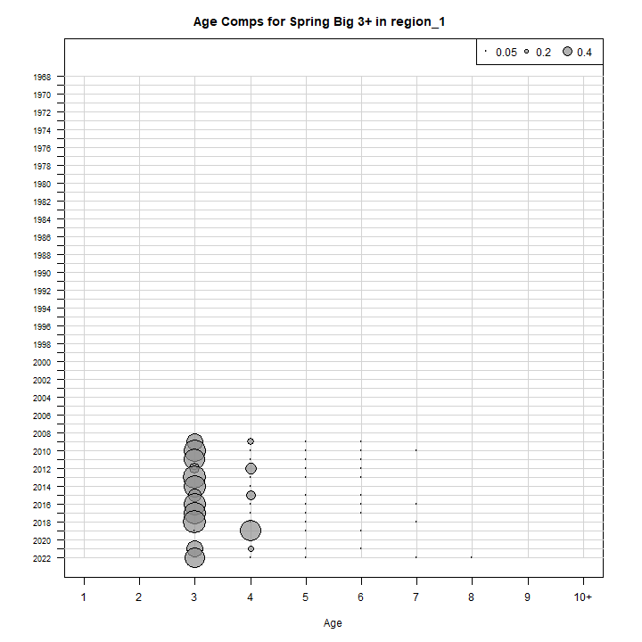
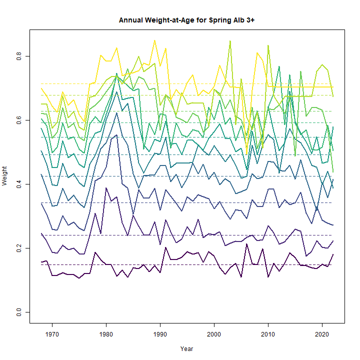
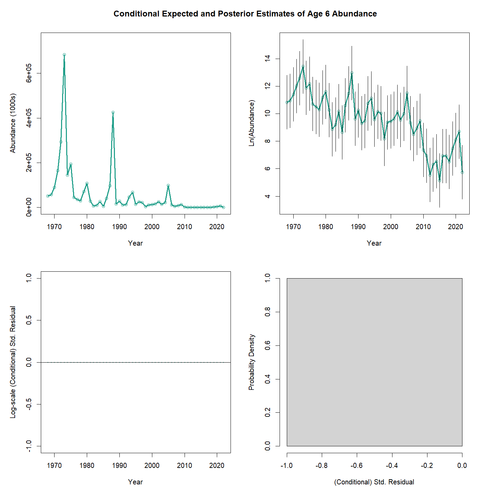
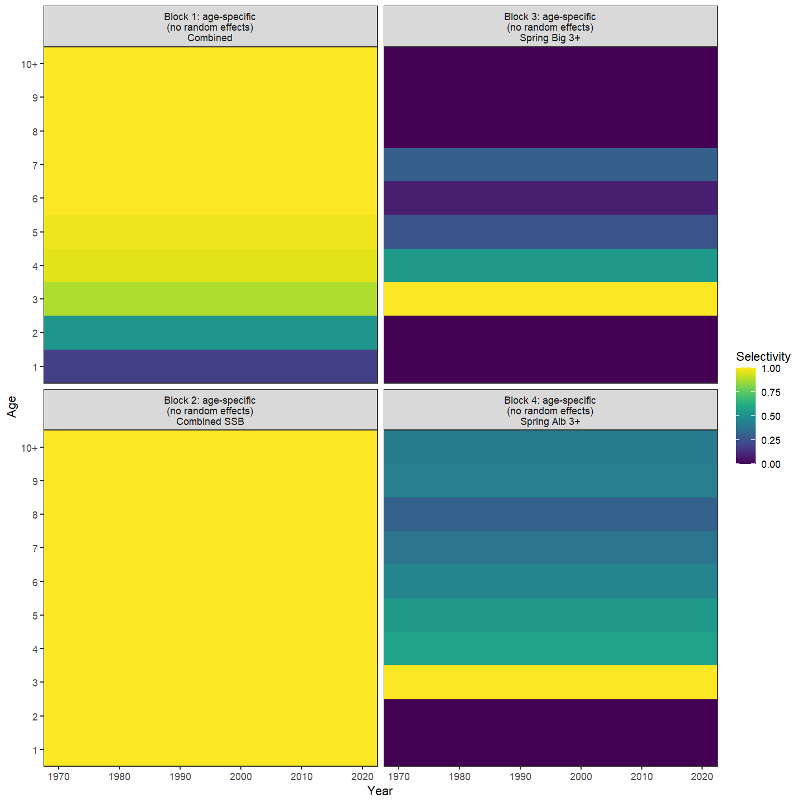
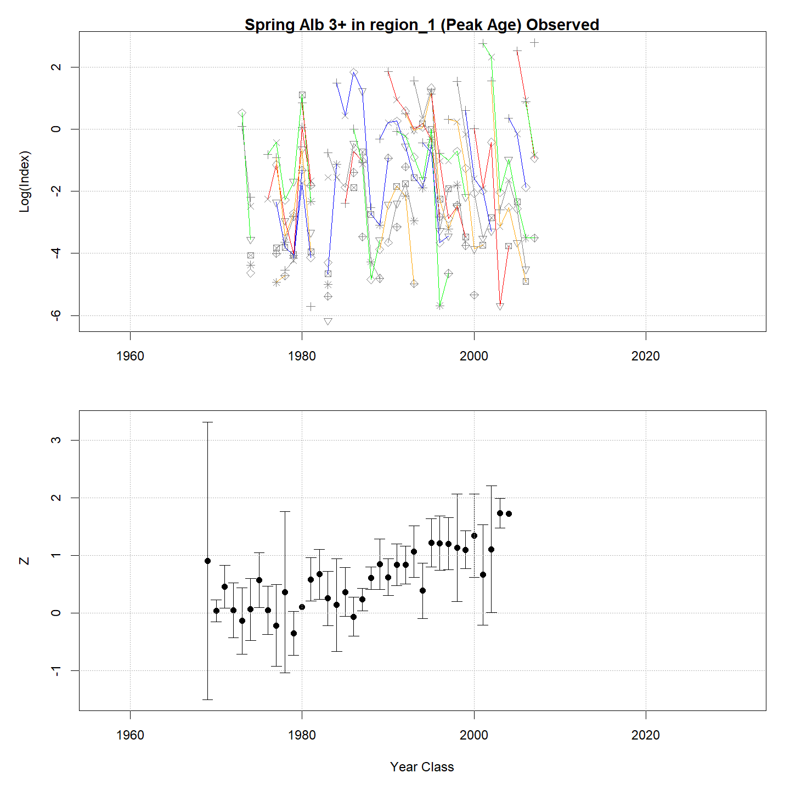

---
output:
  html_document:
    df_print: paged
    keep_md: yes
  word_document: default
  pdf_document:
    fig_caption: yes
    includes:
    keep_tex: yes
    number_sections: no
title: "WHAM figures and tables"
header-includes:
  - \usepackage{longtable}
  - \usepackage{booktabs}
  - \usepackage{caption,graphics}
  - \usepackage{makecell}
  - \usepackage{lscape}
  - \renewcommand\figurename{Fig.}
  - \captionsetup{labelsep=period, singlelinecheck=false}
  - \newcommand{\changesize}[1]{\fontsize{#1pt}{#1pt}\selectfont}
  - \renewcommand{\arraystretch}{1.5}
  - \renewcommand\theadfont{}
---

# {.tabset}

## Figures {.tabset}

### Input

### Diagnostics

### Results

### Retro

### Reference points

### Miscellaneous

## Tables {.tabset}

### Parameter estimates

<table class="table" style="margin-left: auto; margin-right: auto;">
<caption>Parameter estimates, standard errors, and confidence intervals. Rounded to 3 decimal places.</caption>
 <thead>
  <tr>
   <th style="text-align:left;">   </th>
   <th style="text-align:right;"> Estimate </th>
   <th style="text-align:right;"> Std. Error </th>
   <th style="text-align:right;"> 95\% CI lower </th>
   <th style="text-align:right;"> 95\% CI upper </th>
  </tr>
 </thead>
<tbody>
  <tr>
   <td style="text-align:left;"> Combined SSB fully selected q </td>
   <td style="text-align:right;"> $0.002$ </td>
   <td style="text-align:right;"> $3.055\times 10^{-4}$ </td>
   <td style="text-align:right;"> $0.002$ </td>
   <td style="text-align:right;"> $0.003$ </td>
  </tr>
  <tr>
   <td style="text-align:left;"> Spring Big 3+ fully selected q </td>
   <td style="text-align:right;"> $8.753\times 10^{-5}$ </td>
   <td style="text-align:right;"> $1.575\times 10^{-5}$ </td>
   <td style="text-align:right;"> $6.152\times 10^{-5}$ </td>
   <td style="text-align:right;"> $1.245\times 10^{-4}$ </td>
  </tr>
  <tr>
   <td style="text-align:left;"> Spring Alb 3+ fully selected q </td>
   <td style="text-align:right;"> $1.110\times 10^{-5}$ </td>
   <td style="text-align:right;"> $1.648\times 10^{-6}$ </td>
   <td style="text-align:right;"> $8.299\times 10^{-6}$ </td>
   <td style="text-align:right;"> $1.485\times 10^{-5}$ </td>
  </tr>
  <tr>
   <td style="text-align:left;"> Block 1: Combined Selectivity for age 1 </td>
   <td style="text-align:right;"> $0.188$ </td>
   <td style="text-align:right;"> -- </td>
   <td style="text-align:right;"> -- </td>
   <td style="text-align:right;"> -- </td>
  </tr>
  <tr>
   <td style="text-align:left;"> Block 1: Combined Selectivity for age 2 </td>
   <td style="text-align:right;"> $0.525$ </td>
   <td style="text-align:right;"> -- </td>
   <td style="text-align:right;"> -- </td>
   <td style="text-align:right;"> -- </td>
  </tr>
  <tr>
   <td style="text-align:left;"> Block 1: Combined Selectivity for age 3 </td>
   <td style="text-align:right;"> $0.881$ </td>
   <td style="text-align:right;"> -- </td>
   <td style="text-align:right;"> -- </td>
   <td style="text-align:right;"> -- </td>
  </tr>
  <tr>
   <td style="text-align:left;"> Block 1: Combined Selectivity for age 4 </td>
   <td style="text-align:right;"> $0.957$ </td>
   <td style="text-align:right;"> -- </td>
   <td style="text-align:right;"> -- </td>
   <td style="text-align:right;"> -- </td>
  </tr>
  <tr>
   <td style="text-align:left;"> Block 1: Combined Selectivity for age 5 </td>
   <td style="text-align:right;"> $0.977$ </td>
   <td style="text-align:right;"> -- </td>
   <td style="text-align:right;"> -- </td>
   <td style="text-align:right;"> -- </td>
  </tr>
  <tr>
   <td style="text-align:left;"> Block 1: Combined Selectivity for age 6 </td>
   <td style="text-align:right;"> $1.000$ </td>
   <td style="text-align:right;"> -- </td>
   <td style="text-align:right;"> -- </td>
   <td style="text-align:right;"> -- </td>
  </tr>
  <tr>
   <td style="text-align:left;"> Block 1: Combined Selectivity for age 7 </td>
   <td style="text-align:right;"> $1.000$ </td>
   <td style="text-align:right;"> -- </td>
   <td style="text-align:right;"> -- </td>
   <td style="text-align:right;"> -- </td>
  </tr>
  <tr>
   <td style="text-align:left;"> Block 1: Combined Selectivity for age 8 </td>
   <td style="text-align:right;"> $1.000$ </td>
   <td style="text-align:right;"> -- </td>
   <td style="text-align:right;"> -- </td>
   <td style="text-align:right;"> -- </td>
  </tr>
  <tr>
   <td style="text-align:left;"> Block 1: Combined Selectivity for age 9 </td>
   <td style="text-align:right;"> $1.000$ </td>
   <td style="text-align:right;"> -- </td>
   <td style="text-align:right;"> -- </td>
   <td style="text-align:right;"> -- </td>
  </tr>
  <tr>
   <td style="text-align:left;"> Block 1: Combined Selectivity for age 10+ </td>
   <td style="text-align:right;"> $1.000$ </td>
   <td style="text-align:right;"> -- </td>
   <td style="text-align:right;"> -- </td>
   <td style="text-align:right;"> -- </td>
  </tr>
  <tr>
   <td style="text-align:left;"> Block 2: Combined SSB Selectivity for age 1 </td>
   <td style="text-align:right;"> $1.000$ </td>
   <td style="text-align:right;"> -- </td>
   <td style="text-align:right;"> -- </td>
   <td style="text-align:right;"> -- </td>
  </tr>
  <tr>
   <td style="text-align:left;"> Block 2: Combined SSB Selectivity for age 2 </td>
   <td style="text-align:right;"> $1.000$ </td>
   <td style="text-align:right;"> -- </td>
   <td style="text-align:right;"> -- </td>
   <td style="text-align:right;"> -- </td>
  </tr>
  <tr>
   <td style="text-align:left;"> Block 2: Combined SSB Selectivity for age 3 </td>
   <td style="text-align:right;"> $1.000$ </td>
   <td style="text-align:right;"> -- </td>
   <td style="text-align:right;"> -- </td>
   <td style="text-align:right;"> -- </td>
  </tr>
  <tr>
   <td style="text-align:left;"> Block 2: Combined SSB Selectivity for age 4 </td>
   <td style="text-align:right;"> $1.000$ </td>
   <td style="text-align:right;"> -- </td>
   <td style="text-align:right;"> -- </td>
   <td style="text-align:right;"> -- </td>
  </tr>
  <tr>
   <td style="text-align:left;"> Block 2: Combined SSB Selectivity for age 5 </td>
   <td style="text-align:right;"> $1.000$ </td>
   <td style="text-align:right;"> -- </td>
   <td style="text-align:right;"> -- </td>
   <td style="text-align:right;"> -- </td>
  </tr>
  <tr>
   <td style="text-align:left;"> Block 2: Combined SSB Selectivity for age 6 </td>
   <td style="text-align:right;"> $1.000$ </td>
   <td style="text-align:right;"> -- </td>
   <td style="text-align:right;"> -- </td>
   <td style="text-align:right;"> -- </td>
  </tr>
  <tr>
   <td style="text-align:left;"> Block 2: Combined SSB Selectivity for age 7 </td>
   <td style="text-align:right;"> $1.000$ </td>
   <td style="text-align:right;"> -- </td>
   <td style="text-align:right;"> -- </td>
   <td style="text-align:right;"> -- </td>
  </tr>
  <tr>
   <td style="text-align:left;"> Block 2: Combined SSB Selectivity for age 8 </td>
   <td style="text-align:right;"> $1.000$ </td>
   <td style="text-align:right;"> -- </td>
   <td style="text-align:right;"> -- </td>
   <td style="text-align:right;"> -- </td>
  </tr>
  <tr>
   <td style="text-align:left;"> Block 2: Combined SSB Selectivity for age 9 </td>
   <td style="text-align:right;"> $1.000$ </td>
   <td style="text-align:right;"> -- </td>
   <td style="text-align:right;"> -- </td>
   <td style="text-align:right;"> -- </td>
  </tr>
  <tr>
   <td style="text-align:left;"> Block 2: Combined SSB Selectivity for age 10+ </td>
   <td style="text-align:right;"> $1.000$ </td>
   <td style="text-align:right;"> -- </td>
   <td style="text-align:right;"> -- </td>
   <td style="text-align:right;"> -- </td>
  </tr>
  <tr>
   <td style="text-align:left;"> Block 3: Spring Big 3+ Selectivity for age 1 </td>
   <td style="text-align:right;"> $0.000$ </td>
   <td style="text-align:right;"> -- </td>
   <td style="text-align:right;"> -- </td>
   <td style="text-align:right;"> -- </td>
  </tr>
  <tr>
   <td style="text-align:left;"> Block 3: Spring Big 3+ Selectivity for age 2 </td>
   <td style="text-align:right;"> $0.000$ </td>
   <td style="text-align:right;"> -- </td>
   <td style="text-align:right;"> -- </td>
   <td style="text-align:right;"> -- </td>
  </tr>
  <tr>
   <td style="text-align:left;"> Block 3: Spring Big 3+ Selectivity for age 3 </td>
   <td style="text-align:right;"> $1.000$ </td>
   <td style="text-align:right;"> -- </td>
   <td style="text-align:right;"> -- </td>
   <td style="text-align:right;"> -- </td>
  </tr>
  <tr>
   <td style="text-align:left;"> Block 3: Spring Big 3+ Selectivity for age 4 </td>
   <td style="text-align:right;"> $0.536$ </td>
   <td style="text-align:right;"> -- </td>
   <td style="text-align:right;"> -- </td>
   <td style="text-align:right;"> -- </td>
  </tr>
  <tr>
   <td style="text-align:left;"> Block 3: Spring Big 3+ Selectivity for age 5 </td>
   <td style="text-align:right;"> $0.254$ </td>
   <td style="text-align:right;"> -- </td>
   <td style="text-align:right;"> -- </td>
   <td style="text-align:right;"> -- </td>
  </tr>
  <tr>
   <td style="text-align:left;"> Block 3: Spring Big 3+ Selectivity for age 6 </td>
   <td style="text-align:right;"> $0.081$ </td>
   <td style="text-align:right;"> -- </td>
   <td style="text-align:right;"> -- </td>
   <td style="text-align:right;"> -- </td>
  </tr>
  <tr>
   <td style="text-align:left;"> Block 3: Spring Big 3+ Selectivity for age 7 </td>
   <td style="text-align:right;"> $0.300$ </td>
   <td style="text-align:right;"> -- </td>
   <td style="text-align:right;"> -- </td>
   <td style="text-align:right;"> -- </td>
  </tr>
  <tr>
   <td style="text-align:left;"> Block 3: Spring Big 3+ Selectivity for age 8 </td>
   <td style="text-align:right;"> $0.000$ </td>
   <td style="text-align:right;"> -- </td>
   <td style="text-align:right;"> -- </td>
   <td style="text-align:right;"> -- </td>
  </tr>
  <tr>
   <td style="text-align:left;"> Block 3: Spring Big 3+ Selectivity for age 9 </td>
   <td style="text-align:right;"> $0.000$ </td>
   <td style="text-align:right;"> -- </td>
   <td style="text-align:right;"> -- </td>
   <td style="text-align:right;"> -- </td>
  </tr>
  <tr>
   <td style="text-align:left;"> Block 3: Spring Big 3+ Selectivity for age 10+ </td>
   <td style="text-align:right;"> $0.000$ </td>
   <td style="text-align:right;"> -- </td>
   <td style="text-align:right;"> -- </td>
   <td style="text-align:right;"> -- </td>
  </tr>
  <tr>
   <td style="text-align:left;"> Block 4: Spring Alb 3+ Selectivity for age 1 </td>
   <td style="text-align:right;"> $0.000$ </td>
   <td style="text-align:right;"> -- </td>
   <td style="text-align:right;"> -- </td>
   <td style="text-align:right;"> -- </td>
  </tr>
  <tr>
   <td style="text-align:left;"> Block 4: Spring Alb 3+ Selectivity for age 2 </td>
   <td style="text-align:right;"> $0.000$ </td>
   <td style="text-align:right;"> -- </td>
   <td style="text-align:right;"> -- </td>
   <td style="text-align:right;"> -- </td>
  </tr>
  <tr>
   <td style="text-align:left;"> Block 4: Spring Alb 3+ Selectivity for age 3 </td>
   <td style="text-align:right;"> $1.000$ </td>
   <td style="text-align:right;"> -- </td>
   <td style="text-align:right;"> -- </td>
   <td style="text-align:right;"> -- </td>
  </tr>
  <tr>
   <td style="text-align:left;"> Block 4: Spring Alb 3+ Selectivity for age 4 </td>
   <td style="text-align:right;"> $0.580$ </td>
   <td style="text-align:right;"> -- </td>
   <td style="text-align:right;"> -- </td>
   <td style="text-align:right;"> -- </td>
  </tr>
  <tr>
   <td style="text-align:left;"> Block 4: Spring Alb 3+ Selectivity for age 5 </td>
   <td style="text-align:right;"> $0.543$ </td>
   <td style="text-align:right;"> -- </td>
   <td style="text-align:right;"> -- </td>
   <td style="text-align:right;"> -- </td>
  </tr>
  <tr>
   <td style="text-align:left;"> Block 4: Spring Alb 3+ Selectivity for age 6 </td>
   <td style="text-align:right;"> $0.455$ </td>
   <td style="text-align:right;"> -- </td>
   <td style="text-align:right;"> -- </td>
   <td style="text-align:right;"> -- </td>
  </tr>
  <tr>
   <td style="text-align:left;"> Block 4: Spring Alb 3+ Selectivity for age 7 </td>
   <td style="text-align:right;"> $0.386$ </td>
   <td style="text-align:right;"> -- </td>
   <td style="text-align:right;"> -- </td>
   <td style="text-align:right;"> -- </td>
  </tr>
  <tr>
   <td style="text-align:left;"> Block 4: Spring Alb 3+ Selectivity for age 8 </td>
   <td style="text-align:right;"> $0.307$ </td>
   <td style="text-align:right;"> -- </td>
   <td style="text-align:right;"> -- </td>
   <td style="text-align:right;"> -- </td>
  </tr>
  <tr>
   <td style="text-align:left;"> Block 4: Spring Alb 3+ Selectivity for age 9 </td>
   <td style="text-align:right;"> $0.431$ </td>
   <td style="text-align:right;"> -- </td>
   <td style="text-align:right;"> -- </td>
   <td style="text-align:right;"> -- </td>
  </tr>
  <tr>
   <td style="text-align:left;"> Block 4: Spring Alb 3+ Selectivity for age 10+ </td>
   <td style="text-align:right;"> $0.410$ </td>
   <td style="text-align:right;"> -- </td>
   <td style="text-align:right;"> -- </td>
   <td style="text-align:right;"> -- </td>
  </tr>
</tbody>
</table>

### Abundance at age

<table class="table" style="margin-left: auto; margin-right: auto;">
<caption>Abundance at age (1000s) for stock 1 in region 1.</caption>
 <thead>
  <tr>
   <th style="text-align:left;">   </th>
   <th style="text-align:right;"> 1 </th>
   <th style="text-align:right;"> 2 </th>
   <th style="text-align:right;"> 3 </th>
   <th style="text-align:right;"> 4 </th>
   <th style="text-align:right;"> 5 </th>
   <th style="text-align:right;"> 6 </th>
   <th style="text-align:right;"> 7 </th>
   <th style="text-align:right;"> 8 </th>
   <th style="text-align:right;"> 9 </th>
   <th style="text-align:right;"> 10+ </th>
  </tr>
 </thead>
<tbody>
  <tr>
   <td style="text-align:left;"> 1968 </td>
   <td style="text-align:right;"> 4960454 </td>
   <td style="text-align:right;"> 1390610 </td>
   <td style="text-align:right;"> 492186 </td>
   <td style="text-align:right;"> 179573 </td>
   <td style="text-align:right;"> 80636 </td>
   <td style="text-align:right;"> 50342 </td>
   <td style="text-align:right;"> 29166 </td>
   <td style="text-align:right;"> 15778 </td>
   <td style="text-align:right;"> 86375 </td>
   <td style="text-align:right;"> 1143 </td>
  </tr>
  <tr>
   <td style="text-align:left;"> 1969 </td>
   <td style="text-align:right;"> 1451369 </td>
   <td style="text-align:right;"> 3941832 </td>
   <td style="text-align:right;"> 1047320 </td>
   <td style="text-align:right;"> 350306 </td>
   <td style="text-align:right;"> 126279 </td>
   <td style="text-align:right;"> 56524 </td>
   <td style="text-align:right;"> 35158 </td>
   <td style="text-align:right;"> 20369 </td>
   <td style="text-align:right;"> 11019 </td>
   <td style="text-align:right;"> 61121 </td>
  </tr>
  <tr>
   <td style="text-align:left;"> 1970 </td>
   <td style="text-align:right;"> 2722631 </td>
   <td style="text-align:right;"> 1155212 </td>
   <td style="text-align:right;"> 2982288 </td>
   <td style="text-align:right;"> 751128 </td>
   <td style="text-align:right;"> 248392 </td>
   <td style="text-align:right;"> 89272 </td>
   <td style="text-align:right;"> 39819 </td>
   <td style="text-align:right;"> 24767 </td>
   <td style="text-align:right;"> 14349 </td>
   <td style="text-align:right;"> 50820 </td>
  </tr>
  <tr>
   <td style="text-align:left;"> 1971 </td>
   <td style="text-align:right;"> 907957 </td>
   <td style="text-align:right;"> 2140185 </td>
   <td style="text-align:right;"> 844012 </td>
   <td style="text-align:right;"> 2017214 </td>
   <td style="text-align:right;"> 499788 </td>
   <td style="text-align:right;"> 164560 </td>
   <td style="text-align:right;"> 58844 </td>
   <td style="text-align:right;"> 26247 </td>
   <td style="text-align:right;"> 16326 </td>
   <td style="text-align:right;"> 42956 </td>
  </tr>
  <tr>
   <td style="text-align:left;"> 1972 </td>
   <td style="text-align:right;"> 1187449 </td>
   <td style="text-align:right;"> 697308 </td>
   <td style="text-align:right;"> 1465122 </td>
   <td style="text-align:right;"> 511858 </td>
   <td style="text-align:right;"> 1192194 </td>
   <td style="text-align:right;"> 293372 </td>
   <td style="text-align:right;"> 95829 </td>
   <td style="text-align:right;"> 34267 </td>
   <td style="text-align:right;"> 15284 </td>
   <td style="text-align:right;"> 34522 </td>
  </tr>
  <tr>
   <td style="text-align:left;"> 1973 </td>
   <td style="text-align:right;"> 815833 </td>
   <td style="text-align:right;"> 907714 </td>
   <td style="text-align:right;"> 471174 </td>
   <td style="text-align:right;"> 869307 </td>
   <td style="text-align:right;"> 295410 </td>
   <td style="text-align:right;"> 683038 </td>
   <td style="text-align:right;"> 166650 </td>
   <td style="text-align:right;"> 54436 </td>
   <td style="text-align:right;"> 19465 </td>
   <td style="text-align:right;"> 28292 </td>
  </tr>
  <tr>
   <td style="text-align:left;"> 1974 </td>
   <td style="text-align:right;"> 1194235 </td>
   <td style="text-align:right;"> 604607 </td>
   <td style="text-align:right;"> 562404 </td>
   <td style="text-align:right;"> 241727 </td>
   <td style="text-align:right;"> 428416 </td>
   <td style="text-align:right;"> 144047 </td>
   <td style="text-align:right;"> 328954 </td>
   <td style="text-align:right;"> 80259 </td>
   <td style="text-align:right;"> 26217 </td>
   <td style="text-align:right;"> 23000 </td>
  </tr>
  <tr>
   <td style="text-align:left;"> 1975 </td>
   <td style="text-align:right;"> 1046748 </td>
   <td style="text-align:right;"> 872024 </td>
   <td style="text-align:right;"> 359397 </td>
   <td style="text-align:right;"> 269159 </td>
   <td style="text-align:right;"> 110469 </td>
   <td style="text-align:right;"> 193410 </td>
   <td style="text-align:right;"> 64110 </td>
   <td style="text-align:right;"> 146406 </td>
   <td style="text-align:right;"> 35721 </td>
   <td style="text-align:right;"> 21905 </td>
  </tr>
  <tr>
   <td style="text-align:left;"> 1976 </td>
   <td style="text-align:right;"> 175977 </td>
   <td style="text-align:right;"> 748672 </td>
   <td style="text-align:right;"> 489196 </td>
   <td style="text-align:right;"> 156085 </td>
   <td style="text-align:right;"> 110694 </td>
   <td style="text-align:right;"> 44781 </td>
   <td style="text-align:right;"> 77095 </td>
   <td style="text-align:right;"> 25555 </td>
   <td style="text-align:right;"> 58359 </td>
   <td style="text-align:right;"> 22970 </td>
  </tr>
  <tr>
   <td style="text-align:left;"> 1977 </td>
   <td style="text-align:right;"> 36501 </td>
   <td style="text-align:right;"> 120748 </td>
   <td style="text-align:right;"> 373960 </td>
   <td style="text-align:right;"> 174868 </td>
   <td style="text-align:right;"> 51957 </td>
   <td style="text-align:right;"> 36160 </td>
   <td style="text-align:right;"> 14310 </td>
   <td style="text-align:right;"> 24636 </td>
   <td style="text-align:right;"> 8166 </td>
   <td style="text-align:right;"> 25989 </td>
  </tr>
  <tr>
   <td style="text-align:left;"> 1978 </td>
   <td style="text-align:right;"> 50273 </td>
   <td style="text-align:right;"> 27853 </td>
   <td style="text-align:right;"> 81188 </td>
   <td style="text-align:right;"> 220052 </td>
   <td style="text-align:right;"> 100018 </td>
   <td style="text-align:right;"> 29495 </td>
   <td style="text-align:right;"> 20348 </td>
   <td style="text-align:right;"> 8053 </td>
   <td style="text-align:right;"> 13864 </td>
   <td style="text-align:right;"> 19220 </td>
  </tr>
  <tr>
   <td style="text-align:left;"> 1979 </td>
   <td style="text-align:right;"> 131722 </td>
   <td style="text-align:right;"> 40109 </td>
   <td style="text-align:right;"> 21212 </td>
   <td style="text-align:right;"> 58871 </td>
   <td style="text-align:right;"> 157908 </td>
   <td style="text-align:right;"> 71574 </td>
   <td style="text-align:right;"> 21039 </td>
   <td style="text-align:right;"> 14515 </td>
   <td style="text-align:right;"> 5744 </td>
   <td style="text-align:right;"> 23599 </td>
  </tr>
  <tr>
   <td style="text-align:left;"> 1980 </td>
   <td style="text-align:right;"> 26885 </td>
   <td style="text-align:right;"> 104233 </td>
   <td style="text-align:right;"> 29854 </td>
   <td style="text-align:right;"> 14802 </td>
   <td style="text-align:right;"> 40521 </td>
   <td style="text-align:right;"> 108294 </td>
   <td style="text-align:right;"> 48878 </td>
   <td style="text-align:right;"> 14368 </td>
   <td style="text-align:right;"> 9912 </td>
   <td style="text-align:right;"> 20039 </td>
  </tr>
  <tr>
   <td style="text-align:left;"> 1981 </td>
   <td style="text-align:right;"> 186949 </td>
   <td style="text-align:right;"> 21397 </td>
   <td style="text-align:right;"> 78835 </td>
   <td style="text-align:right;"> 21399 </td>
   <td style="text-align:right;"> 10489 </td>
   <td style="text-align:right;"> 28629 </td>
   <td style="text-align:right;"> 76242 </td>
   <td style="text-align:right;"> 34412 </td>
   <td style="text-align:right;"> 10115 </td>
   <td style="text-align:right;"> 21086 </td>
  </tr>
  <tr>
   <td style="text-align:left;"> 1982 </td>
   <td style="text-align:right;"> 445895 </td>
   <td style="text-align:right;"> 147587 </td>
   <td style="text-align:right;"> 15821 </td>
   <td style="text-align:right;"> 54407 </td>
   <td style="text-align:right;"> 14553 </td>
   <td style="text-align:right;"> 7106 </td>
   <td style="text-align:right;"> 19306 </td>
   <td style="text-align:right;"> 51415 </td>
   <td style="text-align:right;"> 23206 </td>
   <td style="text-align:right;"> 21041 </td>
  </tr>
  <tr>
   <td style="text-align:left;"> 1983 </td>
   <td style="text-align:right;"> 2146071 </td>
   <td style="text-align:right;"> 352610 </td>
   <td style="text-align:right;"> 109649 </td>
   <td style="text-align:right;"> 11006 </td>
   <td style="text-align:right;"> 37322 </td>
   <td style="text-align:right;"> 9946 </td>
   <td style="text-align:right;"> 4836 </td>
   <td style="text-align:right;"> 13138 </td>
   <td style="text-align:right;"> 34988 </td>
   <td style="text-align:right;"> 30111 </td>
  </tr>
  <tr>
   <td style="text-align:left;"> 1984 </td>
   <td style="text-align:right;"> 89600 </td>
   <td style="text-align:right;"> 1706329 </td>
   <td style="text-align:right;"> 265978 </td>
   <td style="text-align:right;"> 78245 </td>
   <td style="text-align:right;"> 7762 </td>
   <td style="text-align:right;"> 26238 </td>
   <td style="text-align:right;"> 6967 </td>
   <td style="text-align:right;"> 3387 </td>
   <td style="text-align:right;"> 9203 </td>
   <td style="text-align:right;"> 45599 </td>
  </tr>
  <tr>
   <td style="text-align:left;"> 1985 </td>
   <td style="text-align:right;"> 189065 </td>
   <td style="text-align:right;"> 71820 </td>
   <td style="text-align:right;"> 1316617 </td>
   <td style="text-align:right;"> 197157 </td>
   <td style="text-align:right;"> 57506 </td>
   <td style="text-align:right;"> 5692 </td>
   <td style="text-align:right;"> 19189 </td>
   <td style="text-align:right;"> 5095 </td>
   <td style="text-align:right;"> 2477 </td>
   <td style="text-align:right;"> 40079 </td>
  </tr>
  <tr>
   <td style="text-align:left;"> 1986 </td>
   <td style="text-align:right;"> 92134 </td>
   <td style="text-align:right;"> 150240 </td>
   <td style="text-align:right;"> 54090 </td>
   <td style="text-align:right;"> 937070 </td>
   <td style="text-align:right;"> 138642 </td>
   <td style="text-align:right;"> 40310 </td>
   <td style="text-align:right;"> 3975 </td>
   <td style="text-align:right;"> 13401 </td>
   <td style="text-align:right;"> 3558 </td>
   <td style="text-align:right;"> 29720 </td>
  </tr>
  <tr>
   <td style="text-align:left;"> 1987 </td>
   <td style="text-align:right;"> 117346 </td>
   <td style="text-align:right;"> 73136 </td>
   <td style="text-align:right;"> 112813 </td>
   <td style="text-align:right;"> 38305 </td>
   <td style="text-align:right;"> 655378 </td>
   <td style="text-align:right;"> 96646 </td>
   <td style="text-align:right;"> 27992 </td>
   <td style="text-align:right;"> 2760 </td>
   <td style="text-align:right;"> 9306 </td>
   <td style="text-align:right;"> 23109 </td>
  </tr>
  <tr>
   <td style="text-align:left;"> 1988 </td>
   <td style="text-align:right;"> 404382 </td>
   <td style="text-align:right;"> 91882 </td>
   <td style="text-align:right;"> 52852 </td>
   <td style="text-align:right;"> 74918 </td>
   <td style="text-align:right;"> 24984 </td>
   <td style="text-align:right;"> 425437 </td>
   <td style="text-align:right;"> 62390 </td>
   <td style="text-align:right;"> 18070 </td>
   <td style="text-align:right;"> 1782 </td>
   <td style="text-align:right;"> 20925 </td>
  </tr>
  <tr>
   <td style="text-align:left;"> 1989 </td>
   <td style="text-align:right;"> 537460 </td>
   <td style="text-align:right;"> 313030 </td>
   <td style="text-align:right;"> 64308 </td>
   <td style="text-align:right;"> 33264 </td>
   <td style="text-align:right;"> 46098 </td>
   <td style="text-align:right;"> 15281 </td>
   <td style="text-align:right;"> 258407 </td>
   <td style="text-align:right;"> 37895 </td>
   <td style="text-align:right;"> 10976 </td>
   <td style="text-align:right;"> 13792 </td>
  </tr>
  <tr>
   <td style="text-align:left;"> 1990 </td>
   <td style="text-align:right;"> 110269 </td>
   <td style="text-align:right;"> 415987 </td>
   <td style="text-align:right;"> 219003 </td>
   <td style="text-align:right;"> 40448 </td>
   <td style="text-align:right;"> 20454 </td>
   <td style="text-align:right;"> 28175 </td>
   <td style="text-align:right;"> 9275 </td>
   <td style="text-align:right;"> 156838 </td>
   <td style="text-align:right;"> 23000 </td>
   <td style="text-align:right;"> 15033 </td>
  </tr>
  <tr>
   <td style="text-align:left;"> 1991 </td>
   <td style="text-align:right;"> 185846 </td>
   <td style="text-align:right;"> 83391 </td>
   <td style="text-align:right;"> 272758 </td>
   <td style="text-align:right;"> 123551 </td>
   <td style="text-align:right;"> 22100 </td>
   <td style="text-align:right;"> 11081 </td>
   <td style="text-align:right;"> 15114 </td>
   <td style="text-align:right;"> 4975 </td>
   <td style="text-align:right;"> 84135 </td>
   <td style="text-align:right;"> 20402 </td>
  </tr>
  <tr>
   <td style="text-align:left;"> 1992 </td>
   <td style="text-align:right;"> 196726 </td>
   <td style="text-align:right;"> 142734 </td>
   <td style="text-align:right;"> 57093 </td>
   <td style="text-align:right;"> 165443 </td>
   <td style="text-align:right;"> 73033 </td>
   <td style="text-align:right;"> 12975 </td>
   <td style="text-align:right;"> 6454 </td>
   <td style="text-align:right;"> 8803 </td>
   <td style="text-align:right;"> 2898 </td>
   <td style="text-align:right;"> 60887 </td>
  </tr>
  <tr>
   <td style="text-align:left;"> 1993 </td>
   <td style="text-align:right;"> 37392 </td>
   <td style="text-align:right;"> 153475 </td>
   <td style="text-align:right;"> 102098 </td>
   <td style="text-align:right;"> 37270 </td>
   <td style="text-align:right;"> 105918 </td>
   <td style="text-align:right;"> 46516 </td>
   <td style="text-align:right;"> 8214 </td>
   <td style="text-align:right;"> 4086 </td>
   <td style="text-align:right;"> 5573 </td>
   <td style="text-align:right;"> 40382 </td>
  </tr>
  <tr>
   <td style="text-align:left;"> 1994 </td>
   <td style="text-align:right;"> 145316 </td>
   <td style="text-align:right;"> 29164 </td>
   <td style="text-align:right;"> 109710 </td>
   <td style="text-align:right;"> 66578 </td>
   <td style="text-align:right;"> 23833 </td>
   <td style="text-align:right;"> 67381 </td>
   <td style="text-align:right;"> 29414 </td>
   <td style="text-align:right;"> 5194 </td>
   <td style="text-align:right;"> 2584 </td>
   <td style="text-align:right;"> 29059 </td>
  </tr>
  <tr>
   <td style="text-align:left;"> 1995 </td>
   <td style="text-align:right;"> 170481 </td>
   <td style="text-align:right;"> 112033 </td>
   <td style="text-align:right;"> 20182 </td>
   <td style="text-align:right;"> 67751 </td>
   <td style="text-align:right;"> 40129 </td>
   <td style="text-align:right;"> 14273 </td>
   <td style="text-align:right;"> 40053 </td>
   <td style="text-align:right;"> 17484 </td>
   <td style="text-align:right;"> 3088 </td>
   <td style="text-align:right;"> 18810 </td>
  </tr>
  <tr>
   <td style="text-align:left;"> 1996 </td>
   <td style="text-align:right;"> 172688 </td>
   <td style="text-align:right;"> 132728 </td>
   <td style="text-align:right;"> 79680 </td>
   <td style="text-align:right;"> 13049 </td>
   <td style="text-align:right;"> 42925 </td>
   <td style="text-align:right;"> 25289 </td>
   <td style="text-align:right;"> 8939 </td>
   <td style="text-align:right;"> 25083 </td>
   <td style="text-align:right;"> 10949 </td>
   <td style="text-align:right;"> 13713 </td>
  </tr>
  <tr>
   <td style="text-align:left;"> 1997 </td>
   <td style="text-align:right;"> 225560 </td>
   <td style="text-align:right;"> 129872 </td>
   <td style="text-align:right;"> 85687 </td>
   <td style="text-align:right;"> 43796 </td>
   <td style="text-align:right;"> 6931 </td>
   <td style="text-align:right;"> 22593 </td>
   <td style="text-align:right;"> 13171 </td>
   <td style="text-align:right;"> 4655 </td>
   <td style="text-align:right;"> 13064 </td>
   <td style="text-align:right;"> 12844 </td>
  </tr>
  <tr>
   <td style="text-align:left;"> 1998 </td>
   <td style="text-align:right;"> 108976 </td>
   <td style="text-align:right;"> 168765 </td>
   <td style="text-align:right;"> 82646 </td>
   <td style="text-align:right;"> 45975 </td>
   <td style="text-align:right;"> 22660 </td>
   <td style="text-align:right;"> 3552 </td>
   <td style="text-align:right;"> 11449 </td>
   <td style="text-align:right;"> 6674 </td>
   <td style="text-align:right;"> 2359 </td>
   <td style="text-align:right;"> 13129 </td>
  </tr>
  <tr>
   <td style="text-align:left;"> 1999 </td>
   <td style="text-align:right;"> 177587 </td>
   <td style="text-align:right;"> 81709 </td>
   <td style="text-align:right;"> 108035 </td>
   <td style="text-align:right;"> 44787 </td>
   <td style="text-align:right;"> 24046 </td>
   <td style="text-align:right;"> 11741 </td>
   <td style="text-align:right;"> 1820 </td>
   <td style="text-align:right;"> 5868 </td>
   <td style="text-align:right;"> 3420 </td>
   <td style="text-align:right;"> 7937 </td>
  </tr>
  <tr>
   <td style="text-align:left;"> 2000 </td>
   <td style="text-align:right;"> 1175635 </td>
   <td style="text-align:right;"> 133487 </td>
   <td style="text-align:right;"> 52673 </td>
   <td style="text-align:right;"> 59236 </td>
   <td style="text-align:right;"> 23725 </td>
   <td style="text-align:right;"> 12622 </td>
   <td style="text-align:right;"> 6098 </td>
   <td style="text-align:right;"> 945 </td>
   <td style="text-align:right;"> 3047 </td>
   <td style="text-align:right;"> 5899 </td>
  </tr>
  <tr>
   <td style="text-align:left;"> 2001 </td>
   <td style="text-align:right;"> 198426 </td>
   <td style="text-align:right;"> 919575 </td>
   <td style="text-align:right;"> 96187 </td>
   <td style="text-align:right;"> 34811 </td>
   <td style="text-align:right;"> 38433 </td>
   <td style="text-align:right;"> 15318 </td>
   <td style="text-align:right;"> 8104 </td>
   <td style="text-align:right;"> 3915 </td>
   <td style="text-align:right;"> 607 </td>
   <td style="text-align:right;"> 5744 </td>
  </tr>
  <tr>
   <td style="text-align:left;"> 2002 </td>
   <td style="text-align:right;"> 157793 </td>
   <td style="text-align:right;"> 155488 </td>
   <td style="text-align:right;"> 665980 </td>
   <td style="text-align:right;"> 64110 </td>
   <td style="text-align:right;"> 22795 </td>
   <td style="text-align:right;"> 25050 </td>
   <td style="text-align:right;"> 9930 </td>
   <td style="text-align:right;"> 5253 </td>
   <td style="text-align:right;"> 2538 </td>
   <td style="text-align:right;"> 4117 </td>
  </tr>
  <tr>
   <td style="text-align:left;"> 2003 </td>
   <td style="text-align:right;"> 369615 </td>
   <td style="text-align:right;"> 122302 </td>
   <td style="text-align:right;"> 109213 </td>
   <td style="text-align:right;"> 421668 </td>
   <td style="text-align:right;"> 39704 </td>
   <td style="text-align:right;"> 14035 </td>
   <td style="text-align:right;"> 15319 </td>
   <td style="text-align:right;"> 6072 </td>
   <td style="text-align:right;"> 3212 </td>
   <td style="text-align:right;"> 4069 </td>
  </tr>
  <tr>
   <td style="text-align:left;"> 2004 </td>
   <td style="text-align:right;"> 794891 </td>
   <td style="text-align:right;"> 280481 </td>
   <td style="text-align:right;"> 80964 </td>
   <td style="text-align:right;"> 62612 </td>
   <td style="text-align:right;"> 234447 </td>
   <td style="text-align:right;"> 21897 </td>
   <td style="text-align:right;"> 7668 </td>
   <td style="text-align:right;"> 8369 </td>
   <td style="text-align:right;"> 3317 </td>
   <td style="text-align:right;"> 3978 </td>
  </tr>
  <tr>
   <td style="text-align:left;"> 2005 </td>
   <td style="text-align:right;"> 198183 </td>
   <td style="text-align:right;"> 572127 </td>
   <td style="text-align:right;"> 160143 </td>
   <td style="text-align:right;"> 36217 </td>
   <td style="text-align:right;"> 26589 </td>
   <td style="text-align:right;"> 98204 </td>
   <td style="text-align:right;"> 9026 </td>
   <td style="text-align:right;"> 3161 </td>
   <td style="text-align:right;"> 3450 </td>
   <td style="text-align:right;"> 3007 </td>
  </tr>
  <tr>
   <td style="text-align:left;"> 2006 </td>
   <td style="text-align:right;"> 399206 </td>
   <td style="text-align:right;"> 142544 </td>
   <td style="text-align:right;"> 326022 </td>
   <td style="text-align:right;"> 71400 </td>
   <td style="text-align:right;"> 15325 </td>
   <td style="text-align:right;"> 11097 </td>
   <td style="text-align:right;"> 40329 </td>
   <td style="text-align:right;"> 3707 </td>
   <td style="text-align:right;"> 1298 </td>
   <td style="text-align:right;"> 2652 </td>
  </tr>
  <tr>
   <td style="text-align:left;"> 2007 </td>
   <td style="text-align:right;"> 111796 </td>
   <td style="text-align:right;"> 273283 </td>
   <td style="text-align:right;"> 70739 </td>
   <td style="text-align:right;"> 115277 </td>
   <td style="text-align:right;"> 23488 </td>
   <td style="text-align:right;"> 4946 </td>
   <td style="text-align:right;"> 3503 </td>
   <td style="text-align:right;"> 12729 </td>
   <td style="text-align:right;"> 1170 </td>
   <td style="text-align:right;"> 1247 </td>
  </tr>
  <tr>
   <td style="text-align:left;"> 2008 </td>
   <td style="text-align:right;"> 238194 </td>
   <td style="text-align:right;"> 76982 </td>
   <td style="text-align:right;"> 137865 </td>
   <td style="text-align:right;"> 25710 </td>
   <td style="text-align:right;"> 39072 </td>
   <td style="text-align:right;"> 7816 </td>
   <td style="text-align:right;"> 1611 </td>
   <td style="text-align:right;"> 1141 </td>
   <td style="text-align:right;"> 4145 </td>
   <td style="text-align:right;"> 787 </td>
  </tr>
  <tr>
   <td style="text-align:left;"> 2009 </td>
   <td style="text-align:right;"> 199838 </td>
   <td style="text-align:right;"> 164199 </td>
   <td style="text-align:right;"> 38955 </td>
   <td style="text-align:right;"> 50365 </td>
   <td style="text-align:right;"> 8763 </td>
   <td style="text-align:right;"> 13075 </td>
   <td style="text-align:right;"> 2560 </td>
   <td style="text-align:right;"> 528 </td>
   <td style="text-align:right;"> 374 </td>
   <td style="text-align:right;"> 1616 </td>
  </tr>
  <tr>
   <td style="text-align:left;"> 2010 </td>
   <td style="text-align:right;"> 31234 </td>
   <td style="text-align:right;"> 122228 </td>
   <td style="text-align:right;"> 59459 </td>
   <td style="text-align:right;"> 8119 </td>
   <td style="text-align:right;"> 9333 </td>
   <td style="text-align:right;"> 1574 </td>
   <td style="text-align:right;"> 2265 </td>
   <td style="text-align:right;"> 443 </td>
   <td style="text-align:right;"> 91 </td>
   <td style="text-align:right;"> 345 </td>
  </tr>
  <tr>
   <td style="text-align:left;"> 2011 </td>
   <td style="text-align:right;"> 133417 </td>
   <td style="text-align:right;"> 17401 </td>
   <td style="text-align:right;"> 34088 </td>
   <td style="text-align:right;"> 7998 </td>
   <td style="text-align:right;"> 935 </td>
   <td style="text-align:right;"> 1032 </td>
   <td style="text-align:right;"> 166 </td>
   <td style="text-align:right;"> 239 </td>
   <td style="text-align:right;"> 47 </td>
   <td style="text-align:right;"> 46 </td>
  </tr>
  <tr>
   <td style="text-align:left;"> 2012 </td>
   <td style="text-align:right;"> 91498 </td>
   <td style="text-align:right;"> 88373 </td>
   <td style="text-align:right;"> 7875 </td>
   <td style="text-align:right;"> 10327 </td>
   <td style="text-align:right;"> 2224 </td>
   <td style="text-align:right;"> 254 </td>
   <td style="text-align:right;"> 273 </td>
   <td style="text-align:right;"> 44 </td>
   <td style="text-align:right;"> 63 </td>
   <td style="text-align:right;"> 25 </td>
  </tr>
  <tr>
   <td style="text-align:left;"> 2013 </td>
   <td style="text-align:right;"> 41495 </td>
   <td style="text-align:right;"> 59414 </td>
   <td style="text-align:right;"> 37831 </td>
   <td style="text-align:right;"> 2173 </td>
   <td style="text-align:right;"> 2595 </td>
   <td style="text-align:right;"> 545 </td>
   <td style="text-align:right;"> 61 </td>
   <td style="text-align:right;"> 65 </td>
   <td style="text-align:right;"> 10 </td>
   <td style="text-align:right;"> 21 </td>
  </tr>
  <tr>
   <td style="text-align:left;"> 2014 </td>
   <td style="text-align:right;"> 83482 </td>
   <td style="text-align:right;"> 27391 </td>
   <td style="text-align:right;"> 26631 </td>
   <td style="text-align:right;"> 11277 </td>
   <td style="text-align:right;"> 594 </td>
   <td style="text-align:right;"> 693 </td>
   <td style="text-align:right;"> 142 </td>
   <td style="text-align:right;"> 16 </td>
   <td style="text-align:right;"> 17 </td>
   <td style="text-align:right;"> 8 </td>
  </tr>
  <tr>
   <td style="text-align:left;"> 2015 </td>
   <td style="text-align:right;"> 130705 </td>
   <td style="text-align:right;"> 55935 </td>
   <td style="text-align:right;"> 12801 </td>
   <td style="text-align:right;"> 8514 </td>
   <td style="text-align:right;"> 3325 </td>
   <td style="text-align:right;"> 171 </td>
   <td style="text-align:right;"> 195 </td>
   <td style="text-align:right;"> 40 </td>
   <td style="text-align:right;"> 4 </td>
   <td style="text-align:right;"> 7 </td>
  </tr>
  <tr>
   <td style="text-align:left;"> 2016 </td>
   <td style="text-align:right;"> 315715 </td>
   <td style="text-align:right;"> 88561 </td>
   <td style="text-align:right;"> 26971 </td>
   <td style="text-align:right;"> 4313 </td>
   <td style="text-align:right;"> 2658 </td>
   <td style="text-align:right;"> 1017 </td>
   <td style="text-align:right;"> 51 </td>
   <td style="text-align:right;"> 58 </td>
   <td style="text-align:right;"> 12 </td>
   <td style="text-align:right;"> 3 </td>
  </tr>
  <tr>
   <td style="text-align:left;"> 2017 </td>
   <td style="text-align:right;"> 23337 </td>
   <td style="text-align:right;"> 223194 </td>
   <td style="text-align:right;"> 48088 </td>
   <td style="text-align:right;"> 11090 </td>
   <td style="text-align:right;"> 1671 </td>
   <td style="text-align:right;"> 1014 </td>
   <td style="text-align:right;"> 381 </td>
   <td style="text-align:right;"> 19 </td>
   <td style="text-align:right;"> 22 </td>
   <td style="text-align:right;"> 6 </td>
  </tr>
  <tr>
   <td style="text-align:left;"> 2018 </td>
   <td style="text-align:right;"> 105374 </td>
   <td style="text-align:right;"> 16625 </td>
   <td style="text-align:right;"> 123818 </td>
   <td style="text-align:right;"> 20497 </td>
   <td style="text-align:right;"> 4469 </td>
   <td style="text-align:right;"> 664 </td>
   <td style="text-align:right;"> 396 </td>
   <td style="text-align:right;"> 149 </td>
   <td style="text-align:right;"> 7 </td>
   <td style="text-align:right;"> 11 </td>
  </tr>
  <tr>
   <td style="text-align:left;"> 2019 </td>
   <td style="text-align:right;"> 51176 </td>
   <td style="text-align:right;"> 74886 </td>
   <td style="text-align:right;"> 9161 </td>
   <td style="text-align:right;"> 52181 </td>
   <td style="text-align:right;"> 8159 </td>
   <td style="text-align:right;"> 1752 </td>
   <td style="text-align:right;"> 256 </td>
   <td style="text-align:right;"> 152 </td>
   <td style="text-align:right;"> 57 </td>
   <td style="text-align:right;"> 7 </td>
  </tr>
  <tr>
   <td style="text-align:left;"> 2020 </td>
   <td style="text-align:right;"> 64226 </td>
   <td style="text-align:right;"> 36525 </td>
   <td style="text-align:right;"> 41761 </td>
   <td style="text-align:right;"> 3939 </td>
   <td style="text-align:right;"> 21229 </td>
   <td style="text-align:right;"> 3271 </td>
   <td style="text-align:right;"> 691 </td>
   <td style="text-align:right;"> 101 </td>
   <td style="text-align:right;"> 60 </td>
   <td style="text-align:right;"> 25 </td>
  </tr>
  <tr>
   <td style="text-align:left;"> 2021 </td>
   <td style="text-align:right;"> 65201 </td>
   <td style="text-align:right;"> 42804 </td>
   <td style="text-align:right;"> 16816 </td>
   <td style="text-align:right;"> 13021 </td>
   <td style="text-align:right;"> 1130 </td>
   <td style="text-align:right;"> 5960 </td>
   <td style="text-align:right;"> 895 </td>
   <td style="text-align:right;"> 189 </td>
   <td style="text-align:right;"> 28 </td>
   <td style="text-align:right;"> 23 </td>
  </tr>
  <tr>
   <td style="text-align:left;"> 2022 </td>
   <td style="text-align:right;"> 239298 </td>
   <td style="text-align:right;"> 43289 </td>
   <td style="text-align:right;"> 19498 </td>
   <td style="text-align:right;"> 5151 </td>
   <td style="text-align:right;"> 3665 </td>
   <td style="text-align:right;"> 311 </td>
   <td style="text-align:right;"> 1598 </td>
   <td style="text-align:right;"> 240 </td>
   <td style="text-align:right;"> 51 </td>
   <td style="text-align:right;"> 14 </td>
  </tr>
</tbody>
</table>

### Fishing mortality at age by region

<table class="table" style="margin-left: auto; margin-right: auto;">
<caption>Total fishing mortality at age in region 1.</caption>
 <thead>
  <tr>
   <th style="text-align:left;">   </th>
   <th style="text-align:right;"> 1 </th>
   <th style="text-align:right;"> 2 </th>
   <th style="text-align:right;"> 3 </th>
   <th style="text-align:right;"> 4 </th>
   <th style="text-align:right;"> 5 </th>
   <th style="text-align:right;"> 6 </th>
   <th style="text-align:right;"> 7 </th>
   <th style="text-align:right;"> 8 </th>
   <th style="text-align:right;"> 9 </th>
   <th style="text-align:right;"> 10+ </th>
  </tr>
 </thead>
<tbody>
  <tr>
   <td style="text-align:left;"> 1968 </td>
   <td style="text-align:right;"> 0.030 </td>
   <td style="text-align:right;"> 0.084 </td>
   <td style="text-align:right;"> 0.140 </td>
   <td style="text-align:right;"> 0.152 </td>
   <td style="text-align:right;"> 0.155 </td>
   <td style="text-align:right;"> 0.159 </td>
   <td style="text-align:right;"> 0.159 </td>
   <td style="text-align:right;"> 0.159 </td>
   <td style="text-align:right;"> 0.159 </td>
   <td style="text-align:right;"> 0.159 </td>
  </tr>
  <tr>
   <td style="text-align:left;"> 1969 </td>
   <td style="text-align:right;"> 0.028 </td>
   <td style="text-align:right;"> 0.079 </td>
   <td style="text-align:right;"> 0.132 </td>
   <td style="text-align:right;"> 0.144 </td>
   <td style="text-align:right;"> 0.147 </td>
   <td style="text-align:right;"> 0.150 </td>
   <td style="text-align:right;"> 0.150 </td>
   <td style="text-align:right;"> 0.150 </td>
   <td style="text-align:right;"> 0.150 </td>
   <td style="text-align:right;"> 0.150 </td>
  </tr>
  <tr>
   <td style="text-align:left;"> 1970 </td>
   <td style="text-align:right;"> 0.041 </td>
   <td style="text-align:right;"> 0.114 </td>
   <td style="text-align:right;"> 0.191 </td>
   <td style="text-align:right;"> 0.207 </td>
   <td style="text-align:right;"> 0.212 </td>
   <td style="text-align:right;"> 0.217 </td>
   <td style="text-align:right;"> 0.217 </td>
   <td style="text-align:right;"> 0.217 </td>
   <td style="text-align:right;"> 0.217 </td>
   <td style="text-align:right;"> 0.217 </td>
  </tr>
  <tr>
   <td style="text-align:left;"> 1971 </td>
   <td style="text-align:right;"> 0.064 </td>
   <td style="text-align:right;"> 0.179 </td>
   <td style="text-align:right;"> 0.300 </td>
   <td style="text-align:right;"> 0.326 </td>
   <td style="text-align:right;"> 0.333 </td>
   <td style="text-align:right;"> 0.341 </td>
   <td style="text-align:right;"> 0.341 </td>
   <td style="text-align:right;"> 0.341 </td>
   <td style="text-align:right;"> 0.341 </td>
   <td style="text-align:right;"> 0.341 </td>
  </tr>
  <tr>
   <td style="text-align:left;"> 1972 </td>
   <td style="text-align:right;"> 0.069 </td>
   <td style="text-align:right;"> 0.192 </td>
   <td style="text-align:right;"> 0.322 </td>
   <td style="text-align:right;"> 0.350 </td>
   <td style="text-align:right;"> 0.357 </td>
   <td style="text-align:right;"> 0.366 </td>
   <td style="text-align:right;"> 0.366 </td>
   <td style="text-align:right;"> 0.366 </td>
   <td style="text-align:right;"> 0.366 </td>
   <td style="text-align:right;"> 0.366 </td>
  </tr>
  <tr>
   <td style="text-align:left;"> 1973 </td>
   <td style="text-align:right;"> 0.100 </td>
   <td style="text-align:right;"> 0.279 </td>
   <td style="text-align:right;"> 0.467 </td>
   <td style="text-align:right;"> 0.508 </td>
   <td style="text-align:right;"> 0.518 </td>
   <td style="text-align:right;"> 0.531 </td>
   <td style="text-align:right;"> 0.531 </td>
   <td style="text-align:right;"> 0.531 </td>
   <td style="text-align:right;"> 0.531 </td>
   <td style="text-align:right;"> 0.531 </td>
  </tr>
  <tr>
   <td style="text-align:left;"> 1974 </td>
   <td style="text-align:right;"> 0.114 </td>
   <td style="text-align:right;"> 0.320 </td>
   <td style="text-align:right;"> 0.537 </td>
   <td style="text-align:right;"> 0.583 </td>
   <td style="text-align:right;"> 0.595 </td>
   <td style="text-align:right;"> 0.610 </td>
   <td style="text-align:right;"> 0.610 </td>
   <td style="text-align:right;"> 0.610 </td>
   <td style="text-align:right;"> 0.610 </td>
   <td style="text-align:right;"> 0.610 </td>
  </tr>
  <tr>
   <td style="text-align:left;"> 1975 </td>
   <td style="text-align:right;"> 0.135 </td>
   <td style="text-align:right;"> 0.378 </td>
   <td style="text-align:right;"> 0.634 </td>
   <td style="text-align:right;"> 0.689 </td>
   <td style="text-align:right;"> 0.703 </td>
   <td style="text-align:right;"> 0.720 </td>
   <td style="text-align:right;"> 0.720 </td>
   <td style="text-align:right;"> 0.720 </td>
   <td style="text-align:right;"> 0.720 </td>
   <td style="text-align:right;"> 0.720 </td>
  </tr>
  <tr>
   <td style="text-align:left;"> 1976 </td>
   <td style="text-align:right;"> 0.177 </td>
   <td style="text-align:right;"> 0.494 </td>
   <td style="text-align:right;"> 0.829 </td>
   <td style="text-align:right;"> 0.900 </td>
   <td style="text-align:right;"> 0.919 </td>
   <td style="text-align:right;"> 0.941 </td>
   <td style="text-align:right;"> 0.941 </td>
   <td style="text-align:right;"> 0.941 </td>
   <td style="text-align:right;"> 0.941 </td>
   <td style="text-align:right;"> 0.941 </td>
  </tr>
  <tr>
   <td style="text-align:left;"> 1977 </td>
   <td style="text-align:right;"> 0.070 </td>
   <td style="text-align:right;"> 0.197 </td>
   <td style="text-align:right;"> 0.330 </td>
   <td style="text-align:right;"> 0.359 </td>
   <td style="text-align:right;"> 0.366 </td>
   <td style="text-align:right;"> 0.375 </td>
   <td style="text-align:right;"> 0.375 </td>
   <td style="text-align:right;"> 0.375 </td>
   <td style="text-align:right;"> 0.375 </td>
   <td style="text-align:right;"> 0.375 </td>
  </tr>
  <tr>
   <td style="text-align:left;"> 1978 </td>
   <td style="text-align:right;"> 0.026 </td>
   <td style="text-align:right;"> 0.072 </td>
   <td style="text-align:right;"> 0.121 </td>
   <td style="text-align:right;"> 0.132 </td>
   <td style="text-align:right;"> 0.135 </td>
   <td style="text-align:right;"> 0.138 </td>
   <td style="text-align:right;"> 0.138 </td>
   <td style="text-align:right;"> 0.138 </td>
   <td style="text-align:right;"> 0.138 </td>
   <td style="text-align:right;"> 0.138 </td>
  </tr>
  <tr>
   <td style="text-align:left;"> 1979 </td>
   <td style="text-align:right;"> 0.034 </td>
   <td style="text-align:right;"> 0.095 </td>
   <td style="text-align:right;"> 0.160 </td>
   <td style="text-align:right;"> 0.174 </td>
   <td style="text-align:right;"> 0.177 </td>
   <td style="text-align:right;"> 0.181 </td>
   <td style="text-align:right;"> 0.181 </td>
   <td style="text-align:right;"> 0.181 </td>
   <td style="text-align:right;"> 0.181 </td>
   <td style="text-align:right;"> 0.181 </td>
  </tr>
  <tr>
   <td style="text-align:left;"> 1980 </td>
   <td style="text-align:right;"> 0.028 </td>
   <td style="text-align:right;"> 0.079 </td>
   <td style="text-align:right;"> 0.133 </td>
   <td style="text-align:right;"> 0.144 </td>
   <td style="text-align:right;"> 0.147 </td>
   <td style="text-align:right;"> 0.151 </td>
   <td style="text-align:right;"> 0.151 </td>
   <td style="text-align:right;"> 0.151 </td>
   <td style="text-align:right;"> 0.151 </td>
   <td style="text-align:right;"> 0.151 </td>
  </tr>
  <tr>
   <td style="text-align:left;"> 1981 </td>
   <td style="text-align:right;"> 0.036 </td>
   <td style="text-align:right;"> 0.102 </td>
   <td style="text-align:right;"> 0.171 </td>
   <td style="text-align:right;"> 0.186 </td>
   <td style="text-align:right;"> 0.189 </td>
   <td style="text-align:right;"> 0.194 </td>
   <td style="text-align:right;"> 0.194 </td>
   <td style="text-align:right;"> 0.194 </td>
   <td style="text-align:right;"> 0.194 </td>
   <td style="text-align:right;"> 0.194 </td>
  </tr>
  <tr>
   <td style="text-align:left;"> 1982 </td>
   <td style="text-align:right;"> 0.035 </td>
   <td style="text-align:right;"> 0.097 </td>
   <td style="text-align:right;"> 0.163 </td>
   <td style="text-align:right;"> 0.177 </td>
   <td style="text-align:right;"> 0.181 </td>
   <td style="text-align:right;"> 0.185 </td>
   <td style="text-align:right;"> 0.185 </td>
   <td style="text-align:right;"> 0.185 </td>
   <td style="text-align:right;"> 0.185 </td>
   <td style="text-align:right;"> 0.185 </td>
  </tr>
  <tr>
   <td style="text-align:left;"> 1983 </td>
   <td style="text-align:right;"> 0.029 </td>
   <td style="text-align:right;"> 0.082 </td>
   <td style="text-align:right;"> 0.137 </td>
   <td style="text-align:right;"> 0.149 </td>
   <td style="text-align:right;"> 0.152 </td>
   <td style="text-align:right;"> 0.156 </td>
   <td style="text-align:right;"> 0.156 </td>
   <td style="text-align:right;"> 0.156 </td>
   <td style="text-align:right;"> 0.156 </td>
   <td style="text-align:right;"> 0.156 </td>
  </tr>
  <tr>
   <td style="text-align:left;"> 1984 </td>
   <td style="text-align:right;"> 0.021 </td>
   <td style="text-align:right;"> 0.059 </td>
   <td style="text-align:right;"> 0.099 </td>
   <td style="text-align:right;"> 0.108 </td>
   <td style="text-align:right;"> 0.110 </td>
   <td style="text-align:right;"> 0.113 </td>
   <td style="text-align:right;"> 0.113 </td>
   <td style="text-align:right;"> 0.113 </td>
   <td style="text-align:right;"> 0.113 </td>
   <td style="text-align:right;"> 0.113 </td>
  </tr>
  <tr>
   <td style="text-align:left;"> 1985 </td>
   <td style="text-align:right;"> 0.030 </td>
   <td style="text-align:right;"> 0.084 </td>
   <td style="text-align:right;"> 0.140 </td>
   <td style="text-align:right;"> 0.152 </td>
   <td style="text-align:right;"> 0.155 </td>
   <td style="text-align:right;"> 0.159 </td>
   <td style="text-align:right;"> 0.159 </td>
   <td style="text-align:right;"> 0.159 </td>
   <td style="text-align:right;"> 0.159 </td>
   <td style="text-align:right;"> 0.159 </td>
  </tr>
  <tr>
   <td style="text-align:left;"> 1986 </td>
   <td style="text-align:right;"> 0.031 </td>
   <td style="text-align:right;"> 0.087 </td>
   <td style="text-align:right;"> 0.145 </td>
   <td style="text-align:right;"> 0.158 </td>
   <td style="text-align:right;"> 0.161 </td>
   <td style="text-align:right;"> 0.165 </td>
   <td style="text-align:right;"> 0.165 </td>
   <td style="text-align:right;"> 0.165 </td>
   <td style="text-align:right;"> 0.165 </td>
   <td style="text-align:right;"> 0.165 </td>
  </tr>
  <tr>
   <td style="text-align:left;"> 1987 </td>
   <td style="text-align:right;"> 0.045 </td>
   <td style="text-align:right;"> 0.125 </td>
   <td style="text-align:right;"> 0.209 </td>
   <td style="text-align:right;"> 0.227 </td>
   <td style="text-align:right;"> 0.232 </td>
   <td style="text-align:right;"> 0.238 </td>
   <td style="text-align:right;"> 0.238 </td>
   <td style="text-align:right;"> 0.238 </td>
   <td style="text-align:right;"> 0.238 </td>
   <td style="text-align:right;"> 0.238 </td>
  </tr>
  <tr>
   <td style="text-align:left;"> 1988 </td>
   <td style="text-align:right;"> 0.056 </td>
   <td style="text-align:right;"> 0.157 </td>
   <td style="text-align:right;"> 0.263 </td>
   <td style="text-align:right;"> 0.286 </td>
   <td style="text-align:right;"> 0.292 </td>
   <td style="text-align:right;"> 0.299 </td>
   <td style="text-align:right;"> 0.299 </td>
   <td style="text-align:right;"> 0.299 </td>
   <td style="text-align:right;"> 0.299 </td>
   <td style="text-align:right;"> 0.299 </td>
  </tr>
  <tr>
   <td style="text-align:left;"> 1989 </td>
   <td style="text-align:right;"> 0.056 </td>
   <td style="text-align:right;"> 0.157 </td>
   <td style="text-align:right;"> 0.264 </td>
   <td style="text-align:right;"> 0.286 </td>
   <td style="text-align:right;"> 0.292 </td>
   <td style="text-align:right;"> 0.299 </td>
   <td style="text-align:right;"> 0.299 </td>
   <td style="text-align:right;"> 0.299 </td>
   <td style="text-align:right;"> 0.299 </td>
   <td style="text-align:right;"> 0.299 </td>
  </tr>
  <tr>
   <td style="text-align:left;"> 1990 </td>
   <td style="text-align:right;"> 0.079 </td>
   <td style="text-align:right;"> 0.222 </td>
   <td style="text-align:right;"> 0.372 </td>
   <td style="text-align:right;"> 0.404 </td>
   <td style="text-align:right;"> 0.413 </td>
   <td style="text-align:right;"> 0.423 </td>
   <td style="text-align:right;"> 0.423 </td>
   <td style="text-align:right;"> 0.423 </td>
   <td style="text-align:right;"> 0.423 </td>
   <td style="text-align:right;"> 0.423 </td>
  </tr>
  <tr>
   <td style="text-align:left;"> 1991 </td>
   <td style="text-align:right;"> 0.064 </td>
   <td style="text-align:right;"> 0.179 </td>
   <td style="text-align:right;"> 0.300 </td>
   <td style="text-align:right;"> 0.326 </td>
   <td style="text-align:right;"> 0.333 </td>
   <td style="text-align:right;"> 0.341 </td>
   <td style="text-align:right;"> 0.341 </td>
   <td style="text-align:right;"> 0.341 </td>
   <td style="text-align:right;"> 0.341 </td>
   <td style="text-align:right;"> 0.341 </td>
  </tr>
  <tr>
   <td style="text-align:left;"> 1992 </td>
   <td style="text-align:right;"> 0.048 </td>
   <td style="text-align:right;"> 0.135 </td>
   <td style="text-align:right;"> 0.226 </td>
   <td style="text-align:right;"> 0.246 </td>
   <td style="text-align:right;"> 0.251 </td>
   <td style="text-align:right;"> 0.257 </td>
   <td style="text-align:right;"> 0.257 </td>
   <td style="text-align:right;"> 0.257 </td>
   <td style="text-align:right;"> 0.257 </td>
   <td style="text-align:right;"> 0.257 </td>
  </tr>
  <tr>
   <td style="text-align:left;"> 1993 </td>
   <td style="text-align:right;"> 0.049 </td>
   <td style="text-align:right;"> 0.136 </td>
   <td style="text-align:right;"> 0.228 </td>
   <td style="text-align:right;"> 0.247 </td>
   <td style="text-align:right;"> 0.252 </td>
   <td style="text-align:right;"> 0.258 </td>
   <td style="text-align:right;"> 0.258 </td>
   <td style="text-align:right;"> 0.258 </td>
   <td style="text-align:right;"> 0.258 </td>
   <td style="text-align:right;"> 0.258 </td>
  </tr>
  <tr>
   <td style="text-align:left;"> 1994 </td>
   <td style="text-align:right;"> 0.060 </td>
   <td style="text-align:right;"> 0.168 </td>
   <td style="text-align:right;"> 0.282 </td>
   <td style="text-align:right;"> 0.306 </td>
   <td style="text-align:right;"> 0.313 </td>
   <td style="text-align:right;"> 0.320 </td>
   <td style="text-align:right;"> 0.320 </td>
   <td style="text-align:right;"> 0.320 </td>
   <td style="text-align:right;"> 0.320 </td>
   <td style="text-align:right;"> 0.320 </td>
  </tr>
  <tr>
   <td style="text-align:left;"> 1995 </td>
   <td style="text-align:right;"> 0.050 </td>
   <td style="text-align:right;"> 0.141 </td>
   <td style="text-align:right;"> 0.236 </td>
   <td style="text-align:right;"> 0.256 </td>
   <td style="text-align:right;"> 0.262 </td>
   <td style="text-align:right;"> 0.268 </td>
   <td style="text-align:right;"> 0.268 </td>
   <td style="text-align:right;"> 0.268 </td>
   <td style="text-align:right;"> 0.268 </td>
   <td style="text-align:right;"> 0.268 </td>
  </tr>
  <tr>
   <td style="text-align:left;"> 1996 </td>
   <td style="text-align:right;"> 0.085 </td>
   <td style="text-align:right;"> 0.238 </td>
   <td style="text-align:right;"> 0.398 </td>
   <td style="text-align:right;"> 0.433 </td>
   <td style="text-align:right;"> 0.442 </td>
   <td style="text-align:right;"> 0.452 </td>
   <td style="text-align:right;"> 0.452 </td>
   <td style="text-align:right;"> 0.452 </td>
   <td style="text-align:right;"> 0.452 </td>
   <td style="text-align:right;"> 0.452 </td>
  </tr>
  <tr>
   <td style="text-align:left;"> 1997 </td>
   <td style="text-align:right;"> 0.090 </td>
   <td style="text-align:right;"> 0.252 </td>
   <td style="text-align:right;"> 0.423 </td>
   <td style="text-align:right;"> 0.459 </td>
   <td style="text-align:right;"> 0.469 </td>
   <td style="text-align:right;"> 0.480 </td>
   <td style="text-align:right;"> 0.480 </td>
   <td style="text-align:right;"> 0.480 </td>
   <td style="text-align:right;"> 0.480 </td>
   <td style="text-align:right;"> 0.480 </td>
  </tr>
  <tr>
   <td style="text-align:left;"> 1998 </td>
   <td style="text-align:right;"> 0.088 </td>
   <td style="text-align:right;"> 0.246 </td>
   <td style="text-align:right;"> 0.413 </td>
   <td style="text-align:right;"> 0.448 </td>
   <td style="text-align:right;"> 0.458 </td>
   <td style="text-align:right;"> 0.468 </td>
   <td style="text-align:right;"> 0.468 </td>
   <td style="text-align:right;"> 0.468 </td>
   <td style="text-align:right;"> 0.468 </td>
   <td style="text-align:right;"> 0.468 </td>
  </tr>
  <tr>
   <td style="text-align:left;"> 1999 </td>
   <td style="text-align:right;"> 0.085 </td>
   <td style="text-align:right;"> 0.239 </td>
   <td style="text-align:right;"> 0.401 </td>
   <td style="text-align:right;"> 0.435 </td>
   <td style="text-align:right;"> 0.445 </td>
   <td style="text-align:right;"> 0.455 </td>
   <td style="text-align:right;"> 0.455 </td>
   <td style="text-align:right;"> 0.455 </td>
   <td style="text-align:right;"> 0.455 </td>
   <td style="text-align:right;"> 0.455 </td>
  </tr>
  <tr>
   <td style="text-align:left;"> 2000 </td>
   <td style="text-align:right;"> 0.046 </td>
   <td style="text-align:right;"> 0.128 </td>
   <td style="text-align:right;"> 0.214 </td>
   <td style="text-align:right;"> 0.233 </td>
   <td style="text-align:right;"> 0.237 </td>
   <td style="text-align:right;"> 0.243 </td>
   <td style="text-align:right;"> 0.243 </td>
   <td style="text-align:right;"> 0.243 </td>
   <td style="text-align:right;"> 0.243 </td>
   <td style="text-align:right;"> 0.243 </td>
  </tr>
  <tr>
   <td style="text-align:left;"> 2001 </td>
   <td style="text-align:right;"> 0.044 </td>
   <td style="text-align:right;"> 0.123 </td>
   <td style="text-align:right;"> 0.206 </td>
   <td style="text-align:right;"> 0.223 </td>
   <td style="text-align:right;"> 0.228 </td>
   <td style="text-align:right;"> 0.234 </td>
   <td style="text-align:right;"> 0.234 </td>
   <td style="text-align:right;"> 0.234 </td>
   <td style="text-align:right;"> 0.234 </td>
   <td style="text-align:right;"> 0.234 </td>
  </tr>
  <tr>
   <td style="text-align:left;"> 2002 </td>
   <td style="text-align:right;"> 0.055 </td>
   <td style="text-align:right;"> 0.153 </td>
   <td style="text-align:right;"> 0.257 </td>
   <td style="text-align:right;"> 0.279 </td>
   <td style="text-align:right;"> 0.285 </td>
   <td style="text-align:right;"> 0.292 </td>
   <td style="text-align:right;"> 0.292 </td>
   <td style="text-align:right;"> 0.292 </td>
   <td style="text-align:right;"> 0.292 </td>
   <td style="text-align:right;"> 0.292 </td>
  </tr>
  <tr>
   <td style="text-align:left;"> 2003 </td>
   <td style="text-align:right;"> 0.076 </td>
   <td style="text-align:right;"> 0.212 </td>
   <td style="text-align:right;"> 0.356 </td>
   <td style="text-align:right;"> 0.387 </td>
   <td style="text-align:right;"> 0.395 </td>
   <td style="text-align:right;"> 0.405 </td>
   <td style="text-align:right;"> 0.405 </td>
   <td style="text-align:right;"> 0.405 </td>
   <td style="text-align:right;"> 0.405 </td>
   <td style="text-align:right;"> 0.405 </td>
  </tr>
  <tr>
   <td style="text-align:left;"> 2004 </td>
   <td style="text-align:right;"> 0.129 </td>
   <td style="text-align:right;"> 0.360 </td>
   <td style="text-align:right;"> 0.604 </td>
   <td style="text-align:right;"> 0.656 </td>
   <td style="text-align:right;"> 0.670 </td>
   <td style="text-align:right;"> 0.686 </td>
   <td style="text-align:right;"> 0.686 </td>
   <td style="text-align:right;"> 0.686 </td>
   <td style="text-align:right;"> 0.686 </td>
   <td style="text-align:right;"> 0.686 </td>
  </tr>
  <tr>
   <td style="text-align:left;"> 2005 </td>
   <td style="text-align:right;"> 0.130 </td>
   <td style="text-align:right;"> 0.362 </td>
   <td style="text-align:right;"> 0.608 </td>
   <td style="text-align:right;"> 0.660 </td>
   <td style="text-align:right;"> 0.674 </td>
   <td style="text-align:right;"> 0.690 </td>
   <td style="text-align:right;"> 0.690 </td>
   <td style="text-align:right;"> 0.690 </td>
   <td style="text-align:right;"> 0.690 </td>
   <td style="text-align:right;"> 0.690 </td>
  </tr>
  <tr>
   <td style="text-align:left;"> 2006 </td>
   <td style="text-align:right;"> 0.179 </td>
   <td style="text-align:right;"> 0.501 </td>
   <td style="text-align:right;"> 0.840 </td>
   <td style="text-align:right;"> 0.912 </td>
   <td style="text-align:right;"> 0.931 </td>
   <td style="text-align:right;"> 0.953 </td>
   <td style="text-align:right;"> 0.953 </td>
   <td style="text-align:right;"> 0.953 </td>
   <td style="text-align:right;"> 0.953 </td>
   <td style="text-align:right;"> 0.953 </td>
  </tr>
  <tr>
   <td style="text-align:left;"> 2007 </td>
   <td style="text-align:right;"> 0.173 </td>
   <td style="text-align:right;"> 0.484 </td>
   <td style="text-align:right;"> 0.812 </td>
   <td style="text-align:right;"> 0.882 </td>
   <td style="text-align:right;"> 0.900 </td>
   <td style="text-align:right;"> 0.922 </td>
   <td style="text-align:right;"> 0.922 </td>
   <td style="text-align:right;"> 0.922 </td>
   <td style="text-align:right;"> 0.922 </td>
   <td style="text-align:right;"> 0.922 </td>
  </tr>
  <tr>
   <td style="text-align:left;"> 2008 </td>
   <td style="text-align:right;"> 0.172 </td>
   <td style="text-align:right;"> 0.481 </td>
   <td style="text-align:right;"> 0.807 </td>
   <td style="text-align:right;"> 0.876 </td>
   <td style="text-align:right;"> 0.895 </td>
   <td style="text-align:right;"> 0.916 </td>
   <td style="text-align:right;"> 0.916 </td>
   <td style="text-align:right;"> 0.916 </td>
   <td style="text-align:right;"> 0.916 </td>
   <td style="text-align:right;"> 0.916 </td>
  </tr>
  <tr>
   <td style="text-align:left;"> 2009 </td>
   <td style="text-align:right;"> 0.292 </td>
   <td style="text-align:right;"> 0.816 </td>
   <td style="text-align:right;"> 1.368 </td>
   <td style="text-align:right;"> 1.486 </td>
   <td style="text-align:right;"> 1.517 </td>
   <td style="text-align:right;"> 1.553 </td>
   <td style="text-align:right;"> 1.553 </td>
   <td style="text-align:right;"> 1.553 </td>
   <td style="text-align:right;"> 1.553 </td>
   <td style="text-align:right;"> 1.553 </td>
  </tr>
  <tr>
   <td style="text-align:left;"> 2010 </td>
   <td style="text-align:right;"> 0.385 </td>
   <td style="text-align:right;"> 1.077 </td>
   <td style="text-align:right;"> 1.806 </td>
   <td style="text-align:right;"> 1.961 </td>
   <td style="text-align:right;"> 2.002 </td>
   <td style="text-align:right;"> 2.050 </td>
   <td style="text-align:right;"> 2.050 </td>
   <td style="text-align:right;"> 2.050 </td>
   <td style="text-align:right;"> 2.050 </td>
   <td style="text-align:right;"> 2.050 </td>
  </tr>
  <tr>
   <td style="text-align:left;"> 2011 </td>
   <td style="text-align:right;"> 0.212 </td>
   <td style="text-align:right;"> 0.593 </td>
   <td style="text-align:right;"> 0.994 </td>
   <td style="text-align:right;"> 1.080 </td>
   <td style="text-align:right;"> 1.102 </td>
   <td style="text-align:right;"> 1.129 </td>
   <td style="text-align:right;"> 1.129 </td>
   <td style="text-align:right;"> 1.129 </td>
   <td style="text-align:right;"> 1.129 </td>
   <td style="text-align:right;"> 1.129 </td>
  </tr>
  <tr>
   <td style="text-align:left;"> 2012 </td>
   <td style="text-align:right;"> 0.232 </td>
   <td style="text-align:right;"> 0.648 </td>
   <td style="text-align:right;"> 1.087 </td>
   <td style="text-align:right;"> 1.181 </td>
   <td style="text-align:right;"> 1.206 </td>
   <td style="text-align:right;"> 1.235 </td>
   <td style="text-align:right;"> 1.235 </td>
   <td style="text-align:right;"> 1.235 </td>
   <td style="text-align:right;"> 1.235 </td>
   <td style="text-align:right;"> 1.235 </td>
  </tr>
  <tr>
   <td style="text-align:left;"> 2013 </td>
   <td style="text-align:right;"> 0.215 </td>
   <td style="text-align:right;"> 0.602 </td>
   <td style="text-align:right;"> 1.010 </td>
   <td style="text-align:right;"> 1.097 </td>
   <td style="text-align:right;"> 1.120 </td>
   <td style="text-align:right;"> 1.147 </td>
   <td style="text-align:right;"> 1.147 </td>
   <td style="text-align:right;"> 1.147 </td>
   <td style="text-align:right;"> 1.147 </td>
   <td style="text-align:right;"> 1.147 </td>
  </tr>
  <tr>
   <td style="text-align:left;"> 2014 </td>
   <td style="text-align:right;"> 0.200 </td>
   <td style="text-align:right;"> 0.561 </td>
   <td style="text-align:right;"> 0.940 </td>
   <td style="text-align:right;"> 1.021 </td>
   <td style="text-align:right;"> 1.043 </td>
   <td style="text-align:right;"> 1.068 </td>
   <td style="text-align:right;"> 1.068 </td>
   <td style="text-align:right;"> 1.068 </td>
   <td style="text-align:right;"> 1.068 </td>
   <td style="text-align:right;"> 1.068 </td>
  </tr>
  <tr>
   <td style="text-align:left;"> 2015 </td>
   <td style="text-align:right;"> 0.189 </td>
   <td style="text-align:right;"> 0.529 </td>
   <td style="text-align:right;"> 0.888 </td>
   <td style="text-align:right;"> 0.964 </td>
   <td style="text-align:right;"> 0.984 </td>
   <td style="text-align:right;"> 1.008 </td>
   <td style="text-align:right;"> 1.008 </td>
   <td style="text-align:right;"> 1.008 </td>
   <td style="text-align:right;"> 1.008 </td>
   <td style="text-align:right;"> 1.008 </td>
  </tr>
  <tr>
   <td style="text-align:left;"> 2016 </td>
   <td style="text-align:right;"> 0.147 </td>
   <td style="text-align:right;"> 0.411 </td>
   <td style="text-align:right;"> 0.689 </td>
   <td style="text-align:right;"> 0.748 </td>
   <td style="text-align:right;"> 0.764 </td>
   <td style="text-align:right;"> 0.782 </td>
   <td style="text-align:right;"> 0.782 </td>
   <td style="text-align:right;"> 0.782 </td>
   <td style="text-align:right;"> 0.782 </td>
   <td style="text-align:right;"> 0.782 </td>
  </tr>
  <tr>
   <td style="text-align:left;"> 2017 </td>
   <td style="text-align:right;"> 0.139 </td>
   <td style="text-align:right;"> 0.389 </td>
   <td style="text-align:right;"> 0.653 </td>
   <td style="text-align:right;"> 0.709 </td>
   <td style="text-align:right;"> 0.724 </td>
   <td style="text-align:right;"> 0.741 </td>
   <td style="text-align:right;"> 0.741 </td>
   <td style="text-align:right;"> 0.741 </td>
   <td style="text-align:right;"> 0.741 </td>
   <td style="text-align:right;"> 0.741 </td>
  </tr>
  <tr>
   <td style="text-align:left;"> 2018 </td>
   <td style="text-align:right;"> 0.142 </td>
   <td style="text-align:right;"> 0.396 </td>
   <td style="text-align:right;"> 0.664 </td>
   <td style="text-align:right;"> 0.721 </td>
   <td style="text-align:right;"> 0.736 </td>
   <td style="text-align:right;"> 0.754 </td>
   <td style="text-align:right;"> 0.754 </td>
   <td style="text-align:right;"> 0.754 </td>
   <td style="text-align:right;"> 0.754 </td>
   <td style="text-align:right;"> 0.754 </td>
  </tr>
  <tr>
   <td style="text-align:left;"> 2019 </td>
   <td style="text-align:right;"> 0.137 </td>
   <td style="text-align:right;"> 0.384 </td>
   <td style="text-align:right;"> 0.644 </td>
   <td style="text-align:right;"> 0.699 </td>
   <td style="text-align:right;"> 0.714 </td>
   <td style="text-align:right;"> 0.731 </td>
   <td style="text-align:right;"> 0.731 </td>
   <td style="text-align:right;"> 0.731 </td>
   <td style="text-align:right;"> 0.731 </td>
   <td style="text-align:right;"> 0.731 </td>
  </tr>
  <tr>
   <td style="text-align:left;"> 2020 </td>
   <td style="text-align:right;"> 0.206 </td>
   <td style="text-align:right;"> 0.576 </td>
   <td style="text-align:right;"> 0.965 </td>
   <td style="text-align:right;"> 1.048 </td>
   <td style="text-align:right;"> 1.070 </td>
   <td style="text-align:right;"> 1.096 </td>
   <td style="text-align:right;"> 1.096 </td>
   <td style="text-align:right;"> 1.096 </td>
   <td style="text-align:right;"> 1.096 </td>
   <td style="text-align:right;"> 1.096 </td>
  </tr>
  <tr>
   <td style="text-align:left;"> 2021 </td>
   <td style="text-align:right;"> 0.210 </td>
   <td style="text-align:right;"> 0.586 </td>
   <td style="text-align:right;"> 0.983 </td>
   <td style="text-align:right;"> 1.068 </td>
   <td style="text-align:right;"> 1.090 </td>
   <td style="text-align:right;"> 1.116 </td>
   <td style="text-align:right;"> 1.116 </td>
   <td style="text-align:right;"> 1.116 </td>
   <td style="text-align:right;"> 1.116 </td>
   <td style="text-align:right;"> 1.116 </td>
  </tr>
  <tr>
   <td style="text-align:left;"> 2022 </td>
   <td style="text-align:right;"> 0.035 </td>
   <td style="text-align:right;"> 0.099 </td>
   <td style="text-align:right;"> 0.166 </td>
   <td style="text-align:right;"> 0.180 </td>
   <td style="text-align:right;"> 0.184 </td>
   <td style="text-align:right;"> 0.188 </td>
   <td style="text-align:right;"> 0.188 </td>
   <td style="text-align:right;"> 0.188 </td>
   <td style="text-align:right;"> 0.188 </td>
   <td style="text-align:right;"> 0.188 </td>
  </tr>
</tbody>
</table>

### Fishing mortality at age by fleet

<table class="table" style="margin-left: auto; margin-right: auto;">
<caption>Total fishing mortality at age in Combined.</caption>
 <thead>
  <tr>
   <th style="text-align:left;">   </th>
   <th style="text-align:right;"> 1 </th>
   <th style="text-align:right;"> 2 </th>
   <th style="text-align:right;"> 3 </th>
   <th style="text-align:right;"> 4 </th>
   <th style="text-align:right;"> 5 </th>
   <th style="text-align:right;"> 6 </th>
   <th style="text-align:right;"> 7 </th>
   <th style="text-align:right;"> 8 </th>
   <th style="text-align:right;"> 9 </th>
   <th style="text-align:right;"> 10+ </th>
  </tr>
 </thead>
<tbody>
  <tr>
   <td style="text-align:left;"> 1968 </td>
   <td style="text-align:right;"> 0.030 </td>
   <td style="text-align:right;"> 0.084 </td>
   <td style="text-align:right;"> 0.140 </td>
   <td style="text-align:right;"> 0.152 </td>
   <td style="text-align:right;"> 0.155 </td>
   <td style="text-align:right;"> 0.159 </td>
   <td style="text-align:right;"> 0.159 </td>
   <td style="text-align:right;"> 0.159 </td>
   <td style="text-align:right;"> 0.159 </td>
   <td style="text-align:right;"> 0.159 </td>
  </tr>
  <tr>
   <td style="text-align:left;"> 1969 </td>
   <td style="text-align:right;"> 0.028 </td>
   <td style="text-align:right;"> 0.079 </td>
   <td style="text-align:right;"> 0.132 </td>
   <td style="text-align:right;"> 0.144 </td>
   <td style="text-align:right;"> 0.147 </td>
   <td style="text-align:right;"> 0.150 </td>
   <td style="text-align:right;"> 0.150 </td>
   <td style="text-align:right;"> 0.150 </td>
   <td style="text-align:right;"> 0.150 </td>
   <td style="text-align:right;"> 0.150 </td>
  </tr>
  <tr>
   <td style="text-align:left;"> 1970 </td>
   <td style="text-align:right;"> 0.041 </td>
   <td style="text-align:right;"> 0.114 </td>
   <td style="text-align:right;"> 0.191 </td>
   <td style="text-align:right;"> 0.207 </td>
   <td style="text-align:right;"> 0.212 </td>
   <td style="text-align:right;"> 0.217 </td>
   <td style="text-align:right;"> 0.217 </td>
   <td style="text-align:right;"> 0.217 </td>
   <td style="text-align:right;"> 0.217 </td>
   <td style="text-align:right;"> 0.217 </td>
  </tr>
  <tr>
   <td style="text-align:left;"> 1971 </td>
   <td style="text-align:right;"> 0.064 </td>
   <td style="text-align:right;"> 0.179 </td>
   <td style="text-align:right;"> 0.300 </td>
   <td style="text-align:right;"> 0.326 </td>
   <td style="text-align:right;"> 0.333 </td>
   <td style="text-align:right;"> 0.341 </td>
   <td style="text-align:right;"> 0.341 </td>
   <td style="text-align:right;"> 0.341 </td>
   <td style="text-align:right;"> 0.341 </td>
   <td style="text-align:right;"> 0.341 </td>
  </tr>
  <tr>
   <td style="text-align:left;"> 1972 </td>
   <td style="text-align:right;"> 0.069 </td>
   <td style="text-align:right;"> 0.192 </td>
   <td style="text-align:right;"> 0.322 </td>
   <td style="text-align:right;"> 0.350 </td>
   <td style="text-align:right;"> 0.357 </td>
   <td style="text-align:right;"> 0.366 </td>
   <td style="text-align:right;"> 0.366 </td>
   <td style="text-align:right;"> 0.366 </td>
   <td style="text-align:right;"> 0.366 </td>
   <td style="text-align:right;"> 0.366 </td>
  </tr>
  <tr>
   <td style="text-align:left;"> 1973 </td>
   <td style="text-align:right;"> 0.100 </td>
   <td style="text-align:right;"> 0.279 </td>
   <td style="text-align:right;"> 0.467 </td>
   <td style="text-align:right;"> 0.508 </td>
   <td style="text-align:right;"> 0.518 </td>
   <td style="text-align:right;"> 0.531 </td>
   <td style="text-align:right;"> 0.531 </td>
   <td style="text-align:right;"> 0.531 </td>
   <td style="text-align:right;"> 0.531 </td>
   <td style="text-align:right;"> 0.531 </td>
  </tr>
  <tr>
   <td style="text-align:left;"> 1974 </td>
   <td style="text-align:right;"> 0.114 </td>
   <td style="text-align:right;"> 0.320 </td>
   <td style="text-align:right;"> 0.537 </td>
   <td style="text-align:right;"> 0.583 </td>
   <td style="text-align:right;"> 0.595 </td>
   <td style="text-align:right;"> 0.610 </td>
   <td style="text-align:right;"> 0.610 </td>
   <td style="text-align:right;"> 0.610 </td>
   <td style="text-align:right;"> 0.610 </td>
   <td style="text-align:right;"> 0.610 </td>
  </tr>
  <tr>
   <td style="text-align:left;"> 1975 </td>
   <td style="text-align:right;"> 0.135 </td>
   <td style="text-align:right;"> 0.378 </td>
   <td style="text-align:right;"> 0.634 </td>
   <td style="text-align:right;"> 0.689 </td>
   <td style="text-align:right;"> 0.703 </td>
   <td style="text-align:right;"> 0.720 </td>
   <td style="text-align:right;"> 0.720 </td>
   <td style="text-align:right;"> 0.720 </td>
   <td style="text-align:right;"> 0.720 </td>
   <td style="text-align:right;"> 0.720 </td>
  </tr>
  <tr>
   <td style="text-align:left;"> 1976 </td>
   <td style="text-align:right;"> 0.177 </td>
   <td style="text-align:right;"> 0.494 </td>
   <td style="text-align:right;"> 0.829 </td>
   <td style="text-align:right;"> 0.900 </td>
   <td style="text-align:right;"> 0.919 </td>
   <td style="text-align:right;"> 0.941 </td>
   <td style="text-align:right;"> 0.941 </td>
   <td style="text-align:right;"> 0.941 </td>
   <td style="text-align:right;"> 0.941 </td>
   <td style="text-align:right;"> 0.941 </td>
  </tr>
  <tr>
   <td style="text-align:left;"> 1977 </td>
   <td style="text-align:right;"> 0.070 </td>
   <td style="text-align:right;"> 0.197 </td>
   <td style="text-align:right;"> 0.330 </td>
   <td style="text-align:right;"> 0.359 </td>
   <td style="text-align:right;"> 0.366 </td>
   <td style="text-align:right;"> 0.375 </td>
   <td style="text-align:right;"> 0.375 </td>
   <td style="text-align:right;"> 0.375 </td>
   <td style="text-align:right;"> 0.375 </td>
   <td style="text-align:right;"> 0.375 </td>
  </tr>
  <tr>
   <td style="text-align:left;"> 1978 </td>
   <td style="text-align:right;"> 0.026 </td>
   <td style="text-align:right;"> 0.072 </td>
   <td style="text-align:right;"> 0.121 </td>
   <td style="text-align:right;"> 0.132 </td>
   <td style="text-align:right;"> 0.135 </td>
   <td style="text-align:right;"> 0.138 </td>
   <td style="text-align:right;"> 0.138 </td>
   <td style="text-align:right;"> 0.138 </td>
   <td style="text-align:right;"> 0.138 </td>
   <td style="text-align:right;"> 0.138 </td>
  </tr>
  <tr>
   <td style="text-align:left;"> 1979 </td>
   <td style="text-align:right;"> 0.034 </td>
   <td style="text-align:right;"> 0.095 </td>
   <td style="text-align:right;"> 0.160 </td>
   <td style="text-align:right;"> 0.174 </td>
   <td style="text-align:right;"> 0.177 </td>
   <td style="text-align:right;"> 0.181 </td>
   <td style="text-align:right;"> 0.181 </td>
   <td style="text-align:right;"> 0.181 </td>
   <td style="text-align:right;"> 0.181 </td>
   <td style="text-align:right;"> 0.181 </td>
  </tr>
  <tr>
   <td style="text-align:left;"> 1980 </td>
   <td style="text-align:right;"> 0.028 </td>
   <td style="text-align:right;"> 0.079 </td>
   <td style="text-align:right;"> 0.133 </td>
   <td style="text-align:right;"> 0.144 </td>
   <td style="text-align:right;"> 0.147 </td>
   <td style="text-align:right;"> 0.151 </td>
   <td style="text-align:right;"> 0.151 </td>
   <td style="text-align:right;"> 0.151 </td>
   <td style="text-align:right;"> 0.151 </td>
   <td style="text-align:right;"> 0.151 </td>
  </tr>
  <tr>
   <td style="text-align:left;"> 1981 </td>
   <td style="text-align:right;"> 0.036 </td>
   <td style="text-align:right;"> 0.102 </td>
   <td style="text-align:right;"> 0.171 </td>
   <td style="text-align:right;"> 0.186 </td>
   <td style="text-align:right;"> 0.189 </td>
   <td style="text-align:right;"> 0.194 </td>
   <td style="text-align:right;"> 0.194 </td>
   <td style="text-align:right;"> 0.194 </td>
   <td style="text-align:right;"> 0.194 </td>
   <td style="text-align:right;"> 0.194 </td>
  </tr>
  <tr>
   <td style="text-align:left;"> 1982 </td>
   <td style="text-align:right;"> 0.035 </td>
   <td style="text-align:right;"> 0.097 </td>
   <td style="text-align:right;"> 0.163 </td>
   <td style="text-align:right;"> 0.177 </td>
   <td style="text-align:right;"> 0.181 </td>
   <td style="text-align:right;"> 0.185 </td>
   <td style="text-align:right;"> 0.185 </td>
   <td style="text-align:right;"> 0.185 </td>
   <td style="text-align:right;"> 0.185 </td>
   <td style="text-align:right;"> 0.185 </td>
  </tr>
  <tr>
   <td style="text-align:left;"> 1983 </td>
   <td style="text-align:right;"> 0.029 </td>
   <td style="text-align:right;"> 0.082 </td>
   <td style="text-align:right;"> 0.137 </td>
   <td style="text-align:right;"> 0.149 </td>
   <td style="text-align:right;"> 0.152 </td>
   <td style="text-align:right;"> 0.156 </td>
   <td style="text-align:right;"> 0.156 </td>
   <td style="text-align:right;"> 0.156 </td>
   <td style="text-align:right;"> 0.156 </td>
   <td style="text-align:right;"> 0.156 </td>
  </tr>
  <tr>
   <td style="text-align:left;"> 1984 </td>
   <td style="text-align:right;"> 0.021 </td>
   <td style="text-align:right;"> 0.059 </td>
   <td style="text-align:right;"> 0.099 </td>
   <td style="text-align:right;"> 0.108 </td>
   <td style="text-align:right;"> 0.110 </td>
   <td style="text-align:right;"> 0.113 </td>
   <td style="text-align:right;"> 0.113 </td>
   <td style="text-align:right;"> 0.113 </td>
   <td style="text-align:right;"> 0.113 </td>
   <td style="text-align:right;"> 0.113 </td>
  </tr>
  <tr>
   <td style="text-align:left;"> 1985 </td>
   <td style="text-align:right;"> 0.030 </td>
   <td style="text-align:right;"> 0.084 </td>
   <td style="text-align:right;"> 0.140 </td>
   <td style="text-align:right;"> 0.152 </td>
   <td style="text-align:right;"> 0.155 </td>
   <td style="text-align:right;"> 0.159 </td>
   <td style="text-align:right;"> 0.159 </td>
   <td style="text-align:right;"> 0.159 </td>
   <td style="text-align:right;"> 0.159 </td>
   <td style="text-align:right;"> 0.159 </td>
  </tr>
  <tr>
   <td style="text-align:left;"> 1986 </td>
   <td style="text-align:right;"> 0.031 </td>
   <td style="text-align:right;"> 0.087 </td>
   <td style="text-align:right;"> 0.145 </td>
   <td style="text-align:right;"> 0.158 </td>
   <td style="text-align:right;"> 0.161 </td>
   <td style="text-align:right;"> 0.165 </td>
   <td style="text-align:right;"> 0.165 </td>
   <td style="text-align:right;"> 0.165 </td>
   <td style="text-align:right;"> 0.165 </td>
   <td style="text-align:right;"> 0.165 </td>
  </tr>
  <tr>
   <td style="text-align:left;"> 1987 </td>
   <td style="text-align:right;"> 0.045 </td>
   <td style="text-align:right;"> 0.125 </td>
   <td style="text-align:right;"> 0.209 </td>
   <td style="text-align:right;"> 0.227 </td>
   <td style="text-align:right;"> 0.232 </td>
   <td style="text-align:right;"> 0.238 </td>
   <td style="text-align:right;"> 0.238 </td>
   <td style="text-align:right;"> 0.238 </td>
   <td style="text-align:right;"> 0.238 </td>
   <td style="text-align:right;"> 0.238 </td>
  </tr>
  <tr>
   <td style="text-align:left;"> 1988 </td>
   <td style="text-align:right;"> 0.056 </td>
   <td style="text-align:right;"> 0.157 </td>
   <td style="text-align:right;"> 0.263 </td>
   <td style="text-align:right;"> 0.286 </td>
   <td style="text-align:right;"> 0.292 </td>
   <td style="text-align:right;"> 0.299 </td>
   <td style="text-align:right;"> 0.299 </td>
   <td style="text-align:right;"> 0.299 </td>
   <td style="text-align:right;"> 0.299 </td>
   <td style="text-align:right;"> 0.299 </td>
  </tr>
  <tr>
   <td style="text-align:left;"> 1989 </td>
   <td style="text-align:right;"> 0.056 </td>
   <td style="text-align:right;"> 0.157 </td>
   <td style="text-align:right;"> 0.264 </td>
   <td style="text-align:right;"> 0.286 </td>
   <td style="text-align:right;"> 0.292 </td>
   <td style="text-align:right;"> 0.299 </td>
   <td style="text-align:right;"> 0.299 </td>
   <td style="text-align:right;"> 0.299 </td>
   <td style="text-align:right;"> 0.299 </td>
   <td style="text-align:right;"> 0.299 </td>
  </tr>
  <tr>
   <td style="text-align:left;"> 1990 </td>
   <td style="text-align:right;"> 0.079 </td>
   <td style="text-align:right;"> 0.222 </td>
   <td style="text-align:right;"> 0.372 </td>
   <td style="text-align:right;"> 0.404 </td>
   <td style="text-align:right;"> 0.413 </td>
   <td style="text-align:right;"> 0.423 </td>
   <td style="text-align:right;"> 0.423 </td>
   <td style="text-align:right;"> 0.423 </td>
   <td style="text-align:right;"> 0.423 </td>
   <td style="text-align:right;"> 0.423 </td>
  </tr>
  <tr>
   <td style="text-align:left;"> 1991 </td>
   <td style="text-align:right;"> 0.064 </td>
   <td style="text-align:right;"> 0.179 </td>
   <td style="text-align:right;"> 0.300 </td>
   <td style="text-align:right;"> 0.326 </td>
   <td style="text-align:right;"> 0.333 </td>
   <td style="text-align:right;"> 0.341 </td>
   <td style="text-align:right;"> 0.341 </td>
   <td style="text-align:right;"> 0.341 </td>
   <td style="text-align:right;"> 0.341 </td>
   <td style="text-align:right;"> 0.341 </td>
  </tr>
  <tr>
   <td style="text-align:left;"> 1992 </td>
   <td style="text-align:right;"> 0.048 </td>
   <td style="text-align:right;"> 0.135 </td>
   <td style="text-align:right;"> 0.226 </td>
   <td style="text-align:right;"> 0.246 </td>
   <td style="text-align:right;"> 0.251 </td>
   <td style="text-align:right;"> 0.257 </td>
   <td style="text-align:right;"> 0.257 </td>
   <td style="text-align:right;"> 0.257 </td>
   <td style="text-align:right;"> 0.257 </td>
   <td style="text-align:right;"> 0.257 </td>
  </tr>
  <tr>
   <td style="text-align:left;"> 1993 </td>
   <td style="text-align:right;"> 0.049 </td>
   <td style="text-align:right;"> 0.136 </td>
   <td style="text-align:right;"> 0.228 </td>
   <td style="text-align:right;"> 0.247 </td>
   <td style="text-align:right;"> 0.252 </td>
   <td style="text-align:right;"> 0.258 </td>
   <td style="text-align:right;"> 0.258 </td>
   <td style="text-align:right;"> 0.258 </td>
   <td style="text-align:right;"> 0.258 </td>
   <td style="text-align:right;"> 0.258 </td>
  </tr>
  <tr>
   <td style="text-align:left;"> 1994 </td>
   <td style="text-align:right;"> 0.060 </td>
   <td style="text-align:right;"> 0.168 </td>
   <td style="text-align:right;"> 0.282 </td>
   <td style="text-align:right;"> 0.306 </td>
   <td style="text-align:right;"> 0.313 </td>
   <td style="text-align:right;"> 0.320 </td>
   <td style="text-align:right;"> 0.320 </td>
   <td style="text-align:right;"> 0.320 </td>
   <td style="text-align:right;"> 0.320 </td>
   <td style="text-align:right;"> 0.320 </td>
  </tr>
  <tr>
   <td style="text-align:left;"> 1995 </td>
   <td style="text-align:right;"> 0.050 </td>
   <td style="text-align:right;"> 0.141 </td>
   <td style="text-align:right;"> 0.236 </td>
   <td style="text-align:right;"> 0.256 </td>
   <td style="text-align:right;"> 0.262 </td>
   <td style="text-align:right;"> 0.268 </td>
   <td style="text-align:right;"> 0.268 </td>
   <td style="text-align:right;"> 0.268 </td>
   <td style="text-align:right;"> 0.268 </td>
   <td style="text-align:right;"> 0.268 </td>
  </tr>
  <tr>
   <td style="text-align:left;"> 1996 </td>
   <td style="text-align:right;"> 0.085 </td>
   <td style="text-align:right;"> 0.238 </td>
   <td style="text-align:right;"> 0.398 </td>
   <td style="text-align:right;"> 0.433 </td>
   <td style="text-align:right;"> 0.442 </td>
   <td style="text-align:right;"> 0.452 </td>
   <td style="text-align:right;"> 0.452 </td>
   <td style="text-align:right;"> 0.452 </td>
   <td style="text-align:right;"> 0.452 </td>
   <td style="text-align:right;"> 0.452 </td>
  </tr>
  <tr>
   <td style="text-align:left;"> 1997 </td>
   <td style="text-align:right;"> 0.090 </td>
   <td style="text-align:right;"> 0.252 </td>
   <td style="text-align:right;"> 0.423 </td>
   <td style="text-align:right;"> 0.459 </td>
   <td style="text-align:right;"> 0.469 </td>
   <td style="text-align:right;"> 0.480 </td>
   <td style="text-align:right;"> 0.480 </td>
   <td style="text-align:right;"> 0.480 </td>
   <td style="text-align:right;"> 0.480 </td>
   <td style="text-align:right;"> 0.480 </td>
  </tr>
  <tr>
   <td style="text-align:left;"> 1998 </td>
   <td style="text-align:right;"> 0.088 </td>
   <td style="text-align:right;"> 0.246 </td>
   <td style="text-align:right;"> 0.413 </td>
   <td style="text-align:right;"> 0.448 </td>
   <td style="text-align:right;"> 0.458 </td>
   <td style="text-align:right;"> 0.468 </td>
   <td style="text-align:right;"> 0.468 </td>
   <td style="text-align:right;"> 0.468 </td>
   <td style="text-align:right;"> 0.468 </td>
   <td style="text-align:right;"> 0.468 </td>
  </tr>
  <tr>
   <td style="text-align:left;"> 1999 </td>
   <td style="text-align:right;"> 0.085 </td>
   <td style="text-align:right;"> 0.239 </td>
   <td style="text-align:right;"> 0.401 </td>
   <td style="text-align:right;"> 0.435 </td>
   <td style="text-align:right;"> 0.445 </td>
   <td style="text-align:right;"> 0.455 </td>
   <td style="text-align:right;"> 0.455 </td>
   <td style="text-align:right;"> 0.455 </td>
   <td style="text-align:right;"> 0.455 </td>
   <td style="text-align:right;"> 0.455 </td>
  </tr>
  <tr>
   <td style="text-align:left;"> 2000 </td>
   <td style="text-align:right;"> 0.046 </td>
   <td style="text-align:right;"> 0.128 </td>
   <td style="text-align:right;"> 0.214 </td>
   <td style="text-align:right;"> 0.233 </td>
   <td style="text-align:right;"> 0.237 </td>
   <td style="text-align:right;"> 0.243 </td>
   <td style="text-align:right;"> 0.243 </td>
   <td style="text-align:right;"> 0.243 </td>
   <td style="text-align:right;"> 0.243 </td>
   <td style="text-align:right;"> 0.243 </td>
  </tr>
  <tr>
   <td style="text-align:left;"> 2001 </td>
   <td style="text-align:right;"> 0.044 </td>
   <td style="text-align:right;"> 0.123 </td>
   <td style="text-align:right;"> 0.206 </td>
   <td style="text-align:right;"> 0.223 </td>
   <td style="text-align:right;"> 0.228 </td>
   <td style="text-align:right;"> 0.234 </td>
   <td style="text-align:right;"> 0.234 </td>
   <td style="text-align:right;"> 0.234 </td>
   <td style="text-align:right;"> 0.234 </td>
   <td style="text-align:right;"> 0.234 </td>
  </tr>
  <tr>
   <td style="text-align:left;"> 2002 </td>
   <td style="text-align:right;"> 0.055 </td>
   <td style="text-align:right;"> 0.153 </td>
   <td style="text-align:right;"> 0.257 </td>
   <td style="text-align:right;"> 0.279 </td>
   <td style="text-align:right;"> 0.285 </td>
   <td style="text-align:right;"> 0.292 </td>
   <td style="text-align:right;"> 0.292 </td>
   <td style="text-align:right;"> 0.292 </td>
   <td style="text-align:right;"> 0.292 </td>
   <td style="text-align:right;"> 0.292 </td>
  </tr>
  <tr>
   <td style="text-align:left;"> 2003 </td>
   <td style="text-align:right;"> 0.076 </td>
   <td style="text-align:right;"> 0.212 </td>
   <td style="text-align:right;"> 0.356 </td>
   <td style="text-align:right;"> 0.387 </td>
   <td style="text-align:right;"> 0.395 </td>
   <td style="text-align:right;"> 0.405 </td>
   <td style="text-align:right;"> 0.405 </td>
   <td style="text-align:right;"> 0.405 </td>
   <td style="text-align:right;"> 0.405 </td>
   <td style="text-align:right;"> 0.405 </td>
  </tr>
  <tr>
   <td style="text-align:left;"> 2004 </td>
   <td style="text-align:right;"> 0.129 </td>
   <td style="text-align:right;"> 0.360 </td>
   <td style="text-align:right;"> 0.604 </td>
   <td style="text-align:right;"> 0.656 </td>
   <td style="text-align:right;"> 0.670 </td>
   <td style="text-align:right;"> 0.686 </td>
   <td style="text-align:right;"> 0.686 </td>
   <td style="text-align:right;"> 0.686 </td>
   <td style="text-align:right;"> 0.686 </td>
   <td style="text-align:right;"> 0.686 </td>
  </tr>
  <tr>
   <td style="text-align:left;"> 2005 </td>
   <td style="text-align:right;"> 0.130 </td>
   <td style="text-align:right;"> 0.362 </td>
   <td style="text-align:right;"> 0.608 </td>
   <td style="text-align:right;"> 0.660 </td>
   <td style="text-align:right;"> 0.674 </td>
   <td style="text-align:right;"> 0.690 </td>
   <td style="text-align:right;"> 0.690 </td>
   <td style="text-align:right;"> 0.690 </td>
   <td style="text-align:right;"> 0.690 </td>
   <td style="text-align:right;"> 0.690 </td>
  </tr>
  <tr>
   <td style="text-align:left;"> 2006 </td>
   <td style="text-align:right;"> 0.179 </td>
   <td style="text-align:right;"> 0.501 </td>
   <td style="text-align:right;"> 0.840 </td>
   <td style="text-align:right;"> 0.912 </td>
   <td style="text-align:right;"> 0.931 </td>
   <td style="text-align:right;"> 0.953 </td>
   <td style="text-align:right;"> 0.953 </td>
   <td style="text-align:right;"> 0.953 </td>
   <td style="text-align:right;"> 0.953 </td>
   <td style="text-align:right;"> 0.953 </td>
  </tr>
  <tr>
   <td style="text-align:left;"> 2007 </td>
   <td style="text-align:right;"> 0.173 </td>
   <td style="text-align:right;"> 0.484 </td>
   <td style="text-align:right;"> 0.812 </td>
   <td style="text-align:right;"> 0.882 </td>
   <td style="text-align:right;"> 0.900 </td>
   <td style="text-align:right;"> 0.922 </td>
   <td style="text-align:right;"> 0.922 </td>
   <td style="text-align:right;"> 0.922 </td>
   <td style="text-align:right;"> 0.922 </td>
   <td style="text-align:right;"> 0.922 </td>
  </tr>
  <tr>
   <td style="text-align:left;"> 2008 </td>
   <td style="text-align:right;"> 0.172 </td>
   <td style="text-align:right;"> 0.481 </td>
   <td style="text-align:right;"> 0.807 </td>
   <td style="text-align:right;"> 0.876 </td>
   <td style="text-align:right;"> 0.895 </td>
   <td style="text-align:right;"> 0.916 </td>
   <td style="text-align:right;"> 0.916 </td>
   <td style="text-align:right;"> 0.916 </td>
   <td style="text-align:right;"> 0.916 </td>
   <td style="text-align:right;"> 0.916 </td>
  </tr>
  <tr>
   <td style="text-align:left;"> 2009 </td>
   <td style="text-align:right;"> 0.292 </td>
   <td style="text-align:right;"> 0.816 </td>
   <td style="text-align:right;"> 1.368 </td>
   <td style="text-align:right;"> 1.486 </td>
   <td style="text-align:right;"> 1.517 </td>
   <td style="text-align:right;"> 1.553 </td>
   <td style="text-align:right;"> 1.553 </td>
   <td style="text-align:right;"> 1.553 </td>
   <td style="text-align:right;"> 1.553 </td>
   <td style="text-align:right;"> 1.553 </td>
  </tr>
  <tr>
   <td style="text-align:left;"> 2010 </td>
   <td style="text-align:right;"> 0.385 </td>
   <td style="text-align:right;"> 1.077 </td>
   <td style="text-align:right;"> 1.806 </td>
   <td style="text-align:right;"> 1.961 </td>
   <td style="text-align:right;"> 2.002 </td>
   <td style="text-align:right;"> 2.050 </td>
   <td style="text-align:right;"> 2.050 </td>
   <td style="text-align:right;"> 2.050 </td>
   <td style="text-align:right;"> 2.050 </td>
   <td style="text-align:right;"> 2.050 </td>
  </tr>
  <tr>
   <td style="text-align:left;"> 2011 </td>
   <td style="text-align:right;"> 0.212 </td>
   <td style="text-align:right;"> 0.593 </td>
   <td style="text-align:right;"> 0.994 </td>
   <td style="text-align:right;"> 1.080 </td>
   <td style="text-align:right;"> 1.102 </td>
   <td style="text-align:right;"> 1.129 </td>
   <td style="text-align:right;"> 1.129 </td>
   <td style="text-align:right;"> 1.129 </td>
   <td style="text-align:right;"> 1.129 </td>
   <td style="text-align:right;"> 1.129 </td>
  </tr>
  <tr>
   <td style="text-align:left;"> 2012 </td>
   <td style="text-align:right;"> 0.232 </td>
   <td style="text-align:right;"> 0.648 </td>
   <td style="text-align:right;"> 1.087 </td>
   <td style="text-align:right;"> 1.181 </td>
   <td style="text-align:right;"> 1.206 </td>
   <td style="text-align:right;"> 1.235 </td>
   <td style="text-align:right;"> 1.235 </td>
   <td style="text-align:right;"> 1.235 </td>
   <td style="text-align:right;"> 1.235 </td>
   <td style="text-align:right;"> 1.235 </td>
  </tr>
  <tr>
   <td style="text-align:left;"> 2013 </td>
   <td style="text-align:right;"> 0.215 </td>
   <td style="text-align:right;"> 0.602 </td>
   <td style="text-align:right;"> 1.010 </td>
   <td style="text-align:right;"> 1.097 </td>
   <td style="text-align:right;"> 1.120 </td>
   <td style="text-align:right;"> 1.147 </td>
   <td style="text-align:right;"> 1.147 </td>
   <td style="text-align:right;"> 1.147 </td>
   <td style="text-align:right;"> 1.147 </td>
   <td style="text-align:right;"> 1.147 </td>
  </tr>
  <tr>
   <td style="text-align:left;"> 2014 </td>
   <td style="text-align:right;"> 0.200 </td>
   <td style="text-align:right;"> 0.561 </td>
   <td style="text-align:right;"> 0.940 </td>
   <td style="text-align:right;"> 1.021 </td>
   <td style="text-align:right;"> 1.043 </td>
   <td style="text-align:right;"> 1.068 </td>
   <td style="text-align:right;"> 1.068 </td>
   <td style="text-align:right;"> 1.068 </td>
   <td style="text-align:right;"> 1.068 </td>
   <td style="text-align:right;"> 1.068 </td>
  </tr>
  <tr>
   <td style="text-align:left;"> 2015 </td>
   <td style="text-align:right;"> 0.189 </td>
   <td style="text-align:right;"> 0.529 </td>
   <td style="text-align:right;"> 0.888 </td>
   <td style="text-align:right;"> 0.964 </td>
   <td style="text-align:right;"> 0.984 </td>
   <td style="text-align:right;"> 1.008 </td>
   <td style="text-align:right;"> 1.008 </td>
   <td style="text-align:right;"> 1.008 </td>
   <td style="text-align:right;"> 1.008 </td>
   <td style="text-align:right;"> 1.008 </td>
  </tr>
  <tr>
   <td style="text-align:left;"> 2016 </td>
   <td style="text-align:right;"> 0.147 </td>
   <td style="text-align:right;"> 0.411 </td>
   <td style="text-align:right;"> 0.689 </td>
   <td style="text-align:right;"> 0.748 </td>
   <td style="text-align:right;"> 0.764 </td>
   <td style="text-align:right;"> 0.782 </td>
   <td style="text-align:right;"> 0.782 </td>
   <td style="text-align:right;"> 0.782 </td>
   <td style="text-align:right;"> 0.782 </td>
   <td style="text-align:right;"> 0.782 </td>
  </tr>
  <tr>
   <td style="text-align:left;"> 2017 </td>
   <td style="text-align:right;"> 0.139 </td>
   <td style="text-align:right;"> 0.389 </td>
   <td style="text-align:right;"> 0.653 </td>
   <td style="text-align:right;"> 0.709 </td>
   <td style="text-align:right;"> 0.724 </td>
   <td style="text-align:right;"> 0.741 </td>
   <td style="text-align:right;"> 0.741 </td>
   <td style="text-align:right;"> 0.741 </td>
   <td style="text-align:right;"> 0.741 </td>
   <td style="text-align:right;"> 0.741 </td>
  </tr>
  <tr>
   <td style="text-align:left;"> 2018 </td>
   <td style="text-align:right;"> 0.142 </td>
   <td style="text-align:right;"> 0.396 </td>
   <td style="text-align:right;"> 0.664 </td>
   <td style="text-align:right;"> 0.721 </td>
   <td style="text-align:right;"> 0.736 </td>
   <td style="text-align:right;"> 0.754 </td>
   <td style="text-align:right;"> 0.754 </td>
   <td style="text-align:right;"> 0.754 </td>
   <td style="text-align:right;"> 0.754 </td>
   <td style="text-align:right;"> 0.754 </td>
  </tr>
  <tr>
   <td style="text-align:left;"> 2019 </td>
   <td style="text-align:right;"> 0.137 </td>
   <td style="text-align:right;"> 0.384 </td>
   <td style="text-align:right;"> 0.644 </td>
   <td style="text-align:right;"> 0.699 </td>
   <td style="text-align:right;"> 0.714 </td>
   <td style="text-align:right;"> 0.731 </td>
   <td style="text-align:right;"> 0.731 </td>
   <td style="text-align:right;"> 0.731 </td>
   <td style="text-align:right;"> 0.731 </td>
   <td style="text-align:right;"> 0.731 </td>
  </tr>
  <tr>
   <td style="text-align:left;"> 2020 </td>
   <td style="text-align:right;"> 0.206 </td>
   <td style="text-align:right;"> 0.576 </td>
   <td style="text-align:right;"> 0.965 </td>
   <td style="text-align:right;"> 1.048 </td>
   <td style="text-align:right;"> 1.070 </td>
   <td style="text-align:right;"> 1.096 </td>
   <td style="text-align:right;"> 1.096 </td>
   <td style="text-align:right;"> 1.096 </td>
   <td style="text-align:right;"> 1.096 </td>
   <td style="text-align:right;"> 1.096 </td>
  </tr>
  <tr>
   <td style="text-align:left;"> 2021 </td>
   <td style="text-align:right;"> 0.210 </td>
   <td style="text-align:right;"> 0.586 </td>
   <td style="text-align:right;"> 0.983 </td>
   <td style="text-align:right;"> 1.068 </td>
   <td style="text-align:right;"> 1.090 </td>
   <td style="text-align:right;"> 1.116 </td>
   <td style="text-align:right;"> 1.116 </td>
   <td style="text-align:right;"> 1.116 </td>
   <td style="text-align:right;"> 1.116 </td>
   <td style="text-align:right;"> 1.116 </td>
  </tr>
  <tr>
   <td style="text-align:left;"> 2022 </td>
   <td style="text-align:right;"> 0.035 </td>
   <td style="text-align:right;"> 0.099 </td>
   <td style="text-align:right;"> 0.166 </td>
   <td style="text-align:right;"> 0.180 </td>
   <td style="text-align:right;"> 0.184 </td>
   <td style="text-align:right;"> 0.188 </td>
   <td style="text-align:right;"> 0.188 </td>
   <td style="text-align:right;"> 0.188 </td>
   <td style="text-align:right;"> 0.188 </td>
   <td style="text-align:right;"> 0.188 </td>
  </tr>
</tbody>
</table>
