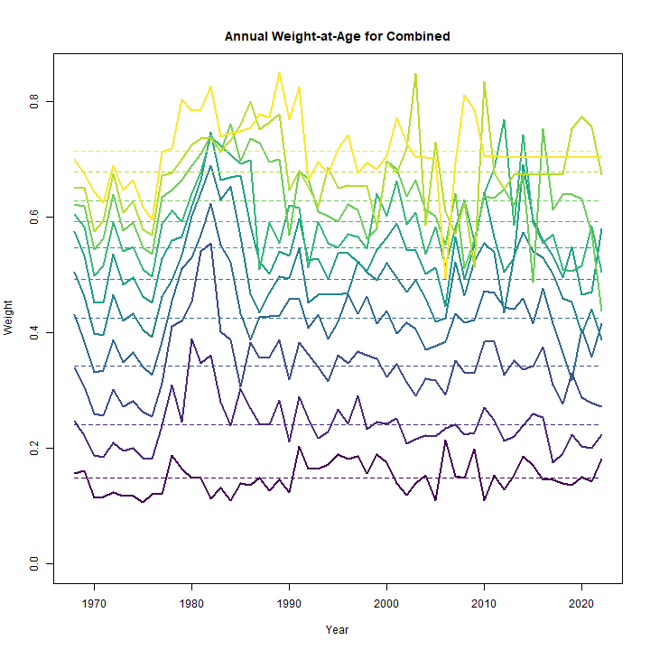
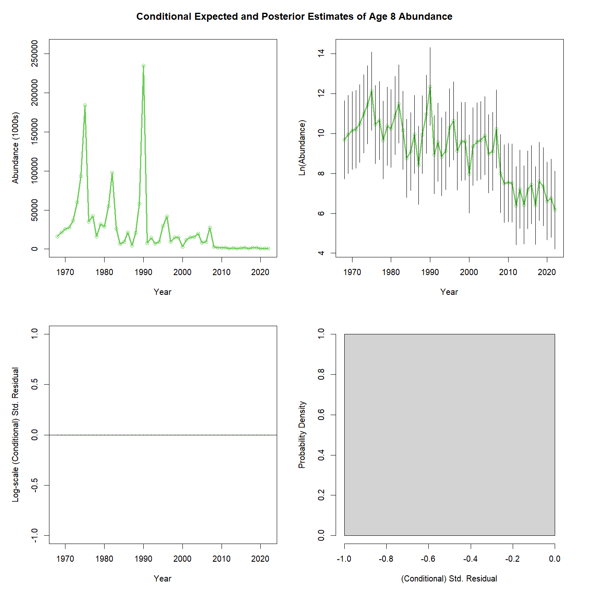
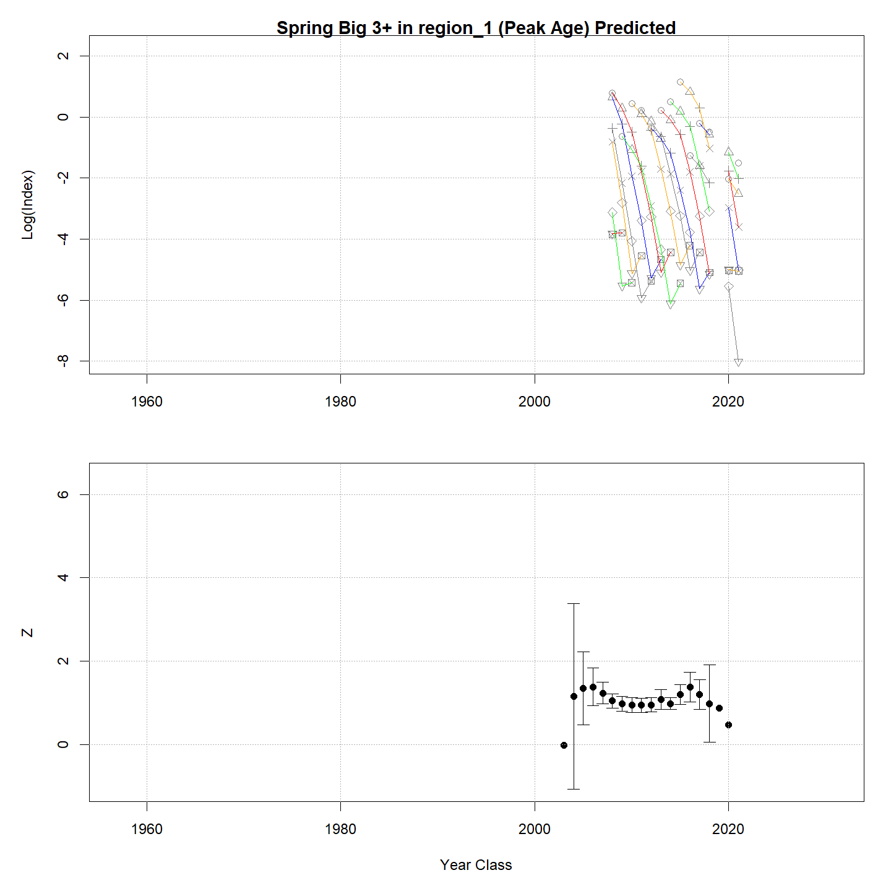

---
output:
  html_document:
    df_print: paged
    keep_md: yes
  word_document: default
  pdf_document:
    fig_caption: yes
    includes:
    keep_tex: yes
    number_sections: no
title: "WHAM figures and tables"
header-includes:
  - \usepackage{longtable}
  - \usepackage{booktabs}
  - \usepackage{caption,graphics}
  - \usepackage{makecell}
  - \usepackage{lscape}
  - \renewcommand\figurename{Fig.}
  - \captionsetup{labelsep=period, singlelinecheck=false}
  - \newcommand{\changesize}[1]{\fontsize{#1pt}{#1pt}\selectfont}
  - \renewcommand{\arraystretch}{1.5}
  - \renewcommand\theadfont{}
---

# {.tabset}

## Figures {.tabset}

### Input

### Diagnostics

### Results

### Retro

### Reference points

### Miscellaneous

## Tables {.tabset}

### Parameter estimates

<table class="table" style="margin-left: auto; margin-right: auto;">
<caption>Parameter estimates, standard errors, and confidence intervals. Rounded to 3 decimal places.</caption>
 <thead>
  <tr>
   <th style="text-align:left;">   </th>
   <th style="text-align:right;"> Estimate </th>
   <th style="text-align:right;"> Std. Error </th>
   <th style="text-align:right;"> 95\% CI lower </th>
   <th style="text-align:right;"> 95\% CI upper </th>
  </tr>
 </thead>
<tbody>
  <tr>
   <td style="text-align:left;"> Combined SSB fully selected q </td>
   <td style="text-align:right;"> $0.002$ </td>
   <td style="text-align:right;"> $2.298\times 10^{-4}$ </td>
   <td style="text-align:right;"> $0.001$ </td>
   <td style="text-align:right;"> $0.002$ </td>
  </tr>
  <tr>
   <td style="text-align:left;"> Spring Big 3+ fully selected q </td>
   <td style="text-align:right;"> $1.458\times 10^{-5}$ </td>
   <td style="text-align:right;"> $2.521\times 10^{-6}$ </td>
   <td style="text-align:right;"> $1.039\times 10^{-5}$ </td>
   <td style="text-align:right;"> $2.046\times 10^{-5}$ </td>
  </tr>
  <tr>
   <td style="text-align:left;"> Spring Alb 3+ fully selected q </td>
   <td style="text-align:right;"> $3.314\times 10^{-6}$ </td>
   <td style="text-align:right;"> $4.877\times 10^{-7}$ </td>
   <td style="text-align:right;"> $2.483\times 10^{-6}$ </td>
   <td style="text-align:right;"> $4.422\times 10^{-6}$ </td>
  </tr>
  <tr>
   <td style="text-align:left;"> Block 1: Combined Selectivity for age 1 </td>
   <td style="text-align:right;"> $0.188$ </td>
   <td style="text-align:right;"> -- </td>
   <td style="text-align:right;"> -- </td>
   <td style="text-align:right;"> -- </td>
  </tr>
  <tr>
   <td style="text-align:left;"> Block 1: Combined Selectivity for age 2 </td>
   <td style="text-align:right;"> $0.525$ </td>
   <td style="text-align:right;"> -- </td>
   <td style="text-align:right;"> -- </td>
   <td style="text-align:right;"> -- </td>
  </tr>
  <tr>
   <td style="text-align:left;"> Block 1: Combined Selectivity for age 3 </td>
   <td style="text-align:right;"> $0.881$ </td>
   <td style="text-align:right;"> -- </td>
   <td style="text-align:right;"> -- </td>
   <td style="text-align:right;"> -- </td>
  </tr>
  <tr>
   <td style="text-align:left;"> Block 1: Combined Selectivity for age 4 </td>
   <td style="text-align:right;"> $0.957$ </td>
   <td style="text-align:right;"> -- </td>
   <td style="text-align:right;"> -- </td>
   <td style="text-align:right;"> -- </td>
  </tr>
  <tr>
   <td style="text-align:left;"> Block 1: Combined Selectivity for age 5 </td>
   <td style="text-align:right;"> $0.977$ </td>
   <td style="text-align:right;"> -- </td>
   <td style="text-align:right;"> -- </td>
   <td style="text-align:right;"> -- </td>
  </tr>
  <tr>
   <td style="text-align:left;"> Block 1: Combined Selectivity for age 6 </td>
   <td style="text-align:right;"> $1.000$ </td>
   <td style="text-align:right;"> -- </td>
   <td style="text-align:right;"> -- </td>
   <td style="text-align:right;"> -- </td>
  </tr>
  <tr>
   <td style="text-align:left;"> Block 1: Combined Selectivity for age 7 </td>
   <td style="text-align:right;"> $1.000$ </td>
   <td style="text-align:right;"> -- </td>
   <td style="text-align:right;"> -- </td>
   <td style="text-align:right;"> -- </td>
  </tr>
  <tr>
   <td style="text-align:left;"> Block 1: Combined Selectivity for age 8 </td>
   <td style="text-align:right;"> $1.000$ </td>
   <td style="text-align:right;"> -- </td>
   <td style="text-align:right;"> -- </td>
   <td style="text-align:right;"> -- </td>
  </tr>
  <tr>
   <td style="text-align:left;"> Block 1: Combined Selectivity for age 9 </td>
   <td style="text-align:right;"> $1.000$ </td>
   <td style="text-align:right;"> -- </td>
   <td style="text-align:right;"> -- </td>
   <td style="text-align:right;"> -- </td>
  </tr>
  <tr>
   <td style="text-align:left;"> Block 1: Combined Selectivity for age 10+ </td>
   <td style="text-align:right;"> $1.000$ </td>
   <td style="text-align:right;"> -- </td>
   <td style="text-align:right;"> -- </td>
   <td style="text-align:right;"> -- </td>
  </tr>
  <tr>
   <td style="text-align:left;"> Block 2: Combined SSB Selectivity for age 1 </td>
   <td style="text-align:right;"> $1.000$ </td>
   <td style="text-align:right;"> -- </td>
   <td style="text-align:right;"> -- </td>
   <td style="text-align:right;"> -- </td>
  </tr>
  <tr>
   <td style="text-align:left;"> Block 2: Combined SSB Selectivity for age 2 </td>
   <td style="text-align:right;"> $1.000$ </td>
   <td style="text-align:right;"> -- </td>
   <td style="text-align:right;"> -- </td>
   <td style="text-align:right;"> -- </td>
  </tr>
  <tr>
   <td style="text-align:left;"> Block 2: Combined SSB Selectivity for age 3 </td>
   <td style="text-align:right;"> $1.000$ </td>
   <td style="text-align:right;"> -- </td>
   <td style="text-align:right;"> -- </td>
   <td style="text-align:right;"> -- </td>
  </tr>
  <tr>
   <td style="text-align:left;"> Block 2: Combined SSB Selectivity for age 4 </td>
   <td style="text-align:right;"> $1.000$ </td>
   <td style="text-align:right;"> -- </td>
   <td style="text-align:right;"> -- </td>
   <td style="text-align:right;"> -- </td>
  </tr>
  <tr>
   <td style="text-align:left;"> Block 2: Combined SSB Selectivity for age 5 </td>
   <td style="text-align:right;"> $1.000$ </td>
   <td style="text-align:right;"> -- </td>
   <td style="text-align:right;"> -- </td>
   <td style="text-align:right;"> -- </td>
  </tr>
  <tr>
   <td style="text-align:left;"> Block 2: Combined SSB Selectivity for age 6 </td>
   <td style="text-align:right;"> $1.000$ </td>
   <td style="text-align:right;"> -- </td>
   <td style="text-align:right;"> -- </td>
   <td style="text-align:right;"> -- </td>
  </tr>
  <tr>
   <td style="text-align:left;"> Block 2: Combined SSB Selectivity for age 7 </td>
   <td style="text-align:right;"> $1.000$ </td>
   <td style="text-align:right;"> -- </td>
   <td style="text-align:right;"> -- </td>
   <td style="text-align:right;"> -- </td>
  </tr>
  <tr>
   <td style="text-align:left;"> Block 2: Combined SSB Selectivity for age 8 </td>
   <td style="text-align:right;"> $1.000$ </td>
   <td style="text-align:right;"> -- </td>
   <td style="text-align:right;"> -- </td>
   <td style="text-align:right;"> -- </td>
  </tr>
  <tr>
   <td style="text-align:left;"> Block 2: Combined SSB Selectivity for age 9 </td>
   <td style="text-align:right;"> $1.000$ </td>
   <td style="text-align:right;"> -- </td>
   <td style="text-align:right;"> -- </td>
   <td style="text-align:right;"> -- </td>
  </tr>
  <tr>
   <td style="text-align:left;"> Block 2: Combined SSB Selectivity for age 10+ </td>
   <td style="text-align:right;"> $1.000$ </td>
   <td style="text-align:right;"> -- </td>
   <td style="text-align:right;"> -- </td>
   <td style="text-align:right;"> -- </td>
  </tr>
  <tr>
   <td style="text-align:left;"> Block 3: Spring Big 3+ Selectivity for age 1 </td>
   <td style="text-align:right;"> $1.000$ </td>
   <td style="text-align:right;"> -- </td>
   <td style="text-align:right;"> -- </td>
   <td style="text-align:right;"> -- </td>
  </tr>
  <tr>
   <td style="text-align:left;"> Block 3: Spring Big 3+ Selectivity for age 2 </td>
   <td style="text-align:right;"> $1.000$ </td>
   <td style="text-align:right;"> -- </td>
   <td style="text-align:right;"> -- </td>
   <td style="text-align:right;"> -- </td>
  </tr>
  <tr>
   <td style="text-align:left;"> Block 3: Spring Big 3+ Selectivity for age 3 </td>
   <td style="text-align:right;"> $1.000$ </td>
   <td style="text-align:right;"> -- </td>
   <td style="text-align:right;"> -- </td>
   <td style="text-align:right;"> -- </td>
  </tr>
  <tr>
   <td style="text-align:left;"> Block 3: Spring Big 3+ Selectivity for age 4 </td>
   <td style="text-align:right;"> $0.536$ </td>
   <td style="text-align:right;"> -- </td>
   <td style="text-align:right;"> -- </td>
   <td style="text-align:right;"> -- </td>
  </tr>
  <tr>
   <td style="text-align:left;"> Block 3: Spring Big 3+ Selectivity for age 5 </td>
   <td style="text-align:right;"> $0.254$ </td>
   <td style="text-align:right;"> -- </td>
   <td style="text-align:right;"> -- </td>
   <td style="text-align:right;"> -- </td>
  </tr>
  <tr>
   <td style="text-align:left;"> Block 3: Spring Big 3+ Selectivity for age 6 </td>
   <td style="text-align:right;"> $0.081$ </td>
   <td style="text-align:right;"> -- </td>
   <td style="text-align:right;"> -- </td>
   <td style="text-align:right;"> -- </td>
  </tr>
  <tr>
   <td style="text-align:left;"> Block 3: Spring Big 3+ Selectivity for age 7 </td>
   <td style="text-align:right;"> $0.300$ </td>
   <td style="text-align:right;"> -- </td>
   <td style="text-align:right;"> -- </td>
   <td style="text-align:right;"> -- </td>
  </tr>
  <tr>
   <td style="text-align:left;"> Block 3: Spring Big 3+ Selectivity for age 8 </td>
   <td style="text-align:right;"> $0.000$ </td>
   <td style="text-align:right;"> -- </td>
   <td style="text-align:right;"> -- </td>
   <td style="text-align:right;"> -- </td>
  </tr>
  <tr>
   <td style="text-align:left;"> Block 3: Spring Big 3+ Selectivity for age 9 </td>
   <td style="text-align:right;"> $0.000$ </td>
   <td style="text-align:right;"> -- </td>
   <td style="text-align:right;"> -- </td>
   <td style="text-align:right;"> -- </td>
  </tr>
  <tr>
   <td style="text-align:left;"> Block 3: Spring Big 3+ Selectivity for age 10+ </td>
   <td style="text-align:right;"> $0.000$ </td>
   <td style="text-align:right;"> -- </td>
   <td style="text-align:right;"> -- </td>
   <td style="text-align:right;"> -- </td>
  </tr>
  <tr>
   <td style="text-align:left;"> Block 4: Spring Alb 3+ Selectivity for age 1 </td>
   <td style="text-align:right;"> $1.000$ </td>
   <td style="text-align:right;"> -- </td>
   <td style="text-align:right;"> -- </td>
   <td style="text-align:right;"> -- </td>
  </tr>
  <tr>
   <td style="text-align:left;"> Block 4: Spring Alb 3+ Selectivity for age 2 </td>
   <td style="text-align:right;"> $1.000$ </td>
   <td style="text-align:right;"> -- </td>
   <td style="text-align:right;"> -- </td>
   <td style="text-align:right;"> -- </td>
  </tr>
  <tr>
   <td style="text-align:left;"> Block 4: Spring Alb 3+ Selectivity for age 3 </td>
   <td style="text-align:right;"> $1.000$ </td>
   <td style="text-align:right;"> -- </td>
   <td style="text-align:right;"> -- </td>
   <td style="text-align:right;"> -- </td>
  </tr>
  <tr>
   <td style="text-align:left;"> Block 4: Spring Alb 3+ Selectivity for age 4 </td>
   <td style="text-align:right;"> $0.580$ </td>
   <td style="text-align:right;"> -- </td>
   <td style="text-align:right;"> -- </td>
   <td style="text-align:right;"> -- </td>
  </tr>
  <tr>
   <td style="text-align:left;"> Block 4: Spring Alb 3+ Selectivity for age 5 </td>
   <td style="text-align:right;"> $0.543$ </td>
   <td style="text-align:right;"> -- </td>
   <td style="text-align:right;"> -- </td>
   <td style="text-align:right;"> -- </td>
  </tr>
  <tr>
   <td style="text-align:left;"> Block 4: Spring Alb 3+ Selectivity for age 6 </td>
   <td style="text-align:right;"> $0.455$ </td>
   <td style="text-align:right;"> -- </td>
   <td style="text-align:right;"> -- </td>
   <td style="text-align:right;"> -- </td>
  </tr>
  <tr>
   <td style="text-align:left;"> Block 4: Spring Alb 3+ Selectivity for age 7 </td>
   <td style="text-align:right;"> $0.386$ </td>
   <td style="text-align:right;"> -- </td>
   <td style="text-align:right;"> -- </td>
   <td style="text-align:right;"> -- </td>
  </tr>
  <tr>
   <td style="text-align:left;"> Block 4: Spring Alb 3+ Selectivity for age 8 </td>
   <td style="text-align:right;"> $0.307$ </td>
   <td style="text-align:right;"> -- </td>
   <td style="text-align:right;"> -- </td>
   <td style="text-align:right;"> -- </td>
  </tr>
  <tr>
   <td style="text-align:left;"> Block 4: Spring Alb 3+ Selectivity for age 9 </td>
   <td style="text-align:right;"> $0.431$ </td>
   <td style="text-align:right;"> -- </td>
   <td style="text-align:right;"> -- </td>
   <td style="text-align:right;"> -- </td>
  </tr>
  <tr>
   <td style="text-align:left;"> Block 4: Spring Alb 3+ Selectivity for age 10+ </td>
   <td style="text-align:right;"> $0.410$ </td>
   <td style="text-align:right;"> -- </td>
   <td style="text-align:right;"> -- </td>
   <td style="text-align:right;"> -- </td>
  </tr>
</tbody>
</table>

### Abundance at age

<table class="table" style="margin-left: auto; margin-right: auto;">
<caption>Abundance at age (1000s) for stock 1 in region 1.</caption>
 <thead>
  <tr>
   <th style="text-align:left;">   </th>
   <th style="text-align:right;"> 1 </th>
   <th style="text-align:right;"> 2 </th>
   <th style="text-align:right;"> 3 </th>
   <th style="text-align:right;"> 4 </th>
   <th style="text-align:right;"> 5 </th>
   <th style="text-align:right;"> 6 </th>
   <th style="text-align:right;"> 7 </th>
   <th style="text-align:right;"> 8 </th>
   <th style="text-align:right;"> 9 </th>
   <th style="text-align:right;"> 10+ </th>
  </tr>
 </thead>
<tbody>
  <tr>
   <td style="text-align:left;"> 1968 </td>
   <td style="text-align:right;"> 5112830 </td>
   <td style="text-align:right;"> 1429566 </td>
   <td style="text-align:right;"> 505992 </td>
   <td style="text-align:right;"> 184448 </td>
   <td style="text-align:right;"> 82813 </td>
   <td style="text-align:right;"> 51697 </td>
   <td style="text-align:right;"> 29950 </td>
   <td style="text-align:right;"> 16202 </td>
   <td style="text-align:right;"> 88697 </td>
   <td style="text-align:right;"> 1174 </td>
  </tr>
  <tr>
   <td style="text-align:left;"> 1969 </td>
   <td style="text-align:right;"> 1515969 </td>
   <td style="text-align:right;"> 4066425 </td>
   <td style="text-align:right;"> 1079261 </td>
   <td style="text-align:right;"> 361593 </td>
   <td style="text-align:right;"> 130278 </td>
   <td style="text-align:right;"> 58311 </td>
   <td style="text-align:right;"> 36270 </td>
   <td style="text-align:right;"> 21013 </td>
   <td style="text-align:right;"> 11367 </td>
   <td style="text-align:right;"> 63053 </td>
  </tr>
  <tr>
   <td style="text-align:left;"> 1970 </td>
   <td style="text-align:right;"> 2917981 </td>
   <td style="text-align:right;"> 1207740 </td>
   <td style="text-align:right;"> 3084478 </td>
   <td style="text-align:right;"> 777383 </td>
   <td style="text-align:right;"> 257600 </td>
   <td style="text-align:right;"> 92541 </td>
   <td style="text-align:right;"> 41280 </td>
   <td style="text-align:right;"> 25676 </td>
   <td style="text-align:right;"> 14876 </td>
   <td style="text-align:right;"> 52684 </td>
  </tr>
  <tr>
   <td style="text-align:left;"> 1971 </td>
   <td style="text-align:right;"> 1012647 </td>
   <td style="text-align:right;"> 2297402 </td>
   <td style="text-align:right;"> 886331 </td>
   <td style="text-align:right;"> 2101988 </td>
   <td style="text-align:right;"> 521474 </td>
   <td style="text-align:right;"> 172080 </td>
   <td style="text-align:right;"> 61518 </td>
   <td style="text-align:right;"> 27441 </td>
   <td style="text-align:right;"> 17069 </td>
   <td style="text-align:right;"> 44911 </td>
  </tr>
  <tr>
   <td style="text-align:left;"> 1972 </td>
   <td style="text-align:right;"> 1471757 </td>
   <td style="text-align:right;"> 780341 </td>
   <td style="text-align:right;"> 1587684 </td>
   <td style="text-align:right;"> 546110 </td>
   <td style="text-align:right;"> 1263866 </td>
   <td style="text-align:right;"> 311528 </td>
   <td style="text-align:right;"> 102028 </td>
   <td style="text-align:right;"> 36475 </td>
   <td style="text-align:right;"> 16270 </td>
   <td style="text-align:right;"> 36749 </td>
  </tr>
  <tr>
   <td style="text-align:left;"> 1973 </td>
   <td style="text-align:right;"> 908151 </td>
   <td style="text-align:right;"> 1131219 </td>
   <td style="text-align:right;"> 535415 </td>
   <td style="text-align:right;"> 966529 </td>
   <td style="text-align:right;"> 324091 </td>
   <td style="text-align:right;"> 745011 </td>
   <td style="text-align:right;"> 182198 </td>
   <td style="text-align:right;"> 59671 </td>
   <td style="text-align:right;"> 21332 </td>
   <td style="text-align:right;"> 31008 </td>
  </tr>
  <tr>
   <td style="text-align:left;"> 1974 </td>
   <td style="text-align:right;"> 1087305 </td>
   <td style="text-align:right;"> 681453 </td>
   <td style="text-align:right;"> 725718 </td>
   <td style="text-align:right;"> 291202 </td>
   <td style="text-align:right;"> 507513 </td>
   <td style="text-align:right;"> 168602 </td>
   <td style="text-align:right;"> 383392 </td>
   <td style="text-align:right;"> 93761 </td>
   <td style="text-align:right;"> 30708 </td>
   <td style="text-align:right;"> 26935 </td>
  </tr>
  <tr>
   <td style="text-align:left;"> 1975 </td>
   <td style="text-align:right;"> 1206057 </td>
   <td style="text-align:right;"> 805515 </td>
   <td style="text-align:right;"> 421809 </td>
   <td style="text-align:right;"> 371714 </td>
   <td style="text-align:right;"> 143259 </td>
   <td style="text-align:right;"> 247028 </td>
   <td style="text-align:right;"> 81050 </td>
   <td style="text-align:right;"> 184304 </td>
   <td style="text-align:right;"> 45073 </td>
   <td style="text-align:right;"> 27710 </td>
  </tr>
  <tr>
   <td style="text-align:left;"> 1976 </td>
   <td style="text-align:right;"> 227893 </td>
   <td style="text-align:right;"> 874463 </td>
   <td style="text-align:right;"> 469463 </td>
   <td style="text-align:right;"> 195298 </td>
   <td style="text-align:right;"> 163873 </td>
   <td style="text-align:right;"> 62344 </td>
   <td style="text-align:right;"> 105888 </td>
   <td style="text-align:right;"> 34742 </td>
   <td style="text-align:right;"> 79002 </td>
   <td style="text-align:right;"> 31198 </td>
  </tr>
  <tr>
   <td style="text-align:left;"> 1977 </td>
   <td style="text-align:right;"> 47544 </td>
   <td style="text-align:right;"> 163184 </td>
   <td style="text-align:right;"> 492138 </td>
   <td style="text-align:right;"> 204985 </td>
   <td style="text-align:right;"> 80788 </td>
   <td style="text-align:right;"> 66827 </td>
   <td style="text-align:right;"> 25003 </td>
   <td style="text-align:right;"> 42466 </td>
   <td style="text-align:right;"> 13933 </td>
   <td style="text-align:right;"> 44195 </td>
  </tr>
  <tr>
   <td style="text-align:left;"> 1978 </td>
   <td style="text-align:right;"> 64821 </td>
   <td style="text-align:right;"> 37153 </td>
   <td style="text-align:right;"> 117272 </td>
   <td style="text-align:right;"> 323789 </td>
   <td style="text-align:right;"> 132353 </td>
   <td style="text-align:right;"> 51904 </td>
   <td style="text-align:right;"> 42685 </td>
   <td style="text-align:right;"> 15971 </td>
   <td style="text-align:right;"> 27125 </td>
   <td style="text-align:right;"> 37130 </td>
  </tr>
  <tr>
   <td style="text-align:left;"> 1979 </td>
   <td style="text-align:right;"> 156388 </td>
   <td style="text-align:right;"> 52211 </td>
   <td style="text-align:right;"> 29059 </td>
   <td style="text-align:right;"> 88928 </td>
   <td style="text-align:right;"> 243919 </td>
   <td style="text-align:right;"> 99531 </td>
   <td style="text-align:right;"> 38953 </td>
   <td style="text-align:right;"> 32035 </td>
   <td style="text-align:right;"> 11986 </td>
   <td style="text-align:right;"> 48222 </td>
  </tr>
  <tr>
   <td style="text-align:left;"> 1980 </td>
   <td style="text-align:right;"> 33901 </td>
   <td style="text-align:right;"> 125395 </td>
   <td style="text-align:right;"> 40322 </td>
   <td style="text-align:right;"> 21572 </td>
   <td style="text-align:right;"> 65462 </td>
   <td style="text-align:right;"> 179155 </td>
   <td style="text-align:right;"> 72915 </td>
   <td style="text-align:right;"> 28536 </td>
   <td style="text-align:right;"> 23468 </td>
   <td style="text-align:right;"> 44107 </td>
  </tr>
  <tr>
   <td style="text-align:left;"> 1981 </td>
   <td style="text-align:right;"> 170242 </td>
   <td style="text-align:right;"> 27287 </td>
   <td style="text-align:right;"> 97886 </td>
   <td style="text-align:right;"> 30476 </td>
   <td style="text-align:right;"> 16193 </td>
   <td style="text-align:right;"> 49050 </td>
   <td style="text-align:right;"> 133955 </td>
   <td style="text-align:right;"> 54518 </td>
   <td style="text-align:right;"> 21337 </td>
   <td style="text-align:right;"> 50526 </td>
  </tr>
  <tr>
   <td style="text-align:left;"> 1982 </td>
   <td style="text-align:right;"> 528901 </td>
   <td style="text-align:right;"> 136381 </td>
   <td style="text-align:right;"> 21020 </td>
   <td style="text-align:right;"> 72361 </td>
   <td style="text-align:right;"> 22332 </td>
   <td style="text-align:right;"> 11838 </td>
   <td style="text-align:right;"> 35762 </td>
   <td style="text-align:right;"> 97666 </td>
   <td style="text-align:right;"> 39749 </td>
   <td style="text-align:right;"> 52395 </td>
  </tr>
  <tr>
   <td style="text-align:left;"> 1983 </td>
   <td style="text-align:right;"> 2414733 </td>
   <td style="text-align:right;"> 423743 </td>
   <td style="text-align:right;"> 105090 </td>
   <td style="text-align:right;"> 15546 </td>
   <td style="text-align:right;"> 53050 </td>
   <td style="text-align:right;"> 16335 </td>
   <td style="text-align:right;"> 8636 </td>
   <td style="text-align:right;"> 26087 </td>
   <td style="text-align:right;"> 71244 </td>
   <td style="text-align:right;"> 67216 </td>
  </tr>
  <tr>
   <td style="text-align:left;"> 1984 </td>
   <td style="text-align:right;"> 97412 </td>
   <td style="text-align:right;"> 1936806 </td>
   <td style="text-align:right;"> 327551 </td>
   <td style="text-align:right;"> 78133 </td>
   <td style="text-align:right;"> 11463 </td>
   <td style="text-align:right;"> 39031 </td>
   <td style="text-align:right;"> 11987 </td>
   <td style="text-align:right;"> 6337 </td>
   <td style="text-align:right;"> 19144 </td>
   <td style="text-align:right;"> 101610 </td>
  </tr>
  <tr>
   <td style="text-align:left;"> 1985 </td>
   <td style="text-align:right;"> 202795 </td>
   <td style="text-align:right;"> 78457 </td>
   <td style="text-align:right;"> 1514605 </td>
   <td style="text-align:right;"> 248313 </td>
   <td style="text-align:right;"> 58841 </td>
   <td style="text-align:right;"> 8617 </td>
   <td style="text-align:right;"> 29283 </td>
   <td style="text-align:right;"> 8993 </td>
   <td style="text-align:right;"> 4755 </td>
   <td style="text-align:right;"> 90595 </td>
  </tr>
  <tr>
   <td style="text-align:left;"> 1986 </td>
   <td style="text-align:right;"> 100208 </td>
   <td style="text-align:right;"> 162162 </td>
   <td style="text-align:right;"> 60131 </td>
   <td style="text-align:right;"> 1110087 </td>
   <td style="text-align:right;"> 180270 </td>
   <td style="text-align:right;"> 42610 </td>
   <td style="text-align:right;"> 6222 </td>
   <td style="text-align:right;"> 21143 </td>
   <td style="text-align:right;"> 6493 </td>
   <td style="text-align:right;"> 68845 </td>
  </tr>
  <tr>
   <td style="text-align:left;"> 1987 </td>
   <td style="text-align:right;"> 133463 </td>
   <td style="text-align:right;"> 80069 </td>
   <td style="text-align:right;"> 124023 </td>
   <td style="text-align:right;"> 43916 </td>
   <td style="text-align:right;"> 802809 </td>
   <td style="text-align:right;"> 130032 </td>
   <td style="text-align:right;"> 30642 </td>
   <td style="text-align:right;"> 4475 </td>
   <td style="text-align:right;"> 15205 </td>
   <td style="text-align:right;"> 54179 </td>
  </tr>
  <tr>
   <td style="text-align:left;"> 1988 </td>
   <td style="text-align:right;"> 414495 </td>
   <td style="text-align:right;"> 105600 </td>
   <td style="text-align:right;"> 59579 </td>
   <td style="text-align:right;"> 86501 </td>
   <td style="text-align:right;"> 30210 </td>
   <td style="text-align:right;"> 550250 </td>
   <td style="text-align:right;"> 88746 </td>
   <td style="text-align:right;"> 20913 </td>
   <td style="text-align:right;"> 3054 </td>
   <td style="text-align:right;"> 47354 </td>
  </tr>
  <tr>
   <td style="text-align:left;"> 1989 </td>
   <td style="text-align:right;"> 541473 </td>
   <td style="text-align:right;"> 325356 </td>
   <td style="text-align:right;"> 76843 </td>
   <td style="text-align:right;"> 40029 </td>
   <td style="text-align:right;"> 57137 </td>
   <td style="text-align:right;"> 19865 </td>
   <td style="text-align:right;"> 359937 </td>
   <td style="text-align:right;"> 58052 </td>
   <td style="text-align:right;"> 13680 </td>
   <td style="text-align:right;"> 32973 </td>
  </tr>
  <tr>
   <td style="text-align:left;"> 1990 </td>
   <td style="text-align:right;"> 121395 </td>
   <td style="text-align:right;"> 424796 </td>
   <td style="text-align:right;"> 236397 </td>
   <td style="text-align:right;"> 51497 </td>
   <td style="text-align:right;"> 26367 </td>
   <td style="text-align:right;"> 37466 </td>
   <td style="text-align:right;"> 12957 </td>
   <td style="text-align:right;"> 234767 </td>
   <td style="text-align:right;"> 37864 </td>
   <td style="text-align:right;"> 30430 </td>
  </tr>
  <tr>
   <td style="text-align:left;"> 1991 </td>
   <td style="text-align:right;"> 208677 </td>
   <td style="text-align:right;"> 93636 </td>
   <td style="text-align:right;"> 294350 </td>
   <td style="text-align:right;"> 146308 </td>
   <td style="text-align:right;"> 31114 </td>
   <td style="text-align:right;"> 15830 </td>
   <td style="text-align:right;"> 22327 </td>
   <td style="text-align:right;"> 7721 </td>
   <td style="text-align:right;"> 139903 </td>
   <td style="text-align:right;"> 40698 </td>
  </tr>
  <tr>
   <td style="text-align:left;"> 1992 </td>
   <td style="text-align:right;"> 222749 </td>
   <td style="text-align:right;"> 163073 </td>
   <td style="text-align:right;"> 67294 </td>
   <td style="text-align:right;"> 193673 </td>
   <td style="text-align:right;"> 94474 </td>
   <td style="text-align:right;"> 19991 </td>
   <td style="text-align:right;"> 10112 </td>
   <td style="text-align:right;"> 14262 </td>
   <td style="text-align:right;"> 4932 </td>
   <td style="text-align:right;"> 115368 </td>
  </tr>
  <tr>
   <td style="text-align:left;"> 1993 </td>
   <td style="text-align:right;"> 45214 </td>
   <td style="text-align:right;"> 176217 </td>
   <td style="text-align:right;"> 121286 </td>
   <td style="text-align:right;"> 46899 </td>
   <td style="text-align:right;"> 133121 </td>
   <td style="text-align:right;"> 64699 </td>
   <td style="text-align:right;"> 13632 </td>
   <td style="text-align:right;"> 6896 </td>
   <td style="text-align:right;"> 9726 </td>
   <td style="text-align:right;"> 82035 </td>
  </tr>
  <tr>
   <td style="text-align:left;"> 1994 </td>
   <td style="text-align:right;"> 169092 </td>
   <td style="text-align:right;"> 35802 </td>
   <td style="text-align:right;"> 131404 </td>
   <td style="text-align:right;"> 84898 </td>
   <td style="text-align:right;"> 32389 </td>
   <td style="text-align:right;"> 91608 </td>
   <td style="text-align:right;"> 44338 </td>
   <td style="text-align:right;"> 9342 </td>
   <td style="text-align:right;"> 4726 </td>
   <td style="text-align:right;"> 62884 </td>
  </tr>
  <tr>
   <td style="text-align:left;"> 1995 </td>
   <td style="text-align:right;"> 202492 </td>
   <td style="text-align:right;"> 133018 </td>
   <td style="text-align:right;"> 26213 </td>
   <td style="text-align:right;"> 89196 </td>
   <td style="text-align:right;"> 56707 </td>
   <td style="text-align:right;"> 21542 </td>
   <td style="text-align:right;"> 60626 </td>
   <td style="text-align:right;"> 29343 </td>
   <td style="text-align:right;"> 6183 </td>
   <td style="text-align:right;"> 44744 </td>
  </tr>
  <tr>
   <td style="text-align:left;"> 1996 </td>
   <td style="text-align:right;"> 208057 </td>
   <td style="text-align:right;"> 160471 </td>
   <td style="text-align:right;"> 99418 </td>
   <td style="text-align:right;"> 18419 </td>
   <td style="text-align:right;"> 61857 </td>
   <td style="text-align:right;"> 39189 </td>
   <td style="text-align:right;"> 14827 </td>
   <td style="text-align:right;"> 41728 </td>
   <td style="text-align:right;"> 20196 </td>
   <td style="text-align:right;"> 35052 </td>
  </tr>
  <tr>
   <td style="text-align:left;"> 1997 </td>
   <td style="text-align:right;"> 269893 </td>
   <td style="text-align:right;"> 161677 </td>
   <td style="text-align:right;"> 113529 </td>
   <td style="text-align:right;"> 63713 </td>
   <td style="text-align:right;"> 11558 </td>
   <td style="text-align:right;"> 38600 </td>
   <td style="text-align:right;"> 24296 </td>
   <td style="text-align:right;"> 9192 </td>
   <td style="text-align:right;"> 25870 </td>
   <td style="text-align:right;"> 34253 </td>
  </tr>
  <tr>
   <td style="text-align:left;"> 1998 </td>
   <td style="text-align:right;"> 143258 </td>
   <td style="text-align:right;"> 209468 </td>
   <td style="text-align:right;"> 113984 </td>
   <td style="text-align:right;"> 72332 </td>
   <td style="text-align:right;"> 39727 </td>
   <td style="text-align:right;"> 7166 </td>
   <td style="text-align:right;"> 23773 </td>
   <td style="text-align:right;"> 14964 </td>
   <td style="text-align:right;"> 5661 </td>
   <td style="text-align:right;"> 37028 </td>
  </tr>
  <tr>
   <td style="text-align:left;"> 1999 </td>
   <td style="text-align:right;"> 227041 </td>
   <td style="text-align:right;"> 111678 </td>
   <td style="text-align:right;"> 149518 </td>
   <td style="text-align:right;"> 74147 </td>
   <td style="text-align:right;"> 46130 </td>
   <td style="text-align:right;"> 25204 </td>
   <td style="text-align:right;"> 4519 </td>
   <td style="text-align:right;"> 14990 </td>
   <td style="text-align:right;"> 9436 </td>
   <td style="text-align:right;"> 26919 </td>
  </tr>
  <tr>
   <td style="text-align:left;"> 2000 </td>
   <td style="text-align:right;"> 1203194 </td>
   <td style="text-align:right;"> 177765 </td>
   <td style="text-align:right;"> 80694 </td>
   <td style="text-align:right;"> 99271 </td>
   <td style="text-align:right;"> 48350 </td>
   <td style="text-align:right;"> 29938 </td>
   <td style="text-align:right;"> 16266 </td>
   <td style="text-align:right;"> 2916 </td>
   <td style="text-align:right;"> 9675 </td>
   <td style="text-align:right;"> 23463 </td>
  </tr>
  <tr>
   <td style="text-align:left;"> 2001 </td>
   <td style="text-align:right;"> 208350 </td>
   <td style="text-align:right;"> 958380 </td>
   <td style="text-align:right;"> 134768 </td>
   <td style="text-align:right;"> 58072 </td>
   <td style="text-align:right;"> 70654 </td>
   <td style="text-align:right;"> 34311 </td>
   <td style="text-align:right;"> 21173 </td>
   <td style="text-align:right;"> 11504 </td>
   <td style="text-align:right;"> 2062 </td>
   <td style="text-align:right;"> 23435 </td>
  </tr>
  <tr>
   <td style="text-align:left;"> 2002 </td>
   <td style="text-align:right;"> 173976 </td>
   <td style="text-align:right;"> 165364 </td>
   <td style="text-align:right;"> 719333 </td>
   <td style="text-align:right;"> 95372 </td>
   <td style="text-align:right;"> 40584 </td>
   <td style="text-align:right;"> 49214 </td>
   <td style="text-align:right;"> 23807 </td>
   <td style="text-align:right;"> 14691 </td>
   <td style="text-align:right;"> 7982 </td>
   <td style="text-align:right;"> 17692 </td>
  </tr>
  <tr>
   <td style="text-align:left;"> 2003 </td>
   <td style="text-align:right;"> 354869 </td>
   <td style="text-align:right;"> 136786 </td>
   <td style="text-align:right;"> 120885 </td>
   <td style="text-align:right;"> 487020 </td>
   <td style="text-align:right;"> 63525 </td>
   <td style="text-align:right;"> 26916 </td>
   <td style="text-align:right;"> 32474 </td>
   <td style="text-align:right;"> 15709 </td>
   <td style="text-align:right;"> 9694 </td>
   <td style="text-align:right;"> 16941 </td>
  </tr>
  <tr>
   <td style="text-align:left;"> 2004 </td>
   <td style="text-align:right;"> 670863 </td>
   <td style="text-align:right;"> 274999 </td>
   <td style="text-align:right;"> 96025 </td>
   <td style="text-align:right;"> 76470 </td>
   <td style="text-align:right;"> 301321 </td>
   <td style="text-align:right;"> 39073 </td>
   <td style="text-align:right;"> 16443 </td>
   <td style="text-align:right;"> 19838 </td>
   <td style="text-align:right;"> 9597 </td>
   <td style="text-align:right;"> 16271 </td>
  </tr>
  <tr>
   <td style="text-align:left;"> 2005 </td>
   <td style="text-align:right;"> 189312 </td>
   <td style="text-align:right;"> 498050 </td>
   <td style="text-align:right;"> 171228 </td>
   <td style="text-align:right;"> 49674 </td>
   <td style="text-align:right;"> 38027 </td>
   <td style="text-align:right;"> 148285 </td>
   <td style="text-align:right;"> 18996 </td>
   <td style="text-align:right;"> 7994 </td>
   <td style="text-align:right;"> 9645 </td>
   <td style="text-align:right;"> 12576 </td>
  </tr>
  <tr>
   <td style="text-align:left;"> 2006 </td>
   <td style="text-align:right;"> 388174 </td>
   <td style="text-align:right;"> 140212 </td>
   <td style="text-align:right;"> 308052 </td>
   <td style="text-align:right;"> 87592 </td>
   <td style="text-align:right;"> 24404 </td>
   <td style="text-align:right;"> 18483 </td>
   <td style="text-align:right;"> 71181 </td>
   <td style="text-align:right;"> 9118 </td>
   <td style="text-align:right;"> 3837 </td>
   <td style="text-align:right;"> 10666 </td>
  </tr>
  <tr>
   <td style="text-align:left;"> 2007 </td>
   <td style="text-align:right;"> 147122 </td>
   <td style="text-align:right;"> 276190 </td>
   <td style="text-align:right;"> 77516 </td>
   <td style="text-align:right;"> 130548 </td>
   <td style="text-align:right;"> 35077 </td>
   <td style="text-align:right;"> 9628 </td>
   <td style="text-align:right;"> 7165 </td>
   <td style="text-align:right;"> 27595 </td>
   <td style="text-align:right;"> 3535 </td>
   <td style="text-align:right;"> 5623 </td>
  </tr>
  <tr>
   <td style="text-align:left;"> 2008 </td>
   <td style="text-align:right;"> 215847 </td>
   <td style="text-align:right;"> 106043 </td>
   <td style="text-align:right;"> 158327 </td>
   <td style="text-align:right;"> 34909 </td>
   <td style="text-align:right;"> 55846 </td>
   <td style="text-align:right;"> 14803 </td>
   <td style="text-align:right;"> 3999 </td>
   <td style="text-align:right;"> 2976 </td>
   <td style="text-align:right;"> 11462 </td>
   <td style="text-align:right;"> 3804 </td>
  </tr>
  <tr>
   <td style="text-align:left;"> 2009 </td>
   <td style="text-align:right;"> 165819 </td>
   <td style="text-align:right;"> 157866 </td>
   <td style="text-align:right;"> 63322 </td>
   <td style="text-align:right;"> 76353 </td>
   <td style="text-align:right;"> 16086 </td>
   <td style="text-align:right;"> 25426 </td>
   <td style="text-align:right;"> 6645 </td>
   <td style="text-align:right;"> 1795 </td>
   <td style="text-align:right;"> 1336 </td>
   <td style="text-align:right;"> 6853 </td>
  </tr>
  <tr>
   <td style="text-align:left;"> 2010 </td>
   <td style="text-align:right;"> 39998 </td>
   <td style="text-align:right;"> 111240 </td>
   <td style="text-align:right;"> 74032 </td>
   <td style="text-align:right;"> 20362 </td>
   <td style="text-align:right;"> 22657 </td>
   <td style="text-align:right;"> 4673 </td>
   <td style="text-align:right;"> 7205 </td>
   <td style="text-align:right;"> 1883 </td>
   <td style="text-align:right;"> 509 </td>
   <td style="text-align:right;"> 2321 </td>
  </tr>
  <tr>
   <td style="text-align:left;"> 2011 </td>
   <td style="text-align:right;"> 115055 </td>
   <td style="text-align:right;"> 26325 </td>
   <td style="text-align:right;"> 49449 </td>
   <td style="text-align:right;"> 21763 </td>
   <td style="text-align:right;"> 5481 </td>
   <td style="text-align:right;"> 5959 </td>
   <td style="text-align:right;"> 1196 </td>
   <td style="text-align:right;"> 1844 </td>
   <td style="text-align:right;"> 482 </td>
   <td style="text-align:right;"> 724 </td>
  </tr>
  <tr>
   <td style="text-align:left;"> 2012 </td>
   <td style="text-align:right;"> 91014 </td>
   <td style="text-align:right;"> 85622 </td>
   <td style="text-align:right;"> 16502 </td>
   <td style="text-align:right;"> 25870 </td>
   <td style="text-align:right;"> 10956 </td>
   <td style="text-align:right;"> 2731 </td>
   <td style="text-align:right;"> 2934 </td>
   <td style="text-align:right;"> 589 </td>
   <td style="text-align:right;"> 908 </td>
   <td style="text-align:right;"> 594 </td>
  </tr>
  <tr>
   <td style="text-align:left;"> 2013 </td>
   <td style="text-align:right;"> 50705 </td>
   <td style="text-align:right;"> 66988 </td>
   <td style="text-align:right;"> 52040 </td>
   <td style="text-align:right;"> 8197 </td>
   <td style="text-align:right;"> 12311 </td>
   <td style="text-align:right;"> 5155 </td>
   <td style="text-align:right;"> 1268 </td>
   <td style="text-align:right;"> 1362 </td>
   <td style="text-align:right;"> 273 </td>
   <td style="text-align:right;"> 697 </td>
  </tr>
  <tr>
   <td style="text-align:left;"> 2014 </td>
   <td style="text-align:right;"> 92188 </td>
   <td style="text-align:right;"> 37684 </td>
   <td style="text-align:right;"> 41837 </td>
   <td style="text-align:right;"> 27058 </td>
   <td style="text-align:right;"> 4099 </td>
   <td style="text-align:right;"> 6093 </td>
   <td style="text-align:right;"> 2520 </td>
   <td style="text-align:right;"> 620 </td>
   <td style="text-align:right;"> 666 </td>
   <td style="text-align:right;"> 475 </td>
  </tr>
  <tr>
   <td style="text-align:left;"> 2015 </td>
   <td style="text-align:right;"> 121388 </td>
   <td style="text-align:right;"> 69358 </td>
   <td style="text-align:right;"> 24354 </td>
   <td style="text-align:right;"> 23036 </td>
   <td style="text-align:right;"> 14399 </td>
   <td style="text-align:right;"> 2162 </td>
   <td style="text-align:right;"> 3179 </td>
   <td style="text-align:right;"> 1315 </td>
   <td style="text-align:right;"> 324 </td>
   <td style="text-align:right;"> 595 </td>
  </tr>
  <tr>
   <td style="text-align:left;"> 2016 </td>
   <td style="text-align:right;"> 232607 </td>
   <td style="text-align:right;"> 91629 </td>
   <td style="text-align:right;"> 45240 </td>
   <td style="text-align:right;"> 13619 </td>
   <td style="text-align:right;"> 12467 </td>
   <td style="text-align:right;"> 7725 </td>
   <td style="text-align:right;"> 1148 </td>
   <td style="text-align:right;"> 1689 </td>
   <td style="text-align:right;"> 699 </td>
   <td style="text-align:right;"> 488 </td>
  </tr>
  <tr>
   <td style="text-align:left;"> 2017 </td>
   <td style="text-align:right;"> 20916 </td>
   <td style="text-align:right;"> 175039 </td>
   <td style="text-align:right;"> 59251 </td>
   <td style="text-align:right;"> 24935 </td>
   <td style="text-align:right;"> 7256 </td>
   <td style="text-align:right;"> 6582 </td>
   <td style="text-align:right;"> 4036 </td>
   <td style="text-align:right;"> 600 </td>
   <td style="text-align:right;"> 882 </td>
   <td style="text-align:right;"> 620 </td>
  </tr>
  <tr>
   <td style="text-align:left;"> 2018 </td>
   <td style="text-align:right;"> 60142 </td>
   <td style="text-align:right;"> 15587 </td>
   <td style="text-align:right;"> 110138 </td>
   <td style="text-align:right;"> 31195 </td>
   <td style="text-align:right;"> 12639 </td>
   <td style="text-align:right;"> 3641 </td>
   <td style="text-align:right;"> 3265 </td>
   <td style="text-align:right;"> 2002 </td>
   <td style="text-align:right;"> 298 </td>
   <td style="text-align:right;"> 745 </td>
  </tr>
  <tr>
   <td style="text-align:left;"> 2019 </td>
   <td style="text-align:right;"> 45057 </td>
   <td style="text-align:right;"> 44401 </td>
   <td style="text-align:right;"> 9555 </td>
   <td style="text-align:right;"> 55501 </td>
   <td style="text-align:right;"> 15078 </td>
   <td style="text-align:right;"> 6042 </td>
   <td style="text-align:right;"> 1718 </td>
   <td style="text-align:right;"> 1541 </td>
   <td style="text-align:right;"> 945 </td>
   <td style="text-align:right;"> 492 </td>
  </tr>
  <tr>
   <td style="text-align:left;"> 2020 </td>
   <td style="text-align:right;"> 39248 </td>
   <td style="text-align:right;"> 32782 </td>
   <td style="text-align:right;"> 26129 </td>
   <td style="text-align:right;"> 4496 </td>
   <td style="text-align:right;"> 24903 </td>
   <td style="text-align:right;"> 6681 </td>
   <td style="text-align:right;"> 2638 </td>
   <td style="text-align:right;"> 750 </td>
   <td style="text-align:right;"> 673 </td>
   <td style="text-align:right;"> 627 </td>
  </tr>
  <tr>
   <td style="text-align:left;"> 2021 </td>
   <td style="text-align:right;"> 9926 </td>
   <td style="text-align:right;"> 27014 </td>
   <td style="text-align:right;"> 16518 </td>
   <td style="text-align:right;"> 9477 </td>
   <td style="text-align:right;"> 1521 </td>
   <td style="text-align:right;"> 8268 </td>
   <td style="text-align:right;"> 2170 </td>
   <td style="text-align:right;"> 857 </td>
   <td style="text-align:right;"> 244 </td>
   <td style="text-align:right;"> 422 </td>
  </tr>
  <tr>
   <td style="text-align:left;"> 2022 </td>
   <td style="text-align:right;"> 16437 </td>
   <td style="text-align:right;"> 6349 </td>
   <td style="text-align:right;"> 11086 </td>
   <td style="text-align:right;"> 4247 </td>
   <td style="text-align:right;"> 2206 </td>
   <td style="text-align:right;"> 345 </td>
   <td style="text-align:right;"> 1817 </td>
   <td style="text-align:right;"> 477 </td>
   <td style="text-align:right;"> 188 </td>
   <td style="text-align:right;"> 146 </td>
  </tr>
</tbody>
</table>

### Fishing mortality at age by region

<table class="table" style="margin-left: auto; margin-right: auto;">
<caption>Total fishing mortality at age in region 1.</caption>
 <thead>
  <tr>
   <th style="text-align:left;">   </th>
   <th style="text-align:right;"> 1 </th>
   <th style="text-align:right;"> 2 </th>
   <th style="text-align:right;"> 3 </th>
   <th style="text-align:right;"> 4 </th>
   <th style="text-align:right;"> 5 </th>
   <th style="text-align:right;"> 6 </th>
   <th style="text-align:right;"> 7 </th>
   <th style="text-align:right;"> 8 </th>
   <th style="text-align:right;"> 9 </th>
   <th style="text-align:right;"> 10+ </th>
  </tr>
 </thead>
<tbody>
  <tr>
   <td style="text-align:left;"> 1968 </td>
   <td style="text-align:right;"> 0.029 </td>
   <td style="text-align:right;"> 0.081 </td>
   <td style="text-align:right;"> 0.136 </td>
   <td style="text-align:right;"> 0.148 </td>
   <td style="text-align:right;"> 0.151 </td>
   <td style="text-align:right;"> 0.154 </td>
   <td style="text-align:right;"> 0.154 </td>
   <td style="text-align:right;"> 0.154 </td>
   <td style="text-align:right;"> 0.154 </td>
   <td style="text-align:right;"> 0.154 </td>
  </tr>
  <tr>
   <td style="text-align:left;"> 1969 </td>
   <td style="text-align:right;"> 0.027 </td>
   <td style="text-align:right;"> 0.076 </td>
   <td style="text-align:right;"> 0.128 </td>
   <td style="text-align:right;"> 0.139 </td>
   <td style="text-align:right;"> 0.142 </td>
   <td style="text-align:right;"> 0.145 </td>
   <td style="text-align:right;"> 0.145 </td>
   <td style="text-align:right;"> 0.145 </td>
   <td style="text-align:right;"> 0.145 </td>
   <td style="text-align:right;"> 0.145 </td>
  </tr>
  <tr>
   <td style="text-align:left;"> 1970 </td>
   <td style="text-align:right;"> 0.039 </td>
   <td style="text-align:right;"> 0.109 </td>
   <td style="text-align:right;"> 0.183 </td>
   <td style="text-align:right;"> 0.199 </td>
   <td style="text-align:right;"> 0.203 </td>
   <td style="text-align:right;"> 0.208 </td>
   <td style="text-align:right;"> 0.208 </td>
   <td style="text-align:right;"> 0.208 </td>
   <td style="text-align:right;"> 0.208 </td>
   <td style="text-align:right;"> 0.208 </td>
  </tr>
  <tr>
   <td style="text-align:left;"> 1971 </td>
   <td style="text-align:right;"> 0.061 </td>
   <td style="text-align:right;"> 0.170 </td>
   <td style="text-align:right;"> 0.284 </td>
   <td style="text-align:right;"> 0.309 </td>
   <td style="text-align:right;"> 0.315 </td>
   <td style="text-align:right;"> 0.323 </td>
   <td style="text-align:right;"> 0.323 </td>
   <td style="text-align:right;"> 0.323 </td>
   <td style="text-align:right;"> 0.323 </td>
   <td style="text-align:right;"> 0.323 </td>
  </tr>
  <tr>
   <td style="text-align:left;"> 1972 </td>
   <td style="text-align:right;"> 0.063 </td>
   <td style="text-align:right;"> 0.177 </td>
   <td style="text-align:right;"> 0.296 </td>
   <td style="text-align:right;"> 0.322 </td>
   <td style="text-align:right;"> 0.329 </td>
   <td style="text-align:right;"> 0.336 </td>
   <td style="text-align:right;"> 0.336 </td>
   <td style="text-align:right;"> 0.336 </td>
   <td style="text-align:right;"> 0.336 </td>
   <td style="text-align:right;"> 0.336 </td>
  </tr>
  <tr>
   <td style="text-align:left;"> 1973 </td>
   <td style="text-align:right;"> 0.087 </td>
   <td style="text-align:right;"> 0.244 </td>
   <td style="text-align:right;"> 0.409 </td>
   <td style="text-align:right;"> 0.444 </td>
   <td style="text-align:right;"> 0.453 </td>
   <td style="text-align:right;"> 0.464 </td>
   <td style="text-align:right;"> 0.464 </td>
   <td style="text-align:right;"> 0.464 </td>
   <td style="text-align:right;"> 0.464 </td>
   <td style="text-align:right;"> 0.464 </td>
  </tr>
  <tr>
   <td style="text-align:left;"> 1974 </td>
   <td style="text-align:right;"> 0.100 </td>
   <td style="text-align:right;"> 0.280 </td>
   <td style="text-align:right;"> 0.469 </td>
   <td style="text-align:right;"> 0.509 </td>
   <td style="text-align:right;"> 0.520 </td>
   <td style="text-align:right;"> 0.532 </td>
   <td style="text-align:right;"> 0.532 </td>
   <td style="text-align:right;"> 0.532 </td>
   <td style="text-align:right;"> 0.532 </td>
   <td style="text-align:right;"> 0.532 </td>
  </tr>
  <tr>
   <td style="text-align:left;"> 1975 </td>
   <td style="text-align:right;"> 0.122 </td>
   <td style="text-align:right;"> 0.340 </td>
   <td style="text-align:right;"> 0.570 </td>
   <td style="text-align:right;"> 0.619 </td>
   <td style="text-align:right;"> 0.632 </td>
   <td style="text-align:right;"> 0.647 </td>
   <td style="text-align:right;"> 0.647 </td>
   <td style="text-align:right;"> 0.647 </td>
   <td style="text-align:right;"> 0.647 </td>
   <td style="text-align:right;"> 0.647 </td>
  </tr>
  <tr>
   <td style="text-align:left;"> 1976 </td>
   <td style="text-align:right;"> 0.134 </td>
   <td style="text-align:right;"> 0.375 </td>
   <td style="text-align:right;"> 0.629 </td>
   <td style="text-align:right;"> 0.683 </td>
   <td style="text-align:right;"> 0.697 </td>
   <td style="text-align:right;"> 0.714 </td>
   <td style="text-align:right;"> 0.714 </td>
   <td style="text-align:right;"> 0.714 </td>
   <td style="text-align:right;"> 0.714 </td>
   <td style="text-align:right;"> 0.714 </td>
  </tr>
  <tr>
   <td style="text-align:left;"> 1977 </td>
   <td style="text-align:right;"> 0.047 </td>
   <td style="text-align:right;"> 0.130 </td>
   <td style="text-align:right;"> 0.219 </td>
   <td style="text-align:right;"> 0.237 </td>
   <td style="text-align:right;"> 0.242 </td>
   <td style="text-align:right;"> 0.248 </td>
   <td style="text-align:right;"> 0.248 </td>
   <td style="text-align:right;"> 0.248 </td>
   <td style="text-align:right;"> 0.248 </td>
   <td style="text-align:right;"> 0.248 </td>
  </tr>
  <tr>
   <td style="text-align:left;"> 1978 </td>
   <td style="text-align:right;"> 0.016 </td>
   <td style="text-align:right;"> 0.046 </td>
   <td style="text-align:right;"> 0.077 </td>
   <td style="text-align:right;"> 0.083 </td>
   <td style="text-align:right;"> 0.085 </td>
   <td style="text-align:right;"> 0.087 </td>
   <td style="text-align:right;"> 0.087 </td>
   <td style="text-align:right;"> 0.087 </td>
   <td style="text-align:right;"> 0.087 </td>
   <td style="text-align:right;"> 0.087 </td>
  </tr>
  <tr>
   <td style="text-align:left;"> 1979 </td>
   <td style="text-align:right;"> 0.021 </td>
   <td style="text-align:right;"> 0.058 </td>
   <td style="text-align:right;"> 0.098 </td>
   <td style="text-align:right;"> 0.106 </td>
   <td style="text-align:right;"> 0.109 </td>
   <td style="text-align:right;"> 0.111 </td>
   <td style="text-align:right;"> 0.111 </td>
   <td style="text-align:right;"> 0.111 </td>
   <td style="text-align:right;"> 0.111 </td>
   <td style="text-align:right;"> 0.111 </td>
  </tr>
  <tr>
   <td style="text-align:left;"> 1980 </td>
   <td style="text-align:right;"> 0.017 </td>
   <td style="text-align:right;"> 0.048 </td>
   <td style="text-align:right;"> 0.080 </td>
   <td style="text-align:right;"> 0.087 </td>
   <td style="text-align:right;"> 0.089 </td>
   <td style="text-align:right;"> 0.091 </td>
   <td style="text-align:right;"> 0.091 </td>
   <td style="text-align:right;"> 0.091 </td>
   <td style="text-align:right;"> 0.091 </td>
   <td style="text-align:right;"> 0.091 </td>
  </tr>
  <tr>
   <td style="text-align:left;"> 1981 </td>
   <td style="text-align:right;"> 0.022 </td>
   <td style="text-align:right;"> 0.061 </td>
   <td style="text-align:right;"> 0.102 </td>
   <td style="text-align:right;"> 0.111 </td>
   <td style="text-align:right;"> 0.113 </td>
   <td style="text-align:right;"> 0.116 </td>
   <td style="text-align:right;"> 0.116 </td>
   <td style="text-align:right;"> 0.116 </td>
   <td style="text-align:right;"> 0.116 </td>
   <td style="text-align:right;"> 0.116 </td>
  </tr>
  <tr>
   <td style="text-align:left;"> 1982 </td>
   <td style="text-align:right;"> 0.022 </td>
   <td style="text-align:right;"> 0.061 </td>
   <td style="text-align:right;"> 0.102 </td>
   <td style="text-align:right;"> 0.110 </td>
   <td style="text-align:right;"> 0.113 </td>
   <td style="text-align:right;"> 0.115 </td>
   <td style="text-align:right;"> 0.115 </td>
   <td style="text-align:right;"> 0.115 </td>
   <td style="text-align:right;"> 0.115 </td>
   <td style="text-align:right;"> 0.115 </td>
  </tr>
  <tr>
   <td style="text-align:left;"> 1983 </td>
   <td style="text-align:right;"> 0.021 </td>
   <td style="text-align:right;"> 0.057 </td>
   <td style="text-align:right;"> 0.096 </td>
   <td style="text-align:right;"> 0.105 </td>
   <td style="text-align:right;"> 0.107 </td>
   <td style="text-align:right;"> 0.109 </td>
   <td style="text-align:right;"> 0.109 </td>
   <td style="text-align:right;"> 0.109 </td>
   <td style="text-align:right;"> 0.109 </td>
   <td style="text-align:right;"> 0.109 </td>
  </tr>
  <tr>
   <td style="text-align:left;"> 1984 </td>
   <td style="text-align:right;"> 0.016 </td>
   <td style="text-align:right;"> 0.046 </td>
   <td style="text-align:right;"> 0.077 </td>
   <td style="text-align:right;"> 0.084 </td>
   <td style="text-align:right;"> 0.085 </td>
   <td style="text-align:right;"> 0.087 </td>
   <td style="text-align:right;"> 0.087 </td>
   <td style="text-align:right;"> 0.087 </td>
   <td style="text-align:right;"> 0.087 </td>
   <td style="text-align:right;"> 0.087 </td>
  </tr>
  <tr>
   <td style="text-align:left;"> 1985 </td>
   <td style="text-align:right;"> 0.024 </td>
   <td style="text-align:right;"> 0.066 </td>
   <td style="text-align:right;"> 0.111 </td>
   <td style="text-align:right;"> 0.120 </td>
   <td style="text-align:right;"> 0.123 </td>
   <td style="text-align:right;"> 0.126 </td>
   <td style="text-align:right;"> 0.126 </td>
   <td style="text-align:right;"> 0.126 </td>
   <td style="text-align:right;"> 0.126 </td>
   <td style="text-align:right;"> 0.126 </td>
  </tr>
  <tr>
   <td style="text-align:left;"> 1986 </td>
   <td style="text-align:right;"> 0.024 </td>
   <td style="text-align:right;"> 0.068 </td>
   <td style="text-align:right;"> 0.114 </td>
   <td style="text-align:right;"> 0.124 </td>
   <td style="text-align:right;"> 0.127 </td>
   <td style="text-align:right;"> 0.130 </td>
   <td style="text-align:right;"> 0.130 </td>
   <td style="text-align:right;"> 0.130 </td>
   <td style="text-align:right;"> 0.130 </td>
   <td style="text-align:right;"> 0.130 </td>
  </tr>
  <tr>
   <td style="text-align:left;"> 1987 </td>
   <td style="text-align:right;"> 0.034 </td>
   <td style="text-align:right;"> 0.096 </td>
   <td style="text-align:right;"> 0.160 </td>
   <td style="text-align:right;"> 0.174 </td>
   <td style="text-align:right;"> 0.178 </td>
   <td style="text-align:right;"> 0.182 </td>
   <td style="text-align:right;"> 0.182 </td>
   <td style="text-align:right;"> 0.182 </td>
   <td style="text-align:right;"> 0.182 </td>
   <td style="text-align:right;"> 0.182 </td>
  </tr>
  <tr>
   <td style="text-align:left;"> 1988 </td>
   <td style="text-align:right;"> 0.042 </td>
   <td style="text-align:right;"> 0.118 </td>
   <td style="text-align:right;"> 0.198 </td>
   <td style="text-align:right;"> 0.215 </td>
   <td style="text-align:right;"> 0.219 </td>
   <td style="text-align:right;"> 0.224 </td>
   <td style="text-align:right;"> 0.224 </td>
   <td style="text-align:right;"> 0.224 </td>
   <td style="text-align:right;"> 0.224 </td>
   <td style="text-align:right;"> 0.224 </td>
  </tr>
  <tr>
   <td style="text-align:left;"> 1989 </td>
   <td style="text-align:right;"> 0.043 </td>
   <td style="text-align:right;"> 0.119 </td>
   <td style="text-align:right;"> 0.200 </td>
   <td style="text-align:right;"> 0.217 </td>
   <td style="text-align:right;"> 0.222 </td>
   <td style="text-align:right;"> 0.227 </td>
   <td style="text-align:right;"> 0.227 </td>
   <td style="text-align:right;"> 0.227 </td>
   <td style="text-align:right;"> 0.227 </td>
   <td style="text-align:right;"> 0.227 </td>
  </tr>
  <tr>
   <td style="text-align:left;"> 1990 </td>
   <td style="text-align:right;"> 0.060 </td>
   <td style="text-align:right;"> 0.167 </td>
   <td style="text-align:right;"> 0.280 </td>
   <td style="text-align:right;"> 0.304 </td>
   <td style="text-align:right;"> 0.310 </td>
   <td style="text-align:right;"> 0.318 </td>
   <td style="text-align:right;"> 0.318 </td>
   <td style="text-align:right;"> 0.318 </td>
   <td style="text-align:right;"> 0.318 </td>
   <td style="text-align:right;"> 0.318 </td>
  </tr>
  <tr>
   <td style="text-align:left;"> 1991 </td>
   <td style="text-align:right;"> 0.047 </td>
   <td style="text-align:right;"> 0.130 </td>
   <td style="text-align:right;"> 0.219 </td>
   <td style="text-align:right;"> 0.237 </td>
   <td style="text-align:right;"> 0.242 </td>
   <td style="text-align:right;"> 0.248 </td>
   <td style="text-align:right;"> 0.248 </td>
   <td style="text-align:right;"> 0.248 </td>
   <td style="text-align:right;"> 0.248 </td>
   <td style="text-align:right;"> 0.248 </td>
  </tr>
  <tr>
   <td style="text-align:left;"> 1992 </td>
   <td style="text-align:right;"> 0.034 </td>
   <td style="text-align:right;"> 0.096 </td>
   <td style="text-align:right;"> 0.161 </td>
   <td style="text-align:right;"> 0.175 </td>
   <td style="text-align:right;"> 0.179 </td>
   <td style="text-align:right;"> 0.183 </td>
   <td style="text-align:right;"> 0.183 </td>
   <td style="text-align:right;"> 0.183 </td>
   <td style="text-align:right;"> 0.183 </td>
   <td style="text-align:right;"> 0.183 </td>
  </tr>
  <tr>
   <td style="text-align:left;"> 1993 </td>
   <td style="text-align:right;"> 0.033 </td>
   <td style="text-align:right;"> 0.093 </td>
   <td style="text-align:right;"> 0.157 </td>
   <td style="text-align:right;"> 0.170 </td>
   <td style="text-align:right;"> 0.174 </td>
   <td style="text-align:right;"> 0.178 </td>
   <td style="text-align:right;"> 0.178 </td>
   <td style="text-align:right;"> 0.178 </td>
   <td style="text-align:right;"> 0.178 </td>
   <td style="text-align:right;"> 0.178 </td>
  </tr>
  <tr>
   <td style="text-align:left;"> 1994 </td>
   <td style="text-align:right;"> 0.040 </td>
   <td style="text-align:right;"> 0.112 </td>
   <td style="text-align:right;"> 0.187 </td>
   <td style="text-align:right;"> 0.204 </td>
   <td style="text-align:right;"> 0.208 </td>
   <td style="text-align:right;"> 0.213 </td>
   <td style="text-align:right;"> 0.213 </td>
   <td style="text-align:right;"> 0.213 </td>
   <td style="text-align:right;"> 0.213 </td>
   <td style="text-align:right;"> 0.213 </td>
  </tr>
  <tr>
   <td style="text-align:left;"> 1995 </td>
   <td style="text-align:right;"> 0.033 </td>
   <td style="text-align:right;"> 0.091 </td>
   <td style="text-align:right;"> 0.153 </td>
   <td style="text-align:right;"> 0.166 </td>
   <td style="text-align:right;"> 0.169 </td>
   <td style="text-align:right;"> 0.174 </td>
   <td style="text-align:right;"> 0.174 </td>
   <td style="text-align:right;"> 0.174 </td>
   <td style="text-align:right;"> 0.174 </td>
   <td style="text-align:right;"> 0.174 </td>
  </tr>
  <tr>
   <td style="text-align:left;"> 1996 </td>
   <td style="text-align:right;"> 0.052 </td>
   <td style="text-align:right;"> 0.146 </td>
   <td style="text-align:right;"> 0.245 </td>
   <td style="text-align:right;"> 0.266 </td>
   <td style="text-align:right;"> 0.272 </td>
   <td style="text-align:right;"> 0.278 </td>
   <td style="text-align:right;"> 0.278 </td>
   <td style="text-align:right;"> 0.278 </td>
   <td style="text-align:right;"> 0.278 </td>
   <td style="text-align:right;"> 0.278 </td>
  </tr>
  <tr>
   <td style="text-align:left;"> 1997 </td>
   <td style="text-align:right;"> 0.053 </td>
   <td style="text-align:right;"> 0.150 </td>
   <td style="text-align:right;"> 0.251 </td>
   <td style="text-align:right;"> 0.272 </td>
   <td style="text-align:right;"> 0.278 </td>
   <td style="text-align:right;"> 0.285 </td>
   <td style="text-align:right;"> 0.285 </td>
   <td style="text-align:right;"> 0.285 </td>
   <td style="text-align:right;"> 0.285 </td>
   <td style="text-align:right;"> 0.285 </td>
  </tr>
  <tr>
   <td style="text-align:left;"> 1998 </td>
   <td style="text-align:right;"> 0.049 </td>
   <td style="text-align:right;"> 0.137 </td>
   <td style="text-align:right;"> 0.230 </td>
   <td style="text-align:right;"> 0.250 </td>
   <td style="text-align:right;"> 0.255 </td>
   <td style="text-align:right;"> 0.261 </td>
   <td style="text-align:right;"> 0.261 </td>
   <td style="text-align:right;"> 0.261 </td>
   <td style="text-align:right;"> 0.261 </td>
   <td style="text-align:right;"> 0.261 </td>
  </tr>
  <tr>
   <td style="text-align:left;"> 1999 </td>
   <td style="text-align:right;"> 0.045 </td>
   <td style="text-align:right;"> 0.125 </td>
   <td style="text-align:right;"> 0.210 </td>
   <td style="text-align:right;"> 0.228 </td>
   <td style="text-align:right;"> 0.232 </td>
   <td style="text-align:right;"> 0.238 </td>
   <td style="text-align:right;"> 0.238 </td>
   <td style="text-align:right;"> 0.238 </td>
   <td style="text-align:right;"> 0.238 </td>
   <td style="text-align:right;"> 0.238 </td>
  </tr>
  <tr>
   <td style="text-align:left;"> 2000 </td>
   <td style="text-align:right;"> 0.027 </td>
   <td style="text-align:right;"> 0.077 </td>
   <td style="text-align:right;"> 0.129 </td>
   <td style="text-align:right;"> 0.140 </td>
   <td style="text-align:right;"> 0.143 </td>
   <td style="text-align:right;"> 0.146 </td>
   <td style="text-align:right;"> 0.146 </td>
   <td style="text-align:right;"> 0.146 </td>
   <td style="text-align:right;"> 0.146 </td>
   <td style="text-align:right;"> 0.146 </td>
  </tr>
  <tr>
   <td style="text-align:left;"> 2001 </td>
   <td style="text-align:right;"> 0.031 </td>
   <td style="text-align:right;"> 0.087 </td>
   <td style="text-align:right;"> 0.146 </td>
   <td style="text-align:right;"> 0.158 </td>
   <td style="text-align:right;"> 0.162 </td>
   <td style="text-align:right;"> 0.165 </td>
   <td style="text-align:right;"> 0.165 </td>
   <td style="text-align:right;"> 0.165 </td>
   <td style="text-align:right;"> 0.165 </td>
   <td style="text-align:right;"> 0.165 </td>
  </tr>
  <tr>
   <td style="text-align:left;"> 2002 </td>
   <td style="text-align:right;"> 0.041 </td>
   <td style="text-align:right;"> 0.113 </td>
   <td style="text-align:right;"> 0.190 </td>
   <td style="text-align:right;"> 0.206 </td>
   <td style="text-align:right;"> 0.211 </td>
   <td style="text-align:right;"> 0.216 </td>
   <td style="text-align:right;"> 0.216 </td>
   <td style="text-align:right;"> 0.216 </td>
   <td style="text-align:right;"> 0.216 </td>
   <td style="text-align:right;"> 0.216 </td>
  </tr>
  <tr>
   <td style="text-align:left;"> 2003 </td>
   <td style="text-align:right;"> 0.055 </td>
   <td style="text-align:right;"> 0.154 </td>
   <td style="text-align:right;"> 0.258 </td>
   <td style="text-align:right;"> 0.280 </td>
   <td style="text-align:right;"> 0.286 </td>
   <td style="text-align:right;"> 0.293 </td>
   <td style="text-align:right;"> 0.293 </td>
   <td style="text-align:right;"> 0.293 </td>
   <td style="text-align:right;"> 0.293 </td>
   <td style="text-align:right;"> 0.293 </td>
  </tr>
  <tr>
   <td style="text-align:left;"> 2004 </td>
   <td style="text-align:right;"> 0.098 </td>
   <td style="text-align:right;"> 0.274 </td>
   <td style="text-align:right;"> 0.459 </td>
   <td style="text-align:right;"> 0.499 </td>
   <td style="text-align:right;"> 0.509 </td>
   <td style="text-align:right;"> 0.521 </td>
   <td style="text-align:right;"> 0.521 </td>
   <td style="text-align:right;"> 0.521 </td>
   <td style="text-align:right;"> 0.521 </td>
   <td style="text-align:right;"> 0.521 </td>
  </tr>
  <tr>
   <td style="text-align:left;"> 2005 </td>
   <td style="text-align:right;"> 0.100 </td>
   <td style="text-align:right;"> 0.280 </td>
   <td style="text-align:right;"> 0.470 </td>
   <td style="text-align:right;"> 0.511 </td>
   <td style="text-align:right;"> 0.521 </td>
   <td style="text-align:right;"> 0.534 </td>
   <td style="text-align:right;"> 0.534 </td>
   <td style="text-align:right;"> 0.534 </td>
   <td style="text-align:right;"> 0.534 </td>
   <td style="text-align:right;"> 0.534 </td>
  </tr>
  <tr>
   <td style="text-align:left;"> 2006 </td>
   <td style="text-align:right;"> 0.140 </td>
   <td style="text-align:right;"> 0.393 </td>
   <td style="text-align:right;"> 0.659 </td>
   <td style="text-align:right;"> 0.715 </td>
   <td style="text-align:right;"> 0.730 </td>
   <td style="text-align:right;"> 0.748 </td>
   <td style="text-align:right;"> 0.748 </td>
   <td style="text-align:right;"> 0.748 </td>
   <td style="text-align:right;"> 0.748 </td>
   <td style="text-align:right;"> 0.748 </td>
  </tr>
  <tr>
   <td style="text-align:left;"> 2007 </td>
   <td style="text-align:right;"> 0.127 </td>
   <td style="text-align:right;"> 0.356 </td>
   <td style="text-align:right;"> 0.598 </td>
   <td style="text-align:right;"> 0.649 </td>
   <td style="text-align:right;"> 0.663 </td>
   <td style="text-align:right;"> 0.679 </td>
   <td style="text-align:right;"> 0.679 </td>
   <td style="text-align:right;"> 0.679 </td>
   <td style="text-align:right;"> 0.679 </td>
   <td style="text-align:right;"> 0.679 </td>
  </tr>
  <tr>
   <td style="text-align:left;"> 2008 </td>
   <td style="text-align:right;"> 0.113 </td>
   <td style="text-align:right;"> 0.316 </td>
   <td style="text-align:right;"> 0.529 </td>
   <td style="text-align:right;"> 0.575 </td>
   <td style="text-align:right;"> 0.587 </td>
   <td style="text-align:right;"> 0.601 </td>
   <td style="text-align:right;"> 0.601 </td>
   <td style="text-align:right;"> 0.601 </td>
   <td style="text-align:right;"> 0.601 </td>
   <td style="text-align:right;"> 0.601 </td>
  </tr>
  <tr>
   <td style="text-align:left;"> 2009 </td>
   <td style="text-align:right;"> 0.199 </td>
   <td style="text-align:right;"> 0.557 </td>
   <td style="text-align:right;"> 0.935 </td>
   <td style="text-align:right;"> 1.015 </td>
   <td style="text-align:right;"> 1.036 </td>
   <td style="text-align:right;"> 1.061 </td>
   <td style="text-align:right;"> 1.061 </td>
   <td style="text-align:right;"> 1.061 </td>
   <td style="text-align:right;"> 1.061 </td>
   <td style="text-align:right;"> 1.061 </td>
  </tr>
  <tr>
   <td style="text-align:left;"> 2010 </td>
   <td style="text-align:right;"> 0.218 </td>
   <td style="text-align:right;"> 0.611 </td>
   <td style="text-align:right;"> 1.024 </td>
   <td style="text-align:right;"> 1.112 </td>
   <td style="text-align:right;"> 1.136 </td>
   <td style="text-align:right;"> 1.163 </td>
   <td style="text-align:right;"> 1.163 </td>
   <td style="text-align:right;"> 1.163 </td>
   <td style="text-align:right;"> 1.163 </td>
   <td style="text-align:right;"> 1.163 </td>
  </tr>
  <tr>
   <td style="text-align:left;"> 2011 </td>
   <td style="text-align:right;"> 0.095 </td>
   <td style="text-align:right;"> 0.267 </td>
   <td style="text-align:right;"> 0.448 </td>
   <td style="text-align:right;"> 0.486 </td>
   <td style="text-align:right;"> 0.497 </td>
   <td style="text-align:right;"> 0.508 </td>
   <td style="text-align:right;"> 0.508 </td>
   <td style="text-align:right;"> 0.508 </td>
   <td style="text-align:right;"> 0.508 </td>
   <td style="text-align:right;"> 0.508 </td>
  </tr>
  <tr>
   <td style="text-align:left;"> 2012 </td>
   <td style="text-align:right;"> 0.106 </td>
   <td style="text-align:right;"> 0.298 </td>
   <td style="text-align:right;"> 0.500 </td>
   <td style="text-align:right;"> 0.543 </td>
   <td style="text-align:right;"> 0.554 </td>
   <td style="text-align:right;"> 0.567 </td>
   <td style="text-align:right;"> 0.567 </td>
   <td style="text-align:right;"> 0.567 </td>
   <td style="text-align:right;"> 0.567 </td>
   <td style="text-align:right;"> 0.567 </td>
  </tr>
  <tr>
   <td style="text-align:left;"> 2013 </td>
   <td style="text-align:right;"> 0.097 </td>
   <td style="text-align:right;"> 0.271 </td>
   <td style="text-align:right;"> 0.454 </td>
   <td style="text-align:right;"> 0.493 </td>
   <td style="text-align:right;"> 0.503 </td>
   <td style="text-align:right;"> 0.515 </td>
   <td style="text-align:right;"> 0.515 </td>
   <td style="text-align:right;"> 0.515 </td>
   <td style="text-align:right;"> 0.515 </td>
   <td style="text-align:right;"> 0.515 </td>
  </tr>
  <tr>
   <td style="text-align:left;"> 2014 </td>
   <td style="text-align:right;"> 0.085 </td>
   <td style="text-align:right;"> 0.237 </td>
   <td style="text-align:right;"> 0.397 </td>
   <td style="text-align:right;"> 0.431 </td>
   <td style="text-align:right;"> 0.440 </td>
   <td style="text-align:right;"> 0.450 </td>
   <td style="text-align:right;"> 0.450 </td>
   <td style="text-align:right;"> 0.450 </td>
   <td style="text-align:right;"> 0.450 </td>
   <td style="text-align:right;"> 0.450 </td>
  </tr>
  <tr>
   <td style="text-align:left;"> 2015 </td>
   <td style="text-align:right;"> 0.081 </td>
   <td style="text-align:right;"> 0.227 </td>
   <td style="text-align:right;"> 0.381 </td>
   <td style="text-align:right;"> 0.414 </td>
   <td style="text-align:right;"> 0.423 </td>
   <td style="text-align:right;"> 0.433 </td>
   <td style="text-align:right;"> 0.433 </td>
   <td style="text-align:right;"> 0.433 </td>
   <td style="text-align:right;"> 0.433 </td>
   <td style="text-align:right;"> 0.433 </td>
  </tr>
  <tr>
   <td style="text-align:left;"> 2016 </td>
   <td style="text-align:right;"> 0.084 </td>
   <td style="text-align:right;"> 0.236 </td>
   <td style="text-align:right;"> 0.396 </td>
   <td style="text-align:right;"> 0.430 </td>
   <td style="text-align:right;"> 0.439 </td>
   <td style="text-align:right;"> 0.449 </td>
   <td style="text-align:right;"> 0.449 </td>
   <td style="text-align:right;"> 0.449 </td>
   <td style="text-align:right;"> 0.449 </td>
   <td style="text-align:right;"> 0.449 </td>
  </tr>
  <tr>
   <td style="text-align:left;"> 2017 </td>
   <td style="text-align:right;"> 0.094 </td>
   <td style="text-align:right;"> 0.263 </td>
   <td style="text-align:right;"> 0.442 </td>
   <td style="text-align:right;"> 0.479 </td>
   <td style="text-align:right;"> 0.490 </td>
   <td style="text-align:right;"> 0.501 </td>
   <td style="text-align:right;"> 0.501 </td>
   <td style="text-align:right;"> 0.501 </td>
   <td style="text-align:right;"> 0.501 </td>
   <td style="text-align:right;"> 0.501 </td>
  </tr>
  <tr>
   <td style="text-align:left;"> 2018 </td>
   <td style="text-align:right;"> 0.103 </td>
   <td style="text-align:right;"> 0.289 </td>
   <td style="text-align:right;"> 0.485 </td>
   <td style="text-align:right;"> 0.527 </td>
   <td style="text-align:right;"> 0.538 </td>
   <td style="text-align:right;"> 0.551 </td>
   <td style="text-align:right;"> 0.551 </td>
   <td style="text-align:right;"> 0.551 </td>
   <td style="text-align:right;"> 0.551 </td>
   <td style="text-align:right;"> 0.551 </td>
  </tr>
  <tr>
   <td style="text-align:left;"> 2019 </td>
   <td style="text-align:right;"> 0.118 </td>
   <td style="text-align:right;"> 0.330 </td>
   <td style="text-align:right;"> 0.554 </td>
   <td style="text-align:right;"> 0.601 </td>
   <td style="text-align:right;"> 0.614 </td>
   <td style="text-align:right;"> 0.629 </td>
   <td style="text-align:right;"> 0.629 </td>
   <td style="text-align:right;"> 0.629 </td>
   <td style="text-align:right;"> 0.629 </td>
   <td style="text-align:right;"> 0.629 </td>
  </tr>
  <tr>
   <td style="text-align:left;"> 2020 </td>
   <td style="text-align:right;"> 0.174 </td>
   <td style="text-align:right;"> 0.485 </td>
   <td style="text-align:right;"> 0.814 </td>
   <td style="text-align:right;"> 0.884 </td>
   <td style="text-align:right;"> 0.903 </td>
   <td style="text-align:right;"> 0.924 </td>
   <td style="text-align:right;"> 0.924 </td>
   <td style="text-align:right;"> 0.924 </td>
   <td style="text-align:right;"> 0.924 </td>
   <td style="text-align:right;"> 0.924 </td>
  </tr>
  <tr>
   <td style="text-align:left;"> 2021 </td>
   <td style="text-align:right;"> 0.247 </td>
   <td style="text-align:right;"> 0.691 </td>
   <td style="text-align:right;"> 1.158 </td>
   <td style="text-align:right;"> 1.258 </td>
   <td style="text-align:right;"> 1.284 </td>
   <td style="text-align:right;"> 1.315 </td>
   <td style="text-align:right;"> 1.315 </td>
   <td style="text-align:right;"> 1.315 </td>
   <td style="text-align:right;"> 1.315 </td>
   <td style="text-align:right;"> 1.315 </td>
  </tr>
  <tr>
   <td style="text-align:left;"> 2022 </td>
   <td style="text-align:right;"> 0.124 </td>
   <td style="text-align:right;"> 0.347 </td>
   <td style="text-align:right;"> 0.582 </td>
   <td style="text-align:right;"> 0.632 </td>
   <td style="text-align:right;"> 0.646 </td>
   <td style="text-align:right;"> 0.661 </td>
   <td style="text-align:right;"> 0.661 </td>
   <td style="text-align:right;"> 0.661 </td>
   <td style="text-align:right;"> 0.661 </td>
   <td style="text-align:right;"> 0.661 </td>
  </tr>
</tbody>
</table>

### Fishing mortality at age by fleet

<table class="table" style="margin-left: auto; margin-right: auto;">
<caption>Total fishing mortality at age in Combined.</caption>
 <thead>
  <tr>
   <th style="text-align:left;">   </th>
   <th style="text-align:right;"> 1 </th>
   <th style="text-align:right;"> 2 </th>
   <th style="text-align:right;"> 3 </th>
   <th style="text-align:right;"> 4 </th>
   <th style="text-align:right;"> 5 </th>
   <th style="text-align:right;"> 6 </th>
   <th style="text-align:right;"> 7 </th>
   <th style="text-align:right;"> 8 </th>
   <th style="text-align:right;"> 9 </th>
   <th style="text-align:right;"> 10+ </th>
  </tr>
 </thead>
<tbody>
  <tr>
   <td style="text-align:left;"> 1968 </td>
   <td style="text-align:right;"> 0.029 </td>
   <td style="text-align:right;"> 0.081 </td>
   <td style="text-align:right;"> 0.136 </td>
   <td style="text-align:right;"> 0.148 </td>
   <td style="text-align:right;"> 0.151 </td>
   <td style="text-align:right;"> 0.154 </td>
   <td style="text-align:right;"> 0.154 </td>
   <td style="text-align:right;"> 0.154 </td>
   <td style="text-align:right;"> 0.154 </td>
   <td style="text-align:right;"> 0.154 </td>
  </tr>
  <tr>
   <td style="text-align:left;"> 1969 </td>
   <td style="text-align:right;"> 0.027 </td>
   <td style="text-align:right;"> 0.076 </td>
   <td style="text-align:right;"> 0.128 </td>
   <td style="text-align:right;"> 0.139 </td>
   <td style="text-align:right;"> 0.142 </td>
   <td style="text-align:right;"> 0.145 </td>
   <td style="text-align:right;"> 0.145 </td>
   <td style="text-align:right;"> 0.145 </td>
   <td style="text-align:right;"> 0.145 </td>
   <td style="text-align:right;"> 0.145 </td>
  </tr>
  <tr>
   <td style="text-align:left;"> 1970 </td>
   <td style="text-align:right;"> 0.039 </td>
   <td style="text-align:right;"> 0.109 </td>
   <td style="text-align:right;"> 0.183 </td>
   <td style="text-align:right;"> 0.199 </td>
   <td style="text-align:right;"> 0.203 </td>
   <td style="text-align:right;"> 0.208 </td>
   <td style="text-align:right;"> 0.208 </td>
   <td style="text-align:right;"> 0.208 </td>
   <td style="text-align:right;"> 0.208 </td>
   <td style="text-align:right;"> 0.208 </td>
  </tr>
  <tr>
   <td style="text-align:left;"> 1971 </td>
   <td style="text-align:right;"> 0.061 </td>
   <td style="text-align:right;"> 0.170 </td>
   <td style="text-align:right;"> 0.284 </td>
   <td style="text-align:right;"> 0.309 </td>
   <td style="text-align:right;"> 0.315 </td>
   <td style="text-align:right;"> 0.323 </td>
   <td style="text-align:right;"> 0.323 </td>
   <td style="text-align:right;"> 0.323 </td>
   <td style="text-align:right;"> 0.323 </td>
   <td style="text-align:right;"> 0.323 </td>
  </tr>
  <tr>
   <td style="text-align:left;"> 1972 </td>
   <td style="text-align:right;"> 0.063 </td>
   <td style="text-align:right;"> 0.177 </td>
   <td style="text-align:right;"> 0.296 </td>
   <td style="text-align:right;"> 0.322 </td>
   <td style="text-align:right;"> 0.329 </td>
   <td style="text-align:right;"> 0.336 </td>
   <td style="text-align:right;"> 0.336 </td>
   <td style="text-align:right;"> 0.336 </td>
   <td style="text-align:right;"> 0.336 </td>
   <td style="text-align:right;"> 0.336 </td>
  </tr>
  <tr>
   <td style="text-align:left;"> 1973 </td>
   <td style="text-align:right;"> 0.087 </td>
   <td style="text-align:right;"> 0.244 </td>
   <td style="text-align:right;"> 0.409 </td>
   <td style="text-align:right;"> 0.444 </td>
   <td style="text-align:right;"> 0.453 </td>
   <td style="text-align:right;"> 0.464 </td>
   <td style="text-align:right;"> 0.464 </td>
   <td style="text-align:right;"> 0.464 </td>
   <td style="text-align:right;"> 0.464 </td>
   <td style="text-align:right;"> 0.464 </td>
  </tr>
  <tr>
   <td style="text-align:left;"> 1974 </td>
   <td style="text-align:right;"> 0.100 </td>
   <td style="text-align:right;"> 0.280 </td>
   <td style="text-align:right;"> 0.469 </td>
   <td style="text-align:right;"> 0.509 </td>
   <td style="text-align:right;"> 0.520 </td>
   <td style="text-align:right;"> 0.532 </td>
   <td style="text-align:right;"> 0.532 </td>
   <td style="text-align:right;"> 0.532 </td>
   <td style="text-align:right;"> 0.532 </td>
   <td style="text-align:right;"> 0.532 </td>
  </tr>
  <tr>
   <td style="text-align:left;"> 1975 </td>
   <td style="text-align:right;"> 0.122 </td>
   <td style="text-align:right;"> 0.340 </td>
   <td style="text-align:right;"> 0.570 </td>
   <td style="text-align:right;"> 0.619 </td>
   <td style="text-align:right;"> 0.632 </td>
   <td style="text-align:right;"> 0.647 </td>
   <td style="text-align:right;"> 0.647 </td>
   <td style="text-align:right;"> 0.647 </td>
   <td style="text-align:right;"> 0.647 </td>
   <td style="text-align:right;"> 0.647 </td>
  </tr>
  <tr>
   <td style="text-align:left;"> 1976 </td>
   <td style="text-align:right;"> 0.134 </td>
   <td style="text-align:right;"> 0.375 </td>
   <td style="text-align:right;"> 0.629 </td>
   <td style="text-align:right;"> 0.683 </td>
   <td style="text-align:right;"> 0.697 </td>
   <td style="text-align:right;"> 0.714 </td>
   <td style="text-align:right;"> 0.714 </td>
   <td style="text-align:right;"> 0.714 </td>
   <td style="text-align:right;"> 0.714 </td>
   <td style="text-align:right;"> 0.714 </td>
  </tr>
  <tr>
   <td style="text-align:left;"> 1977 </td>
   <td style="text-align:right;"> 0.047 </td>
   <td style="text-align:right;"> 0.130 </td>
   <td style="text-align:right;"> 0.219 </td>
   <td style="text-align:right;"> 0.237 </td>
   <td style="text-align:right;"> 0.242 </td>
   <td style="text-align:right;"> 0.248 </td>
   <td style="text-align:right;"> 0.248 </td>
   <td style="text-align:right;"> 0.248 </td>
   <td style="text-align:right;"> 0.248 </td>
   <td style="text-align:right;"> 0.248 </td>
  </tr>
  <tr>
   <td style="text-align:left;"> 1978 </td>
   <td style="text-align:right;"> 0.016 </td>
   <td style="text-align:right;"> 0.046 </td>
   <td style="text-align:right;"> 0.077 </td>
   <td style="text-align:right;"> 0.083 </td>
   <td style="text-align:right;"> 0.085 </td>
   <td style="text-align:right;"> 0.087 </td>
   <td style="text-align:right;"> 0.087 </td>
   <td style="text-align:right;"> 0.087 </td>
   <td style="text-align:right;"> 0.087 </td>
   <td style="text-align:right;"> 0.087 </td>
  </tr>
  <tr>
   <td style="text-align:left;"> 1979 </td>
   <td style="text-align:right;"> 0.021 </td>
   <td style="text-align:right;"> 0.058 </td>
   <td style="text-align:right;"> 0.098 </td>
   <td style="text-align:right;"> 0.106 </td>
   <td style="text-align:right;"> 0.109 </td>
   <td style="text-align:right;"> 0.111 </td>
   <td style="text-align:right;"> 0.111 </td>
   <td style="text-align:right;"> 0.111 </td>
   <td style="text-align:right;"> 0.111 </td>
   <td style="text-align:right;"> 0.111 </td>
  </tr>
  <tr>
   <td style="text-align:left;"> 1980 </td>
   <td style="text-align:right;"> 0.017 </td>
   <td style="text-align:right;"> 0.048 </td>
   <td style="text-align:right;"> 0.080 </td>
   <td style="text-align:right;"> 0.087 </td>
   <td style="text-align:right;"> 0.089 </td>
   <td style="text-align:right;"> 0.091 </td>
   <td style="text-align:right;"> 0.091 </td>
   <td style="text-align:right;"> 0.091 </td>
   <td style="text-align:right;"> 0.091 </td>
   <td style="text-align:right;"> 0.091 </td>
  </tr>
  <tr>
   <td style="text-align:left;"> 1981 </td>
   <td style="text-align:right;"> 0.022 </td>
   <td style="text-align:right;"> 0.061 </td>
   <td style="text-align:right;"> 0.102 </td>
   <td style="text-align:right;"> 0.111 </td>
   <td style="text-align:right;"> 0.113 </td>
   <td style="text-align:right;"> 0.116 </td>
   <td style="text-align:right;"> 0.116 </td>
   <td style="text-align:right;"> 0.116 </td>
   <td style="text-align:right;"> 0.116 </td>
   <td style="text-align:right;"> 0.116 </td>
  </tr>
  <tr>
   <td style="text-align:left;"> 1982 </td>
   <td style="text-align:right;"> 0.022 </td>
   <td style="text-align:right;"> 0.061 </td>
   <td style="text-align:right;"> 0.102 </td>
   <td style="text-align:right;"> 0.110 </td>
   <td style="text-align:right;"> 0.113 </td>
   <td style="text-align:right;"> 0.115 </td>
   <td style="text-align:right;"> 0.115 </td>
   <td style="text-align:right;"> 0.115 </td>
   <td style="text-align:right;"> 0.115 </td>
   <td style="text-align:right;"> 0.115 </td>
  </tr>
  <tr>
   <td style="text-align:left;"> 1983 </td>
   <td style="text-align:right;"> 0.021 </td>
   <td style="text-align:right;"> 0.057 </td>
   <td style="text-align:right;"> 0.096 </td>
   <td style="text-align:right;"> 0.105 </td>
   <td style="text-align:right;"> 0.107 </td>
   <td style="text-align:right;"> 0.109 </td>
   <td style="text-align:right;"> 0.109 </td>
   <td style="text-align:right;"> 0.109 </td>
   <td style="text-align:right;"> 0.109 </td>
   <td style="text-align:right;"> 0.109 </td>
  </tr>
  <tr>
   <td style="text-align:left;"> 1984 </td>
   <td style="text-align:right;"> 0.016 </td>
   <td style="text-align:right;"> 0.046 </td>
   <td style="text-align:right;"> 0.077 </td>
   <td style="text-align:right;"> 0.084 </td>
   <td style="text-align:right;"> 0.085 </td>
   <td style="text-align:right;"> 0.087 </td>
   <td style="text-align:right;"> 0.087 </td>
   <td style="text-align:right;"> 0.087 </td>
   <td style="text-align:right;"> 0.087 </td>
   <td style="text-align:right;"> 0.087 </td>
  </tr>
  <tr>
   <td style="text-align:left;"> 1985 </td>
   <td style="text-align:right;"> 0.024 </td>
   <td style="text-align:right;"> 0.066 </td>
   <td style="text-align:right;"> 0.111 </td>
   <td style="text-align:right;"> 0.120 </td>
   <td style="text-align:right;"> 0.123 </td>
   <td style="text-align:right;"> 0.126 </td>
   <td style="text-align:right;"> 0.126 </td>
   <td style="text-align:right;"> 0.126 </td>
   <td style="text-align:right;"> 0.126 </td>
   <td style="text-align:right;"> 0.126 </td>
  </tr>
  <tr>
   <td style="text-align:left;"> 1986 </td>
   <td style="text-align:right;"> 0.024 </td>
   <td style="text-align:right;"> 0.068 </td>
   <td style="text-align:right;"> 0.114 </td>
   <td style="text-align:right;"> 0.124 </td>
   <td style="text-align:right;"> 0.127 </td>
   <td style="text-align:right;"> 0.130 </td>
   <td style="text-align:right;"> 0.130 </td>
   <td style="text-align:right;"> 0.130 </td>
   <td style="text-align:right;"> 0.130 </td>
   <td style="text-align:right;"> 0.130 </td>
  </tr>
  <tr>
   <td style="text-align:left;"> 1987 </td>
   <td style="text-align:right;"> 0.034 </td>
   <td style="text-align:right;"> 0.096 </td>
   <td style="text-align:right;"> 0.160 </td>
   <td style="text-align:right;"> 0.174 </td>
   <td style="text-align:right;"> 0.178 </td>
   <td style="text-align:right;"> 0.182 </td>
   <td style="text-align:right;"> 0.182 </td>
   <td style="text-align:right;"> 0.182 </td>
   <td style="text-align:right;"> 0.182 </td>
   <td style="text-align:right;"> 0.182 </td>
  </tr>
  <tr>
   <td style="text-align:left;"> 1988 </td>
   <td style="text-align:right;"> 0.042 </td>
   <td style="text-align:right;"> 0.118 </td>
   <td style="text-align:right;"> 0.198 </td>
   <td style="text-align:right;"> 0.215 </td>
   <td style="text-align:right;"> 0.219 </td>
   <td style="text-align:right;"> 0.224 </td>
   <td style="text-align:right;"> 0.224 </td>
   <td style="text-align:right;"> 0.224 </td>
   <td style="text-align:right;"> 0.224 </td>
   <td style="text-align:right;"> 0.224 </td>
  </tr>
  <tr>
   <td style="text-align:left;"> 1989 </td>
   <td style="text-align:right;"> 0.043 </td>
   <td style="text-align:right;"> 0.119 </td>
   <td style="text-align:right;"> 0.200 </td>
   <td style="text-align:right;"> 0.217 </td>
   <td style="text-align:right;"> 0.222 </td>
   <td style="text-align:right;"> 0.227 </td>
   <td style="text-align:right;"> 0.227 </td>
   <td style="text-align:right;"> 0.227 </td>
   <td style="text-align:right;"> 0.227 </td>
   <td style="text-align:right;"> 0.227 </td>
  </tr>
  <tr>
   <td style="text-align:left;"> 1990 </td>
   <td style="text-align:right;"> 0.060 </td>
   <td style="text-align:right;"> 0.167 </td>
   <td style="text-align:right;"> 0.280 </td>
   <td style="text-align:right;"> 0.304 </td>
   <td style="text-align:right;"> 0.310 </td>
   <td style="text-align:right;"> 0.318 </td>
   <td style="text-align:right;"> 0.318 </td>
   <td style="text-align:right;"> 0.318 </td>
   <td style="text-align:right;"> 0.318 </td>
   <td style="text-align:right;"> 0.318 </td>
  </tr>
  <tr>
   <td style="text-align:left;"> 1991 </td>
   <td style="text-align:right;"> 0.047 </td>
   <td style="text-align:right;"> 0.130 </td>
   <td style="text-align:right;"> 0.219 </td>
   <td style="text-align:right;"> 0.237 </td>
   <td style="text-align:right;"> 0.242 </td>
   <td style="text-align:right;"> 0.248 </td>
   <td style="text-align:right;"> 0.248 </td>
   <td style="text-align:right;"> 0.248 </td>
   <td style="text-align:right;"> 0.248 </td>
   <td style="text-align:right;"> 0.248 </td>
  </tr>
  <tr>
   <td style="text-align:left;"> 1992 </td>
   <td style="text-align:right;"> 0.034 </td>
   <td style="text-align:right;"> 0.096 </td>
   <td style="text-align:right;"> 0.161 </td>
   <td style="text-align:right;"> 0.175 </td>
   <td style="text-align:right;"> 0.179 </td>
   <td style="text-align:right;"> 0.183 </td>
   <td style="text-align:right;"> 0.183 </td>
   <td style="text-align:right;"> 0.183 </td>
   <td style="text-align:right;"> 0.183 </td>
   <td style="text-align:right;"> 0.183 </td>
  </tr>
  <tr>
   <td style="text-align:left;"> 1993 </td>
   <td style="text-align:right;"> 0.033 </td>
   <td style="text-align:right;"> 0.093 </td>
   <td style="text-align:right;"> 0.157 </td>
   <td style="text-align:right;"> 0.170 </td>
   <td style="text-align:right;"> 0.174 </td>
   <td style="text-align:right;"> 0.178 </td>
   <td style="text-align:right;"> 0.178 </td>
   <td style="text-align:right;"> 0.178 </td>
   <td style="text-align:right;"> 0.178 </td>
   <td style="text-align:right;"> 0.178 </td>
  </tr>
  <tr>
   <td style="text-align:left;"> 1994 </td>
   <td style="text-align:right;"> 0.040 </td>
   <td style="text-align:right;"> 0.112 </td>
   <td style="text-align:right;"> 0.187 </td>
   <td style="text-align:right;"> 0.204 </td>
   <td style="text-align:right;"> 0.208 </td>
   <td style="text-align:right;"> 0.213 </td>
   <td style="text-align:right;"> 0.213 </td>
   <td style="text-align:right;"> 0.213 </td>
   <td style="text-align:right;"> 0.213 </td>
   <td style="text-align:right;"> 0.213 </td>
  </tr>
  <tr>
   <td style="text-align:left;"> 1995 </td>
   <td style="text-align:right;"> 0.033 </td>
   <td style="text-align:right;"> 0.091 </td>
   <td style="text-align:right;"> 0.153 </td>
   <td style="text-align:right;"> 0.166 </td>
   <td style="text-align:right;"> 0.169 </td>
   <td style="text-align:right;"> 0.174 </td>
   <td style="text-align:right;"> 0.174 </td>
   <td style="text-align:right;"> 0.174 </td>
   <td style="text-align:right;"> 0.174 </td>
   <td style="text-align:right;"> 0.174 </td>
  </tr>
  <tr>
   <td style="text-align:left;"> 1996 </td>
   <td style="text-align:right;"> 0.052 </td>
   <td style="text-align:right;"> 0.146 </td>
   <td style="text-align:right;"> 0.245 </td>
   <td style="text-align:right;"> 0.266 </td>
   <td style="text-align:right;"> 0.272 </td>
   <td style="text-align:right;"> 0.278 </td>
   <td style="text-align:right;"> 0.278 </td>
   <td style="text-align:right;"> 0.278 </td>
   <td style="text-align:right;"> 0.278 </td>
   <td style="text-align:right;"> 0.278 </td>
  </tr>
  <tr>
   <td style="text-align:left;"> 1997 </td>
   <td style="text-align:right;"> 0.053 </td>
   <td style="text-align:right;"> 0.150 </td>
   <td style="text-align:right;"> 0.251 </td>
   <td style="text-align:right;"> 0.272 </td>
   <td style="text-align:right;"> 0.278 </td>
   <td style="text-align:right;"> 0.285 </td>
   <td style="text-align:right;"> 0.285 </td>
   <td style="text-align:right;"> 0.285 </td>
   <td style="text-align:right;"> 0.285 </td>
   <td style="text-align:right;"> 0.285 </td>
  </tr>
  <tr>
   <td style="text-align:left;"> 1998 </td>
   <td style="text-align:right;"> 0.049 </td>
   <td style="text-align:right;"> 0.137 </td>
   <td style="text-align:right;"> 0.230 </td>
   <td style="text-align:right;"> 0.250 </td>
   <td style="text-align:right;"> 0.255 </td>
   <td style="text-align:right;"> 0.261 </td>
   <td style="text-align:right;"> 0.261 </td>
   <td style="text-align:right;"> 0.261 </td>
   <td style="text-align:right;"> 0.261 </td>
   <td style="text-align:right;"> 0.261 </td>
  </tr>
  <tr>
   <td style="text-align:left;"> 1999 </td>
   <td style="text-align:right;"> 0.045 </td>
   <td style="text-align:right;"> 0.125 </td>
   <td style="text-align:right;"> 0.210 </td>
   <td style="text-align:right;"> 0.228 </td>
   <td style="text-align:right;"> 0.232 </td>
   <td style="text-align:right;"> 0.238 </td>
   <td style="text-align:right;"> 0.238 </td>
   <td style="text-align:right;"> 0.238 </td>
   <td style="text-align:right;"> 0.238 </td>
   <td style="text-align:right;"> 0.238 </td>
  </tr>
  <tr>
   <td style="text-align:left;"> 2000 </td>
   <td style="text-align:right;"> 0.027 </td>
   <td style="text-align:right;"> 0.077 </td>
   <td style="text-align:right;"> 0.129 </td>
   <td style="text-align:right;"> 0.140 </td>
   <td style="text-align:right;"> 0.143 </td>
   <td style="text-align:right;"> 0.146 </td>
   <td style="text-align:right;"> 0.146 </td>
   <td style="text-align:right;"> 0.146 </td>
   <td style="text-align:right;"> 0.146 </td>
   <td style="text-align:right;"> 0.146 </td>
  </tr>
  <tr>
   <td style="text-align:left;"> 2001 </td>
   <td style="text-align:right;"> 0.031 </td>
   <td style="text-align:right;"> 0.087 </td>
   <td style="text-align:right;"> 0.146 </td>
   <td style="text-align:right;"> 0.158 </td>
   <td style="text-align:right;"> 0.162 </td>
   <td style="text-align:right;"> 0.165 </td>
   <td style="text-align:right;"> 0.165 </td>
   <td style="text-align:right;"> 0.165 </td>
   <td style="text-align:right;"> 0.165 </td>
   <td style="text-align:right;"> 0.165 </td>
  </tr>
  <tr>
   <td style="text-align:left;"> 2002 </td>
   <td style="text-align:right;"> 0.041 </td>
   <td style="text-align:right;"> 0.113 </td>
   <td style="text-align:right;"> 0.190 </td>
   <td style="text-align:right;"> 0.206 </td>
   <td style="text-align:right;"> 0.211 </td>
   <td style="text-align:right;"> 0.216 </td>
   <td style="text-align:right;"> 0.216 </td>
   <td style="text-align:right;"> 0.216 </td>
   <td style="text-align:right;"> 0.216 </td>
   <td style="text-align:right;"> 0.216 </td>
  </tr>
  <tr>
   <td style="text-align:left;"> 2003 </td>
   <td style="text-align:right;"> 0.055 </td>
   <td style="text-align:right;"> 0.154 </td>
   <td style="text-align:right;"> 0.258 </td>
   <td style="text-align:right;"> 0.280 </td>
   <td style="text-align:right;"> 0.286 </td>
   <td style="text-align:right;"> 0.293 </td>
   <td style="text-align:right;"> 0.293 </td>
   <td style="text-align:right;"> 0.293 </td>
   <td style="text-align:right;"> 0.293 </td>
   <td style="text-align:right;"> 0.293 </td>
  </tr>
  <tr>
   <td style="text-align:left;"> 2004 </td>
   <td style="text-align:right;"> 0.098 </td>
   <td style="text-align:right;"> 0.274 </td>
   <td style="text-align:right;"> 0.459 </td>
   <td style="text-align:right;"> 0.499 </td>
   <td style="text-align:right;"> 0.509 </td>
   <td style="text-align:right;"> 0.521 </td>
   <td style="text-align:right;"> 0.521 </td>
   <td style="text-align:right;"> 0.521 </td>
   <td style="text-align:right;"> 0.521 </td>
   <td style="text-align:right;"> 0.521 </td>
  </tr>
  <tr>
   <td style="text-align:left;"> 2005 </td>
   <td style="text-align:right;"> 0.100 </td>
   <td style="text-align:right;"> 0.280 </td>
   <td style="text-align:right;"> 0.470 </td>
   <td style="text-align:right;"> 0.511 </td>
   <td style="text-align:right;"> 0.521 </td>
   <td style="text-align:right;"> 0.534 </td>
   <td style="text-align:right;"> 0.534 </td>
   <td style="text-align:right;"> 0.534 </td>
   <td style="text-align:right;"> 0.534 </td>
   <td style="text-align:right;"> 0.534 </td>
  </tr>
  <tr>
   <td style="text-align:left;"> 2006 </td>
   <td style="text-align:right;"> 0.140 </td>
   <td style="text-align:right;"> 0.393 </td>
   <td style="text-align:right;"> 0.659 </td>
   <td style="text-align:right;"> 0.715 </td>
   <td style="text-align:right;"> 0.730 </td>
   <td style="text-align:right;"> 0.748 </td>
   <td style="text-align:right;"> 0.748 </td>
   <td style="text-align:right;"> 0.748 </td>
   <td style="text-align:right;"> 0.748 </td>
   <td style="text-align:right;"> 0.748 </td>
  </tr>
  <tr>
   <td style="text-align:left;"> 2007 </td>
   <td style="text-align:right;"> 0.127 </td>
   <td style="text-align:right;"> 0.356 </td>
   <td style="text-align:right;"> 0.598 </td>
   <td style="text-align:right;"> 0.649 </td>
   <td style="text-align:right;"> 0.663 </td>
   <td style="text-align:right;"> 0.679 </td>
   <td style="text-align:right;"> 0.679 </td>
   <td style="text-align:right;"> 0.679 </td>
   <td style="text-align:right;"> 0.679 </td>
   <td style="text-align:right;"> 0.679 </td>
  </tr>
  <tr>
   <td style="text-align:left;"> 2008 </td>
   <td style="text-align:right;"> 0.113 </td>
   <td style="text-align:right;"> 0.316 </td>
   <td style="text-align:right;"> 0.529 </td>
   <td style="text-align:right;"> 0.575 </td>
   <td style="text-align:right;"> 0.587 </td>
   <td style="text-align:right;"> 0.601 </td>
   <td style="text-align:right;"> 0.601 </td>
   <td style="text-align:right;"> 0.601 </td>
   <td style="text-align:right;"> 0.601 </td>
   <td style="text-align:right;"> 0.601 </td>
  </tr>
  <tr>
   <td style="text-align:left;"> 2009 </td>
   <td style="text-align:right;"> 0.199 </td>
   <td style="text-align:right;"> 0.557 </td>
   <td style="text-align:right;"> 0.935 </td>
   <td style="text-align:right;"> 1.015 </td>
   <td style="text-align:right;"> 1.036 </td>
   <td style="text-align:right;"> 1.061 </td>
   <td style="text-align:right;"> 1.061 </td>
   <td style="text-align:right;"> 1.061 </td>
   <td style="text-align:right;"> 1.061 </td>
   <td style="text-align:right;"> 1.061 </td>
  </tr>
  <tr>
   <td style="text-align:left;"> 2010 </td>
   <td style="text-align:right;"> 0.218 </td>
   <td style="text-align:right;"> 0.611 </td>
   <td style="text-align:right;"> 1.024 </td>
   <td style="text-align:right;"> 1.112 </td>
   <td style="text-align:right;"> 1.136 </td>
   <td style="text-align:right;"> 1.163 </td>
   <td style="text-align:right;"> 1.163 </td>
   <td style="text-align:right;"> 1.163 </td>
   <td style="text-align:right;"> 1.163 </td>
   <td style="text-align:right;"> 1.163 </td>
  </tr>
  <tr>
   <td style="text-align:left;"> 2011 </td>
   <td style="text-align:right;"> 0.095 </td>
   <td style="text-align:right;"> 0.267 </td>
   <td style="text-align:right;"> 0.448 </td>
   <td style="text-align:right;"> 0.486 </td>
   <td style="text-align:right;"> 0.497 </td>
   <td style="text-align:right;"> 0.508 </td>
   <td style="text-align:right;"> 0.508 </td>
   <td style="text-align:right;"> 0.508 </td>
   <td style="text-align:right;"> 0.508 </td>
   <td style="text-align:right;"> 0.508 </td>
  </tr>
  <tr>
   <td style="text-align:left;"> 2012 </td>
   <td style="text-align:right;"> 0.106 </td>
   <td style="text-align:right;"> 0.298 </td>
   <td style="text-align:right;"> 0.500 </td>
   <td style="text-align:right;"> 0.543 </td>
   <td style="text-align:right;"> 0.554 </td>
   <td style="text-align:right;"> 0.567 </td>
   <td style="text-align:right;"> 0.567 </td>
   <td style="text-align:right;"> 0.567 </td>
   <td style="text-align:right;"> 0.567 </td>
   <td style="text-align:right;"> 0.567 </td>
  </tr>
  <tr>
   <td style="text-align:left;"> 2013 </td>
   <td style="text-align:right;"> 0.097 </td>
   <td style="text-align:right;"> 0.271 </td>
   <td style="text-align:right;"> 0.454 </td>
   <td style="text-align:right;"> 0.493 </td>
   <td style="text-align:right;"> 0.503 </td>
   <td style="text-align:right;"> 0.515 </td>
   <td style="text-align:right;"> 0.515 </td>
   <td style="text-align:right;"> 0.515 </td>
   <td style="text-align:right;"> 0.515 </td>
   <td style="text-align:right;"> 0.515 </td>
  </tr>
  <tr>
   <td style="text-align:left;"> 2014 </td>
   <td style="text-align:right;"> 0.085 </td>
   <td style="text-align:right;"> 0.237 </td>
   <td style="text-align:right;"> 0.397 </td>
   <td style="text-align:right;"> 0.431 </td>
   <td style="text-align:right;"> 0.440 </td>
   <td style="text-align:right;"> 0.450 </td>
   <td style="text-align:right;"> 0.450 </td>
   <td style="text-align:right;"> 0.450 </td>
   <td style="text-align:right;"> 0.450 </td>
   <td style="text-align:right;"> 0.450 </td>
  </tr>
  <tr>
   <td style="text-align:left;"> 2015 </td>
   <td style="text-align:right;"> 0.081 </td>
   <td style="text-align:right;"> 0.227 </td>
   <td style="text-align:right;"> 0.381 </td>
   <td style="text-align:right;"> 0.414 </td>
   <td style="text-align:right;"> 0.423 </td>
   <td style="text-align:right;"> 0.433 </td>
   <td style="text-align:right;"> 0.433 </td>
   <td style="text-align:right;"> 0.433 </td>
   <td style="text-align:right;"> 0.433 </td>
   <td style="text-align:right;"> 0.433 </td>
  </tr>
  <tr>
   <td style="text-align:left;"> 2016 </td>
   <td style="text-align:right;"> 0.084 </td>
   <td style="text-align:right;"> 0.236 </td>
   <td style="text-align:right;"> 0.396 </td>
   <td style="text-align:right;"> 0.430 </td>
   <td style="text-align:right;"> 0.439 </td>
   <td style="text-align:right;"> 0.449 </td>
   <td style="text-align:right;"> 0.449 </td>
   <td style="text-align:right;"> 0.449 </td>
   <td style="text-align:right;"> 0.449 </td>
   <td style="text-align:right;"> 0.449 </td>
  </tr>
  <tr>
   <td style="text-align:left;"> 2017 </td>
   <td style="text-align:right;"> 0.094 </td>
   <td style="text-align:right;"> 0.263 </td>
   <td style="text-align:right;"> 0.442 </td>
   <td style="text-align:right;"> 0.479 </td>
   <td style="text-align:right;"> 0.490 </td>
   <td style="text-align:right;"> 0.501 </td>
   <td style="text-align:right;"> 0.501 </td>
   <td style="text-align:right;"> 0.501 </td>
   <td style="text-align:right;"> 0.501 </td>
   <td style="text-align:right;"> 0.501 </td>
  </tr>
  <tr>
   <td style="text-align:left;"> 2018 </td>
   <td style="text-align:right;"> 0.103 </td>
   <td style="text-align:right;"> 0.289 </td>
   <td style="text-align:right;"> 0.485 </td>
   <td style="text-align:right;"> 0.527 </td>
   <td style="text-align:right;"> 0.538 </td>
   <td style="text-align:right;"> 0.551 </td>
   <td style="text-align:right;"> 0.551 </td>
   <td style="text-align:right;"> 0.551 </td>
   <td style="text-align:right;"> 0.551 </td>
   <td style="text-align:right;"> 0.551 </td>
  </tr>
  <tr>
   <td style="text-align:left;"> 2019 </td>
   <td style="text-align:right;"> 0.118 </td>
   <td style="text-align:right;"> 0.330 </td>
   <td style="text-align:right;"> 0.554 </td>
   <td style="text-align:right;"> 0.601 </td>
   <td style="text-align:right;"> 0.614 </td>
   <td style="text-align:right;"> 0.629 </td>
   <td style="text-align:right;"> 0.629 </td>
   <td style="text-align:right;"> 0.629 </td>
   <td style="text-align:right;"> 0.629 </td>
   <td style="text-align:right;"> 0.629 </td>
  </tr>
  <tr>
   <td style="text-align:left;"> 2020 </td>
   <td style="text-align:right;"> 0.174 </td>
   <td style="text-align:right;"> 0.485 </td>
   <td style="text-align:right;"> 0.814 </td>
   <td style="text-align:right;"> 0.884 </td>
   <td style="text-align:right;"> 0.903 </td>
   <td style="text-align:right;"> 0.924 </td>
   <td style="text-align:right;"> 0.924 </td>
   <td style="text-align:right;"> 0.924 </td>
   <td style="text-align:right;"> 0.924 </td>
   <td style="text-align:right;"> 0.924 </td>
  </tr>
  <tr>
   <td style="text-align:left;"> 2021 </td>
   <td style="text-align:right;"> 0.247 </td>
   <td style="text-align:right;"> 0.691 </td>
   <td style="text-align:right;"> 1.158 </td>
   <td style="text-align:right;"> 1.258 </td>
   <td style="text-align:right;"> 1.284 </td>
   <td style="text-align:right;"> 1.315 </td>
   <td style="text-align:right;"> 1.315 </td>
   <td style="text-align:right;"> 1.315 </td>
   <td style="text-align:right;"> 1.315 </td>
   <td style="text-align:right;"> 1.315 </td>
  </tr>
  <tr>
   <td style="text-align:left;"> 2022 </td>
   <td style="text-align:right;"> 0.124 </td>
   <td style="text-align:right;"> 0.347 </td>
   <td style="text-align:right;"> 0.582 </td>
   <td style="text-align:right;"> 0.632 </td>
   <td style="text-align:right;"> 0.646 </td>
   <td style="text-align:right;"> 0.661 </td>
   <td style="text-align:right;"> 0.661 </td>
   <td style="text-align:right;"> 0.661 </td>
   <td style="text-align:right;"> 0.661 </td>
   <td style="text-align:right;"> 0.661 </td>
  </tr>
</tbody>
</table>
