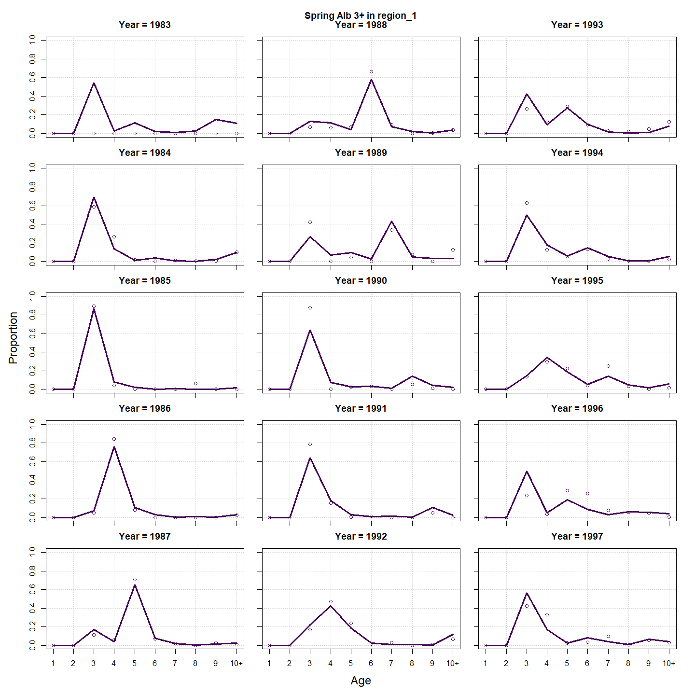

---
output:
  html_document:
    df_print: paged
    keep_md: yes
  word_document: default
  pdf_document:
    fig_caption: yes
    includes:
    keep_tex: yes
    number_sections: no
title: "WHAM figures and tables"
header-includes:
  - \usepackage{longtable}
  - \usepackage{booktabs}
  - \usepackage{caption,graphics}
  - \usepackage{makecell}
  - \usepackage{lscape}
  - \renewcommand\figurename{Fig.}
  - \captionsetup{labelsep=period, singlelinecheck=false}
  - \newcommand{\changesize}[1]{\fontsize{#1pt}{#1pt}\selectfont}
  - \renewcommand{\arraystretch}{1.5}
  - \renewcommand\theadfont{}
---

# {.tabset}

## Figures {.tabset}

### Input

### Diagnostics

### Results

### Retro

### Reference points

### Miscellaneous

## Tables {.tabset}

### Parameter estimates

<table class="table" style="margin-left: auto; margin-right: auto;">
<caption>Parameter estimates, standard errors, and confidence intervals. Rounded to 3 decimal places.</caption>
 <thead>
  <tr>
   <th style="text-align:left;">   </th>
   <th style="text-align:right;"> Estimate </th>
   <th style="text-align:right;"> Std. Error </th>
   <th style="text-align:right;"> 95\% CI lower </th>
   <th style="text-align:right;"> 95\% CI upper </th>
  </tr>
 </thead>
<tbody>
  <tr>
   <td style="text-align:left;"> Combined SSB fully selected q </td>
   <td style="text-align:right;"> $0.002$ </td>
   <td style="text-align:right;"> $3.216\times 10^{-4}$ </td>
   <td style="text-align:right;"> $0.002$ </td>
   <td style="text-align:right;"> $0.003$ </td>
  </tr>
  <tr>
   <td style="text-align:left;"> Spring Big 3+ fully selected q </td>
   <td style="text-align:right;"> $1.054\times 10^{-4}$ </td>
   <td style="text-align:right;"> $1.778\times 10^{-5}$ </td>
   <td style="text-align:right;"> $7.568\times 10^{-5}$ </td>
   <td style="text-align:right;"> $1.467\times 10^{-4}$ </td>
  </tr>
  <tr>
   <td style="text-align:left;"> Spring Alb 3+ fully selected q </td>
   <td style="text-align:right;"> $9.838\times 10^{-6}$ </td>
   <td style="text-align:right;"> $1.440\times 10^{-6}$ </td>
   <td style="text-align:right;"> $7.385\times 10^{-6}$ </td>
   <td style="text-align:right;"> $1.310\times 10^{-5}$ </td>
  </tr>
  <tr>
   <td style="text-align:left;"> Block 1: Combined Selectivity for age 1 </td>
   <td style="text-align:right;"> $0.153$ </td>
   <td style="text-align:right;"> $0.003$ </td>
   <td style="text-align:right;"> $0.147$ </td>
   <td style="text-align:right;"> $0.159$ </td>
  </tr>
  <tr>
   <td style="text-align:left;"> Block 1: Combined Selectivity for age 2 </td>
   <td style="text-align:right;"> $0.415$ </td>
   <td style="text-align:right;"> $0.008$ </td>
   <td style="text-align:right;"> $0.400$ </td>
   <td style="text-align:right;"> $0.430$ </td>
  </tr>
  <tr>
   <td style="text-align:left;"> Block 1: Combined Selectivity for age 3 </td>
   <td style="text-align:right;"> $0.732$ </td>
   <td style="text-align:right;"> $0.014$ </td>
   <td style="text-align:right;"> $0.703$ </td>
   <td style="text-align:right;"> $0.759$ </td>
  </tr>
  <tr>
   <td style="text-align:left;"> Block 1: Combined Selectivity for age 4 </td>
   <td style="text-align:right;"> $0.819$ </td>
   <td style="text-align:right;"> $0.017$ </td>
   <td style="text-align:right;"> $0.783$ </td>
   <td style="text-align:right;"> $0.851$ </td>
  </tr>
  <tr>
   <td style="text-align:left;"> Block 1: Combined Selectivity for age 5 </td>
   <td style="text-align:right;"> $0.882$ </td>
   <td style="text-align:right;"> $0.020$ </td>
   <td style="text-align:right;"> $0.837$ </td>
   <td style="text-align:right;"> $0.917$ </td>
  </tr>
  <tr>
   <td style="text-align:left;"> Block 1: Combined Selectivity for age 6 </td>
   <td style="text-align:right;"> $1.000$ </td>
   <td style="text-align:right;"> -- </td>
   <td style="text-align:right;"> -- </td>
   <td style="text-align:right;"> -- </td>
  </tr>
  <tr>
   <td style="text-align:left;"> Block 1: Combined Selectivity for age 7 </td>
   <td style="text-align:right;"> $1.000$ </td>
   <td style="text-align:right;"> -- </td>
   <td style="text-align:right;"> -- </td>
   <td style="text-align:right;"> -- </td>
  </tr>
  <tr>
   <td style="text-align:left;"> Block 1: Combined Selectivity for age 8 </td>
   <td style="text-align:right;"> $1.000$ </td>
   <td style="text-align:right;"> -- </td>
   <td style="text-align:right;"> -- </td>
   <td style="text-align:right;"> -- </td>
  </tr>
  <tr>
   <td style="text-align:left;"> Block 1: Combined Selectivity for age 9 </td>
   <td style="text-align:right;"> $1.000$ </td>
   <td style="text-align:right;"> -- </td>
   <td style="text-align:right;"> -- </td>
   <td style="text-align:right;"> -- </td>
  </tr>
  <tr>
   <td style="text-align:left;"> Block 1: Combined Selectivity for age 10+ </td>
   <td style="text-align:right;"> $1.000$ </td>
   <td style="text-align:right;"> -- </td>
   <td style="text-align:right;"> -- </td>
   <td style="text-align:right;"> -- </td>
  </tr>
  <tr>
   <td style="text-align:left;"> Block 2: Combined SSB Selectivity for age 1 </td>
   <td style="text-align:right;"> $1.000$ </td>
   <td style="text-align:right;"> -- </td>
   <td style="text-align:right;"> -- </td>
   <td style="text-align:right;"> -- </td>
  </tr>
  <tr>
   <td style="text-align:left;"> Block 2: Combined SSB Selectivity for age 2 </td>
   <td style="text-align:right;"> $1.000$ </td>
   <td style="text-align:right;"> -- </td>
   <td style="text-align:right;"> -- </td>
   <td style="text-align:right;"> -- </td>
  </tr>
  <tr>
   <td style="text-align:left;"> Block 2: Combined SSB Selectivity for age 3 </td>
   <td style="text-align:right;"> $1.000$ </td>
   <td style="text-align:right;"> -- </td>
   <td style="text-align:right;"> -- </td>
   <td style="text-align:right;"> -- </td>
  </tr>
  <tr>
   <td style="text-align:left;"> Block 2: Combined SSB Selectivity for age 4 </td>
   <td style="text-align:right;"> $1.000$ </td>
   <td style="text-align:right;"> -- </td>
   <td style="text-align:right;"> -- </td>
   <td style="text-align:right;"> -- </td>
  </tr>
  <tr>
   <td style="text-align:left;"> Block 2: Combined SSB Selectivity for age 5 </td>
   <td style="text-align:right;"> $1.000$ </td>
   <td style="text-align:right;"> -- </td>
   <td style="text-align:right;"> -- </td>
   <td style="text-align:right;"> -- </td>
  </tr>
  <tr>
   <td style="text-align:left;"> Block 2: Combined SSB Selectivity for age 6 </td>
   <td style="text-align:right;"> $1.000$ </td>
   <td style="text-align:right;"> -- </td>
   <td style="text-align:right;"> -- </td>
   <td style="text-align:right;"> -- </td>
  </tr>
  <tr>
   <td style="text-align:left;"> Block 2: Combined SSB Selectivity for age 7 </td>
   <td style="text-align:right;"> $1.000$ </td>
   <td style="text-align:right;"> -- </td>
   <td style="text-align:right;"> -- </td>
   <td style="text-align:right;"> -- </td>
  </tr>
  <tr>
   <td style="text-align:left;"> Block 2: Combined SSB Selectivity for age 8 </td>
   <td style="text-align:right;"> $1.000$ </td>
   <td style="text-align:right;"> -- </td>
   <td style="text-align:right;"> -- </td>
   <td style="text-align:right;"> -- </td>
  </tr>
  <tr>
   <td style="text-align:left;"> Block 2: Combined SSB Selectivity for age 9 </td>
   <td style="text-align:right;"> $1.000$ </td>
   <td style="text-align:right;"> -- </td>
   <td style="text-align:right;"> -- </td>
   <td style="text-align:right;"> -- </td>
  </tr>
  <tr>
   <td style="text-align:left;"> Block 2: Combined SSB Selectivity for age 10+ </td>
   <td style="text-align:right;"> $1.000$ </td>
   <td style="text-align:right;"> -- </td>
   <td style="text-align:right;"> -- </td>
   <td style="text-align:right;"> -- </td>
  </tr>
  <tr>
   <td style="text-align:left;"> Block 3: Spring Big 3+ Selectivity for age 1 </td>
   <td style="text-align:right;"> $0.000$ </td>
   <td style="text-align:right;"> -- </td>
   <td style="text-align:right;"> -- </td>
   <td style="text-align:right;"> -- </td>
  </tr>
  <tr>
   <td style="text-align:left;"> Block 3: Spring Big 3+ Selectivity for age 2 </td>
   <td style="text-align:right;"> $0.000$ </td>
   <td style="text-align:right;"> -- </td>
   <td style="text-align:right;"> -- </td>
   <td style="text-align:right;"> -- </td>
  </tr>
  <tr>
   <td style="text-align:left;"> Block 3: Spring Big 3+ Selectivity for age 3 </td>
   <td style="text-align:right;"> $1.000$ </td>
   <td style="text-align:right;"> -- </td>
   <td style="text-align:right;"> -- </td>
   <td style="text-align:right;"> -- </td>
  </tr>
  <tr>
   <td style="text-align:left;"> Block 3: Spring Big 3+ Selectivity for age 4 </td>
   <td style="text-align:right;"> $0.557$ </td>
   <td style="text-align:right;"> $0.017$ </td>
   <td style="text-align:right;"> $0.524$ </td>
   <td style="text-align:right;"> $0.589$ </td>
  </tr>
  <tr>
   <td style="text-align:left;"> Block 3: Spring Big 3+ Selectivity for age 5 </td>
   <td style="text-align:right;"> $0.298$ </td>
   <td style="text-align:right;"> $0.019$ </td>
   <td style="text-align:right;"> $0.262$ </td>
   <td style="text-align:right;"> $0.337$ </td>
  </tr>
  <tr>
   <td style="text-align:left;"> Block 3: Spring Big 3+ Selectivity for age 6 </td>
   <td style="text-align:right;"> $0.126$ </td>
   <td style="text-align:right;"> $0.018$ </td>
   <td style="text-align:right;"> $0.095$ </td>
   <td style="text-align:right;"> $0.166$ </td>
  </tr>
  <tr>
   <td style="text-align:left;"> Block 3: Spring Big 3+ Selectivity for age 7 </td>
   <td style="text-align:right;"> $0.300$ </td>
   <td style="text-align:right;"> -- </td>
   <td style="text-align:right;"> -- </td>
   <td style="text-align:right;"> -- </td>
  </tr>
  <tr>
   <td style="text-align:left;"> Block 3: Spring Big 3+ Selectivity for age 8 </td>
   <td style="text-align:right;"> $0.000$ </td>
   <td style="text-align:right;"> -- </td>
   <td style="text-align:right;"> -- </td>
   <td style="text-align:right;"> -- </td>
  </tr>
  <tr>
   <td style="text-align:left;"> Block 3: Spring Big 3+ Selectivity for age 9 </td>
   <td style="text-align:right;"> $0.000$ </td>
   <td style="text-align:right;"> -- </td>
   <td style="text-align:right;"> -- </td>
   <td style="text-align:right;"> -- </td>
  </tr>
  <tr>
   <td style="text-align:left;"> Block 3: Spring Big 3+ Selectivity for age 10+ </td>
   <td style="text-align:right;"> $0.000$ </td>
   <td style="text-align:right;"> -- </td>
   <td style="text-align:right;"> -- </td>
   <td style="text-align:right;"> -- </td>
  </tr>
  <tr>
   <td style="text-align:left;"> Block 4: Spring Alb 3+ Selectivity for age 1 </td>
   <td style="text-align:right;"> $0.000$ </td>
   <td style="text-align:right;"> -- </td>
   <td style="text-align:right;"> -- </td>
   <td style="text-align:right;"> -- </td>
  </tr>
  <tr>
   <td style="text-align:left;"> Block 4: Spring Alb 3+ Selectivity for age 2 </td>
   <td style="text-align:right;"> $0.000$ </td>
   <td style="text-align:right;"> -- </td>
   <td style="text-align:right;"> -- </td>
   <td style="text-align:right;"> -- </td>
  </tr>
  <tr>
   <td style="text-align:left;"> Block 4: Spring Alb 3+ Selectivity for age 3 </td>
   <td style="text-align:right;"> $1.000$ </td>
   <td style="text-align:right;"> -- </td>
   <td style="text-align:right;"> -- </td>
   <td style="text-align:right;"> -- </td>
  </tr>
  <tr>
   <td style="text-align:left;"> Block 4: Spring Alb 3+ Selectivity for age 4 </td>
   <td style="text-align:right;"> $0.628$ </td>
   <td style="text-align:right;"> $0.011$ </td>
   <td style="text-align:right;"> $0.606$ </td>
   <td style="text-align:right;"> $0.649$ </td>
  </tr>
  <tr>
   <td style="text-align:left;"> Block 4: Spring Alb 3+ Selectivity for age 5 </td>
   <td style="text-align:right;"> $0.625$ </td>
   <td style="text-align:right;"> $0.013$ </td>
   <td style="text-align:right;"> $0.598$ </td>
   <td style="text-align:right;"> $0.650$ </td>
  </tr>
  <tr>
   <td style="text-align:left;"> Block 4: Spring Alb 3+ Selectivity for age 6 </td>
   <td style="text-align:right;"> $0.529$ </td>
   <td style="text-align:right;"> $0.014$ </td>
   <td style="text-align:right;"> $0.502$ </td>
   <td style="text-align:right;"> $0.557$ </td>
  </tr>
  <tr>
   <td style="text-align:left;"> Block 4: Spring Alb 3+ Selectivity for age 7 </td>
   <td style="text-align:right;"> $0.502$ </td>
   <td style="text-align:right;"> $0.016$ </td>
   <td style="text-align:right;"> $0.471$ </td>
   <td style="text-align:right;"> $0.534$ </td>
  </tr>
  <tr>
   <td style="text-align:left;"> Block 4: Spring Alb 3+ Selectivity for age 8 </td>
   <td style="text-align:right;"> $0.416$ </td>
   <td style="text-align:right;"> $0.018$ </td>
   <td style="text-align:right;"> $0.382$ </td>
   <td style="text-align:right;"> $0.451$ </td>
  </tr>
  <tr>
   <td style="text-align:left;"> Block 4: Spring Alb 3+ Selectivity for age 9 </td>
   <td style="text-align:right;"> $0.908$ </td>
   <td style="text-align:right;"> $0.041$ </td>
   <td style="text-align:right;"> $0.791$ </td>
   <td style="text-align:right;"> $0.963$ </td>
  </tr>
  <tr>
   <td style="text-align:left;"> Block 4: Spring Alb 3+ Selectivity for age 10+ </td>
   <td style="text-align:right;"> $0.847$ </td>
   <td style="text-align:right;"> $0.043$ </td>
   <td style="text-align:right;"> $0.744$ </td>
   <td style="text-align:right;"> $0.913$ </td>
  </tr>
</tbody>
</table>

### Abundance at age

<table class="table" style="margin-left: auto; margin-right: auto;">
<caption>Abundance at age (1000s) for stock 1 in region 1.</caption>
 <thead>
  <tr>
   <th style="text-align:left;">   </th>
   <th style="text-align:right;"> 1 </th>
   <th style="text-align:right;"> 2 </th>
   <th style="text-align:right;"> 3 </th>
   <th style="text-align:right;"> 4 </th>
   <th style="text-align:right;"> 5 </th>
   <th style="text-align:right;"> 6 </th>
   <th style="text-align:right;"> 7 </th>
   <th style="text-align:right;"> 8 </th>
   <th style="text-align:right;"> 9 </th>
   <th style="text-align:right;"> 10+ </th>
  </tr>
 </thead>
<tbody>
  <tr>
   <td style="text-align:left;"> 1968 </td>
   <td style="text-align:right;"> 4432905 </td>
   <td style="text-align:right;"> 1234861 </td>
   <td style="text-align:right;"> 426332 </td>
   <td style="text-align:right;"> 153021 </td>
   <td style="text-align:right;"> 66682 </td>
   <td style="text-align:right;"> 40223 </td>
   <td style="text-align:right;"> 23302 </td>
   <td style="text-align:right;"> 12605 </td>
   <td style="text-align:right;"> 69003 </td>
   <td style="text-align:right;"> 913 </td>
  </tr>
  <tr>
   <td style="text-align:left;"> 1969 </td>
   <td style="text-align:right;"> 1251207 </td>
   <td style="text-align:right;"> 3508929 </td>
   <td style="text-align:right;"> 922565 </td>
   <td style="text-align:right;"> 296964 </td>
   <td style="text-align:right;"> 104557 </td>
   <td style="text-align:right;"> 44933 </td>
   <td style="text-align:right;"> 26409 </td>
   <td style="text-align:right;"> 15300 </td>
   <td style="text-align:right;"> 8276 </td>
   <td style="text-align:right;"> 45906 </td>
  </tr>
  <tr>
   <td style="text-align:left;"> 1970 </td>
   <td style="text-align:right;"> 2575243 </td>
   <td style="text-align:right;"> 990649 </td>
   <td style="text-align:right;"> 2623234 </td>
   <td style="text-align:right;"> 643360 </td>
   <td style="text-align:right;"> 203172 </td>
   <td style="text-align:right;"> 70553 </td>
   <td style="text-align:right;"> 29549 </td>
   <td style="text-align:right;"> 17367 </td>
   <td style="text-align:right;"> 10061 </td>
   <td style="text-align:right;"> 35631 </td>
  </tr>
  <tr>
   <td style="text-align:left;"> 1971 </td>
   <td style="text-align:right;"> 575034 </td>
   <td style="text-align:right;"> 2007101 </td>
   <td style="text-align:right;"> 709617 </td>
   <td style="text-align:right;"> 1696431 </td>
   <td style="text-align:right;"> 404535 </td>
   <td style="text-align:right;"> 125184 </td>
   <td style="text-align:right;"> 41855 </td>
   <td style="text-align:right;"> 17530 </td>
   <td style="text-align:right;"> 10303 </td>
   <td style="text-align:right;"> 27107 </td>
  </tr>
  <tr>
   <td style="text-align:left;"> 1972 </td>
   <td style="text-align:right;"> 814867 </td>
   <td style="text-align:right;"> 441297 </td>
   <td style="text-align:right;"> 1378661 </td>
   <td style="text-align:right;"> 426158 </td>
   <td style="text-align:right;"> 981878 </td>
   <td style="text-align:right;"> 227978 </td>
   <td style="text-align:right;"> 67124 </td>
   <td style="text-align:right;"> 22443 </td>
   <td style="text-align:right;"> 9399 </td>
   <td style="text-align:right;"> 20059 </td>
  </tr>
  <tr>
   <td style="text-align:left;"> 1973 </td>
   <td style="text-align:right;"> 467693 </td>
   <td style="text-align:right;"> 596654 </td>
   <td style="text-align:right;"> 266848 </td>
   <td style="text-align:right;"> 661143 </td>
   <td style="text-align:right;"> 191756 </td>
   <td style="text-align:right;"> 421931 </td>
   <td style="text-align:right;"> 89904 </td>
   <td style="text-align:right;"> 26470 </td>
   <td style="text-align:right;"> 8850 </td>
   <td style="text-align:right;"> 11617 </td>
  </tr>
  <tr>
   <td style="text-align:left;"> 1974 </td>
   <td style="text-align:right;"> 746990 </td>
   <td style="text-align:right;"> 341654 </td>
   <td style="text-align:right;"> 358523 </td>
   <td style="text-align:right;"> 126552 </td>
   <td style="text-align:right;"> 293810 </td>
   <td style="text-align:right;"> 81304 </td>
   <td style="text-align:right;"> 163881 </td>
   <td style="text-align:right;"> 34919 </td>
   <td style="text-align:right;"> 10281 </td>
   <td style="text-align:right;"> 7950 </td>
  </tr>
  <tr>
   <td style="text-align:left;"> 1975 </td>
   <td style="text-align:right;"> 857137 </td>
   <td style="text-align:right;"> 554819 </td>
   <td style="text-align:right;"> 214755 </td>
   <td style="text-align:right;"> 184099 </td>
   <td style="text-align:right;"> 61473 </td>
   <td style="text-align:right;"> 137101 </td>
   <td style="text-align:right;"> 35201 </td>
   <td style="text-align:right;"> 70953 </td>
   <td style="text-align:right;"> 15118 </td>
   <td style="text-align:right;"> 7893 </td>
  </tr>
  <tr>
   <td style="text-align:left;"> 1976 </td>
   <td style="text-align:right;"> 168455 </td>
   <td style="text-align:right;"> 644108 </td>
   <td style="text-align:right;"> 359974 </td>
   <td style="text-align:right;"> 116620 </td>
   <td style="text-align:right;"> 95203 </td>
   <td style="text-align:right;"> 30685 </td>
   <td style="text-align:right;"> 64071 </td>
   <td style="text-align:right;"> 16450 </td>
   <td style="text-align:right;"> 33158 </td>
   <td style="text-align:right;"> 10754 </td>
  </tr>
  <tr>
   <td style="text-align:left;"> 1977 </td>
   <td style="text-align:right;"> 37764 </td>
   <td style="text-align:right;"> 125188 </td>
   <td style="text-align:right;"> 405483 </td>
   <td style="text-align:right;"> 185338 </td>
   <td style="text-align:right;"> 56817 </td>
   <td style="text-align:right;"> 44568 </td>
   <td style="text-align:right;"> 13334 </td>
   <td style="text-align:right;"> 27841 </td>
   <td style="text-align:right;"> 7148 </td>
   <td style="text-align:right;"> 19081 </td>
  </tr>
  <tr>
   <td style="text-align:left;"> 1978 </td>
   <td style="text-align:right;"> 50340 </td>
   <td style="text-align:right;"> 29242 </td>
   <td style="text-align:right;"> 88104 </td>
   <td style="text-align:right;"> 254178 </td>
   <td style="text-align:right;"> 112544 </td>
   <td style="text-align:right;"> 33717 </td>
   <td style="text-align:right;"> 25338 </td>
   <td style="text-align:right;"> 7581 </td>
   <td style="text-align:right;"> 15828 </td>
   <td style="text-align:right;"> 14912 </td>
  </tr>
  <tr>
   <td style="text-align:left;"> 1979 </td>
   <td style="text-align:right;"> 148051 </td>
   <td style="text-align:right;"> 40324 </td>
   <td style="text-align:right;"> 22561 </td>
   <td style="text-align:right;"> 64959 </td>
   <td style="text-align:right;"> 185082 </td>
   <td style="text-align:right;"> 81214 </td>
   <td style="text-align:right;"> 23925 </td>
   <td style="text-align:right;"> 17980 </td>
   <td style="text-align:right;"> 5379 </td>
   <td style="text-align:right;"> 21813 </td>
  </tr>
  <tr>
   <td style="text-align:left;"> 1980 </td>
   <td style="text-align:right;"> 25800 </td>
   <td style="text-align:right;"> 117448 </td>
   <td style="text-align:right;"> 30305 </td>
   <td style="text-align:right;"> 15881 </td>
   <td style="text-align:right;"> 44909 </td>
   <td style="text-align:right;"> 126301 </td>
   <td style="text-align:right;"> 54092 </td>
   <td style="text-align:right;"> 15935 </td>
   <td style="text-align:right;"> 11975 </td>
   <td style="text-align:right;"> 18111 </td>
  </tr>
  <tr>
   <td style="text-align:left;"> 1981 </td>
   <td style="text-align:right;"> 228223 </td>
   <td style="text-align:right;"> 20623 </td>
   <td style="text-align:right;"> 90100 </td>
   <td style="text-align:right;"> 22119 </td>
   <td style="text-align:right;"> 11434 </td>
   <td style="text-align:right;"> 32015 </td>
   <td style="text-align:right;"> 88393 </td>
   <td style="text-align:right;"> 37857 </td>
   <td style="text-align:right;"> 11153 </td>
   <td style="text-align:right;"> 21056 </td>
  </tr>
  <tr>
   <td style="text-align:left;"> 1982 </td>
   <td style="text-align:right;"> 538550 </td>
   <td style="text-align:right;"> 181893 </td>
   <td style="text-align:right;"> 15696 </td>
   <td style="text-align:right;"> 64849 </td>
   <td style="text-align:right;"> 15678 </td>
   <td style="text-align:right;"> 8015 </td>
   <td style="text-align:right;"> 21982 </td>
   <td style="text-align:right;"> 60692 </td>
   <td style="text-align:right;"> 25993 </td>
   <td style="text-align:right;"> 22115 </td>
  </tr>
  <tr>
   <td style="text-align:left;"> 1983 </td>
   <td style="text-align:right;"> 2812531 </td>
   <td style="text-align:right;"> 430199 </td>
   <td style="text-align:right;"> 139293 </td>
   <td style="text-align:right;"> 11421 </td>
   <td style="text-align:right;"> 46528 </td>
   <td style="text-align:right;"> 11135 </td>
   <td style="text-align:right;"> 5585 </td>
   <td style="text-align:right;"> 15319 </td>
   <td style="text-align:right;"> 42296 </td>
   <td style="text-align:right;"> 33527 </td>
  </tr>
  <tr>
   <td style="text-align:left;"> 1984 </td>
   <td style="text-align:right;"> 120387 </td>
   <td style="text-align:right;"> 2253711 </td>
   <td style="text-align:right;"> 332252 </td>
   <td style="text-align:right;"> 102882 </td>
   <td style="text-align:right;"> 8333 </td>
   <td style="text-align:right;"> 33647 </td>
   <td style="text-align:right;"> 7920 </td>
   <td style="text-align:right;"> 3973 </td>
   <td style="text-align:right;"> 10897 </td>
   <td style="text-align:right;"> 53933 </td>
  </tr>
  <tr>
   <td style="text-align:left;"> 1985 </td>
   <td style="text-align:right;"> 242538 </td>
   <td style="text-align:right;"> 96775 </td>
   <td style="text-align:right;"> 1755669 </td>
   <td style="text-align:right;"> 249166 </td>
   <td style="text-align:right;"> 76352 </td>
   <td style="text-align:right;"> 6137 </td>
   <td style="text-align:right;"> 24436 </td>
   <td style="text-align:right;"> 5752 </td>
   <td style="text-align:right;"> 2885 </td>
   <td style="text-align:right;"> 47082 </td>
  </tr>
  <tr>
   <td style="text-align:left;"> 1986 </td>
   <td style="text-align:right;"> 120769 </td>
   <td style="text-align:right;"> 193520 </td>
   <td style="text-align:right;"> 73880 </td>
   <td style="text-align:right;"> 1270471 </td>
   <td style="text-align:right;"> 177675 </td>
   <td style="text-align:right;"> 53870 </td>
   <td style="text-align:right;"> 4245 </td>
   <td style="text-align:right;"> 16902 </td>
   <td style="text-align:right;"> 3979 </td>
   <td style="text-align:right;"> 34562 </td>
  </tr>
  <tr>
   <td style="text-align:left;"> 1987 </td>
   <td style="text-align:right;"> 206951 </td>
   <td style="text-align:right;"> 96659 </td>
   <td style="text-align:right;"> 148980 </td>
   <td style="text-align:right;"> 54259 </td>
   <td style="text-align:right;"> 921071 </td>
   <td style="text-align:right;"> 127612 </td>
   <td style="text-align:right;"> 38022 </td>
   <td style="text-align:right;"> 2996 </td>
   <td style="text-align:right;"> 11930 </td>
   <td style="text-align:right;"> 27202 </td>
  </tr>
  <tr>
   <td style="text-align:left;"> 1988 </td>
   <td style="text-align:right;"> 721489 </td>
   <td style="text-align:right;"> 164045 </td>
   <td style="text-align:right;"> 72490 </td>
   <td style="text-align:right;"> 104474 </td>
   <td style="text-align:right;"> 37355 </td>
   <td style="text-align:right;"> 625710 </td>
   <td style="text-align:right;"> 84562 </td>
   <td style="text-align:right;"> 25195 </td>
   <td style="text-align:right;"> 1985 </td>
   <td style="text-align:right;"> 25931 </td>
  </tr>
  <tr>
   <td style="text-align:left;"> 1989 </td>
   <td style="text-align:right;"> 792840 </td>
   <td style="text-align:right;"> 569501 </td>
   <td style="text-align:right;"> 121626 </td>
   <td style="text-align:right;"> 49818 </td>
   <td style="text-align:right;"> 70317 </td>
   <td style="text-align:right;"> 24766 </td>
   <td style="text-align:right;"> 403341 </td>
   <td style="text-align:right;"> 54510 </td>
   <td style="text-align:right;"> 16241 </td>
   <td style="text-align:right;"> 17995 </td>
  </tr>
  <tr>
   <td style="text-align:left;"> 1990 </td>
   <td style="text-align:right;"> 130281 </td>
   <td style="text-align:right;"> 616347 </td>
   <td style="text-align:right;"> 405120 </td>
   <td style="text-align:right;"> 77697 </td>
   <td style="text-align:right;"> 30898 </td>
   <td style="text-align:right;"> 42690 </td>
   <td style="text-align:right;"> 14448 </td>
   <td style="text-align:right;"> 235311 </td>
   <td style="text-align:right;"> 31801 </td>
   <td style="text-align:right;"> 19973 </td>
  </tr>
  <tr>
   <td style="text-align:left;"> 1991 </td>
   <td style="text-align:right;"> 202658 </td>
   <td style="text-align:right;"> 88679 </td>
   <td style="text-align:right;"> 305745 </td>
   <td style="text-align:right;"> 136970 </td>
   <td style="text-align:right;"> 23644 </td>
   <td style="text-align:right;"> 8713 </td>
   <td style="text-align:right;"> 10445 </td>
   <td style="text-align:right;"> 3535 </td>
   <td style="text-align:right;"> 57573 </td>
   <td style="text-align:right;"> 12668 </td>
  </tr>
  <tr>
   <td style="text-align:left;"> 1992 </td>
   <td style="text-align:right;"> 213833 </td>
   <td style="text-align:right;"> 156873 </td>
   <td style="text-align:right;"> 62356 </td>
   <td style="text-align:right;"> 191361 </td>
   <td style="text-align:right;"> 83029 </td>
   <td style="text-align:right;"> 14005 </td>
   <td style="text-align:right;"> 4943 </td>
   <td style="text-align:right;"> 5926 </td>
   <td style="text-align:right;"> 2006 </td>
   <td style="text-align:right;"> 39850 </td>
  </tr>
  <tr>
   <td style="text-align:left;"> 1993 </td>
   <td style="text-align:right;"> 35250 </td>
   <td style="text-align:right;"> 166381 </td>
   <td style="text-align:right;"> 111865 </td>
   <td style="text-align:right;"> 40005 </td>
   <td style="text-align:right;"> 119257 </td>
   <td style="text-align:right;"> 50670 </td>
   <td style="text-align:right;"> 8219 </td>
   <td style="text-align:right;"> 2901 </td>
   <td style="text-align:right;"> 3477 </td>
   <td style="text-align:right;"> 24562 </td>
  </tr>
  <tr>
   <td style="text-align:left;"> 1994 </td>
   <td style="text-align:right;"> 135408 </td>
   <td style="text-align:right;"> 26592 </td>
   <td style="text-align:right;"> 109090 </td>
   <td style="text-align:right;"> 61883 </td>
   <td style="text-align:right;"> 21121 </td>
   <td style="text-align:right;"> 60875 </td>
   <td style="text-align:right;"> 24286 </td>
   <td style="text-align:right;"> 3939 </td>
   <td style="text-align:right;"> 1390 </td>
   <td style="text-align:right;"> 13439 </td>
  </tr>
  <tr>
   <td style="text-align:left;"> 1995 </td>
   <td style="text-align:right;"> 181113 </td>
   <td style="text-align:right;"> 105707 </td>
   <td style="text-align:right;"> 19133 </td>
   <td style="text-align:right;"> 71100 </td>
   <td style="text-align:right;"> 39252 </td>
   <td style="text-align:right;"> 13137 </td>
   <td style="text-align:right;"> 36501 </td>
   <td style="text-align:right;"> 14562 </td>
   <td style="text-align:right;"> 2362 </td>
   <td style="text-align:right;"> 8892 </td>
  </tr>
  <tr>
   <td style="text-align:left;"> 1996 </td>
   <td style="text-align:right;"> 215548 </td>
   <td style="text-align:right;"> 143154 </td>
   <td style="text-align:right;"> 78662 </td>
   <td style="text-align:right;"> 13234 </td>
   <td style="text-align:right;"> 48204 </td>
   <td style="text-align:right;"> 26228 </td>
   <td style="text-align:right;"> 8544 </td>
   <td style="text-align:right;"> 23738 </td>
   <td style="text-align:right;"> 9471 </td>
   <td style="text-align:right;"> 7319 </td>
  </tr>
  <tr>
   <td style="text-align:left;"> 1997 </td>
   <td style="text-align:right;"> 281191 </td>
   <td style="text-align:right;"> 166180 </td>
   <td style="text-align:right;"> 99566 </td>
   <td style="text-align:right;"> 48292 </td>
   <td style="text-align:right;"> 7851 </td>
   <td style="text-align:right;"> 27896 </td>
   <td style="text-align:right;"> 14493 </td>
   <td style="text-align:right;"> 4721 </td>
   <td style="text-align:right;"> 13117 </td>
   <td style="text-align:right;"> 9277 </td>
  </tr>
  <tr>
   <td style="text-align:left;"> 1998 </td>
   <td style="text-align:right;"> 129823 </td>
   <td style="text-align:right;"> 209286 </td>
   <td style="text-align:right;"> 105047 </td>
   <td style="text-align:right;"> 51638 </td>
   <td style="text-align:right;"> 23720 </td>
   <td style="text-align:right;"> 3708 </td>
   <td style="text-align:right;"> 12243 </td>
   <td style="text-align:right;"> 6361 </td>
   <td style="text-align:right;"> 2072 </td>
   <td style="text-align:right;"> 9828 </td>
  </tr>
  <tr>
   <td style="text-align:left;"> 1999 </td>
   <td style="text-align:right;"> 181065 </td>
   <td style="text-align:right;"> 97283 </td>
   <td style="text-align:right;"> 134753 </td>
   <td style="text-align:right;"> 56280 </td>
   <td style="text-align:right;"> 26303 </td>
   <td style="text-align:right;"> 11650 </td>
   <td style="text-align:right;"> 1701 </td>
   <td style="text-align:right;"> 5617 </td>
   <td style="text-align:right;"> 2918 </td>
   <td style="text-align:right;"> 5460 </td>
  </tr>
  <tr>
   <td style="text-align:left;"> 2000 </td>
   <td style="text-align:right;"> 1077769 </td>
   <td style="text-align:right;"> 121288 </td>
   <td style="text-align:right;"> 46206 </td>
   <td style="text-align:right;"> 42195 </td>
   <td style="text-align:right;"> 15717 </td>
   <td style="text-align:right;"> 6762 </td>
   <td style="text-align:right;"> 2567 </td>
   <td style="text-align:right;"> 375 </td>
   <td style="text-align:right;"> 1238 </td>
   <td style="text-align:right;"> 1846 </td>
  </tr>
  <tr>
   <td style="text-align:left;"> 2001 </td>
   <td style="text-align:right;"> 177632 </td>
   <td style="text-align:right;"> 822864 </td>
   <td style="text-align:right;"> 82157 </td>
   <td style="text-align:right;"> 27073 </td>
   <td style="text-align:right;"> 23758 </td>
   <td style="text-align:right;"> 8598 </td>
   <td style="text-align:right;"> 3506 </td>
   <td style="text-align:right;"> 1331 </td>
   <td style="text-align:right;"> 194 </td>
   <td style="text-align:right;"> 1599 </td>
  </tr>
  <tr>
   <td style="text-align:left;"> 2002 </td>
   <td style="text-align:right;"> 145089 </td>
   <td style="text-align:right;"> 136142 </td>
   <td style="text-align:right;"> 563226 </td>
   <td style="text-align:right;"> 49032 </td>
   <td style="text-align:right;"> 15561 </td>
   <td style="text-align:right;"> 13289 </td>
   <td style="text-align:right;"> 4571 </td>
   <td style="text-align:right;"> 1864 </td>
   <td style="text-align:right;"> 708 </td>
   <td style="text-align:right;"> 953 </td>
  </tr>
  <tr>
   <td style="text-align:left;"> 2003 </td>
   <td style="text-align:right;"> 345746 </td>
   <td style="text-align:right;"> 112962 </td>
   <td style="text-align:right;"> 97246 </td>
   <td style="text-align:right;"> 362425 </td>
   <td style="text-align:right;"> 30659 </td>
   <td style="text-align:right;"> 9530 </td>
   <td style="text-align:right;"> 7830 </td>
   <td style="text-align:right;"> 2694 </td>
   <td style="text-align:right;"> 1098 </td>
   <td style="text-align:right;"> 979 </td>
  </tr>
  <tr>
   <td style="text-align:left;"> 2004 </td>
   <td style="text-align:right;"> 803199 </td>
   <td style="text-align:right;"> 265784 </td>
   <td style="text-align:right;"> 77949 </td>
   <td style="text-align:right;"> 58875 </td>
   <td style="text-align:right;"> 211675 </td>
   <td style="text-align:right;"> 17447 </td>
   <td style="text-align:right;"> 5167 </td>
   <td style="text-align:right;"> 4245 </td>
   <td style="text-align:right;"> 1460 </td>
   <td style="text-align:right;"> 1126 </td>
  </tr>
  <tr>
   <td style="text-align:left;"> 2005 </td>
   <td style="text-align:right;"> 198459 </td>
   <td style="text-align:right;"> 587984 </td>
   <td style="text-align:right;"> 160623 </td>
   <td style="text-align:right;"> 37342 </td>
   <td style="text-align:right;"> 26461 </td>
   <td style="text-align:right;"> 90848 </td>
   <td style="text-align:right;"> 6871 </td>
   <td style="text-align:right;"> 2035 </td>
   <td style="text-align:right;"> 1672 </td>
   <td style="text-align:right;"> 1018 </td>
  </tr>
  <tr>
   <td style="text-align:left;"> 2006 </td>
   <td style="text-align:right;"> 374353 </td>
   <td style="text-align:right;"> 140376 </td>
   <td style="text-align:right;"> 323715 </td>
   <td style="text-align:right;"> 65275 </td>
   <td style="text-align:right;"> 13961 </td>
   <td style="text-align:right;"> 9314 </td>
   <td style="text-align:right;"> 28576 </td>
   <td style="text-align:right;"> 2161 </td>
   <td style="text-align:right;"> 640 </td>
   <td style="text-align:right;"> 846 </td>
  </tr>
  <tr>
   <td style="text-align:left;"> 2007 </td>
   <td style="text-align:right;"> 85094 </td>
   <td style="text-align:right;"> 263196 </td>
   <td style="text-align:right;"> 76028 </td>
   <td style="text-align:right;"> 127801 </td>
   <td style="text-align:right;"> 23627 </td>
   <td style="text-align:right;"> 4746 </td>
   <td style="text-align:right;"> 2816 </td>
   <td style="text-align:right;"> 8641 </td>
   <td style="text-align:right;"> 653 </td>
   <td style="text-align:right;"> 449 </td>
  </tr>
  <tr>
   <td style="text-align:left;"> 2008 </td>
   <td style="text-align:right;"> 153597 </td>
   <td style="text-align:right;"> 50851 </td>
   <td style="text-align:right;"> 91708 </td>
   <td style="text-align:right;"> 13779 </td>
   <td style="text-align:right;"> 19356 </td>
   <td style="text-align:right;"> 3143 </td>
   <td style="text-align:right;"> 496 </td>
   <td style="text-align:right;"> 294 </td>
   <td style="text-align:right;"> 902 </td>
   <td style="text-align:right;"> 115 </td>
  </tr>
  <tr>
   <td style="text-align:left;"> 2009 </td>
   <td style="text-align:right;"> 159992 </td>
   <td style="text-align:right;"> 103907 </td>
   <td style="text-align:right;"> 24806 </td>
   <td style="text-align:right;"> 30103 </td>
   <td style="text-align:right;"> 4057 </td>
   <td style="text-align:right;"> 5268 </td>
   <td style="text-align:right;"> 739 </td>
   <td style="text-align:right;"> 116 </td>
   <td style="text-align:right;"> 69 </td>
   <td style="text-align:right;"> 239 </td>
  </tr>
  <tr>
   <td style="text-align:left;"> 2010 </td>
   <td style="text-align:right;"> 36574 </td>
   <td style="text-align:right;"> 104981 </td>
   <td style="text-align:right;"> 46661 </td>
   <td style="text-align:right;"> 7036 </td>
   <td style="text-align:right;"> 7526 </td>
   <td style="text-align:right;"> 926 </td>
   <td style="text-align:right;"> 1014 </td>
   <td style="text-align:right;"> 142 </td>
   <td style="text-align:right;"> 22 </td>
   <td style="text-align:right;"> 59 </td>
  </tr>
  <tr>
   <td style="text-align:left;"> 2011 </td>
   <td style="text-align:right;"> 192062 </td>
   <td style="text-align:right;"> 23479 </td>
   <td style="text-align:right;"> 44427 </td>
   <td style="text-align:right;"> 11918 </td>
   <td style="text-align:right;"> 1564 </td>
   <td style="text-align:right;"> 1514 </td>
   <td style="text-align:right;"> 154 </td>
   <td style="text-align:right;"> 169 </td>
   <td style="text-align:right;"> 24 </td>
   <td style="text-align:right;"> 14 </td>
  </tr>
  <tr>
   <td style="text-align:left;"> 2012 </td>
   <td style="text-align:right;"> 102356 </td>
   <td style="text-align:right;"> 137083 </td>
   <td style="text-align:right;"> 13247 </td>
   <td style="text-align:right;"> 18852 </td>
   <td style="text-align:right;"> 4677 </td>
   <td style="text-align:right;"> 580 </td>
   <td style="text-align:right;"> 505 </td>
   <td style="text-align:right;"> 52 </td>
   <td style="text-align:right;"> 56 </td>
   <td style="text-align:right;"> 12 </td>
  </tr>
  <tr>
   <td style="text-align:left;"> 2013 </td>
   <td style="text-align:right;"> 31185 </td>
   <td style="text-align:right;"> 55360 </td>
   <td style="text-align:right;"> 36440 </td>
   <td style="text-align:right;"> 1489 </td>
   <td style="text-align:right;"> 1673 </td>
   <td style="text-align:right;"> 350 </td>
   <td style="text-align:right;"> 32 </td>
   <td style="text-align:right;"> 27 </td>
   <td style="text-align:right;"> 3 </td>
   <td style="text-align:right;"> 4 </td>
  </tr>
  <tr>
   <td style="text-align:left;"> 2014 </td>
   <td style="text-align:right;"> 75711 </td>
   <td style="text-align:right;"> 18535 </td>
   <td style="text-align:right;"> 19007 </td>
   <td style="text-align:right;"> 6435 </td>
   <td style="text-align:right;"> 219 </td>
   <td style="text-align:right;"> 216 </td>
   <td style="text-align:right;"> 35 </td>
   <td style="text-align:right;"> 3 </td>
   <td style="text-align:right;"> 3 </td>
   <td style="text-align:right;"> 1 </td>
  </tr>
  <tr>
   <td style="text-align:left;"> 2015 </td>
   <td style="text-align:right;"> 139888 </td>
   <td style="text-align:right;"> 54091 </td>
   <td style="text-align:right;"> 10485 </td>
   <td style="text-align:right;"> 8104 </td>
   <td style="text-align:right;"> 2538 </td>
   <td style="text-align:right;"> 82 </td>
   <td style="text-align:right;"> 72 </td>
   <td style="text-align:right;"> 12 </td>
   <td style="text-align:right;"> 1 </td>
   <td style="text-align:right;"> 1 </td>
  </tr>
  <tr>
   <td style="text-align:left;"> 2016 </td>
   <td style="text-align:right;"> 342277 </td>
   <td style="text-align:right;"> 98108 </td>
   <td style="text-align:right;"> 29100 </td>
   <td style="text-align:right;"> 4091 </td>
   <td style="text-align:right;"> 2894 </td>
   <td style="text-align:right;"> 851 </td>
   <td style="text-align:right;"> 24 </td>
   <td style="text-align:right;"> 22 </td>
   <td style="text-align:right;"> 4 </td>
   <td style="text-align:right;"> 1 </td>
  </tr>
  <tr>
   <td style="text-align:left;"> 2017 </td>
   <td style="text-align:right;"> 21658 </td>
   <td style="text-align:right;"> 237261 </td>
   <td style="text-align:right;"> 51132 </td>
   <td style="text-align:right;"> 10735 </td>
   <td style="text-align:right;"> 1372 </td>
   <td style="text-align:right;"> 907 </td>
   <td style="text-align:right;"> 234 </td>
   <td style="text-align:right;"> 7 </td>
   <td style="text-align:right;"> 6 </td>
   <td style="text-align:right;"> 1 </td>
  </tr>
  <tr>
   <td style="text-align:left;"> 2018 </td>
   <td style="text-align:right;"> 95917 </td>
   <td style="text-align:right;"> 15226 </td>
   <td style="text-align:right;"> 128479 </td>
   <td style="text-align:right;"> 20181 </td>
   <td style="text-align:right;"> 3884 </td>
   <td style="text-align:right;"> 466 </td>
   <td style="text-align:right;"> 274 </td>
   <td style="text-align:right;"> 71 </td>
   <td style="text-align:right;"> 2 </td>
   <td style="text-align:right;"> 2 </td>
  </tr>
  <tr>
   <td style="text-align:left;"> 2019 </td>
   <td style="text-align:right;"> 40774 </td>
   <td style="text-align:right;"> 66726 </td>
   <td style="text-align:right;"> 8013 </td>
   <td style="text-align:right;"> 48214 </td>
   <td style="text-align:right;"> 6901 </td>
   <td style="text-align:right;"> 1242 </td>
   <td style="text-align:right;"> 132 </td>
   <td style="text-align:right;"> 77 </td>
   <td style="text-align:right;"> 20 </td>
   <td style="text-align:right;"> 1 </td>
  </tr>
  <tr>
   <td style="text-align:left;"> 2020 </td>
   <td style="text-align:right;"> 33763 </td>
   <td style="text-align:right;"> 28211 </td>
   <td style="text-align:right;"> 34601 </td>
   <td style="text-align:right;"> 2930 </td>
   <td style="text-align:right;"> 16015 </td>
   <td style="text-align:right;"> 2139 </td>
   <td style="text-align:right;"> 338 </td>
   <td style="text-align:right;"> 36 </td>
   <td style="text-align:right;"> 21 </td>
   <td style="text-align:right;"> 6 </td>
  </tr>
  <tr>
   <td style="text-align:left;"> 2021 </td>
   <td style="text-align:right;"> 21121 </td>
   <td style="text-align:right;"> 22008 </td>
   <td style="text-align:right;"> 12444 </td>
   <td style="text-align:right;"> 9509 </td>
   <td style="text-align:right;"> 707 </td>
   <td style="text-align:right;"> 3518 </td>
   <td style="text-align:right;"> 394 </td>
   <td style="text-align:right;"> 62 </td>
   <td style="text-align:right;"> 7 </td>
   <td style="text-align:right;"> 5 </td>
  </tr>
  <tr>
   <td style="text-align:left;"> 2022 </td>
   <td style="text-align:right;"> 36779 </td>
   <td style="text-align:right;"> 10193 </td>
   <td style="text-align:right;"> 4295 </td>
   <td style="text-align:right;"> 811 </td>
   <td style="text-align:right;"> 458 </td>
   <td style="text-align:right;"> 27 </td>
   <td style="text-align:right;"> 91 </td>
   <td style="text-align:right;"> 10 </td>
   <td style="text-align:right;"> 2 </td>
   <td style="text-align:right;"> 0 </td>
  </tr>
</tbody>
</table>

### Fishing mortality at age by region

<table class="table" style="margin-left: auto; margin-right: auto;">
<caption>Total fishing mortality at age in region 1.</caption>
 <thead>
  <tr>
   <th style="text-align:left;">   </th>
   <th style="text-align:right;"> 1 </th>
   <th style="text-align:right;"> 2 </th>
   <th style="text-align:right;"> 3 </th>
   <th style="text-align:right;"> 4 </th>
   <th style="text-align:right;"> 5 </th>
   <th style="text-align:right;"> 6 </th>
   <th style="text-align:right;"> 7 </th>
   <th style="text-align:right;"> 8 </th>
   <th style="text-align:right;"> 9 </th>
   <th style="text-align:right;"> 10+ </th>
  </tr>
 </thead>
<tbody>
  <tr>
   <td style="text-align:left;"> 1968 </td>
   <td style="text-align:right;"> 0.034 </td>
   <td style="text-align:right;"> 0.092 </td>
   <td style="text-align:right;"> 0.162 </td>
   <td style="text-align:right;"> 0.181 </td>
   <td style="text-align:right;"> 0.195 </td>
   <td style="text-align:right;"> 0.221 </td>
   <td style="text-align:right;"> 0.221 </td>
   <td style="text-align:right;"> 0.221 </td>
   <td style="text-align:right;"> 0.221 </td>
   <td style="text-align:right;"> 0.221 </td>
  </tr>
  <tr>
   <td style="text-align:left;"> 1969 </td>
   <td style="text-align:right;"> 0.034 </td>
   <td style="text-align:right;"> 0.091 </td>
   <td style="text-align:right;"> 0.160 </td>
   <td style="text-align:right;"> 0.180 </td>
   <td style="text-align:right;"> 0.193 </td>
   <td style="text-align:right;"> 0.219 </td>
   <td style="text-align:right;"> 0.219 </td>
   <td style="text-align:right;"> 0.219 </td>
   <td style="text-align:right;"> 0.219 </td>
   <td style="text-align:right;"> 0.219 </td>
  </tr>
  <tr>
   <td style="text-align:left;"> 1970 </td>
   <td style="text-align:right;"> 0.049 </td>
   <td style="text-align:right;"> 0.134 </td>
   <td style="text-align:right;"> 0.236 </td>
   <td style="text-align:right;"> 0.264 </td>
   <td style="text-align:right;"> 0.284 </td>
   <td style="text-align:right;"> 0.322 </td>
   <td style="text-align:right;"> 0.322 </td>
   <td style="text-align:right;"> 0.322 </td>
   <td style="text-align:right;"> 0.322 </td>
   <td style="text-align:right;"> 0.322 </td>
  </tr>
  <tr>
   <td style="text-align:left;"> 1971 </td>
   <td style="text-align:right;"> 0.065 </td>
   <td style="text-align:right;"> 0.176 </td>
   <td style="text-align:right;"> 0.310 </td>
   <td style="text-align:right;"> 0.347 </td>
   <td style="text-align:right;"> 0.373 </td>
   <td style="text-align:right;"> 0.423 </td>
   <td style="text-align:right;"> 0.423 </td>
   <td style="text-align:right;"> 0.423 </td>
   <td style="text-align:right;"> 0.423 </td>
   <td style="text-align:right;"> 0.423 </td>
  </tr>
  <tr>
   <td style="text-align:left;"> 1972 </td>
   <td style="text-align:right;"> 0.112 </td>
   <td style="text-align:right;"> 0.303 </td>
   <td style="text-align:right;"> 0.535 </td>
   <td style="text-align:right;"> 0.599 </td>
   <td style="text-align:right;"> 0.645 </td>
   <td style="text-align:right;"> 0.731 </td>
   <td style="text-align:right;"> 0.731 </td>
   <td style="text-align:right;"> 0.731 </td>
   <td style="text-align:right;"> 0.731 </td>
   <td style="text-align:right;"> 0.731 </td>
  </tr>
  <tr>
   <td style="text-align:left;"> 1973 </td>
   <td style="text-align:right;"> 0.114 </td>
   <td style="text-align:right;"> 0.309 </td>
   <td style="text-align:right;"> 0.546 </td>
   <td style="text-align:right;"> 0.611 </td>
   <td style="text-align:right;"> 0.658 </td>
   <td style="text-align:right;"> 0.746 </td>
   <td style="text-align:right;"> 0.746 </td>
   <td style="text-align:right;"> 0.746 </td>
   <td style="text-align:right;"> 0.746 </td>
   <td style="text-align:right;"> 0.746 </td>
  </tr>
  <tr>
   <td style="text-align:left;"> 1974 </td>
   <td style="text-align:right;"> 0.097 </td>
   <td style="text-align:right;"> 0.264 </td>
   <td style="text-align:right;"> 0.467 </td>
   <td style="text-align:right;"> 0.522 </td>
   <td style="text-align:right;"> 0.562 </td>
   <td style="text-align:right;"> 0.637 </td>
   <td style="text-align:right;"> 0.637 </td>
   <td style="text-align:right;"> 0.637 </td>
   <td style="text-align:right;"> 0.637 </td>
   <td style="text-align:right;"> 0.637 </td>
  </tr>
  <tr>
   <td style="text-align:left;"> 1975 </td>
   <td style="text-align:right;"> 0.086 </td>
   <td style="text-align:right;"> 0.233 </td>
   <td style="text-align:right;"> 0.411 </td>
   <td style="text-align:right;"> 0.459 </td>
   <td style="text-align:right;"> 0.495 </td>
   <td style="text-align:right;"> 0.561 </td>
   <td style="text-align:right;"> 0.561 </td>
   <td style="text-align:right;"> 0.561 </td>
   <td style="text-align:right;"> 0.561 </td>
   <td style="text-align:right;"> 0.561 </td>
  </tr>
  <tr>
   <td style="text-align:left;"> 1976 </td>
   <td style="text-align:right;"> 0.097 </td>
   <td style="text-align:right;"> 0.263 </td>
   <td style="text-align:right;"> 0.464 </td>
   <td style="text-align:right;"> 0.519 </td>
   <td style="text-align:right;"> 0.559 </td>
   <td style="text-align:right;"> 0.633 </td>
   <td style="text-align:right;"> 0.633 </td>
   <td style="text-align:right;"> 0.633 </td>
   <td style="text-align:right;"> 0.633 </td>
   <td style="text-align:right;"> 0.633 </td>
  </tr>
  <tr>
   <td style="text-align:left;"> 1977 </td>
   <td style="text-align:right;"> 0.056 </td>
   <td style="text-align:right;"> 0.151 </td>
   <td style="text-align:right;"> 0.267 </td>
   <td style="text-align:right;"> 0.299 </td>
   <td style="text-align:right;"> 0.322 </td>
   <td style="text-align:right;"> 0.365 </td>
   <td style="text-align:right;"> 0.365 </td>
   <td style="text-align:right;"> 0.365 </td>
   <td style="text-align:right;"> 0.365 </td>
   <td style="text-align:right;"> 0.365 </td>
  </tr>
  <tr>
   <td style="text-align:left;"> 1978 </td>
   <td style="text-align:right;"> 0.022 </td>
   <td style="text-align:right;"> 0.059 </td>
   <td style="text-align:right;"> 0.105 </td>
   <td style="text-align:right;"> 0.117 </td>
   <td style="text-align:right;"> 0.126 </td>
   <td style="text-align:right;"> 0.143 </td>
   <td style="text-align:right;"> 0.143 </td>
   <td style="text-align:right;"> 0.143 </td>
   <td style="text-align:right;"> 0.143 </td>
   <td style="text-align:right;"> 0.143 </td>
  </tr>
  <tr>
   <td style="text-align:left;"> 1979 </td>
   <td style="text-align:right;"> 0.032 </td>
   <td style="text-align:right;"> 0.086 </td>
   <td style="text-align:right;"> 0.151 </td>
   <td style="text-align:right;"> 0.169 </td>
   <td style="text-align:right;"> 0.182 </td>
   <td style="text-align:right;"> 0.206 </td>
   <td style="text-align:right;"> 0.206 </td>
   <td style="text-align:right;"> 0.206 </td>
   <td style="text-align:right;"> 0.206 </td>
   <td style="text-align:right;"> 0.206 </td>
  </tr>
  <tr>
   <td style="text-align:left;"> 1980 </td>
   <td style="text-align:right;"> 0.024 </td>
   <td style="text-align:right;"> 0.065 </td>
   <td style="text-align:right;"> 0.115 </td>
   <td style="text-align:right;"> 0.129 </td>
   <td style="text-align:right;"> 0.138 </td>
   <td style="text-align:right;"> 0.157 </td>
   <td style="text-align:right;"> 0.157 </td>
   <td style="text-align:right;"> 0.157 </td>
   <td style="text-align:right;"> 0.157 </td>
   <td style="text-align:right;"> 0.157 </td>
  </tr>
  <tr>
   <td style="text-align:left;"> 1981 </td>
   <td style="text-align:right;"> 0.027 </td>
   <td style="text-align:right;"> 0.073 </td>
   <td style="text-align:right;"> 0.129 </td>
   <td style="text-align:right;"> 0.144 </td>
   <td style="text-align:right;"> 0.155 </td>
   <td style="text-align:right;"> 0.176 </td>
   <td style="text-align:right;"> 0.176 </td>
   <td style="text-align:right;"> 0.176 </td>
   <td style="text-align:right;"> 0.176 </td>
   <td style="text-align:right;"> 0.176 </td>
  </tr>
  <tr>
   <td style="text-align:left;"> 1982 </td>
   <td style="text-align:right;"> 0.025 </td>
   <td style="text-align:right;"> 0.067 </td>
   <td style="text-align:right;"> 0.118 </td>
   <td style="text-align:right;"> 0.132 </td>
   <td style="text-align:right;"> 0.142 </td>
   <td style="text-align:right;"> 0.161 </td>
   <td style="text-align:right;"> 0.161 </td>
   <td style="text-align:right;"> 0.161 </td>
   <td style="text-align:right;"> 0.161 </td>
   <td style="text-align:right;"> 0.161 </td>
  </tr>
  <tr>
   <td style="text-align:left;"> 1983 </td>
   <td style="text-align:right;"> 0.022 </td>
   <td style="text-align:right;"> 0.058 </td>
   <td style="text-align:right;"> 0.103 </td>
   <td style="text-align:right;"> 0.115 </td>
   <td style="text-align:right;"> 0.124 </td>
   <td style="text-align:right;"> 0.141 </td>
   <td style="text-align:right;"> 0.141 </td>
   <td style="text-align:right;"> 0.141 </td>
   <td style="text-align:right;"> 0.141 </td>
   <td style="text-align:right;"> 0.141 </td>
  </tr>
  <tr>
   <td style="text-align:left;"> 1984 </td>
   <td style="text-align:right;"> 0.018 </td>
   <td style="text-align:right;"> 0.050 </td>
   <td style="text-align:right;"> 0.088 </td>
   <td style="text-align:right;"> 0.098 </td>
   <td style="text-align:right;"> 0.106 </td>
   <td style="text-align:right;"> 0.120 </td>
   <td style="text-align:right;"> 0.120 </td>
   <td style="text-align:right;"> 0.120 </td>
   <td style="text-align:right;"> 0.120 </td>
   <td style="text-align:right;"> 0.120 </td>
  </tr>
  <tr>
   <td style="text-align:left;"> 1985 </td>
   <td style="text-align:right;"> 0.026 </td>
   <td style="text-align:right;"> 0.070 </td>
   <td style="text-align:right;"> 0.123 </td>
   <td style="text-align:right;"> 0.138 </td>
   <td style="text-align:right;"> 0.149 </td>
   <td style="text-align:right;"> 0.169 </td>
   <td style="text-align:right;"> 0.169 </td>
   <td style="text-align:right;"> 0.169 </td>
   <td style="text-align:right;"> 0.169 </td>
   <td style="text-align:right;"> 0.169 </td>
  </tr>
  <tr>
   <td style="text-align:left;"> 1986 </td>
   <td style="text-align:right;"> 0.023 </td>
   <td style="text-align:right;"> 0.062 </td>
   <td style="text-align:right;"> 0.109 </td>
   <td style="text-align:right;"> 0.122 </td>
   <td style="text-align:right;"> 0.131 </td>
   <td style="text-align:right;"> 0.148 </td>
   <td style="text-align:right;"> 0.148 </td>
   <td style="text-align:right;"> 0.148 </td>
   <td style="text-align:right;"> 0.148 </td>
   <td style="text-align:right;"> 0.148 </td>
  </tr>
  <tr>
   <td style="text-align:left;"> 1987 </td>
   <td style="text-align:right;"> 0.032 </td>
   <td style="text-align:right;"> 0.088 </td>
   <td style="text-align:right;"> 0.155 </td>
   <td style="text-align:right;"> 0.173 </td>
   <td style="text-align:right;"> 0.187 </td>
   <td style="text-align:right;"> 0.212 </td>
   <td style="text-align:right;"> 0.212 </td>
   <td style="text-align:right;"> 0.212 </td>
   <td style="text-align:right;"> 0.212 </td>
   <td style="text-align:right;"> 0.212 </td>
  </tr>
  <tr>
   <td style="text-align:left;"> 1988 </td>
   <td style="text-align:right;"> 0.037 </td>
   <td style="text-align:right;"> 0.099 </td>
   <td style="text-align:right;"> 0.175 </td>
   <td style="text-align:right;"> 0.196 </td>
   <td style="text-align:right;"> 0.211 </td>
   <td style="text-align:right;"> 0.239 </td>
   <td style="text-align:right;"> 0.239 </td>
   <td style="text-align:right;"> 0.239 </td>
   <td style="text-align:right;"> 0.239 </td>
   <td style="text-align:right;"> 0.239 </td>
  </tr>
  <tr>
   <td style="text-align:left;"> 1989 </td>
   <td style="text-align:right;"> 0.052 </td>
   <td style="text-align:right;"> 0.141 </td>
   <td style="text-align:right;"> 0.248 </td>
   <td style="text-align:right;"> 0.278 </td>
   <td style="text-align:right;"> 0.299 </td>
   <td style="text-align:right;"> 0.339 </td>
   <td style="text-align:right;"> 0.339 </td>
   <td style="text-align:right;"> 0.339 </td>
   <td style="text-align:right;"> 0.339 </td>
   <td style="text-align:right;"> 0.339 </td>
  </tr>
  <tr>
   <td style="text-align:left;"> 1990 </td>
   <td style="text-align:right;"> 0.185 </td>
   <td style="text-align:right;"> 0.501 </td>
   <td style="text-align:right;"> 0.884 </td>
   <td style="text-align:right;"> 0.990 </td>
   <td style="text-align:right;"> 1.066 </td>
   <td style="text-align:right;"> 1.208 </td>
   <td style="text-align:right;"> 1.208 </td>
   <td style="text-align:right;"> 1.208 </td>
   <td style="text-align:right;"> 1.208 </td>
   <td style="text-align:right;"> 1.208 </td>
  </tr>
  <tr>
   <td style="text-align:left;"> 1991 </td>
   <td style="text-align:right;"> 0.056 </td>
   <td style="text-align:right;"> 0.152 </td>
   <td style="text-align:right;"> 0.269 </td>
   <td style="text-align:right;"> 0.301 </td>
   <td style="text-align:right;"> 0.324 </td>
   <td style="text-align:right;"> 0.367 </td>
   <td style="text-align:right;"> 0.367 </td>
   <td style="text-align:right;"> 0.367 </td>
   <td style="text-align:right;"> 0.367 </td>
   <td style="text-align:right;"> 0.367 </td>
  </tr>
  <tr>
   <td style="text-align:left;"> 1992 </td>
   <td style="text-align:right;"> 0.051 </td>
   <td style="text-align:right;"> 0.138 </td>
   <td style="text-align:right;"> 0.244 </td>
   <td style="text-align:right;"> 0.273 </td>
   <td style="text-align:right;"> 0.294 </td>
   <td style="text-align:right;"> 0.333 </td>
   <td style="text-align:right;"> 0.333 </td>
   <td style="text-align:right;"> 0.333 </td>
   <td style="text-align:right;"> 0.333 </td>
   <td style="text-align:right;"> 0.333 </td>
  </tr>
  <tr>
   <td style="text-align:left;"> 1993 </td>
   <td style="text-align:right;"> 0.082 </td>
   <td style="text-align:right;"> 0.222 </td>
   <td style="text-align:right;"> 0.392 </td>
   <td style="text-align:right;"> 0.439 </td>
   <td style="text-align:right;"> 0.472 </td>
   <td style="text-align:right;"> 0.535 </td>
   <td style="text-align:right;"> 0.535 </td>
   <td style="text-align:right;"> 0.535 </td>
   <td style="text-align:right;"> 0.535 </td>
   <td style="text-align:right;"> 0.535 </td>
  </tr>
  <tr>
   <td style="text-align:left;"> 1994 </td>
   <td style="text-align:right;"> 0.048 </td>
   <td style="text-align:right;"> 0.129 </td>
   <td style="text-align:right;"> 0.228 </td>
   <td style="text-align:right;"> 0.255 </td>
   <td style="text-align:right;"> 0.275 </td>
   <td style="text-align:right;"> 0.311 </td>
   <td style="text-align:right;"> 0.311 </td>
   <td style="text-align:right;"> 0.311 </td>
   <td style="text-align:right;"> 0.311 </td>
   <td style="text-align:right;"> 0.311 </td>
  </tr>
  <tr>
   <td style="text-align:left;"> 1995 </td>
   <td style="text-align:right;"> 0.035 </td>
   <td style="text-align:right;"> 0.096 </td>
   <td style="text-align:right;"> 0.169 </td>
   <td style="text-align:right;"> 0.189 </td>
   <td style="text-align:right;"> 0.203 </td>
   <td style="text-align:right;"> 0.230 </td>
   <td style="text-align:right;"> 0.230 </td>
   <td style="text-align:right;"> 0.230 </td>
   <td style="text-align:right;"> 0.230 </td>
   <td style="text-align:right;"> 0.230 </td>
  </tr>
  <tr>
   <td style="text-align:left;"> 1996 </td>
   <td style="text-align:right;"> 0.060 </td>
   <td style="text-align:right;"> 0.163 </td>
   <td style="text-align:right;"> 0.288 </td>
   <td style="text-align:right;"> 0.322 </td>
   <td style="text-align:right;"> 0.347 </td>
   <td style="text-align:right;"> 0.393 </td>
   <td style="text-align:right;"> 0.393 </td>
   <td style="text-align:right;"> 0.393 </td>
   <td style="text-align:right;"> 0.393 </td>
   <td style="text-align:right;"> 0.393 </td>
  </tr>
  <tr>
   <td style="text-align:left;"> 1997 </td>
   <td style="text-align:right;"> 0.095 </td>
   <td style="text-align:right;"> 0.259 </td>
   <td style="text-align:right;"> 0.457 </td>
   <td style="text-align:right;"> 0.511 </td>
   <td style="text-align:right;"> 0.550 </td>
   <td style="text-align:right;"> 0.624 </td>
   <td style="text-align:right;"> 0.624 </td>
   <td style="text-align:right;"> 0.624 </td>
   <td style="text-align:right;"> 0.624 </td>
   <td style="text-align:right;"> 0.624 </td>
  </tr>
  <tr>
   <td style="text-align:left;"> 1998 </td>
   <td style="text-align:right;"> 0.089 </td>
   <td style="text-align:right;"> 0.240 </td>
   <td style="text-align:right;"> 0.424 </td>
   <td style="text-align:right;"> 0.475 </td>
   <td style="text-align:right;"> 0.511 </td>
   <td style="text-align:right;"> 0.579 </td>
   <td style="text-align:right;"> 0.579 </td>
   <td style="text-align:right;"> 0.579 </td>
   <td style="text-align:right;"> 0.579 </td>
   <td style="text-align:right;"> 0.579 </td>
  </tr>
  <tr>
   <td style="text-align:left;"> 1999 </td>
   <td style="text-align:right;"> 0.201 </td>
   <td style="text-align:right;"> 0.545 </td>
   <td style="text-align:right;"> 0.961 </td>
   <td style="text-align:right;"> 1.076 </td>
   <td style="text-align:right;"> 1.158 </td>
   <td style="text-align:right;"> 1.313 </td>
   <td style="text-align:right;"> 1.313 </td>
   <td style="text-align:right;"> 1.313 </td>
   <td style="text-align:right;"> 1.313 </td>
   <td style="text-align:right;"> 1.313 </td>
  </tr>
  <tr>
   <td style="text-align:left;"> 2000 </td>
   <td style="text-align:right;"> 0.070 </td>
   <td style="text-align:right;"> 0.190 </td>
   <td style="text-align:right;"> 0.335 </td>
   <td style="text-align:right;"> 0.374 </td>
   <td style="text-align:right;"> 0.403 </td>
   <td style="text-align:right;"> 0.457 </td>
   <td style="text-align:right;"> 0.457 </td>
   <td style="text-align:right;"> 0.457 </td>
   <td style="text-align:right;"> 0.457 </td>
   <td style="text-align:right;"> 0.457 </td>
  </tr>
  <tr>
   <td style="text-align:left;"> 2001 </td>
   <td style="text-align:right;"> 0.066 </td>
   <td style="text-align:right;"> 0.179 </td>
   <td style="text-align:right;"> 0.316 </td>
   <td style="text-align:right;"> 0.354 </td>
   <td style="text-align:right;"> 0.381 </td>
   <td style="text-align:right;"> 0.432 </td>
   <td style="text-align:right;"> 0.432 </td>
   <td style="text-align:right;"> 0.432 </td>
   <td style="text-align:right;"> 0.432 </td>
   <td style="text-align:right;"> 0.432 </td>
  </tr>
  <tr>
   <td style="text-align:left;"> 2002 </td>
   <td style="text-align:right;"> 0.050 </td>
   <td style="text-align:right;"> 0.136 </td>
   <td style="text-align:right;"> 0.241 </td>
   <td style="text-align:right;"> 0.270 </td>
   <td style="text-align:right;"> 0.290 </td>
   <td style="text-align:right;"> 0.329 </td>
   <td style="text-align:right;"> 0.329 </td>
   <td style="text-align:right;"> 0.329 </td>
   <td style="text-align:right;"> 0.329 </td>
   <td style="text-align:right;"> 0.329 </td>
  </tr>
  <tr>
   <td style="text-align:left;"> 2003 </td>
   <td style="text-align:right;"> 0.063 </td>
   <td style="text-align:right;"> 0.171 </td>
   <td style="text-align:right;"> 0.302 </td>
   <td style="text-align:right;"> 0.338 </td>
   <td style="text-align:right;"> 0.364 </td>
   <td style="text-align:right;"> 0.412 </td>
   <td style="text-align:right;"> 0.412 </td>
   <td style="text-align:right;"> 0.412 </td>
   <td style="text-align:right;"> 0.412 </td>
   <td style="text-align:right;"> 0.412 </td>
  </tr>
  <tr>
   <td style="text-align:left;"> 2004 </td>
   <td style="text-align:right;"> 0.112 </td>
   <td style="text-align:right;"> 0.304 </td>
   <td style="text-align:right;"> 0.536 </td>
   <td style="text-align:right;"> 0.600 </td>
   <td style="text-align:right;"> 0.646 </td>
   <td style="text-align:right;"> 0.732 </td>
   <td style="text-align:right;"> 0.732 </td>
   <td style="text-align:right;"> 0.732 </td>
   <td style="text-align:right;"> 0.732 </td>
   <td style="text-align:right;"> 0.732 </td>
  </tr>
  <tr>
   <td style="text-align:left;"> 2005 </td>
   <td style="text-align:right;"> 0.146 </td>
   <td style="text-align:right;"> 0.397 </td>
   <td style="text-align:right;"> 0.700 </td>
   <td style="text-align:right;"> 0.784 </td>
   <td style="text-align:right;"> 0.844 </td>
   <td style="text-align:right;"> 0.957 </td>
   <td style="text-align:right;"> 0.957 </td>
   <td style="text-align:right;"> 0.957 </td>
   <td style="text-align:right;"> 0.957 </td>
   <td style="text-align:right;"> 0.957 </td>
  </tr>
  <tr>
   <td style="text-align:left;"> 2006 </td>
   <td style="text-align:right;"> 0.152 </td>
   <td style="text-align:right;"> 0.413 </td>
   <td style="text-align:right;"> 0.729 </td>
   <td style="text-align:right;"> 0.816 </td>
   <td style="text-align:right;"> 0.879 </td>
   <td style="text-align:right;"> 0.996 </td>
   <td style="text-align:right;"> 0.996 </td>
   <td style="text-align:right;"> 0.996 </td>
   <td style="text-align:right;"> 0.996 </td>
   <td style="text-align:right;"> 0.996 </td>
  </tr>
  <tr>
   <td style="text-align:left;"> 2007 </td>
   <td style="text-align:right;"> 0.315 </td>
   <td style="text-align:right;"> 0.854 </td>
   <td style="text-align:right;"> 1.508 </td>
   <td style="text-align:right;"> 1.687 </td>
   <td style="text-align:right;"> 1.817 </td>
   <td style="text-align:right;"> 2.059 </td>
   <td style="text-align:right;"> 2.059 </td>
   <td style="text-align:right;"> 2.059 </td>
   <td style="text-align:right;"> 2.059 </td>
   <td style="text-align:right;"> 2.059 </td>
  </tr>
  <tr>
   <td style="text-align:left;"> 2008 </td>
   <td style="text-align:right;"> 0.191 </td>
   <td style="text-align:right;"> 0.518 </td>
   <td style="text-align:right;"> 0.914 </td>
   <td style="text-align:right;"> 1.023 </td>
   <td style="text-align:right;"> 1.101 </td>
   <td style="text-align:right;"> 1.248 </td>
   <td style="text-align:right;"> 1.248 </td>
   <td style="text-align:right;"> 1.248 </td>
   <td style="text-align:right;"> 1.248 </td>
   <td style="text-align:right;"> 1.248 </td>
  </tr>
  <tr>
   <td style="text-align:left;"> 2009 </td>
   <td style="text-align:right;"> 0.221 </td>
   <td style="text-align:right;"> 0.601 </td>
   <td style="text-align:right;"> 1.060 </td>
   <td style="text-align:right;"> 1.186 </td>
   <td style="text-align:right;"> 1.278 </td>
   <td style="text-align:right;"> 1.448 </td>
   <td style="text-align:right;"> 1.448 </td>
   <td style="text-align:right;"> 1.448 </td>
   <td style="text-align:right;"> 1.448 </td>
   <td style="text-align:right;"> 1.448 </td>
  </tr>
  <tr>
   <td style="text-align:left;"> 2010 </td>
   <td style="text-align:right;"> 0.243 </td>
   <td style="text-align:right;"> 0.660 </td>
   <td style="text-align:right;"> 1.165 </td>
   <td style="text-align:right;"> 1.304 </td>
   <td style="text-align:right;"> 1.404 </td>
   <td style="text-align:right;"> 1.591 </td>
   <td style="text-align:right;"> 1.591 </td>
   <td style="text-align:right;"> 1.591 </td>
   <td style="text-align:right;"> 1.591 </td>
   <td style="text-align:right;"> 1.591 </td>
  </tr>
  <tr>
   <td style="text-align:left;"> 2011 </td>
   <td style="text-align:right;"> 0.137 </td>
   <td style="text-align:right;"> 0.372 </td>
   <td style="text-align:right;"> 0.657 </td>
   <td style="text-align:right;"> 0.735 </td>
   <td style="text-align:right;"> 0.792 </td>
   <td style="text-align:right;"> 0.898 </td>
   <td style="text-align:right;"> 0.898 </td>
   <td style="text-align:right;"> 0.898 </td>
   <td style="text-align:right;"> 0.898 </td>
   <td style="text-align:right;"> 0.898 </td>
  </tr>
  <tr>
   <td style="text-align:left;"> 2012 </td>
   <td style="text-align:right;"> 0.415 </td>
   <td style="text-align:right;"> 1.125 </td>
   <td style="text-align:right;"> 1.986 </td>
   <td style="text-align:right;"> 2.222 </td>
   <td style="text-align:right;"> 2.393 </td>
   <td style="text-align:right;"> 2.712 </td>
   <td style="text-align:right;"> 2.712 </td>
   <td style="text-align:right;"> 2.712 </td>
   <td style="text-align:right;"> 2.712 </td>
   <td style="text-align:right;"> 2.712 </td>
  </tr>
  <tr>
   <td style="text-align:left;"> 2013 </td>
   <td style="text-align:right;"> 0.320 </td>
   <td style="text-align:right;"> 0.869 </td>
   <td style="text-align:right;"> 1.534 </td>
   <td style="text-align:right;"> 1.717 </td>
   <td style="text-align:right;"> 1.849 </td>
   <td style="text-align:right;"> 2.095 </td>
   <td style="text-align:right;"> 2.095 </td>
   <td style="text-align:right;"> 2.095 </td>
   <td style="text-align:right;"> 2.095 </td>
   <td style="text-align:right;"> 2.095 </td>
  </tr>
  <tr>
   <td style="text-align:left;"> 2014 </td>
   <td style="text-align:right;"> 0.136 </td>
   <td style="text-align:right;"> 0.370 </td>
   <td style="text-align:right;"> 0.653 </td>
   <td style="text-align:right;"> 0.730 </td>
   <td style="text-align:right;"> 0.786 </td>
   <td style="text-align:right;"> 0.891 </td>
   <td style="text-align:right;"> 0.891 </td>
   <td style="text-align:right;"> 0.891 </td>
   <td style="text-align:right;"> 0.891 </td>
   <td style="text-align:right;"> 0.891 </td>
  </tr>
  <tr>
   <td style="text-align:left;"> 2015 </td>
   <td style="text-align:right;"> 0.155 </td>
   <td style="text-align:right;"> 0.420 </td>
   <td style="text-align:right;"> 0.741 </td>
   <td style="text-align:right;"> 0.830 </td>
   <td style="text-align:right;"> 0.893 </td>
   <td style="text-align:right;"> 1.012 </td>
   <td style="text-align:right;"> 1.012 </td>
   <td style="text-align:right;"> 1.012 </td>
   <td style="text-align:right;"> 1.012 </td>
   <td style="text-align:right;"> 1.012 </td>
  </tr>
  <tr>
   <td style="text-align:left;"> 2016 </td>
   <td style="text-align:right;"> 0.166 </td>
   <td style="text-align:right;"> 0.452 </td>
   <td style="text-align:right;"> 0.797 </td>
   <td style="text-align:right;"> 0.892 </td>
   <td style="text-align:right;"> 0.961 </td>
   <td style="text-align:right;"> 1.089 </td>
   <td style="text-align:right;"> 1.089 </td>
   <td style="text-align:right;"> 1.089 </td>
   <td style="text-align:right;"> 1.089 </td>
   <td style="text-align:right;"> 1.089 </td>
  </tr>
  <tr>
   <td style="text-align:left;"> 2017 </td>
   <td style="text-align:right;"> 0.152 </td>
   <td style="text-align:right;"> 0.413 </td>
   <td style="text-align:right;"> 0.730 </td>
   <td style="text-align:right;"> 0.817 </td>
   <td style="text-align:right;"> 0.879 </td>
   <td style="text-align:right;"> 0.997 </td>
   <td style="text-align:right;"> 0.997 </td>
   <td style="text-align:right;"> 0.997 </td>
   <td style="text-align:right;"> 0.997 </td>
   <td style="text-align:right;"> 0.997 </td>
  </tr>
  <tr>
   <td style="text-align:left;"> 2018 </td>
   <td style="text-align:right;"> 0.163 </td>
   <td style="text-align:right;"> 0.442 </td>
   <td style="text-align:right;"> 0.780 </td>
   <td style="text-align:right;"> 0.873 </td>
   <td style="text-align:right;"> 0.940 </td>
   <td style="text-align:right;"> 1.065 </td>
   <td style="text-align:right;"> 1.065 </td>
   <td style="text-align:right;"> 1.065 </td>
   <td style="text-align:right;"> 1.065 </td>
   <td style="text-align:right;"> 1.065 </td>
  </tr>
  <tr>
   <td style="text-align:left;"> 2019 </td>
   <td style="text-align:right;"> 0.168 </td>
   <td style="text-align:right;"> 0.457 </td>
   <td style="text-align:right;"> 0.806 </td>
   <td style="text-align:right;"> 0.902 </td>
   <td style="text-align:right;"> 0.971 </td>
   <td style="text-align:right;"> 1.101 </td>
   <td style="text-align:right;"> 1.101 </td>
   <td style="text-align:right;"> 1.101 </td>
   <td style="text-align:right;"> 1.101 </td>
   <td style="text-align:right;"> 1.101 </td>
  </tr>
  <tr>
   <td style="text-align:left;"> 2020 </td>
   <td style="text-align:right;"> 0.228 </td>
   <td style="text-align:right;"> 0.618 </td>
   <td style="text-align:right;"> 1.092 </td>
   <td style="text-align:right;"> 1.222 </td>
   <td style="text-align:right;"> 1.316 </td>
   <td style="text-align:right;"> 1.491 </td>
   <td style="text-align:right;"> 1.491 </td>
   <td style="text-align:right;"> 1.491 </td>
   <td style="text-align:right;"> 1.491 </td>
   <td style="text-align:right;"> 1.491 </td>
  </tr>
  <tr>
   <td style="text-align:left;"> 2021 </td>
   <td style="text-align:right;"> 0.529 </td>
   <td style="text-align:right;"> 1.434 </td>
   <td style="text-align:right;"> 2.531 </td>
   <td style="text-align:right;"> 2.833 </td>
   <td style="text-align:right;"> 3.050 </td>
   <td style="text-align:right;"> 3.457 </td>
   <td style="text-align:right;"> 3.457 </td>
   <td style="text-align:right;"> 3.457 </td>
   <td style="text-align:right;"> 3.457 </td>
   <td style="text-align:right;"> 3.457 </td>
  </tr>
  <tr>
   <td style="text-align:left;"> 2022 </td>
   <td style="text-align:right;"> 0.295 </td>
   <td style="text-align:right;"> 0.800 </td>
   <td style="text-align:right;"> 1.412 </td>
   <td style="text-align:right;"> 1.581 </td>
   <td style="text-align:right;"> 1.702 </td>
   <td style="text-align:right;"> 1.929 </td>
   <td style="text-align:right;"> 1.929 </td>
   <td style="text-align:right;"> 1.929 </td>
   <td style="text-align:right;"> 1.929 </td>
   <td style="text-align:right;"> 1.929 </td>
  </tr>
</tbody>
</table>

### Fishing mortality at age by fleet

<table class="table" style="margin-left: auto; margin-right: auto;">
<caption>Total fishing mortality at age in Combined.</caption>
 <thead>
  <tr>
   <th style="text-align:left;">   </th>
   <th style="text-align:right;"> 1 </th>
   <th style="text-align:right;"> 2 </th>
   <th style="text-align:right;"> 3 </th>
   <th style="text-align:right;"> 4 </th>
   <th style="text-align:right;"> 5 </th>
   <th style="text-align:right;"> 6 </th>
   <th style="text-align:right;"> 7 </th>
   <th style="text-align:right;"> 8 </th>
   <th style="text-align:right;"> 9 </th>
   <th style="text-align:right;"> 10+ </th>
  </tr>
 </thead>
<tbody>
  <tr>
   <td style="text-align:left;"> 1968 </td>
   <td style="text-align:right;"> 0.034 </td>
   <td style="text-align:right;"> 0.092 </td>
   <td style="text-align:right;"> 0.162 </td>
   <td style="text-align:right;"> 0.181 </td>
   <td style="text-align:right;"> 0.195 </td>
   <td style="text-align:right;"> 0.221 </td>
   <td style="text-align:right;"> 0.221 </td>
   <td style="text-align:right;"> 0.221 </td>
   <td style="text-align:right;"> 0.221 </td>
   <td style="text-align:right;"> 0.221 </td>
  </tr>
  <tr>
   <td style="text-align:left;"> 1969 </td>
   <td style="text-align:right;"> 0.034 </td>
   <td style="text-align:right;"> 0.091 </td>
   <td style="text-align:right;"> 0.160 </td>
   <td style="text-align:right;"> 0.180 </td>
   <td style="text-align:right;"> 0.193 </td>
   <td style="text-align:right;"> 0.219 </td>
   <td style="text-align:right;"> 0.219 </td>
   <td style="text-align:right;"> 0.219 </td>
   <td style="text-align:right;"> 0.219 </td>
   <td style="text-align:right;"> 0.219 </td>
  </tr>
  <tr>
   <td style="text-align:left;"> 1970 </td>
   <td style="text-align:right;"> 0.049 </td>
   <td style="text-align:right;"> 0.134 </td>
   <td style="text-align:right;"> 0.236 </td>
   <td style="text-align:right;"> 0.264 </td>
   <td style="text-align:right;"> 0.284 </td>
   <td style="text-align:right;"> 0.322 </td>
   <td style="text-align:right;"> 0.322 </td>
   <td style="text-align:right;"> 0.322 </td>
   <td style="text-align:right;"> 0.322 </td>
   <td style="text-align:right;"> 0.322 </td>
  </tr>
  <tr>
   <td style="text-align:left;"> 1971 </td>
   <td style="text-align:right;"> 0.065 </td>
   <td style="text-align:right;"> 0.176 </td>
   <td style="text-align:right;"> 0.310 </td>
   <td style="text-align:right;"> 0.347 </td>
   <td style="text-align:right;"> 0.373 </td>
   <td style="text-align:right;"> 0.423 </td>
   <td style="text-align:right;"> 0.423 </td>
   <td style="text-align:right;"> 0.423 </td>
   <td style="text-align:right;"> 0.423 </td>
   <td style="text-align:right;"> 0.423 </td>
  </tr>
  <tr>
   <td style="text-align:left;"> 1972 </td>
   <td style="text-align:right;"> 0.112 </td>
   <td style="text-align:right;"> 0.303 </td>
   <td style="text-align:right;"> 0.535 </td>
   <td style="text-align:right;"> 0.599 </td>
   <td style="text-align:right;"> 0.645 </td>
   <td style="text-align:right;"> 0.731 </td>
   <td style="text-align:right;"> 0.731 </td>
   <td style="text-align:right;"> 0.731 </td>
   <td style="text-align:right;"> 0.731 </td>
   <td style="text-align:right;"> 0.731 </td>
  </tr>
  <tr>
   <td style="text-align:left;"> 1973 </td>
   <td style="text-align:right;"> 0.114 </td>
   <td style="text-align:right;"> 0.309 </td>
   <td style="text-align:right;"> 0.546 </td>
   <td style="text-align:right;"> 0.611 </td>
   <td style="text-align:right;"> 0.658 </td>
   <td style="text-align:right;"> 0.746 </td>
   <td style="text-align:right;"> 0.746 </td>
   <td style="text-align:right;"> 0.746 </td>
   <td style="text-align:right;"> 0.746 </td>
   <td style="text-align:right;"> 0.746 </td>
  </tr>
  <tr>
   <td style="text-align:left;"> 1974 </td>
   <td style="text-align:right;"> 0.097 </td>
   <td style="text-align:right;"> 0.264 </td>
   <td style="text-align:right;"> 0.467 </td>
   <td style="text-align:right;"> 0.522 </td>
   <td style="text-align:right;"> 0.562 </td>
   <td style="text-align:right;"> 0.637 </td>
   <td style="text-align:right;"> 0.637 </td>
   <td style="text-align:right;"> 0.637 </td>
   <td style="text-align:right;"> 0.637 </td>
   <td style="text-align:right;"> 0.637 </td>
  </tr>
  <tr>
   <td style="text-align:left;"> 1975 </td>
   <td style="text-align:right;"> 0.086 </td>
   <td style="text-align:right;"> 0.233 </td>
   <td style="text-align:right;"> 0.411 </td>
   <td style="text-align:right;"> 0.459 </td>
   <td style="text-align:right;"> 0.495 </td>
   <td style="text-align:right;"> 0.561 </td>
   <td style="text-align:right;"> 0.561 </td>
   <td style="text-align:right;"> 0.561 </td>
   <td style="text-align:right;"> 0.561 </td>
   <td style="text-align:right;"> 0.561 </td>
  </tr>
  <tr>
   <td style="text-align:left;"> 1976 </td>
   <td style="text-align:right;"> 0.097 </td>
   <td style="text-align:right;"> 0.263 </td>
   <td style="text-align:right;"> 0.464 </td>
   <td style="text-align:right;"> 0.519 </td>
   <td style="text-align:right;"> 0.559 </td>
   <td style="text-align:right;"> 0.633 </td>
   <td style="text-align:right;"> 0.633 </td>
   <td style="text-align:right;"> 0.633 </td>
   <td style="text-align:right;"> 0.633 </td>
   <td style="text-align:right;"> 0.633 </td>
  </tr>
  <tr>
   <td style="text-align:left;"> 1977 </td>
   <td style="text-align:right;"> 0.056 </td>
   <td style="text-align:right;"> 0.151 </td>
   <td style="text-align:right;"> 0.267 </td>
   <td style="text-align:right;"> 0.299 </td>
   <td style="text-align:right;"> 0.322 </td>
   <td style="text-align:right;"> 0.365 </td>
   <td style="text-align:right;"> 0.365 </td>
   <td style="text-align:right;"> 0.365 </td>
   <td style="text-align:right;"> 0.365 </td>
   <td style="text-align:right;"> 0.365 </td>
  </tr>
  <tr>
   <td style="text-align:left;"> 1978 </td>
   <td style="text-align:right;"> 0.022 </td>
   <td style="text-align:right;"> 0.059 </td>
   <td style="text-align:right;"> 0.105 </td>
   <td style="text-align:right;"> 0.117 </td>
   <td style="text-align:right;"> 0.126 </td>
   <td style="text-align:right;"> 0.143 </td>
   <td style="text-align:right;"> 0.143 </td>
   <td style="text-align:right;"> 0.143 </td>
   <td style="text-align:right;"> 0.143 </td>
   <td style="text-align:right;"> 0.143 </td>
  </tr>
  <tr>
   <td style="text-align:left;"> 1979 </td>
   <td style="text-align:right;"> 0.032 </td>
   <td style="text-align:right;"> 0.086 </td>
   <td style="text-align:right;"> 0.151 </td>
   <td style="text-align:right;"> 0.169 </td>
   <td style="text-align:right;"> 0.182 </td>
   <td style="text-align:right;"> 0.206 </td>
   <td style="text-align:right;"> 0.206 </td>
   <td style="text-align:right;"> 0.206 </td>
   <td style="text-align:right;"> 0.206 </td>
   <td style="text-align:right;"> 0.206 </td>
  </tr>
  <tr>
   <td style="text-align:left;"> 1980 </td>
   <td style="text-align:right;"> 0.024 </td>
   <td style="text-align:right;"> 0.065 </td>
   <td style="text-align:right;"> 0.115 </td>
   <td style="text-align:right;"> 0.129 </td>
   <td style="text-align:right;"> 0.138 </td>
   <td style="text-align:right;"> 0.157 </td>
   <td style="text-align:right;"> 0.157 </td>
   <td style="text-align:right;"> 0.157 </td>
   <td style="text-align:right;"> 0.157 </td>
   <td style="text-align:right;"> 0.157 </td>
  </tr>
  <tr>
   <td style="text-align:left;"> 1981 </td>
   <td style="text-align:right;"> 0.027 </td>
   <td style="text-align:right;"> 0.073 </td>
   <td style="text-align:right;"> 0.129 </td>
   <td style="text-align:right;"> 0.144 </td>
   <td style="text-align:right;"> 0.155 </td>
   <td style="text-align:right;"> 0.176 </td>
   <td style="text-align:right;"> 0.176 </td>
   <td style="text-align:right;"> 0.176 </td>
   <td style="text-align:right;"> 0.176 </td>
   <td style="text-align:right;"> 0.176 </td>
  </tr>
  <tr>
   <td style="text-align:left;"> 1982 </td>
   <td style="text-align:right;"> 0.025 </td>
   <td style="text-align:right;"> 0.067 </td>
   <td style="text-align:right;"> 0.118 </td>
   <td style="text-align:right;"> 0.132 </td>
   <td style="text-align:right;"> 0.142 </td>
   <td style="text-align:right;"> 0.161 </td>
   <td style="text-align:right;"> 0.161 </td>
   <td style="text-align:right;"> 0.161 </td>
   <td style="text-align:right;"> 0.161 </td>
   <td style="text-align:right;"> 0.161 </td>
  </tr>
  <tr>
   <td style="text-align:left;"> 1983 </td>
   <td style="text-align:right;"> 0.022 </td>
   <td style="text-align:right;"> 0.058 </td>
   <td style="text-align:right;"> 0.103 </td>
   <td style="text-align:right;"> 0.115 </td>
   <td style="text-align:right;"> 0.124 </td>
   <td style="text-align:right;"> 0.141 </td>
   <td style="text-align:right;"> 0.141 </td>
   <td style="text-align:right;"> 0.141 </td>
   <td style="text-align:right;"> 0.141 </td>
   <td style="text-align:right;"> 0.141 </td>
  </tr>
  <tr>
   <td style="text-align:left;"> 1984 </td>
   <td style="text-align:right;"> 0.018 </td>
   <td style="text-align:right;"> 0.050 </td>
   <td style="text-align:right;"> 0.088 </td>
   <td style="text-align:right;"> 0.098 </td>
   <td style="text-align:right;"> 0.106 </td>
   <td style="text-align:right;"> 0.120 </td>
   <td style="text-align:right;"> 0.120 </td>
   <td style="text-align:right;"> 0.120 </td>
   <td style="text-align:right;"> 0.120 </td>
   <td style="text-align:right;"> 0.120 </td>
  </tr>
  <tr>
   <td style="text-align:left;"> 1985 </td>
   <td style="text-align:right;"> 0.026 </td>
   <td style="text-align:right;"> 0.070 </td>
   <td style="text-align:right;"> 0.123 </td>
   <td style="text-align:right;"> 0.138 </td>
   <td style="text-align:right;"> 0.149 </td>
   <td style="text-align:right;"> 0.169 </td>
   <td style="text-align:right;"> 0.169 </td>
   <td style="text-align:right;"> 0.169 </td>
   <td style="text-align:right;"> 0.169 </td>
   <td style="text-align:right;"> 0.169 </td>
  </tr>
  <tr>
   <td style="text-align:left;"> 1986 </td>
   <td style="text-align:right;"> 0.023 </td>
   <td style="text-align:right;"> 0.062 </td>
   <td style="text-align:right;"> 0.109 </td>
   <td style="text-align:right;"> 0.122 </td>
   <td style="text-align:right;"> 0.131 </td>
   <td style="text-align:right;"> 0.148 </td>
   <td style="text-align:right;"> 0.148 </td>
   <td style="text-align:right;"> 0.148 </td>
   <td style="text-align:right;"> 0.148 </td>
   <td style="text-align:right;"> 0.148 </td>
  </tr>
  <tr>
   <td style="text-align:left;"> 1987 </td>
   <td style="text-align:right;"> 0.032 </td>
   <td style="text-align:right;"> 0.088 </td>
   <td style="text-align:right;"> 0.155 </td>
   <td style="text-align:right;"> 0.173 </td>
   <td style="text-align:right;"> 0.187 </td>
   <td style="text-align:right;"> 0.212 </td>
   <td style="text-align:right;"> 0.212 </td>
   <td style="text-align:right;"> 0.212 </td>
   <td style="text-align:right;"> 0.212 </td>
   <td style="text-align:right;"> 0.212 </td>
  </tr>
  <tr>
   <td style="text-align:left;"> 1988 </td>
   <td style="text-align:right;"> 0.037 </td>
   <td style="text-align:right;"> 0.099 </td>
   <td style="text-align:right;"> 0.175 </td>
   <td style="text-align:right;"> 0.196 </td>
   <td style="text-align:right;"> 0.211 </td>
   <td style="text-align:right;"> 0.239 </td>
   <td style="text-align:right;"> 0.239 </td>
   <td style="text-align:right;"> 0.239 </td>
   <td style="text-align:right;"> 0.239 </td>
   <td style="text-align:right;"> 0.239 </td>
  </tr>
  <tr>
   <td style="text-align:left;"> 1989 </td>
   <td style="text-align:right;"> 0.052 </td>
   <td style="text-align:right;"> 0.141 </td>
   <td style="text-align:right;"> 0.248 </td>
   <td style="text-align:right;"> 0.278 </td>
   <td style="text-align:right;"> 0.299 </td>
   <td style="text-align:right;"> 0.339 </td>
   <td style="text-align:right;"> 0.339 </td>
   <td style="text-align:right;"> 0.339 </td>
   <td style="text-align:right;"> 0.339 </td>
   <td style="text-align:right;"> 0.339 </td>
  </tr>
  <tr>
   <td style="text-align:left;"> 1990 </td>
   <td style="text-align:right;"> 0.185 </td>
   <td style="text-align:right;"> 0.501 </td>
   <td style="text-align:right;"> 0.884 </td>
   <td style="text-align:right;"> 0.990 </td>
   <td style="text-align:right;"> 1.066 </td>
   <td style="text-align:right;"> 1.208 </td>
   <td style="text-align:right;"> 1.208 </td>
   <td style="text-align:right;"> 1.208 </td>
   <td style="text-align:right;"> 1.208 </td>
   <td style="text-align:right;"> 1.208 </td>
  </tr>
  <tr>
   <td style="text-align:left;"> 1991 </td>
   <td style="text-align:right;"> 0.056 </td>
   <td style="text-align:right;"> 0.152 </td>
   <td style="text-align:right;"> 0.269 </td>
   <td style="text-align:right;"> 0.301 </td>
   <td style="text-align:right;"> 0.324 </td>
   <td style="text-align:right;"> 0.367 </td>
   <td style="text-align:right;"> 0.367 </td>
   <td style="text-align:right;"> 0.367 </td>
   <td style="text-align:right;"> 0.367 </td>
   <td style="text-align:right;"> 0.367 </td>
  </tr>
  <tr>
   <td style="text-align:left;"> 1992 </td>
   <td style="text-align:right;"> 0.051 </td>
   <td style="text-align:right;"> 0.138 </td>
   <td style="text-align:right;"> 0.244 </td>
   <td style="text-align:right;"> 0.273 </td>
   <td style="text-align:right;"> 0.294 </td>
   <td style="text-align:right;"> 0.333 </td>
   <td style="text-align:right;"> 0.333 </td>
   <td style="text-align:right;"> 0.333 </td>
   <td style="text-align:right;"> 0.333 </td>
   <td style="text-align:right;"> 0.333 </td>
  </tr>
  <tr>
   <td style="text-align:left;"> 1993 </td>
   <td style="text-align:right;"> 0.082 </td>
   <td style="text-align:right;"> 0.222 </td>
   <td style="text-align:right;"> 0.392 </td>
   <td style="text-align:right;"> 0.439 </td>
   <td style="text-align:right;"> 0.472 </td>
   <td style="text-align:right;"> 0.535 </td>
   <td style="text-align:right;"> 0.535 </td>
   <td style="text-align:right;"> 0.535 </td>
   <td style="text-align:right;"> 0.535 </td>
   <td style="text-align:right;"> 0.535 </td>
  </tr>
  <tr>
   <td style="text-align:left;"> 1994 </td>
   <td style="text-align:right;"> 0.048 </td>
   <td style="text-align:right;"> 0.129 </td>
   <td style="text-align:right;"> 0.228 </td>
   <td style="text-align:right;"> 0.255 </td>
   <td style="text-align:right;"> 0.275 </td>
   <td style="text-align:right;"> 0.311 </td>
   <td style="text-align:right;"> 0.311 </td>
   <td style="text-align:right;"> 0.311 </td>
   <td style="text-align:right;"> 0.311 </td>
   <td style="text-align:right;"> 0.311 </td>
  </tr>
  <tr>
   <td style="text-align:left;"> 1995 </td>
   <td style="text-align:right;"> 0.035 </td>
   <td style="text-align:right;"> 0.096 </td>
   <td style="text-align:right;"> 0.169 </td>
   <td style="text-align:right;"> 0.189 </td>
   <td style="text-align:right;"> 0.203 </td>
   <td style="text-align:right;"> 0.230 </td>
   <td style="text-align:right;"> 0.230 </td>
   <td style="text-align:right;"> 0.230 </td>
   <td style="text-align:right;"> 0.230 </td>
   <td style="text-align:right;"> 0.230 </td>
  </tr>
  <tr>
   <td style="text-align:left;"> 1996 </td>
   <td style="text-align:right;"> 0.060 </td>
   <td style="text-align:right;"> 0.163 </td>
   <td style="text-align:right;"> 0.288 </td>
   <td style="text-align:right;"> 0.322 </td>
   <td style="text-align:right;"> 0.347 </td>
   <td style="text-align:right;"> 0.393 </td>
   <td style="text-align:right;"> 0.393 </td>
   <td style="text-align:right;"> 0.393 </td>
   <td style="text-align:right;"> 0.393 </td>
   <td style="text-align:right;"> 0.393 </td>
  </tr>
  <tr>
   <td style="text-align:left;"> 1997 </td>
   <td style="text-align:right;"> 0.095 </td>
   <td style="text-align:right;"> 0.259 </td>
   <td style="text-align:right;"> 0.457 </td>
   <td style="text-align:right;"> 0.511 </td>
   <td style="text-align:right;"> 0.550 </td>
   <td style="text-align:right;"> 0.624 </td>
   <td style="text-align:right;"> 0.624 </td>
   <td style="text-align:right;"> 0.624 </td>
   <td style="text-align:right;"> 0.624 </td>
   <td style="text-align:right;"> 0.624 </td>
  </tr>
  <tr>
   <td style="text-align:left;"> 1998 </td>
   <td style="text-align:right;"> 0.089 </td>
   <td style="text-align:right;"> 0.240 </td>
   <td style="text-align:right;"> 0.424 </td>
   <td style="text-align:right;"> 0.475 </td>
   <td style="text-align:right;"> 0.511 </td>
   <td style="text-align:right;"> 0.579 </td>
   <td style="text-align:right;"> 0.579 </td>
   <td style="text-align:right;"> 0.579 </td>
   <td style="text-align:right;"> 0.579 </td>
   <td style="text-align:right;"> 0.579 </td>
  </tr>
  <tr>
   <td style="text-align:left;"> 1999 </td>
   <td style="text-align:right;"> 0.201 </td>
   <td style="text-align:right;"> 0.545 </td>
   <td style="text-align:right;"> 0.961 </td>
   <td style="text-align:right;"> 1.076 </td>
   <td style="text-align:right;"> 1.158 </td>
   <td style="text-align:right;"> 1.313 </td>
   <td style="text-align:right;"> 1.313 </td>
   <td style="text-align:right;"> 1.313 </td>
   <td style="text-align:right;"> 1.313 </td>
   <td style="text-align:right;"> 1.313 </td>
  </tr>
  <tr>
   <td style="text-align:left;"> 2000 </td>
   <td style="text-align:right;"> 0.070 </td>
   <td style="text-align:right;"> 0.190 </td>
   <td style="text-align:right;"> 0.335 </td>
   <td style="text-align:right;"> 0.374 </td>
   <td style="text-align:right;"> 0.403 </td>
   <td style="text-align:right;"> 0.457 </td>
   <td style="text-align:right;"> 0.457 </td>
   <td style="text-align:right;"> 0.457 </td>
   <td style="text-align:right;"> 0.457 </td>
   <td style="text-align:right;"> 0.457 </td>
  </tr>
  <tr>
   <td style="text-align:left;"> 2001 </td>
   <td style="text-align:right;"> 0.066 </td>
   <td style="text-align:right;"> 0.179 </td>
   <td style="text-align:right;"> 0.316 </td>
   <td style="text-align:right;"> 0.354 </td>
   <td style="text-align:right;"> 0.381 </td>
   <td style="text-align:right;"> 0.432 </td>
   <td style="text-align:right;"> 0.432 </td>
   <td style="text-align:right;"> 0.432 </td>
   <td style="text-align:right;"> 0.432 </td>
   <td style="text-align:right;"> 0.432 </td>
  </tr>
  <tr>
   <td style="text-align:left;"> 2002 </td>
   <td style="text-align:right;"> 0.050 </td>
   <td style="text-align:right;"> 0.136 </td>
   <td style="text-align:right;"> 0.241 </td>
   <td style="text-align:right;"> 0.270 </td>
   <td style="text-align:right;"> 0.290 </td>
   <td style="text-align:right;"> 0.329 </td>
   <td style="text-align:right;"> 0.329 </td>
   <td style="text-align:right;"> 0.329 </td>
   <td style="text-align:right;"> 0.329 </td>
   <td style="text-align:right;"> 0.329 </td>
  </tr>
  <tr>
   <td style="text-align:left;"> 2003 </td>
   <td style="text-align:right;"> 0.063 </td>
   <td style="text-align:right;"> 0.171 </td>
   <td style="text-align:right;"> 0.302 </td>
   <td style="text-align:right;"> 0.338 </td>
   <td style="text-align:right;"> 0.364 </td>
   <td style="text-align:right;"> 0.412 </td>
   <td style="text-align:right;"> 0.412 </td>
   <td style="text-align:right;"> 0.412 </td>
   <td style="text-align:right;"> 0.412 </td>
   <td style="text-align:right;"> 0.412 </td>
  </tr>
  <tr>
   <td style="text-align:left;"> 2004 </td>
   <td style="text-align:right;"> 0.112 </td>
   <td style="text-align:right;"> 0.304 </td>
   <td style="text-align:right;"> 0.536 </td>
   <td style="text-align:right;"> 0.600 </td>
   <td style="text-align:right;"> 0.646 </td>
   <td style="text-align:right;"> 0.732 </td>
   <td style="text-align:right;"> 0.732 </td>
   <td style="text-align:right;"> 0.732 </td>
   <td style="text-align:right;"> 0.732 </td>
   <td style="text-align:right;"> 0.732 </td>
  </tr>
  <tr>
   <td style="text-align:left;"> 2005 </td>
   <td style="text-align:right;"> 0.146 </td>
   <td style="text-align:right;"> 0.397 </td>
   <td style="text-align:right;"> 0.700 </td>
   <td style="text-align:right;"> 0.784 </td>
   <td style="text-align:right;"> 0.844 </td>
   <td style="text-align:right;"> 0.957 </td>
   <td style="text-align:right;"> 0.957 </td>
   <td style="text-align:right;"> 0.957 </td>
   <td style="text-align:right;"> 0.957 </td>
   <td style="text-align:right;"> 0.957 </td>
  </tr>
  <tr>
   <td style="text-align:left;"> 2006 </td>
   <td style="text-align:right;"> 0.152 </td>
   <td style="text-align:right;"> 0.413 </td>
   <td style="text-align:right;"> 0.729 </td>
   <td style="text-align:right;"> 0.816 </td>
   <td style="text-align:right;"> 0.879 </td>
   <td style="text-align:right;"> 0.996 </td>
   <td style="text-align:right;"> 0.996 </td>
   <td style="text-align:right;"> 0.996 </td>
   <td style="text-align:right;"> 0.996 </td>
   <td style="text-align:right;"> 0.996 </td>
  </tr>
  <tr>
   <td style="text-align:left;"> 2007 </td>
   <td style="text-align:right;"> 0.315 </td>
   <td style="text-align:right;"> 0.854 </td>
   <td style="text-align:right;"> 1.508 </td>
   <td style="text-align:right;"> 1.687 </td>
   <td style="text-align:right;"> 1.817 </td>
   <td style="text-align:right;"> 2.059 </td>
   <td style="text-align:right;"> 2.059 </td>
   <td style="text-align:right;"> 2.059 </td>
   <td style="text-align:right;"> 2.059 </td>
   <td style="text-align:right;"> 2.059 </td>
  </tr>
  <tr>
   <td style="text-align:left;"> 2008 </td>
   <td style="text-align:right;"> 0.191 </td>
   <td style="text-align:right;"> 0.518 </td>
   <td style="text-align:right;"> 0.914 </td>
   <td style="text-align:right;"> 1.023 </td>
   <td style="text-align:right;"> 1.101 </td>
   <td style="text-align:right;"> 1.248 </td>
   <td style="text-align:right;"> 1.248 </td>
   <td style="text-align:right;"> 1.248 </td>
   <td style="text-align:right;"> 1.248 </td>
   <td style="text-align:right;"> 1.248 </td>
  </tr>
  <tr>
   <td style="text-align:left;"> 2009 </td>
   <td style="text-align:right;"> 0.221 </td>
   <td style="text-align:right;"> 0.601 </td>
   <td style="text-align:right;"> 1.060 </td>
   <td style="text-align:right;"> 1.186 </td>
   <td style="text-align:right;"> 1.278 </td>
   <td style="text-align:right;"> 1.448 </td>
   <td style="text-align:right;"> 1.448 </td>
   <td style="text-align:right;"> 1.448 </td>
   <td style="text-align:right;"> 1.448 </td>
   <td style="text-align:right;"> 1.448 </td>
  </tr>
  <tr>
   <td style="text-align:left;"> 2010 </td>
   <td style="text-align:right;"> 0.243 </td>
   <td style="text-align:right;"> 0.660 </td>
   <td style="text-align:right;"> 1.165 </td>
   <td style="text-align:right;"> 1.304 </td>
   <td style="text-align:right;"> 1.404 </td>
   <td style="text-align:right;"> 1.591 </td>
   <td style="text-align:right;"> 1.591 </td>
   <td style="text-align:right;"> 1.591 </td>
   <td style="text-align:right;"> 1.591 </td>
   <td style="text-align:right;"> 1.591 </td>
  </tr>
  <tr>
   <td style="text-align:left;"> 2011 </td>
   <td style="text-align:right;"> 0.137 </td>
   <td style="text-align:right;"> 0.372 </td>
   <td style="text-align:right;"> 0.657 </td>
   <td style="text-align:right;"> 0.735 </td>
   <td style="text-align:right;"> 0.792 </td>
   <td style="text-align:right;"> 0.898 </td>
   <td style="text-align:right;"> 0.898 </td>
   <td style="text-align:right;"> 0.898 </td>
   <td style="text-align:right;"> 0.898 </td>
   <td style="text-align:right;"> 0.898 </td>
  </tr>
  <tr>
   <td style="text-align:left;"> 2012 </td>
   <td style="text-align:right;"> 0.415 </td>
   <td style="text-align:right;"> 1.125 </td>
   <td style="text-align:right;"> 1.986 </td>
   <td style="text-align:right;"> 2.222 </td>
   <td style="text-align:right;"> 2.393 </td>
   <td style="text-align:right;"> 2.712 </td>
   <td style="text-align:right;"> 2.712 </td>
   <td style="text-align:right;"> 2.712 </td>
   <td style="text-align:right;"> 2.712 </td>
   <td style="text-align:right;"> 2.712 </td>
  </tr>
  <tr>
   <td style="text-align:left;"> 2013 </td>
   <td style="text-align:right;"> 0.320 </td>
   <td style="text-align:right;"> 0.869 </td>
   <td style="text-align:right;"> 1.534 </td>
   <td style="text-align:right;"> 1.717 </td>
   <td style="text-align:right;"> 1.849 </td>
   <td style="text-align:right;"> 2.095 </td>
   <td style="text-align:right;"> 2.095 </td>
   <td style="text-align:right;"> 2.095 </td>
   <td style="text-align:right;"> 2.095 </td>
   <td style="text-align:right;"> 2.095 </td>
  </tr>
  <tr>
   <td style="text-align:left;"> 2014 </td>
   <td style="text-align:right;"> 0.136 </td>
   <td style="text-align:right;"> 0.370 </td>
   <td style="text-align:right;"> 0.653 </td>
   <td style="text-align:right;"> 0.730 </td>
   <td style="text-align:right;"> 0.786 </td>
   <td style="text-align:right;"> 0.891 </td>
   <td style="text-align:right;"> 0.891 </td>
   <td style="text-align:right;"> 0.891 </td>
   <td style="text-align:right;"> 0.891 </td>
   <td style="text-align:right;"> 0.891 </td>
  </tr>
  <tr>
   <td style="text-align:left;"> 2015 </td>
   <td style="text-align:right;"> 0.155 </td>
   <td style="text-align:right;"> 0.420 </td>
   <td style="text-align:right;"> 0.741 </td>
   <td style="text-align:right;"> 0.830 </td>
   <td style="text-align:right;"> 0.893 </td>
   <td style="text-align:right;"> 1.012 </td>
   <td style="text-align:right;"> 1.012 </td>
   <td style="text-align:right;"> 1.012 </td>
   <td style="text-align:right;"> 1.012 </td>
   <td style="text-align:right;"> 1.012 </td>
  </tr>
  <tr>
   <td style="text-align:left;"> 2016 </td>
   <td style="text-align:right;"> 0.166 </td>
   <td style="text-align:right;"> 0.452 </td>
   <td style="text-align:right;"> 0.797 </td>
   <td style="text-align:right;"> 0.892 </td>
   <td style="text-align:right;"> 0.961 </td>
   <td style="text-align:right;"> 1.089 </td>
   <td style="text-align:right;"> 1.089 </td>
   <td style="text-align:right;"> 1.089 </td>
   <td style="text-align:right;"> 1.089 </td>
   <td style="text-align:right;"> 1.089 </td>
  </tr>
  <tr>
   <td style="text-align:left;"> 2017 </td>
   <td style="text-align:right;"> 0.152 </td>
   <td style="text-align:right;"> 0.413 </td>
   <td style="text-align:right;"> 0.730 </td>
   <td style="text-align:right;"> 0.817 </td>
   <td style="text-align:right;"> 0.879 </td>
   <td style="text-align:right;"> 0.997 </td>
   <td style="text-align:right;"> 0.997 </td>
   <td style="text-align:right;"> 0.997 </td>
   <td style="text-align:right;"> 0.997 </td>
   <td style="text-align:right;"> 0.997 </td>
  </tr>
  <tr>
   <td style="text-align:left;"> 2018 </td>
   <td style="text-align:right;"> 0.163 </td>
   <td style="text-align:right;"> 0.442 </td>
   <td style="text-align:right;"> 0.780 </td>
   <td style="text-align:right;"> 0.873 </td>
   <td style="text-align:right;"> 0.940 </td>
   <td style="text-align:right;"> 1.065 </td>
   <td style="text-align:right;"> 1.065 </td>
   <td style="text-align:right;"> 1.065 </td>
   <td style="text-align:right;"> 1.065 </td>
   <td style="text-align:right;"> 1.065 </td>
  </tr>
  <tr>
   <td style="text-align:left;"> 2019 </td>
   <td style="text-align:right;"> 0.168 </td>
   <td style="text-align:right;"> 0.457 </td>
   <td style="text-align:right;"> 0.806 </td>
   <td style="text-align:right;"> 0.902 </td>
   <td style="text-align:right;"> 0.971 </td>
   <td style="text-align:right;"> 1.101 </td>
   <td style="text-align:right;"> 1.101 </td>
   <td style="text-align:right;"> 1.101 </td>
   <td style="text-align:right;"> 1.101 </td>
   <td style="text-align:right;"> 1.101 </td>
  </tr>
  <tr>
   <td style="text-align:left;"> 2020 </td>
   <td style="text-align:right;"> 0.228 </td>
   <td style="text-align:right;"> 0.618 </td>
   <td style="text-align:right;"> 1.092 </td>
   <td style="text-align:right;"> 1.222 </td>
   <td style="text-align:right;"> 1.316 </td>
   <td style="text-align:right;"> 1.491 </td>
   <td style="text-align:right;"> 1.491 </td>
   <td style="text-align:right;"> 1.491 </td>
   <td style="text-align:right;"> 1.491 </td>
   <td style="text-align:right;"> 1.491 </td>
  </tr>
  <tr>
   <td style="text-align:left;"> 2021 </td>
   <td style="text-align:right;"> 0.529 </td>
   <td style="text-align:right;"> 1.434 </td>
   <td style="text-align:right;"> 2.531 </td>
   <td style="text-align:right;"> 2.833 </td>
   <td style="text-align:right;"> 3.050 </td>
   <td style="text-align:right;"> 3.457 </td>
   <td style="text-align:right;"> 3.457 </td>
   <td style="text-align:right;"> 3.457 </td>
   <td style="text-align:right;"> 3.457 </td>
   <td style="text-align:right;"> 3.457 </td>
  </tr>
  <tr>
   <td style="text-align:left;"> 2022 </td>
   <td style="text-align:right;"> 0.295 </td>
   <td style="text-align:right;"> 0.800 </td>
   <td style="text-align:right;"> 1.412 </td>
   <td style="text-align:right;"> 1.581 </td>
   <td style="text-align:right;"> 1.702 </td>
   <td style="text-align:right;"> 1.929 </td>
   <td style="text-align:right;"> 1.929 </td>
   <td style="text-align:right;"> 1.929 </td>
   <td style="text-align:right;"> 1.929 </td>
   <td style="text-align:right;"> 1.929 </td>
  </tr>
</tbody>
</table>
