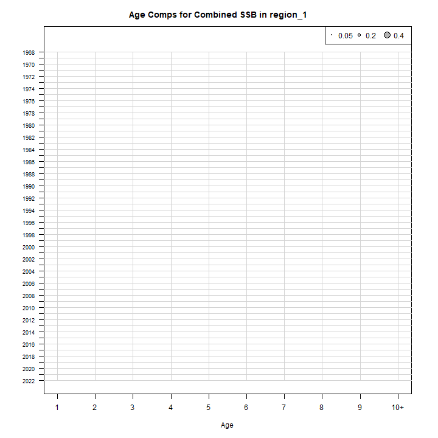
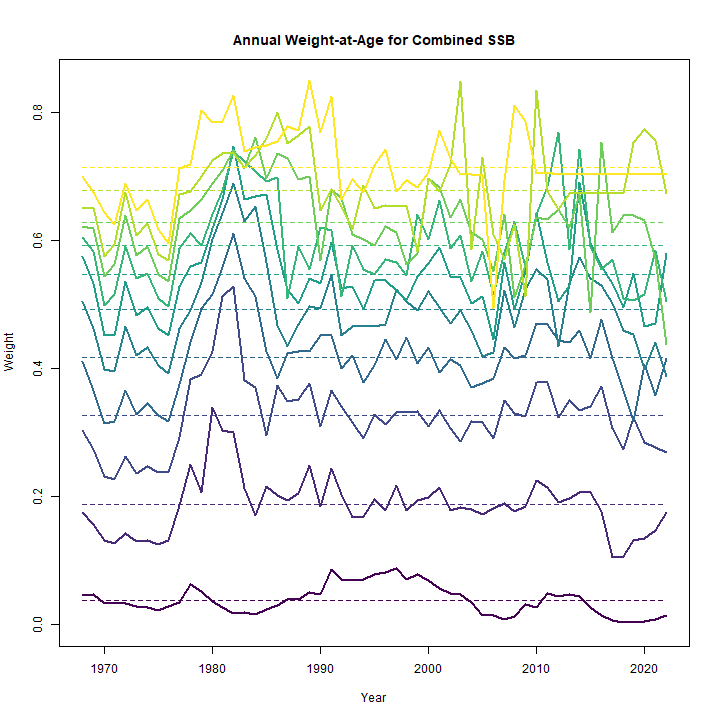
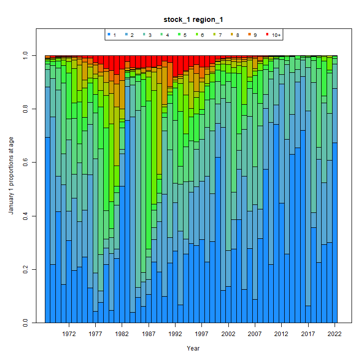

---
output:
  html_document:
    df_print: paged
    keep_md: yes
  word_document: default
  pdf_document:
    fig_caption: yes
    includes:
    keep_tex: yes
    number_sections: no
title: "WHAM figures and tables"
header-includes:
  - \usepackage{longtable}
  - \usepackage{booktabs}
  - \usepackage{caption,graphics}
  - \usepackage{makecell}
  - \usepackage{lscape}
  - \renewcommand\figurename{Fig.}
  - \captionsetup{labelsep=period, singlelinecheck=false}
  - \newcommand{\changesize}[1]{\fontsize{#1pt}{#1pt}\selectfont}
  - \renewcommand{\arraystretch}{1.5}
  - \renewcommand\theadfont{}
---

# {.tabset}

## Figures {.tabset}

### Input

### Diagnostics

### Results

### Retro

### Reference points

### Miscellaneous

## Tables {.tabset}

### Parameter estimates

<table class="table" style="margin-left: auto; margin-right: auto;">
<caption>Parameter estimates, standard errors, and confidence intervals. Rounded to 3 decimal places.</caption>
 <thead>
  <tr>
   <th style="text-align:left;">   </th>
   <th style="text-align:right;"> Estimate </th>
   <th style="text-align:right;"> Std. Error </th>
   <th style="text-align:right;"> 95\% CI lower </th>
   <th style="text-align:right;"> 95\% CI upper </th>
  </tr>
 </thead>
<tbody>
  <tr>
   <td style="text-align:left;"> Combined SSB fully selected q </td>
   <td style="text-align:right;"> $0.002$ </td>
   <td style="text-align:right;"> $2.558\times 10^{-4}$ </td>
   <td style="text-align:right;"> $0.001$ </td>
   <td style="text-align:right;"> $0.002$ </td>
  </tr>
  <tr>
   <td style="text-align:left;"> Spring Big 3+ fully selected q </td>
   <td style="text-align:right;"> $1.629\times 10^{-4}$ </td>
   <td style="text-align:right;"> $2.743\times 10^{-5}$ </td>
   <td style="text-align:right;"> $1.171\times 10^{-4}$ </td>
   <td style="text-align:right;"> $2.265\times 10^{-4}$ </td>
  </tr>
  <tr>
   <td style="text-align:left;"> Spring Alb 3+ fully selected q </td>
   <td style="text-align:right;"> $1.831\times 10^{-6}$ </td>
   <td style="text-align:right;"> $2.704\times 10^{-7}$ </td>
   <td style="text-align:right;"> $1.371\times 10^{-6}$ </td>
   <td style="text-align:right;"> $2.446\times 10^{-6}$ </td>
  </tr>
  <tr>
   <td style="text-align:left;"> Block 1: Combined $a_{50}$ </td>
   <td style="text-align:right;"> $2.256$ </td>
   <td style="text-align:right;"> $0.021$ </td>
   <td style="text-align:right;"> $2.216$ </td>
   <td style="text-align:right;"> $2.297$ </td>
  </tr>
  <tr>
   <td style="text-align:left;"> Block 1: Combined 1/slope (increasing) </td>
   <td style="text-align:right;"> $0.794$ </td>
   <td style="text-align:right;"> $0.011$ </td>
   <td style="text-align:right;"> $0.772$ </td>
   <td style="text-align:right;"> $0.816$ </td>
  </tr>
  <tr>
   <td style="text-align:left;"> Block 2: Combined SSB Selectivity for age 1 </td>
   <td style="text-align:right;"> $1.000$ </td>
   <td style="text-align:right;"> -- </td>
   <td style="text-align:right;"> -- </td>
   <td style="text-align:right;"> -- </td>
  </tr>
  <tr>
   <td style="text-align:left;"> Block 2: Combined SSB Selectivity for age 2 </td>
   <td style="text-align:right;"> $1.000$ </td>
   <td style="text-align:right;"> -- </td>
   <td style="text-align:right;"> -- </td>
   <td style="text-align:right;"> -- </td>
  </tr>
  <tr>
   <td style="text-align:left;"> Block 2: Combined SSB Selectivity for age 3 </td>
   <td style="text-align:right;"> $1.000$ </td>
   <td style="text-align:right;"> -- </td>
   <td style="text-align:right;"> -- </td>
   <td style="text-align:right;"> -- </td>
  </tr>
  <tr>
   <td style="text-align:left;"> Block 2: Combined SSB Selectivity for age 4 </td>
   <td style="text-align:right;"> $1.000$ </td>
   <td style="text-align:right;"> -- </td>
   <td style="text-align:right;"> -- </td>
   <td style="text-align:right;"> -- </td>
  </tr>
  <tr>
   <td style="text-align:left;"> Block 2: Combined SSB Selectivity for age 5 </td>
   <td style="text-align:right;"> $1.000$ </td>
   <td style="text-align:right;"> -- </td>
   <td style="text-align:right;"> -- </td>
   <td style="text-align:right;"> -- </td>
  </tr>
  <tr>
   <td style="text-align:left;"> Block 2: Combined SSB Selectivity for age 6 </td>
   <td style="text-align:right;"> $1.000$ </td>
   <td style="text-align:right;"> -- </td>
   <td style="text-align:right;"> -- </td>
   <td style="text-align:right;"> -- </td>
  </tr>
  <tr>
   <td style="text-align:left;"> Block 2: Combined SSB Selectivity for age 7 </td>
   <td style="text-align:right;"> $1.000$ </td>
   <td style="text-align:right;"> -- </td>
   <td style="text-align:right;"> -- </td>
   <td style="text-align:right;"> -- </td>
  </tr>
  <tr>
   <td style="text-align:left;"> Block 2: Combined SSB Selectivity for age 8 </td>
   <td style="text-align:right;"> $1.000$ </td>
   <td style="text-align:right;"> -- </td>
   <td style="text-align:right;"> -- </td>
   <td style="text-align:right;"> -- </td>
  </tr>
  <tr>
   <td style="text-align:left;"> Block 2: Combined SSB Selectivity for age 9 </td>
   <td style="text-align:right;"> $1.000$ </td>
   <td style="text-align:right;"> -- </td>
   <td style="text-align:right;"> -- </td>
   <td style="text-align:right;"> -- </td>
  </tr>
  <tr>
   <td style="text-align:left;"> Block 2: Combined SSB Selectivity for age 10+ </td>
   <td style="text-align:right;"> $1.000$ </td>
   <td style="text-align:right;"> -- </td>
   <td style="text-align:right;"> -- </td>
   <td style="text-align:right;"> -- </td>
  </tr>
  <tr>
   <td style="text-align:left;"> Block 3: Spring Big 3+ Selectivity for age 1 </td>
   <td style="text-align:right;"> $0.000$ </td>
   <td style="text-align:right;"> -- </td>
   <td style="text-align:right;"> -- </td>
   <td style="text-align:right;"> -- </td>
  </tr>
  <tr>
   <td style="text-align:left;"> Block 3: Spring Big 3+ Selectivity for age 2 </td>
   <td style="text-align:right;"> $0.000$ </td>
   <td style="text-align:right;"> -- </td>
   <td style="text-align:right;"> -- </td>
   <td style="text-align:right;"> -- </td>
  </tr>
  <tr>
   <td style="text-align:left;"> Block 3: Spring Big 3+ Selectivity for age 3 </td>
   <td style="text-align:right;"> $1.000$ </td>
   <td style="text-align:right;"> -- </td>
   <td style="text-align:right;"> -- </td>
   <td style="text-align:right;"> -- </td>
  </tr>
  <tr>
   <td style="text-align:left;"> Block 3: Spring Big 3+ Selectivity for age 4 </td>
   <td style="text-align:right;"> $0.508$ </td>
   <td style="text-align:right;"> $0.015$ </td>
   <td style="text-align:right;"> $0.478$ </td>
   <td style="text-align:right;"> $0.537$ </td>
  </tr>
  <tr>
   <td style="text-align:left;"> Block 3: Spring Big 3+ Selectivity for age 5 </td>
   <td style="text-align:right;"> $0.262$ </td>
   <td style="text-align:right;"> $0.017$ </td>
   <td style="text-align:right;"> $0.230$ </td>
   <td style="text-align:right;"> $0.295$ </td>
  </tr>
  <tr>
   <td style="text-align:left;"> Block 3: Spring Big 3+ Selectivity for age 6 </td>
   <td style="text-align:right;"> $0.094$ </td>
   <td style="text-align:right;"> $0.013$ </td>
   <td style="text-align:right;"> $0.071$ </td>
   <td style="text-align:right;"> $0.124$ </td>
  </tr>
  <tr>
   <td style="text-align:left;"> Block 3: Spring Big 3+ Selectivity for age 7 </td>
   <td style="text-align:right;"> $0.000$ </td>
   <td style="text-align:right;"> -- </td>
   <td style="text-align:right;"> -- </td>
   <td style="text-align:right;"> -- </td>
  </tr>
  <tr>
   <td style="text-align:left;"> Block 3: Spring Big 3+ Selectivity for age 8 </td>
   <td style="text-align:right;"> $0.000$ </td>
   <td style="text-align:right;"> -- </td>
   <td style="text-align:right;"> -- </td>
   <td style="text-align:right;"> -- </td>
  </tr>
  <tr>
   <td style="text-align:left;"> Block 3: Spring Big 3+ Selectivity for age 9 </td>
   <td style="text-align:right;"> $0.000$ </td>
   <td style="text-align:right;"> -- </td>
   <td style="text-align:right;"> -- </td>
   <td style="text-align:right;"> -- </td>
  </tr>
  <tr>
   <td style="text-align:left;"> Block 3: Spring Big 3+ Selectivity for age 10+ </td>
   <td style="text-align:right;"> $0.000$ </td>
   <td style="text-align:right;"> -- </td>
   <td style="text-align:right;"> -- </td>
   <td style="text-align:right;"> -- </td>
  </tr>
  <tr>
   <td style="text-align:left;"> Block 4: Spring Alb 3+ Selectivity for age 1 </td>
   <td style="text-align:right;"> $1.000$ </td>
   <td style="text-align:right;"> -- </td>
   <td style="text-align:right;"> -- </td>
   <td style="text-align:right;"> -- </td>
  </tr>
  <tr>
   <td style="text-align:left;"> Block 4: Spring Alb 3+ Selectivity for age 2 </td>
   <td style="text-align:right;"> $1.000$ </td>
   <td style="text-align:right;"> -- </td>
   <td style="text-align:right;"> -- </td>
   <td style="text-align:right;"> -- </td>
  </tr>
  <tr>
   <td style="text-align:left;"> Block 4: Spring Alb 3+ Selectivity for age 3 </td>
   <td style="text-align:right;"> $1.000$ </td>
   <td style="text-align:right;"> -- </td>
   <td style="text-align:right;"> -- </td>
   <td style="text-align:right;"> -- </td>
  </tr>
  <tr>
   <td style="text-align:left;"> Block 4: Spring Alb 3+ Selectivity for age 4 </td>
   <td style="text-align:right;"> $1.000$ </td>
   <td style="text-align:right;"> $6.502\times 10^{-8}$ </td>
   <td style="text-align:right;"> $0.000$ </td>
   <td style="text-align:right;"> $1.000$ </td>
  </tr>
  <tr>
   <td style="text-align:left;"> Block 4: Spring Alb 3+ Selectivity for age 5 </td>
   <td style="text-align:right;"> $1.000$ </td>
   <td style="text-align:right;"> $1.243\times 10^{-7}$ </td>
   <td style="text-align:right;"> $0.000$ </td>
   <td style="text-align:right;"> $1.000$ </td>
  </tr>
  <tr>
   <td style="text-align:left;"> Block 4: Spring Alb 3+ Selectivity for age 6 </td>
   <td style="text-align:right;"> $1.000$ </td>
   <td style="text-align:right;"> $5.645\times 10^{-7}$ </td>
   <td style="text-align:right;"> $0.000$ </td>
   <td style="text-align:right;"> $1.000$ </td>
  </tr>
  <tr>
   <td style="text-align:left;"> Block 4: Spring Alb 3+ Selectivity for age 7 </td>
   <td style="text-align:right;"> $1.000$ </td>
   <td style="text-align:right;"> $1.273\times 10^{-6}$ </td>
   <td style="text-align:right;"> $0.000$ </td>
   <td style="text-align:right;"> $1.000$ </td>
  </tr>
  <tr>
   <td style="text-align:left;"> Block 4: Spring Alb 3+ Selectivity for age 8 </td>
   <td style="text-align:right;"> $0.911$ </td>
   <td style="text-align:right;"> $0.033$ </td>
   <td style="text-align:right;"> $0.820$ </td>
   <td style="text-align:right;"> $0.958$ </td>
  </tr>
  <tr>
   <td style="text-align:left;"> Block 4: Spring Alb 3+ Selectivity for age 9 </td>
   <td style="text-align:right;"> $1.000$ </td>
   <td style="text-align:right;"> $3.330\times 10^{-7}$ </td>
   <td style="text-align:right;"> $0.000$ </td>
   <td style="text-align:right;"> $1.000$ </td>
  </tr>
  <tr>
   <td style="text-align:left;"> Block 4: Spring Alb 3+ Selectivity for age 10+ </td>
   <td style="text-align:right;"> $1.000$ </td>
   <td style="text-align:right;"> $7.148\times 10^{-7}$ </td>
   <td style="text-align:right;"> $0.000$ </td>
   <td style="text-align:right;"> $1.000$ </td>
  </tr>
</tbody>
</table>

### Abundance at age

<table class="table" style="margin-left: auto; margin-right: auto;">
<caption>Abundance at age (1000s) for stock 1 in region 1.</caption>
 <thead>
  <tr>
   <th style="text-align:left;">   </th>
   <th style="text-align:right;"> 1 </th>
   <th style="text-align:right;"> 2 </th>
   <th style="text-align:right;"> 3 </th>
   <th style="text-align:right;"> 4 </th>
   <th style="text-align:right;"> 5 </th>
   <th style="text-align:right;"> 6 </th>
   <th style="text-align:right;"> 7 </th>
   <th style="text-align:right;"> 8 </th>
   <th style="text-align:right;"> 9 </th>
   <th style="text-align:right;"> 10+ </th>
  </tr>
 </thead>
<tbody>
  <tr>
   <td style="text-align:left;"> 1968 </td>
   <td style="text-align:right;"> 7719520 </td>
   <td style="text-align:right;"> 2092554 </td>
   <td style="text-align:right;"> 709865 </td>
   <td style="text-align:right;"> 243430 </td>
   <td style="text-align:right;"> 106947 </td>
   <td style="text-align:right;"> 66660 </td>
   <td style="text-align:right;"> 38496 </td>
   <td style="text-align:right;"> 20799 </td>
   <td style="text-align:right;"> 113810 </td>
   <td style="text-align:right;"> 1505 </td>
  </tr>
  <tr>
   <td style="text-align:left;"> 1969 </td>
   <td style="text-align:right;"> 2463906 </td>
   <td style="text-align:right;"> 6185306 </td>
   <td style="text-align:right;"> 1624535 </td>
   <td style="text-align:right;"> 530665 </td>
   <td style="text-align:right;"> 177846 </td>
   <td style="text-align:right;"> 77450 </td>
   <td style="text-align:right;"> 48141 </td>
   <td style="text-align:right;"> 27779 </td>
   <td style="text-align:right;"> 15005 </td>
   <td style="text-align:right;"> 83189 </td>
  </tr>
  <tr>
   <td style="text-align:left;"> 1970 </td>
   <td style="text-align:right;"> 6201910 </td>
   <td style="text-align:right;"> 1976107 </td>
   <td style="text-align:right;"> 4813235 </td>
   <td style="text-align:right;"> 1219340 </td>
   <td style="text-align:right;"> 389657 </td>
   <td style="text-align:right;"> 129496 </td>
   <td style="text-align:right;"> 56246 </td>
   <td style="text-align:right;"> 34935 </td>
   <td style="text-align:right;"> 20154 </td>
   <td style="text-align:right;"> 71235 </td>
  </tr>
  <tr>
   <td style="text-align:left;"> 1971 </td>
   <td style="text-align:right;"> 1896480 </td>
   <td style="text-align:right;"> 4939060 </td>
   <td style="text-align:right;"> 1511221 </td>
   <td style="text-align:right;"> 3506739 </td>
   <td style="text-align:right;"> 862566 </td>
   <td style="text-align:right;"> 272552 </td>
   <td style="text-align:right;"> 90259 </td>
   <td style="text-align:right;"> 39163 </td>
   <td style="text-align:right;"> 24317 </td>
   <td style="text-align:right;"> 63608 </td>
  </tr>
  <tr>
   <td style="text-align:left;"> 1972 </td>
   <td style="text-align:right;"> 4276614 </td>
   <td style="text-align:right;"> 1498813 </td>
   <td style="text-align:right;"> 3706655 </td>
   <td style="text-align:right;"> 1066109 </td>
   <td style="text-align:right;"> 2382561 </td>
   <td style="text-align:right;"> 577670 </td>
   <td style="text-align:right;"> 181712 </td>
   <td style="text-align:right;"> 60097 </td>
   <td style="text-align:right;"> 26066 </td>
   <td style="text-align:right;"> 58514 </td>
  </tr>
  <tr>
   <td style="text-align:left;"> 1973 </td>
   <td style="text-align:right;"> 2469841 </td>
   <td style="text-align:right;"> 3385497 </td>
   <td style="text-align:right;"> 1129451 </td>
   <td style="text-align:right;"> 2633324 </td>
   <td style="text-align:right;"> 730736 </td>
   <td style="text-align:right;"> 1610812 </td>
   <td style="text-align:right;"> 388882 </td>
   <td style="text-align:right;"> 122174 </td>
   <td style="text-align:right;"> 40392 </td>
   <td style="text-align:right;"> 56840 </td>
  </tr>
  <tr>
   <td style="text-align:left;"> 1974 </td>
   <td style="text-align:right;"> 2444678 </td>
   <td style="text-align:right;"> 1960956 </td>
   <td style="text-align:right;"> 2569730 </td>
   <td style="text-align:right;"> 812400 </td>
   <td style="text-align:right;"> 1833169 </td>
   <td style="text-align:right;"> 502367 </td>
   <td style="text-align:right;"> 1103076 </td>
   <td style="text-align:right;"> 266001 </td>
   <td style="text-align:right;"> 83541 </td>
   <td style="text-align:right;"> 66479 </td>
  </tr>
  <tr>
   <td style="text-align:left;"> 1975 </td>
   <td style="text-align:right;"> 2709537 </td>
   <td style="text-align:right;"> 1927420 </td>
   <td style="text-align:right;"> 1462959 </td>
   <td style="text-align:right;"> 1794564 </td>
   <td style="text-align:right;"> 545000 </td>
   <td style="text-align:right;"> 1211017 </td>
   <td style="text-align:right;"> 330279 </td>
   <td style="text-align:right;"> 724197 </td>
   <td style="text-align:right;"> 174566 </td>
   <td style="text-align:right;"> 98440 </td>
  </tr>
  <tr>
   <td style="text-align:left;"> 1976 </td>
   <td style="text-align:right;"> 496040 </td>
   <td style="text-align:right;"> 1611237 </td>
   <td style="text-align:right;"> 717661 </td>
   <td style="text-align:right;"> 311171 </td>
   <td style="text-align:right;"> 271567 </td>
   <td style="text-align:right;"> 72395 </td>
   <td style="text-align:right;"> 154446 </td>
   <td style="text-align:right;"> 41624 </td>
   <td style="text-align:right;"> 90958 </td>
   <td style="text-align:right;"> 34253 </td>
  </tr>
  <tr>
   <td style="text-align:left;"> 1977 </td>
   <td style="text-align:right;"> 116151 </td>
   <td style="text-align:right;"> 382763 </td>
   <td style="text-align:right;"> 1140007 </td>
   <td style="text-align:right;"> 457740 </td>
   <td style="text-align:right;"> 186341 </td>
   <td style="text-align:right;"> 158745 </td>
   <td style="text-align:right;"> 42001 </td>
   <td style="text-align:right;"> 89406 </td>
   <td style="text-align:right;"> 24080 </td>
   <td style="text-align:right;"> 72422 </td>
  </tr>
  <tr>
   <td style="text-align:left;"> 1978 </td>
   <td style="text-align:right;"> 170184 </td>
   <td style="text-align:right;"> 93495 </td>
   <td style="text-align:right;"> 300538 </td>
   <td style="text-align:right;"> 868885 </td>
   <td style="text-align:right;"> 342627 </td>
   <td style="text-align:right;"> 138518 </td>
   <td style="text-align:right;"> 117749 </td>
   <td style="text-align:right;"> 31134 </td>
   <td style="text-align:right;"> 66263 </td>
   <td style="text-align:right;"> 71518 </td>
  </tr>
  <tr>
   <td style="text-align:left;"> 1979 </td>
   <td style="text-align:right;"> 488758 </td>
   <td style="text-align:right;"> 138538 </td>
   <td style="text-align:right;"> 75473 </td>
   <td style="text-align:right;"> 240180 </td>
   <td style="text-align:right;"> 690156 </td>
   <td style="text-align:right;"> 271513 </td>
   <td style="text-align:right;"> 109688 </td>
   <td style="text-align:right;"> 93222 </td>
   <td style="text-align:right;"> 24648 </td>
   <td style="text-align:right;"> 109072 </td>
  </tr>
  <tr>
   <td style="text-align:left;"> 1980 </td>
   <td style="text-align:right;"> 88261 </td>
   <td style="text-align:right;"> 397240 </td>
   <td style="text-align:right;"> 111396 </td>
   <td style="text-align:right;"> 59913 </td>
   <td style="text-align:right;"> 189181 </td>
   <td style="text-align:right;"> 541990 </td>
   <td style="text-align:right;"> 213025 </td>
   <td style="text-align:right;"> 86035 </td>
   <td style="text-align:right;"> 73115 </td>
   <td style="text-align:right;"> 104874 </td>
  </tr>
  <tr>
   <td style="text-align:left;"> 1981 </td>
   <td style="text-align:right;"> 470497 </td>
   <td style="text-align:right;"> 71856 </td>
   <td style="text-align:right;"> 320746 </td>
   <td style="text-align:right;"> 89062 </td>
   <td style="text-align:right;"> 47614 </td>
   <td style="text-align:right;"> 150001 </td>
   <td style="text-align:right;"> 429434 </td>
   <td style="text-align:right;"> 168750 </td>
   <td style="text-align:right;"> 68150 </td>
   <td style="text-align:right;"> 140985 </td>
  </tr>
  <tr>
   <td style="text-align:left;"> 1982 </td>
   <td style="text-align:right;"> 1634243 </td>
   <td style="text-align:right;"> 382719 </td>
   <td style="text-align:right;"> 57898 </td>
   <td style="text-align:right;"> 255521 </td>
   <td style="text-align:right;"> 70462 </td>
   <td style="text-align:right;"> 37571 </td>
   <td style="text-align:right;"> 118264 </td>
   <td style="text-align:right;"> 338494 </td>
   <td style="text-align:right;"> 133005 </td>
   <td style="text-align:right;"> 164832 </td>
  </tr>
  <tr>
   <td style="text-align:left;"> 1983 </td>
   <td style="text-align:right;"> 8006813 </td>
   <td style="text-align:right;"> 1328437 </td>
   <td style="text-align:right;"> 307851 </td>
   <td style="text-align:right;"> 45990 </td>
   <td style="text-align:right;"> 201424 </td>
   <td style="text-align:right;"> 55382 </td>
   <td style="text-align:right;"> 29503 </td>
   <td style="text-align:right;"> 92844 </td>
   <td style="text-align:right;"> 265717 </td>
   <td style="text-align:right;"> 233795 </td>
  </tr>
  <tr>
   <td style="text-align:left;"> 1984 </td>
   <td style="text-align:right;"> 353249 </td>
   <td style="text-align:right;"> 6515587 </td>
   <td style="text-align:right;"> 1071418 </td>
   <td style="text-align:right;"> 245654 </td>
   <td style="text-align:right;"> 36461 </td>
   <td style="text-align:right;"> 159293 </td>
   <td style="text-align:right;"> 43764 </td>
   <td style="text-align:right;"> 23309 </td>
   <td style="text-align:right;"> 73346 </td>
   <td style="text-align:right;"> 394601 </td>
  </tr>
  <tr>
   <td style="text-align:left;"> 1985 </td>
   <td style="text-align:right;"> 765053 </td>
   <td style="text-align:right;"> 287666 </td>
   <td style="text-align:right;"> 5264337 </td>
   <td style="text-align:right;"> 857556 </td>
   <td style="text-align:right;"> 195498 </td>
   <td style="text-align:right;"> 28953 </td>
   <td style="text-align:right;"> 126406 </td>
   <td style="text-align:right;"> 34722 </td>
   <td style="text-align:right;"> 18492 </td>
   <td style="text-align:right;"> 371233 </td>
  </tr>
  <tr>
   <td style="text-align:left;"> 1986 </td>
   <td style="text-align:right;"> 415204 </td>
   <td style="text-align:right;"> 621992 </td>
   <td style="text-align:right;"> 231483 </td>
   <td style="text-align:right;"> 4184446 </td>
   <td style="text-align:right;"> 676569 </td>
   <td style="text-align:right;"> 153798 </td>
   <td style="text-align:right;"> 22757 </td>
   <td style="text-align:right;"> 99328 </td>
   <td style="text-align:right;"> 27282 </td>
   <td style="text-align:right;"> 306210 </td>
  </tr>
  <tr>
   <td style="text-align:left;"> 1987 </td>
   <td style="text-align:right;"> 643568 </td>
   <td style="text-align:right;"> 338027 </td>
   <td style="text-align:right;"> 502211 </td>
   <td style="text-align:right;"> 185067 </td>
   <td style="text-align:right;"> 3325354 </td>
   <td style="text-align:right;"> 536430 </td>
   <td style="text-align:right;"> 121854 </td>
   <td style="text-align:right;"> 18027 </td>
   <td style="text-align:right;"> 78676 </td>
   <td style="text-align:right;"> 264148 </td>
  </tr>
  <tr>
   <td style="text-align:left;"> 1988 </td>
   <td style="text-align:right;"> 1404084 </td>
   <td style="text-align:right;"> 523376 </td>
   <td style="text-align:right;"> 272203 </td>
   <td style="text-align:right;"> 399680 </td>
   <td style="text-align:right;"> 146233 </td>
   <td style="text-align:right;"> 2620373 </td>
   <td style="text-align:right;"> 422343 </td>
   <td style="text-align:right;"> 95914 </td>
   <td style="text-align:right;"> 14188 </td>
   <td style="text-align:right;"> 269820 </td>
  </tr>
  <tr>
   <td style="text-align:left;"> 1989 </td>
   <td style="text-align:right;"> 1148570 </td>
   <td style="text-align:right;"> 1140779 </td>
   <td style="text-align:right;"> 420478 </td>
   <td style="text-align:right;"> 215768 </td>
   <td style="text-align:right;"> 314237 </td>
   <td style="text-align:right;"> 114612 </td>
   <td style="text-align:right;"> 2051754 </td>
   <td style="text-align:right;"> 330601 </td>
   <td style="text-align:right;"> 75073 </td>
   <td style="text-align:right;"> 222291 </td>
  </tr>
  <tr>
   <td style="text-align:left;"> 1990 </td>
   <td style="text-align:right;"> 174774 </td>
   <td style="text-align:right;"> 678605 </td>
   <td style="text-align:right;"> 418055 </td>
   <td style="text-align:right;"> 87034 </td>
   <td style="text-align:right;"> 31557 </td>
   <td style="text-align:right;"> 40237 </td>
   <td style="text-align:right;"> 14078 </td>
   <td style="text-align:right;"> 248985 </td>
   <td style="text-align:right;"> 39980 </td>
   <td style="text-align:right;"> 35918 </td>
  </tr>
  <tr>
   <td style="text-align:left;"> 1991 </td>
   <td style="text-align:right;"> 307725 </td>
   <td style="text-align:right;"> 131121 </td>
   <td style="text-align:right;"> 447984 </td>
   <td style="text-align:right;"> 236830 </td>
   <td style="text-align:right;"> 44926 </td>
   <td style="text-align:right;"> 15720 </td>
   <td style="text-align:right;"> 19821 </td>
   <td style="text-align:right;"> 6913 </td>
   <td style="text-align:right;"> 122143 </td>
   <td style="text-align:right;"> 37222 </td>
  </tr>
  <tr>
   <td style="text-align:left;"> 1992 </td>
   <td style="text-align:right;"> 361101 </td>
   <td style="text-align:right;"> 243096 </td>
   <td style="text-align:right;"> 98300 </td>
   <td style="text-align:right;"> 315468 </td>
   <td style="text-align:right;"> 160547 </td>
   <td style="text-align:right;"> 30014 </td>
   <td style="text-align:right;"> 10454 </td>
   <td style="text-align:right;"> 13165 </td>
   <td style="text-align:right;"> 4589 </td>
   <td style="text-align:right;"> 105793 </td>
  </tr>
  <tr>
   <td style="text-align:left;"> 1993 </td>
   <td style="text-align:right;"> 69918 </td>
   <td style="text-align:right;"> 285139 </td>
   <td style="text-align:right;"> 182055 </td>
   <td style="text-align:right;"> 69098 </td>
   <td style="text-align:right;"> 213374 </td>
   <td style="text-align:right;"> 107000 </td>
   <td style="text-align:right;"> 19912 </td>
   <td style="text-align:right;"> 6926 </td>
   <td style="text-align:right;"> 8718 </td>
   <td style="text-align:right;"> 73092 </td>
  </tr>
  <tr>
   <td style="text-align:left;"> 1994 </td>
   <td style="text-align:right;"> 259345 </td>
   <td style="text-align:right;"> 55507 </td>
   <td style="text-align:right;"> 216380 </td>
   <td style="text-align:right;"> 130896 </td>
   <td style="text-align:right;"> 48077 </td>
   <td style="text-align:right;"> 146609 </td>
   <td style="text-align:right;"> 73231 </td>
   <td style="text-align:right;"> 13612 </td>
   <td style="text-align:right;"> 4733 </td>
   <td style="text-align:right;"> 55902 </td>
  </tr>
  <tr>
   <td style="text-align:left;"> 1995 </td>
   <td style="text-align:right;"> 320205 </td>
   <td style="text-align:right;"> 208028 </td>
   <td style="text-align:right;"> 43208 </td>
   <td style="text-align:right;"> 162500 </td>
   <td style="text-align:right;"> 96181 </td>
   <td style="text-align:right;"> 35033 </td>
   <td style="text-align:right;"> 106552 </td>
   <td style="text-align:right;"> 53182 </td>
   <td style="text-align:right;"> 9883 </td>
   <td style="text-align:right;"> 44022 </td>
  </tr>
  <tr>
   <td style="text-align:left;"> 1996 </td>
   <td style="text-align:right;"> 338388 </td>
   <td style="text-align:right;"> 257599 </td>
   <td style="text-align:right;"> 163107 </td>
   <td style="text-align:right;"> 32852 </td>
   <td style="text-align:right;"> 121265 </td>
   <td style="text-align:right;"> 71263 </td>
   <td style="text-align:right;"> 25899 </td>
   <td style="text-align:right;"> 78720 </td>
   <td style="text-align:right;"> 39283 </td>
   <td style="text-align:right;"> 39815 </td>
  </tr>
  <tr>
   <td style="text-align:left;"> 1997 </td>
   <td style="text-align:right;"> 380084 </td>
   <td style="text-align:right;"> 266656 </td>
   <td style="text-align:right;"> 191942 </td>
   <td style="text-align:right;"> 113664 </td>
   <td style="text-align:right;"> 21980 </td>
   <td style="text-align:right;"> 79880 </td>
   <td style="text-align:right;"> 46715 </td>
   <td style="text-align:right;"> 16953 </td>
   <td style="text-align:right;"> 51508 </td>
   <td style="text-align:right;"> 51749 </td>
  </tr>
  <tr>
   <td style="text-align:left;"> 1998 </td>
   <td style="text-align:right;"> 191730 </td>
   <td style="text-align:right;"> 270085 </td>
   <td style="text-align:right;"> 153993 </td>
   <td style="text-align:right;"> 86496 </td>
   <td style="text-align:right;"> 44051 </td>
   <td style="text-align:right;"> 8041 </td>
   <td style="text-align:right;"> 28699 </td>
   <td style="text-align:right;"> 16695 </td>
   <td style="text-align:right;"> 6050 </td>
   <td style="text-align:right;"> 36829 </td>
  </tr>
  <tr>
   <td style="text-align:left;"> 1999 </td>
   <td style="text-align:right;"> 249837 </td>
   <td style="text-align:right;"> 148028 </td>
   <td style="text-align:right;"> 191353 </td>
   <td style="text-align:right;"> 98447 </td>
   <td style="text-align:right;"> 51947 </td>
   <td style="text-align:right;"> 25830 </td>
   <td style="text-align:right;"> 4680 </td>
   <td style="text-align:right;"> 16666 </td>
   <td style="text-align:right;"> 9689 </td>
   <td style="text-align:right;"> 24880 </td>
  </tr>
  <tr>
   <td style="text-align:left;"> 2000 </td>
   <td style="text-align:right;"> 943437 </td>
   <td style="text-align:right;"> 195566 </td>
   <td style="text-align:right;"> 108499 </td>
   <td style="text-align:right;"> 129648 </td>
   <td style="text-align:right;"> 63588 </td>
   <td style="text-align:right;"> 32944 </td>
   <td style="text-align:right;"> 16288 </td>
   <td style="text-align:right;"> 2946 </td>
   <td style="text-align:right;"> 10487 </td>
   <td style="text-align:right;"> 21748 </td>
  </tr>
  <tr>
   <td style="text-align:left;"> 2001 </td>
   <td style="text-align:right;"> 140548 </td>
   <td style="text-align:right;"> 695217 </td>
   <td style="text-align:right;"> 123522 </td>
   <td style="text-align:right;"> 56990 </td>
   <td style="text-align:right;"> 60876 </td>
   <td style="text-align:right;"> 28603 </td>
   <td style="text-align:right;"> 14622 </td>
   <td style="text-align:right;"> 7201 </td>
   <td style="text-align:right;"> 1301 </td>
   <td style="text-align:right;"> 14230 </td>
  </tr>
  <tr>
   <td style="text-align:left;"> 2002 </td>
   <td style="text-align:right;"> 103352 </td>
   <td style="text-align:right;"> 101322 </td>
   <td style="text-align:right;"> 415999 </td>
   <td style="text-align:right;"> 59150 </td>
   <td style="text-align:right;"> 23833 </td>
   <td style="text-align:right;"> 24171 </td>
   <td style="text-align:right;"> 11174 </td>
   <td style="text-align:right;"> 5685 </td>
   <td style="text-align:right;"> 2796 </td>
   <td style="text-align:right;"> 6028 </td>
  </tr>
  <tr>
   <td style="text-align:left;"> 2003 </td>
   <td style="text-align:right;"> 206189 </td>
   <td style="text-align:right;"> 81563 </td>
   <td style="text-align:right;"> 75771 </td>
   <td style="text-align:right;"> 291696 </td>
   <td style="text-align:right;"> 39883 </td>
   <td style="text-align:right;"> 15831 </td>
   <td style="text-align:right;"> 15981 </td>
   <td style="text-align:right;"> 7378 </td>
   <td style="text-align:right;"> 3752 </td>
   <td style="text-align:right;"> 5823 </td>
  </tr>
  <tr>
   <td style="text-align:left;"> 2004 </td>
   <td style="text-align:right;"> 331236 </td>
   <td style="text-align:right;"> 162319 </td>
   <td style="text-align:right;"> 60625 </td>
   <td style="text-align:right;"> 52580 </td>
   <td style="text-align:right;"> 194139 </td>
   <td style="text-align:right;"> 26123 </td>
   <td style="text-align:right;"> 10317 </td>
   <td style="text-align:right;"> 10400 </td>
   <td style="text-align:right;"> 4799 </td>
   <td style="text-align:right;"> 6228 </td>
  </tr>
  <tr>
   <td style="text-align:left;"> 2005 </td>
   <td style="text-align:right;"> 71869 </td>
   <td style="text-align:right;"> 240885 </td>
   <td style="text-align:right;"> 99240 </td>
   <td style="text-align:right;"> 30119 </td>
   <td style="text-align:right;"> 23026 </td>
   <td style="text-align:right;"> 81008 </td>
   <td style="text-align:right;"> 10737 </td>
   <td style="text-align:right;"> 4222 </td>
   <td style="text-align:right;"> 4250 </td>
   <td style="text-align:right;"> 4505 </td>
  </tr>
  <tr>
   <td style="text-align:left;"> 2006 </td>
   <td style="text-align:right;"> 96519 </td>
   <td style="text-align:right;"> 48466 </td>
   <td style="text-align:right;"> 122281 </td>
   <td style="text-align:right;"> 35869 </td>
   <td style="text-align:right;"> 8855 </td>
   <td style="text-align:right;"> 6255 </td>
   <td style="text-align:right;"> 21468 </td>
   <td style="text-align:right;"> 2825 </td>
   <td style="text-align:right;"> 1109 </td>
   <td style="text-align:right;"> 2297 </td>
  </tr>
  <tr>
   <td style="text-align:left;"> 2007 </td>
   <td style="text-align:right;"> 16844 </td>
   <td style="text-align:right;"> 67712 </td>
   <td style="text-align:right;"> 27119 </td>
   <td style="text-align:right;"> 52205 </td>
   <td style="text-align:right;"> 12991 </td>
   <td style="text-align:right;"> 3011 </td>
   <td style="text-align:right;"> 2086 </td>
   <td style="text-align:right;"> 7118 </td>
   <td style="text-align:right;"> 935 </td>
   <td style="text-align:right;"> 1127 </td>
  </tr>
  <tr>
   <td style="text-align:left;"> 2008 </td>
   <td style="text-align:right;"> 31165 </td>
   <td style="text-align:right;"> 10863 </td>
   <td style="text-align:right;"> 30794 </td>
   <td style="text-align:right;"> 8121 </td>
   <td style="text-align:right;"> 12127 </td>
   <td style="text-align:right;"> 2738 </td>
   <td style="text-align:right;"> 616 </td>
   <td style="text-align:right;"> 423 </td>
   <td style="text-align:right;"> 1439 </td>
   <td style="text-align:right;"> 416 </td>
  </tr>
  <tr>
   <td style="text-align:left;"> 2009 </td>
   <td style="text-align:right;"> 48914 </td>
   <td style="text-align:right;"> 19366 </td>
   <td style="text-align:right;"> 4508 </td>
   <td style="text-align:right;"> 7884 </td>
   <td style="text-align:right;"> 1550 </td>
   <td style="text-align:right;"> 2069 </td>
   <td style="text-align:right;"> 451 </td>
   <td style="text-align:right;"> 100 </td>
   <td style="text-align:right;"> 69 </td>
   <td style="text-align:right;"> 301 </td>
  </tr>
  <tr>
   <td style="text-align:left;"> 2010 </td>
   <td style="text-align:right;"> 13699 </td>
   <td style="text-align:right;"> 33413 </td>
   <td style="text-align:right;"> 10148 </td>
   <td style="text-align:right;"> 1720 </td>
   <td style="text-align:right;"> 2481 </td>
   <td style="text-align:right;"> 453 </td>
   <td style="text-align:right;"> 591 </td>
   <td style="text-align:right;"> 128 </td>
   <td style="text-align:right;"> 28 </td>
   <td style="text-align:right;"> 105 </td>
  </tr>
  <tr>
   <td style="text-align:left;"> 2011 </td>
   <td style="text-align:right;"> 100362 </td>
   <td style="text-align:right;"> 9625 </td>
   <td style="text-align:right;"> 18765 </td>
   <td style="text-align:right;"> 4360 </td>
   <td style="text-align:right;"> 628 </td>
   <td style="text-align:right;"> 851 </td>
   <td style="text-align:right;"> 152 </td>
   <td style="text-align:right;"> 198 </td>
   <td style="text-align:right;"> 43 </td>
   <td style="text-align:right;"> 44 </td>
  </tr>
  <tr>
   <td style="text-align:left;"> 2012 </td>
   <td style="text-align:right;"> 72921 </td>
   <td style="text-align:right;"> 72423 </td>
   <td style="text-align:right;"> 5773 </td>
   <td style="text-align:right;"> 9024 </td>
   <td style="text-align:right;"> 1833 </td>
   <td style="text-align:right;"> 251 </td>
   <td style="text-align:right;"> 334 </td>
   <td style="text-align:right;"> 60 </td>
   <td style="text-align:right;"> 77 </td>
   <td style="text-align:right;"> 34 </td>
  </tr>
  <tr>
   <td style="text-align:left;"> 2013 </td>
   <td style="text-align:right;"> 27172 </td>
   <td style="text-align:right;"> 44947 </td>
   <td style="text-align:right;"> 29459 </td>
   <td style="text-align:right;"> 1428 </td>
   <td style="text-align:right;"> 1650 </td>
   <td style="text-align:right;"> 299 </td>
   <td style="text-align:right;"> 39 </td>
   <td style="text-align:right;"> 52 </td>
   <td style="text-align:right;"> 9 </td>
   <td style="text-align:right;"> 17 </td>
  </tr>
  <tr>
   <td style="text-align:left;"> 2014 </td>
   <td style="text-align:right;"> 68892 </td>
   <td style="text-align:right;"> 16280 </td>
   <td style="text-align:right;"> 17048 </td>
   <td style="text-align:right;"> 6467 </td>
   <td style="text-align:right;"> 225 </td>
   <td style="text-align:right;"> 229 </td>
   <td style="text-align:right;"> 40 </td>
   <td style="text-align:right;"> 5 </td>
   <td style="text-align:right;"> 7 </td>
   <td style="text-align:right;"> 3 </td>
  </tr>
  <tr>
   <td style="text-align:left;"> 2015 </td>
   <td style="text-align:right;"> 129196 </td>
   <td style="text-align:right;"> 48778 </td>
   <td style="text-align:right;"> 9318 </td>
   <td style="text-align:right;"> 7567 </td>
   <td style="text-align:right;"> 2459 </td>
   <td style="text-align:right;"> 81 </td>
   <td style="text-align:right;"> 80 </td>
   <td style="text-align:right;"> 14 </td>
   <td style="text-align:right;"> 2 </td>
   <td style="text-align:right;"> 4 </td>
  </tr>
  <tr>
   <td style="text-align:left;"> 2016 </td>
   <td style="text-align:right;"> 323845 </td>
   <td style="text-align:right;"> 91036 </td>
   <td style="text-align:right;"> 27591 </td>
   <td style="text-align:right;"> 4053 </td>
   <td style="text-align:right;"> 2805 </td>
   <td style="text-align:right;"> 858 </td>
   <td style="text-align:right;"> 28 </td>
   <td style="text-align:right;"> 27 </td>
   <td style="text-align:right;"> 5 </td>
   <td style="text-align:right;"> 2 </td>
  </tr>
  <tr>
   <td style="text-align:left;"> 2017 </td>
   <td style="text-align:right;"> 20057 </td>
   <td style="text-align:right;"> 225413 </td>
   <td style="text-align:right;"> 49962 </td>
   <td style="text-align:right;"> 11396 </td>
   <td style="text-align:right;"> 1408 </td>
   <td style="text-align:right;"> 912 </td>
   <td style="text-align:right;"> 273 </td>
   <td style="text-align:right;"> 9 </td>
   <td style="text-align:right;"> 9 </td>
   <td style="text-align:right;"> 2 </td>
  </tr>
  <tr>
   <td style="text-align:left;"> 2018 </td>
   <td style="text-align:right;"> 91855 </td>
   <td style="text-align:right;"> 14023 </td>
   <td style="text-align:right;"> 125082 </td>
   <td style="text-align:right;"> 21029 </td>
   <td style="text-align:right;"> 4055 </td>
   <td style="text-align:right;"> 470 </td>
   <td style="text-align:right;"> 298 </td>
   <td style="text-align:right;"> 89 </td>
   <td style="text-align:right;"> 3 </td>
   <td style="text-align:right;"> 3 </td>
  </tr>
  <tr>
   <td style="text-align:left;"> 2019 </td>
   <td style="text-align:right;"> 36722 </td>
   <td style="text-align:right;"> 62699 </td>
   <td style="text-align:right;"> 7335 </td>
   <td style="text-align:right;"> 47581 </td>
   <td style="text-align:right;"> 6591 </td>
   <td style="text-align:right;"> 1180 </td>
   <td style="text-align:right;"> 134 </td>
   <td style="text-align:right;"> 84 </td>
   <td style="text-align:right;"> 25 </td>
   <td style="text-align:right;"> 2 </td>
  </tr>
  <tr>
   <td style="text-align:left;"> 2020 </td>
   <td style="text-align:right;"> 31276 </td>
   <td style="text-align:right;"> 24789 </td>
   <td style="text-align:right;"> 31908 </td>
   <td style="text-align:right;"> 2662 </td>
   <td style="text-align:right;"> 14064 </td>
   <td style="text-align:right;"> 1801 </td>
   <td style="text-align:right;"> 315 </td>
   <td style="text-align:right;"> 35 </td>
   <td style="text-align:right;"> 22 </td>
   <td style="text-align:right;"> 7 </td>
  </tr>
  <tr>
   <td style="text-align:left;"> 2021 </td>
   <td style="text-align:right;"> 20003 </td>
   <td style="text-align:right;"> 20435 </td>
   <td style="text-align:right;"> 11640 </td>
   <td style="text-align:right;"> 10093 </td>
   <td style="text-align:right;"> 662 </td>
   <td style="text-align:right;"> 3191 </td>
   <td style="text-align:right;"> 397 </td>
   <td style="text-align:right;"> 69 </td>
   <td style="text-align:right;"> 8 </td>
   <td style="text-align:right;"> 6 </td>
  </tr>
  <tr>
   <td style="text-align:left;"> 2022 </td>
   <td style="text-align:right;"> 30884 </td>
   <td style="text-align:right;"> 9322 </td>
   <td style="text-align:right;"> 4173 </td>
   <td style="text-align:right;"> 886 </td>
   <td style="text-align:right;"> 422 </td>
   <td style="text-align:right;"> 22 </td>
   <td style="text-align:right;"> 99 </td>
   <td style="text-align:right;"> 12 </td>
   <td style="text-align:right;"> 2 </td>
   <td style="text-align:right;"> 0 </td>
  </tr>
</tbody>
</table>

### Fishing mortality at age by region

<table class="table" style="margin-left: auto; margin-right: auto;">
<caption>Total fishing mortality at age in region 1.</caption>
 <thead>
  <tr>
   <th style="text-align:left;">   </th>
   <th style="text-align:right;"> 1 </th>
   <th style="text-align:right;"> 2 </th>
   <th style="text-align:right;"> 3 </th>
   <th style="text-align:right;"> 4 </th>
   <th style="text-align:right;"> 5 </th>
   <th style="text-align:right;"> 6 </th>
   <th style="text-align:right;"> 7 </th>
   <th style="text-align:right;"> 8 </th>
   <th style="text-align:right;"> 9 </th>
   <th style="text-align:right;"> 10+ </th>
  </tr>
 </thead>
<tbody>
  <tr>
   <td style="text-align:left;"> 1968 </td>
   <td style="text-align:right;"> 0.022 </td>
   <td style="text-align:right;"> 0.053 </td>
   <td style="text-align:right;"> 0.091 </td>
   <td style="text-align:right;"> 0.114 </td>
   <td style="text-align:right;"> 0.123 </td>
   <td style="text-align:right;"> 0.125 </td>
   <td style="text-align:right;"> 0.126 </td>
   <td style="text-align:right;"> 0.126 </td>
   <td style="text-align:right;"> 0.127 </td>
   <td style="text-align:right;"> 0.127 </td>
  </tr>
  <tr>
   <td style="text-align:left;"> 1969 </td>
   <td style="text-align:right;"> 0.021 </td>
   <td style="text-align:right;"> 0.051 </td>
   <td style="text-align:right;"> 0.087 </td>
   <td style="text-align:right;"> 0.109 </td>
   <td style="text-align:right;"> 0.117 </td>
   <td style="text-align:right;"> 0.120 </td>
   <td style="text-align:right;"> 0.121 </td>
   <td style="text-align:right;"> 0.121 </td>
   <td style="text-align:right;"> 0.121 </td>
   <td style="text-align:right;"> 0.121 </td>
  </tr>
  <tr>
   <td style="text-align:left;"> 1970 </td>
   <td style="text-align:right;"> 0.028 </td>
   <td style="text-align:right;"> 0.068 </td>
   <td style="text-align:right;"> 0.117 </td>
   <td style="text-align:right;"> 0.146 </td>
   <td style="text-align:right;"> 0.157 </td>
   <td style="text-align:right;"> 0.161 </td>
   <td style="text-align:right;"> 0.162 </td>
   <td style="text-align:right;"> 0.162 </td>
   <td style="text-align:right;"> 0.162 </td>
   <td style="text-align:right;"> 0.162 </td>
  </tr>
  <tr>
   <td style="text-align:left;"> 1971 </td>
   <td style="text-align:right;"> 0.035 </td>
   <td style="text-align:right;"> 0.087 </td>
   <td style="text-align:right;"> 0.149 </td>
   <td style="text-align:right;"> 0.187 </td>
   <td style="text-align:right;"> 0.201 </td>
   <td style="text-align:right;"> 0.205 </td>
   <td style="text-align:right;"> 0.207 </td>
   <td style="text-align:right;"> 0.207 </td>
   <td style="text-align:right;"> 0.207 </td>
   <td style="text-align:right;"> 0.207 </td>
  </tr>
  <tr>
   <td style="text-align:left;"> 1972 </td>
   <td style="text-align:right;"> 0.034 </td>
   <td style="text-align:right;"> 0.083 </td>
   <td style="text-align:right;"> 0.142 </td>
   <td style="text-align:right;"> 0.178 </td>
   <td style="text-align:right;"> 0.191 </td>
   <td style="text-align:right;"> 0.196 </td>
   <td style="text-align:right;"> 0.197 </td>
   <td style="text-align:right;"> 0.197 </td>
   <td style="text-align:right;"> 0.197 </td>
   <td style="text-align:right;"> 0.197 </td>
  </tr>
  <tr>
   <td style="text-align:left;"> 1973 </td>
   <td style="text-align:right;"> 0.031 </td>
   <td style="text-align:right;"> 0.076 </td>
   <td style="text-align:right;"> 0.129 </td>
   <td style="text-align:right;"> 0.162 </td>
   <td style="text-align:right;"> 0.175 </td>
   <td style="text-align:right;"> 0.179 </td>
   <td style="text-align:right;"> 0.180 </td>
   <td style="text-align:right;"> 0.180 </td>
   <td style="text-align:right;"> 0.180 </td>
   <td style="text-align:right;"> 0.180 </td>
  </tr>
  <tr>
   <td style="text-align:left;"> 1974 </td>
   <td style="text-align:right;"> 0.038 </td>
   <td style="text-align:right;"> 0.093 </td>
   <td style="text-align:right;"> 0.159 </td>
   <td style="text-align:right;"> 0.199 </td>
   <td style="text-align:right;"> 0.215 </td>
   <td style="text-align:right;"> 0.219 </td>
   <td style="text-align:right;"> 0.221 </td>
   <td style="text-align:right;"> 0.221 </td>
   <td style="text-align:right;"> 0.221 </td>
   <td style="text-align:right;"> 0.221 </td>
  </tr>
  <tr>
   <td style="text-align:left;"> 1975 </td>
   <td style="text-align:right;"> 0.320 </td>
   <td style="text-align:right;"> 0.788 </td>
   <td style="text-align:right;"> 1.348 </td>
   <td style="text-align:right;"> 1.688 </td>
   <td style="text-align:right;"> 1.819 </td>
   <td style="text-align:right;"> 1.859 </td>
   <td style="text-align:right;"> 1.871 </td>
   <td style="text-align:right;"> 1.875 </td>
   <td style="text-align:right;"> 1.876 </td>
   <td style="text-align:right;"> 1.876 </td>
  </tr>
  <tr>
   <td style="text-align:left;"> 1976 </td>
   <td style="text-align:right;"> 0.059 </td>
   <td style="text-align:right;"> 0.146 </td>
   <td style="text-align:right;"> 0.250 </td>
   <td style="text-align:right;"> 0.313 </td>
   <td style="text-align:right;"> 0.337 </td>
   <td style="text-align:right;"> 0.344 </td>
   <td style="text-align:right;"> 0.347 </td>
   <td style="text-align:right;"> 0.347 </td>
   <td style="text-align:right;"> 0.347 </td>
   <td style="text-align:right;"> 0.348 </td>
  </tr>
  <tr>
   <td style="text-align:left;"> 1977 </td>
   <td style="text-align:right;"> 0.017 </td>
   <td style="text-align:right;"> 0.042 </td>
   <td style="text-align:right;"> 0.072 </td>
   <td style="text-align:right;"> 0.090 </td>
   <td style="text-align:right;"> 0.097 </td>
   <td style="text-align:right;"> 0.099 </td>
   <td style="text-align:right;"> 0.099 </td>
   <td style="text-align:right;"> 0.100 </td>
   <td style="text-align:right;"> 0.100 </td>
   <td style="text-align:right;"> 0.100 </td>
  </tr>
  <tr>
   <td style="text-align:left;"> 1978 </td>
   <td style="text-align:right;"> 0.006 </td>
   <td style="text-align:right;"> 0.014 </td>
   <td style="text-align:right;"> 0.024 </td>
   <td style="text-align:right;"> 0.030 </td>
   <td style="text-align:right;"> 0.033 </td>
   <td style="text-align:right;"> 0.033 </td>
   <td style="text-align:right;"> 0.034 </td>
   <td style="text-align:right;"> 0.034 </td>
   <td style="text-align:right;"> 0.034 </td>
   <td style="text-align:right;"> 0.034 </td>
  </tr>
  <tr>
   <td style="text-align:left;"> 1979 </td>
   <td style="text-align:right;"> 0.007 </td>
   <td style="text-align:right;"> 0.018 </td>
   <td style="text-align:right;"> 0.031 </td>
   <td style="text-align:right;"> 0.039 </td>
   <td style="text-align:right;"> 0.042 </td>
   <td style="text-align:right;"> 0.043 </td>
   <td style="text-align:right;"> 0.043 </td>
   <td style="text-align:right;"> 0.043 </td>
   <td style="text-align:right;"> 0.043 </td>
   <td style="text-align:right;"> 0.043 </td>
  </tr>
  <tr>
   <td style="text-align:left;"> 1980 </td>
   <td style="text-align:right;"> 0.006 </td>
   <td style="text-align:right;"> 0.014 </td>
   <td style="text-align:right;"> 0.024 </td>
   <td style="text-align:right;"> 0.030 </td>
   <td style="text-align:right;"> 0.032 </td>
   <td style="text-align:right;"> 0.033 </td>
   <td style="text-align:right;"> 0.033 </td>
   <td style="text-align:right;"> 0.033 </td>
   <td style="text-align:right;"> 0.033 </td>
   <td style="text-align:right;"> 0.033 </td>
  </tr>
  <tr>
   <td style="text-align:left;"> 1981 </td>
   <td style="text-align:right;"> 0.006 </td>
   <td style="text-align:right;"> 0.016 </td>
   <td style="text-align:right;"> 0.027 </td>
   <td style="text-align:right;"> 0.034 </td>
   <td style="text-align:right;"> 0.037 </td>
   <td style="text-align:right;"> 0.038 </td>
   <td style="text-align:right;"> 0.038 </td>
   <td style="text-align:right;"> 0.038 </td>
   <td style="text-align:right;"> 0.038 </td>
   <td style="text-align:right;"> 0.038 </td>
  </tr>
  <tr>
   <td style="text-align:left;"> 1982 </td>
   <td style="text-align:right;"> 0.007 </td>
   <td style="text-align:right;"> 0.018 </td>
   <td style="text-align:right;"> 0.030 </td>
   <td style="text-align:right;"> 0.038 </td>
   <td style="text-align:right;"> 0.041 </td>
   <td style="text-align:right;"> 0.042 </td>
   <td style="text-align:right;"> 0.042 </td>
   <td style="text-align:right;"> 0.042 </td>
   <td style="text-align:right;"> 0.042 </td>
   <td style="text-align:right;"> 0.042 </td>
  </tr>
  <tr>
   <td style="text-align:left;"> 1983 </td>
   <td style="text-align:right;"> 0.006 </td>
   <td style="text-align:right;"> 0.015 </td>
   <td style="text-align:right;"> 0.026 </td>
   <td style="text-align:right;"> 0.032 </td>
   <td style="text-align:right;"> 0.035 </td>
   <td style="text-align:right;"> 0.035 </td>
   <td style="text-align:right;"> 0.036 </td>
   <td style="text-align:right;"> 0.036 </td>
   <td style="text-align:right;"> 0.036 </td>
   <td style="text-align:right;"> 0.036 </td>
  </tr>
  <tr>
   <td style="text-align:left;"> 1984 </td>
   <td style="text-align:right;"> 0.005 </td>
   <td style="text-align:right;"> 0.013 </td>
   <td style="text-align:right;"> 0.023 </td>
   <td style="text-align:right;"> 0.028 </td>
   <td style="text-align:right;"> 0.031 </td>
   <td style="text-align:right;"> 0.031 </td>
   <td style="text-align:right;"> 0.031 </td>
   <td style="text-align:right;"> 0.032 </td>
   <td style="text-align:right;"> 0.032 </td>
   <td style="text-align:right;"> 0.032 </td>
  </tr>
  <tr>
   <td style="text-align:left;"> 1985 </td>
   <td style="text-align:right;"> 0.007 </td>
   <td style="text-align:right;"> 0.017 </td>
   <td style="text-align:right;"> 0.030 </td>
   <td style="text-align:right;"> 0.037 </td>
   <td style="text-align:right;"> 0.040 </td>
   <td style="text-align:right;"> 0.041 </td>
   <td style="text-align:right;"> 0.041 </td>
   <td style="text-align:right;"> 0.041 </td>
   <td style="text-align:right;"> 0.041 </td>
   <td style="text-align:right;"> 0.041 </td>
  </tr>
  <tr>
   <td style="text-align:left;"> 1986 </td>
   <td style="text-align:right;"> 0.006 </td>
   <td style="text-align:right;"> 0.014 </td>
   <td style="text-align:right;"> 0.024 </td>
   <td style="text-align:right;"> 0.030 </td>
   <td style="text-align:right;"> 0.032 </td>
   <td style="text-align:right;"> 0.033 </td>
   <td style="text-align:right;"> 0.033 </td>
   <td style="text-align:right;"> 0.033 </td>
   <td style="text-align:right;"> 0.033 </td>
   <td style="text-align:right;"> 0.033 </td>
  </tr>
  <tr>
   <td style="text-align:left;"> 1987 </td>
   <td style="text-align:right;"> 0.007 </td>
   <td style="text-align:right;"> 0.017 </td>
   <td style="text-align:right;"> 0.028 </td>
   <td style="text-align:right;"> 0.036 </td>
   <td style="text-align:right;"> 0.038 </td>
   <td style="text-align:right;"> 0.039 </td>
   <td style="text-align:right;"> 0.039 </td>
   <td style="text-align:right;"> 0.039 </td>
   <td style="text-align:right;"> 0.039 </td>
   <td style="text-align:right;"> 0.039 </td>
  </tr>
  <tr>
   <td style="text-align:left;"> 1988 </td>
   <td style="text-align:right;"> 0.008 </td>
   <td style="text-align:right;"> 0.019 </td>
   <td style="text-align:right;"> 0.032 </td>
   <td style="text-align:right;"> 0.041 </td>
   <td style="text-align:right;"> 0.044 </td>
   <td style="text-align:right;"> 0.045 </td>
   <td style="text-align:right;"> 0.045 </td>
   <td style="text-align:right;"> 0.045 </td>
   <td style="text-align:right;"> 0.045 </td>
   <td style="text-align:right;"> 0.045 </td>
  </tr>
  <tr>
   <td style="text-align:left;"> 1989 </td>
   <td style="text-align:right;"> 0.326 </td>
   <td style="text-align:right;"> 0.804 </td>
   <td style="text-align:right;"> 1.375 </td>
   <td style="text-align:right;"> 1.722 </td>
   <td style="text-align:right;"> 1.855 </td>
   <td style="text-align:right;"> 1.897 </td>
   <td style="text-align:right;"> 1.909 </td>
   <td style="text-align:right;"> 1.913 </td>
   <td style="text-align:right;"> 1.914 </td>
   <td style="text-align:right;"> 1.914 </td>
  </tr>
  <tr>
   <td style="text-align:left;"> 1990 </td>
   <td style="text-align:right;"> 0.087 </td>
   <td style="text-align:right;"> 0.215 </td>
   <td style="text-align:right;"> 0.368 </td>
   <td style="text-align:right;"> 0.461 </td>
   <td style="text-align:right;"> 0.497 </td>
   <td style="text-align:right;"> 0.508 </td>
   <td style="text-align:right;"> 0.511 </td>
   <td style="text-align:right;"> 0.512 </td>
   <td style="text-align:right;"> 0.512 </td>
   <td style="text-align:right;"> 0.513 </td>
  </tr>
  <tr>
   <td style="text-align:left;"> 1991 </td>
   <td style="text-align:right;"> 0.036 </td>
   <td style="text-align:right;"> 0.088 </td>
   <td style="text-align:right;"> 0.151 </td>
   <td style="text-align:right;"> 0.189 </td>
   <td style="text-align:right;"> 0.203 </td>
   <td style="text-align:right;"> 0.208 </td>
   <td style="text-align:right;"> 0.209 </td>
   <td style="text-align:right;"> 0.210 </td>
   <td style="text-align:right;"> 0.210 </td>
   <td style="text-align:right;"> 0.210 </td>
  </tr>
  <tr>
   <td style="text-align:left;"> 1992 </td>
   <td style="text-align:right;"> 0.036 </td>
   <td style="text-align:right;"> 0.089 </td>
   <td style="text-align:right;"> 0.152 </td>
   <td style="text-align:right;"> 0.191 </td>
   <td style="text-align:right;"> 0.206 </td>
   <td style="text-align:right;"> 0.210 </td>
   <td style="text-align:right;"> 0.212 </td>
   <td style="text-align:right;"> 0.212 </td>
   <td style="text-align:right;"> 0.212 </td>
   <td style="text-align:right;"> 0.212 </td>
  </tr>
  <tr>
   <td style="text-align:left;"> 1993 </td>
   <td style="text-align:right;"> 0.031 </td>
   <td style="text-align:right;"> 0.076 </td>
   <td style="text-align:right;"> 0.130 </td>
   <td style="text-align:right;"> 0.163 </td>
   <td style="text-align:right;"> 0.175 </td>
   <td style="text-align:right;"> 0.179 </td>
   <td style="text-align:right;"> 0.180 </td>
   <td style="text-align:right;"> 0.181 </td>
   <td style="text-align:right;"> 0.181 </td>
   <td style="text-align:right;"> 0.181 </td>
  </tr>
  <tr>
   <td style="text-align:left;"> 1994 </td>
   <td style="text-align:right;"> 0.020 </td>
   <td style="text-align:right;"> 0.050 </td>
   <td style="text-align:right;"> 0.086 </td>
   <td style="text-align:right;"> 0.108 </td>
   <td style="text-align:right;"> 0.117 </td>
   <td style="text-align:right;"> 0.119 </td>
   <td style="text-align:right;"> 0.120 </td>
   <td style="text-align:right;"> 0.120 </td>
   <td style="text-align:right;"> 0.120 </td>
   <td style="text-align:right;"> 0.120 </td>
  </tr>
  <tr>
   <td style="text-align:left;"> 1995 </td>
   <td style="text-align:right;"> 0.018 </td>
   <td style="text-align:right;"> 0.043 </td>
   <td style="text-align:right;"> 0.074 </td>
   <td style="text-align:right;"> 0.093 </td>
   <td style="text-align:right;"> 0.100 </td>
   <td style="text-align:right;"> 0.102 </td>
   <td style="text-align:right;"> 0.103 </td>
   <td style="text-align:right;"> 0.103 </td>
   <td style="text-align:right;"> 0.103 </td>
   <td style="text-align:right;"> 0.103 </td>
  </tr>
  <tr>
   <td style="text-align:left;"> 1996 </td>
   <td style="text-align:right;"> 0.038 </td>
   <td style="text-align:right;"> 0.094 </td>
   <td style="text-align:right;"> 0.161 </td>
   <td style="text-align:right;"> 0.202 </td>
   <td style="text-align:right;"> 0.217 </td>
   <td style="text-align:right;"> 0.222 </td>
   <td style="text-align:right;"> 0.224 </td>
   <td style="text-align:right;"> 0.224 </td>
   <td style="text-align:right;"> 0.224 </td>
   <td style="text-align:right;"> 0.224 </td>
  </tr>
  <tr>
   <td style="text-align:left;"> 1997 </td>
   <td style="text-align:right;"> 0.142 </td>
   <td style="text-align:right;"> 0.349 </td>
   <td style="text-align:right;"> 0.597 </td>
   <td style="text-align:right;"> 0.748 </td>
   <td style="text-align:right;"> 0.806 </td>
   <td style="text-align:right;"> 0.824 </td>
   <td style="text-align:right;"> 0.829 </td>
   <td style="text-align:right;"> 0.830 </td>
   <td style="text-align:right;"> 0.831 </td>
   <td style="text-align:right;"> 0.831 </td>
  </tr>
  <tr>
   <td style="text-align:left;"> 1998 </td>
   <td style="text-align:right;"> 0.059 </td>
   <td style="text-align:right;"> 0.145 </td>
   <td style="text-align:right;"> 0.247 </td>
   <td style="text-align:right;"> 0.310 </td>
   <td style="text-align:right;"> 0.334 </td>
   <td style="text-align:right;"> 0.341 </td>
   <td style="text-align:right;"> 0.343 </td>
   <td style="text-align:right;"> 0.344 </td>
   <td style="text-align:right;"> 0.344 </td>
   <td style="text-align:right;"> 0.344 </td>
  </tr>
  <tr>
   <td style="text-align:left;"> 1999 </td>
   <td style="text-align:right;"> 0.045 </td>
   <td style="text-align:right;"> 0.111 </td>
   <td style="text-align:right;"> 0.189 </td>
   <td style="text-align:right;"> 0.237 </td>
   <td style="text-align:right;"> 0.255 </td>
   <td style="text-align:right;"> 0.261 </td>
   <td style="text-align:right;"> 0.263 </td>
   <td style="text-align:right;"> 0.263 </td>
   <td style="text-align:right;"> 0.263 </td>
   <td style="text-align:right;"> 0.263 </td>
  </tr>
  <tr>
   <td style="text-align:left;"> 2000 </td>
   <td style="text-align:right;"> 0.105 </td>
   <td style="text-align:right;"> 0.259 </td>
   <td style="text-align:right;"> 0.444 </td>
   <td style="text-align:right;"> 0.556 </td>
   <td style="text-align:right;"> 0.599 </td>
   <td style="text-align:right;"> 0.612 </td>
   <td style="text-align:right;"> 0.616 </td>
   <td style="text-align:right;"> 0.617 </td>
   <td style="text-align:right;"> 0.618 </td>
   <td style="text-align:right;"> 0.618 </td>
  </tr>
  <tr>
   <td style="text-align:left;"> 2001 </td>
   <td style="text-align:right;"> 0.127 </td>
   <td style="text-align:right;"> 0.314 </td>
   <td style="text-align:right;"> 0.536 </td>
   <td style="text-align:right;"> 0.672 </td>
   <td style="text-align:right;"> 0.724 </td>
   <td style="text-align:right;"> 0.740 </td>
   <td style="text-align:right;"> 0.745 </td>
   <td style="text-align:right;"> 0.746 </td>
   <td style="text-align:right;"> 0.746 </td>
   <td style="text-align:right;"> 0.746 </td>
  </tr>
  <tr>
   <td style="text-align:left;"> 2002 </td>
   <td style="text-align:right;"> 0.037 </td>
   <td style="text-align:right;"> 0.091 </td>
   <td style="text-align:right;"> 0.155 </td>
   <td style="text-align:right;"> 0.194 </td>
   <td style="text-align:right;"> 0.209 </td>
   <td style="text-align:right;"> 0.214 </td>
   <td style="text-align:right;"> 0.215 </td>
   <td style="text-align:right;"> 0.216 </td>
   <td style="text-align:right;"> 0.216 </td>
   <td style="text-align:right;"> 0.216 </td>
  </tr>
  <tr>
   <td style="text-align:left;"> 2003 </td>
   <td style="text-align:right;"> 0.039 </td>
   <td style="text-align:right;"> 0.097 </td>
   <td style="text-align:right;"> 0.165 </td>
   <td style="text-align:right;"> 0.207 </td>
   <td style="text-align:right;"> 0.223 </td>
   <td style="text-align:right;"> 0.228 </td>
   <td style="text-align:right;"> 0.230 </td>
   <td style="text-align:right;"> 0.230 </td>
   <td style="text-align:right;"> 0.230 </td>
   <td style="text-align:right;"> 0.230 </td>
  </tr>
  <tr>
   <td style="text-align:left;"> 2004 </td>
   <td style="text-align:right;"> 0.119 </td>
   <td style="text-align:right;"> 0.292 </td>
   <td style="text-align:right;"> 0.500 </td>
   <td style="text-align:right;"> 0.626 </td>
   <td style="text-align:right;"> 0.674 </td>
   <td style="text-align:right;"> 0.689 </td>
   <td style="text-align:right;"> 0.694 </td>
   <td style="text-align:right;"> 0.695 </td>
   <td style="text-align:right;"> 0.695 </td>
   <td style="text-align:right;"> 0.695 </td>
  </tr>
  <tr>
   <td style="text-align:left;"> 2005 </td>
   <td style="text-align:right;"> 0.194 </td>
   <td style="text-align:right;"> 0.478 </td>
   <td style="text-align:right;"> 0.818 </td>
   <td style="text-align:right;"> 1.024 </td>
   <td style="text-align:right;"> 1.103 </td>
   <td style="text-align:right;"> 1.128 </td>
   <td style="text-align:right;"> 1.135 </td>
   <td style="text-align:right;"> 1.137 </td>
   <td style="text-align:right;"> 1.138 </td>
   <td style="text-align:right;"> 1.138 </td>
  </tr>
  <tr>
   <td style="text-align:left;"> 2006 </td>
   <td style="text-align:right;"> 0.154 </td>
   <td style="text-align:right;"> 0.381 </td>
   <td style="text-align:right;"> 0.651 </td>
   <td style="text-align:right;"> 0.816 </td>
   <td style="text-align:right;"> 0.879 </td>
   <td style="text-align:right;"> 0.898 </td>
   <td style="text-align:right;"> 0.904 </td>
   <td style="text-align:right;"> 0.906 </td>
   <td style="text-align:right;"> 0.906 </td>
   <td style="text-align:right;"> 0.906 </td>
  </tr>
  <tr>
   <td style="text-align:left;"> 2007 </td>
   <td style="text-align:right;"> 0.239 </td>
   <td style="text-align:right;"> 0.588 </td>
   <td style="text-align:right;"> 1.006 </td>
   <td style="text-align:right;"> 1.260 </td>
   <td style="text-align:right;"> 1.357 </td>
   <td style="text-align:right;"> 1.387 </td>
   <td style="text-align:right;"> 1.396 </td>
   <td style="text-align:right;"> 1.399 </td>
   <td style="text-align:right;"> 1.400 </td>
   <td style="text-align:right;"> 1.400 </td>
  </tr>
  <tr>
   <td style="text-align:left;"> 2008 </td>
   <td style="text-align:right;"> 0.276 </td>
   <td style="text-align:right;"> 0.680 </td>
   <td style="text-align:right;"> 1.162 </td>
   <td style="text-align:right;"> 1.456 </td>
   <td style="text-align:right;"> 1.569 </td>
   <td style="text-align:right;"> 1.604 </td>
   <td style="text-align:right;"> 1.614 </td>
   <td style="text-align:right;"> 1.617 </td>
   <td style="text-align:right;"> 1.618 </td>
   <td style="text-align:right;"> 1.618 </td>
  </tr>
  <tr>
   <td style="text-align:left;"> 2009 </td>
   <td style="text-align:right;"> 0.181 </td>
   <td style="text-align:right;"> 0.446 </td>
   <td style="text-align:right;"> 0.763 </td>
   <td style="text-align:right;"> 0.956 </td>
   <td style="text-align:right;"> 1.030 </td>
   <td style="text-align:right;"> 1.053 </td>
   <td style="text-align:right;"> 1.060 </td>
   <td style="text-align:right;"> 1.062 </td>
   <td style="text-align:right;"> 1.062 </td>
   <td style="text-align:right;"> 1.062 </td>
  </tr>
  <tr>
   <td style="text-align:left;"> 2010 </td>
   <td style="text-align:right;"> 0.153 </td>
   <td style="text-align:right;"> 0.377 </td>
   <td style="text-align:right;"> 0.645 </td>
   <td style="text-align:right;"> 0.808 </td>
   <td style="text-align:right;"> 0.870 </td>
   <td style="text-align:right;"> 0.889 </td>
   <td style="text-align:right;"> 0.895 </td>
   <td style="text-align:right;"> 0.897 </td>
   <td style="text-align:right;"> 0.897 </td>
   <td style="text-align:right;"> 0.897 </td>
  </tr>
  <tr>
   <td style="text-align:left;"> 2011 </td>
   <td style="text-align:right;"> 0.126 </td>
   <td style="text-align:right;"> 0.311 </td>
   <td style="text-align:right;"> 0.532 </td>
   <td style="text-align:right;"> 0.667 </td>
   <td style="text-align:right;"> 0.718 </td>
   <td style="text-align:right;"> 0.734 </td>
   <td style="text-align:right;"> 0.739 </td>
   <td style="text-align:right;"> 0.740 </td>
   <td style="text-align:right;"> 0.741 </td>
   <td style="text-align:right;"> 0.741 </td>
  </tr>
  <tr>
   <td style="text-align:left;"> 2012 </td>
   <td style="text-align:right;"> 0.284 </td>
   <td style="text-align:right;"> 0.700 </td>
   <td style="text-align:right;"> 1.197 </td>
   <td style="text-align:right;"> 1.499 </td>
   <td style="text-align:right;"> 1.615 </td>
   <td style="text-align:right;"> 1.651 </td>
   <td style="text-align:right;"> 1.661 </td>
   <td style="text-align:right;"> 1.664 </td>
   <td style="text-align:right;"> 1.665 </td>
   <td style="text-align:right;"> 1.665 </td>
  </tr>
  <tr>
   <td style="text-align:left;"> 2013 </td>
   <td style="text-align:right;"> 0.312 </td>
   <td style="text-align:right;"> 0.769 </td>
   <td style="text-align:right;"> 1.316 </td>
   <td style="text-align:right;"> 1.649 </td>
   <td style="text-align:right;"> 1.776 </td>
   <td style="text-align:right;"> 1.816 </td>
   <td style="text-align:right;"> 1.827 </td>
   <td style="text-align:right;"> 1.831 </td>
   <td style="text-align:right;"> 1.832 </td>
   <td style="text-align:right;"> 1.832 </td>
  </tr>
  <tr>
   <td style="text-align:left;"> 2014 </td>
   <td style="text-align:right;"> 0.145 </td>
   <td style="text-align:right;"> 0.358 </td>
   <td style="text-align:right;"> 0.612 </td>
   <td style="text-align:right;"> 0.767 </td>
   <td style="text-align:right;"> 0.826 </td>
   <td style="text-align:right;"> 0.845 </td>
   <td style="text-align:right;"> 0.850 </td>
   <td style="text-align:right;"> 0.852 </td>
   <td style="text-align:right;"> 0.852 </td>
   <td style="text-align:right;"> 0.852 </td>
  </tr>
  <tr>
   <td style="text-align:left;"> 2015 </td>
   <td style="text-align:right;"> 0.150 </td>
   <td style="text-align:right;"> 0.370 </td>
   <td style="text-align:right;"> 0.633 </td>
   <td style="text-align:right;"> 0.792 </td>
   <td style="text-align:right;"> 0.854 </td>
   <td style="text-align:right;"> 0.873 </td>
   <td style="text-align:right;"> 0.878 </td>
   <td style="text-align:right;"> 0.880 </td>
   <td style="text-align:right;"> 0.880 </td>
   <td style="text-align:right;"> 0.880 </td>
  </tr>
  <tr>
   <td style="text-align:left;"> 2016 </td>
   <td style="text-align:right;"> 0.162 </td>
   <td style="text-align:right;"> 0.400 </td>
   <td style="text-align:right;"> 0.684 </td>
   <td style="text-align:right;"> 0.857 </td>
   <td style="text-align:right;"> 0.923 </td>
   <td style="text-align:right;"> 0.944 </td>
   <td style="text-align:right;"> 0.950 </td>
   <td style="text-align:right;"> 0.952 </td>
   <td style="text-align:right;"> 0.952 </td>
   <td style="text-align:right;"> 0.952 </td>
  </tr>
  <tr>
   <td style="text-align:left;"> 2017 </td>
   <td style="text-align:right;"> 0.158 </td>
   <td style="text-align:right;"> 0.389 </td>
   <td style="text-align:right;"> 0.665 </td>
   <td style="text-align:right;"> 0.833 </td>
   <td style="text-align:right;"> 0.898 </td>
   <td style="text-align:right;"> 0.918 </td>
   <td style="text-align:right;"> 0.924 </td>
   <td style="text-align:right;"> 0.925 </td>
   <td style="text-align:right;"> 0.926 </td>
   <td style="text-align:right;"> 0.926 </td>
  </tr>
  <tr>
   <td style="text-align:left;"> 2018 </td>
   <td style="text-align:right;"> 0.182 </td>
   <td style="text-align:right;"> 0.448 </td>
   <td style="text-align:right;"> 0.767 </td>
   <td style="text-align:right;"> 0.960 </td>
   <td style="text-align:right;"> 1.034 </td>
   <td style="text-align:right;"> 1.057 </td>
   <td style="text-align:right;"> 1.064 </td>
   <td style="text-align:right;"> 1.066 </td>
   <td style="text-align:right;"> 1.067 </td>
   <td style="text-align:right;"> 1.067 </td>
  </tr>
  <tr>
   <td style="text-align:left;"> 2019 </td>
   <td style="text-align:right;"> 0.193 </td>
   <td style="text-align:right;"> 0.475 </td>
   <td style="text-align:right;"> 0.813 </td>
   <td style="text-align:right;"> 1.019 </td>
   <td style="text-align:right;"> 1.097 </td>
   <td style="text-align:right;"> 1.122 </td>
   <td style="text-align:right;"> 1.129 </td>
   <td style="text-align:right;"> 1.131 </td>
   <td style="text-align:right;"> 1.132 </td>
   <td style="text-align:right;"> 1.132 </td>
  </tr>
  <tr>
   <td style="text-align:left;"> 2020 </td>
   <td style="text-align:right;"> 0.226 </td>
   <td style="text-align:right;"> 0.556 </td>
   <td style="text-align:right;"> 0.951 </td>
   <td style="text-align:right;"> 1.191 </td>
   <td style="text-align:right;"> 1.283 </td>
   <td style="text-align:right;"> 1.312 </td>
   <td style="text-align:right;"> 1.320 </td>
   <td style="text-align:right;"> 1.323 </td>
   <td style="text-align:right;"> 1.323 </td>
   <td style="text-align:right;"> 1.324 </td>
  </tr>
  <tr>
   <td style="text-align:left;"> 2021 </td>
   <td style="text-align:right;"> 0.564 </td>
   <td style="text-align:right;"> 1.389 </td>
   <td style="text-align:right;"> 2.375 </td>
   <td style="text-align:right;"> 2.975 </td>
   <td style="text-align:right;"> 3.205 </td>
   <td style="text-align:right;"> 3.277 </td>
   <td style="text-align:right;"> 3.298 </td>
   <td style="text-align:right;"> 3.304 </td>
   <td style="text-align:right;"> 3.305 </td>
   <td style="text-align:right;"> 3.306 </td>
  </tr>
  <tr>
   <td style="text-align:left;"> 2022 </td>
   <td style="text-align:right;"> 0.366 </td>
   <td style="text-align:right;"> 0.902 </td>
   <td style="text-align:right;"> 1.543 </td>
   <td style="text-align:right;"> 1.933 </td>
   <td style="text-align:right;"> 2.082 </td>
   <td style="text-align:right;"> 2.129 </td>
   <td style="text-align:right;"> 2.142 </td>
   <td style="text-align:right;"> 2.146 </td>
   <td style="text-align:right;"> 2.147 </td>
   <td style="text-align:right;"> 2.148 </td>
  </tr>
</tbody>
</table>

### Fishing mortality at age by fleet

<table class="table" style="margin-left: auto; margin-right: auto;">
<caption>Total fishing mortality at age in Combined.</caption>
 <thead>
  <tr>
   <th style="text-align:left;">   </th>
   <th style="text-align:right;"> 1 </th>
   <th style="text-align:right;"> 2 </th>
   <th style="text-align:right;"> 3 </th>
   <th style="text-align:right;"> 4 </th>
   <th style="text-align:right;"> 5 </th>
   <th style="text-align:right;"> 6 </th>
   <th style="text-align:right;"> 7 </th>
   <th style="text-align:right;"> 8 </th>
   <th style="text-align:right;"> 9 </th>
   <th style="text-align:right;"> 10+ </th>
  </tr>
 </thead>
<tbody>
  <tr>
   <td style="text-align:left;"> 1968 </td>
   <td style="text-align:right;"> 0.022 </td>
   <td style="text-align:right;"> 0.053 </td>
   <td style="text-align:right;"> 0.091 </td>
   <td style="text-align:right;"> 0.114 </td>
   <td style="text-align:right;"> 0.123 </td>
   <td style="text-align:right;"> 0.125 </td>
   <td style="text-align:right;"> 0.126 </td>
   <td style="text-align:right;"> 0.126 </td>
   <td style="text-align:right;"> 0.127 </td>
   <td style="text-align:right;"> 0.127 </td>
  </tr>
  <tr>
   <td style="text-align:left;"> 1969 </td>
   <td style="text-align:right;"> 0.021 </td>
   <td style="text-align:right;"> 0.051 </td>
   <td style="text-align:right;"> 0.087 </td>
   <td style="text-align:right;"> 0.109 </td>
   <td style="text-align:right;"> 0.117 </td>
   <td style="text-align:right;"> 0.120 </td>
   <td style="text-align:right;"> 0.121 </td>
   <td style="text-align:right;"> 0.121 </td>
   <td style="text-align:right;"> 0.121 </td>
   <td style="text-align:right;"> 0.121 </td>
  </tr>
  <tr>
   <td style="text-align:left;"> 1970 </td>
   <td style="text-align:right;"> 0.028 </td>
   <td style="text-align:right;"> 0.068 </td>
   <td style="text-align:right;"> 0.117 </td>
   <td style="text-align:right;"> 0.146 </td>
   <td style="text-align:right;"> 0.157 </td>
   <td style="text-align:right;"> 0.161 </td>
   <td style="text-align:right;"> 0.162 </td>
   <td style="text-align:right;"> 0.162 </td>
   <td style="text-align:right;"> 0.162 </td>
   <td style="text-align:right;"> 0.162 </td>
  </tr>
  <tr>
   <td style="text-align:left;"> 1971 </td>
   <td style="text-align:right;"> 0.035 </td>
   <td style="text-align:right;"> 0.087 </td>
   <td style="text-align:right;"> 0.149 </td>
   <td style="text-align:right;"> 0.187 </td>
   <td style="text-align:right;"> 0.201 </td>
   <td style="text-align:right;"> 0.205 </td>
   <td style="text-align:right;"> 0.207 </td>
   <td style="text-align:right;"> 0.207 </td>
   <td style="text-align:right;"> 0.207 </td>
   <td style="text-align:right;"> 0.207 </td>
  </tr>
  <tr>
   <td style="text-align:left;"> 1972 </td>
   <td style="text-align:right;"> 0.034 </td>
   <td style="text-align:right;"> 0.083 </td>
   <td style="text-align:right;"> 0.142 </td>
   <td style="text-align:right;"> 0.178 </td>
   <td style="text-align:right;"> 0.191 </td>
   <td style="text-align:right;"> 0.196 </td>
   <td style="text-align:right;"> 0.197 </td>
   <td style="text-align:right;"> 0.197 </td>
   <td style="text-align:right;"> 0.197 </td>
   <td style="text-align:right;"> 0.197 </td>
  </tr>
  <tr>
   <td style="text-align:left;"> 1973 </td>
   <td style="text-align:right;"> 0.031 </td>
   <td style="text-align:right;"> 0.076 </td>
   <td style="text-align:right;"> 0.129 </td>
   <td style="text-align:right;"> 0.162 </td>
   <td style="text-align:right;"> 0.175 </td>
   <td style="text-align:right;"> 0.179 </td>
   <td style="text-align:right;"> 0.180 </td>
   <td style="text-align:right;"> 0.180 </td>
   <td style="text-align:right;"> 0.180 </td>
   <td style="text-align:right;"> 0.180 </td>
  </tr>
  <tr>
   <td style="text-align:left;"> 1974 </td>
   <td style="text-align:right;"> 0.038 </td>
   <td style="text-align:right;"> 0.093 </td>
   <td style="text-align:right;"> 0.159 </td>
   <td style="text-align:right;"> 0.199 </td>
   <td style="text-align:right;"> 0.215 </td>
   <td style="text-align:right;"> 0.219 </td>
   <td style="text-align:right;"> 0.221 </td>
   <td style="text-align:right;"> 0.221 </td>
   <td style="text-align:right;"> 0.221 </td>
   <td style="text-align:right;"> 0.221 </td>
  </tr>
  <tr>
   <td style="text-align:left;"> 1975 </td>
   <td style="text-align:right;"> 0.320 </td>
   <td style="text-align:right;"> 0.788 </td>
   <td style="text-align:right;"> 1.348 </td>
   <td style="text-align:right;"> 1.688 </td>
   <td style="text-align:right;"> 1.819 </td>
   <td style="text-align:right;"> 1.859 </td>
   <td style="text-align:right;"> 1.871 </td>
   <td style="text-align:right;"> 1.875 </td>
   <td style="text-align:right;"> 1.876 </td>
   <td style="text-align:right;"> 1.876 </td>
  </tr>
  <tr>
   <td style="text-align:left;"> 1976 </td>
   <td style="text-align:right;"> 0.059 </td>
   <td style="text-align:right;"> 0.146 </td>
   <td style="text-align:right;"> 0.250 </td>
   <td style="text-align:right;"> 0.313 </td>
   <td style="text-align:right;"> 0.337 </td>
   <td style="text-align:right;"> 0.344 </td>
   <td style="text-align:right;"> 0.347 </td>
   <td style="text-align:right;"> 0.347 </td>
   <td style="text-align:right;"> 0.347 </td>
   <td style="text-align:right;"> 0.348 </td>
  </tr>
  <tr>
   <td style="text-align:left;"> 1977 </td>
   <td style="text-align:right;"> 0.017 </td>
   <td style="text-align:right;"> 0.042 </td>
   <td style="text-align:right;"> 0.072 </td>
   <td style="text-align:right;"> 0.090 </td>
   <td style="text-align:right;"> 0.097 </td>
   <td style="text-align:right;"> 0.099 </td>
   <td style="text-align:right;"> 0.099 </td>
   <td style="text-align:right;"> 0.100 </td>
   <td style="text-align:right;"> 0.100 </td>
   <td style="text-align:right;"> 0.100 </td>
  </tr>
  <tr>
   <td style="text-align:left;"> 1978 </td>
   <td style="text-align:right;"> 0.006 </td>
   <td style="text-align:right;"> 0.014 </td>
   <td style="text-align:right;"> 0.024 </td>
   <td style="text-align:right;"> 0.030 </td>
   <td style="text-align:right;"> 0.033 </td>
   <td style="text-align:right;"> 0.033 </td>
   <td style="text-align:right;"> 0.034 </td>
   <td style="text-align:right;"> 0.034 </td>
   <td style="text-align:right;"> 0.034 </td>
   <td style="text-align:right;"> 0.034 </td>
  </tr>
  <tr>
   <td style="text-align:left;"> 1979 </td>
   <td style="text-align:right;"> 0.007 </td>
   <td style="text-align:right;"> 0.018 </td>
   <td style="text-align:right;"> 0.031 </td>
   <td style="text-align:right;"> 0.039 </td>
   <td style="text-align:right;"> 0.042 </td>
   <td style="text-align:right;"> 0.043 </td>
   <td style="text-align:right;"> 0.043 </td>
   <td style="text-align:right;"> 0.043 </td>
   <td style="text-align:right;"> 0.043 </td>
   <td style="text-align:right;"> 0.043 </td>
  </tr>
  <tr>
   <td style="text-align:left;"> 1980 </td>
   <td style="text-align:right;"> 0.006 </td>
   <td style="text-align:right;"> 0.014 </td>
   <td style="text-align:right;"> 0.024 </td>
   <td style="text-align:right;"> 0.030 </td>
   <td style="text-align:right;"> 0.032 </td>
   <td style="text-align:right;"> 0.033 </td>
   <td style="text-align:right;"> 0.033 </td>
   <td style="text-align:right;"> 0.033 </td>
   <td style="text-align:right;"> 0.033 </td>
   <td style="text-align:right;"> 0.033 </td>
  </tr>
  <tr>
   <td style="text-align:left;"> 1981 </td>
   <td style="text-align:right;"> 0.006 </td>
   <td style="text-align:right;"> 0.016 </td>
   <td style="text-align:right;"> 0.027 </td>
   <td style="text-align:right;"> 0.034 </td>
   <td style="text-align:right;"> 0.037 </td>
   <td style="text-align:right;"> 0.038 </td>
   <td style="text-align:right;"> 0.038 </td>
   <td style="text-align:right;"> 0.038 </td>
   <td style="text-align:right;"> 0.038 </td>
   <td style="text-align:right;"> 0.038 </td>
  </tr>
  <tr>
   <td style="text-align:left;"> 1982 </td>
   <td style="text-align:right;"> 0.007 </td>
   <td style="text-align:right;"> 0.018 </td>
   <td style="text-align:right;"> 0.030 </td>
   <td style="text-align:right;"> 0.038 </td>
   <td style="text-align:right;"> 0.041 </td>
   <td style="text-align:right;"> 0.042 </td>
   <td style="text-align:right;"> 0.042 </td>
   <td style="text-align:right;"> 0.042 </td>
   <td style="text-align:right;"> 0.042 </td>
   <td style="text-align:right;"> 0.042 </td>
  </tr>
  <tr>
   <td style="text-align:left;"> 1983 </td>
   <td style="text-align:right;"> 0.006 </td>
   <td style="text-align:right;"> 0.015 </td>
   <td style="text-align:right;"> 0.026 </td>
   <td style="text-align:right;"> 0.032 </td>
   <td style="text-align:right;"> 0.035 </td>
   <td style="text-align:right;"> 0.035 </td>
   <td style="text-align:right;"> 0.036 </td>
   <td style="text-align:right;"> 0.036 </td>
   <td style="text-align:right;"> 0.036 </td>
   <td style="text-align:right;"> 0.036 </td>
  </tr>
  <tr>
   <td style="text-align:left;"> 1984 </td>
   <td style="text-align:right;"> 0.005 </td>
   <td style="text-align:right;"> 0.013 </td>
   <td style="text-align:right;"> 0.023 </td>
   <td style="text-align:right;"> 0.028 </td>
   <td style="text-align:right;"> 0.031 </td>
   <td style="text-align:right;"> 0.031 </td>
   <td style="text-align:right;"> 0.031 </td>
   <td style="text-align:right;"> 0.032 </td>
   <td style="text-align:right;"> 0.032 </td>
   <td style="text-align:right;"> 0.032 </td>
  </tr>
  <tr>
   <td style="text-align:left;"> 1985 </td>
   <td style="text-align:right;"> 0.007 </td>
   <td style="text-align:right;"> 0.017 </td>
   <td style="text-align:right;"> 0.030 </td>
   <td style="text-align:right;"> 0.037 </td>
   <td style="text-align:right;"> 0.040 </td>
   <td style="text-align:right;"> 0.041 </td>
   <td style="text-align:right;"> 0.041 </td>
   <td style="text-align:right;"> 0.041 </td>
   <td style="text-align:right;"> 0.041 </td>
   <td style="text-align:right;"> 0.041 </td>
  </tr>
  <tr>
   <td style="text-align:left;"> 1986 </td>
   <td style="text-align:right;"> 0.006 </td>
   <td style="text-align:right;"> 0.014 </td>
   <td style="text-align:right;"> 0.024 </td>
   <td style="text-align:right;"> 0.030 </td>
   <td style="text-align:right;"> 0.032 </td>
   <td style="text-align:right;"> 0.033 </td>
   <td style="text-align:right;"> 0.033 </td>
   <td style="text-align:right;"> 0.033 </td>
   <td style="text-align:right;"> 0.033 </td>
   <td style="text-align:right;"> 0.033 </td>
  </tr>
  <tr>
   <td style="text-align:left;"> 1987 </td>
   <td style="text-align:right;"> 0.007 </td>
   <td style="text-align:right;"> 0.017 </td>
   <td style="text-align:right;"> 0.028 </td>
   <td style="text-align:right;"> 0.036 </td>
   <td style="text-align:right;"> 0.038 </td>
   <td style="text-align:right;"> 0.039 </td>
   <td style="text-align:right;"> 0.039 </td>
   <td style="text-align:right;"> 0.039 </td>
   <td style="text-align:right;"> 0.039 </td>
   <td style="text-align:right;"> 0.039 </td>
  </tr>
  <tr>
   <td style="text-align:left;"> 1988 </td>
   <td style="text-align:right;"> 0.008 </td>
   <td style="text-align:right;"> 0.019 </td>
   <td style="text-align:right;"> 0.032 </td>
   <td style="text-align:right;"> 0.041 </td>
   <td style="text-align:right;"> 0.044 </td>
   <td style="text-align:right;"> 0.045 </td>
   <td style="text-align:right;"> 0.045 </td>
   <td style="text-align:right;"> 0.045 </td>
   <td style="text-align:right;"> 0.045 </td>
   <td style="text-align:right;"> 0.045 </td>
  </tr>
  <tr>
   <td style="text-align:left;"> 1989 </td>
   <td style="text-align:right;"> 0.326 </td>
   <td style="text-align:right;"> 0.804 </td>
   <td style="text-align:right;"> 1.375 </td>
   <td style="text-align:right;"> 1.722 </td>
   <td style="text-align:right;"> 1.855 </td>
   <td style="text-align:right;"> 1.897 </td>
   <td style="text-align:right;"> 1.909 </td>
   <td style="text-align:right;"> 1.913 </td>
   <td style="text-align:right;"> 1.914 </td>
   <td style="text-align:right;"> 1.914 </td>
  </tr>
  <tr>
   <td style="text-align:left;"> 1990 </td>
   <td style="text-align:right;"> 0.087 </td>
   <td style="text-align:right;"> 0.215 </td>
   <td style="text-align:right;"> 0.368 </td>
   <td style="text-align:right;"> 0.461 </td>
   <td style="text-align:right;"> 0.497 </td>
   <td style="text-align:right;"> 0.508 </td>
   <td style="text-align:right;"> 0.511 </td>
   <td style="text-align:right;"> 0.512 </td>
   <td style="text-align:right;"> 0.512 </td>
   <td style="text-align:right;"> 0.513 </td>
  </tr>
  <tr>
   <td style="text-align:left;"> 1991 </td>
   <td style="text-align:right;"> 0.036 </td>
   <td style="text-align:right;"> 0.088 </td>
   <td style="text-align:right;"> 0.151 </td>
   <td style="text-align:right;"> 0.189 </td>
   <td style="text-align:right;"> 0.203 </td>
   <td style="text-align:right;"> 0.208 </td>
   <td style="text-align:right;"> 0.209 </td>
   <td style="text-align:right;"> 0.210 </td>
   <td style="text-align:right;"> 0.210 </td>
   <td style="text-align:right;"> 0.210 </td>
  </tr>
  <tr>
   <td style="text-align:left;"> 1992 </td>
   <td style="text-align:right;"> 0.036 </td>
   <td style="text-align:right;"> 0.089 </td>
   <td style="text-align:right;"> 0.152 </td>
   <td style="text-align:right;"> 0.191 </td>
   <td style="text-align:right;"> 0.206 </td>
   <td style="text-align:right;"> 0.210 </td>
   <td style="text-align:right;"> 0.212 </td>
   <td style="text-align:right;"> 0.212 </td>
   <td style="text-align:right;"> 0.212 </td>
   <td style="text-align:right;"> 0.212 </td>
  </tr>
  <tr>
   <td style="text-align:left;"> 1993 </td>
   <td style="text-align:right;"> 0.031 </td>
   <td style="text-align:right;"> 0.076 </td>
   <td style="text-align:right;"> 0.130 </td>
   <td style="text-align:right;"> 0.163 </td>
   <td style="text-align:right;"> 0.175 </td>
   <td style="text-align:right;"> 0.179 </td>
   <td style="text-align:right;"> 0.180 </td>
   <td style="text-align:right;"> 0.181 </td>
   <td style="text-align:right;"> 0.181 </td>
   <td style="text-align:right;"> 0.181 </td>
  </tr>
  <tr>
   <td style="text-align:left;"> 1994 </td>
   <td style="text-align:right;"> 0.020 </td>
   <td style="text-align:right;"> 0.050 </td>
   <td style="text-align:right;"> 0.086 </td>
   <td style="text-align:right;"> 0.108 </td>
   <td style="text-align:right;"> 0.117 </td>
   <td style="text-align:right;"> 0.119 </td>
   <td style="text-align:right;"> 0.120 </td>
   <td style="text-align:right;"> 0.120 </td>
   <td style="text-align:right;"> 0.120 </td>
   <td style="text-align:right;"> 0.120 </td>
  </tr>
  <tr>
   <td style="text-align:left;"> 1995 </td>
   <td style="text-align:right;"> 0.018 </td>
   <td style="text-align:right;"> 0.043 </td>
   <td style="text-align:right;"> 0.074 </td>
   <td style="text-align:right;"> 0.093 </td>
   <td style="text-align:right;"> 0.100 </td>
   <td style="text-align:right;"> 0.102 </td>
   <td style="text-align:right;"> 0.103 </td>
   <td style="text-align:right;"> 0.103 </td>
   <td style="text-align:right;"> 0.103 </td>
   <td style="text-align:right;"> 0.103 </td>
  </tr>
  <tr>
   <td style="text-align:left;"> 1996 </td>
   <td style="text-align:right;"> 0.038 </td>
   <td style="text-align:right;"> 0.094 </td>
   <td style="text-align:right;"> 0.161 </td>
   <td style="text-align:right;"> 0.202 </td>
   <td style="text-align:right;"> 0.217 </td>
   <td style="text-align:right;"> 0.222 </td>
   <td style="text-align:right;"> 0.224 </td>
   <td style="text-align:right;"> 0.224 </td>
   <td style="text-align:right;"> 0.224 </td>
   <td style="text-align:right;"> 0.224 </td>
  </tr>
  <tr>
   <td style="text-align:left;"> 1997 </td>
   <td style="text-align:right;"> 0.142 </td>
   <td style="text-align:right;"> 0.349 </td>
   <td style="text-align:right;"> 0.597 </td>
   <td style="text-align:right;"> 0.748 </td>
   <td style="text-align:right;"> 0.806 </td>
   <td style="text-align:right;"> 0.824 </td>
   <td style="text-align:right;"> 0.829 </td>
   <td style="text-align:right;"> 0.830 </td>
   <td style="text-align:right;"> 0.831 </td>
   <td style="text-align:right;"> 0.831 </td>
  </tr>
  <tr>
   <td style="text-align:left;"> 1998 </td>
   <td style="text-align:right;"> 0.059 </td>
   <td style="text-align:right;"> 0.145 </td>
   <td style="text-align:right;"> 0.247 </td>
   <td style="text-align:right;"> 0.310 </td>
   <td style="text-align:right;"> 0.334 </td>
   <td style="text-align:right;"> 0.341 </td>
   <td style="text-align:right;"> 0.343 </td>
   <td style="text-align:right;"> 0.344 </td>
   <td style="text-align:right;"> 0.344 </td>
   <td style="text-align:right;"> 0.344 </td>
  </tr>
  <tr>
   <td style="text-align:left;"> 1999 </td>
   <td style="text-align:right;"> 0.045 </td>
   <td style="text-align:right;"> 0.111 </td>
   <td style="text-align:right;"> 0.189 </td>
   <td style="text-align:right;"> 0.237 </td>
   <td style="text-align:right;"> 0.255 </td>
   <td style="text-align:right;"> 0.261 </td>
   <td style="text-align:right;"> 0.263 </td>
   <td style="text-align:right;"> 0.263 </td>
   <td style="text-align:right;"> 0.263 </td>
   <td style="text-align:right;"> 0.263 </td>
  </tr>
  <tr>
   <td style="text-align:left;"> 2000 </td>
   <td style="text-align:right;"> 0.105 </td>
   <td style="text-align:right;"> 0.259 </td>
   <td style="text-align:right;"> 0.444 </td>
   <td style="text-align:right;"> 0.556 </td>
   <td style="text-align:right;"> 0.599 </td>
   <td style="text-align:right;"> 0.612 </td>
   <td style="text-align:right;"> 0.616 </td>
   <td style="text-align:right;"> 0.617 </td>
   <td style="text-align:right;"> 0.618 </td>
   <td style="text-align:right;"> 0.618 </td>
  </tr>
  <tr>
   <td style="text-align:left;"> 2001 </td>
   <td style="text-align:right;"> 0.127 </td>
   <td style="text-align:right;"> 0.314 </td>
   <td style="text-align:right;"> 0.536 </td>
   <td style="text-align:right;"> 0.672 </td>
   <td style="text-align:right;"> 0.724 </td>
   <td style="text-align:right;"> 0.740 </td>
   <td style="text-align:right;"> 0.745 </td>
   <td style="text-align:right;"> 0.746 </td>
   <td style="text-align:right;"> 0.746 </td>
   <td style="text-align:right;"> 0.746 </td>
  </tr>
  <tr>
   <td style="text-align:left;"> 2002 </td>
   <td style="text-align:right;"> 0.037 </td>
   <td style="text-align:right;"> 0.091 </td>
   <td style="text-align:right;"> 0.155 </td>
   <td style="text-align:right;"> 0.194 </td>
   <td style="text-align:right;"> 0.209 </td>
   <td style="text-align:right;"> 0.214 </td>
   <td style="text-align:right;"> 0.215 </td>
   <td style="text-align:right;"> 0.216 </td>
   <td style="text-align:right;"> 0.216 </td>
   <td style="text-align:right;"> 0.216 </td>
  </tr>
  <tr>
   <td style="text-align:left;"> 2003 </td>
   <td style="text-align:right;"> 0.039 </td>
   <td style="text-align:right;"> 0.097 </td>
   <td style="text-align:right;"> 0.165 </td>
   <td style="text-align:right;"> 0.207 </td>
   <td style="text-align:right;"> 0.223 </td>
   <td style="text-align:right;"> 0.228 </td>
   <td style="text-align:right;"> 0.230 </td>
   <td style="text-align:right;"> 0.230 </td>
   <td style="text-align:right;"> 0.230 </td>
   <td style="text-align:right;"> 0.230 </td>
  </tr>
  <tr>
   <td style="text-align:left;"> 2004 </td>
   <td style="text-align:right;"> 0.119 </td>
   <td style="text-align:right;"> 0.292 </td>
   <td style="text-align:right;"> 0.500 </td>
   <td style="text-align:right;"> 0.626 </td>
   <td style="text-align:right;"> 0.674 </td>
   <td style="text-align:right;"> 0.689 </td>
   <td style="text-align:right;"> 0.694 </td>
   <td style="text-align:right;"> 0.695 </td>
   <td style="text-align:right;"> 0.695 </td>
   <td style="text-align:right;"> 0.695 </td>
  </tr>
  <tr>
   <td style="text-align:left;"> 2005 </td>
   <td style="text-align:right;"> 0.194 </td>
   <td style="text-align:right;"> 0.478 </td>
   <td style="text-align:right;"> 0.818 </td>
   <td style="text-align:right;"> 1.024 </td>
   <td style="text-align:right;"> 1.103 </td>
   <td style="text-align:right;"> 1.128 </td>
   <td style="text-align:right;"> 1.135 </td>
   <td style="text-align:right;"> 1.137 </td>
   <td style="text-align:right;"> 1.138 </td>
   <td style="text-align:right;"> 1.138 </td>
  </tr>
  <tr>
   <td style="text-align:left;"> 2006 </td>
   <td style="text-align:right;"> 0.154 </td>
   <td style="text-align:right;"> 0.381 </td>
   <td style="text-align:right;"> 0.651 </td>
   <td style="text-align:right;"> 0.816 </td>
   <td style="text-align:right;"> 0.879 </td>
   <td style="text-align:right;"> 0.898 </td>
   <td style="text-align:right;"> 0.904 </td>
   <td style="text-align:right;"> 0.906 </td>
   <td style="text-align:right;"> 0.906 </td>
   <td style="text-align:right;"> 0.906 </td>
  </tr>
  <tr>
   <td style="text-align:left;"> 2007 </td>
   <td style="text-align:right;"> 0.239 </td>
   <td style="text-align:right;"> 0.588 </td>
   <td style="text-align:right;"> 1.006 </td>
   <td style="text-align:right;"> 1.260 </td>
   <td style="text-align:right;"> 1.357 </td>
   <td style="text-align:right;"> 1.387 </td>
   <td style="text-align:right;"> 1.396 </td>
   <td style="text-align:right;"> 1.399 </td>
   <td style="text-align:right;"> 1.400 </td>
   <td style="text-align:right;"> 1.400 </td>
  </tr>
  <tr>
   <td style="text-align:left;"> 2008 </td>
   <td style="text-align:right;"> 0.276 </td>
   <td style="text-align:right;"> 0.680 </td>
   <td style="text-align:right;"> 1.162 </td>
   <td style="text-align:right;"> 1.456 </td>
   <td style="text-align:right;"> 1.569 </td>
   <td style="text-align:right;"> 1.604 </td>
   <td style="text-align:right;"> 1.614 </td>
   <td style="text-align:right;"> 1.617 </td>
   <td style="text-align:right;"> 1.618 </td>
   <td style="text-align:right;"> 1.618 </td>
  </tr>
  <tr>
   <td style="text-align:left;"> 2009 </td>
   <td style="text-align:right;"> 0.181 </td>
   <td style="text-align:right;"> 0.446 </td>
   <td style="text-align:right;"> 0.763 </td>
   <td style="text-align:right;"> 0.956 </td>
   <td style="text-align:right;"> 1.030 </td>
   <td style="text-align:right;"> 1.053 </td>
   <td style="text-align:right;"> 1.060 </td>
   <td style="text-align:right;"> 1.062 </td>
   <td style="text-align:right;"> 1.062 </td>
   <td style="text-align:right;"> 1.062 </td>
  </tr>
  <tr>
   <td style="text-align:left;"> 2010 </td>
   <td style="text-align:right;"> 0.153 </td>
   <td style="text-align:right;"> 0.377 </td>
   <td style="text-align:right;"> 0.645 </td>
   <td style="text-align:right;"> 0.808 </td>
   <td style="text-align:right;"> 0.870 </td>
   <td style="text-align:right;"> 0.889 </td>
   <td style="text-align:right;"> 0.895 </td>
   <td style="text-align:right;"> 0.897 </td>
   <td style="text-align:right;"> 0.897 </td>
   <td style="text-align:right;"> 0.897 </td>
  </tr>
  <tr>
   <td style="text-align:left;"> 2011 </td>
   <td style="text-align:right;"> 0.126 </td>
   <td style="text-align:right;"> 0.311 </td>
   <td style="text-align:right;"> 0.532 </td>
   <td style="text-align:right;"> 0.667 </td>
   <td style="text-align:right;"> 0.718 </td>
   <td style="text-align:right;"> 0.734 </td>
   <td style="text-align:right;"> 0.739 </td>
   <td style="text-align:right;"> 0.740 </td>
   <td style="text-align:right;"> 0.741 </td>
   <td style="text-align:right;"> 0.741 </td>
  </tr>
  <tr>
   <td style="text-align:left;"> 2012 </td>
   <td style="text-align:right;"> 0.284 </td>
   <td style="text-align:right;"> 0.700 </td>
   <td style="text-align:right;"> 1.197 </td>
   <td style="text-align:right;"> 1.499 </td>
   <td style="text-align:right;"> 1.615 </td>
   <td style="text-align:right;"> 1.651 </td>
   <td style="text-align:right;"> 1.661 </td>
   <td style="text-align:right;"> 1.664 </td>
   <td style="text-align:right;"> 1.665 </td>
   <td style="text-align:right;"> 1.665 </td>
  </tr>
  <tr>
   <td style="text-align:left;"> 2013 </td>
   <td style="text-align:right;"> 0.312 </td>
   <td style="text-align:right;"> 0.769 </td>
   <td style="text-align:right;"> 1.316 </td>
   <td style="text-align:right;"> 1.649 </td>
   <td style="text-align:right;"> 1.776 </td>
   <td style="text-align:right;"> 1.816 </td>
   <td style="text-align:right;"> 1.827 </td>
   <td style="text-align:right;"> 1.831 </td>
   <td style="text-align:right;"> 1.832 </td>
   <td style="text-align:right;"> 1.832 </td>
  </tr>
  <tr>
   <td style="text-align:left;"> 2014 </td>
   <td style="text-align:right;"> 0.145 </td>
   <td style="text-align:right;"> 0.358 </td>
   <td style="text-align:right;"> 0.612 </td>
   <td style="text-align:right;"> 0.767 </td>
   <td style="text-align:right;"> 0.826 </td>
   <td style="text-align:right;"> 0.845 </td>
   <td style="text-align:right;"> 0.850 </td>
   <td style="text-align:right;"> 0.852 </td>
   <td style="text-align:right;"> 0.852 </td>
   <td style="text-align:right;"> 0.852 </td>
  </tr>
  <tr>
   <td style="text-align:left;"> 2015 </td>
   <td style="text-align:right;"> 0.150 </td>
   <td style="text-align:right;"> 0.370 </td>
   <td style="text-align:right;"> 0.633 </td>
   <td style="text-align:right;"> 0.792 </td>
   <td style="text-align:right;"> 0.854 </td>
   <td style="text-align:right;"> 0.873 </td>
   <td style="text-align:right;"> 0.878 </td>
   <td style="text-align:right;"> 0.880 </td>
   <td style="text-align:right;"> 0.880 </td>
   <td style="text-align:right;"> 0.880 </td>
  </tr>
  <tr>
   <td style="text-align:left;"> 2016 </td>
   <td style="text-align:right;"> 0.162 </td>
   <td style="text-align:right;"> 0.400 </td>
   <td style="text-align:right;"> 0.684 </td>
   <td style="text-align:right;"> 0.857 </td>
   <td style="text-align:right;"> 0.923 </td>
   <td style="text-align:right;"> 0.944 </td>
   <td style="text-align:right;"> 0.950 </td>
   <td style="text-align:right;"> 0.952 </td>
   <td style="text-align:right;"> 0.952 </td>
   <td style="text-align:right;"> 0.952 </td>
  </tr>
  <tr>
   <td style="text-align:left;"> 2017 </td>
   <td style="text-align:right;"> 0.158 </td>
   <td style="text-align:right;"> 0.389 </td>
   <td style="text-align:right;"> 0.665 </td>
   <td style="text-align:right;"> 0.833 </td>
   <td style="text-align:right;"> 0.898 </td>
   <td style="text-align:right;"> 0.918 </td>
   <td style="text-align:right;"> 0.924 </td>
   <td style="text-align:right;"> 0.925 </td>
   <td style="text-align:right;"> 0.926 </td>
   <td style="text-align:right;"> 0.926 </td>
  </tr>
  <tr>
   <td style="text-align:left;"> 2018 </td>
   <td style="text-align:right;"> 0.182 </td>
   <td style="text-align:right;"> 0.448 </td>
   <td style="text-align:right;"> 0.767 </td>
   <td style="text-align:right;"> 0.960 </td>
   <td style="text-align:right;"> 1.034 </td>
   <td style="text-align:right;"> 1.057 </td>
   <td style="text-align:right;"> 1.064 </td>
   <td style="text-align:right;"> 1.066 </td>
   <td style="text-align:right;"> 1.067 </td>
   <td style="text-align:right;"> 1.067 </td>
  </tr>
  <tr>
   <td style="text-align:left;"> 2019 </td>
   <td style="text-align:right;"> 0.193 </td>
   <td style="text-align:right;"> 0.475 </td>
   <td style="text-align:right;"> 0.813 </td>
   <td style="text-align:right;"> 1.019 </td>
   <td style="text-align:right;"> 1.097 </td>
   <td style="text-align:right;"> 1.122 </td>
   <td style="text-align:right;"> 1.129 </td>
   <td style="text-align:right;"> 1.131 </td>
   <td style="text-align:right;"> 1.132 </td>
   <td style="text-align:right;"> 1.132 </td>
  </tr>
  <tr>
   <td style="text-align:left;"> 2020 </td>
   <td style="text-align:right;"> 0.226 </td>
   <td style="text-align:right;"> 0.556 </td>
   <td style="text-align:right;"> 0.951 </td>
   <td style="text-align:right;"> 1.191 </td>
   <td style="text-align:right;"> 1.283 </td>
   <td style="text-align:right;"> 1.312 </td>
   <td style="text-align:right;"> 1.320 </td>
   <td style="text-align:right;"> 1.323 </td>
   <td style="text-align:right;"> 1.323 </td>
   <td style="text-align:right;"> 1.324 </td>
  </tr>
  <tr>
   <td style="text-align:left;"> 2021 </td>
   <td style="text-align:right;"> 0.564 </td>
   <td style="text-align:right;"> 1.389 </td>
   <td style="text-align:right;"> 2.375 </td>
   <td style="text-align:right;"> 2.975 </td>
   <td style="text-align:right;"> 3.205 </td>
   <td style="text-align:right;"> 3.277 </td>
   <td style="text-align:right;"> 3.298 </td>
   <td style="text-align:right;"> 3.304 </td>
   <td style="text-align:right;"> 3.305 </td>
   <td style="text-align:right;"> 3.306 </td>
  </tr>
  <tr>
   <td style="text-align:left;"> 2022 </td>
   <td style="text-align:right;"> 0.366 </td>
   <td style="text-align:right;"> 0.902 </td>
   <td style="text-align:right;"> 1.543 </td>
   <td style="text-align:right;"> 1.933 </td>
   <td style="text-align:right;"> 2.082 </td>
   <td style="text-align:right;"> 2.129 </td>
   <td style="text-align:right;"> 2.142 </td>
   <td style="text-align:right;"> 2.146 </td>
   <td style="text-align:right;"> 2.147 </td>
   <td style="text-align:right;"> 2.148 </td>
  </tr>
</tbody>
</table>
