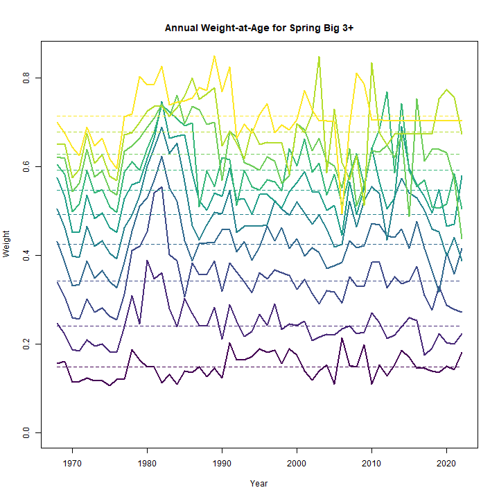
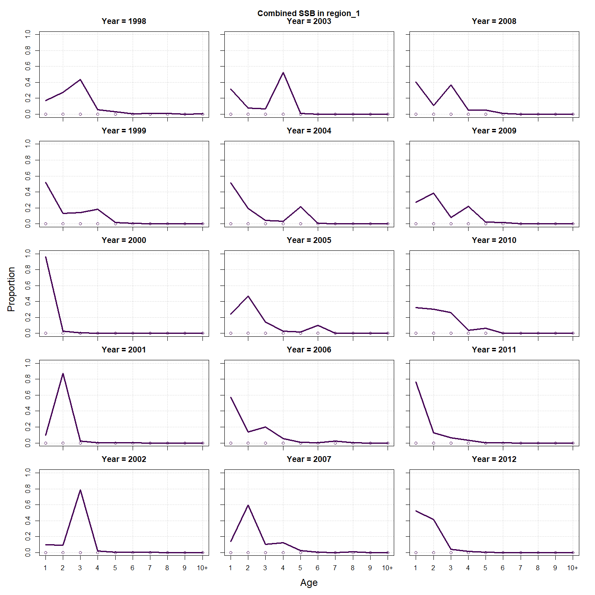
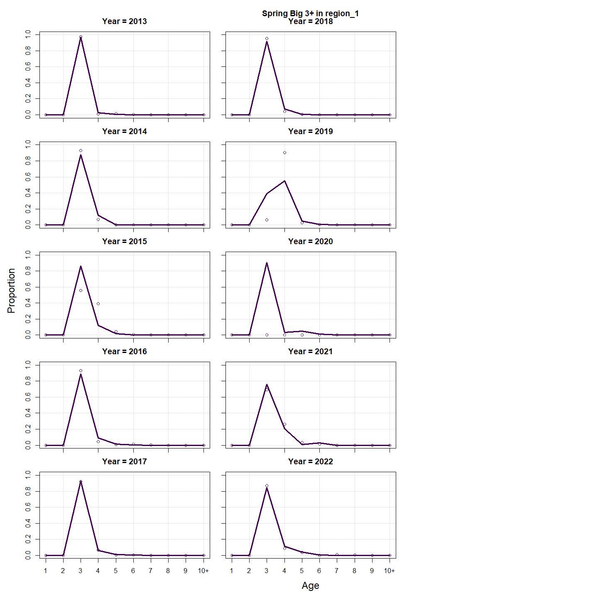
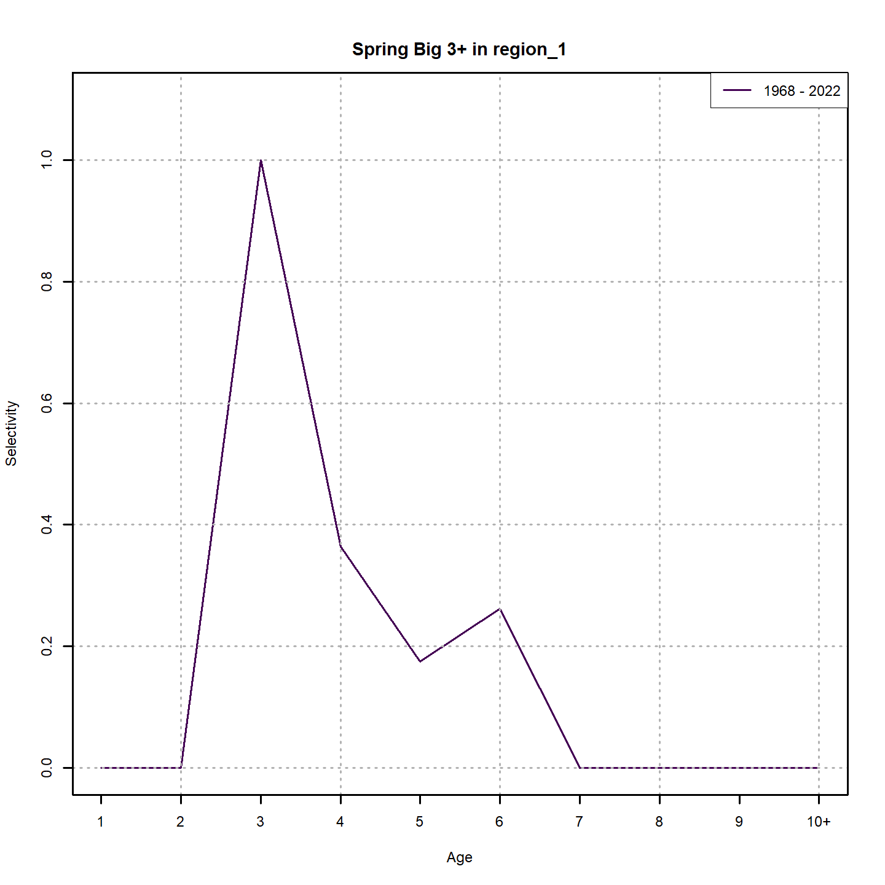
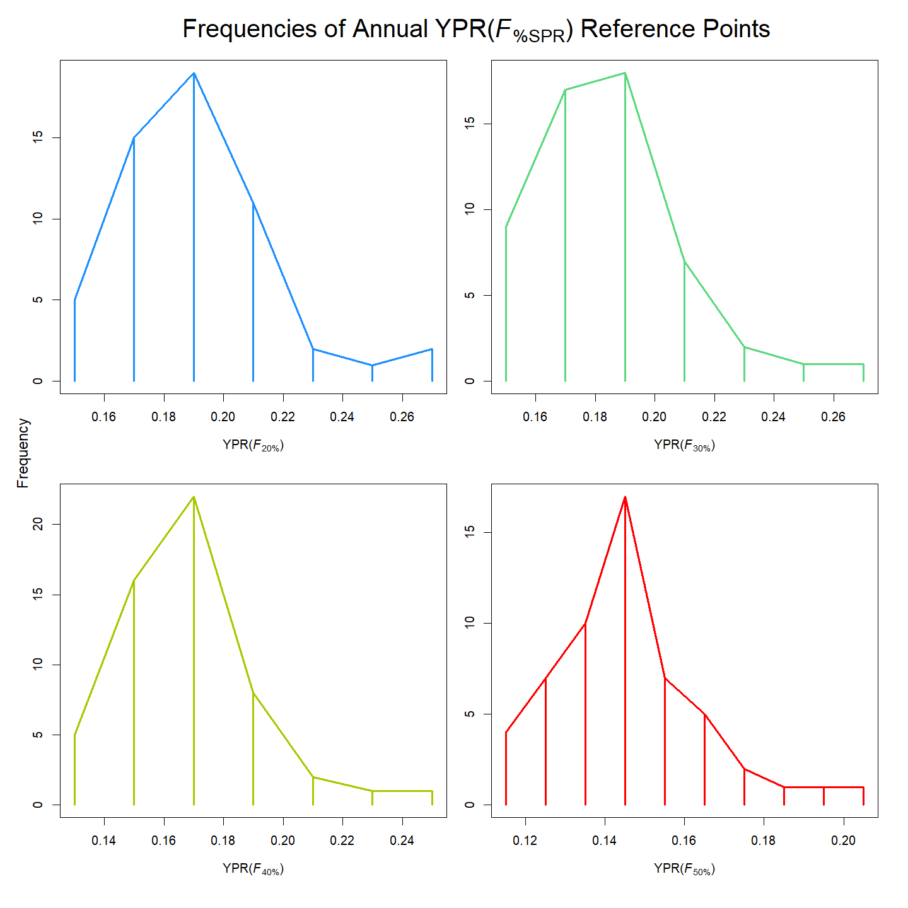
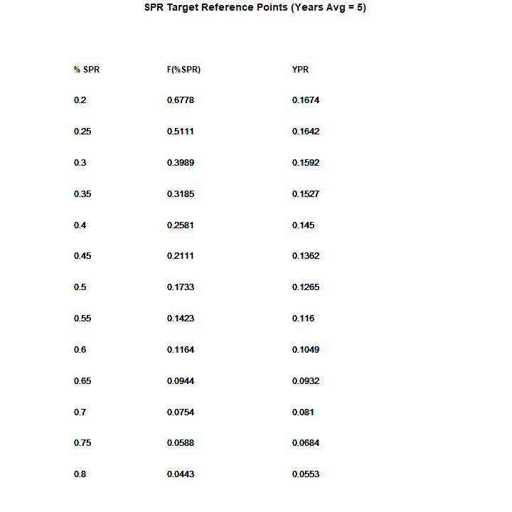
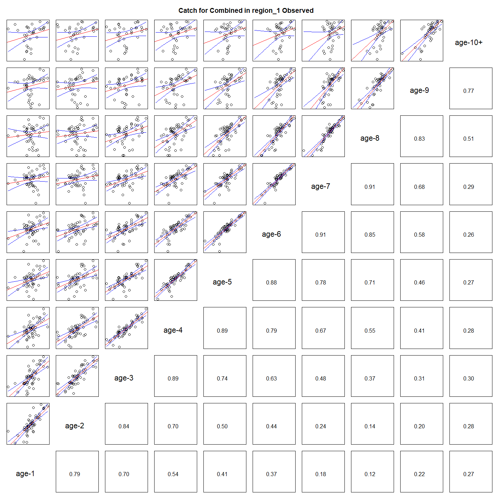
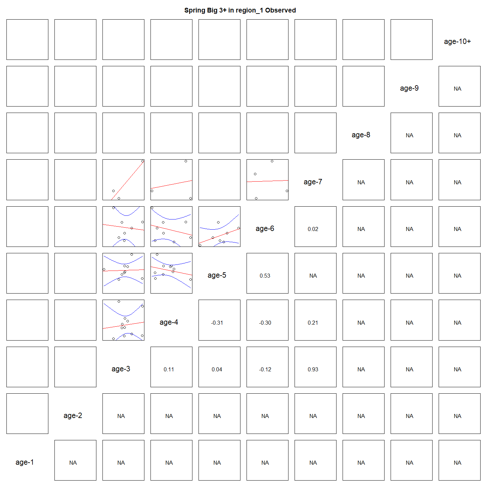

---
output:
  html_document:
    df_print: paged
    keep_md: yes
  word_document: default
  pdf_document:
    fig_caption: yes
    includes:
    keep_tex: yes
    number_sections: no
title: "WHAM figures and tables"
header-includes:
  - \usepackage{longtable}
  - \usepackage{booktabs}
  - \usepackage{caption,graphics}
  - \usepackage{makecell}
  - \usepackage{lscape}
  - \renewcommand\figurename{Fig.}
  - \captionsetup{labelsep=period, singlelinecheck=false}
  - \newcommand{\changesize}[1]{\fontsize{#1pt}{#1pt}\selectfont}
  - \renewcommand{\arraystretch}{1.5}
  - \renewcommand\theadfont{}
---

# {.tabset}

## Figures {.tabset}

### Input

### Diagnostics

### Results

### Retro

### Reference points

### Miscellaneous

## Tables {.tabset}

### Parameter estimates

<table class="table" style="margin-left: auto; margin-right: auto;">
<caption>Parameter estimates, standard errors, and confidence intervals. Rounded to 3 decimal places.</caption>
 <thead>
  <tr>
   <th style="text-align:left;">   </th>
   <th style="text-align:right;"> Estimate </th>
   <th style="text-align:right;"> Std. Error </th>
   <th style="text-align:right;"> 95\% CI lower </th>
   <th style="text-align:right;"> 95\% CI upper </th>
  </tr>
 </thead>
<tbody>
  <tr>
   <td style="text-align:left;"> Combined SSB fully selected q </td>
   <td style="text-align:right;"> $0.002$ </td>
   <td style="text-align:right;"> $3.167\times 10^{-4}$ </td>
   <td style="text-align:right;"> $0.002$ </td>
   <td style="text-align:right;"> $0.003$ </td>
  </tr>
  <tr>
   <td style="text-align:left;"> Spring Big 3+ fully selected q </td>
   <td style="text-align:right;"> $8.848\times 10^{-5}$ </td>
   <td style="text-align:right;"> $1.792\times 10^{-5}$ </td>
   <td style="text-align:right;"> $5.949\times 10^{-5}$ </td>
   <td style="text-align:right;"> $1.316\times 10^{-4}$ </td>
  </tr>
  <tr>
   <td style="text-align:left;"> Spring Alb 3+ fully selected q </td>
   <td style="text-align:right;"> $1.617\times 10^{-5}$ </td>
   <td style="text-align:right;"> $2.843\times 10^{-6}$ </td>
   <td style="text-align:right;"> $1.146\times 10^{-5}$ </td>
   <td style="text-align:right;"> $2.283\times 10^{-5}$ </td>
  </tr>
  <tr>
   <td style="text-align:left;"> Block 1: Combined Selectivity for age 1 </td>
   <td style="text-align:right;"> $0.101$ </td>
   <td style="text-align:right;"> $0.015$ </td>
   <td style="text-align:right;"> $0.076$ </td>
   <td style="text-align:right;"> $0.134$ </td>
  </tr>
  <tr>
   <td style="text-align:left;"> Block 1: Combined Selectivity for age 2 </td>
   <td style="text-align:right;"> $0.324$ </td>
   <td style="text-align:right;"> $0.044$ </td>
   <td style="text-align:right;"> $0.245$ </td>
   <td style="text-align:right;"> $0.415$ </td>
  </tr>
  <tr>
   <td style="text-align:left;"> Block 1: Combined Selectivity for age 3 </td>
   <td style="text-align:right;"> $0.544$ </td>
   <td style="text-align:right;"> $0.068$ </td>
   <td style="text-align:right;"> $0.410$ </td>
   <td style="text-align:right;"> $0.672$ </td>
  </tr>
  <tr>
   <td style="text-align:left;"> Block 1: Combined Selectivity for age 4 </td>
   <td style="text-align:right;"> $0.590$ </td>
   <td style="text-align:right;"> $0.074$ </td>
   <td style="text-align:right;"> $0.441$ </td>
   <td style="text-align:right;"> $0.724$ </td>
  </tr>
  <tr>
   <td style="text-align:left;"> Block 1: Combined Selectivity for age 5 </td>
   <td style="text-align:right;"> $1.000$ </td>
   <td style="text-align:right;"> $1.856\times 10^{-5}$ </td>
   <td style="text-align:right;"> $0.000$ </td>
   <td style="text-align:right;"> $1.000$ </td>
  </tr>
  <tr>
   <td style="text-align:left;"> Block 1: Combined Selectivity for age 6 </td>
   <td style="text-align:right;"> $1.000$ </td>
   <td style="text-align:right;"> -- </td>
   <td style="text-align:right;"> -- </td>
   <td style="text-align:right;"> -- </td>
  </tr>
  <tr>
   <td style="text-align:left;"> Block 1: Combined Selectivity for age 7 </td>
   <td style="text-align:right;"> $1.000$ </td>
   <td style="text-align:right;"> -- </td>
   <td style="text-align:right;"> -- </td>
   <td style="text-align:right;"> -- </td>
  </tr>
  <tr>
   <td style="text-align:left;"> Block 1: Combined Selectivity for age 8 </td>
   <td style="text-align:right;"> $1.000$ </td>
   <td style="text-align:right;"> -- </td>
   <td style="text-align:right;"> -- </td>
   <td style="text-align:right;"> -- </td>
  </tr>
  <tr>
   <td style="text-align:left;"> Block 1: Combined Selectivity for age 9 </td>
   <td style="text-align:right;"> $1.000$ </td>
   <td style="text-align:right;"> -- </td>
   <td style="text-align:right;"> -- </td>
   <td style="text-align:right;"> -- </td>
  </tr>
  <tr>
   <td style="text-align:left;"> Block 1: Combined Selectivity for age 10+ </td>
   <td style="text-align:right;"> $1.000$ </td>
   <td style="text-align:right;"> -- </td>
   <td style="text-align:right;"> -- </td>
   <td style="text-align:right;"> -- </td>
  </tr>
  <tr>
   <td style="text-align:left;"> Block 2: Combined SSB Selectivity for age 1 </td>
   <td style="text-align:right;"> $1.000$ </td>
   <td style="text-align:right;"> -- </td>
   <td style="text-align:right;"> -- </td>
   <td style="text-align:right;"> -- </td>
  </tr>
  <tr>
   <td style="text-align:left;"> Block 2: Combined SSB Selectivity for age 2 </td>
   <td style="text-align:right;"> $1.000$ </td>
   <td style="text-align:right;"> -- </td>
   <td style="text-align:right;"> -- </td>
   <td style="text-align:right;"> -- </td>
  </tr>
  <tr>
   <td style="text-align:left;"> Block 2: Combined SSB Selectivity for age 3 </td>
   <td style="text-align:right;"> $1.000$ </td>
   <td style="text-align:right;"> -- </td>
   <td style="text-align:right;"> -- </td>
   <td style="text-align:right;"> -- </td>
  </tr>
  <tr>
   <td style="text-align:left;"> Block 2: Combined SSB Selectivity for age 4 </td>
   <td style="text-align:right;"> $1.000$ </td>
   <td style="text-align:right;"> -- </td>
   <td style="text-align:right;"> -- </td>
   <td style="text-align:right;"> -- </td>
  </tr>
  <tr>
   <td style="text-align:left;"> Block 2: Combined SSB Selectivity for age 5 </td>
   <td style="text-align:right;"> $1.000$ </td>
   <td style="text-align:right;"> -- </td>
   <td style="text-align:right;"> -- </td>
   <td style="text-align:right;"> -- </td>
  </tr>
  <tr>
   <td style="text-align:left;"> Block 2: Combined SSB Selectivity for age 6 </td>
   <td style="text-align:right;"> $1.000$ </td>
   <td style="text-align:right;"> -- </td>
   <td style="text-align:right;"> -- </td>
   <td style="text-align:right;"> -- </td>
  </tr>
  <tr>
   <td style="text-align:left;"> Block 2: Combined SSB Selectivity for age 7 </td>
   <td style="text-align:right;"> $1.000$ </td>
   <td style="text-align:right;"> -- </td>
   <td style="text-align:right;"> -- </td>
   <td style="text-align:right;"> -- </td>
  </tr>
  <tr>
   <td style="text-align:left;"> Block 2: Combined SSB Selectivity for age 8 </td>
   <td style="text-align:right;"> $1.000$ </td>
   <td style="text-align:right;"> -- </td>
   <td style="text-align:right;"> -- </td>
   <td style="text-align:right;"> -- </td>
  </tr>
  <tr>
   <td style="text-align:left;"> Block 2: Combined SSB Selectivity for age 9 </td>
   <td style="text-align:right;"> $1.000$ </td>
   <td style="text-align:right;"> -- </td>
   <td style="text-align:right;"> -- </td>
   <td style="text-align:right;"> -- </td>
  </tr>
  <tr>
   <td style="text-align:left;"> Block 2: Combined SSB Selectivity for age 10+ </td>
   <td style="text-align:right;"> $1.000$ </td>
   <td style="text-align:right;"> -- </td>
   <td style="text-align:right;"> -- </td>
   <td style="text-align:right;"> -- </td>
  </tr>
  <tr>
   <td style="text-align:left;"> Block 3: Spring Big 3+ Selectivity for age 1 </td>
   <td style="text-align:right;"> $0.000$ </td>
   <td style="text-align:right;"> -- </td>
   <td style="text-align:right;"> -- </td>
   <td style="text-align:right;"> -- </td>
  </tr>
  <tr>
   <td style="text-align:left;"> Block 3: Spring Big 3+ Selectivity for age 2 </td>
   <td style="text-align:right;"> $0.000$ </td>
   <td style="text-align:right;"> -- </td>
   <td style="text-align:right;"> -- </td>
   <td style="text-align:right;"> -- </td>
  </tr>
  <tr>
   <td style="text-align:left;"> Block 3: Spring Big 3+ Selectivity for age 3 </td>
   <td style="text-align:right;"> $1.000$ </td>
   <td style="text-align:right;"> -- </td>
   <td style="text-align:right;"> -- </td>
   <td style="text-align:right;"> -- </td>
  </tr>
  <tr>
   <td style="text-align:left;"> Block 3: Spring Big 3+ Selectivity for age 4 </td>
   <td style="text-align:right;"> $0.364$ </td>
   <td style="text-align:right;"> $0.160$ </td>
   <td style="text-align:right;"> $0.129$ </td>
   <td style="text-align:right;"> $0.689$ </td>
  </tr>
  <tr>
   <td style="text-align:left;"> Block 3: Spring Big 3+ Selectivity for age 5 </td>
   <td style="text-align:right;"> $0.175$ </td>
   <td style="text-align:right;"> $0.082$ </td>
   <td style="text-align:right;"> $0.065$ </td>
   <td style="text-align:right;"> $0.393$ </td>
  </tr>
  <tr>
   <td style="text-align:left;"> Block 3: Spring Big 3+ Selectivity for age 6 </td>
   <td style="text-align:right;"> $0.262$ </td>
   <td style="text-align:right;"> $0.094$ </td>
   <td style="text-align:right;"> $0.120$ </td>
   <td style="text-align:right;"> $0.479$ </td>
  </tr>
  <tr>
   <td style="text-align:left;"> Block 3: Spring Big 3+ Selectivity for age 7 </td>
   <td style="text-align:right;"> $0.000$ </td>
   <td style="text-align:right;"> -- </td>
   <td style="text-align:right;"> -- </td>
   <td style="text-align:right;"> -- </td>
  </tr>
  <tr>
   <td style="text-align:left;"> Block 3: Spring Big 3+ Selectivity for age 8 </td>
   <td style="text-align:right;"> $0.000$ </td>
   <td style="text-align:right;"> -- </td>
   <td style="text-align:right;"> -- </td>
   <td style="text-align:right;"> -- </td>
  </tr>
  <tr>
   <td style="text-align:left;"> Block 3: Spring Big 3+ Selectivity for age 9 </td>
   <td style="text-align:right;"> $0.000$ </td>
   <td style="text-align:right;"> -- </td>
   <td style="text-align:right;"> -- </td>
   <td style="text-align:right;"> -- </td>
  </tr>
  <tr>
   <td style="text-align:left;"> Block 3: Spring Big 3+ Selectivity for age 10+ </td>
   <td style="text-align:right;"> $0.000$ </td>
   <td style="text-align:right;"> -- </td>
   <td style="text-align:right;"> -- </td>
   <td style="text-align:right;"> -- </td>
  </tr>
  <tr>
   <td style="text-align:left;"> Block 4: Spring Alb 3+ Selectivity for age 1 </td>
   <td style="text-align:right;"> $0.000$ </td>
   <td style="text-align:right;"> -- </td>
   <td style="text-align:right;"> -- </td>
   <td style="text-align:right;"> -- </td>
  </tr>
  <tr>
   <td style="text-align:left;"> Block 4: Spring Alb 3+ Selectivity for age 2 </td>
   <td style="text-align:right;"> $0.000$ </td>
   <td style="text-align:right;"> -- </td>
   <td style="text-align:right;"> -- </td>
   <td style="text-align:right;"> -- </td>
  </tr>
  <tr>
   <td style="text-align:left;"> Block 4: Spring Alb 3+ Selectivity for age 3 </td>
   <td style="text-align:right;"> $1.000$ </td>
   <td style="text-align:right;"> -- </td>
   <td style="text-align:right;"> -- </td>
   <td style="text-align:right;"> -- </td>
  </tr>
  <tr>
   <td style="text-align:left;"> Block 4: Spring Alb 3+ Selectivity for age 4 </td>
   <td style="text-align:right;"> $0.598$ </td>
   <td style="text-align:right;"> $0.148$ </td>
   <td style="text-align:right;"> $0.309$ </td>
   <td style="text-align:right;"> $0.833$ </td>
  </tr>
  <tr>
   <td style="text-align:left;"> Block 4: Spring Alb 3+ Selectivity for age 5 </td>
   <td style="text-align:right;"> $0.423$ </td>
   <td style="text-align:right;"> $0.105$ </td>
   <td style="text-align:right;"> $0.240$ </td>
   <td style="text-align:right;"> $0.630$ </td>
  </tr>
  <tr>
   <td style="text-align:left;"> Block 4: Spring Alb 3+ Selectivity for age 6 </td>
   <td style="text-align:right;"> $0.475$ </td>
   <td style="text-align:right;"> $0.089$ </td>
   <td style="text-align:right;"> $0.311$ </td>
   <td style="text-align:right;"> $0.645$ </td>
  </tr>
  <tr>
   <td style="text-align:left;"> Block 4: Spring Alb 3+ Selectivity for age 7 </td>
   <td style="text-align:right;"> $0.000$ </td>
   <td style="text-align:right;"> -- </td>
   <td style="text-align:right;"> -- </td>
   <td style="text-align:right;"> -- </td>
  </tr>
  <tr>
   <td style="text-align:left;"> Block 4: Spring Alb 3+ Selectivity for age 8 </td>
   <td style="text-align:right;"> $0.000$ </td>
   <td style="text-align:right;"> -- </td>
   <td style="text-align:right;"> -- </td>
   <td style="text-align:right;"> -- </td>
  </tr>
  <tr>
   <td style="text-align:left;"> Block 4: Spring Alb 3+ Selectivity for age 9 </td>
   <td style="text-align:right;"> $0.000$ </td>
   <td style="text-align:right;"> -- </td>
   <td style="text-align:right;"> -- </td>
   <td style="text-align:right;"> -- </td>
  </tr>
  <tr>
   <td style="text-align:left;"> Block 4: Spring Alb 3+ Selectivity for age 10+ </td>
   <td style="text-align:right;"> $0.000$ </td>
   <td style="text-align:right;"> -- </td>
   <td style="text-align:right;"> -- </td>
   <td style="text-align:right;"> -- </td>
  </tr>
  <tr>
   <td style="text-align:left;"> Combined in region 1 age comp, logistic-normal: $\sigma$ </td>
   <td style="text-align:right;"> $31.858$ </td>
   <td style="text-align:right;"> $1.083$ </td>
   <td style="text-align:right;"> $29.804$ </td>
   <td style="text-align:right;"> $34.052$ </td>
  </tr>
  <tr>
   <td style="text-align:left;"> Spring Big 3+ in region 1 age comp, logistic-normal: $\sigma$ </td>
   <td style="text-align:right;"> $38.622$ </td>
   <td style="text-align:right;"> $5.130$ </td>
   <td style="text-align:right;"> $29.769$ </td>
   <td style="text-align:right;"> $50.107$ </td>
  </tr>
  <tr>
   <td style="text-align:left;"> Spring Alb 3+ in region 1 age comp, logistic-normal: $\sigma$ </td>
   <td style="text-align:right;"> $32.769$ </td>
   <td style="text-align:right;"> $2.858$ </td>
   <td style="text-align:right;"> $27.620$ </td>
   <td style="text-align:right;"> $38.877$ </td>
  </tr>
</tbody>
</table>

### Abundance at age

<table class="table" style="margin-left: auto; margin-right: auto;">
<caption>Abundance at age (1000s) for stock 1 in region 1.</caption>
 <thead>
  <tr>
   <th style="text-align:left;">   </th>
   <th style="text-align:right;"> 1 </th>
   <th style="text-align:right;"> 2 </th>
   <th style="text-align:right;"> 3 </th>
   <th style="text-align:right;"> 4 </th>
   <th style="text-align:right;"> 5 </th>
   <th style="text-align:right;"> 6 </th>
   <th style="text-align:right;"> 7 </th>
   <th style="text-align:right;"> 8 </th>
   <th style="text-align:right;"> 9 </th>
   <th style="text-align:right;"> 10+ </th>
  </tr>
 </thead>
<tbody>
  <tr>
   <td style="text-align:left;"> 1968 </td>
   <td style="text-align:right;"> 4798836 </td>
   <td style="text-align:right;"> 1826865 </td>
   <td style="text-align:right;"> 301547 </td>
   <td style="text-align:right;"> 79236 </td>
   <td style="text-align:right;"> 45052 </td>
   <td style="text-align:right;"> 39370 </td>
   <td style="text-align:right;"> 31088 </td>
   <td style="text-align:right;"> 11148 </td>
   <td style="text-align:right;"> 85754 </td>
   <td style="text-align:right;"> 745 </td>
  </tr>
  <tr>
   <td style="text-align:left;"> 1969 </td>
   <td style="text-align:right;"> 2497957 </td>
   <td style="text-align:right;"> 3824827 </td>
   <td style="text-align:right;"> 1372788 </td>
   <td style="text-align:right;"> 213768 </td>
   <td style="text-align:right;"> 55501 </td>
   <td style="text-align:right;"> 28309 </td>
   <td style="text-align:right;"> 24739 </td>
   <td style="text-align:right;"> 19535 </td>
   <td style="text-align:right;"> 7005 </td>
   <td style="text-align:right;"> 54353 </td>
  </tr>
  <tr>
   <td style="text-align:left;"> 1970 </td>
   <td style="text-align:right;"> 2528040 </td>
   <td style="text-align:right;"> 1997334 </td>
   <td style="text-align:right;"> 2903659 </td>
   <td style="text-align:right;"> 990015 </td>
   <td style="text-align:right;"> 152544 </td>
   <td style="text-align:right;"> 35992 </td>
   <td style="text-align:right;"> 18358 </td>
   <td style="text-align:right;"> 16043 </td>
   <td style="text-align:right;"> 12668 </td>
   <td style="text-align:right;"> 39790 </td>
  </tr>
  <tr>
   <td style="text-align:left;"> 1971 </td>
   <td style="text-align:right;"> 804928 </td>
   <td style="text-align:right;"> 2003252 </td>
   <td style="text-align:right;"> 1473289 </td>
   <td style="text-align:right;"> 1995240 </td>
   <td style="text-align:right;"> 670442 </td>
   <td style="text-align:right;"> 90518 </td>
   <td style="text-align:right;"> 21357 </td>
   <td style="text-align:right;"> 10893 </td>
   <td style="text-align:right;"> 9520 </td>
   <td style="text-align:right;"> 31128 </td>
  </tr>
  <tr>
   <td style="text-align:left;"> 1972 </td>
   <td style="text-align:right;"> 645470 </td>
   <td style="text-align:right;"> 629387 </td>
   <td style="text-align:right;"> 1416067 </td>
   <td style="text-align:right;"> 942504 </td>
   <td style="text-align:right;"> 1250480 </td>
   <td style="text-align:right;"> 348855 </td>
   <td style="text-align:right;"> 47100 </td>
   <td style="text-align:right;"> 11113 </td>
   <td style="text-align:right;"> 5668 </td>
   <td style="text-align:right;"> 21150 </td>
  </tr>
  <tr>
   <td style="text-align:left;"> 1973 </td>
   <td style="text-align:right;"> 667596 </td>
   <td style="text-align:right;"> 506627 </td>
   <td style="text-align:right;"> 450339 </td>
   <td style="text-align:right;"> 924563 </td>
   <td style="text-align:right;"> 603892 </td>
   <td style="text-align:right;"> 675513 </td>
   <td style="text-align:right;"> 188452 </td>
   <td style="text-align:right;"> 25443 </td>
   <td style="text-align:right;"> 6003 </td>
   <td style="text-align:right;"> 14487 </td>
  </tr>
  <tr>
   <td style="text-align:left;"> 1974 </td>
   <td style="text-align:right;"> 1008971 </td>
   <td style="text-align:right;"> 515026 </td>
   <td style="text-align:right;"> 343063 </td>
   <td style="text-align:right;"> 268034 </td>
   <td style="text-align:right;"> 535878 </td>
   <td style="text-align:right;"> 275203 </td>
   <td style="text-align:right;"> 307842 </td>
   <td style="text-align:right;"> 85881 </td>
   <td style="text-align:right;"> 11595 </td>
   <td style="text-align:right;"> 9338 </td>
  </tr>
  <tr>
   <td style="text-align:left;"> 1975 </td>
   <td style="text-align:right;"> 1100419 </td>
   <td style="text-align:right;"> 771831 </td>
   <td style="text-align:right;"> 339463 </td>
   <td style="text-align:right;"> 195135 </td>
   <td style="text-align:right;"> 147908 </td>
   <td style="text-align:right;"> 224691 </td>
   <td style="text-align:right;"> 115391 </td>
   <td style="text-align:right;"> 129077 </td>
   <td style="text-align:right;"> 36009 </td>
   <td style="text-align:right;"> 8777 </td>
  </tr>
  <tr>
   <td style="text-align:left;"> 1976 </td>
   <td style="text-align:right;"> 133654 </td>
   <td style="text-align:right;"> 821425 </td>
   <td style="text-align:right;"> 470473 </td>
   <td style="text-align:right;"> 169328 </td>
   <td style="text-align:right;"> 93405 </td>
   <td style="text-align:right;"> 48724 </td>
   <td style="text-align:right;"> 74018 </td>
   <td style="text-align:right;"> 38012 </td>
   <td style="text-align:right;"> 42520 </td>
   <td style="text-align:right;"> 14754 </td>
  </tr>
  <tr>
   <td style="text-align:left;"> 1977 </td>
   <td style="text-align:right;"> 34747 </td>
   <td style="text-align:right;"> 95181 </td>
   <td style="text-align:right;"> 430842 </td>
   <td style="text-align:right;"> 182330 </td>
   <td style="text-align:right;"> 61664 </td>
   <td style="text-align:right;"> 19352 </td>
   <td style="text-align:right;"> 10095 </td>
   <td style="text-align:right;"> 15335 </td>
   <td style="text-align:right;"> 7876 </td>
   <td style="text-align:right;"> 11866 </td>
  </tr>
  <tr>
   <td style="text-align:left;"> 1978 </td>
   <td style="text-align:right;"> 16151 </td>
   <td style="text-align:right;"> 26944 </td>
   <td style="text-align:right;"> 65513 </td>
   <td style="text-align:right;"> 263554 </td>
   <td style="text-align:right;"> 108863 </td>
   <td style="text-align:right;"> 29552 </td>
   <td style="text-align:right;"> 9274 </td>
   <td style="text-align:right;"> 4838 </td>
   <td style="text-align:right;"> 7349 </td>
   <td style="text-align:right;"> 9461 </td>
  </tr>
  <tr>
   <td style="text-align:left;"> 1979 </td>
   <td style="text-align:right;"> 67485 </td>
   <td style="text-align:right;"> 12980 </td>
   <td style="text-align:right;"> 20789 </td>
   <td style="text-align:right;"> 48551 </td>
   <td style="text-align:right;"> 193707 </td>
   <td style="text-align:right;"> 74221 </td>
   <td style="text-align:right;"> 20148 </td>
   <td style="text-align:right;"> 6323 </td>
   <td style="text-align:right;"> 3298 </td>
   <td style="text-align:right;"> 11461 </td>
  </tr>
  <tr>
   <td style="text-align:left;"> 1980 </td>
   <td style="text-align:right;"> 20123 </td>
   <td style="text-align:right;"> 54135 </td>
   <td style="text-align:right;"> 9956 </td>
   <td style="text-align:right;"> 15255 </td>
   <td style="text-align:right;"> 35303 </td>
   <td style="text-align:right;"> 129684 </td>
   <td style="text-align:right;"> 49690 </td>
   <td style="text-align:right;"> 13489 </td>
   <td style="text-align:right;"> 4233 </td>
   <td style="text-align:right;"> 9881 </td>
  </tr>
  <tr>
   <td style="text-align:left;"> 1981 </td>
   <td style="text-align:right;"> 92183 </td>
   <td style="text-align:right;"> 16179 </td>
   <td style="text-align:right;"> 41825 </td>
   <td style="text-align:right;"> 7395 </td>
   <td style="text-align:right;"> 11239 </td>
   <td style="text-align:right;"> 24169 </td>
   <td style="text-align:right;"> 88784 </td>
   <td style="text-align:right;"> 34018 </td>
   <td style="text-align:right;"> 9235 </td>
   <td style="text-align:right;"> 9663 </td>
  </tr>
  <tr>
   <td style="text-align:left;"> 1982 </td>
   <td style="text-align:right;"> 270229 </td>
   <td style="text-align:right;"> 73504 </td>
   <td style="text-align:right;"> 12174 </td>
   <td style="text-align:right;"> 29717 </td>
   <td style="text-align:right;"> 5193 </td>
   <td style="text-align:right;"> 7092 </td>
   <td style="text-align:right;"> 15250 </td>
   <td style="text-align:right;"> 56019 </td>
   <td style="text-align:right;"> 21464 </td>
   <td style="text-align:right;"> 11924 </td>
  </tr>
  <tr>
   <td style="text-align:left;"> 1983 </td>
   <td style="text-align:right;"> 2286461 </td>
   <td style="text-align:right;"> 214471 </td>
   <td style="text-align:right;"> 54492 </td>
   <td style="text-align:right;"> 8436 </td>
   <td style="text-align:right;"> 20310 </td>
   <td style="text-align:right;"> 3130 </td>
   <td style="text-align:right;"> 4274 </td>
   <td style="text-align:right;"> 9191 </td>
   <td style="text-align:right;"> 33762 </td>
   <td style="text-align:right;"> 20122 </td>
  </tr>
  <tr>
   <td style="text-align:left;"> 1984 </td>
   <td style="text-align:right;"> 57395 </td>
   <td style="text-align:right;"> 1814987 </td>
   <td style="text-align:right;"> 159084 </td>
   <td style="text-align:right;"> 37796 </td>
   <td style="text-align:right;"> 5771 </td>
   <td style="text-align:right;"> 12261 </td>
   <td style="text-align:right;"> 1889 </td>
   <td style="text-align:right;"> 2580 </td>
   <td style="text-align:right;"> 5548 </td>
   <td style="text-align:right;"> 32529 </td>
  </tr>
  <tr>
   <td style="text-align:left;"> 1985 </td>
   <td style="text-align:right;"> 129312 </td>
   <td style="text-align:right;"> 46022 </td>
   <td style="text-align:right;"> 1390323 </td>
   <td style="text-align:right;"> 116474 </td>
   <td style="text-align:right;"> 27417 </td>
   <td style="text-align:right;"> 3848 </td>
   <td style="text-align:right;"> 8175 </td>
   <td style="text-align:right;"> 1260 </td>
   <td style="text-align:right;"> 1720 </td>
   <td style="text-align:right;"> 25388 </td>
  </tr>
  <tr>
   <td style="text-align:left;"> 1986 </td>
   <td style="text-align:right;"> 75923 </td>
   <td style="text-align:right;"> 102905 </td>
   <td style="text-align:right;"> 34410 </td>
   <td style="text-align:right;"> 977371 </td>
   <td style="text-align:right;"> 80847 </td>
   <td style="text-align:right;"> 16964 </td>
   <td style="text-align:right;"> 2381 </td>
   <td style="text-align:right;"> 5058 </td>
   <td style="text-align:right;"> 779 </td>
   <td style="text-align:right;"> 16773 </td>
  </tr>
  <tr>
   <td style="text-align:left;"> 1987 </td>
   <td style="text-align:right;"> 71280 </td>
   <td style="text-align:right;"> 60385 </td>
   <td style="text-align:right;"> 76807 </td>
   <td style="text-align:right;"> 24119 </td>
   <td style="text-align:right;"> 676252 </td>
   <td style="text-align:right;"> 49754 </td>
   <td style="text-align:right;"> 10440 </td>
   <td style="text-align:right;"> 1465 </td>
   <td style="text-align:right;"> 3113 </td>
   <td style="text-align:right;"> 10802 </td>
  </tr>
  <tr>
   <td style="text-align:left;"> 1988 </td>
   <td style="text-align:right;"> 329915 </td>
   <td style="text-align:right;"> 56660 </td>
   <td style="text-align:right;"> 44987 </td>
   <td style="text-align:right;"> 53667 </td>
   <td style="text-align:right;"> 16632 </td>
   <td style="text-align:right;"> 413789 </td>
   <td style="text-align:right;"> 30444 </td>
   <td style="text-align:right;"> 6388 </td>
   <td style="text-align:right;"> 897 </td>
   <td style="text-align:right;"> 8514 </td>
  </tr>
  <tr>
   <td style="text-align:left;"> 1989 </td>
   <td style="text-align:right;"> 595715 </td>
   <td style="text-align:right;"> 259169 </td>
   <td style="text-align:right;"> 40651 </td>
   <td style="text-align:right;"> 29507 </td>
   <td style="text-align:right;"> 34556 </td>
   <td style="text-align:right;"> 9060 </td>
   <td style="text-align:right;"> 225409 </td>
   <td style="text-align:right;"> 16584 </td>
   <td style="text-align:right;"> 3480 </td>
   <td style="text-align:right;"> 5127 </td>
  </tr>
  <tr>
   <td style="text-align:left;"> 1990 </td>
   <td style="text-align:right;"> 116710 </td>
   <td style="text-align:right;"> 464992 </td>
   <td style="text-align:right;"> 182191 </td>
   <td style="text-align:right;"> 25765 </td>
   <td style="text-align:right;"> 18307 </td>
   <td style="text-align:right;"> 17676 </td>
   <td style="text-align:right;"> 4634 </td>
   <td style="text-align:right;"> 115301 </td>
   <td style="text-align:right;"> 8483 </td>
   <td style="text-align:right;"> 4402 </td>
  </tr>
  <tr>
   <td style="text-align:left;"> 1991 </td>
   <td style="text-align:right;"> 269970 </td>
   <td style="text-align:right;"> 88680 </td>
   <td style="text-align:right;"> 299963 </td>
   <td style="text-align:right;"> 99953 </td>
   <td style="text-align:right;"> 13672 </td>
   <td style="text-align:right;"> 7183 </td>
   <td style="text-align:right;"> 6935 </td>
   <td style="text-align:right;"> 1818 </td>
   <td style="text-align:right;"> 45240 </td>
   <td style="text-align:right;"> 5056 </td>
  </tr>
  <tr>
   <td style="text-align:left;"> 1992 </td>
   <td style="text-align:right;"> 153235 </td>
   <td style="text-align:right;"> 207372 </td>
   <td style="text-align:right;"> 59225 </td>
   <td style="text-align:right;"> 174435 </td>
   <td style="text-align:right;"> 56494 </td>
   <td style="text-align:right;"> 5970 </td>
   <td style="text-align:right;"> 3137 </td>
   <td style="text-align:right;"> 3029 </td>
   <td style="text-align:right;"> 794 </td>
   <td style="text-align:right;"> 21963 </td>
  </tr>
  <tr>
   <td style="text-align:left;"> 1993 </td>
   <td style="text-align:right;"> 43042 </td>
   <td style="text-align:right;"> 119942 </td>
   <td style="text-align:right;"> 147076 </td>
   <td style="text-align:right;"> 38100 </td>
   <td style="text-align:right;"> 109986 </td>
   <td style="text-align:right;"> 29699 </td>
   <td style="text-align:right;"> 3139 </td>
   <td style="text-align:right;"> 1649 </td>
   <td style="text-align:right;"> 1592 </td>
   <td style="text-align:right;"> 11963 </td>
  </tr>
  <tr>
   <td style="text-align:left;"> 1994 </td>
   <td style="text-align:right;"> 87679 </td>
   <td style="text-align:right;"> 33900 </td>
   <td style="text-align:right;"> 86769 </td>
   <td style="text-align:right;"> 97816 </td>
   <td style="text-align:right;"> 24905 </td>
   <td style="text-align:right;"> 61465 </td>
   <td style="text-align:right;"> 16597 </td>
   <td style="text-align:right;"> 1754 </td>
   <td style="text-align:right;"> 922 </td>
   <td style="text-align:right;"> 7575 </td>
  </tr>
  <tr>
   <td style="text-align:left;"> 1995 </td>
   <td style="text-align:right;"> 74439 </td>
   <td style="text-align:right;"> 68107 </td>
   <td style="text-align:right;"> 23463 </td>
   <td style="text-align:right;"> 53577 </td>
   <td style="text-align:right;"> 58997 </td>
   <td style="text-align:right;"> 12142 </td>
   <td style="text-align:right;"> 29967 </td>
   <td style="text-align:right;"> 8092 </td>
   <td style="text-align:right;"> 855 </td>
   <td style="text-align:right;"> 4143 </td>
  </tr>
  <tr>
   <td style="text-align:left;"> 1996 </td>
   <td style="text-align:right;"> 281851 </td>
   <td style="text-align:right;"> 58331 </td>
   <td style="text-align:right;"> 48476 </td>
   <td style="text-align:right;"> 15185 </td>
   <td style="text-align:right;"> 34001 </td>
   <td style="text-align:right;"> 31357 </td>
   <td style="text-align:right;"> 6454 </td>
   <td style="text-align:right;"> 15928 </td>
   <td style="text-align:right;"> 4301 </td>
   <td style="text-align:right;"> 2656 </td>
  </tr>
  <tr>
   <td style="text-align:left;"> 1997 </td>
   <td style="text-align:right;"> 95270 </td>
   <td style="text-align:right;"> 212122 </td>
   <td style="text-align:right;"> 36498 </td>
   <td style="text-align:right;"> 25266 </td>
   <td style="text-align:right;"> 7623 </td>
   <td style="text-align:right;"> 12142 </td>
   <td style="text-align:right;"> 11198 </td>
   <td style="text-align:right;"> 2305 </td>
   <td style="text-align:right;"> 5688 </td>
   <td style="text-align:right;"> 2484 </td>
  </tr>
  <tr>
   <td style="text-align:left;"> 1998 </td>
   <td style="text-align:right;"> 38941 </td>
   <td style="text-align:right;"> 70411 </td>
   <td style="text-align:right;"> 125253 </td>
   <td style="text-align:right;"> 17259 </td>
   <td style="text-align:right;"> 11414 </td>
   <td style="text-align:right;"> 2276 </td>
   <td style="text-align:right;"> 3626 </td>
   <td style="text-align:right;"> 3344 </td>
   <td style="text-align:right;"> 688 </td>
   <td style="text-align:right;"> 2440 </td>
  </tr>
  <tr>
   <td style="text-align:left;"> 1999 </td>
   <td style="text-align:right;"> 85293 </td>
   <td style="text-align:right;"> 28187 </td>
   <td style="text-align:right;"> 38902 </td>
   <td style="text-align:right;"> 52971 </td>
   <td style="text-align:right;"> 6909 </td>
   <td style="text-align:right;"> 2776 </td>
   <td style="text-align:right;"> 554 </td>
   <td style="text-align:right;"> 882 </td>
   <td style="text-align:right;"> 813 </td>
   <td style="text-align:right;"> 761 </td>
  </tr>
  <tr>
   <td style="text-align:left;"> 2000 </td>
   <td style="text-align:right;"> 1671976 </td>
   <td style="text-align:right;"> 52366 </td>
   <td style="text-align:right;"> 9206 </td>
   <td style="text-align:right;"> 6804 </td>
   <td style="text-align:right;"> 8148 </td>
   <td style="text-align:right;"> 332 </td>
   <td style="text-align:right;"> 133 </td>
   <td style="text-align:right;"> 27 </td>
   <td style="text-align:right;"> 42 </td>
   <td style="text-align:right;"> 76 </td>
  </tr>
  <tr>
   <td style="text-align:left;"> 2001 </td>
   <td style="text-align:right;"> 130369 </td>
   <td style="text-align:right;"> 1267434 </td>
   <td style="text-align:right;"> 33528 </td>
   <td style="text-align:right;"> 4987 </td>
   <td style="text-align:right;"> 3561 </td>
   <td style="text-align:right;"> 3124 </td>
   <td style="text-align:right;"> 127 </td>
   <td style="text-align:right;"> 51 </td>
   <td style="text-align:right;"> 10 </td>
   <td style="text-align:right;"> 45 </td>
  </tr>
  <tr>
   <td style="text-align:left;"> 2002 </td>
   <td style="text-align:right;"> 102376 </td>
   <td style="text-align:right;"> 102192 </td>
   <td style="text-align:right;"> 903091 </td>
   <td style="text-align:right;"> 21737 </td>
   <td style="text-align:right;"> 3171 </td>
   <td style="text-align:right;"> 1899 </td>
   <td style="text-align:right;"> 1666 </td>
   <td style="text-align:right;"> 68 </td>
   <td style="text-align:right;"> 27 </td>
   <td style="text-align:right;"> 30 </td>
  </tr>
  <tr>
   <td style="text-align:left;"> 2003 </td>
   <td style="text-align:right;"> 308429 </td>
   <td style="text-align:right;"> 79893 </td>
   <td style="text-align:right;"> 71788 </td>
   <td style="text-align:right;"> 571694 </td>
   <td style="text-align:right;"> 13469 </td>
   <td style="text-align:right;"> 1619 </td>
   <td style="text-align:right;"> 969 </td>
   <td style="text-align:right;"> 850 </td>
   <td style="text-align:right;"> 35 </td>
   <td style="text-align:right;"> 29 </td>
  </tr>
  <tr>
   <td style="text-align:left;"> 2004 </td>
   <td style="text-align:right;"> 593835 </td>
   <td style="text-align:right;"> 237556 </td>
   <td style="text-align:right;"> 53820 </td>
   <td style="text-align:right;"> 42356 </td>
   <td style="text-align:right;"> 328244 </td>
   <td style="text-align:right;"> 6041 </td>
   <td style="text-align:right;"> 726 </td>
   <td style="text-align:right;"> 435 </td>
   <td style="text-align:right;"> 381 </td>
   <td style="text-align:right;"> 29 </td>
  </tr>
  <tr>
   <td style="text-align:left;"> 2005 </td>
   <td style="text-align:right;"> 212074 </td>
   <td style="text-align:right;"> 450857 </td>
   <td style="text-align:right;"> 152858 </td>
   <td style="text-align:right;"> 29401 </td>
   <td style="text-align:right;"> 22373 </td>
   <td style="text-align:right;"> 127789 </td>
   <td style="text-align:right;"> 2352 </td>
   <td style="text-align:right;"> 283 </td>
   <td style="text-align:right;"> 169 </td>
   <td style="text-align:right;"> 160 </td>
  </tr>
  <tr>
   <td style="text-align:left;"> 2006 </td>
   <td style="text-align:right;"> 576545 </td>
   <td style="text-align:right;"> 156881 </td>
   <td style="text-align:right;"> 267003 </td>
   <td style="text-align:right;"> 72639 </td>
   <td style="text-align:right;"> 13353 </td>
   <td style="text-align:right;"> 6742 </td>
   <td style="text-align:right;"> 38509 </td>
   <td style="text-align:right;"> 709 </td>
   <td style="text-align:right;"> 85 </td>
   <td style="text-align:right;"> 99 </td>
  </tr>
  <tr>
   <td style="text-align:left;"> 2007 </td>
   <td style="text-align:right;"> 84148 </td>
   <td style="text-align:right;"> 404308 </td>
   <td style="text-align:right;"> 78336 </td>
   <td style="text-align:right;"> 95272 </td>
   <td style="text-align:right;"> 24189 </td>
   <td style="text-align:right;"> 2377 </td>
   <td style="text-align:right;"> 1200 </td>
   <td style="text-align:right;"> 6855 </td>
   <td style="text-align:right;"> 126 </td>
   <td style="text-align:right;"> 33 </td>
  </tr>
  <tr>
   <td style="text-align:left;"> 2008 </td>
   <td style="text-align:right;"> 204989 </td>
   <td style="text-align:right;"> 61067 </td>
   <td style="text-align:right;"> 225221 </td>
   <td style="text-align:right;"> 33589 </td>
   <td style="text-align:right;"> 38711 </td>
   <td style="text-align:right;"> 6035 </td>
   <td style="text-align:right;"> 593 </td>
   <td style="text-align:right;"> 299 </td>
   <td style="text-align:right;"> 1710 </td>
   <td style="text-align:right;"> 40 </td>
  </tr>
  <tr>
   <td style="text-align:left;"> 2009 </td>
   <td style="text-align:right;"> 88833 </td>
   <td style="text-align:right;"> 151530 </td>
   <td style="text-align:right;"> 36080 </td>
   <td style="text-align:right;"> 106608 </td>
   <td style="text-align:right;"> 15191 </td>
   <td style="text-align:right;"> 11582 </td>
   <td style="text-align:right;"> 1806 </td>
   <td style="text-align:right;"> 177 </td>
   <td style="text-align:right;"> 90 </td>
   <td style="text-align:right;"> 524 </td>
  </tr>
  <tr>
   <td style="text-align:left;"> 2010 </td>
   <td style="text-align:right;"> 48275 </td>
   <td style="text-align:right;"> 60170 </td>
   <td style="text-align:right;"> 67726 </td>
   <td style="text-align:right;"> 10687 </td>
   <td style="text-align:right;"> 29018 </td>
   <td style="text-align:right;"> 1921 </td>
   <td style="text-align:right;"> 1465 </td>
   <td style="text-align:right;"> 228 </td>
   <td style="text-align:right;"> 22 </td>
   <td style="text-align:right;"> 78 </td>
  </tr>
  <tr>
   <td style="text-align:left;"> 2011 </td>
   <td style="text-align:right;"> 137840 </td>
   <td style="text-align:right;"> 29259 </td>
   <td style="text-align:right;"> 18859 </td>
   <td style="text-align:right;"> 11054 </td>
   <td style="text-align:right;"> 1525 </td>
   <td style="text-align:right;"> 1227 </td>
   <td style="text-align:right;"> 81 </td>
   <td style="text-align:right;"> 62 </td>
   <td style="text-align:right;"> 10 </td>
   <td style="text-align:right;"> 4 </td>
  </tr>
  <tr>
   <td style="text-align:left;"> 2012 </td>
   <td style="text-align:right;"> 89914 </td>
   <td style="text-align:right;"> 87106 </td>
   <td style="text-align:right;"> 10479 </td>
   <td style="text-align:right;"> 3851 </td>
   <td style="text-align:right;"> 2011 </td>
   <td style="text-align:right;"> 97 </td>
   <td style="text-align:right;"> 78 </td>
   <td style="text-align:right;"> 5 </td>
   <td style="text-align:right;"> 4 </td>
   <td style="text-align:right;"> 1 </td>
  </tr>
  <tr>
   <td style="text-align:left;"> 2013 </td>
   <td style="text-align:right;"> 67358 </td>
   <td style="text-align:right;"> 58783 </td>
   <td style="text-align:right;"> 34770 </td>
   <td style="text-align:right;"> 2567 </td>
   <td style="text-align:right;"> 853 </td>
   <td style="text-align:right;"> 179 </td>
   <td style="text-align:right;"> 9 </td>
   <td style="text-align:right;"> 7 </td>
   <td style="text-align:right;"> 0 </td>
   <td style="text-align:right;"> 0 </td>
  </tr>
  <tr>
   <td style="text-align:left;"> 2014 </td>
   <td style="text-align:right;"> 74722 </td>
   <td style="text-align:right;"> 45163 </td>
   <td style="text-align:right;"> 25435 </td>
   <td style="text-align:right;"> 9754 </td>
   <td style="text-align:right;"> 659 </td>
   <td style="text-align:right;"> 98 </td>
   <td style="text-align:right;"> 21 </td>
   <td style="text-align:right;"> 1 </td>
   <td style="text-align:right;"> 1 </td>
   <td style="text-align:right;"> 0 </td>
  </tr>
  <tr>
   <td style="text-align:left;"> 2015 </td>
   <td style="text-align:right;"> 146388 </td>
   <td style="text-align:right;"> 51344 </td>
   <td style="text-align:right;"> 21133 </td>
   <td style="text-align:right;"> 8138 </td>
   <td style="text-align:right;"> 2886 </td>
   <td style="text-align:right;"> 96 </td>
   <td style="text-align:right;"> 14 </td>
   <td style="text-align:right;"> 3 </td>
   <td style="text-align:right;"> 0 </td>
   <td style="text-align:right;"> 0 </td>
  </tr>
  <tr>
   <td style="text-align:left;"> 2016 </td>
   <td style="text-align:right;"> 269728 </td>
   <td style="text-align:right;"> 102347 </td>
   <td style="text-align:right;"> 25392 </td>
   <td style="text-align:right;"> 7420 </td>
   <td style="text-align:right;"> 2663 </td>
   <td style="text-align:right;"> 499 </td>
   <td style="text-align:right;"> 17 </td>
   <td style="text-align:right;"> 2 </td>
   <td style="text-align:right;"> 1 </td>
   <td style="text-align:right;"> 0 </td>
  </tr>
  <tr>
   <td style="text-align:left;"> 2017 </td>
   <td style="text-align:right;"> 28532 </td>
   <td style="text-align:right;"> 194955 </td>
   <td style="text-align:right;"> 56283 </td>
   <td style="text-align:right;"> 10655 </td>
   <td style="text-align:right;"> 2945 </td>
   <td style="text-align:right;"> 638 </td>
   <td style="text-align:right;"> 120 </td>
   <td style="text-align:right;"> 4 </td>
   <td style="text-align:right;"> 1 </td>
   <td style="text-align:right;"> 0 </td>
  </tr>
  <tr>
   <td style="text-align:left;"> 2018 </td>
   <td style="text-align:right;"> 122565 </td>
   <td style="text-align:right;"> 20577 </td>
   <td style="text-align:right;"> 106468 </td>
   <td style="text-align:right;"> 23343 </td>
   <td style="text-align:right;"> 4176 </td>
   <td style="text-align:right;"> 691 </td>
   <td style="text-align:right;"> 150 </td>
   <td style="text-align:right;"> 28 </td>
   <td style="text-align:right;"> 1 </td>
   <td style="text-align:right;"> 0 </td>
  </tr>
  <tr>
   <td style="text-align:left;"> 2019 </td>
   <td style="text-align:right;"> 70038 </td>
   <td style="text-align:right;"> 88131 </td>
   <td style="text-align:right;"> 11131 </td>
   <td style="text-align:right;"> 43454 </td>
   <td style="text-align:right;"> 8991 </td>
   <td style="text-align:right;"> 952 </td>
   <td style="text-align:right;"> 157 </td>
   <td style="text-align:right;"> 34 </td>
   <td style="text-align:right;"> 6 </td>
   <td style="text-align:right;"> 0 </td>
  </tr>
  <tr>
   <td style="text-align:left;"> 2020 </td>
   <td style="text-align:right;"> 84739 </td>
   <td style="text-align:right;"> 51522 </td>
   <td style="text-align:right;"> 51271 </td>
   <td style="text-align:right;"> 5134 </td>
   <td style="text-align:right;"> 19107 </td>
   <td style="text-align:right;"> 2565 </td>
   <td style="text-align:right;"> 271 </td>
   <td style="text-align:right;"> 45 </td>
   <td style="text-align:right;"> 10 </td>
   <td style="text-align:right;"> 2 </td>
  </tr>
  <tr>
   <td style="text-align:left;"> 2021 </td>
   <td style="text-align:right;"> 88866 </td>
   <td style="text-align:right;"> 61061 </td>
   <td style="text-align:right;"> 28058 </td>
   <td style="text-align:right;"> 21164 </td>
   <td style="text-align:right;"> 2002 </td>
   <td style="text-align:right;"> 4445 </td>
   <td style="text-align:right;"> 597 </td>
   <td style="text-align:right;"> 63 </td>
   <td style="text-align:right;"> 10 </td>
   <td style="text-align:right;"> 3 </td>
  </tr>
  <tr>
   <td style="text-align:left;"> 2022 </td>
   <td style="text-align:right;"> 406784 </td>
   <td style="text-align:right;"> 65656 </td>
   <td style="text-align:right;"> 36017 </td>
   <td style="text-align:right;"> 13245 </td>
   <td style="text-align:right;"> 9543 </td>
   <td style="text-align:right;"> 596 </td>
   <td style="text-align:right;"> 1323 </td>
   <td style="text-align:right;"> 178 </td>
   <td style="text-align:right;"> 19 </td>
   <td style="text-align:right;"> 4 </td>
  </tr>
</tbody>
</table>

### Fishing mortality at age by region

<table class="table" style="margin-left: auto; margin-right: auto;">
<caption>Total fishing mortality at age in region 1.</caption>
 <thead>
  <tr>
   <th style="text-align:left;">   </th>
   <th style="text-align:right;"> 1 </th>
   <th style="text-align:right;"> 2 </th>
   <th style="text-align:right;"> 3 </th>
   <th style="text-align:right;"> 4 </th>
   <th style="text-align:right;"> 5 </th>
   <th style="text-align:right;"> 6 </th>
   <th style="text-align:right;"> 7 </th>
   <th style="text-align:right;"> 8 </th>
   <th style="text-align:right;"> 9 </th>
   <th style="text-align:right;"> 10+ </th>
  </tr>
 </thead>
<tbody>
  <tr>
   <td style="text-align:left;"> 1968 </td>
   <td style="text-align:right;"> 0.027 </td>
   <td style="text-align:right;"> 0.086 </td>
   <td style="text-align:right;"> 0.144 </td>
   <td style="text-align:right;"> 0.156 </td>
   <td style="text-align:right;"> 0.265 </td>
   <td style="text-align:right;"> 0.265 </td>
   <td style="text-align:right;"> 0.265 </td>
   <td style="text-align:right;"> 0.265 </td>
   <td style="text-align:right;"> 0.265 </td>
   <td style="text-align:right;"> 0.265 </td>
  </tr>
  <tr>
   <td style="text-align:left;"> 1969 </td>
   <td style="text-align:right;"> 0.024 </td>
   <td style="text-align:right;"> 0.076 </td>
   <td style="text-align:right;"> 0.127 </td>
   <td style="text-align:right;"> 0.137 </td>
   <td style="text-align:right;"> 0.233 </td>
   <td style="text-align:right;"> 0.233 </td>
   <td style="text-align:right;"> 0.233 </td>
   <td style="text-align:right;"> 0.233 </td>
   <td style="text-align:right;"> 0.233 </td>
   <td style="text-align:right;"> 0.233 </td>
  </tr>
  <tr>
   <td style="text-align:left;"> 1970 </td>
   <td style="text-align:right;"> 0.033 </td>
   <td style="text-align:right;"> 0.104 </td>
   <td style="text-align:right;"> 0.175 </td>
   <td style="text-align:right;"> 0.190 </td>
   <td style="text-align:right;"> 0.322 </td>
   <td style="text-align:right;"> 0.322 </td>
   <td style="text-align:right;"> 0.322 </td>
   <td style="text-align:right;"> 0.322 </td>
   <td style="text-align:right;"> 0.322 </td>
   <td style="text-align:right;"> 0.322 </td>
  </tr>
  <tr>
   <td style="text-align:left;"> 1971 </td>
   <td style="text-align:right;"> 0.046 </td>
   <td style="text-align:right;"> 0.147 </td>
   <td style="text-align:right;"> 0.247 </td>
   <td style="text-align:right;"> 0.267 </td>
   <td style="text-align:right;"> 0.453 </td>
   <td style="text-align:right;"> 0.453 </td>
   <td style="text-align:right;"> 0.453 </td>
   <td style="text-align:right;"> 0.453 </td>
   <td style="text-align:right;"> 0.453 </td>
   <td style="text-align:right;"> 0.453 </td>
  </tr>
  <tr>
   <td style="text-align:left;"> 1972 </td>
   <td style="text-align:right;"> 0.042 </td>
   <td style="text-align:right;"> 0.135 </td>
   <td style="text-align:right;"> 0.226 </td>
   <td style="text-align:right;"> 0.245 </td>
   <td style="text-align:right;"> 0.416 </td>
   <td style="text-align:right;"> 0.416 </td>
   <td style="text-align:right;"> 0.416 </td>
   <td style="text-align:right;"> 0.416 </td>
   <td style="text-align:right;"> 0.416 </td>
   <td style="text-align:right;"> 0.416 </td>
  </tr>
  <tr>
   <td style="text-align:left;"> 1973 </td>
   <td style="text-align:right;"> 0.059 </td>
   <td style="text-align:right;"> 0.190 </td>
   <td style="text-align:right;"> 0.319 </td>
   <td style="text-align:right;"> 0.345 </td>
   <td style="text-align:right;"> 0.586 </td>
   <td style="text-align:right;"> 0.586 </td>
   <td style="text-align:right;"> 0.586 </td>
   <td style="text-align:right;"> 0.586 </td>
   <td style="text-align:right;"> 0.586 </td>
   <td style="text-align:right;"> 0.586 </td>
  </tr>
  <tr>
   <td style="text-align:left;"> 1974 </td>
   <td style="text-align:right;"> 0.068 </td>
   <td style="text-align:right;"> 0.217 </td>
   <td style="text-align:right;"> 0.364 </td>
   <td style="text-align:right;"> 0.395 </td>
   <td style="text-align:right;"> 0.669 </td>
   <td style="text-align:right;"> 0.669 </td>
   <td style="text-align:right;"> 0.669 </td>
   <td style="text-align:right;"> 0.669 </td>
   <td style="text-align:right;"> 0.669 </td>
   <td style="text-align:right;"> 0.669 </td>
  </tr>
  <tr>
   <td style="text-align:left;"> 1975 </td>
   <td style="text-align:right;"> 0.092 </td>
   <td style="text-align:right;"> 0.295 </td>
   <td style="text-align:right;"> 0.496 </td>
   <td style="text-align:right;"> 0.537 </td>
   <td style="text-align:right;"> 0.910 </td>
   <td style="text-align:right;"> 0.910 </td>
   <td style="text-align:right;"> 0.910 </td>
   <td style="text-align:right;"> 0.910 </td>
   <td style="text-align:right;"> 0.910 </td>
   <td style="text-align:right;"> 0.910 </td>
  </tr>
  <tr>
   <td style="text-align:left;"> 1976 </td>
   <td style="text-align:right;"> 0.139 </td>
   <td style="text-align:right;"> 0.445 </td>
   <td style="text-align:right;"> 0.748 </td>
   <td style="text-align:right;"> 0.810 </td>
   <td style="text-align:right;"> 1.374 </td>
   <td style="text-align:right;"> 1.374 </td>
   <td style="text-align:right;"> 1.374 </td>
   <td style="text-align:right;"> 1.374 </td>
   <td style="text-align:right;"> 1.374 </td>
   <td style="text-align:right;"> 1.374 </td>
  </tr>
  <tr>
   <td style="text-align:left;"> 1977 </td>
   <td style="text-align:right;"> 0.054 </td>
   <td style="text-align:right;"> 0.174 </td>
   <td style="text-align:right;"> 0.291 </td>
   <td style="text-align:right;"> 0.316 </td>
   <td style="text-align:right;"> 0.536 </td>
   <td style="text-align:right;"> 0.536 </td>
   <td style="text-align:right;"> 0.536 </td>
   <td style="text-align:right;"> 0.536 </td>
   <td style="text-align:right;"> 0.536 </td>
   <td style="text-align:right;"> 0.536 </td>
  </tr>
  <tr>
   <td style="text-align:left;"> 1978 </td>
   <td style="text-align:right;"> 0.019 </td>
   <td style="text-align:right;"> 0.059 </td>
   <td style="text-align:right;"> 0.100 </td>
   <td style="text-align:right;"> 0.108 </td>
   <td style="text-align:right;"> 0.183 </td>
   <td style="text-align:right;"> 0.183 </td>
   <td style="text-align:right;"> 0.183 </td>
   <td style="text-align:right;"> 0.183 </td>
   <td style="text-align:right;"> 0.183 </td>
   <td style="text-align:right;"> 0.183 </td>
  </tr>
  <tr>
   <td style="text-align:left;"> 1979 </td>
   <td style="text-align:right;"> 0.020 </td>
   <td style="text-align:right;"> 0.065 </td>
   <td style="text-align:right;"> 0.110 </td>
   <td style="text-align:right;"> 0.119 </td>
   <td style="text-align:right;"> 0.201 </td>
   <td style="text-align:right;"> 0.201 </td>
   <td style="text-align:right;"> 0.201 </td>
   <td style="text-align:right;"> 0.201 </td>
   <td style="text-align:right;"> 0.201 </td>
   <td style="text-align:right;"> 0.201 </td>
  </tr>
  <tr>
   <td style="text-align:left;"> 1980 </td>
   <td style="text-align:right;"> 0.018 </td>
   <td style="text-align:right;"> 0.058 </td>
   <td style="text-align:right;"> 0.097 </td>
   <td style="text-align:right;"> 0.105 </td>
   <td style="text-align:right;"> 0.179 </td>
   <td style="text-align:right;"> 0.179 </td>
   <td style="text-align:right;"> 0.179 </td>
   <td style="text-align:right;"> 0.179 </td>
   <td style="text-align:right;"> 0.179 </td>
   <td style="text-align:right;"> 0.179 </td>
  </tr>
  <tr>
   <td style="text-align:left;"> 1981 </td>
   <td style="text-align:right;"> 0.026 </td>
   <td style="text-align:right;"> 0.084 </td>
   <td style="text-align:right;"> 0.142 </td>
   <td style="text-align:right;"> 0.154 </td>
   <td style="text-align:right;"> 0.261 </td>
   <td style="text-align:right;"> 0.261 </td>
   <td style="text-align:right;"> 0.261 </td>
   <td style="text-align:right;"> 0.261 </td>
   <td style="text-align:right;"> 0.261 </td>
   <td style="text-align:right;"> 0.261 </td>
  </tr>
  <tr>
   <td style="text-align:left;"> 1982 </td>
   <td style="text-align:right;"> 0.031 </td>
   <td style="text-align:right;"> 0.099 </td>
   <td style="text-align:right;"> 0.167 </td>
   <td style="text-align:right;"> 0.181 </td>
   <td style="text-align:right;"> 0.306 </td>
   <td style="text-align:right;"> 0.306 </td>
   <td style="text-align:right;"> 0.306 </td>
   <td style="text-align:right;"> 0.306 </td>
   <td style="text-align:right;"> 0.306 </td>
   <td style="text-align:right;"> 0.306 </td>
  </tr>
  <tr>
   <td style="text-align:left;"> 1983 </td>
   <td style="text-align:right;"> 0.031 </td>
   <td style="text-align:right;"> 0.099 </td>
   <td style="text-align:right;"> 0.166 </td>
   <td style="text-align:right;"> 0.180 </td>
   <td style="text-align:right;"> 0.305 </td>
   <td style="text-align:right;"> 0.305 </td>
   <td style="text-align:right;"> 0.305 </td>
   <td style="text-align:right;"> 0.305 </td>
   <td style="text-align:right;"> 0.305 </td>
   <td style="text-align:right;"> 0.305 </td>
  </tr>
  <tr>
   <td style="text-align:left;"> 1984 </td>
   <td style="text-align:right;"> 0.021 </td>
   <td style="text-align:right;"> 0.067 </td>
   <td style="text-align:right;"> 0.112 </td>
   <td style="text-align:right;"> 0.121 </td>
   <td style="text-align:right;"> 0.205 </td>
   <td style="text-align:right;"> 0.205 </td>
   <td style="text-align:right;"> 0.205 </td>
   <td style="text-align:right;"> 0.205 </td>
   <td style="text-align:right;"> 0.205 </td>
   <td style="text-align:right;"> 0.205 </td>
  </tr>
  <tr>
   <td style="text-align:left;"> 1985 </td>
   <td style="text-align:right;"> 0.028 </td>
   <td style="text-align:right;"> 0.091 </td>
   <td style="text-align:right;"> 0.152 </td>
   <td style="text-align:right;"> 0.165 </td>
   <td style="text-align:right;"> 0.280 </td>
   <td style="text-align:right;"> 0.280 </td>
   <td style="text-align:right;"> 0.280 </td>
   <td style="text-align:right;"> 0.280 </td>
   <td style="text-align:right;"> 0.280 </td>
   <td style="text-align:right;"> 0.280 </td>
  </tr>
  <tr>
   <td style="text-align:left;"> 1986 </td>
   <td style="text-align:right;"> 0.029 </td>
   <td style="text-align:right;"> 0.093 </td>
   <td style="text-align:right;"> 0.155 </td>
   <td style="text-align:right;"> 0.168 </td>
   <td style="text-align:right;"> 0.285 </td>
   <td style="text-align:right;"> 0.285 </td>
   <td style="text-align:right;"> 0.285 </td>
   <td style="text-align:right;"> 0.285 </td>
   <td style="text-align:right;"> 0.285 </td>
   <td style="text-align:right;"> 0.285 </td>
  </tr>
  <tr>
   <td style="text-align:left;"> 1987 </td>
   <td style="text-align:right;"> 0.030 </td>
   <td style="text-align:right;"> 0.094 </td>
   <td style="text-align:right;"> 0.158 </td>
   <td style="text-align:right;"> 0.172 </td>
   <td style="text-align:right;"> 0.291 </td>
   <td style="text-align:right;"> 0.291 </td>
   <td style="text-align:right;"> 0.291 </td>
   <td style="text-align:right;"> 0.291 </td>
   <td style="text-align:right;"> 0.291 </td>
   <td style="text-align:right;"> 0.291 </td>
  </tr>
  <tr>
   <td style="text-align:left;"> 1988 </td>
   <td style="text-align:right;"> 0.041 </td>
   <td style="text-align:right;"> 0.132 </td>
   <td style="text-align:right;"> 0.222 </td>
   <td style="text-align:right;"> 0.240 </td>
   <td style="text-align:right;"> 0.407 </td>
   <td style="text-align:right;"> 0.407 </td>
   <td style="text-align:right;"> 0.407 </td>
   <td style="text-align:right;"> 0.407 </td>
   <td style="text-align:right;"> 0.407 </td>
   <td style="text-align:right;"> 0.407 </td>
  </tr>
  <tr>
   <td style="text-align:left;"> 1989 </td>
   <td style="text-align:right;"> 0.048 </td>
   <td style="text-align:right;"> 0.152 </td>
   <td style="text-align:right;"> 0.256 </td>
   <td style="text-align:right;"> 0.277 </td>
   <td style="text-align:right;"> 0.470 </td>
   <td style="text-align:right;"> 0.470 </td>
   <td style="text-align:right;"> 0.470 </td>
   <td style="text-align:right;"> 0.470 </td>
   <td style="text-align:right;"> 0.470 </td>
   <td style="text-align:right;"> 0.470 </td>
  </tr>
  <tr>
   <td style="text-align:left;"> 1990 </td>
   <td style="text-align:right;"> 0.075 </td>
   <td style="text-align:right;"> 0.238 </td>
   <td style="text-align:right;"> 0.400 </td>
   <td style="text-align:right;"> 0.434 </td>
   <td style="text-align:right;"> 0.736 </td>
   <td style="text-align:right;"> 0.736 </td>
   <td style="text-align:right;"> 0.736 </td>
   <td style="text-align:right;"> 0.736 </td>
   <td style="text-align:right;"> 0.736 </td>
   <td style="text-align:right;"> 0.736 </td>
  </tr>
  <tr>
   <td style="text-align:left;"> 1991 </td>
   <td style="text-align:right;"> 0.064 </td>
   <td style="text-align:right;"> 0.204 </td>
   <td style="text-align:right;"> 0.342 </td>
   <td style="text-align:right;"> 0.371 </td>
   <td style="text-align:right;"> 0.629 </td>
   <td style="text-align:right;"> 0.629 </td>
   <td style="text-align:right;"> 0.629 </td>
   <td style="text-align:right;"> 0.629 </td>
   <td style="text-align:right;"> 0.629 </td>
   <td style="text-align:right;"> 0.629 </td>
  </tr>
  <tr>
   <td style="text-align:left;"> 1992 </td>
   <td style="text-align:right;"> 0.045 </td>
   <td style="text-align:right;"> 0.144 </td>
   <td style="text-align:right;"> 0.241 </td>
   <td style="text-align:right;"> 0.261 </td>
   <td style="text-align:right;"> 0.443 </td>
   <td style="text-align:right;"> 0.443 </td>
   <td style="text-align:right;"> 0.443 </td>
   <td style="text-align:right;"> 0.443 </td>
   <td style="text-align:right;"> 0.443 </td>
   <td style="text-align:right;"> 0.443 </td>
  </tr>
  <tr>
   <td style="text-align:left;"> 1993 </td>
   <td style="text-align:right;"> 0.039 </td>
   <td style="text-align:right;"> 0.124 </td>
   <td style="text-align:right;"> 0.208 </td>
   <td style="text-align:right;"> 0.225 </td>
   <td style="text-align:right;"> 0.382 </td>
   <td style="text-align:right;"> 0.382 </td>
   <td style="text-align:right;"> 0.382 </td>
   <td style="text-align:right;"> 0.382 </td>
   <td style="text-align:right;"> 0.382 </td>
   <td style="text-align:right;"> 0.382 </td>
  </tr>
  <tr>
   <td style="text-align:left;"> 1994 </td>
   <td style="text-align:right;"> 0.053 </td>
   <td style="text-align:right;"> 0.168 </td>
   <td style="text-align:right;"> 0.282 </td>
   <td style="text-align:right;"> 0.306 </td>
   <td style="text-align:right;"> 0.518 </td>
   <td style="text-align:right;"> 0.518 </td>
   <td style="text-align:right;"> 0.518 </td>
   <td style="text-align:right;"> 0.518 </td>
   <td style="text-align:right;"> 0.518 </td>
   <td style="text-align:right;"> 0.518 </td>
  </tr>
  <tr>
   <td style="text-align:left;"> 1995 </td>
   <td style="text-align:right;"> 0.044 </td>
   <td style="text-align:right;"> 0.140 </td>
   <td style="text-align:right;"> 0.235 </td>
   <td style="text-align:right;"> 0.255 </td>
   <td style="text-align:right;"> 0.432 </td>
   <td style="text-align:right;"> 0.432 </td>
   <td style="text-align:right;"> 0.432 </td>
   <td style="text-align:right;"> 0.432 </td>
   <td style="text-align:right;"> 0.432 </td>
   <td style="text-align:right;"> 0.432 </td>
  </tr>
  <tr>
   <td style="text-align:left;"> 1996 </td>
   <td style="text-align:right;"> 0.084 </td>
   <td style="text-align:right;"> 0.269 </td>
   <td style="text-align:right;"> 0.452 </td>
   <td style="text-align:right;"> 0.489 </td>
   <td style="text-align:right;"> 0.830 </td>
   <td style="text-align:right;"> 0.830 </td>
   <td style="text-align:right;"> 0.830 </td>
   <td style="text-align:right;"> 0.830 </td>
   <td style="text-align:right;"> 0.830 </td>
   <td style="text-align:right;"> 0.830 </td>
  </tr>
  <tr>
   <td style="text-align:left;"> 1997 </td>
   <td style="text-align:right;"> 0.102 </td>
   <td style="text-align:right;"> 0.327 </td>
   <td style="text-align:right;"> 0.549 </td>
   <td style="text-align:right;"> 0.595 </td>
   <td style="text-align:right;"> 1.009 </td>
   <td style="text-align:right;"> 1.009 </td>
   <td style="text-align:right;"> 1.009 </td>
   <td style="text-align:right;"> 1.009 </td>
   <td style="text-align:right;"> 1.009 </td>
   <td style="text-align:right;"> 1.009 </td>
  </tr>
  <tr>
   <td style="text-align:left;"> 1998 </td>
   <td style="text-align:right;"> 0.123 </td>
   <td style="text-align:right;"> 0.393 </td>
   <td style="text-align:right;"> 0.661 </td>
   <td style="text-align:right;"> 0.716 </td>
   <td style="text-align:right;"> 1.214 </td>
   <td style="text-align:right;"> 1.214 </td>
   <td style="text-align:right;"> 1.214 </td>
   <td style="text-align:right;"> 1.214 </td>
   <td style="text-align:right;"> 1.214 </td>
   <td style="text-align:right;"> 1.214 </td>
  </tr>
  <tr>
   <td style="text-align:left;"> 1999 </td>
   <td style="text-align:right;"> 0.288 </td>
   <td style="text-align:right;"> 0.919 </td>
   <td style="text-align:right;"> 1.544 </td>
   <td style="text-align:right;"> 1.672 </td>
   <td style="text-align:right;"> 2.836 </td>
   <td style="text-align:right;"> 2.836 </td>
   <td style="text-align:right;"> 2.836 </td>
   <td style="text-align:right;"> 2.836 </td>
   <td style="text-align:right;"> 2.836 </td>
   <td style="text-align:right;"> 2.836 </td>
  </tr>
  <tr>
   <td style="text-align:left;"> 2000 </td>
   <td style="text-align:right;"> 0.077 </td>
   <td style="text-align:right;"> 0.246 </td>
   <td style="text-align:right;"> 0.413 </td>
   <td style="text-align:right;"> 0.447 </td>
   <td style="text-align:right;"> 0.759 </td>
   <td style="text-align:right;"> 0.759 </td>
   <td style="text-align:right;"> 0.759 </td>
   <td style="text-align:right;"> 0.759 </td>
   <td style="text-align:right;"> 0.759 </td>
   <td style="text-align:right;"> 0.759 </td>
  </tr>
  <tr>
   <td style="text-align:left;"> 2001 </td>
   <td style="text-align:right;"> 0.044 </td>
   <td style="text-align:right;"> 0.139 </td>
   <td style="text-align:right;"> 0.233 </td>
   <td style="text-align:right;"> 0.253 </td>
   <td style="text-align:right;"> 0.429 </td>
   <td style="text-align:right;"> 0.429 </td>
   <td style="text-align:right;"> 0.429 </td>
   <td style="text-align:right;"> 0.429 </td>
   <td style="text-align:right;"> 0.429 </td>
   <td style="text-align:right;"> 0.429 </td>
  </tr>
  <tr>
   <td style="text-align:left;"> 2002 </td>
   <td style="text-align:right;"> 0.048 </td>
   <td style="text-align:right;"> 0.153 </td>
   <td style="text-align:right;"> 0.257 </td>
   <td style="text-align:right;"> 0.279 </td>
   <td style="text-align:right;"> 0.473 </td>
   <td style="text-align:right;"> 0.473 </td>
   <td style="text-align:right;"> 0.473 </td>
   <td style="text-align:right;"> 0.473 </td>
   <td style="text-align:right;"> 0.473 </td>
   <td style="text-align:right;"> 0.473 </td>
  </tr>
  <tr>
   <td style="text-align:left;"> 2003 </td>
   <td style="text-align:right;"> 0.061 </td>
   <td style="text-align:right;"> 0.195 </td>
   <td style="text-align:right;"> 0.328 </td>
   <td style="text-align:right;"> 0.355 </td>
   <td style="text-align:right;"> 0.602 </td>
   <td style="text-align:right;"> 0.602 </td>
   <td style="text-align:right;"> 0.602 </td>
   <td style="text-align:right;"> 0.602 </td>
   <td style="text-align:right;"> 0.602 </td>
   <td style="text-align:right;"> 0.602 </td>
  </tr>
  <tr>
   <td style="text-align:left;"> 2004 </td>
   <td style="text-align:right;"> 0.075 </td>
   <td style="text-align:right;"> 0.241 </td>
   <td style="text-align:right;"> 0.405 </td>
   <td style="text-align:right;"> 0.438 </td>
   <td style="text-align:right;"> 0.743 </td>
   <td style="text-align:right;"> 0.743 </td>
   <td style="text-align:right;"> 0.743 </td>
   <td style="text-align:right;"> 0.743 </td>
   <td style="text-align:right;"> 0.743 </td>
   <td style="text-align:right;"> 0.743 </td>
  </tr>
  <tr>
   <td style="text-align:left;"> 2005 </td>
   <td style="text-align:right;"> 0.101 </td>
   <td style="text-align:right;"> 0.324 </td>
   <td style="text-align:right;"> 0.544 </td>
   <td style="text-align:right;"> 0.589 </td>
   <td style="text-align:right;"> 0.999 </td>
   <td style="text-align:right;"> 0.999 </td>
   <td style="text-align:right;"> 0.999 </td>
   <td style="text-align:right;"> 0.999 </td>
   <td style="text-align:right;"> 0.999 </td>
   <td style="text-align:right;"> 0.999 </td>
  </tr>
  <tr>
   <td style="text-align:left;"> 2006 </td>
   <td style="text-align:right;"> 0.155 </td>
   <td style="text-align:right;"> 0.494 </td>
   <td style="text-align:right;"> 0.831 </td>
   <td style="text-align:right;"> 0.900 </td>
   <td style="text-align:right;"> 1.526 </td>
   <td style="text-align:right;"> 1.526 </td>
   <td style="text-align:right;"> 1.526 </td>
   <td style="text-align:right;"> 1.526 </td>
   <td style="text-align:right;"> 1.526 </td>
   <td style="text-align:right;"> 1.526 </td>
  </tr>
  <tr>
   <td style="text-align:left;"> 2007 </td>
   <td style="text-align:right;"> 0.121 </td>
   <td style="text-align:right;"> 0.385 </td>
   <td style="text-align:right;"> 0.647 </td>
   <td style="text-align:right;"> 0.701 </td>
   <td style="text-align:right;"> 1.188 </td>
   <td style="text-align:right;"> 1.188 </td>
   <td style="text-align:right;"> 1.188 </td>
   <td style="text-align:right;"> 1.188 </td>
   <td style="text-align:right;"> 1.188 </td>
   <td style="text-align:right;"> 1.188 </td>
  </tr>
  <tr>
   <td style="text-align:left;"> 2008 </td>
   <td style="text-align:right;"> 0.102 </td>
   <td style="text-align:right;"> 0.326 </td>
   <td style="text-align:right;"> 0.548 </td>
   <td style="text-align:right;"> 0.594 </td>
   <td style="text-align:right;"> 1.007 </td>
   <td style="text-align:right;"> 1.007 </td>
   <td style="text-align:right;"> 1.007 </td>
   <td style="text-align:right;"> 1.007 </td>
   <td style="text-align:right;"> 1.007 </td>
   <td style="text-align:right;"> 1.007 </td>
  </tr>
  <tr>
   <td style="text-align:left;"> 2009 </td>
   <td style="text-align:right;"> 0.190 </td>
   <td style="text-align:right;"> 0.605 </td>
   <td style="text-align:right;"> 1.017 </td>
   <td style="text-align:right;"> 1.101 </td>
   <td style="text-align:right;"> 1.868 </td>
   <td style="text-align:right;"> 1.868 </td>
   <td style="text-align:right;"> 1.868 </td>
   <td style="text-align:right;"> 1.868 </td>
   <td style="text-align:right;"> 1.868 </td>
   <td style="text-align:right;"> 1.868 </td>
  </tr>
  <tr>
   <td style="text-align:left;"> 2010 </td>
   <td style="text-align:right;"> 0.301 </td>
   <td style="text-align:right;"> 0.960 </td>
   <td style="text-align:right;"> 1.613 </td>
   <td style="text-align:right;"> 1.747 </td>
   <td style="text-align:right;"> 2.963 </td>
   <td style="text-align:right;"> 2.963 </td>
   <td style="text-align:right;"> 2.963 </td>
   <td style="text-align:right;"> 2.963 </td>
   <td style="text-align:right;"> 2.963 </td>
   <td style="text-align:right;"> 2.963 </td>
  </tr>
  <tr>
   <td style="text-align:left;"> 2011 </td>
   <td style="text-align:right;"> 0.259 </td>
   <td style="text-align:right;"> 0.827 </td>
   <td style="text-align:right;"> 1.389 </td>
   <td style="text-align:right;"> 1.504 </td>
   <td style="text-align:right;"> 2.551 </td>
   <td style="text-align:right;"> 2.551 </td>
   <td style="text-align:right;"> 2.551 </td>
   <td style="text-align:right;"> 2.551 </td>
   <td style="text-align:right;"> 2.551 </td>
   <td style="text-align:right;"> 2.551 </td>
  </tr>
  <tr>
   <td style="text-align:left;"> 2012 </td>
   <td style="text-align:right;"> 0.225 </td>
   <td style="text-align:right;"> 0.718 </td>
   <td style="text-align:right;"> 1.207 </td>
   <td style="text-align:right;"> 1.307 </td>
   <td style="text-align:right;"> 2.217 </td>
   <td style="text-align:right;"> 2.217 </td>
   <td style="text-align:right;"> 2.217 </td>
   <td style="text-align:right;"> 2.217 </td>
   <td style="text-align:right;"> 2.217 </td>
   <td style="text-align:right;"> 2.217 </td>
  </tr>
  <tr>
   <td style="text-align:left;"> 2013 </td>
   <td style="text-align:right;"> 0.200 </td>
   <td style="text-align:right;"> 0.638 </td>
   <td style="text-align:right;"> 1.071 </td>
   <td style="text-align:right;"> 1.160 </td>
   <td style="text-align:right;"> 1.968 </td>
   <td style="text-align:right;"> 1.968 </td>
   <td style="text-align:right;"> 1.968 </td>
   <td style="text-align:right;"> 1.968 </td>
   <td style="text-align:right;"> 1.968 </td>
   <td style="text-align:right;"> 1.968 </td>
  </tr>
  <tr>
   <td style="text-align:left;"> 2014 </td>
   <td style="text-align:right;"> 0.175 </td>
   <td style="text-align:right;"> 0.559 </td>
   <td style="text-align:right;"> 0.940 </td>
   <td style="text-align:right;"> 1.018 </td>
   <td style="text-align:right;"> 1.726 </td>
   <td style="text-align:right;"> 1.726 </td>
   <td style="text-align:right;"> 1.726 </td>
   <td style="text-align:right;"> 1.726 </td>
   <td style="text-align:right;"> 1.726 </td>
   <td style="text-align:right;"> 1.726 </td>
  </tr>
  <tr>
   <td style="text-align:left;"> 2015 </td>
   <td style="text-align:right;"> 0.158 </td>
   <td style="text-align:right;"> 0.504 </td>
   <td style="text-align:right;"> 0.847 </td>
   <td style="text-align:right;"> 0.917 </td>
   <td style="text-align:right;"> 1.556 </td>
   <td style="text-align:right;"> 1.556 </td>
   <td style="text-align:right;"> 1.556 </td>
   <td style="text-align:right;"> 1.556 </td>
   <td style="text-align:right;"> 1.556 </td>
   <td style="text-align:right;"> 1.556 </td>
  </tr>
  <tr>
   <td style="text-align:left;"> 2016 </td>
   <td style="text-align:right;"> 0.125 </td>
   <td style="text-align:right;"> 0.398 </td>
   <td style="text-align:right;"> 0.668 </td>
   <td style="text-align:right;"> 0.724 </td>
   <td style="text-align:right;"> 1.228 </td>
   <td style="text-align:right;"> 1.228 </td>
   <td style="text-align:right;"> 1.228 </td>
   <td style="text-align:right;"> 1.228 </td>
   <td style="text-align:right;"> 1.228 </td>
   <td style="text-align:right;"> 1.228 </td>
  </tr>
  <tr>
   <td style="text-align:left;"> 2017 </td>
   <td style="text-align:right;"> 0.127 </td>
   <td style="text-align:right;"> 0.405 </td>
   <td style="text-align:right;"> 0.680 </td>
   <td style="text-align:right;"> 0.737 </td>
   <td style="text-align:right;"> 1.250 </td>
   <td style="text-align:right;"> 1.250 </td>
   <td style="text-align:right;"> 1.250 </td>
   <td style="text-align:right;"> 1.250 </td>
   <td style="text-align:right;"> 1.250 </td>
   <td style="text-align:right;"> 1.250 </td>
  </tr>
  <tr>
   <td style="text-align:left;"> 2018 </td>
   <td style="text-align:right;"> 0.130 </td>
   <td style="text-align:right;"> 0.414 </td>
   <td style="text-align:right;"> 0.696 </td>
   <td style="text-align:right;"> 0.754 </td>
   <td style="text-align:right;"> 1.279 </td>
   <td style="text-align:right;"> 1.279 </td>
   <td style="text-align:right;"> 1.279 </td>
   <td style="text-align:right;"> 1.279 </td>
   <td style="text-align:right;"> 1.279 </td>
   <td style="text-align:right;"> 1.279 </td>
  </tr>
  <tr>
   <td style="text-align:left;"> 2019 </td>
   <td style="text-align:right;"> 0.107 </td>
   <td style="text-align:right;"> 0.342 </td>
   <td style="text-align:right;"> 0.574 </td>
   <td style="text-align:right;"> 0.622 </td>
   <td style="text-align:right;"> 1.054 </td>
   <td style="text-align:right;"> 1.054 </td>
   <td style="text-align:right;"> 1.054 </td>
   <td style="text-align:right;"> 1.054 </td>
   <td style="text-align:right;"> 1.054 </td>
   <td style="text-align:right;"> 1.054 </td>
  </tr>
  <tr>
   <td style="text-align:left;"> 2020 </td>
   <td style="text-align:right;"> 0.128 </td>
   <td style="text-align:right;"> 0.408 </td>
   <td style="text-align:right;"> 0.685 </td>
   <td style="text-align:right;"> 0.742 </td>
   <td style="text-align:right;"> 1.258 </td>
   <td style="text-align:right;"> 1.258 </td>
   <td style="text-align:right;"> 1.258 </td>
   <td style="text-align:right;"> 1.258 </td>
   <td style="text-align:right;"> 1.258 </td>
   <td style="text-align:right;"> 1.258 </td>
  </tr>
  <tr>
   <td style="text-align:left;"> 2021 </td>
   <td style="text-align:right;"> 0.103 </td>
   <td style="text-align:right;"> 0.328 </td>
   <td style="text-align:right;"> 0.551 </td>
   <td style="text-align:right;"> 0.597 </td>
   <td style="text-align:right;"> 1.012 </td>
   <td style="text-align:right;"> 1.012 </td>
   <td style="text-align:right;"> 1.012 </td>
   <td style="text-align:right;"> 1.012 </td>
   <td style="text-align:right;"> 1.012 </td>
   <td style="text-align:right;"> 1.012 </td>
  </tr>
  <tr>
   <td style="text-align:left;"> 2022 </td>
   <td style="text-align:right;"> 0.016 </td>
   <td style="text-align:right;"> 0.053 </td>
   <td style="text-align:right;"> 0.088 </td>
   <td style="text-align:right;"> 0.096 </td>
   <td style="text-align:right;"> 0.162 </td>
   <td style="text-align:right;"> 0.162 </td>
   <td style="text-align:right;"> 0.162 </td>
   <td style="text-align:right;"> 0.162 </td>
   <td style="text-align:right;"> 0.162 </td>
   <td style="text-align:right;"> 0.162 </td>
  </tr>
</tbody>
</table>

### Fishing mortality at age by fleet

<table class="table" style="margin-left: auto; margin-right: auto;">
<caption>Total fishing mortality at age in Combined.</caption>
 <thead>
  <tr>
   <th style="text-align:left;">   </th>
   <th style="text-align:right;"> 1 </th>
   <th style="text-align:right;"> 2 </th>
   <th style="text-align:right;"> 3 </th>
   <th style="text-align:right;"> 4 </th>
   <th style="text-align:right;"> 5 </th>
   <th style="text-align:right;"> 6 </th>
   <th style="text-align:right;"> 7 </th>
   <th style="text-align:right;"> 8 </th>
   <th style="text-align:right;"> 9 </th>
   <th style="text-align:right;"> 10+ </th>
  </tr>
 </thead>
<tbody>
  <tr>
   <td style="text-align:left;"> 1968 </td>
   <td style="text-align:right;"> 0.027 </td>
   <td style="text-align:right;"> 0.086 </td>
   <td style="text-align:right;"> 0.144 </td>
   <td style="text-align:right;"> 0.156 </td>
   <td style="text-align:right;"> 0.265 </td>
   <td style="text-align:right;"> 0.265 </td>
   <td style="text-align:right;"> 0.265 </td>
   <td style="text-align:right;"> 0.265 </td>
   <td style="text-align:right;"> 0.265 </td>
   <td style="text-align:right;"> 0.265 </td>
  </tr>
  <tr>
   <td style="text-align:left;"> 1969 </td>
   <td style="text-align:right;"> 0.024 </td>
   <td style="text-align:right;"> 0.076 </td>
   <td style="text-align:right;"> 0.127 </td>
   <td style="text-align:right;"> 0.137 </td>
   <td style="text-align:right;"> 0.233 </td>
   <td style="text-align:right;"> 0.233 </td>
   <td style="text-align:right;"> 0.233 </td>
   <td style="text-align:right;"> 0.233 </td>
   <td style="text-align:right;"> 0.233 </td>
   <td style="text-align:right;"> 0.233 </td>
  </tr>
  <tr>
   <td style="text-align:left;"> 1970 </td>
   <td style="text-align:right;"> 0.033 </td>
   <td style="text-align:right;"> 0.104 </td>
   <td style="text-align:right;"> 0.175 </td>
   <td style="text-align:right;"> 0.190 </td>
   <td style="text-align:right;"> 0.322 </td>
   <td style="text-align:right;"> 0.322 </td>
   <td style="text-align:right;"> 0.322 </td>
   <td style="text-align:right;"> 0.322 </td>
   <td style="text-align:right;"> 0.322 </td>
   <td style="text-align:right;"> 0.322 </td>
  </tr>
  <tr>
   <td style="text-align:left;"> 1971 </td>
   <td style="text-align:right;"> 0.046 </td>
   <td style="text-align:right;"> 0.147 </td>
   <td style="text-align:right;"> 0.247 </td>
   <td style="text-align:right;"> 0.267 </td>
   <td style="text-align:right;"> 0.453 </td>
   <td style="text-align:right;"> 0.453 </td>
   <td style="text-align:right;"> 0.453 </td>
   <td style="text-align:right;"> 0.453 </td>
   <td style="text-align:right;"> 0.453 </td>
   <td style="text-align:right;"> 0.453 </td>
  </tr>
  <tr>
   <td style="text-align:left;"> 1972 </td>
   <td style="text-align:right;"> 0.042 </td>
   <td style="text-align:right;"> 0.135 </td>
   <td style="text-align:right;"> 0.226 </td>
   <td style="text-align:right;"> 0.245 </td>
   <td style="text-align:right;"> 0.416 </td>
   <td style="text-align:right;"> 0.416 </td>
   <td style="text-align:right;"> 0.416 </td>
   <td style="text-align:right;"> 0.416 </td>
   <td style="text-align:right;"> 0.416 </td>
   <td style="text-align:right;"> 0.416 </td>
  </tr>
  <tr>
   <td style="text-align:left;"> 1973 </td>
   <td style="text-align:right;"> 0.059 </td>
   <td style="text-align:right;"> 0.190 </td>
   <td style="text-align:right;"> 0.319 </td>
   <td style="text-align:right;"> 0.345 </td>
   <td style="text-align:right;"> 0.586 </td>
   <td style="text-align:right;"> 0.586 </td>
   <td style="text-align:right;"> 0.586 </td>
   <td style="text-align:right;"> 0.586 </td>
   <td style="text-align:right;"> 0.586 </td>
   <td style="text-align:right;"> 0.586 </td>
  </tr>
  <tr>
   <td style="text-align:left;"> 1974 </td>
   <td style="text-align:right;"> 0.068 </td>
   <td style="text-align:right;"> 0.217 </td>
   <td style="text-align:right;"> 0.364 </td>
   <td style="text-align:right;"> 0.395 </td>
   <td style="text-align:right;"> 0.669 </td>
   <td style="text-align:right;"> 0.669 </td>
   <td style="text-align:right;"> 0.669 </td>
   <td style="text-align:right;"> 0.669 </td>
   <td style="text-align:right;"> 0.669 </td>
   <td style="text-align:right;"> 0.669 </td>
  </tr>
  <tr>
   <td style="text-align:left;"> 1975 </td>
   <td style="text-align:right;"> 0.092 </td>
   <td style="text-align:right;"> 0.295 </td>
   <td style="text-align:right;"> 0.496 </td>
   <td style="text-align:right;"> 0.537 </td>
   <td style="text-align:right;"> 0.910 </td>
   <td style="text-align:right;"> 0.910 </td>
   <td style="text-align:right;"> 0.910 </td>
   <td style="text-align:right;"> 0.910 </td>
   <td style="text-align:right;"> 0.910 </td>
   <td style="text-align:right;"> 0.910 </td>
  </tr>
  <tr>
   <td style="text-align:left;"> 1976 </td>
   <td style="text-align:right;"> 0.139 </td>
   <td style="text-align:right;"> 0.445 </td>
   <td style="text-align:right;"> 0.748 </td>
   <td style="text-align:right;"> 0.810 </td>
   <td style="text-align:right;"> 1.374 </td>
   <td style="text-align:right;"> 1.374 </td>
   <td style="text-align:right;"> 1.374 </td>
   <td style="text-align:right;"> 1.374 </td>
   <td style="text-align:right;"> 1.374 </td>
   <td style="text-align:right;"> 1.374 </td>
  </tr>
  <tr>
   <td style="text-align:left;"> 1977 </td>
   <td style="text-align:right;"> 0.054 </td>
   <td style="text-align:right;"> 0.174 </td>
   <td style="text-align:right;"> 0.291 </td>
   <td style="text-align:right;"> 0.316 </td>
   <td style="text-align:right;"> 0.536 </td>
   <td style="text-align:right;"> 0.536 </td>
   <td style="text-align:right;"> 0.536 </td>
   <td style="text-align:right;"> 0.536 </td>
   <td style="text-align:right;"> 0.536 </td>
   <td style="text-align:right;"> 0.536 </td>
  </tr>
  <tr>
   <td style="text-align:left;"> 1978 </td>
   <td style="text-align:right;"> 0.019 </td>
   <td style="text-align:right;"> 0.059 </td>
   <td style="text-align:right;"> 0.100 </td>
   <td style="text-align:right;"> 0.108 </td>
   <td style="text-align:right;"> 0.183 </td>
   <td style="text-align:right;"> 0.183 </td>
   <td style="text-align:right;"> 0.183 </td>
   <td style="text-align:right;"> 0.183 </td>
   <td style="text-align:right;"> 0.183 </td>
   <td style="text-align:right;"> 0.183 </td>
  </tr>
  <tr>
   <td style="text-align:left;"> 1979 </td>
   <td style="text-align:right;"> 0.020 </td>
   <td style="text-align:right;"> 0.065 </td>
   <td style="text-align:right;"> 0.110 </td>
   <td style="text-align:right;"> 0.119 </td>
   <td style="text-align:right;"> 0.201 </td>
   <td style="text-align:right;"> 0.201 </td>
   <td style="text-align:right;"> 0.201 </td>
   <td style="text-align:right;"> 0.201 </td>
   <td style="text-align:right;"> 0.201 </td>
   <td style="text-align:right;"> 0.201 </td>
  </tr>
  <tr>
   <td style="text-align:left;"> 1980 </td>
   <td style="text-align:right;"> 0.018 </td>
   <td style="text-align:right;"> 0.058 </td>
   <td style="text-align:right;"> 0.097 </td>
   <td style="text-align:right;"> 0.105 </td>
   <td style="text-align:right;"> 0.179 </td>
   <td style="text-align:right;"> 0.179 </td>
   <td style="text-align:right;"> 0.179 </td>
   <td style="text-align:right;"> 0.179 </td>
   <td style="text-align:right;"> 0.179 </td>
   <td style="text-align:right;"> 0.179 </td>
  </tr>
  <tr>
   <td style="text-align:left;"> 1981 </td>
   <td style="text-align:right;"> 0.026 </td>
   <td style="text-align:right;"> 0.084 </td>
   <td style="text-align:right;"> 0.142 </td>
   <td style="text-align:right;"> 0.154 </td>
   <td style="text-align:right;"> 0.261 </td>
   <td style="text-align:right;"> 0.261 </td>
   <td style="text-align:right;"> 0.261 </td>
   <td style="text-align:right;"> 0.261 </td>
   <td style="text-align:right;"> 0.261 </td>
   <td style="text-align:right;"> 0.261 </td>
  </tr>
  <tr>
   <td style="text-align:left;"> 1982 </td>
   <td style="text-align:right;"> 0.031 </td>
   <td style="text-align:right;"> 0.099 </td>
   <td style="text-align:right;"> 0.167 </td>
   <td style="text-align:right;"> 0.181 </td>
   <td style="text-align:right;"> 0.306 </td>
   <td style="text-align:right;"> 0.306 </td>
   <td style="text-align:right;"> 0.306 </td>
   <td style="text-align:right;"> 0.306 </td>
   <td style="text-align:right;"> 0.306 </td>
   <td style="text-align:right;"> 0.306 </td>
  </tr>
  <tr>
   <td style="text-align:left;"> 1983 </td>
   <td style="text-align:right;"> 0.031 </td>
   <td style="text-align:right;"> 0.099 </td>
   <td style="text-align:right;"> 0.166 </td>
   <td style="text-align:right;"> 0.180 </td>
   <td style="text-align:right;"> 0.305 </td>
   <td style="text-align:right;"> 0.305 </td>
   <td style="text-align:right;"> 0.305 </td>
   <td style="text-align:right;"> 0.305 </td>
   <td style="text-align:right;"> 0.305 </td>
   <td style="text-align:right;"> 0.305 </td>
  </tr>
  <tr>
   <td style="text-align:left;"> 1984 </td>
   <td style="text-align:right;"> 0.021 </td>
   <td style="text-align:right;"> 0.067 </td>
   <td style="text-align:right;"> 0.112 </td>
   <td style="text-align:right;"> 0.121 </td>
   <td style="text-align:right;"> 0.205 </td>
   <td style="text-align:right;"> 0.205 </td>
   <td style="text-align:right;"> 0.205 </td>
   <td style="text-align:right;"> 0.205 </td>
   <td style="text-align:right;"> 0.205 </td>
   <td style="text-align:right;"> 0.205 </td>
  </tr>
  <tr>
   <td style="text-align:left;"> 1985 </td>
   <td style="text-align:right;"> 0.028 </td>
   <td style="text-align:right;"> 0.091 </td>
   <td style="text-align:right;"> 0.152 </td>
   <td style="text-align:right;"> 0.165 </td>
   <td style="text-align:right;"> 0.280 </td>
   <td style="text-align:right;"> 0.280 </td>
   <td style="text-align:right;"> 0.280 </td>
   <td style="text-align:right;"> 0.280 </td>
   <td style="text-align:right;"> 0.280 </td>
   <td style="text-align:right;"> 0.280 </td>
  </tr>
  <tr>
   <td style="text-align:left;"> 1986 </td>
   <td style="text-align:right;"> 0.029 </td>
   <td style="text-align:right;"> 0.093 </td>
   <td style="text-align:right;"> 0.155 </td>
   <td style="text-align:right;"> 0.168 </td>
   <td style="text-align:right;"> 0.285 </td>
   <td style="text-align:right;"> 0.285 </td>
   <td style="text-align:right;"> 0.285 </td>
   <td style="text-align:right;"> 0.285 </td>
   <td style="text-align:right;"> 0.285 </td>
   <td style="text-align:right;"> 0.285 </td>
  </tr>
  <tr>
   <td style="text-align:left;"> 1987 </td>
   <td style="text-align:right;"> 0.030 </td>
   <td style="text-align:right;"> 0.094 </td>
   <td style="text-align:right;"> 0.158 </td>
   <td style="text-align:right;"> 0.172 </td>
   <td style="text-align:right;"> 0.291 </td>
   <td style="text-align:right;"> 0.291 </td>
   <td style="text-align:right;"> 0.291 </td>
   <td style="text-align:right;"> 0.291 </td>
   <td style="text-align:right;"> 0.291 </td>
   <td style="text-align:right;"> 0.291 </td>
  </tr>
  <tr>
   <td style="text-align:left;"> 1988 </td>
   <td style="text-align:right;"> 0.041 </td>
   <td style="text-align:right;"> 0.132 </td>
   <td style="text-align:right;"> 0.222 </td>
   <td style="text-align:right;"> 0.240 </td>
   <td style="text-align:right;"> 0.407 </td>
   <td style="text-align:right;"> 0.407 </td>
   <td style="text-align:right;"> 0.407 </td>
   <td style="text-align:right;"> 0.407 </td>
   <td style="text-align:right;"> 0.407 </td>
   <td style="text-align:right;"> 0.407 </td>
  </tr>
  <tr>
   <td style="text-align:left;"> 1989 </td>
   <td style="text-align:right;"> 0.048 </td>
   <td style="text-align:right;"> 0.152 </td>
   <td style="text-align:right;"> 0.256 </td>
   <td style="text-align:right;"> 0.277 </td>
   <td style="text-align:right;"> 0.470 </td>
   <td style="text-align:right;"> 0.470 </td>
   <td style="text-align:right;"> 0.470 </td>
   <td style="text-align:right;"> 0.470 </td>
   <td style="text-align:right;"> 0.470 </td>
   <td style="text-align:right;"> 0.470 </td>
  </tr>
  <tr>
   <td style="text-align:left;"> 1990 </td>
   <td style="text-align:right;"> 0.075 </td>
   <td style="text-align:right;"> 0.238 </td>
   <td style="text-align:right;"> 0.400 </td>
   <td style="text-align:right;"> 0.434 </td>
   <td style="text-align:right;"> 0.736 </td>
   <td style="text-align:right;"> 0.736 </td>
   <td style="text-align:right;"> 0.736 </td>
   <td style="text-align:right;"> 0.736 </td>
   <td style="text-align:right;"> 0.736 </td>
   <td style="text-align:right;"> 0.736 </td>
  </tr>
  <tr>
   <td style="text-align:left;"> 1991 </td>
   <td style="text-align:right;"> 0.064 </td>
   <td style="text-align:right;"> 0.204 </td>
   <td style="text-align:right;"> 0.342 </td>
   <td style="text-align:right;"> 0.371 </td>
   <td style="text-align:right;"> 0.629 </td>
   <td style="text-align:right;"> 0.629 </td>
   <td style="text-align:right;"> 0.629 </td>
   <td style="text-align:right;"> 0.629 </td>
   <td style="text-align:right;"> 0.629 </td>
   <td style="text-align:right;"> 0.629 </td>
  </tr>
  <tr>
   <td style="text-align:left;"> 1992 </td>
   <td style="text-align:right;"> 0.045 </td>
   <td style="text-align:right;"> 0.144 </td>
   <td style="text-align:right;"> 0.241 </td>
   <td style="text-align:right;"> 0.261 </td>
   <td style="text-align:right;"> 0.443 </td>
   <td style="text-align:right;"> 0.443 </td>
   <td style="text-align:right;"> 0.443 </td>
   <td style="text-align:right;"> 0.443 </td>
   <td style="text-align:right;"> 0.443 </td>
   <td style="text-align:right;"> 0.443 </td>
  </tr>
  <tr>
   <td style="text-align:left;"> 1993 </td>
   <td style="text-align:right;"> 0.039 </td>
   <td style="text-align:right;"> 0.124 </td>
   <td style="text-align:right;"> 0.208 </td>
   <td style="text-align:right;"> 0.225 </td>
   <td style="text-align:right;"> 0.382 </td>
   <td style="text-align:right;"> 0.382 </td>
   <td style="text-align:right;"> 0.382 </td>
   <td style="text-align:right;"> 0.382 </td>
   <td style="text-align:right;"> 0.382 </td>
   <td style="text-align:right;"> 0.382 </td>
  </tr>
  <tr>
   <td style="text-align:left;"> 1994 </td>
   <td style="text-align:right;"> 0.053 </td>
   <td style="text-align:right;"> 0.168 </td>
   <td style="text-align:right;"> 0.282 </td>
   <td style="text-align:right;"> 0.306 </td>
   <td style="text-align:right;"> 0.518 </td>
   <td style="text-align:right;"> 0.518 </td>
   <td style="text-align:right;"> 0.518 </td>
   <td style="text-align:right;"> 0.518 </td>
   <td style="text-align:right;"> 0.518 </td>
   <td style="text-align:right;"> 0.518 </td>
  </tr>
  <tr>
   <td style="text-align:left;"> 1995 </td>
   <td style="text-align:right;"> 0.044 </td>
   <td style="text-align:right;"> 0.140 </td>
   <td style="text-align:right;"> 0.235 </td>
   <td style="text-align:right;"> 0.255 </td>
   <td style="text-align:right;"> 0.432 </td>
   <td style="text-align:right;"> 0.432 </td>
   <td style="text-align:right;"> 0.432 </td>
   <td style="text-align:right;"> 0.432 </td>
   <td style="text-align:right;"> 0.432 </td>
   <td style="text-align:right;"> 0.432 </td>
  </tr>
  <tr>
   <td style="text-align:left;"> 1996 </td>
   <td style="text-align:right;"> 0.084 </td>
   <td style="text-align:right;"> 0.269 </td>
   <td style="text-align:right;"> 0.452 </td>
   <td style="text-align:right;"> 0.489 </td>
   <td style="text-align:right;"> 0.830 </td>
   <td style="text-align:right;"> 0.830 </td>
   <td style="text-align:right;"> 0.830 </td>
   <td style="text-align:right;"> 0.830 </td>
   <td style="text-align:right;"> 0.830 </td>
   <td style="text-align:right;"> 0.830 </td>
  </tr>
  <tr>
   <td style="text-align:left;"> 1997 </td>
   <td style="text-align:right;"> 0.102 </td>
   <td style="text-align:right;"> 0.327 </td>
   <td style="text-align:right;"> 0.549 </td>
   <td style="text-align:right;"> 0.595 </td>
   <td style="text-align:right;"> 1.009 </td>
   <td style="text-align:right;"> 1.009 </td>
   <td style="text-align:right;"> 1.009 </td>
   <td style="text-align:right;"> 1.009 </td>
   <td style="text-align:right;"> 1.009 </td>
   <td style="text-align:right;"> 1.009 </td>
  </tr>
  <tr>
   <td style="text-align:left;"> 1998 </td>
   <td style="text-align:right;"> 0.123 </td>
   <td style="text-align:right;"> 0.393 </td>
   <td style="text-align:right;"> 0.661 </td>
   <td style="text-align:right;"> 0.716 </td>
   <td style="text-align:right;"> 1.214 </td>
   <td style="text-align:right;"> 1.214 </td>
   <td style="text-align:right;"> 1.214 </td>
   <td style="text-align:right;"> 1.214 </td>
   <td style="text-align:right;"> 1.214 </td>
   <td style="text-align:right;"> 1.214 </td>
  </tr>
  <tr>
   <td style="text-align:left;"> 1999 </td>
   <td style="text-align:right;"> 0.288 </td>
   <td style="text-align:right;"> 0.919 </td>
   <td style="text-align:right;"> 1.544 </td>
   <td style="text-align:right;"> 1.672 </td>
   <td style="text-align:right;"> 2.836 </td>
   <td style="text-align:right;"> 2.836 </td>
   <td style="text-align:right;"> 2.836 </td>
   <td style="text-align:right;"> 2.836 </td>
   <td style="text-align:right;"> 2.836 </td>
   <td style="text-align:right;"> 2.836 </td>
  </tr>
  <tr>
   <td style="text-align:left;"> 2000 </td>
   <td style="text-align:right;"> 0.077 </td>
   <td style="text-align:right;"> 0.246 </td>
   <td style="text-align:right;"> 0.413 </td>
   <td style="text-align:right;"> 0.447 </td>
   <td style="text-align:right;"> 0.759 </td>
   <td style="text-align:right;"> 0.759 </td>
   <td style="text-align:right;"> 0.759 </td>
   <td style="text-align:right;"> 0.759 </td>
   <td style="text-align:right;"> 0.759 </td>
   <td style="text-align:right;"> 0.759 </td>
  </tr>
  <tr>
   <td style="text-align:left;"> 2001 </td>
   <td style="text-align:right;"> 0.044 </td>
   <td style="text-align:right;"> 0.139 </td>
   <td style="text-align:right;"> 0.233 </td>
   <td style="text-align:right;"> 0.253 </td>
   <td style="text-align:right;"> 0.429 </td>
   <td style="text-align:right;"> 0.429 </td>
   <td style="text-align:right;"> 0.429 </td>
   <td style="text-align:right;"> 0.429 </td>
   <td style="text-align:right;"> 0.429 </td>
   <td style="text-align:right;"> 0.429 </td>
  </tr>
  <tr>
   <td style="text-align:left;"> 2002 </td>
   <td style="text-align:right;"> 0.048 </td>
   <td style="text-align:right;"> 0.153 </td>
   <td style="text-align:right;"> 0.257 </td>
   <td style="text-align:right;"> 0.279 </td>
   <td style="text-align:right;"> 0.473 </td>
   <td style="text-align:right;"> 0.473 </td>
   <td style="text-align:right;"> 0.473 </td>
   <td style="text-align:right;"> 0.473 </td>
   <td style="text-align:right;"> 0.473 </td>
   <td style="text-align:right;"> 0.473 </td>
  </tr>
  <tr>
   <td style="text-align:left;"> 2003 </td>
   <td style="text-align:right;"> 0.061 </td>
   <td style="text-align:right;"> 0.195 </td>
   <td style="text-align:right;"> 0.328 </td>
   <td style="text-align:right;"> 0.355 </td>
   <td style="text-align:right;"> 0.602 </td>
   <td style="text-align:right;"> 0.602 </td>
   <td style="text-align:right;"> 0.602 </td>
   <td style="text-align:right;"> 0.602 </td>
   <td style="text-align:right;"> 0.602 </td>
   <td style="text-align:right;"> 0.602 </td>
  </tr>
  <tr>
   <td style="text-align:left;"> 2004 </td>
   <td style="text-align:right;"> 0.075 </td>
   <td style="text-align:right;"> 0.241 </td>
   <td style="text-align:right;"> 0.405 </td>
   <td style="text-align:right;"> 0.438 </td>
   <td style="text-align:right;"> 0.743 </td>
   <td style="text-align:right;"> 0.743 </td>
   <td style="text-align:right;"> 0.743 </td>
   <td style="text-align:right;"> 0.743 </td>
   <td style="text-align:right;"> 0.743 </td>
   <td style="text-align:right;"> 0.743 </td>
  </tr>
  <tr>
   <td style="text-align:left;"> 2005 </td>
   <td style="text-align:right;"> 0.101 </td>
   <td style="text-align:right;"> 0.324 </td>
   <td style="text-align:right;"> 0.544 </td>
   <td style="text-align:right;"> 0.589 </td>
   <td style="text-align:right;"> 0.999 </td>
   <td style="text-align:right;"> 0.999 </td>
   <td style="text-align:right;"> 0.999 </td>
   <td style="text-align:right;"> 0.999 </td>
   <td style="text-align:right;"> 0.999 </td>
   <td style="text-align:right;"> 0.999 </td>
  </tr>
  <tr>
   <td style="text-align:left;"> 2006 </td>
   <td style="text-align:right;"> 0.155 </td>
   <td style="text-align:right;"> 0.494 </td>
   <td style="text-align:right;"> 0.831 </td>
   <td style="text-align:right;"> 0.900 </td>
   <td style="text-align:right;"> 1.526 </td>
   <td style="text-align:right;"> 1.526 </td>
   <td style="text-align:right;"> 1.526 </td>
   <td style="text-align:right;"> 1.526 </td>
   <td style="text-align:right;"> 1.526 </td>
   <td style="text-align:right;"> 1.526 </td>
  </tr>
  <tr>
   <td style="text-align:left;"> 2007 </td>
   <td style="text-align:right;"> 0.121 </td>
   <td style="text-align:right;"> 0.385 </td>
   <td style="text-align:right;"> 0.647 </td>
   <td style="text-align:right;"> 0.701 </td>
   <td style="text-align:right;"> 1.188 </td>
   <td style="text-align:right;"> 1.188 </td>
   <td style="text-align:right;"> 1.188 </td>
   <td style="text-align:right;"> 1.188 </td>
   <td style="text-align:right;"> 1.188 </td>
   <td style="text-align:right;"> 1.188 </td>
  </tr>
  <tr>
   <td style="text-align:left;"> 2008 </td>
   <td style="text-align:right;"> 0.102 </td>
   <td style="text-align:right;"> 0.326 </td>
   <td style="text-align:right;"> 0.548 </td>
   <td style="text-align:right;"> 0.594 </td>
   <td style="text-align:right;"> 1.007 </td>
   <td style="text-align:right;"> 1.007 </td>
   <td style="text-align:right;"> 1.007 </td>
   <td style="text-align:right;"> 1.007 </td>
   <td style="text-align:right;"> 1.007 </td>
   <td style="text-align:right;"> 1.007 </td>
  </tr>
  <tr>
   <td style="text-align:left;"> 2009 </td>
   <td style="text-align:right;"> 0.190 </td>
   <td style="text-align:right;"> 0.605 </td>
   <td style="text-align:right;"> 1.017 </td>
   <td style="text-align:right;"> 1.101 </td>
   <td style="text-align:right;"> 1.868 </td>
   <td style="text-align:right;"> 1.868 </td>
   <td style="text-align:right;"> 1.868 </td>
   <td style="text-align:right;"> 1.868 </td>
   <td style="text-align:right;"> 1.868 </td>
   <td style="text-align:right;"> 1.868 </td>
  </tr>
  <tr>
   <td style="text-align:left;"> 2010 </td>
   <td style="text-align:right;"> 0.301 </td>
   <td style="text-align:right;"> 0.960 </td>
   <td style="text-align:right;"> 1.613 </td>
   <td style="text-align:right;"> 1.747 </td>
   <td style="text-align:right;"> 2.963 </td>
   <td style="text-align:right;"> 2.963 </td>
   <td style="text-align:right;"> 2.963 </td>
   <td style="text-align:right;"> 2.963 </td>
   <td style="text-align:right;"> 2.963 </td>
   <td style="text-align:right;"> 2.963 </td>
  </tr>
  <tr>
   <td style="text-align:left;"> 2011 </td>
   <td style="text-align:right;"> 0.259 </td>
   <td style="text-align:right;"> 0.827 </td>
   <td style="text-align:right;"> 1.389 </td>
   <td style="text-align:right;"> 1.504 </td>
   <td style="text-align:right;"> 2.551 </td>
   <td style="text-align:right;"> 2.551 </td>
   <td style="text-align:right;"> 2.551 </td>
   <td style="text-align:right;"> 2.551 </td>
   <td style="text-align:right;"> 2.551 </td>
   <td style="text-align:right;"> 2.551 </td>
  </tr>
  <tr>
   <td style="text-align:left;"> 2012 </td>
   <td style="text-align:right;"> 0.225 </td>
   <td style="text-align:right;"> 0.718 </td>
   <td style="text-align:right;"> 1.207 </td>
   <td style="text-align:right;"> 1.307 </td>
   <td style="text-align:right;"> 2.217 </td>
   <td style="text-align:right;"> 2.217 </td>
   <td style="text-align:right;"> 2.217 </td>
   <td style="text-align:right;"> 2.217 </td>
   <td style="text-align:right;"> 2.217 </td>
   <td style="text-align:right;"> 2.217 </td>
  </tr>
  <tr>
   <td style="text-align:left;"> 2013 </td>
   <td style="text-align:right;"> 0.200 </td>
   <td style="text-align:right;"> 0.638 </td>
   <td style="text-align:right;"> 1.071 </td>
   <td style="text-align:right;"> 1.160 </td>
   <td style="text-align:right;"> 1.968 </td>
   <td style="text-align:right;"> 1.968 </td>
   <td style="text-align:right;"> 1.968 </td>
   <td style="text-align:right;"> 1.968 </td>
   <td style="text-align:right;"> 1.968 </td>
   <td style="text-align:right;"> 1.968 </td>
  </tr>
  <tr>
   <td style="text-align:left;"> 2014 </td>
   <td style="text-align:right;"> 0.175 </td>
   <td style="text-align:right;"> 0.559 </td>
   <td style="text-align:right;"> 0.940 </td>
   <td style="text-align:right;"> 1.018 </td>
   <td style="text-align:right;"> 1.726 </td>
   <td style="text-align:right;"> 1.726 </td>
   <td style="text-align:right;"> 1.726 </td>
   <td style="text-align:right;"> 1.726 </td>
   <td style="text-align:right;"> 1.726 </td>
   <td style="text-align:right;"> 1.726 </td>
  </tr>
  <tr>
   <td style="text-align:left;"> 2015 </td>
   <td style="text-align:right;"> 0.158 </td>
   <td style="text-align:right;"> 0.504 </td>
   <td style="text-align:right;"> 0.847 </td>
   <td style="text-align:right;"> 0.917 </td>
   <td style="text-align:right;"> 1.556 </td>
   <td style="text-align:right;"> 1.556 </td>
   <td style="text-align:right;"> 1.556 </td>
   <td style="text-align:right;"> 1.556 </td>
   <td style="text-align:right;"> 1.556 </td>
   <td style="text-align:right;"> 1.556 </td>
  </tr>
  <tr>
   <td style="text-align:left;"> 2016 </td>
   <td style="text-align:right;"> 0.125 </td>
   <td style="text-align:right;"> 0.398 </td>
   <td style="text-align:right;"> 0.668 </td>
   <td style="text-align:right;"> 0.724 </td>
   <td style="text-align:right;"> 1.228 </td>
   <td style="text-align:right;"> 1.228 </td>
   <td style="text-align:right;"> 1.228 </td>
   <td style="text-align:right;"> 1.228 </td>
   <td style="text-align:right;"> 1.228 </td>
   <td style="text-align:right;"> 1.228 </td>
  </tr>
  <tr>
   <td style="text-align:left;"> 2017 </td>
   <td style="text-align:right;"> 0.127 </td>
   <td style="text-align:right;"> 0.405 </td>
   <td style="text-align:right;"> 0.680 </td>
   <td style="text-align:right;"> 0.737 </td>
   <td style="text-align:right;"> 1.250 </td>
   <td style="text-align:right;"> 1.250 </td>
   <td style="text-align:right;"> 1.250 </td>
   <td style="text-align:right;"> 1.250 </td>
   <td style="text-align:right;"> 1.250 </td>
   <td style="text-align:right;"> 1.250 </td>
  </tr>
  <tr>
   <td style="text-align:left;"> 2018 </td>
   <td style="text-align:right;"> 0.130 </td>
   <td style="text-align:right;"> 0.414 </td>
   <td style="text-align:right;"> 0.696 </td>
   <td style="text-align:right;"> 0.754 </td>
   <td style="text-align:right;"> 1.279 </td>
   <td style="text-align:right;"> 1.279 </td>
   <td style="text-align:right;"> 1.279 </td>
   <td style="text-align:right;"> 1.279 </td>
   <td style="text-align:right;"> 1.279 </td>
   <td style="text-align:right;"> 1.279 </td>
  </tr>
  <tr>
   <td style="text-align:left;"> 2019 </td>
   <td style="text-align:right;"> 0.107 </td>
   <td style="text-align:right;"> 0.342 </td>
   <td style="text-align:right;"> 0.574 </td>
   <td style="text-align:right;"> 0.622 </td>
   <td style="text-align:right;"> 1.054 </td>
   <td style="text-align:right;"> 1.054 </td>
   <td style="text-align:right;"> 1.054 </td>
   <td style="text-align:right;"> 1.054 </td>
   <td style="text-align:right;"> 1.054 </td>
   <td style="text-align:right;"> 1.054 </td>
  </tr>
  <tr>
   <td style="text-align:left;"> 2020 </td>
   <td style="text-align:right;"> 0.128 </td>
   <td style="text-align:right;"> 0.408 </td>
   <td style="text-align:right;"> 0.685 </td>
   <td style="text-align:right;"> 0.742 </td>
   <td style="text-align:right;"> 1.258 </td>
   <td style="text-align:right;"> 1.258 </td>
   <td style="text-align:right;"> 1.258 </td>
   <td style="text-align:right;"> 1.258 </td>
   <td style="text-align:right;"> 1.258 </td>
   <td style="text-align:right;"> 1.258 </td>
  </tr>
  <tr>
   <td style="text-align:left;"> 2021 </td>
   <td style="text-align:right;"> 0.103 </td>
   <td style="text-align:right;"> 0.328 </td>
   <td style="text-align:right;"> 0.551 </td>
   <td style="text-align:right;"> 0.597 </td>
   <td style="text-align:right;"> 1.012 </td>
   <td style="text-align:right;"> 1.012 </td>
   <td style="text-align:right;"> 1.012 </td>
   <td style="text-align:right;"> 1.012 </td>
   <td style="text-align:right;"> 1.012 </td>
   <td style="text-align:right;"> 1.012 </td>
  </tr>
  <tr>
   <td style="text-align:left;"> 2022 </td>
   <td style="text-align:right;"> 0.016 </td>
   <td style="text-align:right;"> 0.053 </td>
   <td style="text-align:right;"> 0.088 </td>
   <td style="text-align:right;"> 0.096 </td>
   <td style="text-align:right;"> 0.162 </td>
   <td style="text-align:right;"> 0.162 </td>
   <td style="text-align:right;"> 0.162 </td>
   <td style="text-align:right;"> 0.162 </td>
   <td style="text-align:right;"> 0.162 </td>
   <td style="text-align:right;"> 0.162 </td>
  </tr>
</tbody>
</table>
